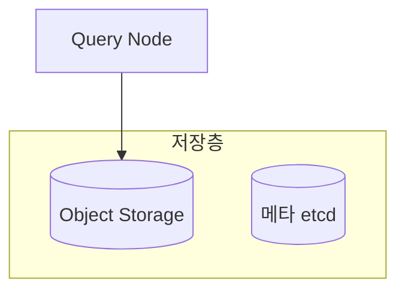

글의 문체·서사·구성 규칙. 본문 작성 단계에서 참조한다.

## 문체 가이드

좋은 예:
- "처음에 limits 없이 배포했다가 노드 전체가 NotReady가 됐다"
- "차트 소스를 직접 뜯어보고 나서야 원인을 찾았다"
- "이 설정에서 삽질을 꽤 했다"
- "`@StepScope`를 붙이면 Step이 실행될 때 빈을 만들기 때문에"

나쁜 예 (AI 티 남):
- "이 설정은 매우 중요합니다. 왜냐하면..."
- "다음과 같이 정리할 수 있습니다"
- "위의 내용을 종합하면"
- "우리 팀은 ~했습니다" (팀 전체 1인칭 복수 — 개인 블로그에 맞지 않음)

**1인칭 단수**로 작성한다. 한국어는 주어를 생략하는 게 자연스럽지만, 개인 블로그에서는 **"나는", "내가", "직접"** 같은 주어를 핵심 문장마다 명시해야 독자가 누구의 경험인지 느낀다.

좋은 예:
- "나는 처음에 limits 없이 배포했다가 노드 전체가 NotReady가 됐다"
- "내가 차트 소스를 직접 뜯어보고 나서야 원인을 찾았다"
- "이 설정에서 내가 삽질을 꽤 했다"

"우리 팀이 ~"는 쓰지 않는다.

### 자기 PR 톤 경계 — "내가 ~을 만들었다" → "왜 그렇게 했다"

사실 진술이어도 **채용 담당자에게는 자기 홍보로 읽힐 여지**가 있다. 사실 자체를 숨기지 말되, 동사 구성을 바꿔서 **의도와 학습 중심으로** 서술한다.

| ❌ 자기 PR 톤 | ✅ 의도 중심 |
|---|---|
| "기반 API를 만드는 데 시간을 썼다" | "다른 사람이 쉽게 얹을 수 있도록 API를 좁히는 감각이 이 작업에서 생겼다" |
| "나는 설계를 주도했다" | "이 결정은 내가 제안했고, 이유는 ~였다" |
| "내가 강하게 질문했다" | "이 질문의 답이 설계를 좌우했으므로 기획팀에 반드시 답을 받아냈다" |
| "성능을 N배 개선했다" | "왜 차이가 나는지 직접 측정해봤더니 N배 차이가 났다" |

## 회고와 협업 — 서사로 녹여 넣는다

기술 구조 설명만 있는 글은 "공식 문서를 잘 요약한 글"로만 보인다. 독자(잠재적 동료, 채용 담당자)가 이 글에서 알고 싶은 건 **"이 사람이 무엇을 선택했고, 누구와 어떻게 일했고, 지금은 어떻게 생각하는가"**다.

다음 세 요소를 다 담되, **섹션 제목으로 박지 않는 것을 기본값**으로 한다. `## 내 기여` / `## 협업 방식` / `## 지금 보면` 3종 세트로 쪼개면 "인터뷰 질문에 답변한 포트폴리오" 같은 톤이 되어 글의 서사가 깨진다. 본문에 자연스럽게 녹이고, 필요하면 하나의 서사형 섹션으로 통합한다.

### 담아야 할 세 요소

- **내가 한 것 / 의도**: 설계·제안·구현·삽질을 구분해서 드러냄. 단 **"내가 ~을 만들었다"보다 "왜 그렇게 했다"**를 앞세워 자기 PR 톤을 피함
- **협업이 설계에 미친 영향**: 어느 팀의 어떤 질문·요구가 구체적인 설계 결정을 바꿨는지. 인터페이스 계약, 리뷰 관행, PR 템플릿 같은 구체적 흔적
- **지금 보면 (짧게)**: 2~4문장. **라이브러리 업그레이드형 회고(KMS, 신버전 라이브러리 등)만 쓰면 피상적**이다. 설계 가정·비낙관 경로·전제 추적·운영에서 드러난 구멍 같은 **메타 관점**을 하나 이상 포함

### 섹션 구성 예시

**좋은 예 (서사 통합):**
```markdown
## 협업이 이 기능을 만들었다

이 기능은 나 혼자 만들 수 있는 게 아니었다. 기획팀에서 받은 건
"미션 수 상한 확정"이었다. 이 한 줄이 엔티티 스키마를 결정했다.
어드민팀과는 "테이블 이름 + 명령 타입" 두 필드로 계약을 단순화해서
캐시가 늘어나도 어드민은 enum 값 하나만 더하면 끝이었다.

## 지금 보면

임베디드 미션 컬럼 20개는 전제가 고정이라는 가정에서 만든 설계다.
운영이 길어진 뒤에도 그 전제가 지켜졌는지 추적하지 않았다는 게
회고 지점이다. 스키마 결정은 "그 전제가 깨졌을 때 마이그레이션
비용이 얼마인가"까지 포함해 평가했어야 한다.
```

**나쁜 예 (섹션 박제):**
```markdown
## 내 기여 범위
- 전체 설계: 내가 맡았다
- 백엔드 전 구간: 구현했다
- 어드민 연동: 설계

## 협업 흐름
- 기획팀: ...
- 어드민팀: ...
- 프론트팀: ...

## 지금 보면
- MASTER_KEY 관리: KMS로 갔을 것
- 라이브러리 버전: v5로 올렸을 것
```

후자는 정보 전달은 되지만 **이력서 bullet point**처럼 읽힌다. 블로그 글은 서사 흐름이 살아 있어야 한다.

## 얕은 주제 배제 룰

"블로그 글감"처럼 보여도 **실제로는 글로 남길 만큼 인사이트가 없는 주제**가 있다. 사용자가 후보로 올리더라도 이 기준에 해당하면 **"이러이러한 이유로 배제/후순위로 두겠다"를 먼저 설명**한 뒤 동의를 받는다.

### 얕음 시그널 (둘 이상이면 배제 검토)

1. **본인 커밋이 5~6개 이하**로 한정되고, 여러 repo에 흩어져 있지 않음
2. **결론이 클래식함**: "프론트 검증은 UX, 서버 검증은 보안이다" 같이 어느 교재에나 있는 결론
3. **기술적 변별점이 없음**: 라이브러리 기본값만 쓰거나, 도메인 특화 문제가 없음
4. **재사용 가능한 인사이트가 없음**: 해당 버그/이슈 맥락에서만 유효한 결론
5. **본인이 "이건 너무 단순한데"**라고 느낌

### 실행

- 후보 리스트업 시 각 주제 옆에 ⭐(★1~3) 어필도 표기
- 얕은 주제는 "배제" 또는 "후순위"로 명시하고 이유를 한 줄로 설명: "본인 커밋 5~6개로 가벼움. 결론이 클래식한 이중 검증 패턴이라 별도 글로는 약함. 회원가입 플로우 글을 따로 쓰게 되면 그때 흡수 추천"
- 사용자가 "그래도 쓰고 싶다"고 하면 진행. 배제는 기본값이고 사용자 판단이 우선

## 코드 예시 검증

**부정확한 코드 예시는 없는 것보다 나쁘다.** 코드를 작성하기 전에 반드시 실제 코드에서 확인한다.

```bash
# 클래스명 확인
grep -r "ClassName" /path/to/project/src --include="*.java" -l

# 메서드 시그니처 확인
grep -n "methodName" /path/to/file.java
```

**검증 규칙:**
- 클래스명, 메서드명, 필드명은 코드에서 grep으로 확인 후 기재 (단, L2 정책에 따라 비즈니스 도메인 고유 이름은 일반화해서 기재)
- 코드 블록의 로직이 실제 구현과 다르면 "개념 설명용 의사코드"임을 명시
- PR diff나 실제 파일을 직접 열어 확인한 내용만 코드 블록에 포함
- 기억에만 의존해서 코드를 "재현"하지 않는다

## 글 구성

필수 섹션:
- 왜 이걸 했는지 (배경 1~2줄) + 진행 기간
- 전체 구조/아키텍처
- 핵심 설정·흐름 설명 (L2 기준 코드 블록 포함)
- 트러블슈팅 경험 (표 또는 서술형)
- **(A) 내 기여 + (B) 협업 방식** 섹션 — 회고와 협업 규칙

선택 섹션:
- 삽질 포인트 강조 (> 인용구 활용)
- **(C) 지금 보면** 짧은 회고
- 마지막에 핵심 요약 없이 자연스럽게 끝내기

### 배치 순서 — 위에서 아래로 자연스럽게 읽히게

뒤 섹션의 용어·개념을 이해하려면 필요한 배경지식은, 그 뒤 섹션보다 **먼저** 배치한다. 비교표나 결론에서 반복 언급되는 개념(예: 특정 계산 공식, 왜 이 축이 중요한지)을 중간이나 끝에 매몰시켜 두면, 독자가 앞부분을 읽을 때는 그 개념을 모른 채로 표·용어를 봐야 하고, 나중에야 "아 그래서 그랬구나"하고 되돌아가 다시 읽게 된다.

편집 중간에 새 배경 설명을 추가할 때는 "일단 어딘가에 끼워 넣고 나중에 정리"하지 않는다. 그 내용이 실제로 어느 섹션들의 전제가 되는지 먼저 파악하고, 그 섹션들보다 앞에 배치한다. 초안을 다 쓴 뒤에도 전체를 한 번 위에서 아래로 읽어보며 "이 문장을 이해하려면 아직 안 나온 개념이 필요한가"를 점검한다(fos-study 사용자 피드백, 2026-07 — "중간에 어디론가 점프하는 것은 글로써 좋은 방향이 아니다").

### 다이어그램 — mermaid 적극 활용

구조·흐름·비교는 글로만 설명하지 말고 mermaid 다이어그램으로 그린다.
fos-study 블로그는 mermaid 를 렌더한다(기존 글 다수가 이미 사용).
본문 설명용 이미지 파일은 생성·저작권 문제로 지양하고 텍스트 기반 mermaid 를 쓴다.
글 카드용 대표 썸네일은 본문 다이어그램과 목적이 다르므로 [thumbnail-generation](./thumbnail-generation.md)의 생성·검증 규칙에 따라 예외로 허용한다.

언제 그리나:
- 아키텍처·컴포넌트 구조 → `flowchart TB` + subgraph 로 계층을 묶는다
- 데이터·요청 흐름(단계) → `flowchart LR` 또는 `sequenceDiagram`
- 계층·트리 구조 → `flowchart TD`
- 상태 전이 → `stateDiagram-v2`

원칙:
- 시각화가 이해를 돕는 곳(관계·흐름·구조)에만 쓴다. 단순 나열은 표·리스트로 두고 다이어그램으로 만들지 않는다(과용 금지).
- 아키텍처·시스템 글이면 최소 1개, 가능하면 2~3개를 목표로 한다.
- 노드 라벨은 한국어로 짧게. 코드펜스는 ```mermaid 로 연다.

예:


### 기여 정도에 따른 톤 조절

"내가 엄청 기여한 건 아닌데..." 같은 맥락이 주어지면 성과 강조가 아닌 **탐구/기록 톤**으로 쓴다.

나쁜 예: "성능을 N배 개선했다"
좋은 예: "왜 차이가 나는지 직접 측정해봤다", "이 부분을 정리해두고 싶어서 기록으로 남긴다"

### 트러블슈팅 서사 구조

단순히 "문제 → 해결"이 아니라 실제 현장의 흐름을 담는다.

임시방편이 있었던 경우:
```
발견 → 1차 임시방편 (왜 임시방편인지 명시) → 근본 원인 파악 → 근본 해결 → 결과
```

임시방편 없이 바로 해결한 경우:
```
발견 → 원인 분석 (왜 이게 문제인지 수치/코드로) → 해결 방안 탐색 → 적용 → 결과
```

임시방편이 있었다면 숨기지 않는다. "일단 힙을 늘렸다"는 사실이 독자에게 현실감을 준다. 어떤 구조든 **발견 → 분석 → 해결 → 결과**의 인과 흐름을 유지한다.

### 수치로 설득력 높이기

성능/메모리 관련 글에서는 구체적인 계산을 포함한다. "많다", "크다" 같은 표현보다 직접 계산한 수치가 독자가 규모를 체감하는 데 훨씬 효과적이다.

```
# 메모리 이슈
1억 건 × 8 bytes(Long) = 800MB (요청 1건)
4명 동시 = 800MB × 4 = 3.2GB

# 성능 이슈
기존: O(n) — n=100일 때 100번 탐색
개선: O(1) — 항상 2번 랜덤
```

이런 계산은 독자가 "왜 이게 문제인가"를 직관적으로 이해하게 만든다.

### 트레이드오프는 수치와 함께 판단 근거를 기록한다

알고리즘 교체, 방식 변경 시 발생하는 트레이드오프를 기록할 때 "허용 가능한 범위였다"는 말만 쓰지 않는다. **측정한 수치와 그 판단 이유**를 함께 남긴다.

좋은 예: "오차율을 측정했을 때 0.xx% 수준이었다. 변동성 지수 용도로는 감안할 수 있는 범위였고, 메모리 안정성을 얻는 편이 훨씬 중요했다."

## 케이스 B 깊이 사다리 — 심화 글 필수 게이트

외부 기술을 정리한 스터디 글(케이스 B)이 "공식 문서 요약"에서 멈추지 않게 하는 게이트다.
심화 글은 다음 4개 중 최소 3개를 채운다. 2개 이하면 입문 글로 두거나 후순위로 내린다.

1. **메커니즘** — 왜 그렇게 동작하는지 내부 수준까지 설명한다. "X가 Y를 개선한다"가 아니라 "X가 Z 때문에 Y를 개선한다".
2. **정량 트레이드오프** — 얻는 것과 잃는 것을 수식과 수치로 적는다. "빠르다"가 아니라 계산으로 규모를 보인다(`수치로 설득력 높이기` 참조).
3. **실패 모드** — 언제 깨지는지, 어떤 전제가 무너지면 이 방식이 무효인지 쓴다.
4. **언제 쓰지 말아야 하나** — 이 기술이 정답이 아닌 상황을 명시한다.

메커니즘 없이 결론만 있으면 독자도 작성자도 사고가 자라지 않는다.
이 4개가 요약 글과 심화 글을 가르는 선이다.

## 기술 주장 검증 — 외부 기술 글(케이스 B)

케이스 A가 코드를 grep으로 확인하듯, 케이스 B는 기술 주장을 1차 출처로 확인한다.
틀린 수식이나 수치는 없느니만 못하다.

- **1차 출처 우선** — 논문, 공식 docs, 원저장소를 먼저 본다. 개인 블로그는 교차검증용으로만 쓴다.
- **수식과 수치는 직접 검산** — 인용한 공식을 한 번 손으로 계산해 단위와 규모가 맞는지 확인한다.
- **추론, 실측, 인용을 구분** — 문장 단위로 근거를 밝힌다. "직접 재본 결과", "논문 기준", "여기서부턴 내 추론"을 섞지 않는다.
- **직접 안 해본 건 단정하지 않는다** — 품질 목표의 "출처와 겸손함"을 문장에서 지킨다.
