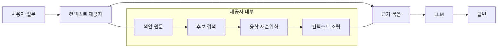
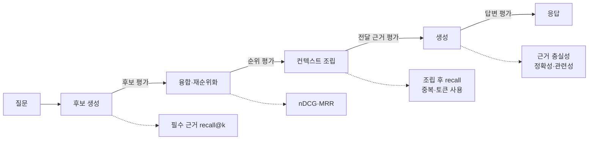
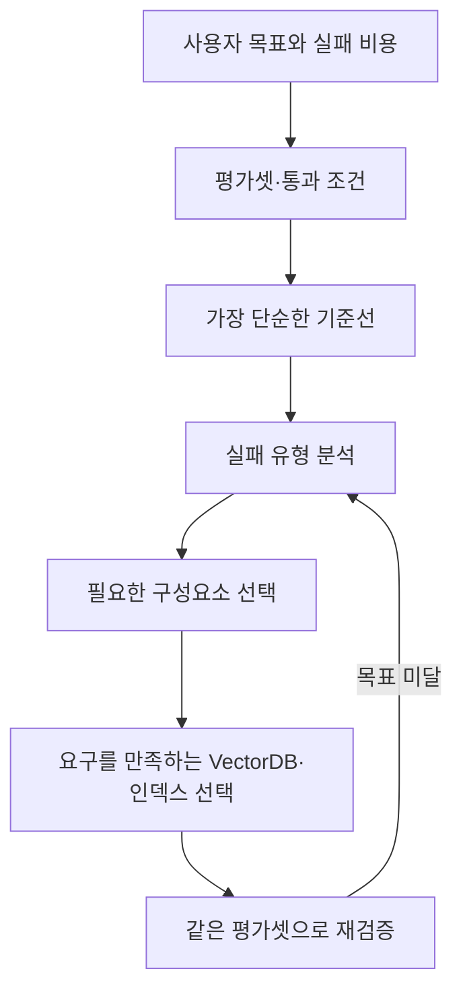

# RAG를 평가에서 역설계하기 — LLM을 위한 컨텍스트 제공자는 무엇을 잘해야 하는가

VectorDB와 임베딩 모델을 잘 고르면 RAG 품질도 좋아질 것이라고 생각했다.
지금도 그 생각이 틀렸다고 보지는 않는다.
좋은 검색 기반과 표현 모델은 여전히 중요하다.

다만 [정보 검색을 다룬 37가지 회고](https://www.leoniemonigatti.com/blog/what_i_learned.html)를 읽으며 빠진 질문 하나가 보였다.

**우리가 만드는 시스템은 무엇을 잘해야 하고, 그것을 어떤 평가 기준으로 증명할 것인가?**

지금까지는 VectorDB, 임베딩, HNSW, 하이브리드 검색, 재순위화를 각각 공부했다.
이제는 LLM 앞에서 이 구성요소들을 묶는 시스템을 **컨텍스트 제공자**(context provider)로 정의하고, 목표와 평가에서 구성을 역으로 설계해보려 한다.

> [벡터 DB 선택 기준](../../database/vectordb-comparison.md)과 [벡터 DB 벤치마크](../../database/vectordb-benchmark.md)가 제품과 ANN을 비교했다면, 이 글은 그 위에서 무엇을 최적화해야 하는지 묻는다.

이 글은 다음 질문에 답하기 위한 이정표다.

- 컨텍스트 제공자는 LLM에 무엇을 보장해야 하는가.
- 검색 품질과 최종 답변 품질을 왜 분리해서 평가해야 하는가.
- 평가 결과를 BM25, 벡터 검색, 필터, 재순위화, 청킹 같은 구성요소 선택으로 어떻게 연결할 것인가.

## 원문에서 남은 것은 검색 도구 목록이 아니었다

원문에는 BM25부터 벡터 검색, 임베딩, 필터, 재순위화, 청킹, 검색 평가까지 37가지 교훈이 나온다.
각 항목도 유용하지만, 내게 더 크게 남은 것은 항목 사이의 관계였다.

| 계층 | 원문에서 다룬 것 | 시스템에서 맡는 역할 |
| --- | --- | --- |
| 표현 | dense·sparse·multi-vector 임베딩 | 질문과 문서를 비교할 수 있는 형태로 만든다 |
| 후보 생성 | BM25, ANN, 메타데이터 필터 | 넓은 문서 집합에서 후보를 빠르게 찾는다 |
| 후보 정제 | 하이브리드 검색, 재순위화 | 의미와 키워드를 합치고 중요한 근거를 위로 올린다 |
| 컨텍스트 조립 | `top_k`, 청크 크기, 확장 문맥 | 제한된 토큰 안에 LLM이 실제로 읽을 근거를 만든다 |
| 평가 | precision, recall, MRR, nDCG | 각 단계가 목표에 도달했는지 확인한다 |

이 구조로 보면 벡터 검색은 RAG의 동의어가 아니다.
RAG의 `R`은 **검색**(retrieval)이고, 벡터 검색은 후보를 찾는 여러 방법 중 하나다.

이 글에서는 dense vector 검색을 중심으로 후보를 만드는 RAG를 편의상 **벡터 RAG**라고 부른다.
이 표현은 후보 생성 방식을 설명할 뿐, RAG 전체 아키텍처나 품질 목표를 뜻하지 않는다.

[BEIR 벤치마크](https://arxiv.org/abs/2104.08663)에서도 BM25는 강한 기준선이었다.
재순위화와 late interaction 계열은 평균적으로 높은 zero-shot 성능을 보였지만 계산 비용도 더 컸다.
따라서 “벡터냐 키워드냐”보다 “어떤 질문에서 어떤 조합이 목표를 만족하는가”가 더 정확한 질문이다.

## 컨텍스트 제공자를 하나의 컴포넌트로 본다

[RAG 원 논문](https://arxiv.org/abs/2005.11401)은 생성 모델의 매개변수 기억과 외부의 비매개변수 기억을 결합했다.
제품 관점에서 보면 두 기억 사이에 하나의 명시적인 경계가 생긴다.



이 관점에서 컨텍스트 제공자의 출력은 단순한 `List<String>`이 아니다.
LLM이 답을 만들 수 있도록 정리된 **근거 묶음**이다.

근거 묶음은 최소한 다음 정보를 가져야 한다.

- 질문에 답하는 데 필요한 내용
- 원문과 문서 식별자 같은 출처 정보
- 갱신 시각과 버전
- 접근 권한을 통과했다는 근거
- 검색 점수와 재순위화 점수
- LLM에 전달될 순서와 토큰 크기

여기서부터 성공 조건도 달라진다.
가까운 벡터를 빨리 찾는 것만으로는 충분하지 않다.

컨텍스트 제공자는 다음을 함께 만족해야 한다.

- **충분성**: 답에 필요한 근거가 빠지지 않는다.
- **집중도**: 불필요한 문서가 근거를 밀어내지 않는다.
- **추적 가능성**: 어떤 답이 어느 원문에서 왔는지 확인할 수 있다.
- **정합성**: 최신 문서와 권한 범위가 색인에 반영된다.
- **예산 준수**: 지연, 비용, 토큰 제한 안에서 동작한다.
- **무근거 감지**: 답할 근거가 없을 때 그 사실을 숨기지 않는다.

이 여섯 가지가 먼저고, VectorDB와 검색 방식은 이를 달성하기 위한 수단이다.

## 같은 recall도 무엇을 정답으로 삼느냐에 따라 다르다

기존 [벡터 DB 벤치마크](../../database/vectordb-benchmark.md)에서는 ANN의 `recall@k`를 측정했다.
완전탐색으로 구한 진짜 최근접 벡터와 ANN 결과가 얼마나 겹치는지 보는 값이다.

RAG 검색에서 필요한 재현율은 정답이 다르다.
가까운 벡터가 아니라 **답에 필요한 근거**를 얼마나 찾았는지 봐야 한다.

| 구분 | 정답 집합 | 답하는 질문 |
| --- | --- | --- |
| ANN recall | 완전탐색의 최근접 벡터 ID | 근사 인덱스가 정확한 벡터 검색을 얼마나 재현하는가 |
| evidence recall | 사람이 표시한 필수 근거 | 답에 필요한 정보를 얼마나 회수했는가 |
| context recall | LLM에 실제 전달된 필수 근거 | 토큰 제한과 조립을 거친 뒤에도 근거가 남았는가 |

ANN recall이 높아도 임베딩 공간에서 가까운 문서가 사용자의 의도와 관련 없을 수 있다.
반대로 ANN recall이 조금 낮더라도 필요한 근거가 안정적으로 들어오면 RAG 목표에는 충분할 수 있다.

따라서 `recall`이라는 지표 이름만 보고 같은 품질을 측정한다고 생각하면 안 된다.
**정답 집합이 무엇인지 먼저 적어야 지표가 의미를 가진다.**

## 최종 답변 하나만 평가하면 원인을 잃는다

RAG는 모듈형 시스템이다.
검색이 실패할 수도 있고, 검색은 성공했는데 LLM이 근거를 무시할 수도 있다.

최종 답변 정확도 하나로 평가하면 두 실패를 구분하지 못한다.

- 필요한 근거를 못 찾았는데 LLM의 내부 지식으로 우연히 맞힐 수 있다.
- 필요한 근거를 찾았는데 LLM이 잘못 읽어 틀릴 수 있다.
- 후보에는 근거가 있었지만 토큰 예산을 맞추는 과정에서 잘릴 수 있다.
- 답은 자연스럽지만 권한 밖 문서나 오래된 문서에 근거할 수 있다.

평가 지점을 컴포넌트 경계마다 두어야 한다.



[RAGAS](https://arxiv.org/abs/2309.15217)는 검색된 문맥의 관련성, 답변의 근거 충실성, 답변 관련성을 분리했다.
[ARES](https://arxiv.org/abs/2311.09476)도 문맥 관련성, 답변 충실성, 답변 관련성을 별도 판정하며 컴포넌트별 평가를 시도했다.
[RAGChecker](https://arxiv.org/abs/2408.08067)는 검색과 생성 모듈을 더 세밀한 진단 지표로 나눈다.

공통점은 전체 시스템을 하나의 점수로 뭉개지 않는다는 데 있다.

## 작은 예제로 평가 경계를 나눠본다

어떤 질문에 답하려면 근거 `A`와 `B`가 모두 필요하다고 하자.
후보 검색은 문서 다섯 개를 반환했고 그 안에 `A`, `B`가 모두 들어 있다.

```text
후보 검색 결과: [X, A, Y, B, Z]
필수 근거:      [A, B]
```

이때 후보 단계의 지표는 다음처럼 계산된다.

```text
evidence recall@5 = 2 / 2 = 1.0
candidate precision@5 = 2 / 5 = 0.4
```

검색은 필수 근거를 모두 찾았지만 잡음이 많다.
재순위화가 `A`, `B`를 앞으로 올리면 순위 품질은 좋아진다.

```text
재순위화 결과: [A, B, X, Y, Z]
```

그런데 컨텍스트 조립기가 토큰 제한 때문에 `A`만 LLM에 전달했다고 하자.

```text
LLM 전달 결과: [A]
context recall = 1 / 2 = 0.5
```

후보 검색의 재현율은 1.0이었지만, 컨텍스트 제공자로서의 재현율은 0.5가 됐다.
검색기만 보면 성공이고 시스템 경계를 보면 실패다.

여기에 LLM이 근거에 없는 `C`까지 답한다면 생성 단계의 근거 충실성도 실패한다.
이처럼 각 경계에서 값을 남겨야 어떤 구성요소를 바꿔야 하는지 알 수 있다.

## 평가 기준표는 목표와 실패 비용에서 시작한다

평가 기준표(rubric)를 만들 때 지표 목록부터 고르면 순서가 뒤집힌다.
먼저 사용자에게 어떤 실패가 가장 비싼지 정해야 한다.

예를 들어 사내 지식 검색이라면 다음 질문이 먼저다.

- 필요한 문서를 놓치는 것과 관련 없는 문서를 섞는 것 중 어느 쪽이 더 치명적인가.
- 근거가 없을 때 답하지 않는 것이 허용되는가.
- 최신성 지연을 몇 분 또는 몇 시간까지 허용할 수 있는가.
- 접근 권한 오류는 품질 저하인가, 즉시 실패해야 하는 안전 위반인가.
- 답변 속도와 품질 사이에서 허용할 예산은 얼마인가.

이 질문에 답한 뒤 평가를 네 묶음으로 나눈다.

### 통과 조건

가중 평균으로 상쇄하면 안 되는 조건이다.

| 목표 | 측정 예 | 기본 판정 |
| --- | --- | --- |
| 권한 보호 | 권한 밖 문서 노출률 | 한 건도 허용하지 않는 통과 조건 |
| 출처 추적 | 전달된 청크의 원문·버전 식별 가능 여부 | 누락 시 실패 |
| 색인 정합성 | 삭제·갱신 반영 지연 | 서비스가 정한 최신성 목표로 판정 |
| 예산 보호 | 최대 토큰, 시간 제한 초과 | 제한 초과 시 실패 또는 강등 |

### 검색 품질

후보 생성과 순위화가 필수 근거를 잘 찾는지 본다.

| 질문 | 지표 후보 |
| --- | --- |
| 필수 근거를 놓치지 않았는가 | evidence recall@k |
| 상위 후보에 유용한 문서가 집중됐는가 | candidate precision@k |
| 중요한 문서가 더 위에 있는가 | nDCG@k |
| 첫 정답이 얼마나 빨리 나오는가 | MRR |
| 질문 유형별 약점이 다른가 | 유형별 recall·precision |

모든 지표를 동시에 높이는 것이 목표는 아니다.
후보 생성 단계는 재현율을 우선하고, 비싼 재순위화 단계는 정밀도와 순위를 높이는 식으로 역할을 나눌 수 있다.

### 컨텍스트 조립 품질

검색 결과가 좋아도 LLM 입력으로 바꾸는 과정에서 품질이 다시 떨어질 수 있다.

| 질문 | 지표 후보 |
| --- | --- |
| 토큰 제한 뒤에도 필수 근거가 남았는가 | 조립 후 context recall |
| 같은 내용이 반복되는가 | 중복 청크 비율 |
| 잡음이 유용한 근거를 밀어내는가 | 불필요 토큰 비율 |
| 문서 순서에 따라 답이 흔들리는가 | 근거 위치별 정확도 |
| 작은 청크가 앞뒤 문맥을 잃었는가 | 단독 청크와 확장 문맥의 성능 차이 |

[Lost in the Middle](https://arxiv.org/abs/2307.03172)은 긴 컨텍스트를 제공한다고 모델이 모든 위치의 정보를 동등하게 쓰는 것은 아님을 보였다.
관련 문서 수를 늘려 검색 재현율을 높여도 답변 성능은 그보다 먼저 포화될 수 있었다.
따라서 `top_k`를 키우는 것은 단순한 품질 향상 손잡이가 아니다.

### 생성과 사용자 결과

컨텍스트 제공자 바깥의 지표도 함께 봐야 한다.
그래야 제공한 근거가 실제 답변에 기여했는지 알 수 있다.

| 질문 | 지표 후보 |
| --- | --- |
| 답변의 주장이 근거에 포함되는가 | 근거 충실성(faithfulness) |
| 질문에 맞는 답을 했는가 | 답변 관련성 |
| 정답 또는 필수 주장과 일치하는가 | 정확성, claim recall |
| 근거가 없을 때 답변을 거절하는가 | 무응답·거절 정확도 |
| 인용이 실제 원문을 지지하는가 | 인용 정합성 |

근거 충실성이 높다고 답이 참인 것은 아니다.
오래된 문서를 충실히 요약하면 근거에는 충실하지만 현실과는 틀릴 수 있다.
그래서 색인 정합성과 답변 정확성을 따로 본다.

## 하나의 종합 점수보다 통과 조건과 진단 지표를 둔다

초기부터 모든 항목에 가중치를 주고 `RAG 품질 82점`처럼 합치고 싶어질 수 있다.
하지만 가중치는 아직 정하지 못한 제품 우선순위를 숫자로 숨길 뿐이다.

권한 유출 한 건을 높은 검색 재현율로 상쇄할 수는 없다.
검색 지연이 짧다고 오래된 근거가 정답이 되는 것도 아니다.

초기 평가판은 다음 두 종류로 나누는 편이 낫다.

- **통과 조건**: 권한, 출처, 최신성, 예산처럼 위반 자체가 실패인 항목
- **진단 지표**: 재현율, 정밀도, 순위, 충실성처럼 구성 대안을 비교하는 항목

종합 점수는 실패 비용과 사용자 목표가 충분히 쌓인 뒤에 만들어도 늦지 않다.

## 평가 데이터는 실제 질문의 실패 형태를 담아야 한다

공개 벤치마크는 검색 방식의 일반적인 성질을 비교하는 데 유용하다.
하지만 우리 컨텍스트 제공자를 결정하는 것은 우리 문서와 질문이다.

평가셋은 적어도 다음 질문 유형을 나눠 가져야 한다.

- 고유명사, 오류 코드, 문서 번호처럼 정확한 문자열이 중요한 질문
- 표현은 다르지만 의미가 같은 질문
- 두 문서 이상의 근거를 합쳐야 하는 질문
- 날짜, 조직, 문서 종류 같은 메타데이터 조건이 있는 질문
- 접근 권한에 따라 정답 문서가 달라지는 질문
- 최신 문서만 정답이 되는 질문
- 저장소에 답이 없어 거절해야 하는 질문
- 오타나 구어체가 섞인 질문

각 평가 항목에는 다음 정보를 둔다.

```yaml
query: 사용자가 묻는 질문
query_type: semantic | exact | multi_hop | filtered | unanswerable
required_evidence:
  - source_id: 답에 반드시 필요한 문서
    required_claims: [필수 주장]
forbidden_sources: [권한 또는 최신성 때문에 나오면 안 되는 문서]
expected_behavior: answer | abstain
latency_budget_ms: 서비스 목표
token_budget: LLM 입력 한도
```

정답을 현재 청크 ID에만 묶으면 청킹 방식을 바꿀 때 평가셋도 함께 깨진다.
가능하면 원문 문서와 필수 주장 단위로 정답을 두고, 실행 시점의 청크가 그 주장을 포함하는지 판정한다.

실제 사용자 질문을 기본으로 삼고, 부족한 실패 유형만 합성 데이터로 보충한다.
합성한 질문과 정답 문서는 사람이 표본 검토해야 한다.

평가셋의 개수보다 중요한 것은 실패 유형별로 사례가 있고, 변경 뒤 같은 사례를 다시 실행할 수 있는가다.

## LLM 평가자는 자동화 도구이지 정답지가 아니다

RAGAS는 정답 답변 없이도 빠르게 평가할 수 있는 지표를 제안했다.
ARES는 합성 데이터와 소량의 사람 표기를 결합해 평가자를 보정했다.
이 접근은 반복 실험의 비용을 낮춘다.

하지만 LLM 평가 결과를 그대로 통과 조건으로 쓰면 평가자의 오류가 시스템 기준이 된다.
RAGChecker는 기존 자동 지표보다 사람 판단과 더 높은 상관을 보였다고 보고한다.
그 결과가 사람 평가를 완전히 대체한다는 뜻은 아니다.

골든셋, 회귀 검사, LLM 평가자, 사람 검토를 연결하는 일반적인 흐름은 [LLM 평가 프레임워크](../llm-evaluation-framework.md)에 별도로 정리했다.

그래서 평가 수단도 역할을 나눈다.

- 권한, 문서 버전, 인용 원문 존재 여부는 결정적인 코드로 검사한다.
- 필수 근거 recall은 사람이 표시한 문서·주장과 비교한다.
- 답변 충실성과 관련성처럼 의미 판단이 필요한 항목은 LLM 평가자로 확장한다.
- LLM 평가자는 사람이 표시한 작은 검증 집합과 정기적으로 일치도를 확인한다.
- 평가 프롬프트와 평가 모델 버전도 결과와 함께 기록한다.

평가자 자체도 교체 가능한 컴포넌트로 보는 편이 안전하다.

## 평가가 구성요소를 선택하게 만든다

평가가 준비되면 “무엇을 붙여야 하는가”가 증상에서 나온다.

| 관측된 실패 | 먼저 확인할 구성요소 |
| --- | --- |
| 문서 번호·오류 코드 질문을 놓친다 | BM25, tokenizer, exact match, sparse 검색 |
| 동의어·의역 질문을 놓친다 | 임베딩 모델, dense 검색, 질의 변환 |
| 두 유형을 번갈아 놓친다 | 하이브리드 검색과 결과 융합 |
| 필수 근거는 후보에 있지만 순위가 낮다 | 재순위화, RRF, 점수 정규화 |
| 권한·날짜 조건에서 결과가 새거나 사라진다 | 메타데이터 필터와 필터 적용 방식 |
| 필요한 문장이 청크 경계에서 잘린다 | 청크 전략, parent-child, sentence window |
| 후보에는 있었는데 LLM 입력에서 빠진다 | 컨텍스트 조립, 토큰 예산, 중복 제거 |
| 컨텍스트를 늘릴수록 답이 나빠진다 | `top_k`, 재순위화, 문서 순서, 잡음 제거 |
| 품질은 충분하지만 지연과 비용이 높다 | VectorDB, 인덱스, 양자화, 캐시 |
| 근거가 없는데도 답한다 | 임계값, 무응답 정책, 생성 프롬프트, 출력 검증 |

[OpenSearch로 RAG 검색 품질 높이기](../../database/opensearch/rag-search-quality.md)에서 정리한 하이브리드 검색, 재순위화, sentence window도 이 표 안에 들어온다.
세 기법을 모두 붙이는 것이 목표가 아니다.
각 기법이 해결해야 할 실패를 평가셋으로 재현하고, 개선 여부를 측정하는 것이 목표다.

아키텍처는 기능 목록이 아니라 **실패에 대한 가설 묶음**이 된다.

## VectorDB 비교의 의미도 달라진다

평가 중심으로 본다고 VectorDB의 중요성이 사라지는 것은 아니다.
VectorDB는 후보 생성의 처리량, 필터 표현력, 검색 기능, 데이터 관리, 운영 비용을 결정한다.

달라지는 것은 선택 순서다.



먼저 BM25나 현재 벡터 검색으로 기준선을 만든다.
어떤 질문에서 실패하는지 확인한 뒤 하이브리드 검색, 필터, 재순위화 같은 기능 요구가 나온다.
그 요구와 운영 예산을 만족하는 제품을 비교한다.

예를 들어 ANN 처리량이 열 배 높은 제품은 지연 목표가 병목일 때 강한 선택이다.
하지만 청킹 때문에 필수 근거가 애초에 색인되지 않았다면 처리량 차이는 답변 품질을 고치지 못한다.

VectorDB 비교는 여전히 필요하다.
다만 “어떤 제품이 가장 좋은가”가 아니라 **우리 평가 기준을 어떤 비용으로 만족하는가**를 비교해야 한다.

## 지금 세우려는 첫 번째 이정표

아직 어떤 검색 조합이 정답이라는 가치관은 없다.
대신 다음 순서로 판단을 쌓을 수는 있다.

- 컨텍스트 제공자의 입력과 출력 계약을 정의한다.
- 실제 질문과 실패 유형으로 작은 평가셋을 만든다.
- 후보 검색, 재순위화, 컨텍스트 조립, 생성 경계의 결과를 모두 기록한다.
- 현재 구성으로 기준선을 측정한다.
- 가장 큰 실패 한 종류를 고르고 구성요소 하나만 바꾼다.
- 같은 평가셋으로 품질, 지연, 비용 변화를 다시 잰다.

첫 평가판에서는 실행 순서뿐 아니라 다음 산출물을 남긴다.

- 질문 유형과 실패 비용을 정리한 평가 항목표
- 원문 문서와 필수 주장을 연결한 근거 라벨
- 권한, 최신성, 출처, 예산에 대한 통과 조건
- 후보, 재순위화 결과, 최종 컨텍스트를 잇는 추적 로그
- 구성별 점수보다 실패 유형을 먼저 보여주는 비교 보고서

이 과정이 반복되면 “하이브리드 검색이 좋다” 같은 일반론이 우리 시스템의 판단으로 바뀐다.

지금 내게 필요한 것은 VectorDB에 대한 믿음을 버리는 일이 아니다.
VectorDB와 임베딩이 좋다는 말을 **무엇이 얼마나 좋아졌을 때 참이라고 부를지** 정하는 일이다.

컨텍스트 제공자의 목표를 먼저 적고, 평가에서 컴포넌트를 역설계한다.
이것이 VectorDB 비교와 RAG 공부 다음에 놓을 이정표다.

## 참고 링크

### 저장소 안에서 이어 읽기

- [벡터 DB 어떻게 고를까](../../database/vectordb-comparison.md)
- [벡터 DB 5종을 실제로 벤치마크했다](../../database/vectordb-benchmark.md)
- [OpenSearch로 RAG 검색 품질 높이기](../../database/opensearch/rag-search-quality.md)
- [RAG 환각 제어](./hallucination-control.md)
- [LLM 평가 프레임워크](../llm-evaluation-framework.md)

### 외부 자료

- [37 Things I Learned About Information Retrieval in Two Years at a Vector Database Company](https://www.leoniemonigatti.com/blog/what_i_learned.html)
- [Retrieval-Augmented Generation for Knowledge-Intensive NLP Tasks](https://arxiv.org/abs/2005.11401)
- [BEIR: A Heterogeneous Benchmark for Zero-shot Evaluation of Information Retrieval Models](https://arxiv.org/abs/2104.08663)
- [RAGAS: Automated Evaluation of Retrieval Augmented Generation](https://arxiv.org/abs/2309.15217)
- [ARES: An Automated Evaluation Framework for Retrieval-Augmented Generation Systems](https://arxiv.org/abs/2311.09476)
- [RAGChecker: A Fine-grained Framework for Diagnosing Retrieval-Augmented Generation](https://arxiv.org/abs/2408.08067)
- [Lost in the Middle: How Language Models Use Long Contexts](https://arxiv.org/abs/2307.03172)
