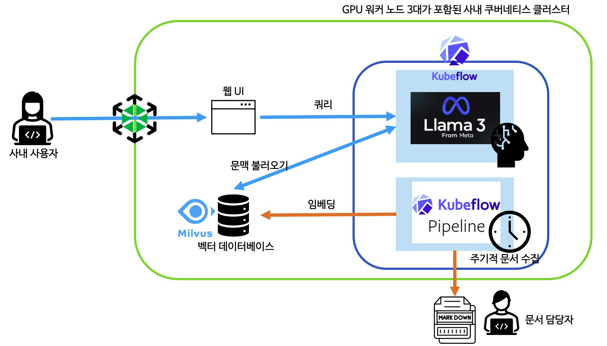

# RAG 기반 '사내 지식 챗봇' 이렇게 구축했습니다

- https://yozm.wishket.com/magazine/detail/3302/

- 많은 기업이 "문서는 많지만 원하는 답을 찾기 어렵다"는 문제를 겪는다
- 이를 해결하기 위해 한 팀은 RAG(Retrieval-Augmented Generation) 시스템을 쿠버네티스 기반으로 구축했다.
  - Kubeflow 파이프라인으로 문서를 자동 임베딩하고,
  - Milvus 벡터 DB로 검색한 뒤,
  - LLaMA 3 모델이 문맥에 맞는 답변을 생성하는 구조
- 답변은 단순히 내용을 제공하는 데 그치지지 않고 "사내 정책 문서 3.2절에 있습니다"처럼 근거까지 제시했다.
- 운영도 자동화되어 문서가 늘어나도 부담이 크지 않았다.

## 쿠버네티스 기반 RAG 시스템, 이렇게 만들었습니다

- RAG 시스템은 단순히 LLM에 사내 데이터를 붙이는 과정뿐만 아니라, 데이터 흐름 운영 자동화까지 고려해야하는 꽤 복잡한 구조
- 결국 쿠버네티스 환경에서, 임베딩 파이프라인, 벡터 검색, LLM 추론, UI까지 전 구성요소를 클러스터 내부에서 통합 운영할 수 있는 형태로 발전시킴

### 데이터 수집과 임베딩 자동화 : Kubeflow + LlamaIndex

- 사내 위키, Markdown 문서, 기술 블로그 등 여러 소스에서 새로운 데이터를 수집
- 수집된 문서는 문단 단위로 분할한 뒤, LlamaIndedx 라이브러릴 사용하여 벡터화
- 벡터는 오픈소스 벡터 DB인 Milvus에 저장되며, 전 과정을 Kubeflow Pipeline으로 자동화
- 문서 변경 시 재처리되며, 이 작업은 매일 새벽에 주기적으로 실행

### 질문에 맞는 문서 검색 : Milvus 벡터 DB

- 사용자가 챗봇에 질문을 입력하면, 해당 질문을 벡터로 변환하여 Milvus에 쿼리
- 쿼리 과정에서는 벡터 DB가 저장된 유사도가 가장 높은 문서들을 Top-K로 검색
- Milvus는 GPU 리소스를 사용할 수 있으며, 쿠버네티스 클러스터 내에서 안정적인 성능을 보여줌

### 답변 생성 : LLaMA 3 + KServe

- 검색된 문서를 기반으로 프롬프트를 구성하고, 질문과 함께 다시 LLaMA3 LLM에게 해당 내용을 전달
- LLM 모델은 KServe를 통해 쿠버네티스상에서 서빙되며, 추론을 담당한 쿠버네티스 파드는 GPU 리소스를 사용
- LLM 모델은 벡터 DB에서 검색된 내용을 토대로 사용자의 프롬프트에 알맞은 증강된 답변을 생성
- 각 마이크로 서비스 부하가 높아지면, 자동으로 파트와 노드 수를 늘리도록 스케일링 설정

### 최종 아키텍쳐

## 기술적 난관 극복하기

### 문서를 벡터로 변환하기 위한 프로세스

- 대부분의 중요 문서를 마크다운(Markdown) 형식으로 변환하기로 함
- 마크다운은 순수 텍스트에 가까워 불필요한 서식이 최소화되어 있으며, 토큰 효율성이 높아 LLM 같은 최신 모델들과도 잘 호환되는 장점이 있음
- 또한 구조가 명확하고 간결해, 문서의 논리흘므이나 섹션 구분, 표, 코드 등의 요소를 LLM이 더 쉽게 이해할 수 있음

- 반ㅁ녀 PDF, PPTX, DOCX와 같은 일반 문서를 그대로 벡터화하려면 내부 구조가 복잡하거나 텍스트가 단절되어 있어, 테그슽 자체는 벡터화 할 수 있더라도 문맥을 정확히 분석하기 어려운 단점이 있음
- 따라서 일반 문서를 마크다운(.md)로 변환할 떄, 제목, 강조 표현, 문서 구조 등의 요소를 얼마나 잘 보존하느냐가 RAG 시스템의 품질과 정확도에 직접적인 영향을 미침

- 가장 안정적이었던 조합은 변환 시 Marker와 MarkItDown을 함께 사용하는 방식

- Kubeflow로 문서 임베딩 파이프라인을 자동화했으므로, 마크다운 변환 단계 또한 해당 파이프라인에 포함하도록함
- 뭄ㄴ서 수집 단계에서 각 문서의 메타데이터 필드를 확인하고, 필수 필드가 누락된 문서는 우선 벡터화 대상에서 제외
- 작성자나 작성 날짜, 작성 목적 등이 빠진 문서는 신뢰도가 낮거나 임시 자료일 수 있으므로, 우선순위를 낮춤
- 품질 점수를 매겨서 5점 만점 중 5점 (모든 필드 있음)인 문서만 즉시 벡터화하고, 5점 미만은 보완 전까지 보류하는 식으로 정책을 세웠음
- 이렇게 1차 필터링하면 벡터 DB에 저품질 정보 유입을 막고, 검색 시 노이즈를 크게 줄일 수 있음

### RAG 응답 속도 개선하기

- 초기 테스트 단계에서는 일부 프롬프트에 대해 전체 애플리케이션 응답 시간이 최대 10초에 달하는 문제가 있었으며, 이를 2 ~ 3초 이내로 단축하기 위해 임베딩 -> 검색 -> 프롬프트 구성 -> LLM 생성에 이르는 전체 파이프라인의 단계별 최적화가 필요했음

- **청킹(chunking 전략 개선)**
  - 문서를 벡터화 할 떄 사용하는 청크 크기와 분할 방식을 검색 성능과 LLM 응답 품질에 모두 직접적인 영향을 줌
  - 초기에서는 문서를 문단 단위로 나눴지만, 문단마다 길이가 들쭉날쭉해 검색 효율이 떨어졌음
  - 이에 따라 한 청크 당 토큰 수를 일정하게 유지하는 방식으로 전환
  - 300 ~ 500 토큰 크기가 가장 균형 잡힌 결과를 보여줌
- **청크 분할 방식 개선**
  - 단순히 고정 길이로 자르는 것보다, 문맥 단위를 고려한 시맨틱 청크 분할이 더 효과적
  - 예를 들어, 슬라이드 한 장, 보고서의 섹션 하나, FAQ의 Q&A 한 쌍처럼 자연스러운 의미 단위로 나누면 LLM이 문서를 더 잘 이해하고 응답의 품질도 향상됨
- **Top-K 조절 및 재정렬 전략**
  - 벡터 검색 단계에서 LLM에 전달하는 문맥 조각 수인 Top-K 설정도 중요한 요소
  - 일반적으로 Top-5를 사용하는 경우가 많지만, 내부 실험 결과 K=4 전후가 속도와 정확도 측면에서 가장 효율적이었음
  - K를 늘리면 정답이 포함될 확률은 높아지지만, 입력 길이 증가로 인해 응답 시간이 늘어나고 노이즈도 함꼐 포함될 수 있었음
  - 반대로 K를 너무 줄이면 필요한 문맥을 놓칠 수 있기에, K=3 ~ 4 수준이 가장 합리적인 절충점이었음
- **기타 최적화**
  - 프롬프트 구성 간결화 및 지시문 정제
  - 벡터 DB 검색 결과 캐싱
  - LLM 응답 캐싱 및 세션 재사용
  - 복수 사용자의 동시 요청에 대한 임베딩 처리 비동기화

## 결과적으로 정확성과 확장성을 모두 었었음

- 문맥을 이해한 답변이 가능해짐
- 같은 질문이라도 프로젝트나 기간, 담당자에 따라 다른 답변이 필요한 경우가 있었는데, 컨텍스트 기반 생성 방식은 이런 미묘한 차이를 잘 반영해 줌

- 운영 측면에서도 이점이 많았음
- 임베딩 파이프라인이 자동화되어 있어 문서가 늘어나더라도 관리 부담이 거의 없었음
- GPU 추론 서버 역시 쿠버네티스의 오토스케일링 기능을 통해 안정적으로 유지
- 전체 구성이 컨테이너화되어 있어, 향후 LLM 교체나 멀티 클러스터 전환도 충분히 대응 가능한 구조

## RAG 기반, 정보 검색 시스템을 고려 중이라면?

- 가장 먼저 내부 문서의 품질과 구조를 점검해 볼 것, RAG의 핵심은 검색과 문맥에 있음
- 문서가 아무리 많아도 문단이 뒤섞여 있거나, 낮은 품질의 중복 문서가 많다면 정확도가 떨어질 수 밖에 없음
- 또한 문서 수집을 처음부터 복잡하게 시작하기보다는, 마크다운 형식의 단일 소스에서 작은 규모로 출발해 점차 확장하는 접근을 추천
- Kubeflow나 Milvus 같은 오픈소스 툴, 그리고 LangChain 등은 학습 곡선이 있지만, 환경을 구성하고 나면 안정성과 자동화 기능이 매우 뛰어남

## Q & A

### LLaMA 3 모델을 사용한 이유는 무엇인가요?

- 회사가 외국꼐 기업이다보니 다국어 처리 품질이 괜찮은 모델인 LLaMA로 적용함
- 후에 gpt-oss로 LLM 벤치마크를 해보니 결과적으로 한국어 응답에 대한 컨텐츠가 풍부해졌고, TPS(Tokens Per Second), TTFT(Time To First Token) 등의 성능 지표가 좋아서 변경 적용 중
- 물론 고사양 메모리의 GPU를 사용해야하는 단점도 있음
- 응답 품질이 확실히 좋아졌음을 체감함
