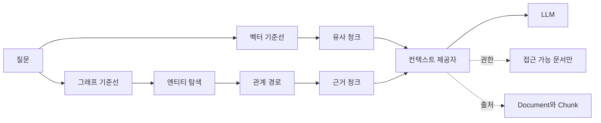

# Neo4j GraphRAG의 목표와 기준선

Neo4j GraphRAG를 공부하는 목표는 그래프를 예쁘게 만드는 것이 아니다.
관계형 질문에서 벡터 RAG가 놓친 근거를 권한과 출처를 보존한 컨텍스트로 제공하는 것이다.

[RAG를 평가에서 역설계하기](../evaluation-driven-context-provider.md)를 먼저 읽으면 좋다.
이 글은 그 평가 관점을 Neo4j GraphRAG 학습 프로젝트의 기준선으로 옮긴다.

핵심 질문은 세 가지다.

- 어떤 질문은 벡터 RAG만으로 충분하고, 어떤 질문은 그래프 탐색이 필요한가.
- `Service`, `API`, `Repository`, `ADR`, `Owner`, `Incident`, `Claim`, `Evidence`, `Document`, `Chunk` 모델은 어떤 컨텍스트를 보장해야 하는가.
- 그래프가 좋아졌다는 말을 어떤 기준선과 비교해야 믿을 수 있는가.

가져갈 판단 기준도 세 가지로 제한한다.

- 그래프는 **관계형 질문**의 필수 근거 회수율을 올릴 때만 도입한다.
- 컨텍스트는 원문 `Document`와 `Chunk`까지 추적되어야 한다.
- 권한 필터를 통과하지 못한 근거는 검색 점수가 높아도 컨텍스트가 아니다.

## 벡터 RAG가 약한 질문부터 고른다

벡터 RAG는 의미가 비슷한 청크를 빠르게 찾는 데 강하다.
문장 안에 답이 직접 들어 있거나, 비슷한 설명 문서를 찾으면 충분한 질문이라면 좋은 기준선이다.

하지만 사내 기술 문서에는 답이 한 청크에 닫히지 않는 질문이 많다.

- 특정 `API`가 장애를 낸 뒤 어떤 `Incident`와 `ADR`이 이어졌는가.
- 어떤 `Service`의 `Owner`가 바뀐 뒤 책임 저장소가 어떻게 달라졌는가.
- 문서의 `Claim`은 어떤 `Evidence` 청크에서 뒷받침되는가.
- 어떤 `Repository`가 폐기된 ADR을 아직 참조하는가.

이 질문은 "비슷한 문장"보다 "연결된 사실"을 요구한다.
벡터 검색은 후보 청크를 찾을 수 있지만, `API -> Service -> Owner -> Incident -> Evidence`처럼 경로를 따라가야 하는 보장은 약하다.

그래프를 붙이는 이유는 여기 있다.
그래프는 엔티티와 관계를 명시하고, 검색 결과를 관계 탐색으로 확장한 뒤, 마지막에는 다시 원문 청크로 내려간다.



이 흐름에서 Neo4j는 답변 생성기가 아니다.
컨텍스트 제공자가 근거 후보를 조립하기 전에 관계를 좁히는 저장소이자 질의 엔진이다.

## 성공 조건은 온톨로지가 아니라 컨텍스트다

[온톨로지에서 코딩 에이전트 컨텍스트까지](../../ontology-knowledge-graph-agent-context.md)에서는 온톨로지를 클래스와 관계의 계약으로 봤다.
이번 시리즈도 같은 전제를 둔다.

다만 이번 프로젝트의 성공 조건은 온톨로지 문서가 완성되는 것이 아니다.
다음 출력이 안정적으로 만들어져야 한다.

```json
{
  "question": "billing-api 장애 뒤에 바뀐 ADR과 근거 문서는 무엇인가?",
  "context": [
    {
      "claim_id": "claim:adr-42-retry-policy",
      "evidence_id": "evidence:incident-118:12",
      "chunk_id": "chunk:incident-118:12",
      "document_id": "doc:incident-118",
      "source_uri": "internal://incident/118",
      "allowed_groups": ["platform-oncall"],
      "path": ["API", "Service", "Incident", "ADR", "Evidence"]
    }
  ]
}
```

이 예시는 실행한 결과가 아니라 출력 계약을 설명하기 위한 일반화 예시다.
핵심은 `claim_id`, `evidence_id`, `chunk_id`가 분리된다는 점이다.
에이전트는 그래프에서 관계를 탐색하지만, 답변의 마지막 근거는 원문 `Chunk`로 돌아가야 한다.

`Claim`은 문서에서 추출한 주장이다.
`Evidence`는 그 주장을 뒷받침하는 원문 조각이다.
`Document`와 `Chunk`는 출처와 권한을 보존하는 바닥 계층이다.
그래프 관계는 이 계층을 우회하면 안 된다.

## 기준선은 최소 두 개가 필요하다

GraphRAG를 도입할 때 가장 쉬운 실수는 "그래프를 썼으니 좋아졌을 것"이라고 보는 것이다.
비교군이 없으면 비용만 늘어난 시스템이 될 수 있다.

나는 처음 기준선을 두 개로 나누겠다.

| 기준선 | 구성 | 확인할 질문 |
| --- | --- | --- |
| 벡터 기준선 | `Chunk` 임베딩 검색 뒤 상위 k개 전달 | 의미가 비슷한 근거를 충분히 찾는가 |
| 그래프 기준선 | 엔티티 매칭 뒤 관계 탐색과 청크 회수 | 관계형 필수 근거를 더 잘 찾는가 |

정량 기준은 복잡하게 시작하지 않는다.
질문 30개를 만들고, 질문마다 필수 `Evidence` 청크를 사람이 표시한다.
그다음 다음 지표만 본다.

| 지표 | 계산 | 실패 해석 |
| --- | --- | --- |
| 필수 근거 재현율 | 전달된 필수 근거 수 / 전체 필수 근거 수 | 관계 탐색이나 후보 생성이 빠뜨렸다 |
| 권한 위반 수 | 전달된 권한 밖 근거 수 | 컨텍스트 제공자 계약을 깨뜨렸다 |
| 출처 누락 수 | `Document` 또는 `Chunk` 없는 근거 수 | 답변 검증이 불가능하다 |

예를 들어 질문 30개에 필수 근거가 모두 60개 있다고 하자.
벡터 기준선이 36개를 전달하고, 그래프 기준선이 48개를 전달했다면 필수 근거 재현율은 각각 0.60과 0.80이다.
하지만 그래프 기준선이 권한 밖 근거를 1개라도 전달했다면 그 개선은 보류한다.

권한과 출처는 품질 점수가 아니라 통과 조건이다.

## 비용은 엣지 수에서 먼저 터진다

그래프는 관계를 많이 넣을수록 좋아 보인다.
하지만 관계 수는 곧 질의 비용과 검증 비용이 된다.

단순 계산을 해보자.

- 문서 1,000개
- 문서당 청크 20개
- 청크당 추출 엔티티 8개
- 엔티티 간 후보 관계 6개

이 조건이면 `Chunk`는 20,000개다.
청크와 엔티티 연결만 160,000개가 생긴다.
후보 관계를 모두 저장하면 관계 후보는 120,000개가 더 붙는다.

여기서 모든 관계를 믿고 탐색하면 컨텍스트 제공자는 잡음을 늘린다.
따라서 초반에는 관계를 많이 저장하는 것보다 관계의 용도를 제한해야 한다.

- `OWNS`는 권한 필터에 직접 쓰인다.
- `IMPLEMENTS`는 `Service`와 `Repository` 연결에 쓰인다.
- `MENTIONS`는 후보 확장에만 쓰이고, 최종 근거가 되지는 않는다.
- `SUPPORTED_BY`는 `Claim`에서 `Evidence`로 내려가는 검증 경로다.

관계마다 용도가 없으면 그래프는 검색 품질을 올리지 않고 탐색 공간만 키운다.

## 실패 모드를 먼저 적는다

이 프로젝트에서 가장 위험한 실패는 세 가지다.

| 실패 모드 | 증상 | 방지선 |
| --- | --- | --- |
| 관계 환각 | LLM이 문서에 없는 `DEPENDS_ON` 관계를 만든다 | `Evidence` 없는 관계는 최종 컨텍스트에 쓰지 않는다 |
| 권한 누수 | 접근 불가 문서의 청크가 경로 확장 중 섞인다 | `Document` 기준 권한 필터를 컨텍스트 조립 전에 적용한다 |
| 출처 단절 | 엔티티는 맞지만 원문 청크가 사라진다 | 모든 `Claim`은 `SUPPORTED_BY`로 `Evidence`에 연결한다 |

Neo4j의 그래프 질의는 강력하지만, 그래프에 들어간 사실의 품질을 자동으로 보장하지 않는다.
이 프로젝트에서는 관계를 발견하는 단계와 관계를 근거로 채택하는 단계를 분리한다.

## 언제 쓰지 말아야 하는가

다음 조건이면 Neo4j GraphRAG부터 시작하지 않는 편이 낫다.

- 질문이 대부분 단일 문서 FAQ다.
- 원문 문서에 안정적인 식별자와 접근 권한 메타데이터가 없다.
- 문서가 너무 자주 바뀌는데 증분 동기화 전략이 없다.
- 평가 질문과 필수 근거를 표시할 사람이 없다.
- 관계 탐색 결과를 받아도 제품 흐름에서 쓸 곳이 없다.

특히 권한 모델이 없는 그래프는 사내 문서 RAG에서 위험하다.
문서 검색보다 더 설득력 있는 방식으로 잘못된 근거를 내보낼 수 있기 때문이다.

## 작은 실습

실습 목표는 벡터 기준선과 그래프 기준선이 답해야 할 질문을 분리하는 것이다.
Neo4j를 아직 띄우지 않아도 된다.

재현 단계다.

- 사내 기술 문서 대신 공개 가능한 예시 문서 10개를 고른다.
- 각 문서를 `Document`와 `Chunk`로 나누고, 청크마다 `chunk_id`, `document_id`, `source_uri`, `allowed_groups`를 적는다.
- 질문 10개를 만든다.
- 각 질문을 "단일 청크 의미 검색", "여러 엔티티 관계 탐색", "권한 검증" 중 하나로 분류한다.
- 질문마다 필수 `Evidence` 청크를 1개 이상 표시한다.

확인할 결과다.

- 관계 탐색형 질문이 최소 3개 있어야 한다.
- 모든 필수 근거는 `Document`와 `Chunk` 식별자를 가져야 한다.
- 권한 그룹이 비어 있는 문서는 최종 컨텍스트 후보에서 제외되어야 한다.

실패 판정이다.

- 질문 대부분이 단일 청크 검색이면 GraphRAG 실습 주제가 아니다.
- 필수 근거를 사람이 지정할 수 없으면 평가 기준선이 없다.
- `Document` 권한을 청크로 전파할 방법이 없으면 사내 컨텍스트 제공자로 쓰기 어렵다.

## 다음 글

다음 글에서는 이 기준선을 만족시키기 위해 `Service`, `API`, `Repository`, `ADR`, `Owner`, `Incident`, `Claim`, `Evidence`, `Document`, `Chunk`를 Neo4j 속성 그래프로 어떻게 모델링할지 본다.

- [속성 그래프와 온톨로지 모델링](./02-property-graph-ontology-modeling.md)

## 참고 링크

- Neo4j Getting Started: https://neo4j.com/docs/getting-started/
- Neo4j data modeling tutorial: https://neo4j.com/docs/getting-started/data-modeling/tutorial-data-modeling/
- Neo4j modeling designs: https://neo4j.com/docs/getting-started/data-modeling/modeling-designs/
- Neo4j GraphRAG for Python: https://neo4j.com/docs/neo4j-graphrag-python/current/index.html
- Neo4j GraphRAG RAG guide: https://neo4j.com/docs/neo4j-graphrag-python/current/user_guide_rag.html
- W3C RDF 1.1 Concepts: https://www.w3.org/TR/rdf11-concepts/
- W3C OWL 2 Primer: https://www.w3.org/TR/owl2-primer/
