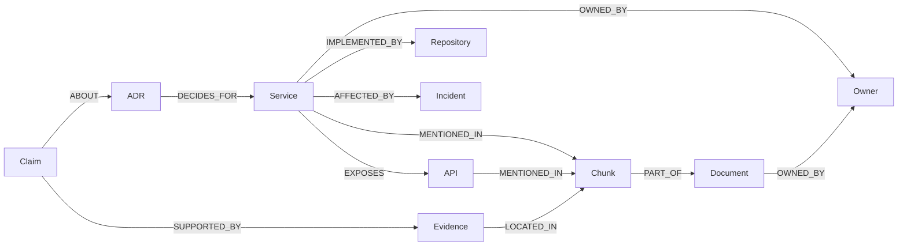

# 속성 그래프와 온톨로지 모델링

Neo4j 모델링은 명사를 라벨로 옮기는 작업이 아니다.
컨텍스트 제공자가 답해야 할 질문을 먼저 고르고, 그 질문에 필요한 경로만 속성 그래프로 고정하는 작업이다.

> 이전 글: [Neo4j GraphRAG의 목표와 기준선](./01-goal-and-baseline.md)

[온톨로지에서 코딩 에이전트 컨텍스트까지](../../ontology-knowledge-graph-agent-context.md)를 먼저 읽으면 좋다.
이 글은 그 온톨로지 관점을 Neo4j 속성 그래프에 맞춰 줄이는 단계다.

이 글은 세 질문에 답한다.

- RDF나 OWL처럼 정식 의미 웹 모델을 쓰지 않고도 시작할 수 있는가.
- `Service`, `API`, `Repository`, `ADR`, `Owner`, `Incident`, `Claim`, `Evidence`, `Document`, `Chunk`는 각각 노드인가, 속성인가, 관계인가.
- 모델을 어디까지 열어두고 어디부터 제약해야 하는가.

가져갈 판단 기준은 세 가지다.

- 질문 경로에 등장하지 않는 개념은 첫 모델에 넣지 않는다.
- 권한과 출처는 모든 경로가 돌아와야 하는 바닥 노드로 둔다.
- 관계에 설명이 많이 붙으면 중간 노드로 승격한다.

## RDF와 속성 그래프를 섞어 생각하지 않는다

W3C RDF 1.1은 그래프를 주어, 술어, 목적어로 이루어진 triple 집합으로 정의한다.
OWL 2는 클래스, 속성, 개체, 공리를 통해 더 명시적인 의미와 추론 규칙을 둔다.

이 방식은 웹 전체의 식별자, 외부 어휘 재사용, 논리 추론이 중요할 때 강하다.
하지만 이번 프로젝트의 첫 목표는 공개 지식 통합이 아니다.
사내 기술 문서에서 관계형 질문의 근거를 찾고, 권한과 출처를 보존한 컨텍스트를 만드는 것이다.

Neo4j의 속성 그래프는 이 목표에 더 직접적이다.

| 모델 | 기본 단위 | 이 프로젝트에서의 의미 |
| --- | --- | --- |
| RDF | triple | 외부 어휘와 의미 웹 호환이 중요할 때 검토한다 |
| OWL | class, property, individual, axiom | 추론과 엄격한 의미 제약이 필요할 때 검토한다 |
| Neo4j 속성 그래프 | node, relationship, label, property | 관계 탐색과 원문 근거 회수부터 시작할 때 쓴다 |

Neo4j n10s는 RDF와 Neo4j를 연결하는 선택지다.
하지만 이 시리즈의 핵심 도구는 아니다.
처음부터 RDF를 가져오는 것이 아니라, 컨텍스트 제공자가 답할 질문을 Cypher로 재현할 수 있는지 확인하는 쪽이 먼저다.

## 질문에서 노드와 관계를 뽑는다

Neo4j 공식 데이터 모델링 튜토리얼은 먼저 도메인과 사용 사례 질문을 정의하라고 안내한다.
이 프로젝트도 같은 순서로 간다.

예시 질문은 이렇다.

- `payment-api` 장애 뒤에 수정된 ADR은 무엇인가.
- 특정 `Repository`가 담당하는 `Service`와 `Owner`는 누구인가.
- 어떤 `Claim`이 어떤 `Evidence`와 문서 청크에서 뒷받침되는가.
- 접근 권한이 없는 문서를 제외하면 남는 근거는 무엇인가.

이 질문에서 첫 모델이 나온다.

이 모델의 중심은 `Service`가 아니다.
중심은 질문에서 최종 근거로 내려가는 경로다.

`Service`, `API`, `Repository`, `ADR`, `Owner`, `Incident`는 관계 탐색을 위한 도메인 노드다.
`Document`, `Chunk`, `Claim`, `Evidence`는 출처와 검증을 위한 근거 노드다.

## 노드와 속성의 경계

처음 모델링할 때 가장 자주 흔들리는 부분은 노드와 속성의 경계다.
기준은 간단하다.

| 후보 | 노드로 둔다 | 속성으로 둔다 |
| --- | --- | --- |
| `Owner` | 여러 서비스와 문서 권한에 연결된다 | 단순 표시 이름만 필요하다 |
| `API` | 장애, 서비스, 문서에서 반복 참조된다 | 엔드포인트 문자열만 필터링한다 |
| `Claim` | 여러 근거와 검증 상태를 가진다 | 문서 본문 안의 문장일 뿐이다 |
| `Evidence` | 답변 인용과 평가 정답이 된다 | 청크 전체가 곧 근거다 |

관계도 같은 기준을 적용한다.
관계에 붙는 속성이 많아지고, 그 관계 자체를 다른 노드가 참조하기 시작하면 중간 노드가 필요하다.

예를 들어 `Incident`와 `Service` 사이의 단순 영향 관계라면 `(:Service)-[:AFFECTED_BY]->(:Incident)`로 충분하다.
하지만 영향도가 여러 단계이고, 근거 문서와 판단자가 붙는다면 `ImpactAssessment` 같은 중간 노드가 더 낫다.

Neo4j 공식 모델링 문서도 관계에 많은 정보를 담아야 할 때 중간 노드를 쓰는 패턴을 소개한다.
이 프로젝트에서는 `Claim`과 `Evidence`가 그 중간 노드 역할을 한다.

## 권한과 출처는 모델 바닥에 둔다

사내 문서 GraphRAG에서 권한은 나중에 붙이는 필터가 아니다.
처음 모델에 들어가야 한다.

권장 속성은 최소한 이 정도다.

| 라벨 | 식별 속성 | 필수 속성 |
| --- | --- | --- |
| `Document` | `document_id` | `source_uri`, `source_hash`, `allowed_groups`, `updated_at` |
| `Chunk` | `chunk_id` | `document_id`, `text`, `chunk_index` |
| `Evidence` | `evidence_id` | `chunk_id`, `quote_start`, `quote_end` |
| `Claim` | `claim_id` | `text`, `confidence`, `extracted_at` |

`allowed_groups`를 `Chunk`마다 복제할 수도 있다.
이 방식은 검색 후 권한 필터를 빠르게 적용하는 데 유리하다.
대신 문서 권한이 바뀔 때 청크 전체를 갱신해야 한다.

반대로 권한을 `Document`에만 두면 갱신은 단순하다.
대신 모든 컨텍스트 조립 질의가 `Chunk -> Document` 경로를 반드시 따라가야 한다.

초기 학습 프로젝트에서는 `Document`를 권한의 원천으로 두고, 성능 문제가 확인될 때만 청크 복제를 검토하는 편이 낫다.
출처 원천이 하나라야 실패를 추적하기 쉽다.

## 정량 트레이드오프를 작게 계산한다

관계 그래프의 비용은 노드보다 관계에서 빨리 커진다.

예를 들어 문서 500개가 있고, 문서당 청크가 12개라고 하자.
청크는 6,000개다.
청크마다 평균 5개의 엔티티를 연결하면 `MENTIONS` 관계만 30,000개가 생긴다.

여기에 엔티티 사이의 후보 관계를 청크당 4개씩 만들면 24,000개가 더 생긴다.
결국 첫 실습만으로도 관계 54,000개가 된다.

이 수치는 크지 않다.
하지만 문제는 절대량이 아니라 잡음 비율이다.
후보 관계 정확도가 80%라면 잘못된 관계가 10,800개다.
컨텍스트 제공자 입장에서는 10,800개의 잘못된 경로가 생긴 셈이다.

따라서 초반 모델은 다음처럼 나눠야 한다.

- 최종 컨텍스트 경로에 쓰는 관계
- 후보 확장에만 쓰는 관계
- 관찰과 디버깅용으로만 쓰는 관계

`MENTIONS`는 후보 확장용이다.
`SUPPORTED_BY`, `LOCATED_IN`, `PART_OF`는 최종 근거 경로다.
두 관계를 같은 신뢰도로 다루면 안 된다.

## 실패 모드

모델링 단계의 실패는 대개 나중에 검색 실패로 보인다.

| 실패 모드 | 원인 | 나중 증상 |
| --- | --- | --- |
| 라벨 폭발 | 문서에서 나온 명사를 모두 라벨로 만든다 | Cypher가 복잡해지고 평가 질문과 연결되지 않는다 |
| 관계 과신 | LLM 추출 관계를 검증 없이 채택한다 | 경로는 그럴듯하지만 원문 근거가 없다 |
| 출처 분리 | 엔티티 그래프와 원문 청크 그래프가 따로 논다 | 답변에 인용할 수 있는 청크가 없다 |
| 권한 후처리 | 검색 뒤 문자열 필터로 권한을 처리한다 | 경로 확장 중 권한 밖 정보가 이미 섞인다 |

가장 치명적인 것은 출처 분리다.
그래프가 아무리 잘 이어져도 `Evidence -> Chunk -> Document`로 내려가지 못하면 컨텍스트 제공자가 아니다.

## 언제 쓰지 말아야 하는가

다음 상황에서는 속성 그래프 모델링이 과하다.

- 문서 수가 작고, 관계형 질문이 거의 없다.
- 조직 권한이 단순해서 문서 전체 공개와 비공개만 구분하면 된다.
- 엔티티 식별자가 안정적이지 않아 같은 `Service`를 매번 다르게 부른다.
- 그래프를 검증할 평가 질문을 만들 시간이 없다.

특히 엔티티 식별자가 흔들리면 그래프는 중복 노드를 만든다.
이 경우에는 Neo4j보다 먼저 서비스 카탈로그, 저장소 메타데이터, 문서 식별자 정리가 필요하다.

## 작은 실습

실습 목표는 첫 속성 그래프 모델을 종이에 가까운 수준으로 고정하는 것이다.

재현 단계다.

- 공개 가능한 문서 10개에서 `Service`, `API`, `Repository`, `ADR`, `Owner`, `Incident` 후보를 표시한다.
- 각 문서를 `Document`와 `Chunk`로 나누고 `document_id`, `chunk_id`, `source_uri`, `allowed_groups`를 부여한다.
- 각 문서에서 주장 문장 10개를 골라 `Claim`으로 적는다.
- 각 `Claim`마다 원문 청크의 짧은 근거를 `Evidence`로 연결한다.
- 질문 10개가 어떤 경로를 타야 답할 수 있는지 손으로 적는다.

확인할 결과다.

- 모든 질문은 최소 하나의 `Evidence -> Chunk -> Document` 경로로 끝나야 한다.
- 모든 `Chunk`가 권한 원천인 `Document.allowed_groups`로 돌아가야 한다.
- 관계마다 "최종 근거", "후보 확장", "디버깅" 중 하나의 용도가 적혀야 한다.

실패 판정이다.

- `Claim`은 있는데 `Evidence`가 없으면 모델이 답변 검증을 못 한다.
- `MENTIONS`만 많고 `SUPPORTED_BY`가 적으면 그래프가 검색 잡음에 가깝다.
- 질문 경로를 손으로 설명할 수 없으면 Cypher를 작성해도 유지하기 어렵다.

## 다음 글

다음 글에서는 이 모델을 Cypher 제약, 인덱스, 실행 계획으로 안정화하는 방법을 본다.

- [Cypher, 제약, 쿼리 계획으로 검색 안정화하기](./03-cypher-constraints-query-plans.md)

## 참고 링크

- Neo4j data modeling tutorial: https://neo4j.com/docs/getting-started/data-modeling/tutorial-data-modeling/
- Neo4j modeling designs: https://neo4j.com/docs/getting-started/data-modeling/modeling-designs/
- Neo4j relational to graph modeling: https://neo4j.com/docs/getting-started/data-modeling/relational-to-graph-modeling/
- Neo4j Cypher patterns: https://neo4j.com/docs/cypher-manual/current/patterns/reference/node-and-relationship-patterns/
- Neo4j Cypher graph types: https://neo4j.com/docs/cypher-manual/current/schema/graph-types/
- W3C RDF 1.1 Concepts: https://www.w3.org/TR/rdf11-concepts/
- W3C RDF Schema 1.1: https://www.w3.org/TR/rdf-schema/
- W3C OWL 2 Primer: https://www.w3.org/TR/owl2-primer/
- Neo4j Neosemantics: https://neo4j.com/docs/labs/nsmntx/current/
