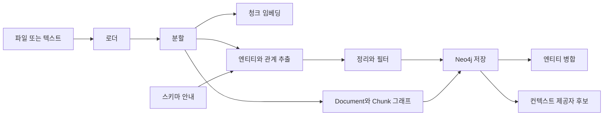

# 문서에서 근거를 보존한 지식 그래프 구축하기

Neo4j GraphRAG Python의 KG Builder는 문서를 그래프로 만드는 출발점이지만, 아직 실험적 기능이다.
그래서 이 글의 목표는 패키지를 믿고 맡기는 것이 아니라, 어떤 단계에서 어떤 품질 게이트를 끼워 넣을지 읽는 것이다.

> 이전 글: [Cypher, 제약, 쿼리 계획으로 검색 안정화하기](./03-cypher-constraints-query-plans.md)

Neo4j GraphRAG Python 문서는 `neo4j-graphrag` 패키지를 공식 패키지로 설명하고, 예전 `neo4j-genai`는 deprecated라고 안내한다.
Neo4j 지원 버전은 Neo4j 5.18.1 이상과 Neo4j 2026.01 이상을 포함한다.
이 글은 현재 문서 기준으로 쓰지만, KG Builder API는 바뀔 수 있다는 전제를 둔다.

이 글은 세 질문에 답한다.

- KG Builder 파이프라인은 문서를 어떤 단계로 그래프에 넣는가.
- `Document`, `Chunk`, `Claim`, `Evidence` 출처 모델을 어느 단계에서 보강해야 하는가.
- 실험적 기능을 학습 프로젝트에서 어디까지 믿어도 되는가.

가져갈 판단 기준은 세 가지다.

- `SimpleKGPipeline`은 빠른 시작용이고, 운영 계약은 컴포넌트 경계에서 검증한다.
- schema guidance는 LLM 출력을 돕지만 데이터베이스 제약을 대체하지 않는다.
- KG Builder가 만든 그래프도 최종 컨텍스트 전에 권한과 출처 게이트를 통과해야 한다.

## 파이프라인을 단계로 읽는다

공식 KG Builder 문서는 비정형 데이터에서 Knowledge Graph를 만들기 위해 여러 컴포넌트를 둔다.
문서 로더, 텍스트 분할기, 청크 임베더, 스키마 빌더가 앞단을 담당한다.
어휘 그래프 빌더, 엔티티·관계 추출기, 그래프 정리기, 저장기, 엔티티 식별기가 뒤를 잇는다.

이 구성은 컨텍스트 제공자 관점에서 다음처럼 읽힌다.



여기서 내가 가장 먼저 확인할 단계는 `Document`와 `Chunk` 그래프다.
공식 문서는 어휘 그래프가 `Document` 노드, `Chunk` 노드, `NEXT_CHUNK`, `FROM_DOCUMENT` 관계를 만든다고 설명한다.
이 구조는 RAG에서 앞뒤 청크를 붙이는 데도 쓸 수 있다.

다만 이 시리즈의 모델은 `Evidence -> Chunk -> Document` 경로가 필요하다.
따라서 KG Builder의 기본 관계와 속성을 그대로 쓰지 않고 공통 계약에 맞춘다.

## `SimpleKGPipeline`은 빠른 시작점이다

공식 문서는 `SimpleKGPipeline`으로 시작하는 예시를 제공한다.
아래 코드는 공식 예시의 형태를 이 시리즈 맥락에 맞게 줄인 일반화 예시다.
아직 실행하지 않았으므로 실측 결과로 읽으면 안 된다.

```python
from neo4j_graphrag.experimental.components.types import LexicalGraphConfig
from neo4j_graphrag.experimental.pipeline.kg_builder import SimpleKGPipeline

schema = {
    "node_types": [
        {
            "label": "Service",
            "properties": [
                {"name": "service_id", "type": "STRING"},
                {"name": "name", "type": "STRING"},
            ],
        },
        {
            "label": "API",
            "properties": [
                {"name": "api_id", "type": "STRING"},
                {"name": "path", "type": "STRING"},
            ],
        },
        {
            "label": "Repository",
            "properties": [
                {"name": "repository_id", "type": "STRING"},
                {"name": "name", "type": "STRING"},
            ],
        },
        {
            "label": "ADR",
            "properties": [
                {"name": "adr_id", "type": "STRING"},
                {"name": "title", "type": "STRING"},
            ],
        },
        {"label": "Incident", "properties": [{"name": "incident_id", "type": "STRING"}]},
        {
            "label": "Claim",
            "properties": [
                {"name": "claim_id", "type": "STRING"},
                {"name": "text", "type": "STRING"},
            ],
        },
    ],
    "relationship_types": [
        "EXPOSES",
        "IMPLEMENTED_BY",
        "DECIDES_FOR",
        "AFFECTED_BY",
        "ABOUT",
    ],
    "patterns": [
        ("Service", "EXPOSES", "API"),
        ("Service", "IMPLEMENTED_BY", "Repository"),
        ("ADR", "DECIDES_FOR", "Service"),
        ("Service", "AFFECTED_BY", "Incident"),
        ("Claim", "ABOUT", "ADR"),
    ],
    "additional_node_types": False,
}

lexical_graph_config = LexicalGraphConfig(
    chunk_to_document_relationship_type="PART_OF",
    node_to_chunk_relationship_type="MENTIONED_IN",
    chunk_id_property="chunk_id",
    chunk_index_property="chunk_index",
    chunk_text_property="text",
    chunk_embedding_property="embedding",
)

kg_builder = SimpleKGPipeline(
    llm=llm,
    driver=neo4j_driver,
    embedder=embedder,
    from_file=False,
    schema=schema,
    lexical_graph_config=lexical_graph_config,
)

await kg_builder.run_async(
    text=document_text,
    document_metadata={
        "document_id": "doc:adr-42",
        "source_uri": "internal://docs/adr-42",
        "allowed_groups": ["platform-oncall"],
    },
)
```

공식 문서에 따르면 `document_metadata`는 `Document` 노드 속성으로 저장될 수 있다.
이 프로젝트에서는 여기에 `source_uri`, `source_hash`, `allowed_groups`, `updated_at` 같은 출처와 권한 속성을 넣는 것이 중요하다.

이 설정은 추출된 개체와 `Claim`에 `MENTIONED_IN` 관계를 붙인다.
아직 `Evidence` 노드를 자동으로 만들지는 않는다.
커스텀 추출·검증 단계가 원문 인용 구간이나 문자 위치를 확보했을 때만
`Claim-[:SUPPORTED_BY]->Evidence-[:LOCATED_IN]->Chunk`를 만들고,
원문 구간과 일치하지 않는 `Claim`은 컨텍스트 후보에서 제외한다.
정확한 구간을 확보하지 못한 `MENTIONED_IN` 관계는 탐색 보조 정보일 뿐,
답변의 직접 근거로 승격하지 않는다.

## schema guidance는 제약이 아니다

KG Builder 문서는 schema를 제공해 LLM이 추출할 노드와 관계 타입을 안내할 수 있다고 설명한다.
또한 schema가 모델 출력을 엄격하게 강제하는 것은 아니며, 정의하지 않은 라벨이나 관계가 나올 수 있다고 경고한다.

이 차이가 중요하다.

| 장치 | 막는 것 | 못 막는 것 |
| --- | --- | --- |
| schema guidance | LLM이 봐야 할 타입을 좁힌다 | 데이터베이스에 잘못된 노드가 저장되는 것 |
| graph pruner | schema 위반 일부를 제거한다 | 근거 없는 관계를 모두 증명하는 것 |
| Neo4j 제약 | 중복, 결측, 타입 일부를 막는다 | 문장이 사실인지 판단하는 것 |
| 평가 질문 | 최종 컨텍스트 품질을 측정한다 | 모든 운영 입력을 자동 보장하는 것 |

따라서 schema를 넣었다고 끝내면 안 된다.
`Claim`과 `Evidence`는 별도 검증 경로가 필요하다.
LLM이 `Claim`을 만들었다면, 그 주장이 어느 `Chunk`의 어느 구간에서 나왔는지 남겨야 한다.

이것이 없으면 KG Builder는 "그럴듯한 그래프"를 만들 수는 있어도 "근거 있는 컨텍스트"를 만들지는 못한다.

## entity resolver는 편하지만 위험하다

공식 문서는 기본적으로 각 실행 뒤 entity resolution이 수행되어 같은 라벨과 `name` 속성을 공유하는 노드를 병합한다고 설명한다.
필요하면 `perform_entity_resolution=False`로 끌 수 있다.

이 기능은 중복 `Service` 노드를 줄이는 데 유용하다.
하지만 사내 기술 문서에서는 같은 이름이 항상 같은 실체를 뜻하지 않는다.

예를 들어 `gateway`라는 이름은 다음을 모두 뜻할 수 있다.

- 실제 API Gateway 서비스
- 저장소 안의 모듈 이름
- 네트워크 경계 역할
- 과거 문서의 옛 서비스명

라벨과 `name`만으로 병합하면 잘못된 경로가 생긴다.
초기 실습에서는 자동 병합을 켠 결과와 끈 결과를 둘 다 저장해 비교하는 편이 좋다.

정량적으로는 병합 전후를 이렇게 본다.

- 고유 `Service` 노드 수
- 사람이 맞다고 본 병합 수
- 사람이 틀렸다고 본 병합 수
- 관계형 질문의 필수 근거 재현율 변화

노드 수가 줄어도 필수 근거 재현율이 떨어지거나 잘못된 경로가 늘면 실패다.

## 실험적 기능을 다루는 경계

KG Builder 문서 첫 부분에는 이 기능이 아직 experimental이며 API 변경과 버그 수정이 예상된다는 경고가 있다.
따라서 학습 글에서도 다음을 명확히 해야 한다.

- 패키지 내부 API 이름을 장기 계약처럼 쓰지 않는다.
- 실습 코드는 공식 문서 예시의 현재 형태로만 다룬다.
- 운영 설계는 `Document`, `Chunk`, 권한, 출처, 평가 데이터셋 같은 자체 계약을 중심에 둔다.
- 패키지 교체가 가능하도록 파이프라인 입출력 스키마를 따로 적는다.

이 경계가 있으면 KG Builder가 바뀌어도 학습 프로젝트의 중심은 남는다.
도구는 그래프 생성기를 바꿀 수 있지만, 컨텍스트 제공자 계약은 바뀌면 안 된다.

## 실패 모드

| 실패 모드 | 증상 | 방지선 |
| --- | --- | --- |
| 자동 schema 과신 | 라벨이 늘고 관계 의미가 흐려진다 | 수동 schema와 `additional_node_types` 정책을 둔다 |
| 청크 출처 누락 | 답변은 나오지만 인용할 원문이 없다 | `document_metadata`와 lexical graph를 필수로 본다 |
| 병합 오탐 | 다른 서비스가 하나로 합쳐진다 | 병합 전후 평가 질문을 비교한다 |
| 실험 API 고착 | 패키지 변경 때 전체 코드가 깨진다 | 파이프라인 입출력 계약을 별도 wrapper로 둔다 |

실패를 줄이려면 한 번에 모든 문서를 넣지 않는다.
문서 10개에서 시작해 사람이 그래프를 읽을 수 있는 크기로 반복한다.

## 언제 쓰지 말아야 하는가

KG Builder가 항상 좋은 시작점은 아니다.

- 문서가 이미 구조화되어 있어 직접 Cypher 적재가 더 정확한 경우
- 서비스 카탈로그와 저장소 메타데이터가 이미 별도 시스템에 있는 경우
- LLM 추출 결과를 검토할 사람이 없는 경우
- 권한 메타데이터를 `Document`에 붙일 수 없는 경우
- 패키지의 experimental API 변경을 감당하기 어려운 운영 코드인 경우

이때는 KG Builder를 운영 파이프라인으로 넣기보다, 작은 샘플의 모델 검증 도구로만 쓰는 편이 낫다.

## 작은 실습

실습 목표는 KG Builder로 문서에서 그래프를 만들고, 컨텍스트 제공자 계약에 부족한 속성을 찾는 것이다.
아래 단계는 공식 문서 기반의 재현 계획이며, 이 글에서 실제 실행하지는 않았다.

재현 단계다.

- Neo4j 테스트 데이터베이스를 준비한다.
- 공개 가능한 문서 10개를 텍스트로 준비한다.
- `Service`, `API`, `Repository`, `ADR`, `Incident`, `Claim` 중심의 schema를 작성한다.
- `document_metadata`에 `document_id`, `source_uri`, `source_hash`, `allowed_groups`를 넣는다.
- `SimpleKGPipeline`을 `perform_entity_resolution=True`로 한 번 실행한다.
- 같은 입력을 `perform_entity_resolution=False`로 한 번 더 실행한다.
- 두 그래프에서 관계형 질문 10개를 실행해 필수 근거 재현율과 병합 오탐을 비교한다.

확인할 결과다.

- 모든 `Chunk`는 `Document`로 돌아가는 관계를 가져야 한다.
- 최종 근거 후보는 `Document.allowed_groups`를 통과해야 한다.
- `Claim`이 있다면 어떤 `Chunk`에서 나온 주장인지 추적할 수 있어야 한다.
- 병합 전후에 필수 근거 재현율이 나빠지지 않아야 한다.

실패 판정이다.

- `Document` 메타데이터가 저장되지 않으면 출처와 권한 계약이 깨진다.
- schema에 없는 라벨이 대량 생성되면 추출 경계가 느슨하다.
- entity resolver가 다른 서비스를 병합하면 자동 병합을 끄고 별도 해소 규칙을 만들어야 한다.
- 질문 10개 중 관계형 질문의 필수 근거 재현율이 벡터 기준선보다 낮으면 GraphRAG 도입 근거가 부족하다.

## 다음 글

다음 글에서는 KG Builder로 만든 그래프를 그대로 믿지 않고,
검색기와 컨텍스트 제공자의 경계에서 권한과 출처를 보존하는 흐름을 설계한다.

- [벡터·전문·그래프 탐색을 결합한 하이브리드 검색](./05-hybrid-retrieval.md)

## 참고 링크

- Neo4j GraphRAG for Python: https://neo4j.com/docs/neo4j-graphrag-python/current/index.html
- Neo4j GraphRAG Knowledge Graph Builder: https://neo4j.com/docs/neo4j-graphrag-python/current/user_guide_kg_builder.html
- Neo4j GraphRAG Pipeline: https://neo4j.com/docs/neo4j-graphrag-python/current/user_guide_pipeline.html
- Neo4j GraphRAG RAG guide: https://neo4j.com/docs/neo4j-graphrag-python/current/user_guide_rag.html
- Neo4j Cypher constraints: https://neo4j.com/docs/cypher-manual/current/schema/constraints/
- Neo4j Cypher 25 SEARCH: https://neo4j.com/docs/cypher-manual/25/clauses/search/
