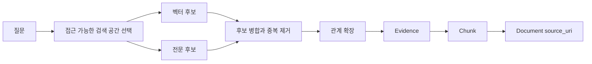

# 벡터·전문·그래프 탐색을 결합한 하이브리드 검색

벡터 검색만으로 놓치는 질문은 대부분 "가까운 문장"이 아니라 "연결된 사실"을 요구한다.
이 글의 결론은 단순하다.
Neo4j GraphRAG의 하이브리드 검색은 벡터와 전문 검색으로 후보를 넓히고,
`VectorCypherRetriever`나 `HybridCypherRetriever`로 관계를 확장한 뒤,
최종 컨텍스트는 반드시 원문 `Document`와 `Chunk`로 되돌려야 한다.

이 글은 세 질문을 따라간다.

- 벡터, 전문, 그래프 탐색은 각각 어떤 실패를 보완하는가?
- `neo4j-graphrag` retriever들의 경계는 어디까지인가?
- 후보를 많이 가져오는 것과 권한·출처가 보존된 컨텍스트를 만드는 것 사이의 비용은 어떻게 조절하는가?

가져갈 판단 기준은 세 가지다.

- 질문이 이름, ID, 에러 코드, ADR 번호를 포함하면 전문 검색 신호를 버리지 않는다.
- 질문이 영향도, 소유권, 장애, 결정의 연결을 묻는다면 후보 검색 뒤 관계 탐색을 붙인다.
- 최종 출력이 원문 URI와 청크를 가리키지 못하면 GraphRAG 검색 성공으로 보지 않는다.

> 이전 글: [문서에서 근거를 보존한 지식 그래프 구축하기](./04-knowledge-graph-builder.md)

## 하이브리드 검색은 점수 섞기가 아니라 신호 분리다

사내 기술 문서 질문은 한 종류가 아니다.

예를 들어 "주문 API 시간 제한"은 문서 안의 정확한 단어와 가까운 표현이 모두 중요하다.
반면 "이 API를 바꾸면 어떤 저장소와 담당자를 함께 봐야 하는가"는 문서 한 조각보다 관계 경로가 중요하다.

그래서 검색 신호를 세 층으로 분리한다.

| 신호 | 잘 맞는 질문 | 놓치기 쉬운 것 |
| --- | --- | --- |
| 벡터 검색 | 표현은 다르지만 의미가 비슷한 문서 찾기 | `ADR-014`, `50013`, API 경로처럼 정확한 토큰 |
| 전문 검색 | 이름, 코드, 약어, 오류 문구 찾기 | 표현이 바뀐 개념, 긴 문맥의 의미 |
| 그래프 탐색 | 서비스, API, 저장소, 소유자, 장애, 결정의 연결 찾기 | 시작 후보가 틀리면 잘못된 경로를 확장한다 |

하이브리드 검색은 이 셋을 한 번에 섞어 "더 똑똑한 검색"이라고 부르는 일이 아니다.
먼저 각 신호가 어떤 실패를 줄이는지 정하고,
후보 생성과 관계 확장을 분리해서 평가해야 한다.



이 그림은 목표 아키텍처다.
현재 공식 문서에서 사전 필터는 하이브리드 검색기를 제외한 검색기에만 구현되어 있다.
따라서 `HybridRetriever`와 `HybridCypherRetriever`에 문서 ACL 필터를 그대로 넘길 수 있다고 가정하면 안 된다.

권한 밖 문서를 후보로 찾은 뒤 나중에 지우면,
점수 융합과 관계 확장 단계가 이미 권한 밖 신호의 영향을 받을 수 있다.
접근 범위별 인덱스나 데이터베이스를 선택하거나,
Neo4j 권한으로 보이는 하위 그래프를 제한하거나,
권한 조건을 검색 단계에 포함하는 사용자 정의 검색기를 만들어야 한다.

## Neo4j GraphRAG retriever의 경계

공식 `neo4j-graphrag` 패키지는 여러 retriever를 제공한다.
이 경계를 정확히 알아야 Microsoft GraphRAG의 용어를 Neo4j 패키지 기능처럼 오해하지 않는다.

| 검색기 | 공식 패키지에서 하는 일 | 이 시리즈에서 쓰는 위치 |
| --- | --- | --- |
| `VectorRetriever` | Neo4j 벡터 인덱스로 유사 노드와 점수를 찾는다 | 의미 후보 생성 기준선 |
| `VectorCypherRetriever` | 벡터 검색으로 찾은 `node`와 `score`를 시작점으로 추가 Cypher를 실행한다 | 후보 주변의 서비스·API·근거 경로 확장 |
| `HybridRetriever` | Neo4j 벡터 인덱스와 전문 인덱스를 함께 사용한다 | 접근 범위가 이미 제한된 검색 공간에서 의미와 키워드 후보를 회수 |
| `HybridCypherRetriever` | 하이브리드 후보를 찾은 뒤 추가 Cypher로 주변 그래프를 확장한다 | 접근 범위가 이미 제한된 검색 공간에서 관계를 확장 |
| `Text2CypherRetriever` | LLM이 자연어 질문을 Cypher로 바꾸고 실행한 결과를 컨텍스트에 넣는다 | 제한된 읽기 전용 질문에서만 별도 경로로 검토 |

Microsoft GraphRAG의 global search, local search, DRIFT search는 다른 프로젝트의 질의 전략이다.
그 이름을 Neo4j GraphRAG Python 패키지의 검색기 이름처럼 쓰면 안 된다.
이 글에서는 "로컬 관계 확장" 같은 표현을 쓰더라도,
그것은 `VectorCypherRetriever`나 `HybridCypherRetriever`의 retrieval query로 구현하는 설계 패턴을 뜻한다.

## 권한 선필터는 하이브리드 검색 밖에서 해결한다

공식 `neo4j-graphrag` 문서의 현재 계약에는 중요한 차이가 있다.

- `VectorRetriever`와 `VectorCypherRetriever`는 `filters`를 받을 수 있다.
- `HybridRetriever`와 `HybridCypherRetriever`는 사전 필터를 지원하지 않는다.
- `retrieval_query`는 후보 검색이 끝난 뒤 실행되므로 그 안의 `WHERE`는 후보 선필터가 아니다.

Neo4j 2026.01 이상에서는 호환되는 단순 필터와 필터 가능 속성을 갖춘 벡터 인덱스가 `SEARCH` 절의 인덱스 내부 필터를 사용할 수 있다.
이전 버전이나 호환되지 않는 연산자는 정확 검색 방식으로 우회되어 비용이 달라질 수 있다.

문서별 ACL이 엄격한 사내 검색에서는 다음 순서로 선택한다.

1. 접근 범위별 데이터베이스나 인덱스 분리가 가능한지 본다.
2. Enterprise 또는 Aura 권한으로 검색 계정이 볼 수 있는 하위 그래프를 제한할 수 있는지 본다.
3. 둘 다 맞지 않으면 권한 조건을 후보 생성에 포함하는 사용자 정의 검색기를 만든다.
4. 이 경계를 만들기 전에는 하이브리드 검색을 비공개 문서의 기본 경로로 열지 않는다.

## 인덱스는 질문 유형별로 나눈다

Neo4j의 벡터 인덱스는 임베딩 유사도 기반 이웃을 찾는다.
공식 Cypher 문서는 벡터 인덱스가 근사 최근접 이웃 검색이며,
서버 버전에 따라 `SEARCH` 절과 필터 기능의 지원 범위가 달라진다고 설명한다.

전문 인덱스는 Lucene 기반 질의 문자열을 사용한다.
기본 분석기는 대소문자를 정규화할 수 있고,
정확한 구문이나 불리언 연산자를 이용할 수 있다.
따라서 다음 속성은 전문 인덱스로 별도 관리하는 편이 낫다.

- `Service.name`
- `API.path`
- `Repository.name`
- `ADR.adr_id`
- `Incident.incident_id`
- `Chunk.text`

벡터 인덱스는 보통 `Chunk.embedding`이나 `Evidence.embedding`에 둔다.
관계 탐색의 시작점은 `Chunk` 하나일 수도 있고,
청크에서 추출된 `Claim`이나 `Service`일 수도 있다.

## 관계 확장은 후보 다음에 붙인다

관계형 질문에서 하고 싶은 일은 후보 노드를 많이 가져오는 것이 아니다.
후보에서 출발해 검증 가능한 경로를 찾는 것이다.

예를 들어 질문이 "이 API를 변경하면 어떤 서비스와 저장소를 함께 검토해야 하는가"라면,
후보 청크만으로는 답이 부족하다.
최소한 다음 경로가 필요하다.

```cypher
MATCH (api:API {api_id: $api_id})<-[:EXPOSES]-(service:Service)
OPTIONAL MATCH (service)-[:IMPLEMENTED_BY]->(repo:Repository)
OPTIONAL MATCH (service)-[:OWNED_BY]->(owner:Owner)
OPTIONAL MATCH (claim:Claim)-[:ABOUT]->(api)
OPTIONAL MATCH (claim)-[:SUPPORTED_BY]->(:Evidence)-[:LOCATED_IN]->(chunk:Chunk)-[:PART_OF]->(doc:Document)
RETURN service.service_id AS service_id,
       collect(DISTINCT repo.repository_id) AS repositories,
       collect(DISTINCT owner.owner_id) AS owners,
       collect(DISTINCT {
         chunk_id: chunk.chunk_id,
         source_uri: doc.source_uri
       }) AS sources
LIMIT 20
```

위 Cypher는 이 글에서 실행하지 않은 일반화 예시다.
핵심은 `API`에서 관계를 확장하더라도,
출력은 다시 `Chunk`와 `Document.source_uri`로 닫는다는 점이다.

## 공식 검색기 예시를 도메인에 맞게 읽는다

아래 코드는 공식 `VectorCypherRetriever`와 `HybridCypherRetriever` 사용 형태를
사내 기술 문서 도메인 이름으로 바꾼 일반화 예시다.
이 글 작성 시 실제 Neo4j 서버에서 실행하지 않았으므로,
설치한 패키지와 서버 버전의 공식 문서를 다시 확인해야 한다.

```python
import os

from neo4j import GraphDatabase
from neo4j_graphrag.embeddings import OpenAIEmbeddings
from neo4j_graphrag.retrievers import HybridCypherRetriever

driver = GraphDatabase.driver(
    "neo4j://localhost:7687",
    auth=(os.environ["NEO4J_USER"], os.environ["NEO4J_PASSWORD"]),
)
embedder = OpenAIEmbeddings(model="text-embedding-3-large")

# 두 인덱스는 호출자가 접근 가능한 문서만 포함한 검색 공간이라고 가정한다.
retrieval_query = """
MATCH (node)<-[:LOCATED_IN]-(evidence:Evidence)<-[:SUPPORTED_BY]-(claim:Claim)
OPTIONAL MATCH (claim)-[:ABOUT]->(service:Service)
OPTIONAL MATCH (claim)-[:ABOUT]->(api:API)
OPTIONAL MATCH (node)-[:PART_OF]->(doc:Document)
RETURN
  node.chunk_id AS chunk_id,
  node.text AS text,
  doc.source_uri AS source_uri,
  score AS retrieval_score,
  collect(DISTINCT service.service_id) AS services,
  collect(DISTINCT api.api_id) AS apis
"""

retriever = HybridCypherRetriever(
    driver=driver,
    vector_index_name="chunk_embedding",
    fulltext_index_name="chunk_fulltext",
    retrieval_query=retrieval_query,
    embedder=embedder,
)

result = retriever.search(query_text="주문 API 시간 제한을 바꾸면 어떤 서비스가 영향받는가?", top_k=10)
```

공식 문서의 핵심은 `VectorCypherRetriever`와 `HybridCypherRetriever`가
검색된 `node`와 `score`를 retrieval query에서 사용할 수 있게 해준다는 점이다.
그래서 retrieval query는 노드 객체 전체를 반환하기보다,
LLM에 넣을 속성과 출처 메타데이터를 명시적으로 반환하는 편이 안전하다.

위 예시의 retrieval query는 권한 선필터가 아니다.
인덱스가 여러 권한 범위의 문서를 함께 담고 있다면 이 코드만으로 사내 ACL을 보장할 수 없다.

## 정량 트레이드오프

검색 경로를 늘리면 recall은 올라갈 수 있지만,
지연과 잡음도 같이 늘어난다.

| 조절값 | 늘리면 좋아지는 것 | 같이 나빠지는 것 |
| --- | --- | --- |
| `top_k` | 후보 근거 회수율 | 토큰 사용량, 재순위화 비용 |
| 벡터 후보 풀 | 표현이 다른 문서 회수 | 근사 검색 지연, 관련 없는 청크 |
| 전문 후보 풀 | 이름과 코드 회수 | Lucene 질의 오류, 키워드 과적합 |
| 관계 확장 깊이 | 영향 경로 회수 | 고차 관계 잡음, 실행 시간 |
| 증거당 청크 수 | 원문 문맥 보존 | 중복 컨텍스트, 모델 입력 비용 |

처음부터 깊은 탐색을 열지 않는다.
실습에서는 다음 기본값으로 시작한다.

- 후보 생성은 벡터 10개, 전문 10개로 제한한다.
- 관계 확장은 1에서 2 hop까지만 허용한다.
- 최종 컨텍스트는 근거 청크 8개 이하로 제한한다.
- 같은 `source_uri`의 연속 청크는 병합하되, `chunk_id` 목록은 보존한다.

이 값이 정답은 아니다.
중요한 것은 질문 세트별로 후보 재현율, 컨텍스트 정밀도, 지연을 같이 기록해
어느 비용을 올렸을 때 어떤 품질이 바뀌었는지 보는 것이다.

## 실패 모드

하이브리드 검색에서 자주 생기는 실패는 네 가지다.

| 실패 | 원인 | 판정 방법 |
| --- | --- | --- |
| 키워드 과적합 | API 경로나 약어가 포함된 문서만 위로 올라온다 | 의미상 필수 근거가 후보 밖으로 밀린다 |
| 벡터 과일반화 | 비슷한 운영 문구가 모두 같은 문서처럼 보인다 | 서비스나 ADR 식별자가 다른 근거가 섞인다 |
| 관계 폭발 | 후보에서 너무 넓은 관계를 따라간다 | 컨텍스트 대부분이 질문과 직접 무관한 노드가 된다 |
| 출처 단절 | 관계 노드는 찾았지만 원문 청크가 없다 | 최종 출력에 `source_uri`와 `chunk_id`가 없다 |
| 늦은 ACL | 하이브리드 후보를 만든 뒤 retrieval query에서만 권한을 거른다 | 권한 밖 신호가 순위와 경로 확장에 이미 영향을 준다 |

출처 단절은 단순 품질 문제가 아니다.
에이전트가 최종 답변에서 근거를 제시할 수 없으므로 실패로 봐야 한다.

## 언제 쓰지 말아야 하는가

다음 상황에서는 GraphRAG 하이브리드 검색을 먼저 붙이지 않는다.

- 질문이 단일 문서의 짧은 사실 확인이면 벡터나 전문 검색만으로 충분할 수 있다.
- 문서에 출처 URI와 청크 ID가 안정적으로 없으면 관계 탐색을 해도 인용이 깨진다.
- 개체 식별이 불안정해 `Service`와 `API`가 자주 잘못 합쳐지면 그래프 확장은 오답을 증폭한다.
- 권한 필터를 후보 생성 전에 적용할 수 없으면 사내 컨텍스트 제공자로 열면 안 된다.

그래프는 모호한 검색을 자동으로 고쳐주지 않는다.
잘못 만든 그래프는 벡터 검색보다 더 설득력 있는 잘못된 경로를 만든다.

## 실습

실습 목표는 같은 질문을 세 경로로 돌려보고,
관계형 질문에서 어떤 경로가 원문 근거를 더 잘 보존하는지 기록하는 것이다.

### 준비 데이터

문서 10개에서 다음 노드와 관계가 이미 만들어졌다고 가정한다.

- `Document`, `Chunk`, `Evidence`, `Claim`
- `Service`, `API`, `Repository`, `ADR`, `Owner`, `Incident`
- `SUPPORTED_BY`, `LOCATED_IN`, `PART_OF`, `ABOUT`, `EXPOSES`, `IMPLEMENTED_BY`, `OWNED_BY`, `AFFECTED_BY`

### 재현 가능한 단계

1. `Chunk.text`에 전문 인덱스를 만든다.
2. `Chunk.embedding`에 벡터 인덱스를 만든다.
3. 같은 질문 10개를 준비한다.
4. 하이브리드 검색은 접근 가능한 문서만 담은 실습용 검색 공간에서 실행한다.
5. 각 질문을 `VectorRetriever`, `HybridRetriever`, `HybridCypherRetriever`로 나눠 실행한다.
6. 후보 결과의 `chunk_id`, `source_uri`, 관계 경로, 실행 시간을 기록한다.
7. 최종 컨텍스트에 들어간 청크가 필수 근거를 포함하는지 표시한다.

### 확인할 결과

관계형 질문에서는 `HybridCypherRetriever`가 단순 `HybridRetriever`보다
관련 서비스, 저장소, 소유자, 근거 청크를 함께 반환해야 한다.
단일 사실 질문에서는 그래프 확장 없이도 충분한 경우가 있어야 한다.
그 차이가 보여야 질문 유형별 라우팅을 설계할 수 있다.

### 실패 판정

다음 중 하나라도 나오면 실패로 본다.

- 권한 밖 문서의 `source_uri`가 후보나 최종 컨텍스트에 들어간다.
- 하이브리드 검색 공간이 접근 범위별로 제한되지 않았는데 retrieval query의 후처리만 ACL로 사용한다.
- 필수 근거가 후보에는 있었지만 최종 컨텍스트에서 빠진다.
- 관계 확장 결과가 `Document`와 `Chunk`로 닫히지 않는다.
- 벡터 기준선보다 지연이 크게 늘었는데 관계형 질문 recall이 개선되지 않는다.

## 참고 링크

- Neo4j GraphRAG RAG guide: https://neo4j.com/docs/neo4j-graphrag-python/current/user_guide_rag.html
- Neo4j GraphRAG API documentation: https://neo4j.com/docs/neo4j-graphrag-python/current/api.html
- Neo4j Cypher Manual - Vector indexes: https://neo4j.com/docs/cypher-manual/current/indexes/semantic-indexes/vector-indexes/
- Neo4j Cypher Manual - Full-text indexes: https://neo4j.com/docs/cypher-manual/current/indexes/semantic-indexes/full-text-indexes/
- Neo4j Cypher Manual - Query plans: https://neo4j.com/docs/cypher-manual/current/planning-and-tuning/execution-plans/

## 이어서 읽기

- 이전 글: [문서에서 근거를 보존한 지식 그래프 구축하기](./04-knowledge-graph-builder.md)
- 다음 글: [에이전트를 위한 Neo4j 컨텍스트 제공자 설계](./06-agent-context-provider.md)
