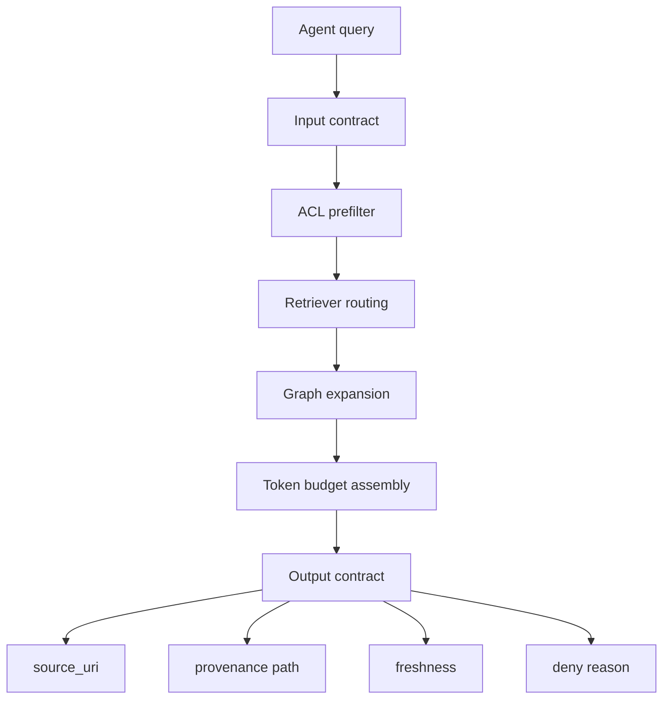

# 에이전트를 위한 Neo4j 컨텍스트 제공자 설계

컨텍스트 제공자는 검색기를 감싼 얇은 함수가 아니다.
이 글의 결론은,
사내 에이전트에 붙이는 Neo4j 컨텍스트 제공자는 읽기 전용 도구이며
ACL 선필터, 출처, 최신성, 토큰 예산, 시간 제한, 출력 계약을 함께 보장해야 한다는 것이다.

그래프 탐색은 유용하지만 위험도 크다.
관계 경로가 답처럼 보일수록,
그 경로를 누가 볼 수 있고 어떤 원문이 지지하는지 더 엄격하게 남겨야 한다.

이 글은 세 질문을 따라간다.

- 에이전트가 컨텍스트 제공자에게 무엇을 요청하고 무엇을 받아야 하는가?
- 검색 경로 안에서 권한과 출처는 어느 시점에 고정해야 하는가?
- `Text2CypherRetriever` 같은 자유 질의 기능은 어떤 안전 장치 없이는 왜 열면 안 되는가?

가져갈 판단 기준은 세 가지다.

- 컨텍스트 제공자의 기본 권한은 읽기 전용이다.
- ACL은 후보 검색 전에 적용하고, 최종 출력에도 통과 근거를 남긴다.
- 출력은 텍스트가 아니라 `claim`, `evidence`, `source_uri`, `freshness`, `path`를 가진 계약이다.

> 이전 글: [벡터·전문·그래프 탐색을 결합한 하이브리드 검색](./05-hybrid-retrieval.md)

## 검색기가 아니라 도구 계약으로 본다

에이전트는 "문서 검색해줘"보다 넓은 요청을 한다.

- 이 API 변경의 영향 범위를 알려줘.
- 최근 장애와 관련된 ADR을 찾아줘.
- 현재 사용자가 볼 수 있는 문서 안에서 근거를 제시해줘.

이 요청을 처리하려면 컨텍스트 제공자가 네 가지를 한 번에 해야 한다.

| 책임 | 설명 | 실패하면 생기는 일 |
| --- | --- | --- |
| 라우팅 | 질문을 벡터, 전문, 그래프, 제한된 Cypher 경로로 보낸다 | 단순 질문에 과한 비용을 쓰거나 관계형 질문을 놓친다 |
| 안전 | 사용자 권한, 읽기 전용, 시간 제한을 적용한다 | 권한 밖 근거나 쓰기 쿼리가 실행된다 |
| 조립 | 토큰 예산 안에 근거와 경로를 정리한다 | 후보에는 있던 필수 근거가 최종 입력에서 빠진다 |
| 설명 | 출처, 최신성, 경로, 점수를 함께 반환한다 | 답변은 가능하지만 검증할 수 없다 |

컨텍스트 제공자의 출력은 LLM prompt에 붙일 문자열이 아니다.
에이전트가 답변과 인용을 만들 수 있는 구조화된 근거 묶음이다.



## 입력 계약

컨텍스트 제공자는 질문 문자열만 받으면 안 된다.
권한과 예산이 없으면 같은 질문도 다른 사용자에게 같은 결과를 반환해버린다.

입력에는 최소한 다음 필드가 필요하다.

| 필드 | 역할 |
| --- | --- |
| `query` | 에이전트 또는 사용자의 자연어 질문 |
| `principal_id` | 사용자를 식별해 ACL을 계산한다 |
| `allowed_scopes` | 접근 가능한 문서, 서비스, 저장소 범위 |
| `retrieval_mode` | `auto`, `hybrid`, `graph`, `text2cypher` 같은 허용 경로 |
| `max_tokens` | 최종 컨텍스트 예산 |
| `timeout_ms` | 전체 처리 시간 제한 |
| `freshness_required_at` | 이 시각 이후의 근거를 우선하거나 요구한다 |
| `trace_id` | 평가와 장애 분석을 위한 요청 식별자 |

`allowed_scopes`는 사후 필터가 아니라 선필터에 써야 한다.
Neo4j RBAC를 운영 환경에서 함께 쓰더라도,
애플리케이션 레벨에서도 검색 후보를 줄이는 조건을 명시하는 편이 안전하다.

다만 현재 공식 패키지의 `HybridRetriever`와 `HybridCypherRetriever`는 사전 필터를 지원하지 않는다.
따라서 이 입력 필드가 있다고 권한 선필터가 자동으로 구현되는 것은 아니다.
접근 범위별 검색 공간, 데이터베이스 권한, 사용자 정의 검색기 중 하나가 실제 후보 생성 경계를 맡아야 한다.

## 출력 계약

출력은 다음처럼 근거 단위로 나눈다.

```json
{
  "answerable": true,
  "items": [
    {
      "claim_id": "claim-api-timeout-001",
      "content": "주문 API의 제한 시간은 3초로 문서화되어 있다.",
      "source_uri": "docs://service/order-api/runbook.md",
      "chunk_id": "chunk-182",
      "document_version": "2026-07-10T09:30:00Z",
      "freshness": "current",
      "provenance_path": [
        "API:order-create",
        "Claim:claim-api-timeout-001",
        "Evidence:evidence-991",
        "Chunk:chunk-182",
        "Document:runbook"
      ],
      "retrieval_scores": {
        "vector": 0.82,
        "fulltext": 0.71
      }
    }
  ],
  "limits": {
    "used_tokens": 820,
    "max_tokens": 1600,
    "elapsed_ms": 420,
    "timeout_ms": 1500
  },
  "denied": []
}
```

이 JSON은 구현 예시가 아니라 계약 예시다.
핵심은 에이전트가 최종 답변을 만들 때 어떤 문장을 어떤 원문에 연결해야 하는지 잃지 않는 것이다.

`answerable`이 `false`인 경우도 계약에 포함해야 한다.
근거가 없거나 권한 때문에 충분한 근거를 제공할 수 없으면,
컨텍스트 제공자는 빈 문자열 대신 실패 이유를 반환해야 한다.

## ACL은 선필터와 최종 검증에 모두 둔다

권한 처리는 한 번만 하면 끝나는 단계가 아니다.

먼저 후보 검색 전에 사용자가 볼 수 있는 검색 공간을 제한한다.
그다음 관계 탐색에서 새로 따라간 노드가 다시 권한 범위 안인지 확인한다.
마지막으로 출력 직전에 모든 `source_uri`와 `chunk_id`가 허용 범위 안인지 검증한다.

권한 필터가 필요한 위치는 세 곳이다.

| 위치 | 검증 대상 | 실패 시 동작 |
| --- | --- | --- |
| 후보 검색 전 | 접근 범위별 인덱스·데이터베이스 또는 필터 가능한 속성 | 검색 공간에서 제외 |
| 관계 확장 후 | 경로에 포함된 중간 노드와 근거 | 해당 경로 제거 |
| 출력 직전 | 최종 `source_uri`, `chunk_id` | 요청 실패 또는 부분 결과 표시 |

Neo4j Enterprise와 Aura의 역할 기반 권한 기능을 쓰면 데이터베이스 쪽 방어선을 더 강하게 만들 수 있다.
하지만 학습용 Community 환경에서는 세밀한 운영 RBAC를 전제로 하지 말고,
`VectorCypherRetriever`의 필터 가능한 단일 범위 속성으로 먼저 실습한다.

복수 그룹과 문서별 ACL처럼 동적인 정책이 필요하면 단순 속성 필터로 충분하지 않을 수 있다.
공식 하이브리드 검색기의 retrieval query에 `WHERE`를 추가하는 방식은 후보 검색 뒤의 후처리이므로,
엄격한 선필터로 부르면 안 된다.

## 읽기 전용 경계를 고정한다

컨텍스트 제공자가 검색 도구라면 쓰기 권한이 필요 없다.
읽기 전용 원칙은 단순한 보안 취향이 아니라 평가 가능성을 지키는 조건이다.

검색 도중 그래프가 바뀌면 다음 문제가 생긴다.

- 같은 질문의 반복 실행 결과를 비교하기 어렵다.
- `PROFILE`이나 튜닝 중 의도치 않은 쓰기 쿼리가 실행될 수 있다.
- `Text2CypherRetriever`가 생성한 쿼리의 위험을 제한하기 어렵다.
- 장애 분석에서 컨텍스트 제공자가 원인인지 적재 파이프라인이 원인인지 분리하기 어렵다.

따라서 운영 컨텍스트 제공자 계정은 읽기 권한만 가져야 한다.
적재, 정규화, 인덱스 생성, 삭제는 별도 파이프라인과 계정에서 처리한다.

## Text2Cypher는 기본 경로가 아니다

공식 `Text2CypherRetriever`는 LLM이 자연어 질문을 Cypher로 변환하고,
그 쿼리를 Neo4j에 실행한 결과를 컨텍스트로 제공한다.
문서화된 기능이지만,
LLM 생성 쿼리가 항상 문법적으로 맞는다고 보장되지 않는다는 경고도 함께 있다.

사내 컨텍스트 제공자에서 Text2Cypher를 열려면 최소 조건이 필요하다.

- 데이터베이스 계정이 읽기 전용이어야 한다.
- 허용되는 질의 패턴을 allowlist로 제한해야 한다.
- `CREATE`, `MERGE`, `SET`, `DELETE`, `DROP`, `CALL dbms`, 파일 접근성 프로시저를 허용하지 않아야 한다.
- 쿼리 시간 제한과 결과 개수 제한을 적용해야 한다.
- 생성된 Cypher와 실행 결과를 추적 로그에 남겨야 한다.
- 권한 필터와 출처 검증을 Text2Cypher 결과에도 다시 적용해야 한다.

이 조건을 만족하지 못하면 Text2Cypher는 실험 노트북 안에서만 써야 한다.
키워드 문자열 차단만으로 안전을 증명할 수도 없다.
읽기 전용 데이터베이스 권한을 최종 방어선으로 두고,
제품 경로에서는 사람이 작성한 검색 쿼리와 제한된 검색 모드를 먼저 쓴다.
`HybridCypherRetriever`는 접근 범위가 이미 분리된 검색 공간에서만 사용한다.

## 공식 검색기를 도구 뒤에 숨긴다

아래 코드는 공식 `neo4j-graphrag` 검색기 사용 형태를
컨텍스트 제공자 내부로 감싸는 일반화 예시다.
이 글 작성 시 실제 서버에서 실행하지 않았고,
설치 버전에 맞춘 인자명은 현재 공식 문서를 확인해야 한다.

```python
from dataclasses import dataclass
from time import monotonic
from typing import Literal

from neo4j import GraphDatabase, Record
from neo4j_graphrag.embeddings import OpenAIEmbeddings
from neo4j_graphrag.retrievers import VectorCypherRetriever
from neo4j_graphrag.types import RetrieverResultItem


@dataclass
class ContextRequest:
    query: str
    principal_id: str
    acl_partition: str
    allowed_source_uris: list[str]
    max_tokens: int
    timeout_ms: int
    retrieval_mode: Literal["auto", "vector_graph"] = "auto"


def format_context_record(record: Record) -> RetrieverResultItem:
    return RetrieverResultItem(
        content=record.get("text") or "",
        metadata={
            "claim_id": record.get("claim_id"),
            "chunk_id": record.get("chunk_id"),
            "source_uri": record.get("source_uri"),
            "document_version": record.get("document_version"),
            "freshness": record.get("freshness"),
            "provenance_path": record.get("provenance_path") or [],
            "score": record.get("score"),
        },
    )


class Neo4jContextProvider:
    def __init__(self, uri: str, auth: tuple[str, str]) -> None:
        self.driver = GraphDatabase.driver(uri, auth=auth)
        self.embedder = OpenAIEmbeddings(model="text-embedding-3-large")

    def retrieve(self, request: ContextRequest) -> dict:
        started_at = monotonic()
        retrieval_query = """
        MATCH (node)-[:PART_OF]->(doc:Document)
        OPTIONAL MATCH (node)<-[:LOCATED_IN]-(evidence:Evidence)<-[:SUPPORTED_BY]-(claim:Claim)
        RETURN node.text AS text,
               node.chunk_id AS chunk_id,
               doc.source_uri AS source_uri,
               toString(doc.updated_at) AS document_version,
               coalesce(doc.freshness, "unknown") AS freshness,
               claim.claim_id AS claim_id,
               score AS score,
               CASE WHEN claim IS NULL
                    THEN []
                    ELSE ["Claim:" + claim.claim_id]
               END
               + CASE WHEN evidence IS NULL
                      THEN []
                      ELSE ["Evidence:" + evidence.evidence_id]
                 END
               + ["Chunk:" + node.chunk_id, "Document:" + doc.document_id]
                 AS provenance_path
        LIMIT 20
        """

        retriever = VectorCypherRetriever(
            driver=self.driver,
            index_name="chunk_embedding",
            retrieval_query=retrieval_query,
            embedder=self.embedder,
            result_formatter=format_context_record,
        )

        raw = retriever.search(
            query_text=request.query,
            top_k=10,
            filters={"acl_partition": request.acl_partition},
        )

        allowed_sources = set(request.allowed_source_uris)
        items = []
        denied_count = 0

        for item in raw.items:
            metadata = item.metadata or {}
            source_uri = metadata.get("source_uri")

            if source_uri not in allowed_sources:
                denied_count += 1
                continue

            items.append(
                {
                    "claim_id": metadata.get("claim_id"),
                    "content": item.content,
                    "source_uri": source_uri,
                    "chunk_id": metadata.get("chunk_id"),
                    "document_version": metadata.get("document_version"),
                    "freshness": metadata.get("freshness"),
                    "provenance_path": metadata.get("provenance_path", []),
                    "retrieval_scores": {"vector": metadata.get("score")},
                }
            )

        return {
            "answerable": bool(items),
            "items": items,
            "limits": {
                "used_tokens": None,
                "max_tokens": request.max_tokens,
                "elapsed_ms": int((monotonic() - started_at) * 1000),
                "timeout_ms": request.timeout_ms,
            },
            "denied": (
                [{"reason": "source_not_allowed", "count": denied_count}]
                if denied_count
                else []
            ),
        }
```

실제 구현에서는 위 코드보다 더 많은 방어가 필요하다.
`Chunk.acl_partition`은 벡터 인덱스의 필터 가능 속성으로 선언해야 한다.
Neo4j 2026.01 이상과 호환되는 단순 필터에서는 인덱스 내부 필터를 사용할 수 있지만,
서버 버전과 연산자에 따라 정확 검색 방식으로 우회될 수 있으므로 실행 계획과 지연을 함께 확인해야 한다.

또한 위 단일 범위 예시는 복수 그룹 ACL을 완전히 표현하지 않는다.
`Document.allowed_groups`는 원본 권한이고,
`Chunk.acl_partition`은 단일 권한 범위를 후보 단계에서 재현하기 위한 속성이다.
`allowed_source_uris`는 출력 직전 재검증에 사용하고,
복잡한 ACL은 접근 범위별 검색 공간이나 사용자 정의 검색기로 후보 단계부터 강제해야 한다.

공식 `result_formatter`는 현재 베타 API이므로 패키지 갱신 때 계약 테스트가 필요하다.
예시의 `used_tokens`는 계산하지 않았다는 뜻으로 `None`을 반환한다.
실제 구현에서는 특히 토큰 예산 계산,
시간 제한 전파,
부분 실패 처리,
출력 직전 ACL 재검증은 별도 함수로 분리해야 한다.

## 토큰 예산과 시간 제한

검색 품질만 높이면 컨텍스트 제공자는 금방 느려진다.
운영 도구라면 예산을 숫자로 들고 있어야 한다.

| 예산 | 권장 처리 |
| --- | --- |
| 후보 검색 시간 | 벡터와 전문 검색 각각 제한을 둔다 |
| 관계 확장 시간 | 최대 hop과 결과 개수를 제한한다 |
| 최종 토큰 | 근거 청크, 경로 설명, 메타데이터를 합산한다 |
| LLM 입력 | 답변에 직접 필요한 근거만 넣고 진단 메타는 별도 채널에 둔다 |

토큰 예산이 부족하면 무작정 앞에서부터 자르면 안 된다.
먼저 중복 청크를 합치고,
그다음 같은 주장에 대한 낮은 점수 근거를 줄이며,
마지막으로 답변에 필수인 관계 경로를 보존한다.

## 최신성은 점수와 별도 축이다

오래된 문서는 질문과 매우 비슷할 수 있다.
벡터 점수나 전문 점수는 최신성을 자동으로 보장하지 않는다.

그래서 `Document`와 `Chunk`에는 다음 속성이 필요하다.

- `created_at`
- `updated_at`
- `ingested_at`
- `source_version`
- `valid_from`
- `valid_to`
- `superseded_by`

최신성 판정은 세 상태로 나누면 다루기 쉽다.

| 상태 | 의미 | 출력 방식 |
| --- | --- | --- |
| `current` | 현재 유효한 근거 | 기본 근거로 사용 |
| `stale` | 더 최신 문서가 있거나 유효 기간이 지났다 | 낮은 우선순위 또는 경고 포함 |
| `unknown` | 갱신 시각을 알 수 없다 | 답변에 불확실성 표시 |

최신성은 retrieval score에 살짝 더하는 보정값으로만 처리하면 위험하다.
폐기된 ADR이 의미상 더 비슷할 수 있기 때문이다.
운영 문서에서는 최신성을 필터 또는 강한 재순위화 조건으로 다루는 편이 낫다.

## 실패 모드

컨텍스트 제공자의 실패는 검색 실패보다 넓다.

| 실패 | 예시 | 판정 |
| --- | --- | --- |
| 권한 누출 | 사용자가 볼 수 없는 장애 문서 URI가 출력된다 | 즉시 실패 |
| 출처 누락 | 내용은 맞지만 `source_uri`가 없다 | 즉시 실패 |
| 최신성 오판 | 폐기된 ADR을 현재 결정처럼 쓴다 | 실패 |
| 예산 초과 | 관계 확장이 제한 없이 실행된다 | 실패 또는 강등 |
| 무응답 실패 | 근거가 없는데 일반 지식으로 답한다 | 실패 |

컨텍스트 제공자의 품질은 "답이 자연스러운가"가 아니라
"근거 있는 답만 만들도록 압력을 넣는가"로 봐야 한다.

## 언제 쓰지 말아야 하는가

다음 상황에서는 에이전트용 컨텍스트 제공자로 열지 않는다.

- 문서 권한 모델을 아직 표현할 수 없다.
- 원문 URI와 청크 ID가 안정적으로 없다.
- 그래프 적재 파이프라인이 관계를 만든 이유를 추적하지 못한다.
- 질문이 단순 FAQ 수준이고 관계 탐색의 추가 비용이 품질을 바꾸지 않는다.
- Text2Cypher를 쓰기 전용 권한, 허용 쿼리, 시간 제한 없이 열어야 한다.

이 경우에는 먼저 벡터 검색과 전문 검색 기준선을 단단히 만들고,
권한과 출처 메타데이터를 붙이는 쪽이 우선이다.

## 실습

실습 목표는 필터 가능한 `VectorCypherRetriever` 뒤에 얇은 컨텍스트 제공자 계약을 만들고,
권한·출처·최신성·예산을 출력에 포함하는 것이다.

### 재현 가능한 단계

1. `Chunk.acl_partition`을 정하고 벡터 인덱스의 필터 가능 속성으로 선언한다.
2. 사용자 A와 B가 서로 다른 `acl_partition`을 받도록 샘플을 만든다.
3. 같은 질문을 권한이 다른 사용자 A와 사용자 B로 실행한다.
4. `filters={"acl_partition": ...}`를 적용한 후보와 적용하지 않은 후보를 비교한다.
5. 출력 항목마다 `claim_id`, `chunk_id`, `source_uri`, `freshness`, `provenance_path`를 채운다.
6. 출력 직전에 `allowed_source_uris`로 한 번 더 검증한다.
7. `max_tokens`를 작게 설정해 일부 근거가 잘리는 상황을 만든다.
8. timeout을 짧게 설정해 관계 확장 실패가 어떻게 기록되는지 확인한다.

### 확인할 결과

사용자 A와 B의 결과는 권한 범위에 따라 달라져야 한다.
최종 출력의 모든 근거는 원문 `Document.source_uri`와 `Chunk.chunk_id`를 가져야 한다.
토큰 예산을 줄였을 때는 결과 수가 줄어도,
남은 결과의 출처와 최신성 메타데이터는 유지되어야 한다.

### 실패 판정

다음 결과가 나오면 실패다.

- 권한 밖 `source_uri`가 하나라도 반환된다.
- 하이브리드 검색기의 검색 쿼리 후처리를 후보 선필터로 오해한다.
- `content`만 있고 `source_uri`나 `chunk_id`가 없는 item이 있다.
- timeout이 발생했는데 성공 응답처럼 보인다.
- 오래된 ADR이 `stale` 표시 없이 현재 근거로 들어간다.
- Text2Cypher 결과에 ACL 재검증을 적용하지 않는다.

## 참고 링크

- Neo4j GraphRAG RAG guide: https://neo4j.com/docs/neo4j-graphrag-python/current/user_guide_rag.html
- Neo4j GraphRAG Types: https://neo4j.com/docs/neo4j-graphrag-python/current/types.html
- Neo4j Operations Manual - Role-based access control: https://neo4j.com/docs/operations-manual/current/authentication-authorization/manage-privileges/
- Neo4j Cypher Manual - Query plans: https://neo4j.com/docs/cypher-manual/current/planning-and-tuning/execution-plans/
- Neo4j Cypher Manual - Full-text indexes: https://neo4j.com/docs/cypher-manual/current/indexes/semantic-indexes/full-text-indexes/

## 이어서 읽기

- 이전 글: [벡터·전문·그래프 탐색을 결합한 하이브리드 검색](./05-hybrid-retrieval.md)
- 다음 글: [GraphRAG 평가와 벡터 RAG 제거 실험](./07-evaluation-and-ablation.md)
