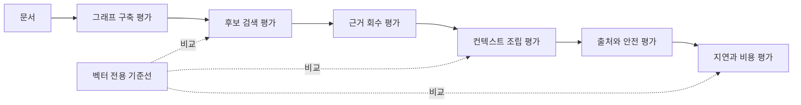

# GraphRAG 평가와 벡터 RAG 제거 실험

GraphRAG 평가는 "답이 맞았다" 하나로 끝나면 안 된다.
이 글의 결론은,
그래프 구축 품질,
후보와 근거 회수,
최종 컨텍스트 정밀도와 재현율,
출처·최신성·권한·지연·비용을 단계별로 나누고,
반드시 벡터 전용 기준선과 제거 실험으로 비교해야 한다는 것이다.

그래프를 만들었다는 사실은 성공 기준이 아니다.
벡터 RAG가 놓친 관계형 질문에서,
권한과 출처를 보존한 컨텍스트를 더 잘 제공한다는 증거가 있어야 한다.

이 글은 세 질문을 따라간다.

- 그래프 구축 품질과 검색 품질을 왜 분리해서 평가해야 하는가?
- candidate recall과 context recall은 무엇이 다른가?
- 그래프 확장을 제거했을 때 품질, 지연, 비용이 어떻게 바뀌는가?

가져갈 판단 기준은 세 가지다.

- graph construction 평가는 검색 전에 끝내야 한다.
- 후보에 있던 근거가 최종 컨텍스트에서 빠질 수 있으므로 candidate와 context를 나눠 본다.
- 벡터 전용 제거 실험을 이기지 못하면 GraphRAG 복잡도를 정당화할 수 없다.

> 이전 글: [에이전트를 위한 Neo4j 컨텍스트 제공자 설계](./06-agent-context-provider.md)

## 평가 경계를 먼저 그린다

GraphRAG 파이프라인은 여러 단계로 실패한다.
노드를 잘못 만들 수도 있고,
검색 후보를 놓칠 수도 있고,
후보에는 있었던 근거를 토큰 조립에서 버릴 수도 있다.

그래서 평가 경계를 다음처럼 나눈다.



각 단계는 정답 집합이 다르다.
같은 `recall`이라는 이름을 쓰더라도,
무엇을 정답으로 보는지 다르면 전혀 다른 지표가 된다.

## 평가 데이터셋

처음에는 큰 벤치마크보다 작은 고정 질문 세트가 낫다.
이 시리즈의 도메인에서는 질문 30개 정도로 시작한다.

| 질문 유형 | 예시 | 필수 근거 |
| --- | --- | --- |
| 단일 사실 | 특정 API의 제한 시간은 얼마인가? | `Chunk` 1개 |
| 관계 영향 | 이 API 변경 시 어떤 서비스와 저장소를 봐야 하는가? | `API`, `Service`, `Repository`, `Chunk` |
| 결정 추적 | 이 운영 방식은 어떤 ADR에서 결정됐는가? | `ADR`, `Claim`, `Evidence`, `Document` |
| 장애 연결 | 최근 장애와 관련된 소유자와 결정은 무엇인가? | `Incident`, `Owner`, `ADR`, `Evidence` |
| 충돌 탐지 | 같은 서비스에 대해 충돌하는 문서가 있는가? | 상충 `Claim` 2개와 각각의 `Evidence` |
| 안전 경계 | 권한 밖 문서를 제외하고 답할 수 있는가? | 허용 문서만 포함 |

각 질문에는 사람이 표시한 정답을 붙인다.
정답은 최종 답변 문장이 아니라,
필수 노드, 관계, 청크, 원문 URI로 저장한다.

## 그래프 구축 품질

그래프 구축 품질은 검색을 돌리기 전에 평가한다.
그래프가 틀렸는데 검색이 맞았다면 우연일 수 있다.

평가 항목은 네 가지다.

| 항목 | 측정 예 | 실패 판정 |
| --- | --- | --- |
| 개체 식별 | 같은 `Service`가 하나로 합쳐졌는가 | 별칭 때문에 중복 노드가 생기거나 다른 서비스가 병합된다 |
| 관계 정확성 | `EXPOSES`, `OWNED_BY`, `DECIDES_FOR`가 맞는가 | 관계 방향이나 대상 타입이 틀린다 |
| claim 추출 | 검증 가능한 문장만 `Claim`이 되었는가 | 의견, 제목, 목차가 주장으로 들어간다 |
| evidence 연결 | 모든 `Claim`이 원문 `Chunk`와 연결되는가 | 근거 없는 관계가 컨텍스트에 들어간다 |

정량화는 단순하게 시작한다.

```text
entity_precision = 올바른 개체 수 / 추출된 개체 수
entity_recall = 회수된 정답 개체 수 / 정답 개체 수
relationship_precision = 올바른 관계 수 / 추출된 관계 수
evidence_coverage = evidence가 연결된 claim 수 / 전체 claim 수
```

중요한 실패는 평균 점수로 덮지 않는다.
예를 들어 권한 밖 문서에서 추출된 `Evidence`가 연결되면,
precision이 높아도 안전 실패로 따로 표시한다.

## 후보와 근거 회수

후보 검색 평가는 "필수 근거가 후보 안에 들어왔는가"를 본다.

| 지표 | 답하는 질문 |
| --- | --- |
| candidate recall@k | 필수 문서, 청크, 노드가 후보 안에 들어왔는가 |
| evidence recall@k | 사람이 표시한 필수 `Evidence`가 후보 안에 들어왔는가 |
| candidate precision@k | 후보 중 실제 관련 있는 비율은 얼마인가 |
| path recall | 필수 관계 경로가 탐색 결과에 들어왔는가 |

벡터 검색은 가까운 청크를 찾을 수 있지만,
그 청크와 연결된 서비스·저장소·ADR 경로를 항상 회수하지는 않는다.
반대로 그래프 확장은 경로를 회수하지만,
시작 후보가 틀리면 잘못된 관계를 많이 가져온다.

따라서 후보 단계에서는 `VectorRetriever`, `HybridRetriever`, `HybridCypherRetriever`를 나눠 기록한다.
공식 Neo4j GraphRAG retriever의 역할은 여기까지다.
Microsoft GraphRAG의 global, local, DRIFT 용어를 이 평가표의 구현체 이름으로 쓰지 않는다.

## 컨텍스트 정밀도와 재현율

후보에 들어온 근거가 최종 컨텍스트에 남는다는 보장은 없다.
토큰 예산, 중복 제거, 정렬, 최신성 필터에서 빠질 수 있다.

그래서 컨텍스트 단계 지표를 따로 둔다.

| 지표 | 의미 |
| --- | --- |
| context recall | 필수 근거 중 최종 컨텍스트에 들어간 비율 |
| context precision | 최종 컨텍스트 중 질문 답변에 필요한 비율 |
| token efficiency | 필수 근거 1개를 전달하는 데 쓴 토큰 수 |
| duplicate ratio | 같은 원문이나 같은 claim이 반복된 비율 |

예를 들어 후보에는 필수 근거 4개가 모두 있었지만,
최종 컨텍스트에 2개만 들어갔다면 candidate recall은 성공이고 context recall은 실패다.
이 경우 retriever를 바꿀 문제가 아니라 조립기를 고쳐야 한다.

## 출처와 최신성 평가

GraphRAG는 관계 경로를 제공할 수 있지만,
그 경로가 원문으로 닫히지 않으면 에이전트 답변에 쓰기 어렵다.

출처 평가는 다음을 본다.

- 모든 claim에 `Evidence`가 있는가?
- 모든 evidence가 `Chunk`와 `Document.source_uri`로 이어지는가?
- 답변에 인용된 문장과 실제 청크 내용이 일치하는가?
- 같은 원문에서 나온 여러 청크를 병합해도 `chunk_id` 목록이 유지되는가?

최신성 평가는 별도다.

| 상태 | 실패 예 |
| --- | --- |
| `current` | 최신 문서가 있는데 오래된 ADR을 현재 결정처럼 반환한다 |
| `stale` | 폐기된 문서를 경고 없이 사용한다 |
| `unknown` | 갱신 시각이 없는데 확정 근거처럼 쓴다 |

최신성은 retrieval score가 높아도 통과 조건을 깰 수 있다.
운영 문서에서는 최신성 누락을 품질 점수 감점이 아니라 별도 실패로 둔다.

## ACL violation은 상쇄하지 않는다

권한 위반은 평균 점수로 다루면 안 된다.
한 건의 권한 밖 문서 노출도 실패다.

측정은 단순하다.

```text
acl_violation_count = 최종 후보와 컨텍스트에 포함된 권한 밖 source_uri 수
acl_violation_rate = 권한 위반 요청 수 / 전체 요청 수
```

둘 다 0이어야 한다.
후보 검색 단계에서만 0이어도 충분하지 않다.
관계 확장과 컨텍스트 조립 뒤에도 다시 계산해야 한다.

## 지연과 비용

GraphRAG의 추가 품질은 비용을 낸다.
관계 확장과 LLM 기반 쿼리 생성은 특히 비싸다.

기본적으로 다음 값을 기록한다.

| 항목 | 기록값 |
| --- | --- |
| 후보 검색 지연 | 벡터, 전문, 하이브리드 각각의 밀리초 |
| 관계 확장 지연 | hop, 반환 경로 수, DB hits |
| 컨텍스트 조립 비용 | 사용 토큰, 제거된 후보 수 |
| LLM 비용 | Text2Cypher나 rerank를 썼을 때 호출 수와 토큰 |
| 전체 지연 | p50, p95, 시간 제한 비율 |

Neo4j Cypher의 `EXPLAIN`은 실행하지 않고 계획을 보여주며,
`PROFILE`은 실제로 실행하고 DB hits 같은 측정값을 보여준다.
쓰기 쿼리에 `PROFILE`을 붙이면 실제 쓰기가 일어날 수 있으므로,
컨텍스트 제공자 튜닝은 읽기 쿼리와 격리된 환경에서만 한다.

## 벡터 전용 제거 실험

제거 실험은 복잡한 구성을 정당화하는 최소 장치다.
비교군을 네 개로 둔다.

| 구성 | 목적 |
| --- | --- |
| 벡터 전용 | 의미 검색 기준선 |
| hybrid | 벡터와 전문 검색 결합 효과 |
| 하이브리드 검색 + 그래프 확장 | 관계 탐색 추가 효과 |
| 하이브리드 검색 + 그래프 확장 + 최신성/ACL | 운영 제약까지 넣은 실제 후보 |

각 구성에서 같은 질문 세트를 돌린다.
그리고 질문 유형별로 지표를 나눠 본다.

- 단일 사실 질문에서 GraphRAG가 더 느리기만 하면 라우팅에서 제외한다.
- 관계 영향 질문에서 컨텍스트 재현율이 오르지 않으면 그래프 모델이나 검색 쿼리를 고친다.
- 출처와 최신성이 깨지면 검색 점수와 무관하게 실패다.
- 지연과 비용이 예산을 넘으면 더 깊은 그래프 탐색을 기본값으로 두지 않는다.

GraphRAG가 모든 질문에서 이겨야 하는 것은 아니다.
관계형 질문에서만 이기고 단일 사실 질문은 벡터 전용 경로로 보내는 설계가 더 현실적이다.

## 평가 기록 예시

아래 표는 기록 형식 예시다.
실측값이 아니라 실습 때 채워야 할 양식이다.

| query_id | 유형 | 구성 | evidence recall@10 | context recall | attribution | ACL | p95 ms |
| --- | --- | --- | --- | --- | --- | --- | --- |
| q-001 | 단일 사실 | 벡터 전용 | 미측정 | 미측정 | 미측정 | 미측정 | 미측정 |
| q-001 | 단일 사실 | 하이브리드 검색 | 미측정 | 미측정 | 미측정 | 미측정 | 미측정 |
| q-014 | 관계 영향 | 하이브리드 검색 + 그래프 | 미측정 | 미측정 | 미측정 | 미측정 | 미측정 |
| q-021 | 안전 경계 | 하이브리드 검색 + 그래프 + ACL | 미측정 | 미측정 | 미측정 | 미측정 | 미측정 |

값이 비어 있는 상태로는 글의 결론을 주장하면 안 된다.
이 시리즈의 코드는 학습 설계 예시이며,
실측 평가는 독자가 자기 데이터와 질문 세트에서 채워야 한다.

## 실패 모드

평가 자체도 실패할 수 있다.

| 실패 | 설명 | 대응 |
| --- | --- | --- |
| 정답 집합 오류 | 사람이 표시한 필수 근거가 틀렸다 | 샘플을 이중 검토한다 |
| 질문 편향 | 그래프가 잘하는 질문만 모았다 | 단일 사실과 관계 질문을 섞는다 |
| 지표 혼합 | ACL 실패와 검색 점수를 평균낸다 | 안전 지표는 통과 조건으로 분리한다 |
| 비용 누락 | 품질만 보고 지연을 기록하지 않는다 | p95와 timeout을 기본 열로 둔다 |

평가표가 허술하면 GraphRAG는 쉽게 좋아 보인다.
특히 관계형 질문만 골라놓고 벡터 전용 검색을 비판하면 실무 판단에는 도움이 되지 않는다.

## 언제 쓰지 말아야 하는가

다음 상황에서는 GraphRAG 평가를 크게 시작하지 않는다.

- 정답 근거를 표시할 사람이 없다.
- 문서의 원문 URI와 버전이 없다.
- ACL을 테스트할 사용자 시나리오가 없다.
- 단일 사실 질문만 있는 서비스다.
- 벡터 전용 기준선도 아직 측정하지 않았다.

이 경우에는 작은 질문 세트와 벡터 전용 기준선을 먼저 만들고,
그다음 그래프 구성요소를 하나씩 추가한다.

## 실습

실습 목표는 같은 질문 세트를 네 구성으로 돌리고,
그래프 확장이 어떤 지표를 올리고 어떤 비용을 올렸는지 분리해 기록하는 것이다.

### 재현 가능한 단계

1. 질문 30개를 단일 사실, 관계 영향, 결정 추적, 장애 연결, 안전 경계로 나눈다.
2. 각 질문에 필수 `Document`, `Chunk`, `Evidence`, 관계 경로를 표시한다.
3. 벡터 전용 결과를 저장한다.
4. hybrid 결과를 저장한다.
5. 하이브리드 검색과 그래프 확장 결과를 저장한다.
6. ACL과 freshness 필터를 넣은 운영형 결과를 저장한다.
7. 각 단계의 후보 재현율, 근거 재현율, 컨텍스트 정밀도, 컨텍스트 재현율, 출처 연결률, ACL 위반률, 지연, 비용을 계산한다.

### 확인할 결과

관계 영향과 결정 추적 질문에서는 graph expansion이 context recall을 올려야 한다.
단일 사실 질문에서는 vector-only나 hybrid가 더 싸게 충분한 결과를 낼 수 있다.
ACL violation은 모든 구성에서 0이어야 한다.
출처 누락과 최신성 누락은 별도 실패로 표시되어야 한다.

### 실패 판정

다음 중 하나라도 나오면 실패다.

- graph construction 품질을 확인하지 않고 retrieval 지표만 본다.
- 후보 recall과 context recall을 구분하지 않는다.
- 벡터 전용 기준선 없이 GraphRAG가 낫다고 주장한다.
- ACL violation을 평균 점수로 상쇄한다.
- attribution 없는 답변을 정답으로 처리한다.
- latency와 cost가 예산을 넘었는데 성공으로 표시한다.

## 참고 링크

- Neo4j GraphRAG RAG guide: https://neo4j.com/docs/neo4j-graphrag-python/current/user_guide_rag.html
- Neo4j GraphRAG Knowledge Graph Builder: https://neo4j.com/docs/neo4j-graphrag-python/current/user_guide_kg_builder.html
- Neo4j GraphRAG Pipeline: https://neo4j.com/docs/neo4j-graphrag-python/current/user_guide_pipeline.html
- Neo4j Cypher Manual - Query plans: https://neo4j.com/docs/cypher-manual/current/planning-and-tuning/execution-plans/
- Neo4j Cypher Manual - Vector indexes: https://neo4j.com/docs/cypher-manual/current/indexes/semantic-indexes/vector-indexes/
- Neo4j Operations Manual - Role-based access control: https://neo4j.com/docs/operations-manual/current/authentication-authorization/manage-privileges/

## 이어서 읽기

- 이전 글: [에이전트를 위한 Neo4j 컨텍스트 제공자 설계](./06-agent-context-provider.md)
- 다음 글: [권한·최신성·성능을 포함한 Neo4j 운영 설계](./08-production-security-operations.md)
