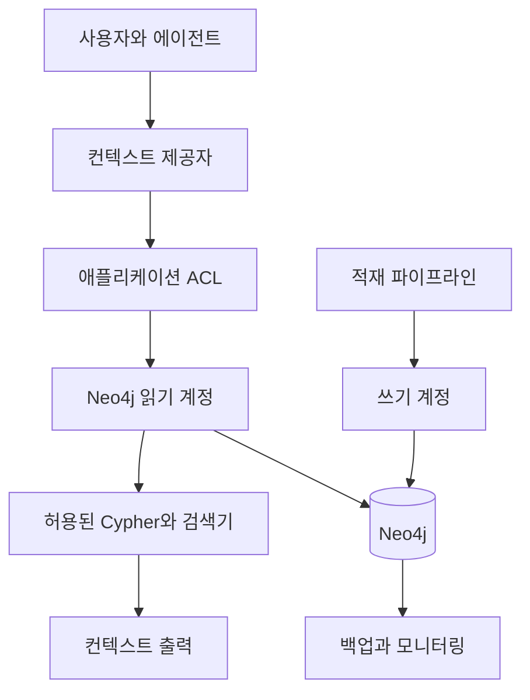

# 권한·최신성·성능을 포함한 Neo4j 운영 설계

운영 설계의 결론은 학습 환경과 제품 환경을 분리하는 것이다.
Neo4j Community Edition은 로컬 학습과 단일 인스턴스 실습에 충분할 수 있지만,
사내 컨텍스트 제공자가 권한, 가용성, 백업, 운영 보안을 요구하면
Enterprise 또는 Aura 기능 범위를 따로 검토해야 한다.

Text2Cypher는 특히 조심해야 한다.
읽기 전용 권한, 허용 쿼리, 시간 제한 없이 자연어를 Cypher로 바꾸는 기능을 운영 도구로 노출하면 안 된다.

이 글은 세 질문을 따라간다.

- Community 학습 환경과 Enterprise 또는 Aura 운영 환경은 무엇이 다른가?
- 권한, 최신성, 성능, 백업은 컨텍스트 제공자에서 어떤 실패를 막는가?
- APOC, GDS, n10s는 언제 선택 사항으로 붙이고 언제 미뤄야 하는가?

가져갈 판단 기준은 세 가지다.

- 운영 요구가 권한 분리, 고가용성, 백업, LDAP 같은 기능을 요구하면 에디션과 배포 방식을 먼저 확인한다.
- Text2Cypher는 읽기 전용, 허용 목록, 시간 제한, 결과 제한, 감사 로그가 없으면 운영 경로에서 제외한다.
- APOC, GDS, n10s는 기본 구성요소가 아니라 필요한 실패를 해결할 때만 선택한다.

> 이전 글: [GraphRAG 평가와 벡터 RAG 제거 실험](./07-evaluation-and-ablation.md)

## 학습 환경과 운영 환경을 나눈다

로컬 학습에서는 Neo4j Community Edition이나 임시 Aura 인스턴스로 시작할 수 있다.
목표는 모델링, 인덱스, Cypher, 검색기 경계를 손으로 확인하는 것이다.

운영 환경은 목표가 다르다.
사내 문서 권한, 감사 가능성, 장애 복구, 백업, 쿼리 제한, 모니터링을 다뤄야 한다.

| 구분 | 학습 환경 | 운영 환경 |
| --- | --- | --- |
| 배포 | 로컬 단일 인스턴스, 임시 Aura | Enterprise 또는 운영용 Aura tier 검토 |
| 권한 | 애플리케이션 선필터 중심 | DB 권한과 애플리케이션 ACL을 함께 검토 |
| 가용성 | 재시작 허용 | 백업, 복구, 장애 대응 필요 |
| 데이터 | 샘플 문서 | 실제 권한과 최신성 메타데이터 |
| 튜닝 | `EXPLAIN`, 제한된 `PROFILE` | 쿼리 계획, 지연, 비용, 장애율 추적 |

Neo4j 공식 Operations Manual은 Community Edition을 단일 인스턴스에 적합한 학습·소규모 용도로 설명하고,
Enterprise Edition은 백업, 클러스터링, 장애 조치, 역할 기반 접근 제어 같은 운영 요구를 포함한다고 설명한다.
Aura는 관리형 배포 선택지지만 tier별 기능 범위를 확인해야 한다.

## 운영 실패는 검색 품질 밖에서 터진다

GraphRAG 품질이 좋아도 운영 실패가 있으면 사내 도구로 쓸 수 없다.

| 운영 축 | 막으려는 실패 |
| --- | --- |
| 인증과 권한 | 권한 밖 문서, 저장소, 장애 정보 노출 |
| 최신성 | 폐기된 ADR이나 오래된 runbook 사용 |
| 쿼리 제한 | 관계 확장 폭발, 장시간 쿼리 |
| 출처 보존 | 답변은 맞지만 원문 근거를 찾을 수 없음 |
| 백업과 복구 | 재적재 불가, 인덱스 손상, 삭제 사고 |
| 관측 | 품질 저하 원인과 지연 병목을 찾지 못함 |

운영 설계는 검색 알고리즘을 고르는 일이 아니다.
컨텍스트 제공자가 실패할 때 어떤 피해가 생기는지 먼저 정하는 일이다.

읽기 계정과 쓰기 계정을 분리하면 사고 범위가 줄어든다.
컨텍스트 제공자는 검색 요청 중 그래프를 바꾸지 않는다.
적재와 정규화는 별도 파이프라인에서 실행한다.

## 권한 설계

운영 권한은 두 층으로 나눈다.

먼저 애플리케이션에서 사용자 권한을 `allowed_source_uris`, `allowed_service_ids`, `allowed_repository_ids` 같은 범위로 계산한다.
그다음 Neo4j 계정은 읽기 전용 최소 권한으로 제한한다.

현재 공식 `neo4j-graphrag`의 하이브리드 검색기는 사전 필터를 지원하지 않는다.
따라서 애플리케이션이 권한 목록을 계산했다는 사실만으로 후보 단계의 ACL이 보장되지는 않는다.
접근 범위별 검색 공간, Neo4j 하위 그래프 권한, 사용자 정의 검색기 중 하나가 후보 생성 전에 적용되어야 한다.

Neo4j Enterprise와 Aura의 역할 기반 접근 제어는 역할과 권한으로 데이터베이스 작업 범위를 제어한다.
공식 문서는 최소 권한 원칙을 강조하고,
`GRANT`, `DENY`, `REVOKE`로 권한을 관리한다고 설명한다.

학습용 Community 환경에서는 운영 수준의 RBAC를 전제로 하지 않는다.
대신 다음을 실습한다.

- 필터 가능한 단일 범위 속성으로 `VectorCypherRetriever` 후보를 제한한다.
- 하이브리드 검색은 접근 가능한 문서만 포함한 별도 검색 공간에서만 실행한다.
- 최종 출력 직전에 `source_uri`를 다시 검사한다.
- 권한 밖 후보가 얼마나 제거됐는지 추적 로그에 남긴다.
- 권한 때문에 답할 수 없는 경우 `answerable=false`로 반환한다.

운영 환경에서는 DB 계정의 권한,
애플리케이션 ACL,
문서 원천 시스템의 권한 동기화가 서로 어긋나지 않는지 별도로 테스트한다.

## Text2Cypher 운영 제한

공식 `Text2CypherRetriever`는 자연어를 Cypher로 바꿔 실행한다.
이 기능은 구조화된 질문에 유용할 수 있지만,
운영 기본 경로로 두기에는 위험하다.

최소 제한은 다음과 같다.

| 제한 | 이유 |
| --- | --- |
| 읽기 전용 DB 계정 | 생성 쿼리가 쓰기 작업을 해도 실행되지 않아야 한다 |
| 쿼리 검증 | 허용한 읽기 패턴과 프로시저만 통과시킨다 |
| 데이터베이스 권한 | 문자열 우회를 막는 최종 방어선으로 읽기 권한만 부여한다 |
| 시간 제한 | 장시간 탐색과 카티전 곱을 막는다 |
| 결과 제한 | 거대한 결과가 LLM 입력과 네트워크를 채우지 않게 한다 |
| 감사 로그 | 생성된 Cypher, principal, source scope, 실행 시간을 추적한다 |

이 제한이 없다면 Text2Cypher는 운영 경로가 아니라 실험 경로다.
키워드 블랙리스트만으로는 주석이나 표현 변형을 포함한 모든 우회를 막을 수 없다.
관계형 질문의 기본 경로는 사람이 작성한 제한된 검색 쿼리로 시작한다.
`HybridCypherRetriever`는 접근 범위가 이미 분리된 검색 공간에서만 사용한다.

## 최신성 운영

최신성은 ingestion 파이프라인과 컨텍스트 제공자가 같이 책임진다.

문서에는 최소한 다음 메타데이터가 필요하다.

- `source_uri`
- `source_version`
- `updated_at`
- `ingested_at`
- `valid_from`
- `valid_to`
- `superseded_by`
- `acl_version`

컨텍스트 제공자는 검색 점수와 별도로 최신성 상태를 계산한다.

| 상태 | 운영 처리 |
| --- | --- |
| `current` | 기본 근거로 사용 |
| `stale` | 최신 근거가 있으면 제외하거나 경고와 함께 낮춘다 |
| `unknown` | 확정 답변이 아니라 불확실한 근거로 표시한다 |

문서 원천에서 삭제된 문서도 중요하다.
삭제가 색인과 그래프에 반영되지 않으면,
에이전트는 더 이상 존재하지 않는 문서를 근거로 답할 수 있다.
삭제 이벤트와 재적재 작업은 최신성 평가의 일부로 본다.

## 성능과 쿼리 계획

관계 탐색은 쉽게 비싸진다.
특히 후보에서 시작해 여러 관계를 선택 없이 따라가면,
컨텍스트 조립 전에 이미 결과가 폭발한다.

성능 확인은 세 단계로 한다.

1. `EXPLAIN`으로 계획과 인덱스 사용 여부를 본다.
2. 격리된 읽기 쿼리에만 `PROFILE`을 사용해 실제 DB hits와 rows를 본다.
3. 애플리케이션 추적 로그에서 p50, p95, 시간 제한, 결과 수, 토큰 수를 기록한다.

`PROFILE`은 쿼리를 실제 실행한다.
따라서 쓰기 쿼리나 운영 데이터에 무심코 붙이지 않는다.
컨텍스트 제공자 계정이 읽기 전용이어야 하는 이유도 여기에 있다.

관계 확장 쿼리에는 기본 제한을 둔다.

- 시작 후보 수 제한
- 관계 타입 허용 목록
- 최대 hop 제한
- `LIMIT`과 정렬 기준
- source scope 조건
- 시간 제한

## 인덱스와 제약

운영에서 인덱스는 성능만이 아니라 실패를 빨리 드러내는 장치다.

| 대상 | 권장 제약 또는 인덱스 |
| --- | --- |
| `Service.service_id` | 유일성 제약 |
| `API.api_id` | 유일성 제약 |
| `Repository.repository_id` | 유일성 제약 |
| `Document.source_uri` | 유일성 제약 |
| `Chunk.chunk_id` | 유일성 제약 |
| `Chunk.embedding` | 벡터 인덱스 |
| `Chunk.text` | 전문 인덱스 |

Neo4j 벡터 인덱스는 Community와 Enterprise 모두에서 사용할 수 있지만,
서버 버전과 저장 형식에 따라 세부 기능이 달라진다.
예를 들어 최신 문서에서는 `LIST<INTEGER | FLOAT>`와 `VECTOR` 속성,
`SEARCH` 절,
필터 지원의 버전 경계를 따로 설명한다.

운영 문서에는 실제 서버 버전,
Cypher 버전,
인덱스 이름,
임베딩 차원,
유사도 함수,
재색인 절차를 남긴다.

## APOC, GDS, n10s는 선택 사항이다

세 도구는 유용하지만 기본값으로 붙일 이유는 없다.

| 도구 | 쓸 때 | 미룰 때 |
| --- | --- | --- |
| APOC Core | JSON 적재, 변환, graph refactoring, 유틸리티 프로시저가 필요할 때 | Cypher와 애플리케이션 코드로 충분할 때 |
| GDS | 커뮤니티 탐지, 중심성, 그래프 임베딩, 링크 예측이 평가 질문에 필요할 때 | 단순 관계 탐색과 근거 회수만 필요할 때 |
| n10s | RDF, OWL, SKOS, SHACL 연동이 실제 요구일 때 | 속성 그래프 모델과 애플리케이션 검증으로 충분할 때 |

공식 APOC 문서는 APOC Core가 Neo4j에서 지원되는 라이브러리이고,
APOC Extended는 커뮤니티 유지보수 영역이라고 구분한다.
또한 일부 APOC 프로시저는 Neo4j 메모리 추적에 잡히지 않을 수 있으므로 주의가 필요하다고 설명한다.

GDS는 그래프 알고리즘과 머신러닝 파이프라인을 제공한다.
Community Edition도 알고리즘을 포함하지만,
동시성, 카탈로그, 모델 관리 기능에는 제한이 있다.
따라서 운영 검색 경로에 GDS를 붙이기 전에
정말 평가 지표가 좋아지는지 제거 실험으로 확인한다.

n10s는 RDF와 온톨로지, SHACL, 기본 추론이 필요할 때 검토한다.
공식 안내 기준으로 n10s 플러그인은 자체 운영 Neo4j에서 사용할 수 있고 Aura에서는 사용할 수 없다.
이 시리즈의 기본 모델은 Neo4j 속성 그래프이므로,
RDF 호환성이 요구되기 전에는 선택 사항으로 둔다.

## 장애 대응과 재적재

운영 컨텍스트 제공자에는 재적재와 롤백 계획이 필요하다.

장애 시나리오는 다음처럼 나눠둔다.

| 장애 | 증상 | 대응 |
| --- | --- | --- |
| 인덱스 미완료 | 검색 결과가 비거나 느리다 | `SHOW INDEXES`로 상태 확인, 준비 전 트래픽 차단 |
| 잘못된 entity merge | 다른 서비스의 근거가 섞인다 | merge 규칙 롤백, affected claim 재계산 |
| stale 문서 | 폐기된 ADR이 반환된다 | source sync 재실행, `superseded_by` 확인 |
| ACL 동기화 지연 | 권한 변경이 반영되지 않는다 | ACL 버전 비교, 캐시 무효화 |
| 쿼리 폭주 | timeout과 DB 부하 증가 | 관계 타입과 hop 제한 강화 |

재적재는 전체 삭제 후 재생성만으로 설계하지 않는다.
문서 단위 재처리,
claim 단위 무효화,
인덱스 재생성,
이전 버전 복구 경로를 나눠야 한다.

## 실습

실습 목표는 학습용 Community 환경에서 운영 요구를 흉내 내고,
Enterprise 또는 Aura가 필요한 요구를 별도 표로 분리하는 것이다.

### 재현 가능한 단계

1. 로컬 Neo4j에 읽기 계정과 적재 계정을 논리적으로 분리한다고 가정하고 애플리케이션 설정을 나눈다.
2. 컨텍스트 제공자에는 읽기 전용 driver 설정만 연결한다.
3. 사용자별 `acl_partition`을 다르게 적용한 벡터 후보와 접근 범위별 하이브리드 검색 공간을 비교한다.
4. `EXPLAIN`으로 핵심 검색 쿼리의 계획을 확인한다.
5. 격리된 샘플 데이터에서만 `PROFILE`로 DB hits와 rows를 기록한다.
6. 오래된 ADR과 최신 ADR을 함께 넣고 freshness 판정을 확인한다.
7. Text2Cypher 경로를 만든다면 쿼리 검증, 읽기 전용 권한, 시간 제한 테스트를 먼저 실패 사례로 작성한다.
8. 운영 요구 표에 Community로 가능한 것과 Enterprise 또는 Aura 검토가 필요한 것을 나눈다.

### 확인할 결과

권한이 다른 사용자는 서로 다른 근거를 받아야 한다.
오래된 문서는 `stale` 또는 제외로 처리되어야 한다.
핵심 검색 쿼리는 인덱스를 사용하는 계획을 보여야 한다.
Text2Cypher는 허용하지 않은 쿼리를 실행하지 않아야 한다.

### 실패 판정

다음 중 하나라도 나오면 실패다.

- 컨텍스트 제공자 계정이 쓰기 권한을 가진다.
- 권한 밖 `source_uri`가 출력된다.
- 하이브리드 retrieval query의 후처리를 후보 선필터로 취급한다.
- Text2Cypher가 금지 키워드나 제한 없는 관계 탐색을 실행할 수 있다.
- `PROFILE`을 쓰기 쿼리나 운영 데이터에 무심코 적용한다.
- Community 학습 환경에서 가능한 기능과 Enterprise 또는 Aura 운영 기능을 구분하지 않는다.
- APOC, GDS, n10s를 필요성 평가 없이 기본 의존성으로 넣는다.

## 참고 링크

- Neo4j Operations Manual - Introduction and editions: https://neo4j.com/docs/operations-manual/current/introduction/
- Neo4j Operations Manual - Authentication and authorization: https://neo4j.com/docs/operations-manual/current/authentication-authorization/
- Neo4j Operations Manual - Role-based access control: https://neo4j.com/docs/operations-manual/current/authentication-authorization/manage-privileges/
- Neo4j Cypher Manual - Query plans: https://neo4j.com/docs/cypher-manual/current/planning-and-tuning/execution-plans/
- Neo4j Cypher Manual - Vector indexes: https://neo4j.com/docs/cypher-manual/current/indexes/semantic-indexes/vector-indexes/
- Neo4j Cypher Manual - Full-text indexes: https://neo4j.com/docs/cypher-manual/current/indexes/semantic-indexes/full-text-indexes/
- APOC Core Documentation: https://neo4j.com/docs/apoc/current/
- APOC Core Introduction: https://neo4j.com/docs/apoc/current/introduction/
- Neo4j Graph Data Science Manual: https://neo4j.com/docs/graph-data-science/current/
- Neo4j neosemantics: https://neo4j.com/labs/neosemantics/
- Neo4j GraphRAG RAG guide: https://neo4j.com/docs/neo4j-graphrag-python/current/user_guide_rag.html

## 이어서 읽기

- 이전 글: [GraphRAG 평가와 벡터 RAG 제거 실험](./07-evaluation-and-ablation.md)
- 함께 읽기: [RAG를 평가에서 역설계하기](../evaluation-driven-context-provider.md)
- 함께 읽기: [온톨로지에서 코딩 에이전트 컨텍스트까지](../../ontology-knowledge-graph-agent-context.md)
