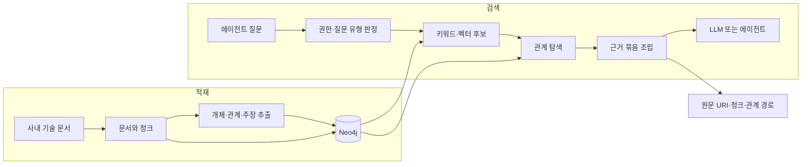
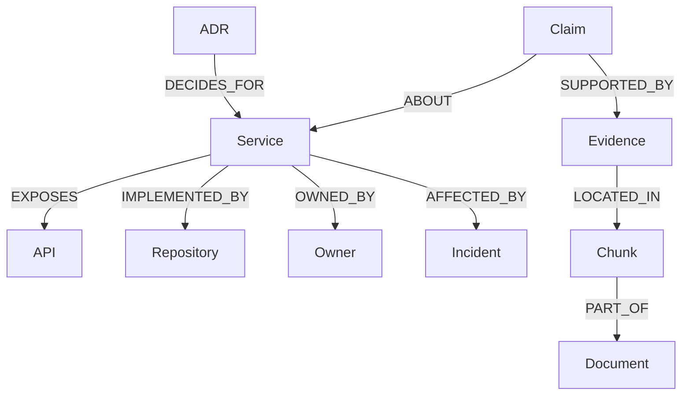

# Neo4j GraphRAG로 에이전트 컨텍스트 제공자 만들기

이 시리즈의 목표는 지식 그래프를 많이 만드는 것이 아니다.
에이전트가 지식 사이의 관계를 탐색하고,
마지막에는 답을 뒷받침하는 원문 문서까지 돌아갈 수 있는 검색 도구를 만드는 것이다.

그래프의 성공은 노드 수나 관계 수로 판단하지 않는다.
벡터 검색만으로 놓치던 관계형 질문에서 더 나은 근거를 찾고,
권한·최신성·출처 조건을 지킨 컨텍스트를 제공할 때 가치가 생긴다.

이 시리즈는 다음 세 질문을 따라간다.

- 온톨로지의 개념을 Neo4j 속성 그래프에 어떻게 옮길 것인가?
- 벡터 검색과 관계 탐색을 어떤 순서로 결합할 것인가?
- GraphRAG가 실제로 더 나은 컨텍스트를 만들었는지 어떻게 증명할 것인가?

먼저 읽으면 좋은 글은 두 편이다.

- [온톨로지에서 코딩 에이전트 컨텍스트까지](../../ontology-knowledge-graph-agent-context.md)
  - 클래스, 개체 동일성, 주장과 근거를 어떤 계약으로 다룰지 설명한다.
- [RAG를 평가에서 역설계하기](../evaluation-driven-context-provider.md)
  - 검색 결과가 아니라 컨텍스트 제공자 전체를 어떻게 평가할지 설명한다.

## 만들려는 시스템

원천 문서는 그래프에 흡수되어 사라지지 않는다.
그래프는 원문으로 가는 탐색 경로와 의미 계약을 제공하고,
최종 근거는 항상 문서와 청크를 가리킨다.

이 구조에서 Neo4j는 세 역할을 맡는다.

- 질문과 가까운 문서·청크·개체 후보를 찾는다.
- 후보에서 소유권, 의존성, 결정, 장애, 근거 관계를 확장한다.
- 관계 경로를 최종 원문과 연결해 출처를 잃지 않게 한다.

## 공통 실습 도메인

모든 글은 일반화한 사내 기술 지식 기반을 사용한다.
실제 회사명, 서비스명, 저장소명은 사용하지 않는다.

| 노드 | 역할 | 대표 식별자 |
| --- | --- | --- |
| `Service` | 운영되는 서비스 | `service_id` |
| `API` | 서비스가 제공하거나 호출하는 API | `api_id` |
| `Repository` | 구현 소스가 있는 저장소 | `repository_id` |
| `ADR` | 기술 결정과 대안 | `adr_id` |
| `Owner` | 담당 조직 또는 역할 | `owner_id` |
| `Incident` | 장애와 영향 | `incident_id` |
| `Claim` | 문서에서 추출한 검증 가능한 주장 | `claim_id` |
| `Evidence` | 주장을 뒷받침하는 원문 구간 | `evidence_id` |
| `Document` | 원본 문서 | `document_id`, `source_uri` |
| `Chunk` | 검색과 인용을 위한 문서 구간 | `chunk_id` |

대표 식별자는 병합과 참조에 쓰는 안정적인 키다.
`Service.name`, `API.path`, `Repository.name` 같은 표시 속성은 정확한 이름 검색과 전문 검색에 쓰되,
노드 정체성을 대신하지 않는다.
모든 노드는 대표 식별자에 고유성 제약을 두고 표시 속성은 별도 인덱스로 관리한다.

관계는 질문에 답하기 위해 만든다.

`Claim`과 `Evidence`를 분리하는 이유가 중요하다.
그래프의 관계가 맞는 것처럼 보여도,
그 관계를 뒷받침하는 원문이 없으면 에이전트에 제공할 근거로 사용할 수 없다.

공식 KG Builder의 어휘 그래프 기본값은 `Chunk-[:FROM_DOCUMENT]->Document`와 `Chunk.id`다.
이 시리즈는 모든 실습에서 `LexicalGraphConfig`를 명시해
`Chunk-[:PART_OF]->Document`와 `Chunk.chunk_id`로 통일한다.
추출된 개체에서 청크로 향하는 기본 출처 관계는 `MENTIONED_IN`으로 기록하고,
`Claim -> Evidence -> Chunk` 경로는 적재 후 검증 단계에서 별도로 만든다.

### 공통 ACL 계약

권한 관련 속성은 같은 역할을 하지 않는다.

| 필드 | 저장 위치 | 역할 |
| --- | --- | --- |
| `allowed_groups` | `Document` | 원본 문서의 권한 원천이다 |
| `acl_partition` | `Chunk` | 단일 권한 범위를 재현하는 벡터 선필터 실습용 속성이다 |
| `allowed_source_uris` | 요청 계약 | 출력 직전 원문 접근 권한을 다시 확인한다 |
| 접근 범위별 인덱스·데이터베이스 | 검색 경계 | 하이브리드 검색에서 후보 생성 전 권한을 강제한다 |

`allowed_groups` 같은 복수 그룹 목록을 `acl_partition`과 같은 단일 필터 속성으로 보지 않는다.
복잡한 문서별 ACL은 접근 범위별 검색 공간, Neo4j 권한, 사용자 정의 검색기 중 하나로
후보 단계부터 제한해야 한다.

## 시리즈 순서

| 순서 | 글 | 읽고 나면 할 수 있는 것 |
| --- | --- | --- |
| 시작 | [Neo4j GraphRAG의 목표와 기준선](./01-goal-and-baseline.md) | 관계형 질문과 평가 기준선을 정의한다 |
| 모델 | [속성 그래프와 온톨로지 모델링](./02-property-graph-ontology-modeling.md) | 질문에서 노드·관계·식별 계약을 역설계한다 |
| 질의 | [Cypher, 제약, 쿼리 계획으로 검색 안정화하기](./03-cypher-constraints-query-plans.md) | 관계 탐색 쿼리와 무결성·성능 경계를 검증한다 |
| 적재 | [문서에서 근거를 보존한 지식 그래프 구축하기](./04-knowledge-graph-builder.md) | 추출·저장·개체 식별 파이프라인을 분해한다 |
| 검색 | [벡터·전문·그래프 탐색을 결합한 하이브리드 검색](./05-hybrid-retrieval.md) | 질문 유형에 맞춰 검색 경로를 선택한다 |
| 제공 | [에이전트를 위한 Neo4j 컨텍스트 제공자 설계](./06-agent-context-provider.md) | 읽기 전용 검색 도구의 입출력과 안전 경계를 정의한다 |
| 평가 | [GraphRAG 평가와 벡터 RAG 제거 실험](./07-evaluation-and-ablation.md) | 그래프 구축·검색·컨텍스트·답변 품질을 따로 측정한다 |
| 운영 | [권한·최신성·성능을 포함한 Neo4j 운영 설계](./08-production-security-operations.md) | 학습용 구성과 사내 운영 구성을 구분한다 |

각 글은 앞 글의 산출물을 다음 글의 입력으로 사용한다.
중간 글만 골라 읽을 수는 있지만,
실습은 위 순서대로 진행해야 평가 기준이 흔들리지 않는다.

## 공통 질문 세트

실습 질문은 단일 문서 검색만으로 끝나는 질문과 관계 탐색이 필요한 질문을 섞는다.

### 단일 근거 질문

- 특정 API의 제한 시간은 얼마인가?
- 특정 ADR이 채택한 저장 방식은 무엇인가?

### 관계 탐색 질문

- 이 API를 변경하면 어떤 서비스와 저장소를 함께 검토해야 하는가?
- 최근 장애와 관련된 기술 결정은 무엇이며 담당자는 누구인가?
- 같은 서비스에 대해 서로 충돌하는 운영 문서가 있는가?

### 안전 경계 질문

- 현재 사용자가 볼 수 없는 문서를 제외하고 근거를 제시할 수 있는가?
- 폐기된 ADR보다 최신 결정을 우선할 수 있는가?
- 답을 만들 수 없을 때 근거 부족으로 중단할 수 있는가?

관계형 질문이 있다고 해서 GraphRAG가 자동으로 유리한 것은 아니다.
관계 추출이 부정확하거나 원문 연결이 끊기면,
그래프 탐색은 벡터 검색보다 더 그럴듯한 오답을 만들 수 있다.

## 공통 평가표

| 계층 | 확인할 항목 | 실패로 보는 조건 |
| --- | --- | --- |
| 그래프 구축 | 개체 식별, 관계 정확성, 원문 연결 | 잘못 합쳐진 개체나 근거 없는 관계가 생긴다 |
| 후보 검색 | 필수 문서와 증거 회수 | 필요한 근거가 후보에 들어오지 않는다 |
| 관계 탐색 | 필요한 경로 회수, 경로 길이와 잡음 | 무관한 고차 관계가 컨텍스트를 채운다 |
| 컨텍스트 조립 | 출처, 최신성, 토큰 예산 | 후보에 있던 근거가 최종 입력에서 빠진다 |
| 안전 | 접근 권한, 읽기 전용, 시간 제한 | 권한 밖 문서나 쓰기 쿼리가 실행된다 |
| 최종 답변 | 근거 충실성, 인용 정확성, 무응답 | 원문이 지지하지 않는 답을 만든다 |
| 운영 | 지연, 비용, 실패율 | 품질을 얻었지만 서비스 예산을 넘는다 |

절대적인 목표 수치는 데이터와 서비스 예산을 보고 정한다.
처음에는 다음 불변 조건부터 고정한다.

- 권한 위반은 허용하지 않는다.
- 근거로 사용한 관계는 최종 원문을 가리켜야 한다.
- 최신성을 판정할 수 없는 근거는 상태를 명시한다.
- 그래프를 추가한 구성은 같은 질문 세트의 벡터 RAG 기준선과 비교한다.

## 실습 환경과 버전 경계

학습 구현은 Python과 공식 `neo4j-graphrag` 패키지를 중심으로 한다.
로컬에서는 Neo4j Community Edition 또는 임시 AuraDB 인스턴스로 시작할 수 있다.

현재 공식 문서에서 확인해야 할 버전 경계가 있다.

- `neo4j-graphrag`는 과거 `neo4j-genai` 패키지의 후속 패키지다.
- 지식 그래프 구축 파이프라인은 아직 실험 기능이므로 API 변경 가능성을 전제로 둔다.
- 현재 공식 하이브리드 검색기는 사전 필터를 지원하지 않으므로, 문서 ACL은 접근 범위별 검색 공간·Neo4j 권한·사용자 정의 검색기 중 하나로 후보 생성 전에 적용한다.
- 최신 Neo4j는 달력 버전과 Cypher 버전을 분리하므로 예제의 서버·Cypher 버전을 함께 기록한다.
- 벡터 인덱스 질의 방식은 서버 버전에 따라 `SEARCH` 절 또는 프로시저를 사용한다.
- 역할 기반 권한, 하위 그래프 접근 제어, 다중 데이터베이스, 온라인 백업은 에디션과 배포 방식에 따라 지원 범위가 다르다.

따라서 글의 코드를 복사하는 것보다,
현재 설치한 버전의 공식 문서에서 지원 범위를 다시 확인하는 습관이 더 중요하다.

## 이 시리즈에서 뒤로 미루는 것

다음 기술은 필요할 때만 선택한다.

- RDF·OWL·SHACL 연동이 필요할 때 `neosemantics`를 검토한다.
- 커뮤니티 탐지나 그래프 임베딩이 평가 질문에 필요할 때 GDS를 검토한다.
- 복잡한 적재·변환을 Cypher만으로 다루기 어려울 때 APOC Core를 검토한다.
- 자유 형식 질문을 Cypher로 바꾸는 가치가 확인된 뒤에만 Text2Cypher를 연다.

기본 검색 경로를 검증하기 전에 선택 기능부터 붙이면,
어느 구성요소가 품질을 바꿨는지 알 수 없게 된다.

## 참고 링크

- Neo4j GraphRAG for Python: https://neo4j.com/docs/neo4j-graphrag-python/current/
- Neo4j GraphRAG RAG guide: https://neo4j.com/docs/neo4j-graphrag-python/current/user_guide_rag.html
- Neo4j GraphRAG Knowledge Graph Builder: https://neo4j.com/docs/neo4j-graphrag-python/current/user_guide_kg_builder.html
- Neo4j data modeling: https://neo4j.com/docs/getting-started/data-modeling/
- Neo4j Cypher Manual: https://neo4j.com/docs/cypher-manual/current/
- Neo4j Operations Manual: https://neo4j.com/docs/operations-manual/current/
- Neo4j editions: https://neo4j.com/docs/operations-manual/current/introduction/
- Neo4j GraphAcademy courses: https://graphacademy.neo4j.com/courses/
