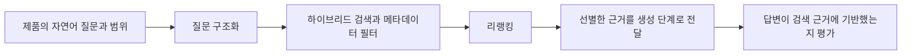

# RAG 검색을 제품별로 만들지 않고 공통 파이프라인으로 둔다

LLM을 쓰는 서비스가 늘면 서비스마다 데이터를 가져오는 방식이 제각각이 된다.
이 글은 RAG를 "문서를 LLM에 붙이는 기술"이 아니라 "검색을 제품화하는 문제"로 보면 무엇이 달라지는지 정리한다.

토스증권 ML 엔지니어가 쓴 [토스증권 추천과 검색은 어떻게 진화하고 있을까?](https://toss.tech/article/tech_talk_talk_3)(황호익, 토스 기술 블로그, 2026-08-26)의 RAG 부분을 바탕으로 한다.
영상판은 [테크톡톡 2026 | ML Engineer - 토스증권 추천과 검색은 어떻게 진화하고 있을까?](https://www.youtube.com/watch?v=7jINAKEjXXc)다.
로컬 환경의 RAG 구성 논의를 모은 Hacker News 스레드 [Ask HN: 로컬에서 RAG를 어떻게 구현하고 있나요?](https://news.hada.io/topic?id=25854)(GeekNews 소개, 원문 [HN 스레드](https://news.ycombinator.com/item?id=46616529))의 의견도 일부 참고했다.

## 데이터를 가져오는 방식이 파편화되는 문제

원문이 든 상황은 이렇다.
어떤 서비스는 검색 엔진에 쿼리를 직접 작성하고, 어떤 서비스는 필터를 따로 고안해 조합한다.
새 서비스를 시작할 때마다 원하는 데이터를 잘 찾는 쿼리를 처음부터 다시 찾아야 한다.

이렇게 두면 품질 기준과 운영 방식이 서비스마다 갈라진다.
LLM은 사실과 다른 내용을 생성할 수 있어서, 답변이 검색된 문서에 근거하는지 확인하는 일도 서비스마다 반복된다.

## 공통 파이프라인

제품은 자연어 질문과 필요한 범위만 넘기고, 검색 플랫폼이 후보 생성과 재정렬을 맡는 구조다.

| 단계 | 하는 일 |
| --- | --- |
| 질문 구조화 | 질문이 원하는 범주를 분류하고, 날짜 조건과 검색 범위를 만들고, 질문 벡터를 생성해 검색 쿼리를 구성한다 |
| 하이브리드 검색 | 텍스트 검색과 벡터 검색을 함께 쓰고 메타데이터 필터를 적용해 후보를 찾는다 |
| 리랭킹 | 후보를 한 번 더 걸러 관련 없는 항목을 줄이고 중요한 순서로 정렬한다 |

하이브리드 검색과 리랭킹의 구현은 [OpenSearch로 RAG 검색 품질 높이기](../../database/opensearch/rag-search-quality.md)가 자세히 다룬다.
점수 단위가 다른 두 검색 결과를 순위로 합치는 RRF는 [Milvus 벡터 데이터베이스 입문](../../database/milvus/milvus-architecture-and-performance.md)에 정리돼 있다.

원문에서 이 단계의 모델은 대부분 LLM 호출로 시작했다.
이후 우선순위가 높은 모델부터 하나씩 직접 운영하는 모델로 바꿨다.
처음부터 모든 단계를 자체 모델로 만들지 않아도 된다는 뜻이다.

## 제품은 달라도 흐름은 하나다

원문의 뉴스 RAG에는 시황을 설명하는 뉴스, 기업의 가격 변동을 설명하는 뉴스, 투자 판단과 관련된 뉴스처럼 서로 다른 제품 요구가 들어왔다.
플랫폼 관점으로 열어 두면 모두 자연어 검색 API로 들어오고, 내부에서 메타데이터 태그로 범위를 제어한 뒤 같은 하이브리드 검색과 리랭킹 흐름을 탄다.

## 각 단계가 막아 주는 약점

원문은 검색 품질에 하나의 해법이 없었다고 말한다.
서로의 약점을 보완하는 모듈을 점진적으로 붙여 갔다.

| 약점 | 보완 |
| --- | --- |
| 벡터 검색은 키워드 중심 질의에 약하다. 도메인 특화 임베딩도 모든 용어를 고르게 학습하기 어렵다 | 텍스트 검색을 함께 쓴다 |
| 텍스트 검색은 형태소 분석기가 모르는 새 키워드에 약하다 | 사전을 갱신하는 운영을 둔다 |
| 의도가 분명한 질문에 불필요한 결과가 한두 건 섞이면 사용자가 시스템 전체를 의심한다 | 리랭커로 마지막 노이즈를 줄인다 |
| 질문과 문서가 같은 범주인지 알기 어렵다 | 분류 모델로 범주 태그를 달고, 태그가 맞으면 점수를 높인다 |

범주 분류 체계는 검색에만 쓰이지 않았다.
잘 만든 분류는 다른 제품 기능에서도 재사용할 수 있었다고 한다.

## 단계를 올리기 전에 측정 장치를 만든다

Ask HN 스레드에서 반복된 의견은 두 가지다.
벡터 DB가 항상 필요한 것은 아니고 BM25나 SQLite FTS5 같은 텍스트 검색만으로 충분한 경우가 많다는 것이다.
그리고 RAG 성능은 결국 LLM에 넘기는 짧은 텍스트 조각의 질이 정한다는 것이다.

이 의견은 단계를 올리는 기준으로 이어진다.
질의 확장, 융합 방식 변경, 재정렬 모델 교체는 모두 품질을 올리려는 변경이다.
정답 질문 세트와 recall, nDCG 같은 지표가 없으면 좋아졌는지 판단할 근거가 없다.
부하 테스트는 처리 시간만 보므로 품질 판단을 대신하지 못한다.

점수를 직접 합산하는 방식을 택한다면 정규화 함수와 가중치를 설정값으로 빼고, 바꿀 때마다 측정해 이력을 남기는 편이 낫다.
코드 상수로 박아 두면 왜 그 값인지 나중에 아무도 설명하지 못한다.

평가 지표를 어떻게 나누는지는 [RAG를 평가에서 역설계하기](./evaluation-driven-context-provider.md)에서 이어서 읽을 수 있다.

## 정리

- 서비스마다 검색을 따로 만들면 품질 기준과 운영 방식이 갈라진다. 제품은 질문과 범위만 넘기고 검색 플랫폼이 후보 생성과 재정렬을 맡는다.
- 검색 방식 하나를 만능으로 보지 않고, 약점을 보완하는 모듈을 하나씩 더한다.
- 모듈을 더하기 전에 측정 장치를 먼저 둔다.
- 관계를 따라가야 하는 질문은 이 파이프라인만으로 풀리지 않는다. 그 확장은 [Beam search로 GraphRAG 경로 폭발을 제한하기](./neo4j-graphrag/path-retrieval-beam-search.md)에서 다룬다.
