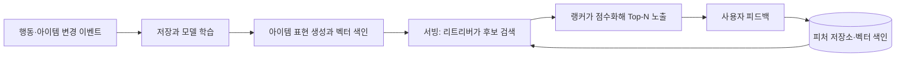

# 배치 추천에서 실시간 루프로 옮기는 조건과 구성

추천은 미리 계산해 저장해 둔 리스트에서 시작해도 된다.
다만 사용자의 맥락이 빠르게 바뀌면 이벤트와 피드백을 계속 흡수하는 루프 구조로 옮겨야 한다.

이 글은 토스증권 ML 엔지니어가 정리한 [토스증권 추천과 검색은 어떻게 진화하고 있을까?](https://toss.tech/article/tech_talk_talk_3)(황호익, 토스 기술 블로그, 2026-08-26)의 추천 부분을 일반화한 정리다.
같은 발표의 영상판은 [테크톡톡 2026 | ML Engineer - 토스증권 추천과 검색은 어떻게 진화하고 있을까?](https://www.youtube.com/watch?v=7jINAKEjXXc)다.
글의 구조와 판단 기준은 원문을 따르고, 표현과 설명은 직접 다시 썼다.

## 배치와 클러스터로 충분한 구간

사용자 데이터를 배치로 모아 클러스터를 만들고, 클러스터별 추천 리스트를 미리 계산해 Redis나 MongoDB 같은 저장소에 넣어 두는 방식이다.
원문은 이 방식이 틀린 선택이 아니라고 강조한다.
제품 생애주기가 빠르고 추천할 콘텐츠 종류가 단순할 때는 가장 현실적인 선택이었다.

구조가 단순하고 장애 지점이 적다는 점도 장점이다.
아래 조건이 나타나기 전에는 옮길 이유가 없다.

## 옮길 때를 알려 주는 조건

원문이 든 변화는 네 가지다.

- 사용자의 관심이 한 세션 안에서도 화면마다 달라진다.
- 추천 대상 자체가 시장 이벤트 같은 외부 사건으로 계속 변한다.
- 뉴스, 커뮤니티, AI 콘텐츠처럼 추천할 콘텐츠 종류가 늘어난다.
- 실시간 데이터와 머신러닝 플랫폼이 갖춰져 비용을 감당할 수 있게 된다.

마지막 조건이 중요하다.
앞의 세 가지가 있어도 플랫폼 비용이 감당되지 않으면 옮기지 못한다.

이 변화는 문제 정의를 바꾼다.
"이 사용자가 원래 좋아할 만한 것"을 주던 구조에서 "지금 이 맥락에서 필요한 것"을 주는 구조로 옮겨 간다.

## 루프의 구성

1. 사용자의 행동 이벤트를 받아 저장하고 모델을 학습한다.
2. 아이템이 새로 생기거나 바뀌면 아이템 표현을 다시 만들어 벡터를 색인한다.
3. 온라인 서빙 시점에 학습된 리트리버가 벡터 색인에서 후보를 찾고, 랭커가 점수를 매겨 최종 Top-N을 노출한다.
4. 노출 결과에 대한 피드백을 피처 저장소와 벡터 색인에 반영한다.

후보를 찾고 순위를 다시 매기는 2단 구조는 [RAG 검색을 제품별로 만들지 않고 공통 파이프라인으로 둔다](./rag-retrieval-platform-pipeline.md)에서 다루는 검색 구조와 닮았다.

## 루프에 따라오는 운영 부담

정적 리스트에는 없던 부담이 생기고, 전환 비용의 대부분이 여기서 나온다.

- 학습 데이터가 제대로 만들어지는지, 색인이 갱신되는지 확인하는 관측 장치가 필요하다.
- 특정 결과가 왜 추천됐는지 되짚을 수 있는 디버깅 도구가 필요하다.
- 임베딩 모델을 계속 개선하려면 벡터 버전과 색인 교체를 관리해야 한다. 이 부분은 [임베딩 모델을 바꾸면 벡터 색인 운영도 함께 바뀐다](./embedding-version-and-vector-index-lifecycle.md)에서 자세히 다룬다.

## 정리

- 배치와 클러스터 추천은 조건이 갖춰지기 전까지 맞는 선택이다.
- 맥락 변화, 외부 이벤트, 콘텐츠 다양화와 플랫폼 성숙이 겹칠 때 루프로 옮기는 것을 검토한다.
- 루프는 관측, 설명 가능성, 벡터 색인 운영이라는 비용을 함께 가져온다.
