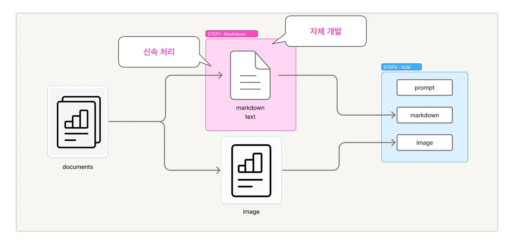
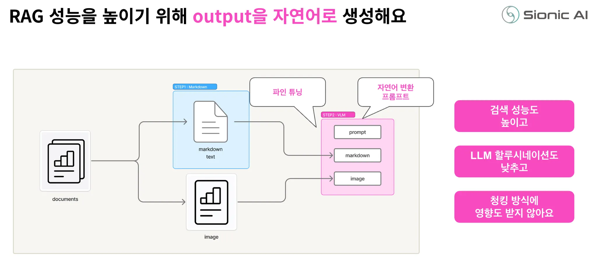

# STORM Parse

- Sionic AI의 Intelligent Document Parser
  - https://www.sionic.ai/ko/parse
- 단순히 문서에서 텍스트를 추출하는 것을 넘어서, 문서의 구조와 의미를 이해하고 이를 AI가 효과적으로 활용할 수 있는 형태로 변환하는 것이 핵심목표이다.

<br>

## 주요 기능

- **다양한 포맷과 대용량 문서 학습 지원**
  - PDF, DOCX, XLSX, HWP와 같은 주요 오피스 문서 지원
  - JPG, PNG 등 이미지 파일 지원
  - 1,000 페이지 문서도 1분 내 학습 가능
- **이미지, 표 포함 문서의 자동 구조화**
  - 이미지, 표, 그래프 등 다양한 요소가 포함된 문서도 별도 전처리 없이 자동 구조화
  - 비정형 데이터를 LLM 학습에 최적화된 형태로 변환
- **레이아웃 기반의 고성능 파싱**
  - VLM으로 문서 내 시각 정보의 배치, 계층, 연결성을 통합적으로 분석해 정밀하게 인식함
- **다국어 문서 처리**
  - 글로벌 환경의 문서 처리를 위한 다국어 인식 기능 제공함
  - 언어와 무관하게 일관된 품질의 결과를 만들어냄

<br>

## Agentic RAG에서 문서 파싱이 중요한 이유: 기술적 관점

- **1. 정보 보존(Information Preservation)의 문제**
  - 파싱 과정에서 중요한 정보가 누락되거나 왜곡되면, 아무리 정교한 검색을 수행해도 올바른 답을 찾을 수 없다.
  - 예를 들어 재무제표의 특정 셀 값이 잘못 추출되거나, 차트의 범례 정보가 누락되면 할루시네이션이 생길 확률이 높아진다.
- **2. 구조 보존(Structure Preservation)의 문제**
  - 문서는 단순한 텍스트의 나열이 아니라 계층적 구조를 갖고 있다.
  - 제목과 본문, 표의 헤더와 데이터 행, 리스트의 계층 구조 등이 명확히 구분되어야 한다.
  - 구조가 무너지면 맥락(context)이 손실되고, LLM이 올바르게 해석하기 어려워진다.
- **3. 의미 보존(Semantic Preservation)의 문제**
  - 표의 색상 구분, 차트의 시각적 패턴, 이미지 속의 다이어그램 등은 단순한 장식이 아니라 의미를 담고 있다.
  - 이러한 시각적 의미를 텍스트로 변환하지 못하면 중요한 정보가 손실된다.
  - 예를 들어 "위험" 표시가 빨간색으로 강조되어 있다는 것
  - 특정 지표가 급격히 상승하는 추세를 보인다는 것 등은 사람의 눈으로는 바로 알 수 있지만 단순 텍스트 추출에서는 포착되지 않을 수 있다.
- **4. 청킹 친화성(Chunking Friendiness)의 문제**
  - 문서가 어떻게 파싱되느냐에 따라 청킹의 품질이 크게 달라질 수 있다.
  - 예를 들어 표가 단순히 텍스트로 평탄하게 변환되면 청크 경계에서 표가 잘렸을 떄 맥락을 완전히 잃을 수 있다.
  - 반면 표의 각 행이 완전한 문장으로 설명되어 있다면, 어디서 잘리든 각 청크가 독립적으로 의미를 갖게 된다.
- **5. 검색 효율성(Retrieval Efficiency)의 문제**
  - 임베딩 모델은 자연어에 최적화되어 훈련된다.
  - 마크다운 테이블 문법이나 HTML 태그 같은 구조화된 형식보다는 자연스러운 문장에서 더 좋은 임베딩을 생성한다.
  - 파싱 결과가 얼마나 자연어에 가까운지가 검색 정확도에 직접적인 영향을 미친다.

<br>

## STORM Parse의 기술적 접근: VLM 기반 2단계 변환

- STORM Parse는 위와 같은 문제들을 해결하기 위해 Vison-Language Model을 핵심 기술로 채택했다.
  - VLM은 이미지와 텍스트를 동시에 처리할 수 있는 멀티모달 AI 모델
  - 최근에 나온 GPT 5.2, Claude 4.5, Gemini 3 Pro 등과 같은 모델들이 있다.
- VLM의 가장 큰 장점은 시각적 의미를 이해할 수 있다는 것이다.
  - 이미지 내 각 요소들이 어떤 관계를 가지고 시각적으로 어떤 정보를 가지고 있는지 이해할 수 있다.
  - 차트의 경우 선의 기울기에서 추세를, 막대의 높이에서 값의 비교를, 색상에서 카테고리 구분을 이해할 수 있다.
- 문서 레이아웃 측면에서도 VLM은 강력하다.
  - 페이지의 전체 구조를 보고 메인 컨텐츠와 사이드바를 구분하고, 다단 레이아웃에서 올바른 읽는 순서를 파악할 수 있다.
  - 헤더와 푸터, 페이지 번호 같은 메타데이터를 실제 내용과 구분할 수도 있다.
- VLM은 기술적 확장성 측면에서도 유리하다.
  - 범용적인 시각 이해 능력을 가지고 있어, 기업마다 다른 템플릿, 산업마다 다른 문서 스타일에도 유연하게 대응할 수 있다.
  - VLM은 기술은 계속 발전하고 있어, 모델이 업데이트 될수록 STORM Parse 성능도 자연스럽게 향상될 수 있다.
- **하지만 VLM을 사용하는 것만으로 모든 문제가 해결되지는 않는다**
  - 때때로 예측 불가능한 출력을 생성할 수 있다.
    - LLM의 할루시네이션 문제와 유사하게, 실제로 존재하지 않는 텍스트를 "보거나", 숫자를 잘못 읽거나, 구조를 오해할 수 있다.
  - 일관성(consistency) 문제가 있다.
    - 같은 문서를 여러 번 처리해도 매번 조금씩 다른 결과를 생성할 수 있다.

<br>




STORM Parse는 이러한 문제를 2단계 변환 구조를 통해 해결했다. <br>
이 접근법은 전통적 방법의 안정성과 VLM의 이해력을 결합하여 최상의 결과를 도출한다.

### 1단계: 마크다운 변환 (Markdown Conversion)

- 자체 개발한 마크다운 변환 모듈을 사용한다.
  - PyMuPDF, python-docx 같은 검증된 라이브러리들을 활용하되 대량의 문서 처리를 할 수 있도록 최적화했다.
- 문서의 기본 구조를 파악하여 제목, 단락, 리스트, 표, 이미지 위치 등을 식별하고, 텍스트를 추출하여 마크다운 형식으로 변환한다.

### 2단계: VLM 기반의 의미 해석 (VLM-based Semantic Interpretation)

- 1단계에서 생성된 마크다운 텍스트와 원본 문서의 이미지를 함께 VLM에 입력한다.
- VLM에게 주어지는 프롬프트는 매우 구체적이고 세밀하게 설계된다.
  - 예를들어 다음과 같다
  - ```text
    "제공된 마크다운 텍스트는 이 문서의 초벌 변환 결과입니다. 원본 이미지를 보고 다음 사항을 검증하고 개선하세요. 첫째, 마크다운에 누락된 텍스트가 이미지에 있는지 확인하고 추가하세요. 둘째, 표의 구조가 올바른지 확인하고, 병합된 셀의 정보를 명확히 하세요. 셋째, 이미지나 차트가 있다면 그 내용을 상세히 설명하는 문장을 생성하세요. 넷째, 여러 단락이나 섹션의 읽는 순서가 논리적으로 올바른지 확인하세요..."
    ```
- 위와 같은 프롬프트를 통해 VLM은 마크다운 텍스트를 기준점으로 삼아 검증하고 보완하는 작업을 수행한다.
  - 이는 두 가지 중요한 효과를 낸다
  - **첫쨰, 환각이 크게 감소한다.**
    - VLM이 추출된 텍스트를 참고하므로 실제로 없는 내용을 만들어낼 가능성이 낮아진다.
  - **둘째, VLM 답변의 안정성을 높일 수 있다.**
    - 마크다운 텍스트가 기본 구조를 제공하므로, VLM의 출력이 매번 크게 달라지지 않는다.
    - 같은 문서를 여러 번 처리해도 핵심 내용은 일관되게 유지된다.

## Agentic RAG 최적화의 핵심: 자연어 변환

STORM Parse의 또 다른 중요한 차별점은 최종 출력 형태이다. <br>
많은 문서 파서들이 마크다운, HTML, JSON 같은 구조화된 형식으로 결과를 반환하지만, STORM Parse는 자연어 텍스트를 생성한다. <br>
이것이 왜 RAG 성능에 큰 차이를 만드는지 기술적으로 분석해보자.

### 임베딩 모델의 특성

- 현재 널리 사용되는 임베딩 모델들 (OpenAI text-embedding-3, Cohere embed-v3, Voyage AI등)은 대부분 자연어 코퍼스로 훈련되었다.
  - 위키피디아, 뉴스 기사, 책, 웹페이지 등 인간이 작성한 자연스러운 문장들이 주된 훈련 데이터이다.
  - 따라서 이들 모델은 자연어 문장에서 가장 좋은 성능을 발휘한다.
- 결과적으로 동일한 정보라도 자연어로 표현되었을 떄와 구조화된 형식으로 표현되었을 떄 임베딩 품질이 달라진다.
  - "통계학특강은 4학년 1학기 과목이며 학점은 3점입니다"라는 문장은 임베딩 모델이 잘 처리할 수 있다.
  - "| 통계학특강 | 4학년 | 1학기 | 3 |"이라는 표 형식은 상대적으로 덜 의미있는 임베딩을 생성할 수 있다.

### 청킹 경계 문제의 해결

- RAG 시스템에서는 긴 문서를 여러 청크로 나누어 처리한다.
  - 일반적으로 512 ~ 1024 토큰 정도의 청크를 사용한다.
- 위 과정에서 청크 경계에 걸친 정보가 문제가 된다.
  - 예를 들어 큰 표가 있다고 가정해보자. 마크다운 테이블 형식으로 변환된 경우, 청크 경계에서 표가 잘리면 헤더 정보와 데이터가 분리될 수 있다.
  - 첫 번째 청크에는 "| 과목명 | 학년 | 학기 |"라는 헤더만 있고
  - 두 번쨰 청크에는 "| 통계학 특강 | 4 | 1 |"이라는 데이터만 있을 수 있다.
  - 이 경우 두 번째 청크만 검색되면 "4"와 "1"이 무엇을 의미하는 지 알 수 없다.

### LLM 이해도 향상

- 최종 답변을 생성하는 LLM 역시 자연어 프롬프트에 가장 잘 반응한다.
- 검색된 컨텍스트가 자연어 문장으로 구성되어 있으면 LLM이 정보를 추출하고 종합하기 쉽다.
- 자연어 형식이라면 이미 파싱 단계에서 정보가 명확한 문장으로 변환되어 있으므로, LLM은 단순히 문장을 읽고 이해하면 된다.
- 추가적인 구조 해석이 필요 없으므로 오류 가능성이 줄어든다.

### 구체적 예시: 표의 자연어 변환

실제 예시로 살펴보자. 다음과 같은 대학 교과 과정 표가 있다고 가정해보자.

```text
| 순번 | 과목명 | 교과목명 | 학수번호 | 학점 | 이론 | 실습 | 이수학년 | 개설학기 |
|------|--------|----------|----------|------|------|------|----------|----------|
| 37 | 전공선택 | 위상수학특강 | MATH4451 | 3 | 3 | | 4 | O | |
| 38 | 전공선택 | 통계학특강 | MATH4501 | 3 | 3 | | 4 | O | |
```

**STORM Parse의 자연어 출력**:

```text
"37번째 항목인 위상수학특강은 전공선택 과목이며, 학수번호는 MATH4451, 학점은 3점입니다. 이론 시간은 3시간이며, 이수 학년은 4학년입니다. 개설학기는 1학기입니다. 38번째 항목인 통계학특강은 전공선택 과목이며, 학수번호는 MATH4501, 학점은 3점입니다. 이론 시간은 3시간이며, 이수 학년은 4학년입니다. 개설학기는 1학기입니다."
```

이렇게 변환된 텍스트는 다음의 장점이 있다.

- **1. 명시적 연결**: "38번 째 항목인"이라는 표현으로 순서 정보가 보존된다.
- **2. 완전한 문맥**: 각 문장이 주어와 속성들을 모두 포함하여 독립적으로 이해 가능하다.
- **3. 자연스러운 표현**: "~이며", "~입니다" 같은 자연어 연결사가 정보를 매끄럽게 연결한다.
- **4. 임베딩 친화적**: 자연어 문장이므로 임베딩 모델이 의미를 잘 포착한다.
- **5. 청킹 안전성**: 어디서 잘려도 각 부분이 의미를 갖는다.
