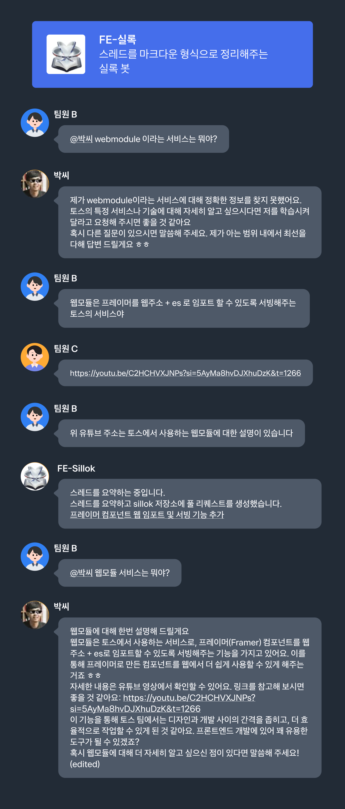

# 토스 : 100번 실패하고 살려낸 문서 시스템

- [100번 실패하고 살려낸 문서 시스템](https://www.youtube.com/watch?v=zlXsomDPQ_U)
- [토스 프론트엔드 개발자들이 더 이상 문서를 찾지 않는 이유](https://toss.tech/article/toss-frontend-ai-docs)

 

- 신규 입사자의 경험

  - 모르는 지식 : "이건 누구에게 물어봐야 하지"
  - 복잡한 코드 : "이 기능은 어떻게 동작하는 거지?"
  - 어려운 맥락 : "이 코드는 왜 이렇게 작성된 거지?"

 

- 정보가 사람들의 머릿속에만 암시적으로 존재한다

  - 정보를 얻으려면..
    - 옆자리 동료에게 질문
    - 슬랙에 검색
  - 휴가를 가거나 퇴사하면 정보가 유실됨

 

- 문서 시스템이 잘 되어 있다는게 뭘까요?

  - **신뢰할 수 있는 정보**에 **누구나 쉽게 접근**할 수 있다
  - 신뢰할 수 있는 정보란:
    - 낡지 않은, 최신의
    - 틀리지 않고, 정확한
    - 스스로 완결되어 있는
    - 필요한 것은 대부분 있는
  - 누구나 쉽게 접근이란:
    - 검색하기 쉽다
    - 익숙하다
    - 맥락 전환이 없다 (Context Switching)

 

- 신뢰성과 접근성 둘 중 뭐가 중요한가요?

  - 문서 작성 -> 문서 읽기 -> 문서 피드백 -> 더 많은 문서의 피드백 구조로 동작함
  - 문서를 읽는 사람들이 있어야 더 많은 문서를 쓴다
  - 문서를 많이 쓰는 것도 중요하지만 **문서의 접근성을 높여 읽기 쉽게 하자**

 

- 접근성을 높이려면 어떻게 해야 해요?

  - 기본적으로 검색이 되어야 해요
  - 워크플로우에 자연스럽게 통합되어야 해요

 

- 그걸로 충분히 접근성이 챙겨졌나요?

  - 옆 사람에게 물어보는 게 더 빠르고, 편하다
  - 메신저에서 물어보는 게 편하다
  - IDE를 벗어나고 싶지 않다

 

> **기존에 일하면서 물어보는 워크플로우를 유지해야 한다** (Vscode, Cursor에서 사용할 수 있는 Plugin 형태로 제작)

 

- 문서가 낡지 않고 항상 최신으로 유지되도록 어떤 노력을 했나요?

  - 시스템 만들기: Docflow
  - JSDoc -> Markdown -> 레퍼런스 문서
  - 코드를 바탕으로 레퍼런스를 문서를 만들 수 있도록 했음
  - CI 단계에도 포함해서, 문서를 꼭 작성할 수 있도록 했음

 

- 문서가 정확한 정보를 담도록 하기 위해 어떤 노력이 있었나요?

  - 문서 생성 -> 개발자 리뷰 (수석 개발자) -> Technical Writer 리뷰

 

- 어떻게 필요한 문서가 많아지도록 하셨나요?

  - 많은 문서를 만들기 위한 리더들의 초기 노력
  - 정복단 : 프론트엔드 스터디를 하면서 산출물을 문서로
  - 문서화 세션

 

- 그걸로 충분했나요?
  - 박씨 학습 : 업무용 메신저를 돌아다니며 알아서 자율 학습

## 실록봇 : 대화를 바로 문서화하기

- 역할 : 사내 메신저 대화 속 중요 정보를 쉽게 문서화
- 작동방식 : 대화 스레드에 실록봇 이모지를 붙이거나 봇을 호출하면 AI가 대화를 분석하고 요약해서 PR을 올림
- 효과 : 사람이 시간을 내서 문서를 따로 작성하는 것이 아니라, 실제 문제 해결 과정에서 자연스럽게 그리고 자동으로 기록할 수 있음

- 어떻게 사용할 수 있을까?
  - 어떤 버그를 해결하기 위해 나눈 대화가 도움이 됐다고 생각한 팀원이 실록봇을 호출
  - 바로 문서가 되어 PR로 생성, 이렇게 만들어진 정보는 박씨가 학습
  - 덕분에 팀원들은 같은 질문을 반복할 필요 없이 실록봇이 모은 정보를 박씨를 사용해 쉽게 해결책을 찾을 수 있음
