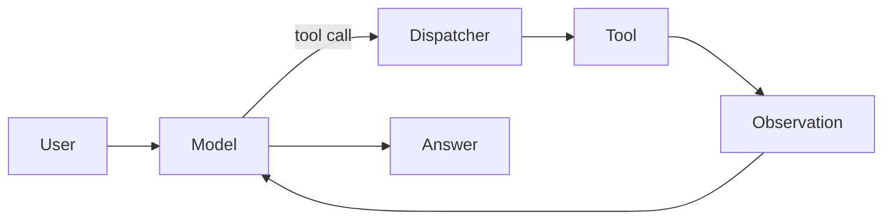
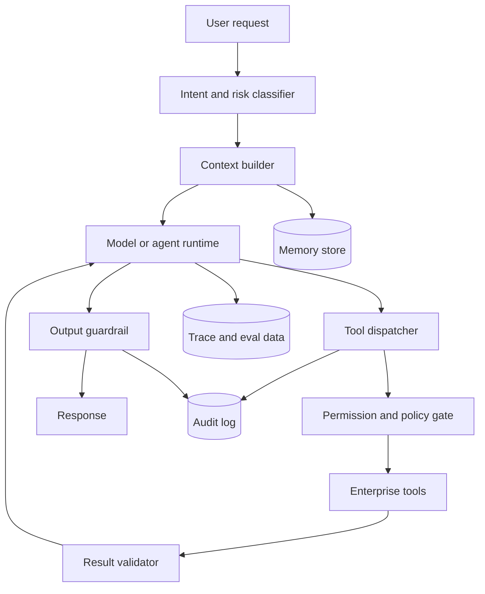
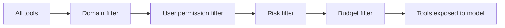
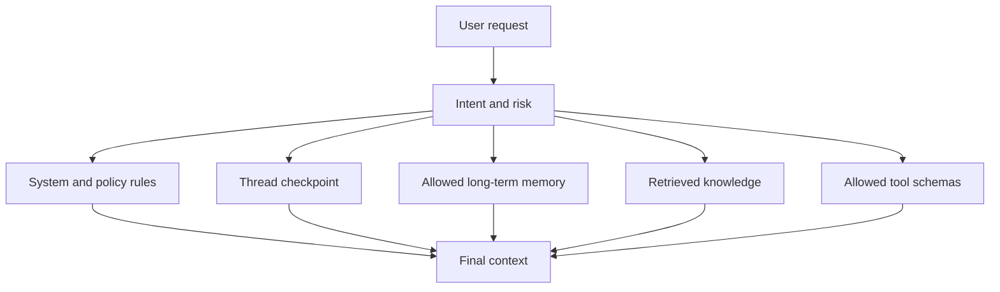
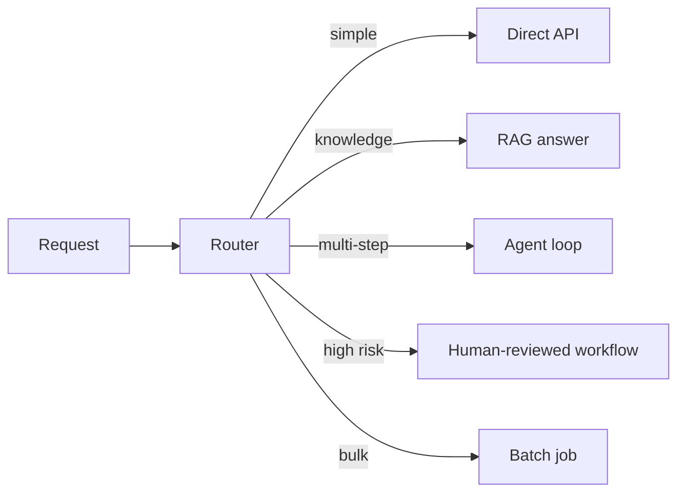
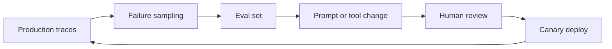

# 엔터프라이즈 AI Agent 설계 — reasoning, tool, memory, cost를 운영 시스템으로 묶기

AI Agent를 엔터프라이즈 환경에 올린다는 건 "LLM이 알아서 일하게 한다"가 아니다.
모델의 reasoning 능력, 도구 호출, 메모리, 비용 예산, 권한, 감사 로그를 하나의 운영 시스템으로 묶는 일이다.
이 글은 Chain of Thought부터 MCP, LangGraph, Agent SDK, memory, cost control, risk gate까지를 백엔드 설계 관점에서 정리한다.

내가 이 글에서 답하고 싶었던 질문은 셋이다.

- Agent가 어느 정도까지 자율적으로 판단하게 둘 것인가
- 긴 작업에서 context와 memory를 어떻게 나눠 비용과 품질을 동시에 잡을 것인가
- 기업 환경에서 도구, 권한, 평가, 감사 로그를 어떤 구조로 묶어야 하는가

가져갈 판단 기준도 셋으로 좁힌다.

- **자율성은 모델이 아니라 게이트가 정한다.**
- **메모리는 저장소가 아니라 정책이다.**
- **비용 최적화는 모델 선택보다 context 설계에서 먼저 갈린다.**

## Agent를 루프가 아니라 운영 시스템으로 본다

가장 작은 Agent 루프는 단순하다.

하지만 엔터프라이즈 Agent는 이 그림만으로는 부족하다.
실제 시스템에는 사용자 권한, 도구별 위험도, 비용 예산, context 압축, 장기 memory, 사람 승인, trace, eval, red team이 붙는다.

이 구조에서 모델은 중요한 구성 요소지만 중심은 아니다.
중심은 **상태와 권한을 가진 dispatcher**, **context를 조립하는 builder**, **실행 경로를 남기는 trace**다.
LLM이 도구를 "직접 실행"한다고 표현하면 설계가 흐려진다.
정확히는 모델이 도구 호출 후보를 만들고, 백엔드가 검증한 뒤 자기 책임으로 실행한다.

도구 호출의 기본 구조는 [LLM Tool Calling과 Agent Workflow 설계](./llm-tool-calling-agent-workflow.md)에 더 자세히 정리해 뒀다.
여기서는 그 위에 엔터프라이즈 운영 레이어를 얹는 쪽에 집중한다.

## Chain of Thought는 로그가 아니라 내부 reasoning 예산이다

Agent 설계를 공부하다 보면 Chain of Thought, ReAct, Tree of Thoughts 같은 용어가 계속 나온다.
이들을 한 줄로 나누면 이렇게 볼 수 있다.

| 기법 | 핵심 아이디어 | 실무에서의 위치 |
| --- | --- | --- |
| Chain of Thought | 중간 추론 단계를 생성해 복잡한 문제를 푼다 | reasoning 모델 내부 또는 비공개 scratchpad |
| ReAct | reasoning과 action을 번갈아 수행한다 | tool-calling Agent 루프의 원형 |
| Tree of Thoughts | 여러 reasoning 경로를 탐색하고 평가한다 | 고비용 계획·검색 문제에 제한적으로 사용 |
| Reflexion | 실패 피드백을 언어 memory로 남겨 다음 시도에 반영한다 | eval 기반 개선 루프의 원형 |
| Toolformer | 모델이 언제 어떤 API를 쓸지 학습한다 | tool-use가 모델 능력의 일부가 될 수 있다는 근거 |

여기서 조심할 점은 Chain of Thought를 그대로 사용자에게 보여주거나 audit log에 남기는 설계다.
최신 reasoning 모델은 내부 reasoning을 수행하고, OpenAI의 reasoning best practices도 reasoning 모델에 "think step by step"이나 reasoning 설명을 요구하는 프롬프트가 불필요하다고 설명한다.
따라서 제품 설계에서는 raw reasoning trace가 아니라 다음 정보만 남기는 편이 안전하다.

- 최종 판단
- 참조한 근거
- 호출한 도구와 인자
- 검증 결과
- 거절 또는 에스컬레이션 사유

내부 reasoning은 모델 품질을 위한 계산 자원이고, 운영 로그는 사람이 책임을 추적할 수 있는 증거여야 한다.
둘을 섞으면 보안, 개인정보, 프롬프트 유출, 비용 문제가 같이 터진다.

ReAct 논문은 reasoning trace와 action을 엮으면 환각과 오류 전파를 줄일 수 있다고 봤고, Tree of Thoughts는 여러 후보 경로를 탐색해 계획형 문제에서 성능을 올리는 방향을 제시했다.
하지만 엔터프라이즈 시스템에서는 "탐색을 많이 한다"가 항상 좋은 답이 아니다.
탐색은 곧 토큰, 지연, 비용, 부작용 가능성이다.

내 기준은 이렇다.

| 상황 | 권장 패턴 |
| --- | --- |
| 단순 조회·FAQ | RAG 또는 단일 tool call |
| 정책 판단 + 근거 필요 | retrieve → answer → citation 검증 |
| 여러 도구를 순차 호출 | ReAct를 제한된 step 안에서 사용 |
| 비가역 행동 포함 | plan → 사람 승인 → execute |
| 고비용 탐색 문제 | Tree of Thoughts류 탐색을 offline 또는 batch로 제한 |

## 도구는 많을수록 좋은 게 아니다

MCP는 Agent가 외부 시스템과 연결되는 방식을 표준화한다.
공식 MCP 문서는 MCP를 AI 애플리케이션이 파일, 데이터베이스, API, workflow 같은 외부 시스템에 연결되는 open-source standard로 설명하고, specification은 resources, prompts, tools를 서버 기능으로 정의한다.
이 방향은 맞다.
기업마다 내부 API와 데이터 소스가 많기 때문에, 도구 연결을 매번 provider별 SDK로 붙이면 운영이 금방 무너진다.

다만 MCP나 tool registry가 있다고 해서 모든 도구를 모델에게 그대로 노출하면 안 된다.
도구 수가 늘어나면 세 가지 문제가 생긴다.

- 모델이 잘못된 도구를 고를 확률이 오른다.
- tool schema와 설명이 context 비용을 계속 먹는다.
- prompt injection이 여러 도구를 조합해 권한 밖 행동을 유도할 수 있다.

그래서 tool layer는 "가능한 도구 목록"이 아니라 **현재 요청에서 허용되는 최소 도구 집합**이어야 한다.

예를 들어 사내 업무 Agent라면 전체 도구는 수십 개일 수 있다.
하지만 "이번 주 보고서 초안 만들어줘"라는 요청에 노출해야 하는 도구는 문서 검색, 일정 조회, 초안 저장 정도면 충분하다.
결재 승인, 권한 변경, 외부 메일 발송 같은 도구는 요청 의도와 권한이 확인되기 전까지 모델에게 보이지 않아야 한다.

MCP specification도 tool invocation에는 trust and safety가 중요하며, 사람이 tool invocation을 거절할 수 있어야 한다고 적고 있다.
이건 UX 권장사항이 아니라 엔터프라이즈 설계의 기본값이다.

## memory는 네 층으로 나눠야 한다

Agent memory를 "대화 기록을 벡터 DB에 넣는다"로 이해하면 거의 항상 망가진다.
memory는 저장 방식이 아니라 **사용 목적과 보존 정책**으로 나눠야 한다.

| 층 | 예시 | 저장 위치 | 만료 정책 |
| --- | --- | --- | --- |
| Working context | 현재 turn의 메시지, tool observation | prompt context | 즉시 휘발 |
| Thread state | 진행 중 workflow 상태, pending approval | checkpoint | workflow 종료 후 만료 |
| Long-term profile | 사용자 선호, 반복 업무 규칙 | structured store | 동의·TTL 기반 |
| Knowledge memory | 문서, 정책, 사내 지식 | RAG index | 원문 lifecycle 기반 |

LangGraph의 persistence 문서는 checkpointer와 store를 구분한다.
checkpointer는 thread의 graph state를 저장해 conversation continuity, HITL, time travel, fault tolerance에 쓰고, store는 user preferences나 shared knowledge 같은 장기 데이터를 저장한다.
이 구분이 실무에서도 중요하다.

Thread state는 "지금 이 작업이 어디까지 왔나"를 나타낸다.
Long-term profile은 "이 사용자가 반복적으로 어떤 선호를 보였나"를 나타낸다.
Knowledge memory는 "조직의 공식 지식이 무엇인가"를 나타낸다.
세 가지를 한 벡터 DB에 섞으면 삭제, 정정, 권한, 감사가 어려워진다.

memory에 저장할 때는 다음 질문을 통과해야 한다.

- 이 정보가 다음 의사결정에 실제로 쓰이는가
- 사용자가 정정하거나 삭제할 수 있는가
- 언제 만료되는가
- prompt injection 문자열이 장기 memory로 승격되지 않는가
- 어떤 권한 스코프에서만 retrieval 되는가

헬스케어처럼 민감한 도메인의 memory 설계는 [헬스케어 AI Agent의 멀티턴 메모리 설계](./multi-turn-memory-healthcare-agent.md)에 따로 정리해 뒀다.
일반 Agent도 원리는 같다.
자유 텍스트 memory보다 구조화된 fact가 안전하고, 장기 memory는 retrieval 전에 권한과 동의 범위를 먼저 통과해야 한다.

## context는 매번 새로 조립하는 빌드 산출물이다

context window가 커졌다고 모든 걸 넣으면 비용과 성능이 같이 나빠진다.
엔터프라이즈 Agent의 context는 매 요청마다 다음 순서로 조립되는 빌드 산출물로 보는 편이 낫다.

OpenAI의 prompt caching 문서는 1024 tokens 이상 prompt에서 caching이 가능하고, messages와 tools도 cache 대상이 될 수 있다고 설명한다.
이 말은 엔터프라이즈 Agent에서 context 순서가 비용에 직접 영향을 준다는 뜻이다.
변하지 않는 system/developer instruction, policy, tool schema는 앞쪽에 안정적으로 두고, 매번 바뀌는 사용자 입력과 retrieval 결과는 뒤쪽에 둬야 cache hit가 잘 난다.

긴 작업에서는 compaction도 필요하다.
OpenAI compaction 문서는 long-running interaction에서 context size를 줄이면서 다음 turn에 필요한 state를 보존하는 방식으로 compaction을 설명한다.
Google ADK 문서도 context를 단순 문자열 누적이 아니라 sessions, memory, tool outputs, artifacts를 구조화해 조립하고, 불필요한 event filtering과 요약, lazy loading을 한다고 설명한다.

내가 설계한다면 context budget을 이렇게 쪼갠다.

| 영역 | 예산 원칙 |
| --- | --- |
| 정책·권한 | 항상 포함, 짧고 안정적 |
| 현재 사용자 요청 | 원문 보존 |
| thread state | 요약보다 구조화 상태 우선 |
| retrieval 결과 | top-k보다 source diversity와 freshness 우선 |
| tool schema | 현재 요청에 필요한 subset만 |
| 과거 대화 | 최근 일부 + compaction summary |

이 설계의 목표는 "많이 기억하는 Agent"가 아니다.
목표는 **필요한 것만 정확히 현재 window에 올리는 Agent**다.

## 비용 효율성은 모델 라우팅보다 workflow 라우팅이 먼저다

비용 최적화를 모델 가격표 비교로 시작하면 늦다.
Agent 비용은 모델 단가보다 다음 네 가지에 더 크게 흔들린다.

- 요청당 step 수
- 각 step의 context 크기
- tool schema와 retrieval 결과의 반복 주입
- 실패 루프와 retry

OpenAI cost optimization 문서는 Batch API로 비동기 작업을 묶어 처리하는 경로를 제공하고, prompt caching과 compaction은 context 비용을 낮추는 도구다.
하지만 실무에서 먼저 해야 할 일은 "이 요청이 Agent일 필요가 있는가"를 가르는 것이다.

| 요청 유형 | 싸고 안정적인 처리 |
| --- | --- |
| 정형 조회 | API 직접 호출 + 템플릿 응답 |
| 단순 요약 | 작은 모델 + 짧은 context |
| 근거 기반 답변 | RAG + citation 검증 |
| 복잡한 multi-step | Agent loop |
| 대량 비동기 처리 | batch workflow |
| 위험 행동 | deterministic workflow + 사람 승인 |

모든 요청을 Agent로 보내면 비싸고 느리다.
반대로 모든 요청을 정형 workflow로 묶으면 사용자가 원하는 유연성이 사라진다.
그래서 앞단에는 항상 router가 필요하다.

Agent loop 안에서도 비용 가드는 명시적으로 둔다.

- 최대 step 수
- 최대 tool call 수
- 최대 wall-clock time
- 최대 input tokens
- 최대 reasoning effort
- 최대 spend per request
- fallback 또는 human escalation 조건

OWASP LLM Top Ten 2025에는 Unbounded Consumption이 포함돼 있다.
이건 보안 이슈이면서 비용 이슈다.
공격자가 일부러 긴 context, 반복 tool call, 과도한 reasoning을 유도하면 지연과 비용이 동시에 터진다.
따라서 budget guard는 FinOps가 아니라 security control에 가깝다.

## 발전하는 Agent는 trace와 eval에서 배운다

Agent가 발전한다는 말은 운영 중에 마음대로 자기 코드를 고친다는 뜻이 아니다.
엔터프라이즈 환경에서 self-improving은 최소한 다음 단계를 거쳐야 한다.

Reflexion은 실패 피드백을 언어 memory에 남겨 다음 시도를 개선하는 방향을 보여줬고, Agent Workflow Memory는 과거 성공 workflow를 memory로 유도해 web navigation 성공률을 높이는 접근을 제안했다.
최근 ACON 같은 연구는 긴 Agent trajectory의 observation과 interaction history를 압축해 peak token 사용량을 줄이면서 성능을 유지하려고 한다.

이 연구들이 주는 실무 힌트는 같다.
Agent를 개선하려면 raw transcript를 그냥 쌓는 게 아니라, **실패 원인과 성공 workflow를 구조화된 학습 자산으로 바꿔야 한다.**

실무 루프는 이렇게 두는 편이 안전하다.

- trace에서 실패 case를 샘플링한다.
- 실패를 outcome failure, process failure, safety failure, cost failure로 라벨링한다.
- 사람이 eval case로 승격할지 결정한다.
- prompt, tool schema, router, policy 중 어디를 고칠지 분리한다.
- canary에서 기존 eval과 신규 eval을 모두 통과해야 배포한다.

평가와 risk gate 자체는 [Agentic Workflow 평가와 Risk Gate 설계](./agentic-workflow-evaluation-risk-gate.md)에 더 자세히 정리했다.
여기서 중요한 건 "발전"이 runtime magic이 아니라 software delivery loop라는 점이다.

## 프레임워크는 철학이 다르다

현재 Agent 프레임워크는 크게 네 갈래로 볼 수 있다.

| 계열 | 대표 | 강점 | 주의점 |
| --- | --- | --- | --- |
| Provider SDK | OpenAI Agents SDK, Google ADK | 모델·도구·trace 통합이 빠름 | provider 기능에 설계가 끌려갈 수 있음 |
| Graph runtime | LangGraph | durable execution, HITL, state 관리 | 추상화가 낮아 설계 책임이 큼 |
| Multi-agent team | CrewAI, AutoGen | role 기반 협업, research/write 같은 작업에 직관적 | 자유도가 높아 gate 없으면 비용과 안전이 흔들림 |
| Harness pattern | Claude Code, Codex, custom harness | 파일·테스트·브라우저 등 실제 작업 환경과 결합 | 프레임워크보다 운영 규율이 중요 |

OpenAI Agents SDK는 agents, handoffs, guardrails, sessions, tracing 같은 primitives를 제공하고, tracing으로 agentic flow를 시각화·디버깅·평가할 수 있다고 설명한다.
LangGraph는 long-running stateful agent를 위한 durable execution, streaming, HITL, persistence에 초점을 둔다.
CrewAI는 Flow와 Crew를 나눠, Flow가 state와 control을 잡고 Crew가 자율 협업을 수행하는 구조를 권한다.
Google ADK는 graph workflow, multi-agent orchestration, evaluation, deployment, context management를 production agent의 구성 요소로 묶는다.

내 선택 기준은 이렇다.

- state와 HITL이 핵심이면 LangGraph류 graph runtime을 먼저 본다.
- provider의 tracing, guardrail, hosted tool을 빠르게 쓰고 싶으면 provider SDK가 유리하다.
- research, report, content pipeline처럼 역할 분업이 자연스러우면 CrewAI류 multi-agent framework가 잘 맞는다.
- coding agent처럼 파일 시스템, 테스트, 브라우저, 리뷰 루프가 핵심이면 harness를 별도 설계한다.

프레임워크보다 먼저 결정할 것은 성공 조건과 실패 경계다.
그게 없으면 어떤 프레임워크를 써도 Agent는 데모에서만 그럴듯하다.

## Claude Code류 coding agent에서 배울 수 있는 것

Claude Code, Codex, Cursor 같은 coding agent는 엔터프라이즈 Agent 설계의 가장 좋은 관찰 대상이다.
이들은 단순 챗봇이 아니라 파일을 읽고, shell을 실행하고, patch를 만들고, test를 돌리고, 사용자의 승인 경계를 통과한다.
즉 Agent가 실제 시스템에 행동하는 문제를 매일 다루고 있다.

2026년 4월에는 Claude Code 소스가 npm packaging 실수로 노출됐다는 보도가 있었고, Guardian과 TechRadar는 Anthropic이 고객 데이터나 credential 노출은 아니며 human error에 따른 packaging issue라고 설명했다고 보도했다.
이런 자료는 법적·보안 리스크가 있으므로 원문 소스나 유출본을 구현 blueprint로 삼으면 안 된다.
대신 공개 논문과 보도에서 확인 가능한 설계 패턴만 학습 대상으로 삼는 게 안전하다.

특히 `Dive into Claude Code` 논문은 공개된 TypeScript source를 분석해 Claude Code의 core가 "model 호출 → tool 실행 → 반복"이라는 단순 while loop라고 요약한다.
흥미로운 건 loop 자체가 아니라 loop 주변이다.
논문은 주변 시스템으로 다음 요소를 짚는다.

- permission system과 safety classifier
- context management를 위한 multi-layer compaction pipeline
- MCP, plugins, skills, hooks 같은 확장 메커니즘
- worktree isolation을 동반한 subagent delegation
- append-oriented session storage

이건 앞에서 본 엔터프라이즈 Agent 원칙과 거의 같다.
Agent의 본체는 loop지만, 제품의 가치는 loop를 감싸는 permission, context, extension, isolation, persistence에서 나온다.

coding agent manifest 연구도 같은 방향을 보인다.
Claude.md 같은 agent manifest를 분석한 연구들은 공개 repository의 설정 파일이 project context, identity, operational rules, architecture constraint, tool usage policy를 담는다고 본다.
다시 말해 좋은 coding agent는 "좋은 프롬프트"보다 **좋은 실행 계약 파일**에 의존한다.

내가 이 자료에서 가져갈 실무 교훈은 셋이다.

| 관찰 | 실무 설계로 번역 |
| --- | --- |
| loop는 단순하다 | 복잡도는 runtime 주변 시스템으로 옮겨야 한다 |
| permission mode가 제품 핵심이다 | autonomy는 model prompt가 아니라 실행 권한 정책으로 제어한다 |
| manifest가 성능을 좌우한다 | `AGENTS.md`, `CLAUDE.md`, skill 문서를 운영 artifact로 관리한다 |

이 관점은 [하네스 엔지니어링](../harness-engineering.md)과도 이어진다.
coding agent가 오래 살아남으려면 프롬프트보다 harness가 중요하고, harness는 파일, 테스트, 권한, 상태, review loop를 제품화한 것이다.

## 엔터프라이즈에서 반드시 필요한 경계

엔터프라이즈 Agent의 핵심 위험은 모델이 틀린 답을 하는 것보다 **틀린 행동을 실제 시스템에 실행하는 것**이다.
OWASP LLM Top Ten 2025는 prompt injection, sensitive information disclosure, supply chain, data and model poisoning, excessive agency, vector and embedding weaknesses, unbounded consumption 같은 위험을 정리한다.
NIST AI RMF는 AI 제품의 설계, 개발, 사용, 평가에 trustworthiness 고려를 통합하는 risk management framework를 제공한다.

이를 Agent 설계로 내리면 다음 경계가 필요하다.

| 경계 | 구현 방식 |
| --- | --- |
| 권한 경계 | 모든 tool call은 사용자 auth context로 검증 |
| 데이터 경계 | retrieval 전에 tenant, role, consent scope 필터 |
| 행동 경계 | write/delete/send/pay 같은 비가역 행동은 HITL 또는 policy gate |
| 네트워크 경계 | browser와 internal API 접근 권한 분리 |
| memory 경계 | 장기 memory 승격 전 sanitization과 user-visible edit path |
| 비용 경계 | step, token, time, spend budget |
| 감사 경계 | prompt version, exposed tools, tool calls, validation result, final response 저장 |

MCP specification도 arbitrary data access와 code execution path가 강력한 capability를 만든다고 경고하고, user consent, data privacy, tool safety, sampling controls를 핵심 원칙으로 둔다.
따라서 tool server를 붙이는 순간부터 보안 설계가 시작된다.

특히 prompt injection은 "모델을 속이는 문제"가 아니라 **도구와 데이터 경계를 우회하려는 문제**다.
외부 문서, 웹 페이지, 이메일, ticket 내용은 모두 untrusted input이다.
이 입력이 system prompt를 덮어쓸 수 없게 role separation을 강제하고, tool dispatcher는 모델의 문장을 신뢰하지 말고 현재 사용자 권한과 policy만 신뢰해야 한다.

## 실무 적용 순서

처음부터 완전한 autonomous Agent를 만들려고 하면 대개 실패한다.
내가 권하는 순서는 다음이다.

- 정형 workflow로도 풀 수 있는지 먼저 본다.
- 필요한 도구를 registry로 만들고, schema와 권한을 코드에 붙인다.
- RAG가 필요하면 문서 lifecycle과 citation 검증부터 만든다.
- Agent loop는 제한된 step 수와 제한된 tool subset으로 시작한다.
- trace를 전부 남기고, 실패 case를 eval로 승격한다.
- memory는 thread checkpoint부터 시작하고, long-term profile은 나중에 붙인다.
- 비가역 행동은 사람이 승인하는 workflow로 시작한다.
- 비용 budget이 안정된 뒤에만 autonomy를 늘린다.

이 순서에서 중요한 건 "Agent를 작게 시작하라"가 아니다.
**Agent가 할 수 있는 행동의 경계를 먼저 제품화하라**는 뜻이다.
경계가 제품화돼 있으면 모델을 바꾸거나 프레임워크를 바꿔도 시스템은 무너지지 않는다.

## 근거 메모

| 주장 | 근거 |
| --- | --- |
| tool은 모델이 제안하고 backend가 실행해야 한다 | MCP specification의 tools/call 구조와 tool safety 원칙, OpenAI Agents SDK의 tools/guardrails/tracing 구성 |
| long-running Agent에는 checkpoint와 store 구분이 필요하다 | LangGraph persistence 문서의 checkpointer/store 구분 |
| context 비용은 prompt caching과 compaction 설계에 좌우된다 | OpenAI prompt caching, compaction 문서와 Google ADK context management 설명 |
| Agent 보안은 prompt injection만이 아니라 excessive agency와 unbounded consumption까지 봐야 한다 | OWASP LLM Top Ten 2025 |
| 기업 환경에서는 risk management framework가 필요하다 | NIST AI RMF와 GenAI profile |
| reasoning 기법은 유용하지만 운영에서는 예산·로그·보안 경계가 필요하다 | ReAct, Tree of Thoughts, Reflexion, Toolformer 논문과 OpenAI reasoning best practices |
| Claude Code류 coding agent도 결국 loop보다 주변 시스템이 중요하다 | Claude Code 공개 분석 논문의 permission, compaction, extension, subagent, session storage 분석 |

## 참고 링크

- [OpenAI Agents SDK](https://openai.github.io/openai-agents-python/) — agents, handoffs, guardrails, sessions, tracing.
- [OpenAI Prompt Caching](https://developers.openai.com/api/docs/guides/prompt-caching) — 1024 tokens 이상 prompt caching, `cached_tokens`, messages/tools caching.
- [OpenAI Compaction](https://developers.openai.com/api/docs/guides/compaction) — long-running conversation context compaction.
- [OpenAI Cost Optimization](https://developers.openai.com/api/docs/guides/cost-optimization) — Batch API 등 비용 최적화 경로.
- [OpenAI Reasoning Best Practices](https://developers.openai.com/api/docs/guides/reasoning-best-practices) — reasoning 모델에 chain-of-thought prompt를 강제하지 않는 권장.
- [Model Context Protocol Introduction](https://modelcontextprotocol.io/docs/getting-started/intro) — MCP의 목적과 적용 범위.
- [MCP Specification 2025-06-18](https://modelcontextprotocol.io/specification/2025-06-18) — resources, prompts, tools, security 원칙.
- [MCP Tools Specification](https://modelcontextprotocol.io/specification/2025-06-18/server/tools) — tools/list, tools/call, human-in-the-loop 권장.
- [LangGraph Overview](https://docs.langchain.com/oss/python/langgraph/overview) — durable execution, HITL, persistence 중심의 orchestration runtime.
- [LangGraph Persistence](https://docs.langchain.com/oss/python/langgraph/persistence) — checkpointer와 store 구분.
- [Google Agent Development Kit](https://adk.dev/) — graph workflows, multi-agent orchestration, context management, production deployment.
- [CrewAI Introduction](https://docs.crewai.com/en/introduction) — Flow와 Crew 분리, production-ready multi-agent workflow.
- [CrewAI Agents](https://docs.crewai.com/en/concepts/agents) — role, goal, tools, memory, delegation, reasoning 설정.
- [Dive into Claude Code](https://arxiv.org/abs/2604.14228) — Claude Code 공개 분석 기반 coding agent architecture 연구.
- [On the Use of Agentic Coding Manifests](https://arxiv.org/abs/2509.14744) — 공개 `Claude.md` manifest 구조 분석.
- [Decoding the Configuration of AI Coding Agents](https://arxiv.org/abs/2511.09268) — Claude Code 프로젝트 configuration artifact 분석.
- [TechRadar: Anthropic confirms Claude Code source leak](https://www.techradar.com/pro/security/anthropic-confirms-it-leaked-512-000-lines-of-claude-code-source-code-spilling-some-of-its-biggest-secrets) — 2026년 4월 소스 노출 보도.
- [The Guardian: Claude's code leak](https://www.theguardian.com/technology/2026/apr/01/anthropic-claudes-code-leaks-ai) — packaging issue와 보안 논점 보도.
- [OWASP Top 10 for LLMs and Gen AI Apps 2025](https://genai.owasp.org/llm-top-10/) — prompt injection, excessive agency, unbounded consumption 등.
- [NIST AI Risk Management Framework](https://www.nist.gov/itl/ai-risk-management-framework) — AI risk management와 GenAI profile.
- [ReAct: Synergizing Reasoning and Acting in Language Models](https://arxiv.org/abs/2210.03629) — reasoning과 action을 interleaving하는 Agent 패턴.
- [Toolformer: Language Models Can Teach Themselves to Use Tools](https://arxiv.org/abs/2302.04761) — tool-use를 모델 학습 대상으로 본 연구.
- [Reflexion: Language Agents with Verbal Reinforcement Learning](https://arxiv.org/abs/2303.11366) — 언어 피드백과 episodic memory로 Agent를 개선하는 접근.
- [Tree of Thoughts](https://arxiv.org/abs/2305.10601) — 여러 reasoning path를 탐색하고 self-evaluate하는 접근.
- [Agent Workflow Memory](https://arxiv.org/abs/2409.07429) — reusable workflow memory를 통해 long-horizon task 성능을 높이는 접근.
- [ACON: Optimizing Context Compression for Long-horizon LLM Agents](https://arxiv.org/abs/2510.00615) — long-horizon Agent의 context compression 최적화.
