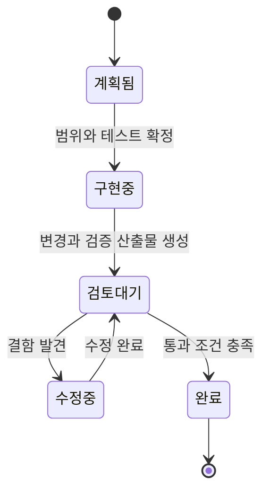
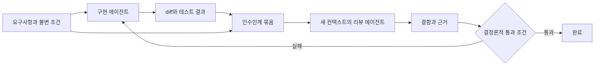
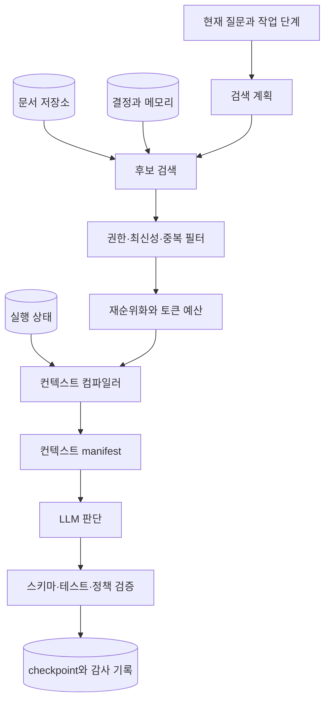

# Lost in the Middle와 컨텍스트 관리: 긴 작업을 결정론적으로 이어가는 방법

컨텍스트 창이 크다는 말은 많은 토큰을 입력할 수 있다는 뜻이다.
그 안의 모든 정보를 같은 정확도로 찾아 연결한다는 보장은 아니다.

[Transformer는 입력을 어떻게 다음 토큰 확률로 바꾸는가](../llm/transformer-from-tokens-to-logits.md)와
[다음 토큰 예측은 왜 환각과 긴 컨텍스트 실패로 이어지는가](../llm/why-llms-hallucinate-and-lose-context.md)를 먼저 읽으면,
이 글에서 사용하는 attention과 자동회귀 생성의 한계를 내부 계산부터 연결해서 볼 수 있다.

긴 입력에서 중요한 근거가 가운데에 있을 때 모델이 놓치는 현상을 **Lost in the Middle**이라고 부른다.
처음에는 이 문제를 모델의 기억력 한계로만 생각하기 쉽다.
하지만 에이전트를 만드는 입장에서는 더 실용적인 결론을 얻을 수 있다.

> 모델의 추론을 결정론적으로 만들 수는 없다.
> 대신 모델이 읽을 입력, 이어갈 상태, 밟을 단계, 통과할 검증은 결정론적으로 설계할 수 있다.

이 글은 세 가지 질문에 답한다.

- 긴 컨텍스트에서 왜 가운데 정보가 약해지는가
- 컨텍스트, 메모리, 실행 상태를 어떻게 나눠야 하는가
- 구현과 리뷰처럼 역할이 다른 작업을 왜 새 컨텍스트로 분리해야 하는가

글의 근거 수준은 둘로 나눈다.
논문과 공식 문서에서 확인한 결과는 출처와 실험 조건을 함께 적는다.
컨텍스트 컴파일러, 인수인계 형식, 점검표는 그 결과와 내 작업 경험에서 도출한 **설계 가설**이며, 각 시스템의 평가로 검증해야 할 권장안이다.

## “토큰 사이의 연결이 희석된다”는 직관은 어디까지 맞을까

나는 긴 대화를 쓰면서 컨텍스트가 커질수록 토큰과 토큰 사이의 맥락 연결성이 희석되는 것처럼 느꼈다.
그래서 구현 에이전트와 리뷰 에이전트를 나누고, 리뷰는 새로운 컨텍스트에서 시작하는 방식을 사용해왔다.

운영상의 직관은 맞다.
다만 내부 동작을 “모든 토큰 사이의 연결 강도가 길이에 반비례해 똑같이 약해진다”라고 설명하면 정확하지 않다.

Transformer의 한 attention head를 단순화하면 다음과 같다.

```text
score_i  = query와 i번째 key의 유사도
weight_i = exp(score_i) / 모든 key의 exp(score) 합
output   = 각 value에 weight를 곱해 더한 값
```

모델은 출력 위치마다 어떤 입력 토큰을 참고할지 다시 계산한다.
입력 토큰이 늘어났다고 중요한 토큰의 가중치가 반드시 `1 / 토큰 수`로 줄어드는 것은 아니다.
중요한 key의 점수가 충분히 크면 긴 입력에서도 강하게 선택할 수 있다.

그런데 실제 모델에는 세 가지 어려움이 함께 생긴다.

- **경쟁 후보가 늘어난다.** 관련 있어 보이는 문장, 오래된 지시, 도구 출력, 비슷한 식별자가 같은 attention을 두고 경쟁한다.
- **위치와 거리가 영향을 준다.** 위치 인코딩, 학습 때 본 길이, 현재 질의와 근거 사이의 거리가 선택 성능을 바꾼다.
- **검색 뒤에 추론이 남는다.** 근거를 한 번 찾는 것과 여러 근거를 찾아 관계를 결합하는 것은 난도가 다르다.

따라서 “연결성이 희석된다”는 표현은 현상을 느끼는 말로는 쓸 수 있다.
메커니즘을 설명할 때는 **긴 입력에서 근거 선택 경쟁과 위치 편향, 잡음 간섭이 커진다**고 표현하는 편이 정확하다.

## Lost in the Middle 원 실험은 무엇을 측정했나

Liu 연구진의 [Lost in the Middle](https://arxiv.org/abs/2307.03172)은 관련 정보의 위치만 바꾸는 통제 실험을 했다.
원하는 답과 문서 내용은 그대로 두고, 정답 문서가 입력의 앞·가운데·뒤 중 어디에 놓이는지만 바꿨다.

### 여러 문서에서 답 찾기

첫 번째 과제는 NaturalQuestions-Open의 질문 2,655개를 사용한 여러 문서 질의응답이었다.
각 입력에는 다음 문서가 들어갔다.

- 정답을 포함하는 Wikipedia 문단 1개
- 질문과 관련 있어 보이지만 정답은 없는 방해 문서
- 문서마다 최대 100토큰인 작은 문단

연구진은 전체 문서 수를 10개, 20개, 30개로 바꾸고 정답 문서의 위치를 이동했다.
모델이 입력 전체를 고르게 사용한다면 문서 순서가 바뀌어도 정확도는 거의 같아야 한다.

실제 결과는 U자에 가까웠다.
정답 문서가 입력 앞이나 뒤에 있을 때는 상대적으로 잘 답했지만, 가운데로 이동하면 정확도가 낮아졌다.

GPT-3.5-Turbo는 조건에 따라 앞이나 뒤에 정답이 있을 때보다 가운데에 있을 때 정확도가 20%포인트 넘게 낮아졌다.
20개와 30개 문서 조건의 최악 위치에서는 문서를 하나도 주지 않은 closed-book 정확도 56.1%보다 낮아지기도 했다.

긴 컨텍스트 버전도 자동으로 나아지지 않았다.
같은 입력이 두 모델의 컨텍스트 창에 모두 들어가는 조건에서는 GPT-3.5-Turbo와 16K 버전의 위치별 성능 곡선이 거의 겹쳤다.
Claude 1.3과 100K 버전도 비슷한 경향을 보였다.

이 수치는 2023년에 실험한 당시 모델의 결과다.
현재 모델의 절대 성능을 설명하는 숫자로 가져오면 안 된다.
다만 **최대 입력 길이와 실제 활용 가능한 길이는 다른 계약**이라는 문제를 처음 명확하게 보여줬다.

### key-value 검색

두 번째 과제는 UUID key와 value가 들어간 JSON에서 지정한 key의 value를 찾는 합성 실험이었다.
자연어 지식이나 복잡한 추론을 최대한 제거하고, 입력에서 정확히 일치하는 값을 찾는 능력만 봤다.

일부 모델은 모든 위치에서 잘 찾았다.
다른 모델은 key-value가 140개 또는 300개로 늘자 가운데의 값을 크게 놓쳤다.
즉, 모든 모델이 언제나 같은 U자 곡선을 보인 것은 아니지만, 단순 exact match조차 모델과 길이에 따라 위치의 영향을 받았다.

연구진은 질문을 문서 앞과 뒤에 모두 놓는 **질의 인식 조립**(query-aware contextualization)도 시험했다.
key-value 검색은 거의 완벽해졌지만, 여러 문서 질의응답의 전체 경향은 거의 개선되지 않았다.
질문을 반복하는 간단한 프롬프트 기법이 검색 과제에는 통할 수 있어도 복합적인 이해 과제를 해결한다고 일반화할 수 없다.

### 문서를 더 넣으면 언제까지 좋아질까

원 논문의 open-domain QA 사례에서는 검색 문서를 20개에서 50개로 늘려도 답변 성능은 GPT-3.5-Turbo에서 약 1.5%, Claude 1.3에서 약 1%만 개선됐다.
검색기의 recall은 더 올라갈 여지가 있었지만, 모델의 답변 성능은 먼저 포화됐다.

이 결과는 RAG에서 `top_k`를 키우는 일이 항상 품질 개선이 아님을 보여준다.
후보 검색의 recall과 최종 컨텍스트의 유효성은 따로 측정해야 한다.

이 평가 경계는 [RAG를 평가에서 역설계하기](../RAG/evaluation-driven-context-provider.md)에서 더 자세히 다룬다.

## 후속 연구는 현상을 더 어렵게 만들었다

원 실험 이후 연구는 “가운데에서 바늘 하나 찾기”만으로 긴 컨텍스트 성능을 평가하기 어렵다는 점을 지적했다.

| 연구 | 실험이 추가한 난도 | 확인한 내용 |
| --- | --- | --- |
| [LongBench](https://arxiv.org/abs/2308.14508) | 단일·다중 문서 QA, 요약, few-shot 학습, 코드 등 21개 데이터셋 | 작업에 따라 장문맥 성능 차이가 크며 최대 길이만으로 실효 길이를 판단하기 어렵다 |
| [RULER](https://arxiv.org/abs/2404.06654) | 여러 needle, 변수 추적, 다중 hop, 집계 등 13개 과제 | 17개 모델 중 절반만 32K에서 만족스러운 성능을 유지했다 |
| [NoLiMa](https://arxiv.org/abs/2502.05167) | 질문과 근거의 문자 겹침을 줄여 잠재 관계를 찾아야 함 | 32K에서 13개 모델 중 11개가 각자의 짧은 입력 기준 성능의 절반 아래로 내려갔다 |

NoLiMa에서 GPT-4o는 짧은 입력에서 99.3%였지만 32K에서는 69.7%로 내려갔다.
단순 문자열 검색 단서가 사라지자 긴 입력의 영향이 더 분명해졌다.

Chroma의 [Context Rot 기술 보고서](https://www.trychroma.com/research/context-rot)는 18개 모델을 대상으로 과제 난도를 고정하고 입력 길이만 바꾸는 실험을 했다.
동료 심사를 거친 논문과 같은 무게로 볼 수는 없지만, 최신 상용 모델에서도 입력 길이가 늘 때 성능이 균일하게 유지되지 않는 사례를 보여준다.

### U자 곡선이 언제나 나타나는 것은 아니다

여기서 중요한 반례가 있다.
[Positional Biases Shift as Inputs Approach Context Window Limits](https://arxiv.org/abs/2508.07479)는 입력이 모델 최대 창의 어느 비율을 차지하는지도 함께 봤다.

연구에서는 Lost in the Middle 형태가 컨텍스트 창의 절반 정도까지 가장 강했다.
입력이 한계에 더 가까워지면 앞부분 선호가 약해지고 뒤쪽 선호가 남아, U자보다 **출력 위치와 가까운 근거를 선호하는 거리 편향**에 가까워졌다.

따라서 다음처럼 말해야 한다.

- 긴 입력은 위치에 따라 성능이 달라질 수 있다.
- 가운데가 항상 최악이라는 법칙은 아니다.
- 모델, 상대 입력 길이, 과제, 근거 수, 근거 사이 거리를 함께 평가해야 한다.

## 컨텍스트 창은 메모리나 상태 저장소가 아니다

긴 작업을 설계할 때는 컨텍스트, 메모리, 실행 상태를 먼저 분리해야 한다.

| 구분 | Java 백엔드에 비유하면 | 담아야 하는 것 | 담지 말아야 하는 것 |
| --- | --- | --- | --- |
| 컨텍스트 | 한 요청의 working set과 DTO | 지금 판단에 필요한 지시, 근거, 최근 결과 | 전체 데이터베이스, 모든 과거 로그 |
| 장기 메모리 | 조회 가능한 영속 저장소 | 사용자 선호, 반복되는 지식, 과거 결정 | 현재 실행 위치의 단일 진실 |
| 실행 상태 | Spring Batch의 `JobRepository`와 `ExecutionContext` | 완료 단계, 다음 단계, 재시도 횟수, 승인 상태 | 모델이 알아서 기억해야 할 자연어 암시 |
| 감사 기록 | append-only 이벤트와 git log | 누가 무엇을 언제 바꿨는지 | 다음 요청마다 전부 읽힐 원문 |

컨텍스트는 저장소가 아니라 **컴파일된 입력**이다.
원본 상태와 지식을 저장소에 두고, 현재 작업에 필요한 projection만 모델에 전달해야 한다.

이 차이를 놓치면 대화 이력을 보존하는 일을 상태 관리라고 착각한다.
대화가 길어질수록 지금 작업과 무관한 시행착오, 실패한 가설, 오래된 요구사항까지 계속 남는다.
모델은 최신 상태와 폐기된 상태를 다시 구분해야 한다.

### 연구 결과에서 설계 원칙으로 건너갈 때

Lost in the Middle 연구가 직접 입증한 것은 **입력 위치와 길이가 모델의 정보 활용 성능에 영향을 줄 수 있다**는 사실이다.
이 연구만으로 “구현자와 리뷰어를 반드시 분리해야 한다”거나 “특정 manifest를 써야 한다”는 결론이 나오지는 않는다.

운영 설계는 한 단계를 더 거친다.
모델이 긴 입력을 균일하게 활용한다고 가정하기 어렵다면, 애플리케이션이 필수 근거의 선택과 최신성, 실행 상태를 명시적으로 책임져야 한다.
또 구현 대화 전체가 리뷰에 꼭 필요한 입력이 아니라면, 리뷰용 working set을 따로 조립하는 편이 입력 경쟁과 오래된 가정의 유입을 줄인다.

따라서 구현·리뷰 분리는 Lost in the Middle의 직접 해법이 아니라 **긴 컨텍스트에 모든 상태를 맡기지 않는 위험 통제 전략**이다.
효과의 크기는 아래에서 제안하는 자체 평가로 확인해야 한다.

## 결정론을 모델 바깥의 경계로 옮긴다

결정론적 설계는 모델 출력의 문장을 매번 똑같게 만들자는 뜻이 아니다.
확률적인 판단을 감싸는 시스템 경계를 재현 가능하게 만들자는 뜻이다.

### 입력 선택

다음 항목을 코드와 설정으로 고정한다.

- 어떤 소스를 검색하는가
- 권한과 최신성 필터를 어떤 순서로 적용하는가
- 후보 수와 토큰 예산은 얼마인가
- 중복 문서를 어떤 key로 합치는가
- 원문과 요약 중 무엇을 보존하는가

벡터 검색과 LLM 재순위화는 완전히 결정적이지 않을 수 있다.
그 경우에도 검색기 버전, embedding 모델, index snapshot, `top_k`, 후보 ID, 점수를 기록하면 같은 실패를 재현할 수 있다.

### 입력 배치

모델이 읽는 슬롯을 계약으로 만든다.

```text
정책과 권한
현재 목표와 완료 조건
구조화된 실행 상태
가장 중요한 근거
보조 근거
최근 도구 결과
출력 스키마와 검증 기준
```

중요 근거를 무조건 맨 앞과 맨 뒤에 복제하는 규칙은 간단하지만 만능은 아니다.
중복 토큰이 늘고 서로 다른 버전의 사실이 섞이면 오히려 충돌한다.
재순위화로 중요한 근거를 앞으로 보내고, 마지막에는 원문 복제 대신 짧은 완료 조건과 검증 질문을 두는 편이 관리하기 쉽다.

### 상태 전이

모델에게 “이제 적절한 다음 일을 알아서 하라”고만 맡기지 않는다.
작업 단계를 상태 기계나 그래프로 표현한다.



각 전이는 다음을 남긴다.

- 입력 상태의 version
- 실행한 단계
- 생성한 산출물
- 검증 결과
- 다음에 허용되는 상태

[Agentic Workflow 상태 관리](./agentic-workflow-state-management-langgraph.md)에서 설명한 checkpoint와 durable execution이 이 역할을 맡는다.
프로세스가 죽거나 사람 승인을 기다려도 모델의 대화 기억에 의존하지 않고 같은 실행을 이어갈 수 있다.

### 통과 검증

모델에게 “잘했는지 스스로 확인하라”고만 요청하면 생성자와 평가자가 같은 맥락과 같은 가정에 묶인다.
검증 가능한 것은 코드로 옮긴다.

- JSON Schema와 타입 검사
- 단위 테스트와 회귀 테스트
- lint와 정적 분석
- 허용된 파일 범위 검사
- 링크와 문서 구조 검사
- 금액, 권한, 상태 전이 같은 도메인 불변 조건

판단이 필요한 리뷰는 별도 모델에게 맡길 수 있다.
그 결과도 채점 기준, 발견한 근거, 판정값을 구조화해 남겨야 한다.

## 구현자와 리뷰어를 새 컨텍스트로 나누는 이유

나는 구현과 리뷰를 다른 에이전트로 분리해 새 컨텍스트에서 진행해왔다.
긴 구현 대화의 실패한 가설과 도구 출력이 리뷰 판단에 계속 따라오지 않게 하려는 선택이었다.
체감상 리뷰의 관점은 더 독립적이었지만, 같은 변경을 두 방식으로 반복 평가한 수치는 아직 없다.
따라서 여기서는 검증된 효과라고 단정하지 않고, 뒤의 실험으로 확인할 작업 가설로 다룬다.

이 방식은 Lost in the Middle만 피하는 기술은 아니다.
다음 세 문제를 동시에 줄인다.

- **컨텍스트 오염**: 구현 과정의 긴 도구 출력과 실패한 시도가 리뷰 attention을 차지한다.
- **가정 고착**: 구현자가 선택한 구조와 설명을 리뷰어가 그대로 받아들이기 쉽다.
- **자기 평가 편향**: 같은 모델이 방금 만든 결과를 같은 논리로 승인할 가능성이 커진다.

새 컨텍스트를 쓴다고 아무 정보도 주지 않으면 리뷰 품질이 떨어진다.
반대로 구현 세션 전체를 넘기면 새 컨텍스트의 장점이 사라진다.

리뷰어에게는 **고정된 인수인계 묶음**만 전달한다.

```json
{
  "goal": "사용자가 관찰할 수 있는 목표",
  "acceptanceCriteria": ["통과 조건"],
  "invariants": ["깨지면 안 되는 계약"],
  "changedArtifacts": ["commit 또는 diff"],
  "verification": ["실행한 검사와 실제 결과"],
  "knownRisks": ["남은 위험"],
  "reviewScope": ["리뷰할 파일과 관점"]
}
```

구현자의 장황한 reasoning과 자기 변호는 넣지 않는다.
요구사항, 변경 결과, 검증 증거처럼 리뷰어가 독립적으로 확인할 수 있는 자료만 준다.



이 구조에서는 긴 구현 대화가 사라져도 작업의 핵심 상태는 사라지지 않는다.
모델의 숨은 기억이 아니라 artifact가 세션을 연결한다.

이 원리는 [하네스 엔지니어링](../harness-engineering.md)의 생성자와 평가자 분리, 상태 외부화와 연결된다.

## 컨텍스트 컴파일러를 시스템 경계로 둔다

Java 서비스가 데이터베이스 row 전체를 controller에 넘기지 않듯이, LLM에도 검색 결과 전체를 그대로 넘기지 않는다.
질문에 맞는 입력 DTO를 만드는 **컨텍스트 컴파일러**를 둔다.
이는 특정 프레임워크가 제공하는 표준 구성요소가 아니라, 입력 조립 책임을 설명하기 위해 이 글에서 사용하는 설계 이름이다.



아래 manifest는 그대로 도입해야 하는 표준이 아니라 추적성을 확보하기 위한 시작점이다.
실제 시스템에서는 재현하려는 실패 유형에 필요한 필드만 선택한다.
manifest에는 최종 프롬프트 원문만 저장하지 않는다.
어떻게 조립했는지 추적할 메타데이터를 함께 남긴다.

| 필드 | 예시 |
| --- | --- |
| `taskId` | 현재 작업 식별자 |
| `stateVersion` | 읽은 checkpoint version |
| `sourceSnapshot` | 문서 index와 코드 commit |
| `selectedEvidence` | 최종 포함한 근거 ID와 원문 위치 |
| `excludedEvidence` | 제외 사유와 토큰 예산 초과 여부 |
| `assemblerVersion` | 정렬·압축 규칙 version |
| `contextHash` | 최종 입력의 hash |
| `validationProfile` | 실행할 검사 묶음 |

같은 입력에서 모델 답이 달라져도 어느 근거를 보고 어떤 상태에서 판단했는지는 비교할 수 있다.
결정론적 시스템이 주는 핵심 가치는 답을 고정하는 것이 아니라 **실패 원인을 좁히는 것**이다.

## 대화가 길어질 때 무엇을 버리고 무엇을 남길까

### 잘라내기

오래된 대화와 도구 출력을 버린다.
단순하고 비용이 낮지만, 나중에 중요해질 사실을 잃을 수 있다.

다음 항목은 비교적 안전하게 제거할 수 있다.

- 이미 성공한 명령의 전체 출력
- 중복된 파일 내용
- 폐기됐다고 명시된 가설
- 구조화된 상태로 옮긴 과거 대화

### 압축하기

Anthropic은 장기 작업의 수단으로 compaction, 구조화된 메모, 하위 에이전트를 제시한다.
OpenAI Responses API도 긴 실행을 위해 이전 대화를 compact하는 기능을 제공한다.

압축은 손실 없는 저장이 아니다.
요약 시점에는 중요하지 않아 보였던 조건이 나중에 필요할 수 있다.
따라서 다음 정보는 자연어 요약에만 맡기지 않는다.

- 사용자 승인과 거절
- 아키텍처 결정과 폐기 이유
- 실패한 테스트와 아직 해결하지 못한 결함
- 외부 부수효과의 idempotency key
- 다음 단계의 통과 조건

이 정보는 typed state나 append-only 기록으로 보존하고, 압축본은 현재 작업을 이해하는 읽기용 projection으로 사용한다.

### 새 컨텍스트로 교대하기

작업이 분명한 경계를 넘으면 컨텍스트를 압축해 계속 끌고 가지 않고 새 세션으로 넘긴다.

- 계획에서 구현으로 넘어갈 때
- 구현에서 리뷰로 넘어갈 때
- 조사에서 최종 작성으로 넘어갈 때
- 결함 수정 뒤 독립 재검증을 시작할 때

Anthropic의 [Effective harnesses for long-running agents](https://www.anthropic.com/engineering/effective-harnesses-for-long-running-agents)는 initializer와 coding agent가 `progress` 파일과 git 기록을 통해 여러 컨텍스트 창을 이어가는 구조를 설명한다.
핵심은 다음 세션이 이전 세션의 기억을 물려받는 것이 아니라, 이전 세션이 남긴 durable artifact에서 다시 시작하는 것이다.

## 결정론이 해결하지 못하는 것

결정론적 컨텍스트 조립은 타당하지만 만능은 아니다.

### 검색이 틀리면 재현 가능하게 틀린다

필수 근거가 후보에 들어오지 않으면 정교한 배치도 소용없다.
후보 recall, 재순위화 정확도, 조립 후 context recall을 분리해서 측정해야 한다.

### 요약이 사실을 바꿀 수 있다

LLM 요약은 확률적이며 생략과 왜곡이 생길 수 있다.
돈, 권한, 상태 전이, 사용자 승인 같은 값은 요약문이 아니라 구조화 상태에서 읽어야 한다.

### 고정 규칙이 탐색을 막을 수 있다

연구와 장애 분석은 처음부터 필요한 근거를 알기 어렵다.
모든 검색 경로와 문서 수를 고정하면 새로운 단서를 놓친다.

이때는 경계를 나눈다.

- 탐색 단계에서는 모델이 후보를 넓힐 수 있게 한다.
- 최종 판단 단계에서는 선택한 근거와 버전을 고정한다.
- 외부 부수효과 단계에서는 상태 전이와 권한 검사를 강제한다.

### fresh reviewer도 같은 모델 편향을 가질 수 있다

새 컨텍스트는 구현자의 대화에 대한 고착을 줄인다.
같은 모델 계열의 공통 약점까지 없애지는 못한다.
중요한 변경은 정적 검사, 실행 테스트, 다른 평가 기준, 필요하면 사람 검토를 함께 둔다.

## 우리 시스템에서도 위치 편향을 측정해야 한다

논문 점수를 그대로 제품 의사결정에 쓰면 안 된다.
사용하는 모델, 문서, 질문, 도구 출력으로 작은 평가를 만들어야 한다.

### 위치 견고성 실험

한 질문에 필요한 근거와 방해 문서를 고정한다.
근거 위치와 전체 길이만 바꾼다.

| 축 | 값 예시 |
| --- | --- |
| 문서 수 | 5, 10, 20, 40 |
| 근거 위치 | 처음, 25%, 가운데, 75%, 끝 |
| 근거 수 | 1개, 2개, 3개 |
| 근거 거리 | 붙어 있음, 절반만큼 떨어짐, 양 끝에 분산 |
| 질문 단서 | exact match, 바꿔 말함, 다중 hop |

각 조건을 한 번만 실행하면 sampling 변동을 위치 효과로 착각할 수 있다.
동일 조건을 여러 번 실행하고 평균과 분산을 함께 본다.

다음 지표를 분리한다.

```text
position_gap = 위치별 최고 정확도 - 위치별 최저 정확도
length_drop  = 짧은 입력 정확도 - 긴 입력 정확도
assembly_recall = 최종 컨텍스트에 포함된 필수 근거 / 전체 필수 근거
```

`position_gap`이 크면 배치나 모델의 위치 민감성을 의심한다.
`assembly_recall`이 낮으면 모델을 호출하기 전에 이미 실패한 것이다.

### 구현과 리뷰 분리 실험

같은 변경을 두 방식으로 검토한다.

- 구현 세션이 이어서 자기 결과를 검토한다.
- 새 리뷰 세션이 고정된 인수인계 묶음만 보고 검토한다.

비교할 값은 문장 품질이 아니다.

- 회귀 결함 발견률
- 허용 범위 밖 변경 발견률
- 존재하지 않는 검증 주장을 잡은 비율
- 같은 diff에 대한 판정 일관성
- 리뷰에 사용한 입력 토큰과 전체 처리 시간

새 리뷰어가 더 많은 결함을 찾더라도 요구사항 누락으로 거짓 경고가 늘 수 있다.
결함 발견률과 오탐률을 함께 봐야 한다.

## 운영 전에 확인할 것

### 입력을 조립할 때

- 현재 작업의 목표와 완료 조건이 한 화면 안에 있는가
- 모델이 판단할 필요가 없는 필터·정렬·집계를 코드로 옮겼는가
- 필수 근거가 최종 컨텍스트에 실제로 남았는가
- 오래된 결정과 최신 결정을 구분할 version이 있는가
- 권한 밖 정보가 조립 단계에서 제거되는가

### 세션을 이어갈 때

- 현재 상태가 대화가 아니라 checkpoint에 저장되는가
- 압축 전에 승인, 결정, 결함, 다음 단계가 구조화돼 있는가
- 도구 출력 원문을 계속 누적하지 않는가
- 단계가 바뀌면 새 컨텍스트로 교대할 기준이 있는가
- 재실행되는 외부 호출에 idempotency 보호가 있는가

### 독립 검증으로 넘길 때

- 리뷰어가 구현 대화가 아닌 고정된 산출물을 보는가
- 생성자와 리뷰어가 같은 평가 기준을 공유하되 같은 결론을 공유하지 않는가
- 모델 판정 밖에서 실행되는 테스트가 있는가
- 위치와 길이를 바꾼 회귀 평가가 있는가
- 최종 상태와 실제 원격·배포 상태를 별도로 확인하는가

## 내가 가져갈 결론

컨텍스트 창의 크기는 HTTP 요청의 최대 본문 크기와 비슷하다.
서버가 큰 요청을 받을 수 있다고 해서 그 안의 모든 레코드를 올바른 순서로 처리한다는 보장은 없다.
쿼리, projection, transaction state, validation을 설계해야 하듯이 LLM 앞단에도 같은 경계가 필요하다.

구현과 리뷰를 새 컨텍스트로 분리한 선택은 이 관점에서 타당한 위험 통제 전략이다.
다만 이것이 리뷰 품질을 얼마나 높였는지는 아직 별도 실험이 필요한 주장이다.
더 보강할 부분은 “새 세션을 연다”에서 멈추지 않고, 두 세션 사이를 고정된 상태와 검증 산출물로 연결하는 것이다.

Lost in the Middle를 완전히 없애는 단일 프롬프트는 없다.
대신 모델이 놓쳐도 시스템이 상태를 잃지 않고, 잘못 판단해도 검증에서 멈추며, 실패했을 때 같은 입력을 다시 만들 수 있는 구조는 설계할 수 있다.

## 참고 자료

- Liu et al., [Lost in the Middle: How Language Models Use Long Contexts](https://arxiv.org/abs/2307.03172)
- Bai et al., [LongBench: A Bilingual, Multitask Benchmark for Long Context Understanding](https://arxiv.org/abs/2308.14508)
- Hsieh et al., [RULER: What’s the Real Context Size of Your Long-Context Language Models?](https://arxiv.org/abs/2404.06654)
- Modarressi et al., [NoLiMa: Long-Context Evaluation Beyond Literal Matching](https://arxiv.org/abs/2502.05167)
- Veseli et al., [Positional Biases Shift as Inputs Approach Context Window Limits](https://arxiv.org/abs/2508.07479)
- Chroma, [Context Rot: How Increasing Input Tokens Impacts LLM Performance](https://www.trychroma.com/research/context-rot)
- Anthropic, [Effective context engineering for AI agents](https://www.anthropic.com/engineering/effective-context-engineering-for-ai-agents)
- Anthropic, [Effective harnesses for long-running agents](https://www.anthropic.com/engineering/effective-harnesses-for-long-running-agents)
- OpenAI, [From model to agent: Equipping the Responses API with a computer environment](https://openai.com/index/equip-responses-api-computer-environment/)
- LangGraph, [Checkpointing](https://langchain-ai.github.io/langgraph/reference/checkpoints/)
- LangGraph, [Graph API overview: determinism and idempotency](https://langchain-ai.github.io/langgraph/how-tos/configuration/)
