# OpenCode

- 오픈소스 AI 코딩 에이전트
  - Claude Code와 유사하며, 오픈소스로 관리되는 프로젝트
- github : https://github.com/anomalyco/opencode

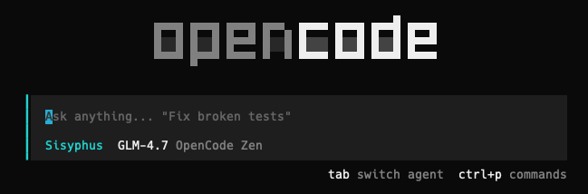

 

## 왜 이걸 선택해야하는가?

- **새로운 AI 코딩 도구들이 나올 때마다, 새로 설치하고 공부하기 귀찮았다.**

  - 처음엔 Cursor로 시작해서, Gemini CLI를 사용해보고 또, Claude Code 제품을 공부하면서, 어느 정도 필요한 기능들은 모두 비슷하게 통합되었고, 최종적으로는 Claude Code로 가는 모양새이다.
  - 그렇다면 Claude Code를 사용하는 것이 좋을 듯한데, 이러면 또 Claude를 구독해야하는 점이 걸림돌이다.
  - 여기에서 또 더 나은 제품이 나온다면? 또 갈아타야 하는 것일까? 이제 슬슬 피로감이 몰려오는 것 같다.
  - Claude Code와 비슷하며, 오픈소스로 관리되고, 또한 다양한 모델을 지원하는 제품을 사용하는 것이 좋지않을까? 라는 생각이 든다.

- **다양한 모델, 무료 모델부터, 현존하는 모델, 내부 구축된 모델까지 모든 모델을 지원한다.**

  - 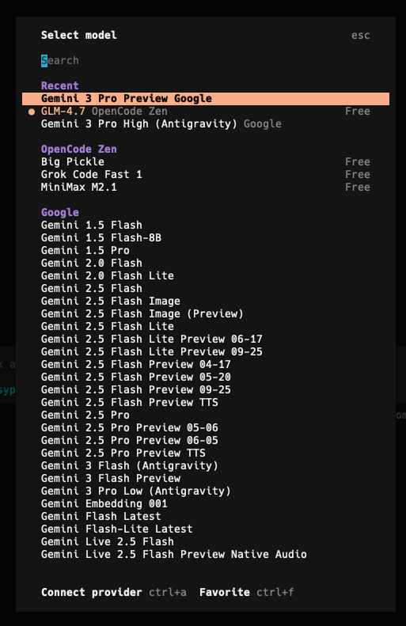
  - 다양한 모델들에 연동될 뿐만아니라, 자체적으로 opencode의 모델을 무료로 사용할 수 있다.
  - 모델 뿐만아니라, Claude, OpenAI, Google, Github Copilot 등에 connect하는 기능도 지원한다
    - 계정을 그대로 연동해서 즉시 사용할 수 있다.
    - **하지만 Claude는 이렇게 사용하는 것을 주의해야한다.**
      - Claude 내부적으로 악의적인 접근을 탐지하고 있는데, 위와 같이 사용하는 것은 Claude 규칙 위반이라서, 계정이 block 될 수 있다고 한다.

- **LSP (Language Server Protol)을 사용해 토큰 사용량을 줄인다.**

  - 기존 Agents들은 대부분, LSP를 사용하여 파일을 탐색하거나 수정하는 대신 string으로 찾고 수정하는 방식을 사용했다.
  - 이 덕분에 매우 많은 토큰량을 소모하곤 했는데, 이 부분을 LSP를 사용해 string 대신, symbol 단위로 검색 및 수정을 가능하게 해 토큰 사용량을 줄일 수 있다.
  - 사실 이건 더 써보면서 느껴봐야할 것 같다. 이 부분은 추후에 더 비교해보도록 해야겠다.

- **기존 Claude 경험을 그대로 느낄 수 있는 plugin이 존재한다**

  - Claude Code를 잘 사용하고 있던 분들이라면, commands, skills 등 다양한 Claude Code만의 기능을 잘 활용하고 계실 것 같다.
  - 이 부분은 plugin을 통해 해결이 가능하다. `oh-my-opencode`라는 플러그인이 있으며, 해당 플러그인 사용 시, agent 오케스트레이션 및, Claude 커맨드 스킬을 사용할 수 있다.
    - 이 부분은 뒤에서 더 파악해보기로 한다.

## 설치 및 실행

- script 실행 설치 부터, npm, brew 등 다양한 방법으로 설치가 가능하다.
- 자세한 내용은 공식 문서의 설치법을 살펴보자.
  - https://github.com/anomalyco/opencode?tab=readme-ov-file#installation
  - cli 뿐만 아니라 desktop app으로도 제공하는 것 같다.

 

### 기본 Agents 모드

- 다른 여타 최신 Agents들과 비슷하게 두 가지 모드를 제공한다
  - build : 코드를 수정하고 다른 모든 작업을 수행하는 agents이다.
  - plan : 사용자가 전달한 프롬프트를 바탕으로 어떻게 작업할지 계획을 세우는 agents이다.
    - read-only로 동작하여, 파일을 수정하지 않는다.
    - bash 커맨드를 실행하기전에 항상 사용자에게 허용 요청을 받는다.

### 시작해보기

### 모델 변경 방법 : Google과 연동 및 Gemini 사용하기

- opencode를 설치하고 터미널에 `opencode`를 입력해서 실행해보자.
  
- 모델을 변경하려면 `/models` 명령어를 입력한다.
- 슬래시(`/`) 를 입력하면, 명령어도 자동완성이 되며, 개인적으로는 속도가 빠르게 느껴졌다.
  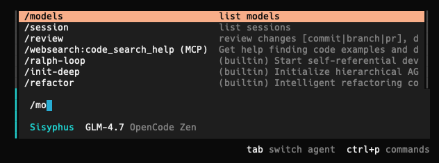
- 먼저 Google과 연결해야한다.
  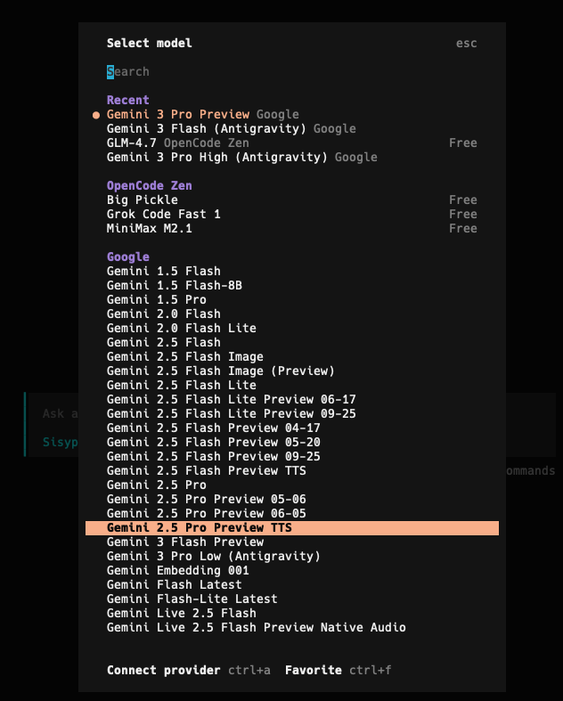
  - 아래 `Connect Provider ctrl + a` 메시지가 보일 것이다.
  - `ctrl + a` 키를 입력해 Google과 연동해주도록 하자.
- 다양한 프로바이더를 지원하는 것을 볼 수 있다.
  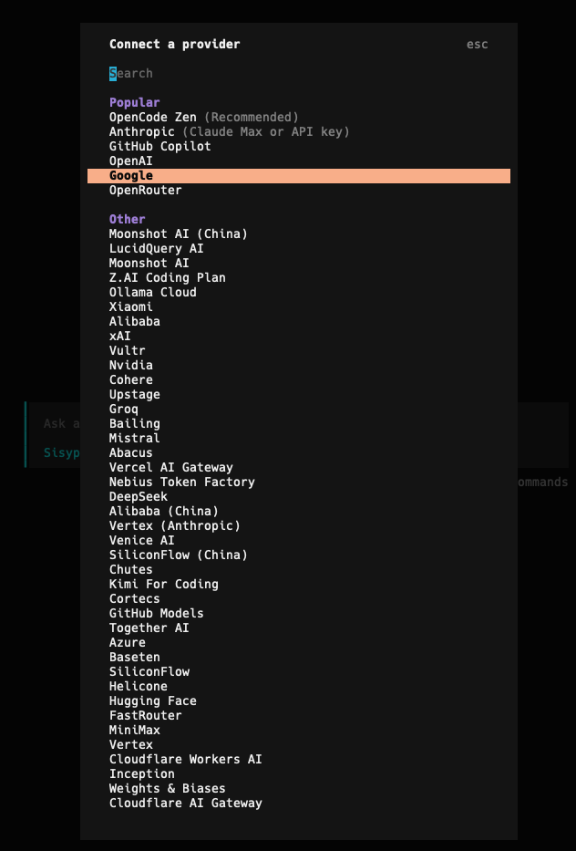
  - 우리는 Google과 연동해야하므로 Google로 커서를 이동해, 연동해보자.
    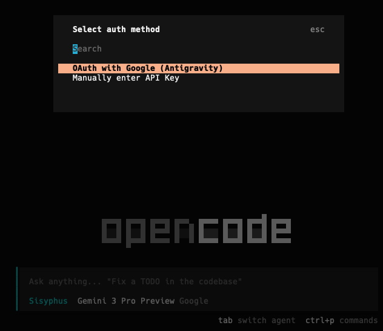
- 보이는대로, OAuth로 연동과, API Key 입력 두 가지 방식을 지원한다.
  - 나는 API Key 입력 방식을 선호하고 있어서, API Key를 발급해 넣어주었다.
- 그리고 다시 `/models` 명령어를 입력해 원하는 모델을 선택해주도록 한다.
  - 검색도 가능하니 쉽게 찾아서 입력할 수 있을 것이다.

### 간단하게 테스트코드를 추가하는 걸 해보자.

- 다른 AI 코딩 도구들과 비슷하게, `@` 명령어를 사용하면, 프롬프트에 파일을 첨부하여 agent에게 요청할 수 있다.
- 난 이전에 작성한 코드에 테스트코드를 추가하는 것을 opencode로 테스트해보고자했다.

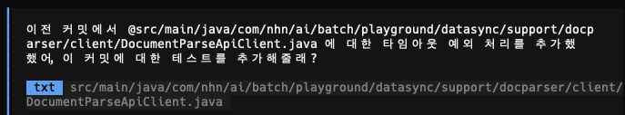

 

- 다른 AI 코딩 도구들과 비슷한 경험을 느낄 수 있었고, 테스트도 잘 작성되었고, agents가 적절히 테스트도 수행해서, 테스트에 오류가 없는지 검증도 했다.

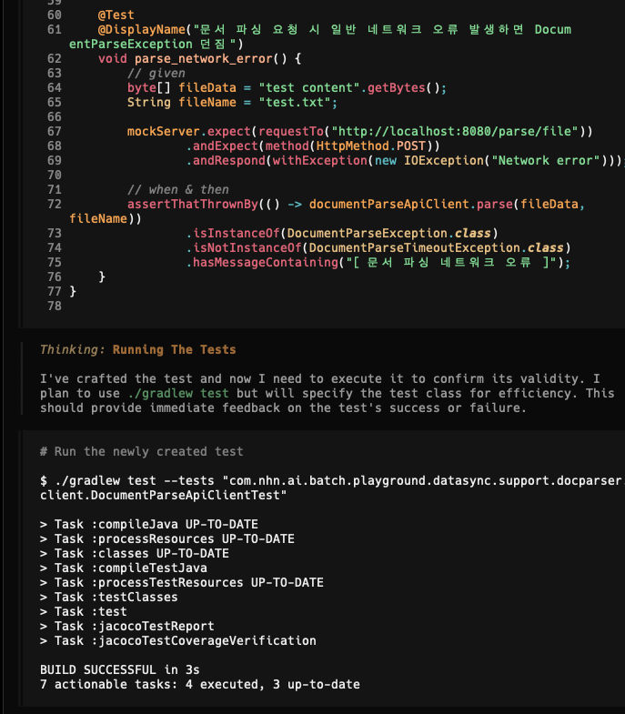

- 여기서 또 신기한 기능이 하나 있는데, 이 대화 세션을 공유할 수 있는 기능도 있다는 것이다.

  - `/share` 커맨드를 입력하면, 웹 링크가 복사되며, 해당 링크에 접속 시, 대화 내역을 자세하게 살펴볼 수 있다.
    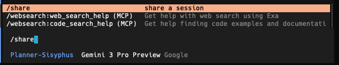
  - 이 링크는 누구나 접속할 수 있어서, 내부 데이터가 유출되지 않도록 주의가 필요할 것 같으나, 사용자가 대화한 내역이 아주 상세하게 로그로 남아서, 내부 문서로 추출할 수 있거나 한다면 매우 좋은 기능이 될 것 같다.
    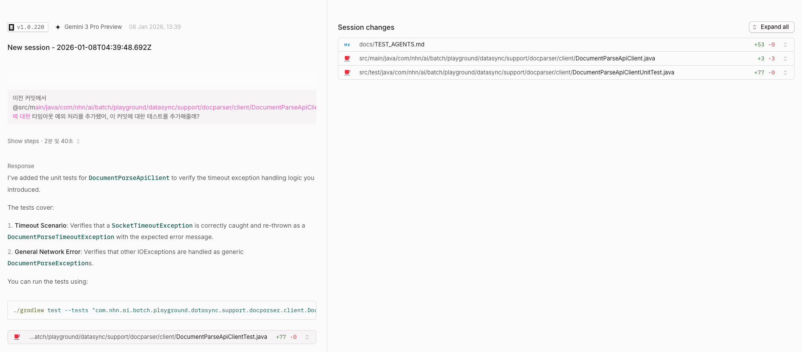
  - 다시 공유를 해제하려면 `/unshare`를 입력하면 된다.

 

- 해당 공유된 링크는 대시보드를 통해서도 확인할 수 있고, 대시보드에서는 기본적인 지표도 확인할 수 있다.
  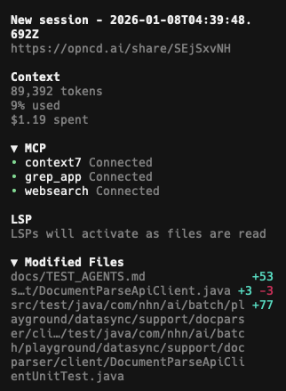

  - 토큰 사용량, 비용
  - 연걸된 MCP들
  - 사용중인 Language Server Protol
  - 변경된 파일 등
  - 한 눈에 파악할 수 있어 매우 편리하다.
