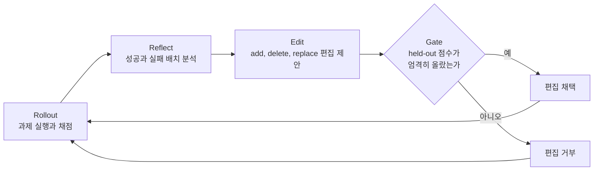

# SkillOpt: 스킬 문서 한 장을 신경망 가중치처럼 학습시키는 방법

에이전트에게 주는 스킬 문서(`SKILL.md`)는 사람이 쓰고 사람이 고친다.
결과가 나쁘면 문서를 읽고 감으로 고치는 일을 반복한다.
Microsoft 가 공개한 SkillOpt 는 이 수정을 머신러닝 학습 루프처럼 자동화한다.
모델은 그대로 두고 스킬 문서 한 장만 학습 대상으로 삼는다.
이 글은 Microsoft 가 공개한 SkillOpt 저장소의 README 가 설명하는 구조를 정리한다. 이 글을 쓸 때 참고한 자료에는 저장소 주소가 남아 있지 않아 링크는 달지 않았다.

> 이 글의 내용은 README 의 설명을 읽고 옮긴 것이다. README 가 내세우는 성능 수치는 직접 재현하지 않았으므로 옮기지 않는다.

## 무엇을 학습하는가

학습 대상은 모델 가중치가 아니라 스킬 문서의 텍스트다.
작업을 수행하는 타깃 모델은 고정(frozen)하고, 별도의 옵티마이저 모델이 문서를 고친다.
결과물은 문서 한 장(`best_skill.md`)이다. 추론할 때는 이 문서를 읽혀 주는 것 외에 모델을 추가로 호출하지 않는다.

백엔드 개발자에게 익숙한 말로 옮기면, 배포 산출물이 바이너리가 아니라 설정 파일 한 장이고 그 설정 파일을 자동으로 튜닝하는 구조다.
서버 코드는 건드리지 않고 설정 파일만 바뀐다.

## 학습 루프

1. Rollout: 현재 스킬 문서로 과제를 실행하고 채점한다.
2. Reflect: 성공과 실패를 배치로 묶어 원인을 분석한다.
3. Edit: 문서를 고치는 add, delete, replace 편집을 제안한다.
4. Gate: 학습에 쓰지 않은 held-out 데이터의 점수가 엄격히 오를 때만 편집을 채택한다.

Gate 가 핵심이다. 학습 데이터에서 점수가 오른 편집을 그대로 받으면 그 데이터에만 맞는 문서가 된다.
배포 전 검증 통과 조건과 같다. 개발 데이터로 만들고, 따로 둔 데이터로 통과 여부를 정한다.

## 학습이 흔들리지 않게 하는 네 가지 장치

README 는 안정화 장치를 가중치 학습의 기법에 대응시켜 설명한다.

| 장치 | 대응하는 가중치 학습 기법 | 하는 일 |
| --- | --- | --- |
| 편집 예산 제한 | learning rate | 한 번에 고칠 수 있는 양을 제한해 통째 재작성 같은 파괴적 변경을 막는다 |
| validation gate | early stopping | held-out 점수가 오르지 않으면 채택하지 않는다 |
| 거부된 편집 버퍼 | momentum, history | 거부된 편집을 버퍼에 남겨 이후 편집 제안에 참고한다 |
| epoch 단위 meta 업데이트 | slow weights | 편집 단위보다 느린 epoch 주기로 meta 업데이트를 한다 |

## 코딩 에이전트용 야간 정리: SkillOpt-Sleep

SkillOpt-Sleep 은 같은 아이디어를 코딩 에이전트의 일상에 맞춘 사이클이다.

1. 에이전트가 쌓은 세션 기록에서 학습할 만한 사례를 채굴한다.
2. 그 과제를 오프라인에서 다시 실행한다.
3. 통과 조건을 넘긴 편집만 staging 에 모은다.
4. 사람이 확인해 채택한다.

자동 편집이 곧바로 반영되지 않고 사람의 채택을 거친다는 점이 중요하다.
README 는 Claude Code 용 `/sleep` 플러그인도 제공한다고 설명한다.

## 적용하기 전에 확인할 것

README 의 구조를 읽고 내린 판단이다.
Gate 는 held-out 점수를 쓰므로, 자동으로 채점할 수 있는 과제 묶음과 학습에 쓰지 않을 held-out 묶음이 먼저 있어야 한다.
채점 기준이 부정확하면 옵티마이저는 그 기준에 맞춰 문서를 고친다.
