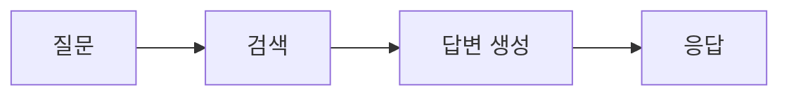
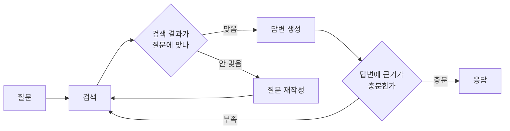
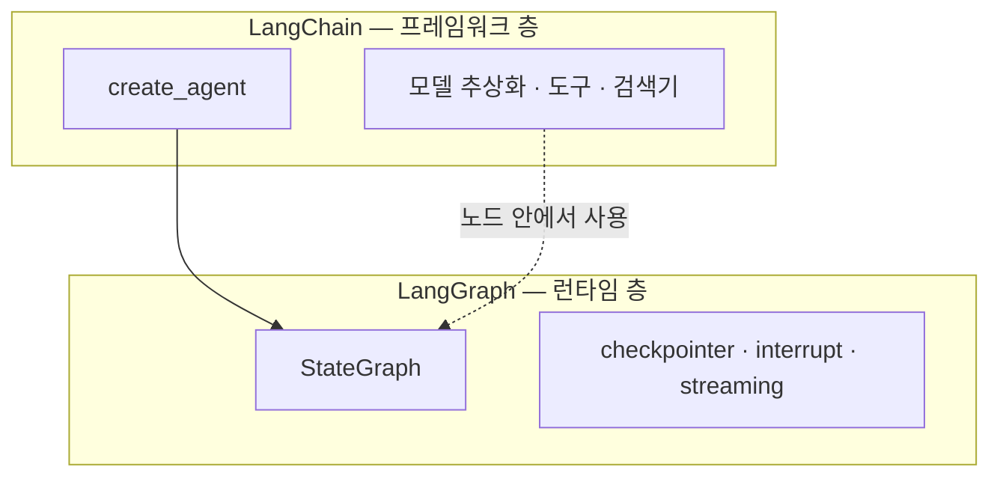
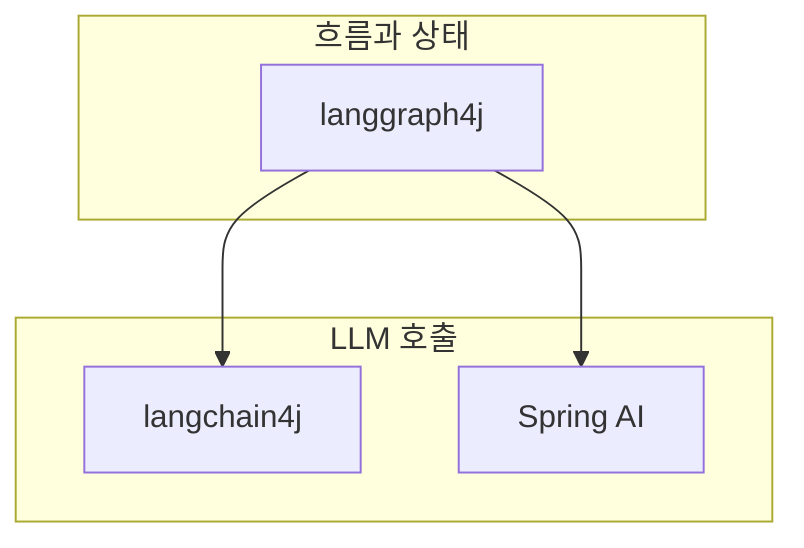

# LangChain과 LangGraph는 왜 나뉘어 있나 — 체인과 런타임의 경계

> [LangGraph — 에이전트 워크플로를 그래프로 통제하기](./langgraph-overview.md)를 먼저 읽으면 좋다.
> 그 글이 LangGraph를 어떻게 쓰는지 다룬다면, 이 글은 LangChain과의 경계를 다룬다.

LangChain과 LangGraph 중 뭘 써야 하냐는 질문을 스스로 하다가, 질문 자체가 틀렸다는 걸 알았다.
둘은 경쟁하는 프레임워크가 아니라 **위아래 층**이고, 만든 곳도 같은 회사다.

이 글에서 가져갈 것은 하나다 — **되돌아가야 하면 LangGraph, 앞으로만 흐르면 LangChain.**
그 판단 기준이 왜 그렇게 갈리는지, 그리고 Java에서는 무엇이 그 자리에 오는지를 정리했다.

---

## 한 문장으로 나누면

| | LangChain | LangGraph |
| --- | --- | --- |
| 정체 | 에이전트 **프레임워크** | 에이전트 **런타임** |
| 제공하는 것 | 모델 추상화, 도구, 검색기, 프롬프트 템플릿, 출력 파서 | 실행 흐름, 상태, 영속성, 중단과 재개, 스트리밍 |
| Java로 치면 | 라이브러리 모음과 메서드 체이닝 | 워크플로 엔진 |

공식 문서도 같은 선을 긋는다. LangChain은 "모델, 도구, 에이전트 루프를 위한 추상화와 통합"이고,
LangGraph는 "지속 실행, 스트리밍, 사람 개입, 영속성을 제공하는 오케스트레이션 런타임"이다.

---

## LangChain의 체인은 왜 되돌아가지 못하나

LangChain의 조합 방식인 LCEL은 파이프로 단계를 잇는다.

```python
chain = prompt | llm | output_parser
result = chain.invoke({"question": "..."})
```

Java 개발자에게는 `Stream.map().filter().collect()`와 같은 모양이다.
읽기 쉽고, 각 단계가 독립적이고, 타입도 맞춰진다.

문제는 이 구조가 방향 비순환 그래프, 곧 **DAG** 라는 점이다.
비순환이라는 말 그대로 앞으로만 흐르고, 지나온 단계로 돌아갈 수 없다.

분기는 된다. `RunnableBranch`로 조건에 따라 다른 가지를 탈 수 있다.
하지만 그건 `if` 문이지 `while` 문이 아니다.

### 되돌아가야 하는 순간은 생각보다 빨리 온다

RAG를 만든다고 하자. 가장 단순한 형태는 이렇다.



이 구조의 결함은 **검색이 실패해도 그냥 답을 만든다**는 것이다.
관련 없는 문서를 가져와도 LLM은 그걸로 그럴듯한 답을 지어낸다.

제대로 하려면 이렇게 되어야 한다.



화살표 두 개가 뒤로 간다. 이 순간 DAG가 아니게 되고, 체인으로는 표현할 수 없다.

---

## while 루프로 흉내내면 무엇이 깨지나

체인만으로 안 되면 애플리케이션 코드에서 감싸면 되지 않나 싶다.
실제로 그게 유일한 방법이다.

```python
# 체인만으로 루프를 만들려면 이렇게 된다
state = {"question": q, "docs": [], "attempts": 0}

while state["attempts"] < 3:
    state["docs"] = retriever.invoke(state["question"])
    if grade_chain.invoke(state):      # 검색 결과가 쓸만한가
        break
    state["question"] = rewrite_chain.invoke(state)
    state["attempts"] += 1

answer = generate_chain.invoke(state)
```

동작은 한다. 그런데 이 코드가 프로덕션에서 만나는 문제가 네 가지 있다.

**첫째, 상태가 프로세스 메모리에만 있다.**
`state` 딕셔너리는 이 함수의 지역 변수다.
서버가 죽거나, 배포로 파드가 교체되거나, OOM으로 프로세스가 내려가면 진행 상황이 통째로 사라진다.
2번째 시도까지 갔어도 처음부터 다시 해야 하고, 그 사이 쓴 LLM 토큰 비용은 그대로 날아간다.

**둘째, 밖에서 들여다볼 수 없다.**
지금 몇 번째 반복인지, 어떤 질문으로 재작성됐는지 알려면 로그를 직접 심어야 한다.
그 로그는 구조화되지 않은 텍스트라 나중에 집계하기도 어렵다.

**셋째, 사람 승인을 넣을 자리가 없다.**
"이 조치는 관리자 확인 후 실행" 같은 요구가 들어오면 방법이 없다.
스레드를 붙잡고 기다리게 하면 커넥션 풀이 마르고, 몇 시간짜리 승인은 애초에 불가능하다.

**넷째, 반복 상한이 마법의 숫자로 남는다.**
`attempts < 3`의 3은 어디에도 근거가 없다.
바꾸려면 코드를 고치고 배포해야 한다.

정리하면 **루프 자체는 만들 수 있지만, 그 루프의 상태를 다룰 방법이 없다.**
LangGraph가 채우는 자리가 정확히 여기다.

---

## LangGraph가 가져오는 세 가지

### 사이클을 1급 시민으로 다룬다

노드와 엣지로 흐름을 정의하고, 엣지가 뒤로 가도 된다.

```python
builder.add_edge("rewrite", "retrieve")   # 뒤로 돌아가는 엣지
```

무한 루프는 `recursion_limit`으로 막는다. 초과하면 `GraphRecursionError`가 난다.

### 상태를 명시적인 객체로 뽑는다

앞의 `while` 예제에서 `state` 딕셔너리를 지역 변수로 들고 다녔다.
LangGraph는 그걸 **스키마로 선언**하게 만든다.

```python
from typing import Annotated
from typing_extensions import TypedDict
from langgraph.graph.message import add_messages

class State(TypedDict):
    messages: Annotated[list, add_messages]
    question: str
    documents: list[str]
    attempts: int
```

백엔드 관점에서 이건 **세션에 아무거나 담다가 명시적 컨텍스트 DTO로 바꾸는 것**과 같은 리팩토링이다.
무엇이 흐르는지 타입으로 드러나고, 각 노드가 무엇을 읽고 쓰는지 추적된다.

### 상태를 저장하고 다시 불러온다

여기가 가장 큰 차이다.
`checkpointer`를 붙이면 각 단계가 끝날 때마다 상태 스냅샷이 저장소에 남는다.

```python
from langgraph.checkpoint.postgres import PostgresSaver

graph = builder.compile(checkpointer=PostgresSaver(conn))
config = {"configurable": {"thread_id": "persona-1042"}}
graph.invoke({"question": "..."}, config)
```

`thread_id`로 실행 단위를 구분하고, 그 단위의 이력이 DB에 쌓인다.
그래서 프로세스가 죽어도 이어서 실행할 수 있고, 며칠 뒤 사람이 승인해도 그 지점부터 재개된다.

이 구조는 3편에서 자세히 다룬다.

---

## LangChain 1.0 이후, 둘은 이미 합쳐졌다

2025년 10월 LangChain 1.0부터 관계가 명시적으로 바뀌었다.
LangChain의 `create_agent`가 **내부적으로 LangGraph를 호출한다.**
예전의 `AgentExecutor`와 `initialize_agent`는 폐기 예정이다.



그래서 실제 질문은 둘 중 무엇을 쓸까가 아니라 **어느 층까지 내려갈까** 이다.

- `create_agent`로 충분하면 LangChain 층에서 끝낸다.
- 실행 중간 상태에 손대야 하거나, 사람 검토 단계를 넣거나, 조건부 재시도 로직이 필요하면 LangGraph 층으로 내려간다.

---

## 판단 기준

| 상황 | 선택 | 이유 |
| --- | --- | --- |
| 단발 RAG 질의, 요약, 분류 | LangChain 체인 | 앞으로만 흐른다. 런타임이 줄 게 없다 |
| 도구를 몇 번 호출하는 표준 에이전트 | LangChain `create_agent` | 안이 LangGraph라 나중에 내려가기 쉽다 |
| 검색 품질을 판정하고 재검색 | LangGraph | 뒤로 가는 엣지가 필요하다 |
| 사람 승인이 끼는 흐름 | LangGraph | 중단과 재개가 필요하다 |
| 장시간 실행, 장애 재개가 중요 | LangGraph | checkpoint 없이는 불가능하다 |
| 여러 에이전트가 작업을 주고받음 | LangGraph | 핸드오프와 공유 상태가 필요하다 |

---

## Java에서는 무엇이 그 자리에 오나

여기가 내가 실제로 필요한 부분이었다. 세 가지를 놓고 봐야 한다.

| | langchain4j | langgraph4j | Spring AI |
| --- | --- | --- | --- |
| 대응 위치 | LangChain 층 | LangGraph 층 | LangChain 층 |
| 사이클 | 없음 | 있음 | 없음 |
| 실행 상태 영속화 | 없음 | 있음 | 없음 |
| 중단과 재개 | 없음 | 있음 | 없음 |
| 대화 이력 저장 | `ChatMemory` | 별개 개념 | `ChatMemory` |

### Spring AI에 없는 것을 정확히 짚으면

Spring AI 2.0은 2026년 6월 12일 정식 출시됐다.
공식 블로그의 에이전트 패턴 글이 다섯 가지 워크플로를 소개하는데, 이 점을 오해하기 쉽다.

- chaining
- routing
- parallelization
- orchestrator-workers
- evaluator-optimizer

이건 **프레임워크 기능이 아니라 예제 코드**다.
`ChatClient`를 쓰는 평범한 Java 클래스로 각 패턴을 구현해 보인 것이고, 상태 영속화나 재개 기능은 없다.

Spring AI 2.0의 실제 초점은 다른 데 있다 — 통합 tool calling, MCP 애노테이션 API, 자가 교정 structured output, JSpecify 기반 null 안전성.
좋은 릴리스지만 상태 그래프 런타임은 아니다.

**여기서 헷갈리기 쉬운 구분이 하나 있다.**
Spring AI의 `ChatMemory`는 **대화 메시지**를 저장한다.
LangGraph의 checkpointer는 **워크플로 실행 상태**를 저장한다.
전자로는 "3번 노드에서 죽었으니 3번부터 재개"를 할 수 없다.

### 그래서 대체가 아니라 조합이다

langgraph4j는 langchain4j와 Spring AI를 **둘 다 공식 지원**한다.
1.8.24의 parent POM이 `langchain4j.version = 1.18.1`과 `spring-ai.version = 2.0.0`을 함께 고정하고 있다.



### 버전 실측

내가 직접 확인한 값이다. Maven Central 검색 API는 낡은 색인을 주니 `maven-metadata.xml`을 직접 봐야 한다.

```bash
curl -s https://repo1.maven.org/maven2/org/bsc/langgraph4j/langgraph4j-core/maven-metadata.xml
```

- 최신 정식 릴리스는 **1.8.24** (2026년 8월 8일). 1.9.0은 beta 진행 중이다.
- 컴파일 타깃은 Java 17이라 그 이상 런타임에서 그대로 돈다.
- checkpoint 저장소 모듈이 Postgres, MySQL, SQLite, Redis, DynamoDB, Oracle까지 나와 있다.

가장 단순한 그래프를 Java로 쓰면 이렇게 된다.

<details>
<summary>Java (langgraph4j) — 최소 그래프</summary>

```java
import org.bsc.langgraph4j.StateGraph;
import org.bsc.langgraph4j.state.AgentState;
import org.bsc.langgraph4j.state.Channel;
import org.bsc.langgraph4j.state.Channels;
import static org.bsc.langgraph4j.action.AsyncNodeAction.node_async;
import static org.bsc.langgraph4j.StateGraph.START;
import static org.bsc.langgraph4j.StateGraph.END;

class SimpleState extends AgentState {
    static final String MESSAGES = "messages";
    static final Map<String, Channel<?>> SCHEMA =
        Map.of(MESSAGES, Channels.appender(ArrayList::new));

    SimpleState(Map<String, Object> initData) { super(initData); }

    List<String> messages() {
        return this.<List<String>>value(MESSAGES).orElse(List.of());
    }
}

var graph = new StateGraph<>(SimpleState.SCHEMA, SimpleState::new)
    .addNode("greeter", node_async(state ->
        Map.of(SimpleState.MESSAGES, "안녕하세요")))
    .addEdge(START, "greeter")
    .addEdge("greeter", END)
    .compile();

for (var step : graph.stream(Map.of(SimpleState.MESSAGES, "시작"))) {
    System.out.println(step);
}
```

Python의 `TypedDict` 자리에 `AgentState` 상속이,
`Annotated[list, add_messages]` 자리에 `Channels.appender(...)`가 온다.
</details>

<details>
<summary>JavaScript (LangGraph.js) — 최소 그래프</summary>

```typescript
import { Annotation, StateGraph, START, END } from "@langchain/langgraph";

const StateAnnotation = Annotation.Root({
  messages: Annotation<string[]>({
    reducer: (prev, next) => prev.concat(next),
  }),
});

const graph = new StateGraph(StateAnnotation)
  .addNode("greeter", async () => ({ messages: ["안녕하세요"] }))
  .addEdge(START, "greeter")
  .addEdge("greeter", END)
  .compile();

const result = await graph.invoke({ messages: ["시작"] });
```
</details>

---

## 언제 LangGraph를 쓰지 말아야 하나

내가 배우면서 가장 늦게 이해한 부분이다. 그래프가 항상 이득은 아니다.

**LLM을 한 번 호출하고 끝나는 작업.**
분류, 요약, 번역 같은 것들이다.
노드 하나짜리 그래프는 함수 호출 한 번을 프레임워크로 감싼 것에 불과하고, 읽기만 어려워진다.

**흐름이 완전히 고정된 파이프라인.**
분기도 없고 반복도 없다면 체인이 더 명확하다.
그래프는 "어디로 갈지 모른다"는 불확실성을 다루는 도구인데, 그 불확실성이 없으면 비용만 남는다.

**상태가 요청 안에서 끝나는 경우.**
응답을 돌려주면 잊어도 되는 작업에 checkpointer를 붙이면 DB 쓰기만 늘어난다.
`InMemorySaver`도 메모리를 계속 먹는다. 공식 문서도 체크포인트가 쌓이니 정리 정책을 두라고 명시한다.

**팀이 아직 도구 호출도 안 해봤을 때.**
그래프, 리듀서, 체크포인트를 한꺼번에 배우면 어디서 틀렸는지 알기 어렵다.
`create_agent`로 도구 호출부터 익히고, 한계를 만난 다음 내려오는 순서를 권한다.

---

## 다음 편

이 글에서는 경계만 그었다.
2편에서는 그래프를 실제로 구성하는 State와 Reducer를 다룬다.
특히 상태를 잘못 설계하면 어디서 깨지는지, 리듀서가 왜 필요한지를 정리한다.

---

## 참고

- [Docs by LangChain — LangGraph 개요](https://docs.langchain.com/oss/python/langgraph/overview)
- [Docs by LangChain — Graph API](https://docs.langchain.com/oss/python/langgraph/graph-api)
- [Docs by LangChain — Persistence](https://docs.langchain.com/oss/python/langgraph/persistence)
- [langgraph4j GitHub](https://github.com/langgraph4j/langgraph4j)
- [Spring AI 2.0.0 GA 릴리스 노트](https://spring.io/blog/2026/06/12/spring-ai-2-0-0-GA-available-now/)
- [Spring AI — Agentic Patterns](https://spring.io/blog/2025/01/21/spring-ai-agentic-patterns)
