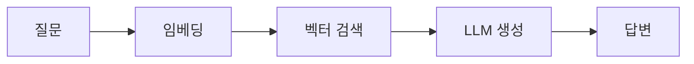
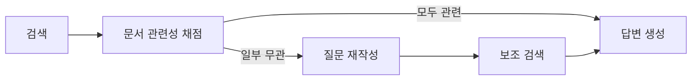
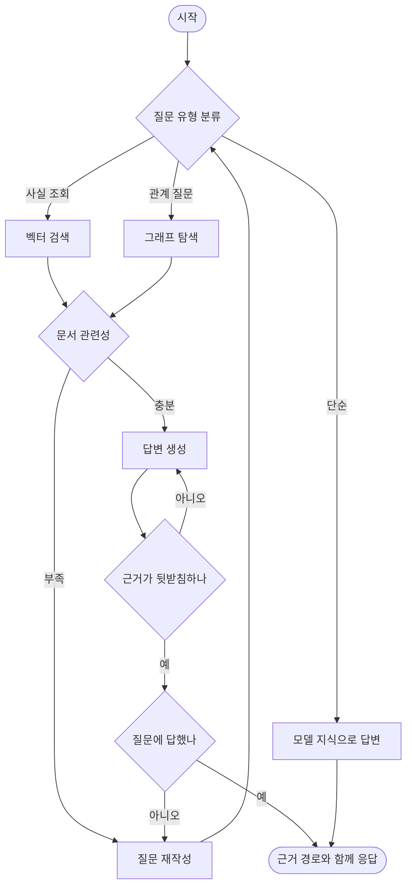

# Agentic GraphRAG — 지식그래프 검색을 LangGraph로 통제하기

> [LangGraph Human-in-the-Loop](./langgraph-human-in-the-loop.md)에서 이어진다.
> 벡터 검색 자체가 처음이라면 [벡터 검색 알고리즘](../RAG/vector-search-algorithms.md)을 먼저 보면 좋다.

여기까지가 그래프의 뼈대였다면, 이 글부터는 그 뼈대로 실제로 무엇을 만드는지 다룬다.

가져갈 것은 세 가지다.

- 단순 RAG는 **검색이 실패해도 답을 만들어낸다.** 이게 환각의 큰 원인이다.
- 그걸 막는 방법은 검색 결과와 생성 결과를 **LLM으로 채점하고 되돌아가는 것**이다. 여기서 사이클이 필요해진다.
- 지식그래프를 쓰면 **왜 그렇게 판단했는지 경로로 보여줄 수 있다.** 벡터 검색만으로는 안 되는 부분이다.

---

## 단순 RAG가 조용히 실패하는 지점

가장 기본 형태는 이렇다.



이 구조에는 **검색이 잘 됐는지 아무도 확인하지 않는다.**
벡터 검색은 항상 상위 k개를 돌려준다. 관련 문서가 하나도 없어도 "가장 덜 관련 없는" 것들을 준다.

그리고 LLM은 주어진 문서가 엉뚱해도 답을 만든다.
그 답은 문법적으로 멀쩡하고 자신감 있게 들린다. 그래서 눈치채기 어렵다.

### 관계를 묻는 질문은 벡터 검색으로 잘 안 된다

두 번째 문제는 더 구조적이다.

"이 대상자의 최근 체중 감소가 어떤 위험과 이어지나요"라는 질문을 보자.
답을 만들려면 이런 연결을 따라가야 한다.

```
체중 감소 → 영양 불량 → 낙상 위험 증가 → 신체건강 영역 위험도 상승
```

벡터 검색은 질문과 **의미가 비슷한 덩어리**를 찾는다.
그런데 이 연결은 어느 한 문서에 통째로 적혀 있지 않다.
각 단계가 다른 문서, 다른 문단에 흩어져 있고, 그걸 이어붙이는 건 관계 정보다.

이게 지식그래프를 쓰는 이유다.
연결이 데이터 구조 자체에 들어 있으니 따라가면 된다.

---

## 검색을 채점하고 되돌아가는 세 가지 설계

LangChain이 정리한 self-reflective RAG 설계 세 가지가 실질적인 출발점이다.
셋 다 사이클이 있어서 체인으로는 표현할 수 없다.

### Corrective RAG — 검색이 나쁘면 고쳐서 다시



흐름은 이렇다.

1. 벡터 저장소에서 문서를 가져온다.
2. 가벼운 평가기로 검색 품질을 본다.
3. 문서마다 관련성을 채점한다.
4. 무관한 문서가 있으면 질문을 다시 쓰고 보조 검색으로 보충한다.
5. 남은 관련 문서로 답을 만든다.

핵심은 **판정이 이진값**이라는 점이다. 관련 있나 없나만 본다.
복잡한 점수 체계를 만들면 임계값 조정에 시간을 쓰게 되는데, 실제로는 이진 판정으로 충분한 경우가 많다.

### Self-RAG — 생성 결과까지 채점한다

Corrective RAG가 검색만 본다면, Self-RAG는 생성한 답도 검사한다.
논문에서 세 가지 축을 쓴다.

| 축 | 무엇을 보나 | 실패하면 |
| --- | --- | --- |
| 관련성 | 가져온 문단이 질문과 관계가 있나 | 질문을 다시 쓰고 재검색 |
| 근거 지지 | 생성한 문장이 문서로 뒷받침되나 | 다시 생성 |
| 유용성 | 그 답이 실제로 질문에 답하나 | 질문을 다시 쓰고 재검색 |

두 번째 축이 특히 중요하다.
**문서는 맞게 가져왔는데 LLM이 거기 없는 내용을 덧붙이는 경우**를 잡는다.
환각을 사후에 거르는 가장 실용적인 장치다.

```python
def grade_groundedness(state: State) -> str:
    verdict = groundedness_chain.invoke({
        "documents": state["documents"],
        "generation": state["generation"],
    })
    if verdict == "no":
        return "generate"          # 같은 문서로 다시 생성
    return "grade_usefulness"

builder.add_conditional_edges("generate", grade_groundedness)
```

### Adaptive RAG — 질문에 따라 경로를 고른다

모든 질문에 같은 파이프라인을 태울 필요가 없다.
질문 유형을 먼저 분류하고 경로를 나눈다.

| 질문 유형 | 경로 |
| --- | --- |
| 일반 상식 | 검색 없이 모델 지식으로 답한다 |
| 문서에 있는 사실 | 벡터 검색 |
| 관계와 다중 홉 | 그래프 탐색 |
| 최신 정보 | 외부 검색 |

라우팅 판단에 LLM 호출이 한 번 더 들어가지만, 불필요한 검색을 건너뛰어 전체 비용은 오히려 줄어드는 경우가 많다.

---

## 벡터와 그래프는 역할이 다르다

Neo4j의 GraphRAG 파이썬 패키지가 제공하는 리트리버를 보면 이 분업이 드러난다.

| 리트리버 | 방식 | 잘하는 것 |
| --- | --- | --- |
| `VectorRetriever` | 벡터 유사도 | 표현이 달라도 의미가 비슷한 것 찾기 |
| `HybridRetriever` | 벡터와 전문 검색 결합 | 고유명사와 의미 검색을 함께 |
| `VectorCypherRetriever` | 벡터로 진입점을 찾고 Cypher로 확장 | 시작점은 유사도로, 확장은 관계로 |
| `Text2CypherRetriever` | 자연어를 Cypher로 변환 | 정확한 조건 질의 |
| `ToolsRetriever` | LLM이 도구를 골라 실행 | 질문에 따라 검색 방식 선택 |

`VectorCypherRetriever`가 실무에서 가장 쓸모 있는 조합이다.
**어디서 시작할지는 벡터가 잘 찾고, 거기서 무엇으로 이어지는지는 그래프가 잘 안다.**

```
"체중이 계속 줄어요"
  → 벡터 검색으로 "체중 감소" 개념 노드에 도달       (표현이 달라도 찾는다)
  → Cypher 로 관계를 2홉 따라간다                    (정확히 연결된 것만)
  → 영양 불량, 낙상 위험, 근감소증 노드를 얻는다
```

벡터만 쓰면 두 번째 단계가 없고, Cypher만 쓰면 첫 단계에서 "체중 감소"라는 정확한 단어를 질문에 써야 한다.

### text2cypher는 편하지만 위험도 함께 온다

자연어를 Cypher로 바꿔주는 방식은 매력적이지만 두 가지를 감수해야 한다.

**LLM이 만든 쿼리가 DB에 그대로 나간다.**
읽기 전용 계정으로 제한하고, 실행 시간 상한을 걸고, 반환 행 수를 제한하는 건 선택이 아니라 필수다.

**스키마를 벗어난 쿼리를 만든다.**
존재하지 않는 관계 타입이나 속성 이름을 지어낸다. 결과가 비면 그냥 빈 답이 나온다.
스키마를 프롬프트에 넣어주고, 생성된 쿼리를 실행 전에 검증하는 노드를 따로 두는 편이 안전하다.

---

## 홉을 늘리면 비용이 어떻게 늘어나나

그래프 탐색에서 가장 먼저 만나는 문제다.
노드 하나가 평균 몇 개와 연결돼 있느냐에 따라 결과가 지수로 늘어난다.

```
평균 연결 수 8개일 때
1홉 = 8개
2홉 = 8 × 8 = 64개
3홉 = 8 × 8 × 8 = 512개
```

512개 노드를 LLM 컨텍스트에 넣으면 토큰이 폭증하고, 정작 중요한 연결은 노이즈에 묻힌다.

실무에서 쓰는 제어 장치는 세 가지다.

- **홉 수를 2로 제한한다.** 대부분의 도메인에서 3홉을 넘으면 연관성이 급격히 떨어진다.
- **관계 타입으로 거른다.** 아무 관계나 따라가지 말고 의미 있는 타입만 지정한다.
- **가중치로 자른다.** 관계에 가중치가 있으면 임계값 이하를 버린다.

```cypher
MATCH path = (start:Concept {name: $concept})-[r:CAUSES|INCREASES_RISK*1..2]->(target:Concept)
WHERE ALL(rel IN relationships(path) WHERE rel.weight >= 0.3)
RETURN path, target
LIMIT 20
```

---

## 그래프의 진짜 이득 — 근거를 경로로 돌려준다

돌봄 분석처럼 판단 근거가 중요한 도메인에서 이게 결정적이다.

벡터 RAG의 근거는 "이 문서 조각을 참고했습니다"다. 사람이 그 조각을 직접 읽고 판단해야 한다.
그래프 RAG의 근거는 **연결의 사슬**이다.

```
관찰: 3주간 체중 4% 감소
  ─[시사]→ 영양 불량 (가중치 0.6)
  ─[증가시킴]→ 낙상 위험 (가중치 0.7)
  ─[속함]→ 신체건강 영역
결론: 신체건강 영역 위험도 상승
```

이 경로를 그대로 응답에 실으면 검토자가 각 단계를 따로 검증할 수 있다.
"영양 불량에서 낙상 위험으로 가는 연결이 과하다"는 피드백이 오면 그 관계의 가중치만 고치면 된다.

**LLM이 만든 문장을 고치는 게 아니라 데이터를 고치는 구조**가 된다.
이게 그래프를 쓰는 가장 실용적인 이유다.

---

## 전체 흐름을 그래프로 조립하면



되돌아가는 화살표가 세 개다.
이 세 개 때문에 체인으로는 만들 수 없고, State에 `attempts` 같은 값을 두어 상한을 걸어야 한다.

State는 [State와 Reducer](./langgraph-state-and-reducer.md)에서 다룬 형태를 그대로 쓴다.

```python
class GraphRagState(TypedDict):
    question: str
    original_question: str                       # 재작성 전 원본을 보존한다
    route: str
    documents: Annotated[list[str], add]
    paths: Annotated[list[dict], add]            # 탐색한 그래프 경로
    generation: str
    attempts: int
```

`original_question`을 따로 두는 이유가 있다.
재작성을 반복하면 질문이 원래 의도에서 조금씩 멀어진다.
매번 원본을 기준으로 다시 쓰지 않으면 세 번째 재작성쯤에서 전혀 다른 질문이 된다.

---

## 언제 이렇게까지 하지 말아야 하나

**문서가 적고 구조가 단순할 때.**
문서 수십 건 규모에서는 벡터 검색 한 번이면 충분하다.
채점 노드를 붙이면 LLM 호출만 늘어난다.

**응답 지연이 중요한 실시간 대화.**
채점 노드마다 LLM 호출이 붙는다.
Self-RAG 전체를 태우면 한 질문에 LLM 호출이 다섯 번 이상 나갈 수 있다.
사용자가 기다리는 화면이라면 이 구조는 맞지 않는다.

**관계 데이터가 부실할 때.**
그래프 탐색의 품질은 관계 데이터의 품질을 넘지 못한다.
자동 추출만 하고 사람 검토를 안 거친 그래프라면, 잘못된 연결을 근거랍시고 자신 있게 보여주게 된다.
이건 근거가 없는 것보다 나쁘다.

---

## Java와 JavaScript에서는

<details>
<summary>Java — langgraph4j와 Neo4j 조합</summary>

Java에는 `neo4j-graphrag-python`에 대응하는 공식 패키지가 없다.
Neo4j Java 드라이버로 Cypher를 직접 쓰고, 벡터 검색은 langchain4j의 `EmbeddingStore` 구현체를 쓰는 조합이 현실적이다.

```java
// 그래프 탐색 노드 — Cypher 를 직접 실행한다
class GraphTraverseNode implements NodeAction<GraphRagState> {
    private final Driver driver;

    public Map<String, Object> apply(GraphRagState state) {
        var cypher = """
            MATCH path = (s:Concept {name: $concept})
                         -[r:CAUSES|INCREASES_RISK*1..2]->(t:Concept)
            WHERE ALL(rel IN relationships(path) WHERE rel.weight >= 0.3)
            RETURN path LIMIT 20
            """;
        try (var session = driver.session()) {
            var paths = session.run(cypher, Map.of("concept", state.concept()))
                               .list(r -> r.get("path").asPath());
            return Map.of(GraphRagState.PATHS, paths);
        }
    }
}
```

Spring Data Neo4j를 쓰는 프로젝트라면 리포지토리에 `@Query`로 Cypher를 두고 노드에서 호출하는 편이 기존 코드와 섞기 쉽다.
</details>

<details>
<summary>JavaScript — LangGraph.js와 Neo4j</summary>

```typescript
import neo4j from "neo4j-driver";

const graphTraverse = async (state: typeof StateAnnotation.State) => {
  const session = driver.session();
  try {
    const result = await session.run(
      `MATCH path = (s:Concept {name: $concept})
                    -[r:CAUSES|INCREASES_RISK*1..2]->(t:Concept)
       WHERE ALL(rel IN relationships(path) WHERE rel.weight >= 0.3)
       RETURN path LIMIT 20`,
      { concept: state.concept },
    );
    return { paths: result.records.map((r) => r.get("path")) };
  } finally {
    await session.close();
  }
};
```
</details>

---

## 읽고 바로 따라 해보기

Neo4j와 LLM을 한꺼번에 붙이기 전에 검색 실패를 되돌리는 제어 흐름만 먼저 만든다.

1. 질문, 검색 결과, 관련성 점수, 재작성 횟수, 최종 답변을 상태 후보로 적는다.
2. 검색 결과가 충분하면 생성으로, 부족하면 질문 재작성으로 가는 조건을 정의한다.
3. 재작성 횟수의 업무 종료 조건과 안전 상한을 따로 둔다.
4. 벡터 검색과 그래프 탐색을 병렬로 실행한다면 결과 병합 규칙을 정한다.
5. 생성한 답변이 근거를 인용하지 못하면 어느 노드로 돌아갈지 그린다.

이 흐름은 [LangGraph4j 실무 운영](./langgraph4j-production-operations.md)의 라우팅, 병렬 처리와 평가-개선 패턴을 한 번에 사용한다.
타임아웃과 부분 검색 실패도 같은 글의 실패 분류표로 먼저 결정한다.

처음 실습에서는 검색기를 고정된 가짜 결과로 둔다.
그래프의 분기와 종료가 맞는지 확인한 뒤 실제 벡터 저장소와 Neo4j를 하나씩 연결해야 실패 원인을 구분할 수 있다.

---

## 다음 편

6편에서는 Java로 내려간다.
langgraph4j를 Spring Boot에 실제로 얹을 때 확인해야 할 것들, Spring AI와의 역할 분담, 그리고 내가 직접 확인한 버전과 의존성 실측 결과를 정리한다.

---

## 참고

- [LangChain — Self-Reflective RAG with LangGraph](https://www.langchain.com/blog/agentic-rag-with-langgraph)
- [neo4j-graphrag-python API 문서](https://neo4j.com/docs/neo4j-graphrag-python/current/api.html)
- [Neo4j — Enhancing hybrid retrieval with graph traversal](https://neo4j.com/blog/developer/enhancing-hybrid-retrieval-graphrag-python-package/)
- [Docs by LangChain — Graph API](https://docs.langchain.com/oss/python/langgraph/graph-api)
