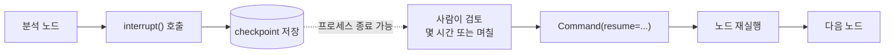
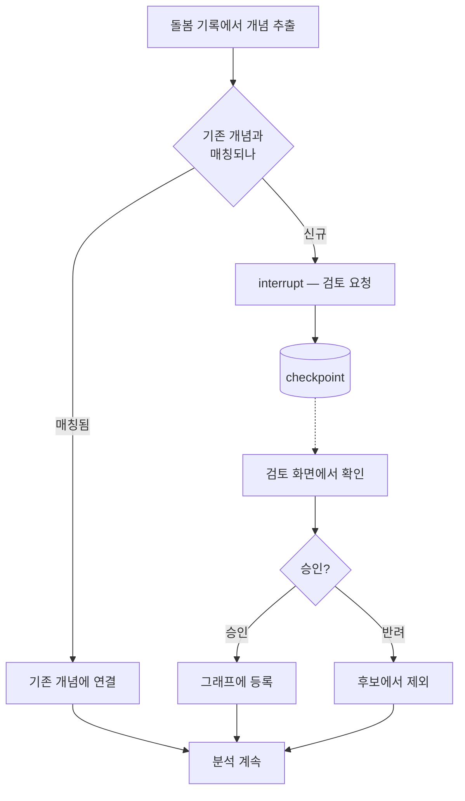

# LangGraph Human-in-the-Loop — 사람 승인을 그래프에 새기기

> [LangGraph Checkpoint](./langgraph-checkpoint-durable-execution.md)에서 이어진다.
> checkpoint를 모르면 이 글의 절반이 이해되지 않는다.

AI가 판단한 걸 사람이 확인하고 넘어가야 하는 흐름은 어디에나 있다.
문제는 그 대기가 **몇 초가 아니라 며칠**일 수 있다는 점이다.

일반적인 웹 요청 구조로는 이걸 못 한다.
스레드를 붙잡고 기다리면 커넥션 풀이 마르고, 서버가 재시작되면 진행 상황이 사라진다.

LangGraph는 이걸 checkpoint 위에서 푼다.
**중단 시점의 상태를 저장하고 프로세스를 놓아준 다음, 나중에 그 상태를 불러와 이어서 실행한다.**

---

## 기본 형태

`interrupt()`를 호출하면 그 자리에서 실행이 멈추고, 인자로 준 값이 호출한 쪽으로 올라온다.

```python
from langgraph.types import interrupt, Command

def review_new_concept(state: State) -> dict:
    decision = interrupt({
        "question": "AI가 새로 등록한 개념을 승인할까요",
        "concept": state["new_concept"],
        "suggested_weight": state["suggested_weight"],
    })
    return {"approved": decision["approved"], "weight": decision["weight"]}
```

재개할 때는 `Command(resume=...)`로 값을 주입한다.

```python
config = {"configurable": {"thread_id": "review-77"}}

graph.invoke({"new_concept": "기립성 저혈압"}, config)   # 여기서 멈춘다

# 며칠 뒤, 사람이 화면에서 승인한 다음
graph.invoke(Command(resume={"approved": True, "weight": 0.4}), config)
```

`interrupt()`가 반환하는 값이 곧 `resume`으로 넘긴 값이다.
같은 `thread_id`를 써야 어느 checkpoint를 이어갈지 찾을 수 있다.



점선 구간이 핵심이다.
그 사이 서버가 재배포되어도, 프로세스가 죽어도 상관없다. 상태는 DB에 있다.

---

## 함정 다섯 가지

공식 문서가 명시적으로 경고하는 항목들이다.
읽고 넘기면 다 아는 얘기 같지만, 실제로는 절반 이상이 3편에서 다룬 **노드 재실행**에서 파생된다.

### 노드는 처음부터 다시 실행된다

가장 먼저 알아야 할 사실이다.
`interrupt()` 앞에 있는 코드는 재개할 때 **한 번 더 실행된다.**

```python
def bad(state: State) -> dict:
    db.insert_alert(state)                    # 재개 시 또 실행된다
    ok = interrupt("보호자에게 알릴까요")
    return {"notified": ok}
```

알림 레코드가 두 개 생긴다.
부작용은 `interrupt()` 뒤로 옮기거나, 멱등 키로 중복을 막거나, 별도 노드로 분리한다.

### try/except로 감싸지 않는다

`interrupt()`는 예외를 던져서 런타임에 중단 신호를 보낸다.
그 예외를 잡으면 중단 자체가 무효가 된다.

```python
# 이렇게 하면 중단이 동작하지 않는다
try:
    decision = interrupt("승인할까요")
except Exception:
    decision = False
```

방어적으로 예외 처리를 감는 습관이 여기서는 정확히 반대로 작동한다.

### 호출 순서를 바꾸지 않는다

한 노드에서 `interrupt()`를 여러 번 부를 수 있는데, 재개 값은 **호출 순서 인덱스로 매칭된다.**
조건에 따라 어떤 호출을 건너뛰면 값이 어긋나 엉뚱한 답이 들어간다.

```python
# 위험한 형태 — 조건에 따라 interrupt 개수가 달라진다
if state["risk"] > 0.7:
    a = interrupt("긴급 조치를 승인할까요")
b = interrupt("보고서를 발송할까요")
```

노드당 `interrupt()`는 한 번만 부르고, 여러 승인이 필요하면 노드를 나누는 편이 안전하다.

### while 루프로 재검증하지 않는다

입력이 유효할 때까지 다시 묻고 싶을 때 `while True`를 쓰면 안 된다.
재개할 때마다 루프 안의 모든 `interrupt()` 호출이 다시 계산되면서 재실행 비용이 급격히 늘어난다.

조건부 엣지로 노드 밖에서 되돌리는 방식이 맞다.

```python
def ask_weight(state: State) -> dict:
    value = interrupt("가중치를 입력해 주세요 (0 이상 1 이하)")
    return {"weight": value}

def is_valid(state: State) -> str:
    return "next" if 0 <= state["weight"] <= 1 else "ask_weight"

builder.add_conditional_edges("ask_weight", is_valid)
```

### JSON으로 직렬화되는 값만 주고받는다

`interrupt()`에 넘기는 값과 `resume`으로 받는 값은 checkpointer를 거쳐 저장된다.
함수, 클래스 인스턴스, DB 커넥션 같은 건 담을 수 없다.

엔티티 객체를 그대로 넘기고 싶은 유혹이 있는데, ID와 필요한 필드만 담은 dict로 줄이는 게 맞다.

---

## interrupt_before는 프로덕션용이 아니다

컴파일할 때 특정 노드 앞뒤에서 멈추도록 지정하는 방법도 있다.

```python
graph = builder.compile(
    checkpointer=checkpointer,
    interrupt_before=["dangerous_action"],
)
```

이건 **디버깅용 중단점**이다. 공식 문서도 프로덕션 HITL 워크플로에는 쓰지 말라고 명시한다.

이유는 두 가지다.
사람에게 무엇을 물어볼지 전달할 방법이 없고, 중단 위치가 노드 경계로만 고정된다.
실제 승인 흐름은 "이 값이 맞나요"처럼 맥락을 담은 질문을 보내야 하므로 `interrupt()`가 필요하다.

---

## 자주 쓰는 네 가지 패턴

### 승인과 거부

```python
def approve_gate(state: State) -> Command:
    ok = interrupt({"action": state["planned_action"], "reason": state["reason"]})
    return Command(goto="execute" if ok else "cancel")
```

### 내용 편집

AI가 만든 초안을 사람이 고쳐서 되돌리는 형태다.

```python
def review_guide(state: State) -> dict:
    edited = interrupt({
        "instruction": "코칭 가이드를 검토하고 필요하면 고쳐 주세요",
        "draft": state["draft_guide"],
    })
    return {"final_guide": edited}
```

### 도구 호출 검토

`interrupt()`를 도구 함수 안에 두면 도구가 실행되기 전에 인자를 확인하고 고칠 수 있다.
외부 시스템을 바꾸는 도구에 유용하다.
[Spring AI 도구 호출을 요청과 실제 실행으로 나누는 흐름](./langgraph4j-spring-ai-llm-tools.md)은 별도 글에서 이어진다.

### 입력 검증

앞에서 다룬 조건부 엣지 되돌리기 형태다.

---

## 돌봄 분석에 대입하면

내가 실제로 필요한 흐름은 이렇다.
분석 결과가 지식그래프에 새 개념을 자동 등록하는데, 그걸 사람이 확정해야 한다.



여기서 `interrupt()`가 주는 이득은 검토 화면 자체가 아니다.
그건 어떤 방식으로든 만들 수 있다.

이득은 **검토를 기다리는 동안 서버가 아무것도 붙잡고 있지 않아도 된다**는 것이다.
검토가 하루 뒤에 이뤄져도, 그 사이 배포가 나가도, 재개 지점이 DB에 남아 있다.

직접 만들면 대기 상태 테이블을 만들고, 중간 결과를 수동으로 직렬화하고, 재개 로직을 따로 짜야 한다.
그 세 가지가 checkpointer 하나로 해결된다.

---

## 언제 이 방식을 쓰지 말아야 하나

**응답 안에서 끝나는 확인.**
"정말 삭제할까요" 같은 확인은 프론트엔드에서 처리하면 된다.
그래프를 중단시킬 이유가 없다.

**승인자가 정해지지 않은 흐름.**
`interrupt()`는 누가 승인하는지 모른다. 그냥 값을 기다릴 뿐이다.
승인자 배정, 알림, 만료, 대리 승인 같은 게 필요하면 그건 결재 시스템의 일이고, 그래프는 그 시스템의 결과를 받아 재개하는 쪽이 맞다.

**중단 지점이 자주 바뀌는 초기 개발 단계.**
3편에서 다룬 대로 중단된 thread가 있으면 노드 이름을 바꿀 수 없다.
설계가 흔들리는 동안에는 대기 중인 thread를 정리하고 배포하는 절차가 따라온다.

---

## Java와 JavaScript에서는

<details>
<summary>Java (langgraph4j) — 승인 흐름</summary>

langgraph4j도 중단과 재개를 지원한다.
`AgentExecutorEx`가 사람 승인 워크플로를 내장한 형태로 제공되고, langchain4j와 Spring AI 양쪽 연동에서 쓸 수 있다.

직접 구성한다면 컴파일 설정에 중단 지점을 주고, 재개할 때 상태를 갱신해 이어가는 형태가 된다.

```java
var compileConfig = CompileConfig.builder()
    .checkpointSaver(new MemorySaver())
    .interruptBefore("approveGate")
    .build();

var graph = stateGraph.compile(compileConfig);
var runConfig = RunnableConfig.builder().threadId("review-77").build();

// 중단 지점까지 실행
graph.invoke(Map.of("newConcept", "기립성 저혈압"), runConfig);

// 사람이 승인한 뒤 상태를 갱신하고 재개
graph.updateState(runConfig, Map.of("approved", true), null);
graph.invoke(null, runConfig);
```

Python의 `interrupt()`와 이름이 다르고 API 세부가 버전에 따라 달라진다.
실제로 쓰기 전에 사용하는 버전의 Javadoc과 예제를 확인하는 편이 좋다.
</details>

<details>
<summary>JavaScript (LangGraph.js) — interrupt와 resume</summary>

```typescript
import { interrupt, Command } from "@langchain/langgraph";

const reviewNode = async (state: typeof StateAnnotation.State) => {
  const decision = interrupt({
    question: "AI가 새로 등록한 개념을 승인할까요",
    concept: state.newConcept,
  });
  return { approved: decision.approved };
};

const config = { configurable: { thread_id: "review-77" } };
await graph.invoke({ newConcept: "기립성 저혈압" }, config);

// 승인 후
await graph.invoke(new Command({ resume: { approved: true } }), config);
```
</details>

---

## 읽고 바로 따라 해보기

사람 승인은 승인 버튼보다 상태 전이를 먼저 설계해야 한다.

1. 승인 대기, 승인됨, 거절됨, 만료됨 네 상태를 적는다.
2. 승인 전에는 절대 실행되면 안 되는 민감한 노드를 하나 정한다.
3. 승인 화면에 보여줄 상태와 감출 상태를 구분한다.
4. 같은 승인 요청이 두 번 들어왔을 때 첫 번째 결정만 유효하게 만드는 기준을 정한다.
5. 승인 대기 중 서버가 재시작되었을 때 필요한 저장소를 적는다.

Java에서는 Python의 `interrupt()` 코드를 그대로 옮기지 않는다.
[LangGraph4j 실무 운영](./langgraph4j-production-operations.md)에서 컴파일 시점 중단, checkpoint 기반 재개와 승인 API의 수명주기를 함께 확인한다.
직접 코드를 작성할 때는 [LangGraph4j in Action 저장소](https://github.com/jon890/langgraph4j-in-action)를 작업 공간으로 사용한다.

따라 하다가 승인 없이 민감 노드에 도달한다면 UI가 아니라 그래프 경계가 잘못된 것이다.
승인 링크만 알면 다른 사람의 thread도 처리할 수 있다면 그래프가 아니라 인가 경계가 빠진 것이다.

---

## 다음 편

여기까지가 그래프의 뼈대다.
5편부터는 실제로 만들려는 것을 다룬다.
지식그래프를 검색하는 Agentic RAG를 LangGraph로 어떻게 통제하는지, 그리고 왜 단순 RAG로는 부족한지를 정리한다.

---

## 참고

- [Docs by LangChain — Interrupts](https://docs.langchain.com/oss/python/langgraph/interrupts)
- [Docs by LangChain — Persistence](https://docs.langchain.com/oss/python/langgraph/persistence)
- [langgraph4j GitHub](https://github.com/langgraph4j/langgraph4j)
