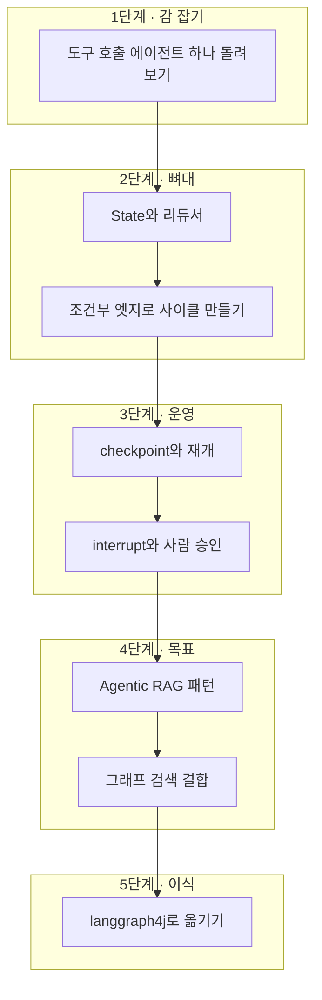

# LangGraph 학습 로드맵 — 무엇을 어떤 순서로 볼까

> [LangGraph4j 실무 운영](./langgraph4j-production-operations.md)에서 이어진다.
> 이 글은 시리즈의 학습 순서와 코드 실습 상태를 연결하는 마지막 안내서다.

LangGraph 문서는 양이 많다.
개념, 하우투, 튜토리얼, 플랫폼 문서가 따로 있고 각각 수십 페이지다.
처음부터 다 읽으려다 지치기 딱 좋다.

이 글은 **무엇을 먼저 보고 무엇을 나중으로 미룰지**를 정리한 것이다.
지식그래프 기반 분석 서비스를 만든다는 목표를 기준으로 우선순위를 매겼다.
목표가 다르면 순서도 달라진다.

개념 설명과 따라 하기 흐름의 원문은 이 블로그 시리즈에 둔다.
[LangGraph4j in Action 저장소](https://github.com/jon890/langgraph4j-in-action)는 Java 코드, 미리 제공한 테스트와 실습 진행 상태만 관리한다.
같은 학습 글을 블로그와 저장소에 나눠 두지 않는다.

---

## 전체 지도



각 단계는 앞 단계를 전제로 한다.
특히 3단계를 건너뛰고 4단계로 가면 안 된다.
Agentic RAG의 루프가 왜 안전한지는 checkpoint를 이해해야 보인다.

---

## 그래프 없이 시작한다

**목표**: 도구를 부르는 에이전트가 어떻게 도는지 몸으로 안다.

여기서는 `StateGraph`를 직접 만들지 않는다.
LangChain의 `create_agent`로 도구 호출 에이전트를 하나 띄우고, 그게 어떤 순서로 도는지만 본다.

```python
from langchain.agents import create_agent

agent = create_agent(model, tools=[search_tool, calculator])
result = agent.invoke({"messages": [{"role": "user", "content": "..."}]})
```

내부는 이미 LangGraph다. 그래서 이걸 이해하면 다음 단계가 쉬워진다.

**볼 것**: LangChain 공식 문서의 에이전트 시작 페이지.
**건너뛸 것**: LCEL 체인 조합 문법. 지금 목표에 필요 없다.

**확인 질문**: 도구를 두 번 부르게 하려면 무엇이 필요한가. 왜 자동으로 반복되나.

---

## State를 직접 설계한다

**목표**: 그래프를 손으로 조립하고, 리듀서가 왜 필요한지 실패로 배운다.

`StateGraph`로 노드 두세 개짜리 그래프를 만든다.
그다음 **일부러 병렬 노드 두 개가 같은 키에 쓰게 만들어서 예외를 본다.**
`InvalidUpdateError`를 직접 만나보는 게 리듀서를 설명으로 읽는 것보다 오래 남는다.

```python
class State(TypedDict):
    evidence: list[str]          # 리듀서를 일부러 빼고 시작한다
```

**볼 것**: Graph API 문서의 State, Nodes, Edges 절.
**미룰 것**: `Send` API. 4단계에서 병렬 호출이 필요해질 때 보면 된다.

**확인 질문**: 노드가 상태 전체가 아니라 부분만 반환하는 이유는 무엇인가.

---

## 저장하고 재개한다

**목표**: 프로세스를 죽였다가 이어서 실행해본다.

이 단계의 실습은 하나로 충분하다.

1. `SqliteSaver`를 붙인 그래프를 만든다.
2. 중간 노드에서 일부러 예외를 던져 죽인다.
3. 같은 `thread_id`로 다시 호출해서 그 지점부터 이어지는지 확인한다.
4. 노드 안에 카운터를 증가시키는 코드를 넣고, **재개할 때 그게 두 번 세지는지** 본다.

4번이 핵심이다.
3편에서 다룬 재실행 문제를 직접 눈으로 보면 멱등성 요구를 잊지 않게 된다.

그다음 `interrupt()`를 붙여 사람 승인을 넣는다.
`interrupt()`를 `try/except`로 감싸보면 왜 감싸면 안 되는지도 바로 확인된다.

**볼 것**: Persistence 문서, Interrupts 문서.
**미룰 것**: LangGraph Platform 배포 문서. 자체 인프라에 올릴 거라면 지금 필요 없다.

**확인 질문**: `interrupt()` 앞에 있는 DB 쓰기가 왜 위험한가.

---

## 목표에 도달한다

**목표**: 검색을 채점하고 되돌아가는 그래프를 만든다.

Corrective RAG를 먼저 만든다. 노드가 네 개면 된다.

```
검색 → 문서 채점 → (부족하면) 질문 재작성 → 답변 생성
```

동작하면 Self-RAG의 근거 지지 판정을 하나 더 붙인다.
생성한 답이 문서로 뒷받침되는지 보는 노드다.
환각을 실제로 잡아내는 걸 확인하면 이 구조의 가치가 체감된다.

마지막으로 그래프 검색을 결합한다.
벡터로 진입점을 찾고 Cypher로 관계를 2홉 따라가는 형태다.

**볼 것**: LangChain의 self-reflective RAG 글, neo4j-graphrag 리트리버 문서.
**주의할 것**: 홉 수를 늘리고 싶은 유혹. 2홉으로 시작해서 부족할 때만 늘린다.

**확인 질문**: 재작성을 반복하면 질문이 원래 의도에서 멀어진다. 어떻게 막나.

---

## Java로 옮긴다

**목표**: 같은 그래프를 langgraph4j로 다시 만든다.

개념은 이미 다 알고 있으니 매핑만 하면 된다.
`TypedDict`는 `AgentState`로, `Annotated[list, add]`는 `Channels.appender`로 간다.

6편의 매핑 표를 옆에 두고 옮기면 막히는 곳은 두 군데 정도다.

- 상태 값 꺼낼 때 `Optional`과 제네릭 처리
- 비동기를 `CompletableFuture`로 다루는 부분

**볼 것**: langgraph4j 저장소의 예제 디렉터리, Javadoc.
**확인할 것**: 예제 코드가 어느 버전 기준인지. 1.5 대와 1.8 대 사이에 API가 움직였다.

---

## 자료 우선순위

### 반드시 볼 것

| 자료 | 이유 |
| --- | --- |
| [Docs by LangChain — Graph API](https://docs.langchain.com/oss/python/langgraph/graph-api) | State, 리듀서, 엣지, Command, Send가 모두 여기 있다 |
| [Docs by LangChain — Persistence](https://docs.langchain.com/oss/python/langgraph/persistence) | checkpointer와 Store의 경계를 정확히 잡아준다 |
| [Docs by LangChain — Interrupts](https://docs.langchain.com/oss/python/langgraph/interrupts) | 함정 다섯 가지가 여기 정리돼 있다 |
| [LangChain Academy](https://github.com/langchain-ai/langchain-academy) | 공식 실습 과정. 모듈 0부터 6까지 단계적으로 올라간다 |

### 목표에 따라 볼 것

| 자료 | 언제 |
| --- | --- |
| [LangChain — Self-Reflective RAG](https://www.langchain.com/blog/agentic-rag-with-langgraph) | RAG 품질을 올려야 할 때 |
| [neo4j-graphrag-python API](https://neo4j.com/docs/neo4j-graphrag-python/current/api.html) | 지식그래프를 검색에 쓸 때 |
| [Docs by LangChain — Streaming](https://docs.langchain.com/oss/python/langgraph/streaming) | 사용자에게 중간 진행을 보여줘야 할 때 |
| [Docs by LangChain — Subgraphs](https://docs.langchain.com/oss/python/langgraph/use-subgraphs) | 그래프가 커져서 나눠야 할 때 |
| [langgraph4j GitHub](https://github.com/langgraph4j/langgraph4j) | Java로 옮길 때 |

### 나중으로 미뤄도 되는 것

- **LangGraph Platform 배포 문서** — 자체 인프라에 올린다면 당장 필요 없다.
- **멀티 에이전트 아키텍처** — 에이전트 하나가 제대로 돌기 전에 여러 개로 나누면 디버깅이 어려워진다.
- **Functional API** — 그래프 API로 충분히 익힌 다음에 봐도 늦지 않다.

---

## 단계별 실습 과제

각 과제의 개념 설명과 작성 순서는 이 블로그 시리즈에서 읽는다.
코드 작업은 [LangGraph4j in Action 저장소](https://github.com/jon890/langgraph4j-in-action)에서 진행한다.
브라우저에는 블로그를 띄우고 편집기에는 저장소를 열면 된다.

| 학습 범위 | 블로그 원문 | 코드에서 확인할 것 |
| --- | --- | --- |
| 전체 실행 구조 | [LangGraph 개요](./langgraph-overview.md) | State, Node, Edge와 Graph의 연결 |
| 상태와 병합 | [State와 Reducer](./langgraph-state-and-reducer.md) | `AgentState`, Channel, 부분 갱신과 병렬 reducer |
| 그래프 선택 기준 | [LangChain과 LangGraph의 경계](./langchain-vs-langgraph-boundary.md) | 고정 엣지, 조건부 엣지와 반복 상한 |
| 지속 실행 | [Checkpoint](./langgraph-checkpoint-durable-execution.md) | thread, 저장, 재개와 과거 상태 분기 |
| 사람 승인 | [Human-in-the-Loop](./langgraph-human-in-the-loop.md) | 승인 대기, 권한과 checkpoint 기반 재개 |
| 검색 에이전트 | [Agentic GraphRAG](./langgraph-agentic-graphrag.md) | 라우팅, 병렬 검색, 평가와 개선 반복 |
| Java 기초 | [langgraph4j 실전](./langgraph4j-in-spring-boot.md) | Spring Boot 빈, 상태 접근자와 그래프 컴파일 |
| 실제 LLM | [Spring AI 2 연동](./langgraph4j-spring-ai-llm-tools.md) | 모델 포트, 구조화 출력, 도구 호출과 두 스트림 |
| 실무 운영 | [LangGraph4j 실무 운영](./langgraph4j-production-operations.md) | 영속 saver, 하위 그래프, 관찰 가능성, API와 배포 호환성 |

전체 과정은 다음 리듬을 반복한다.

1. 블로그에서 상태가 언제 바뀌는지 설명한다.
2. “직접 작성”의 클래스와 메서드 범위만 확인한다.
3. 코드를 직접 작성한다.
4. 의도적인 실패에서 reducer, edge, 재개와 권한 경계를 관찰한다.
5. 회고 질문에 답하고 다음 레슨으로 이동한다.

문서만 읽으면 안 남는다. 각 단계마다 하나씩 만들어보는 걸 권한다.

**1단계**: 검색 도구 하나를 붙인 에이전트를 만들고, 도구를 두 번 이상 부르는 질문을 던져본다.

**2단계**: 노드 세 개짜리 그래프를 만든다. 그중 둘을 병렬로 두고 같은 키에 쓰게 해서 예외를 확인한 뒤, 리듀서를 붙여 고친다.

**3단계**: `SqliteSaver`를 붙이고 중간에 프로세스를 죽인 다음 재개한다. 노드 안 카운터가 두 번 세지는지 확인한다.

**4단계**: 문서 10건 정도로 Corrective RAG를 만든다. 일부러 관련 없는 질문을 던져 재작성이 도는지 본다.

**5단계**: 4단계 그래프를 langgraph4j로 옮긴다. Studio로 구조를 뽑아 Python 버전과 비교한다.

**6단계**: 모델 포트에 고정 결과 구현을 먼저 붙인다. 그래프가 결정적으로 동작한 뒤 Spring AI `ChatClient`와 Ollama를 연결한다.

**7단계**: 메모리 checkpoint를 영속 saver로 바꾼다. 저장 실패, 중복 승인, SSE 재연결과 과거 상태 호환성 실패를 하나씩 주입한다.

---

## 배우면서 내가 틀렸던 것들

시리즈를 쓰면서 실제로 정정한 게 세 가지 있다.

**LangGraph와 LangChain을 고르는 문제로 봤다.**
둘은 층이 다르고, LangChain 1.0부터는 `create_agent`가 내부적으로 LangGraph를 부른다.
질문은 어느 쪽을 쓸까가 아니라 어느 층까지 내려갈까였다.

**Maven Central 검색 결과를 그대로 믿었다.**
langgraph4j가 beta라고 판단해서 "프로덕션엔 이르다"는 결론을 낼 뻔했다.
`maven-metadata.xml` 을 직접 보니 정식 릴리스가 1.8.24까지 나와 있었다.
색인이 밀린 검색 API 하나 때문에 기술 선택이 바뀔 뻔했다.

**checkpoint를 대화 이력 저장으로 이해했다.**
Spring AI의 `ChatMemory`와 같은 것으로 봤는데 아니었다.
전자는 메시지를 저장하고 후자는 실행 상태를 저장한다.
재개가 가능한지 아닌지가 갈린다.

세 가지 모두 **1차 자료를 직접 확인하지 않아서** 생긴 착오였다.
검색 결과 요약과 블로그 글은 방향을 잡는 데는 좋지만, 판단의 근거로 삼기 전에 원본을 한 번 봐야 한다.

---

## 시리즈를 마치며

돌아보면 LangGraph의 핵심은 하나로 줄어든다.

**LLM을 부르는 흐름을 상태 머신으로 바꾸고, 그 상태를 밖에 저장하는 것.**

사이클도 사람 승인도 장애 재개도 전부 여기서 파생된다.
백엔드에서 오래 써온 발상이고, 이름만 바뀌었을 뿐이다.

그래서 새로 배울 게 많지 않았다.
어려웠던 건 개념이 아니라 **어디까지가 프레임워크의 일이고 어디부터가 내 책임인지**를 구분하는 것이었다.
멱등성, 상태 크기, 홉 수 제한, 재작성 상한 같은 건 여전히 내가 정해야 한다.

---

## 시리즈 목록

1. [LangChain과 LangGraph는 왜 나뉘어 있나](./langchain-vs-langgraph-boundary.md)
2. [State와 Reducer — 그래프를 흐르는 상태 설계](./langgraph-state-and-reducer.md)
3. [Checkpoint — 장애와 중단에서 살아남는 실행](./langgraph-checkpoint-durable-execution.md)
4. [Human-in-the-Loop — 사람 승인을 그래프에 새기기](./langgraph-human-in-the-loop.md)
5. [Agentic GraphRAG — 지식그래프 검색을 통제하기](./langgraph-agentic-graphrag.md)
6. [langgraph4j 실전 — Java에서 돌려보기](./langgraph4j-in-spring-boot.md)
7. [LangGraph4j와 Spring AI 2 연동](./langgraph4j-spring-ai-llm-tools.md)
8. [LangGraph4j 실무 운영](./langgraph4j-production-operations.md)
9. 학습 로드맵 (이 글)

함께 보면 좋은 글: [LangGraph — 에이전트 워크플로를 그래프로 통제하기](./langgraph-overview.md)
