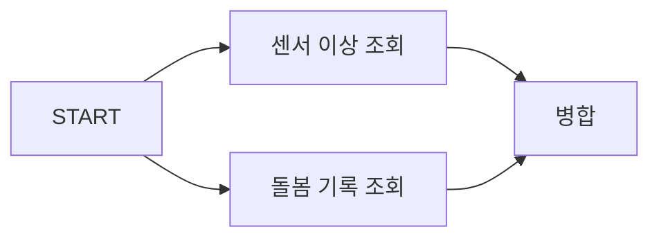

# LangGraph State와 Reducer — 그래프를 흐르는 상태 설계

> [LangChain과 LangGraph는 왜 나뉘어 있나](./langchain-vs-langgraph-boundary.md)에서 이어진다.

LangGraph를 처음 볼 때 노드와 엣지에 눈이 가지만, 실제로 설계를 좌우하는 건 **State**다.
노드는 함수라 나중에 바꾸기 쉽지만, 상태 스키마를 잘못 잡으면 그래프 전체를 다시 짜야 한다.

이 글에서 가져갈 것은 세 가지다.

- 노드는 상태 **전체**가 아니라 **바뀐 부분만** 반환한다.
- 그 부분을 기존 값과 어떻게 합칠지 정하는 게 **리듀서**다.
- 리듀서를 안 정하면 병렬 실행에서 예외가 난다. 이게 초보가 가장 먼저 만나는 벽이다.

---

## State는 그래프의 유일한 공유 메모리

노드끼리는 서로를 모른다. 오직 State를 통해서만 데이터를 주고받는다.

```python
from typing_extensions import TypedDict

class State(TypedDict):
    question: str
    documents: list[str]
    answer: str
```

Java 백엔드로 치면 **요청 스코프 컨텍스트 객체**를 하나 정의해서 모든 처리 단계가 그걸 읽고 쓰게 만드는 것이다.
세션에 아무 키나 넣다가 명시적 DTO로 바꾸는 리팩토링과 발상이 같다.

### 스키마 타입 선택

세 가지를 쓸 수 있고 트레이드오프가 다르다.

| 방식 | 장점 | 대가 |
| --- | --- | --- |
| `TypedDict` | 가장 가볍다. 공식 문서 기본값 | 런타임 검증이 없다 |
| `dataclass` | 기본값을 줄 수 있다 | 여전히 검증은 없다 |
| Pydantic `BaseModel` | 런타임 검증이 된다 | 매 노드 경계마다 검증 비용이 든다 |

노드가 많고 상태가 크면 Pydantic 검증이 매 단계 반복되므로, 입력 경계에서만 검증하고 내부는 `TypedDict`로 두는 편이 실용적이다.

---

## 노드는 부분 업데이트를 반환한다

이게 처음에 헷갈렸던 지점이다.
노드 함수는 State 전체를 받지만, **반환은 바뀐 키만** 한다.

```python
def retrieve(state: State) -> dict:
    docs = retriever.invoke(state["question"])
    return {"documents": docs}      # question, answer 는 건드리지 않는다
```

`{"documents": docs}`만 돌려주면 나머지 키는 그대로 유지된다.
JPA의 dirty checking처럼 바뀐 필드만 반영된다고 생각하면 가깝다.

그럼 `documents`에 이미 값이 있었다면 어떻게 될까. 여기서 리듀서가 필요해진다.

---

## Reducer — 기존 값과 새 값을 합치는 규칙

### 기본값은 덮어쓰기다

리듀서를 지정하지 않으면 새 값이 옛 값을 그냥 밀어낸다.

```python
# documents 에 리듀서가 없으면
이전 상태: {"documents": ["문서A"]}
노드 반환: {"documents": ["문서B"]}
결과:     {"documents": ["문서B"]}    # 문서A 는 사라진다
```

대화 메시지처럼 **쌓여야 하는 값**에는 이게 치명적이다.
매 턴마다 이전 대화가 통째로 날아간다.

### 누적하려면 리듀서를 붙인다

```python
from operator import add
from typing import Annotated
from typing_extensions import TypedDict
from langgraph.graph.message import add_messages

class State(TypedDict):
    messages: Annotated[list, add_messages]   # 메시지 전용 리듀서
    documents: Annotated[list[str], add]      # 리스트 이어붙이기
    question: str                             # 리듀서 없음 = 덮어쓰기
```

`Annotated[타입, 리듀서함수]` 형태다.
리듀서는 왼쪽 인자로 현재 값을, 오른쪽 인자로 노드가 반환한 값을 받아 합친 결과를 돌려주는 함수다.

`add_messages`는 단순 이어붙이기가 아니다.
메시지 ID를 추적해서 같은 ID면 교체하고 새 ID면 추가하며, dict 형태 입력을 LangChain 메시지 객체로 변환한다.
그래서 이미 보낸 메시지를 수정하는 것도 가능하다.

### 커스텀 리듀서

돌봄 영역별 위험도 점수처럼 **키별로 최댓값을 유지**해야 하는 값이라면 직접 만든다.

```python
def merge_max(current: dict[str, float], update: dict[str, float]) -> dict[str, float]:
    """같은 영역에 점수가 여러 번 들어오면 가장 높은 값을 남긴다."""
    merged = dict(current)
    for domain, score in update.items():
        merged[domain] = max(merged.get(domain, 0.0), score)
    return merged

class AnalysisState(TypedDict):
    risk_scores: Annotated[dict[str, float], merge_max]
```

여러 노드가 각자 다른 근거로 같은 영역 점수를 올릴 때, 가장 위험한 판정이 남는다.

---

## 리듀서를 안 정하면 병렬에서 터진다

여기가 실제 실패 모드다.

LangGraph는 의존성이 없는 노드를 **같은 단계에서 병렬 실행**한다.
Google의 Pregel에서 온 super-step 개념이다.



`센서 이상 조회`와 `돌봄 기록 조회`가 동시에 실행되고, 둘 다 `evidence` 키에 쓴다고 하자.

```python
class State(TypedDict):
    evidence: list[str]          # 리듀서 없음
```

이 상태로 돌리면 한 단계에서 같은 키에 업데이트가 두 개 들어오고, 어느 쪽을 남길지 규칙이 없어 `InvalidUpdateError`가 난다.

고치는 방법은 리듀서를 붙이는 것뿐이다.

```python
class State(TypedDict):
    evidence: Annotated[list[str], add]    # 두 결과를 이어붙인다
```

**병렬로 갈 노드가 하나라도 있으면, 그 노드들이 쓰는 키에는 반드시 리듀서를 붙인다.**
순차 그래프로 개발하다가 나중에 병렬로 바꿀 때 이 예외를 만나게 된다.

---

## 입력, 출력, 내부 상태를 나눈다

State 하나에 모든 걸 담으면 그래프를 호출하는 쪽에 내부 사정이 다 노출된다.
공개 인터페이스를 좁히려면 스키마를 나눈다.

```python
class InputState(TypedDict):
    question: str

class OutputState(TypedDict):
    answer: str

class OverallState(TypedDict):
    question: str
    documents: list[str]     # 내부 전용
    attempts: int            # 내부 전용
    answer: str

builder = StateGraph(
    OverallState,
    input_schema=InputState,
    output_schema=OutputState,
)
```

호출하는 쪽은 `question`만 넣고 `answer`만 받는다.
Spring의 컨트롤러에서 엔티티 대신 요청·응답 DTO를 쓰는 것과 같은 이유다.

한 가지 주의할 점이 있다.
**내부 전용 키도 스트리밍에는 노출된다.** `invoke()` 결과에서만 감춰진다.
민감한 값을 상태에 담을 때 이걸 보안 경계로 착각하면 안 된다.

---

## 흐름을 만드는 세 가지 도구

### 조건부 엣지 — 다음 노드를 상태로 결정

```python
from langgraph.graph import END

def should_retry(state: State) -> str:
    if state["attempts"] >= 3:
        return "generate"          # 상한에 걸리면 그냥 답한다
    if state["documents"]:
        return "generate"
    return "rewrite"               # 검색이 비었으면 질문을 고쳐 재시도

builder.add_conditional_edges("grade", should_retry)
```

반환한 문자열이 다음 노드 이름이 된다.
매핑을 명시할 수도 있다.

```python
builder.add_conditional_edges("grade", should_retry, {True: "generate", False: "rewrite"})
```

### Command — 상태 갱신과 라우팅을 한 번에

조건부 엣지를 따로 두지 않고 노드 안에서 다음 목적지까지 정하는 방식이다.

```python
from langgraph.types import Command
from typing import Literal

def grade(state: State) -> Command[Literal["generate", "rewrite"]]:
    ok = grade_documents(state["documents"], state["question"])
    return Command(
        update={"attempts": state["attempts"] + 1},
        goto="generate" if ok else "rewrite",
    )
```

분기 로직이 노드 안에 응집돼서, 판단에 쓰인 값과 분기 결과가 한자리에 모인다.
반면 그래프만 봐서는 흐름이 안 보인다는 대가가 있다.
시각화로 구조를 파악해야 하는 팀이라면 조건부 엣지 쪽이 낫다.

### Send — 개수를 모를 때 동적으로 펼친다

대상자 목록만큼 같은 분석을 돌려야 하는데, 그 수를 실행 전에 모른다면 `Send`를 쓴다.

```python
from langgraph.types import Send

def fan_out(state: OverallState):
    return [Send("analyze_one", {"persona_id": pid}) for pid in state["persona_ids"]]

builder.add_conditional_edges("load_personas", fan_out)
```

각 `Send`가 독립된 상태를 들고 같은 노드를 병렬로 실행한다.
map 단계에 해당하고, 결과를 모으는 reduce는 리듀서가 담당한다.
그래서 **`Send`를 쓰면 결과가 모이는 키에 리듀서가 반드시 필요하다.**

### recursion_limit — 무한 루프를 막는 안전장치

사이클을 허용한 대가로 무한 루프 가능성이 생긴다.

```python
graph.invoke({"question": "..."}, config={"recursion_limit": 25})
```

기본값은 1000이고, 초과하면 `GraphRecursionError`가 난다.
현재 단계는 `config["metadata"]["langgraph_step"]`으로 볼 수 있다.

주의할 점은 이게 **반복 횟수가 아니라 super-step 수**라는 것이다.
병렬 노드가 많으면 반복 한 바퀴가 여러 단계를 소모한다.
그래서 재시도 상한은 `recursion_limit`에 맡기지 말고 상태 안의 `attempts` 같은 값으로 직접 세는 편이 예측 가능하다.

---

## 상태를 크게 만들면 무엇을 잃나

checkpointer를 붙이면 **단계마다 상태 전체가 직렬화되어 저장된다.**
그래서 상태 크기가 그대로 저장 비용과 지연으로 바뀐다.

검색한 문서 원문을 통째로 상태에 담는 설계를 예로 들면 이렇게 된다.

```
문서 20개 × 평균 4KB = 80KB
노드 8개를 거치면 = 80KB × 8 = 640KB   (한 번 실행에)
대상자 1000명 × 하루 1회 = 하루 약 640MB
```

문서 본문 대신 **문서 ID와 짧은 발췌만** 상태에 두고 원문은 필요한 노드에서 다시 읽으면 이 비용이 거의 사라진다.

판단 기준은 단순하다 — **다음 노드가 실제로 쓰는 값만 상태에 넣는다.**
로그나 디버깅용으로 담고 싶은 값은 상태가 아니라 스트리밍이나 관측 도구로 빼는 게 맞다.

---

## Java와 JavaScript에서는

<details>
<summary>Java (langgraph4j) — State와 Channel</summary>

Python의 `Annotated[list, add]` 자리에 `Channels.appender(...)`가 온다.

```java
import org.bsc.langgraph4j.state.AgentState;
import org.bsc.langgraph4j.state.Channel;
import org.bsc.langgraph4j.state.Channels;

class AnalysisState extends AgentState {
    static final String EVIDENCE = "evidence";
    static final String QUESTION = "question";

    static final Map<String, Channel<?>> SCHEMA = Map.of(
        EVIDENCE, Channels.appender(ArrayList::new),   // 누적
        QUESTION, Channels.base(() -> "")              // 덮어쓰기 + 기본값
    );

    AnalysisState(Map<String, Object> initData) { super(initData); }

    List<String> evidence() {
        return this.<List<String>>value(EVIDENCE).orElse(List.of());
    }
}
```

노드는 `NodeAction<S>` 또는 비동기인 `AsyncNodeAction<S>`로 구현하고, 반환 타입은 `Map<String, Object>`다.
Python과 마찬가지로 바뀐 키만 담는다.

```java
class RetrieveNode implements NodeAction<AnalysisState> {
    public Map<String, Object> apply(AnalysisState state) {
        var docs = retriever.search(state.value(AnalysisState.QUESTION).orElse(""));
        return Map.of(AnalysisState.EVIDENCE, docs);
    }
}
```

조건부 엣지는 `EdgeAction<S>`이고, `addConditionalEdges(...)`로 붙인다.
비동기 처리는 `CompletableFuture` 기반이라 Python의 async/await 자리를 대신한다.
</details>

<details>
<summary>JavaScript (LangGraph.js) — State와 reducer</summary>

`Annotation.Root`로 정의하고, 리듀서를 필드마다 함수로 준다.

```typescript
import { Annotation, StateGraph, START, END } from "@langchain/langgraph";
import { BaseMessage } from "@langchain/core/messages";

const StateAnnotation = Annotation.Root({
  messages: Annotation<BaseMessage[]>({
    reducer: (prev, next) => prev.concat(next),   // Python 의 add_messages 자리
  }),
  question: Annotation<string>,                    // 리듀서 없음 = 덮어쓰기
  documents: Annotation<string[]>({
    reducer: (prev, next) => prev.concat(next),
    default: () => [],
  }),
});

const shouldRetry = (state: typeof StateAnnotation.State) =>
  state.documents.length > 0 ? "generate" : "rewrite";
```
</details>

---

## 다음 편

상태를 설계했으면 그다음은 그 상태를 **어디에 저장하느냐**다.
3편에서는 checkpointer와 durable execution을 다룬다.
Spring Batch의 `JobRepository`를 알고 있다면 그 구조가 거의 그대로 온다.

---

## 참고

- [Docs by LangChain — Graph API](https://docs.langchain.com/oss/python/langgraph/graph-api)
- [Docs by LangChain — Persistence](https://docs.langchain.com/oss/python/langgraph/persistence)
- [langgraph4j GitHub](https://github.com/langgraph4j/langgraph4j)
