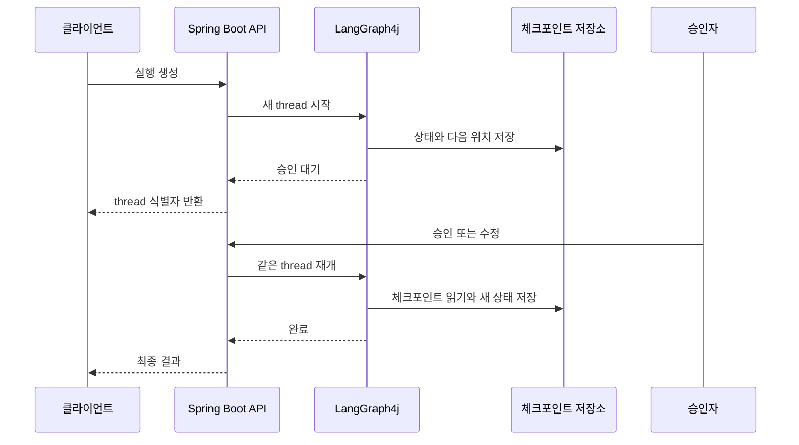
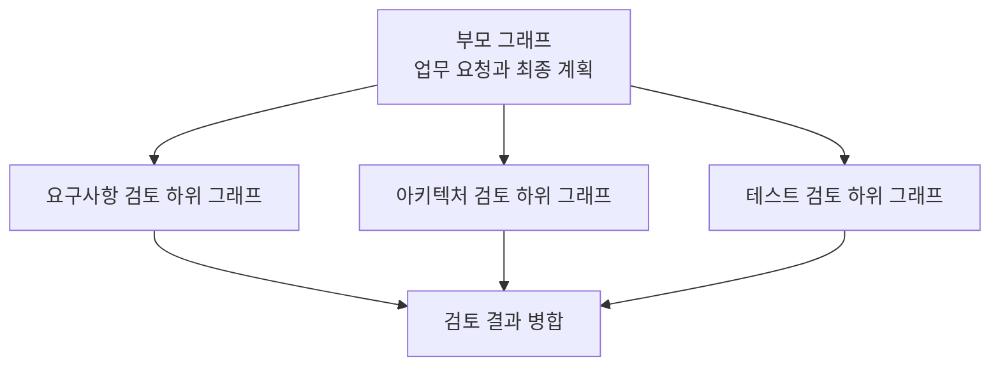

# LangGraph4j 실무 운영 — 체크포인트부터 관찰 가능성까지

> [LangGraph4j와 Spring AI 2 연동](./langgraph4j-spring-ai-llm-tools.md)에서 이어진다.
> [Checkpoint](./langgraph-checkpoint-durable-execution.md)와 [Human-in-the-Loop](./langgraph-human-in-the-loop.md)를 먼저 읽으면 재개와 승인 흐름이 더 잘 보인다.

그래프가 한 번 정상 실행됐다고 서비스 준비가 끝난 것은 아니다.
실무에서는 프로세스 재시작, 저장소 장애, 중복 승인, 모델 시간 초과와 롤링 배포를 만나도 같은 업무 의미를 유지해야 한다.

여기서 체크포인트는 단순한 상태 저장 기능이 아니다.
**장기 실행의 수명주기, 권한, 관찰 가능성과 배포 호환성을 묶는 중심축**이다.

이 글은 LangGraph4j의 고급 기능을 목록으로 설명하지 않는다.
하나의 실행이 시작해서 끝나거나 재개되는 흐름을 따라가며 어떤 설계 결정을 해야 하는지 정리한다.

---

## 운영에서는 thread가 HTTP 요청보다 오래 산다

동기 API는 요청과 응답이 끝나면 작업도 끝났다고 보기 쉽다.
사람 승인이나 긴 도구 실행이 들어간 그래프는 그렇지 않다.



이 흐름에서 HTTP 연결은 중간에 여러 번 생겼다가 사라진다.
업무 실행의 식별자는 thread이고, 사용자 식별자와도 분리해야 한다.

운영 설계는 다음 수명주기를 먼저 정하는 데서 시작한다.

- thread를 누가 만들고 접근할 수 있는가?
- 승인 대기, 실패, 완료 상태를 어떻게 구분하는가?
- 각 상태를 얼마나 오래 보존하는가?
- 어떤 사건이 재개, 취소, 만료와 삭제를 일으키는가?
- 과거 상태에서 새 분기를 만들면 원래 실행과 어떻게 구분하는가?

---

## 영속 체크포인트는 저장보다 수명주기 문제다

`MemorySaver`는 실행 의미를 익히는 데 적합하지만 프로세스가 내려가면 상태도 사라진다.
운영에서는 프로세스 밖의 저장소가 필요하다.

LangGraph4j는 PostgreSQL, MySQL, Redis 등의 saver 모듈을 제공한다.
저장소 종류보다 먼저 볼 것은 운영 계약이다.

| 기준 | 확인할 질문 |
| --- | --- |
| 일관성 | 같은 thread를 여러 인스턴스가 동시에 갱신하면 어떻게 막는가? |
| 보존 | 완료, 실패, 승인 대기 thread의 보존 기간이 같은가? |
| 삭제 | 사용자 삭제 요청과 서비스 만료 정책을 누가 실행하는가? |
| 암호화 | 저장 데이터와 키 교체 뒤 과거 상태를 어떻게 읽는가? |
| 장애 | 상태 저장이 실패했는데 외부 도구만 성공하면 어떻게 복구하는가? |
| 용량 | 상태 본문과 이력이 어느 속도로 증가하는가? |

상태 크기를 대략 계산해 보면 보존 정책이 추상적인 이야기가 아니게 된다.

예를 들어 한 체크포인트가 평균 40KB이고, 한 thread가 15번 저장되며, 하루에 10,000개 thread가 생긴다고 가정한다.

```text
40KB × 15 × 10,000 = 하루 약 6GB
```

여기에 색인, 복제, 메타데이터와 백업 비용이 더해진다.
모델 원문과 검색 문서를 상태에 계속 쌓으면 증가율은 더 커진다.

체크포인트와 장기 기억도 구분해야 한다.
체크포인트는 한 실행을 재개하기 위한 상태이고, 장기 기억은 여러 thread가 다시 사용할 지식이다.
두 데이터를 같은 보존 정책으로 관리하면 개인정보 삭제와 비용 통제가 어려워진다.

---

## 하위 그래프는 상태 소유권으로 나눈다

노드가 많다는 이유만으로 그래프를 나누면 추적 지점만 늘어난다.
하위 그래프의 경계는 **누가 어떤 상태를 소유하는가**로 정하는 편이 낫다.



부모는 자식에게 필요한 입력만 넘기고 업무 결과만 돌려받는다.
중간 프롬프트, 모델 원문과 내부 평가 점수는 자식 상태로 숨길 수 있다.

하위 그래프가 적합한 신호는 다음과 같다.

- 독립적인 상태 수명주기가 있다.
- 다른 그래프에서도 같은 흐름을 재사용한다.
- 별도 권한이나 별도 체크포인트 정책이 필요하다.
- 입력과 출력 계약을 작게 유지할 수 있다.

반대로 작은 노드 두 개를 묶기 위해 하위 그래프를 만들 필요는 없다.
부모와 자식이 같은 키를 다른 의미로 쓰면 reducer가 예상하지 못한 값을 병합할 수 있으므로 상태 이름과 변환 경계를 명시한다.

---

## 그래프 모양은 불확실성에 맞춰 고른다

모든 에이전트 시스템을 ReAct나 다중 에이전트로 만들 필요는 없다.
문제가 얼마나 결정적인지에 따라 가장 단순한 흐름부터 선택한다.

| 패턴 | 적합한 문제 | 주요 위험 |
| --- | --- | --- |
| 순차 처리 | 단계와 순서가 고정되어 있다 | 불필요한 모델 호출을 단계마다 넣기 쉽다 |
| 라우팅 | 입력 종류에 따라 경로가 달라진다 | 모델이 허용하지 않은 경로를 선택할 수 있다 |
| 병렬 처리 | 작업이 서로 독립적이다 | 상태 병합과 부분 실패 정책이 필요하다 |
| 조정자와 작업자 | 작업 수가 실행 중에 달라진다 | Java 지원 범위를 확인하지 않고 Python API를 가정하기 쉽다 |
| 평가와 개선 | 품질 기준을 통과할 때까지 고친다 | 종료 상한과 평가 편향이 필요하다 |
| ReAct | 도구 선택이 관찰 결과에 따라 달라진다 | 비용과 반복이 상한 없이 늘 수 있다 |

Python LangGraph의 `Send` 예제를 LangGraph4j에 그대로 옮긴다고 가정하면 안 된다.
현재 고정한 Java 버전의 병렬 분기와 제공 모듈이 어떤 실행 계약을 지원하는지 먼저 확인한다.
[병렬 상태 병합과 reducer의 전제](./langgraph-state-and-reducer.md)도 함께 확인한다.

### 에이전트를 나누는 기준

프롬프트가 다르다는 이유만으로 새 에이전트를 만들면 상태와 비용만 늘어난다.
다음 중 하나가 달라질 때 분리를 검토한다.

- 접근할 수 있는 도구와 권한
- 소유하는 비공개 상태
- 실패와 재시도 정책
- 별도 평가 기준
- 독립적으로 재사용할 실행 계약

에이전트 간 인계 결과는 자유 문자열보다 완료, 실패, 추가 정보 요청 같은 구조화 상태로 표현한다.
두 에이전트가 서로 계속 인계하지 않도록 그래프 차원의 반복 제한도 둔다.

---

## 재시도는 예외 처리보다 실행 의미의 문제다

재시도할 수 있는 예외인지 판단하는 것만으로는 부족하다.
앞선 시도에서 외부 세계가 이미 바뀌었는지 알아야 한다.

| 실패 | 기본 전략 | 재시도 전 확인 |
| --- | --- | --- |
| 모델 시간 초과 | 제한된 횟수로 다시 호출 | 공급자 내부 재시도와 중첩되는가? |
| 잘못된 구조화 출력 | 검증 오류를 넣어 다시 생성 | 같은 입력으로 나아질 가능성이 있는가? |
| 인증과 권한 오류 | 즉시 종료 | 사람이 고쳐야 하는 설정인가? |
| 읽기 도구의 일시 오류 | 시간 간격을 두고 재시도 | 결과가 오래돼도 괜찮은가? |
| 쓰기 도구 결과 불명 | 성공 여부 조회 후 결정 | 멱등 키로 중복 실행을 막는가? |
| 체크포인트 저장 실패 | 외부 부수 효과와 함께 복구 | 상태와 외부 결과가 갈라졌는가? |

노드 내부 재시도와 그래프 재시도가 겹치면 실제 호출 횟수가 곱으로 늘어난다.

```text
모델 내부 3회 × 노드 재시도 2회 × 그래프 재실행 2회 = 최대 12회
```

재시도 횟수만 남기지 말고 실패 종류와 마지막 성공 단계도 상태 또는 관측 정보로 남긴다.
쓰기 도구에는 thread, 노드와 업무 식별자를 조합한 멱등 키를 사용하고, 외부에서 성공 여부를 다시 조회할 수 있어야 한다.

---

## 잘 돌았는지와 좋은 답인지 따로 측정한다

관찰 가능성과 평가는 같은 문제가 아니다.
하나는 실행이 어떻게 흘렀는지 보고, 다른 하나는 결과가 쓸 만한지 판단한다.

| 층 | 측정하는 것 | 대표 질문 |
| --- | --- | --- |
| 시스템 | 지연, 오류, 저장소 상태 | 어디에서 느려지거나 실패했는가? |
| 그래프 | 노드 경로, 반복, 중단, 재개 | 어떤 상태 전이가 일어났는가? |
| 품질 | 정확성, 근거, 안전성, 비용 | 성공한 결과가 실제로 좋은가? |

thread 식별자와 실행 식별자를 로그, trace와 지표의 상관관계 키로 사용한다.
사용자 원문, 프롬프트, 도구 인자와 모델 응답은 기본 관측 속성에서 제외한다.

노드별로 다음 값을 우선 측정한다.

- p50과 p95 지연
- 오류율과 실패 종류
- 반복 횟수와 재시도 횟수
- 모델 호출 수와 토큰 사용량
- 승인 대기 시간
- 부분 결과 사용 횟수

평가는 코드 규칙과 모델 평가를 나눈다.
필수 필드, 최대 단계 수, 금지 도구 사용처럼 결정적인 조건은 코드로 검사한다.
문장 명료성이나 근거 충실도처럼 규칙으로 표현하기 어려운 항목만 모델 평가기를 보조 수단으로 사용한다.

모델 평가기 하나의 점수를 진실로 취급하면 편향과 재현성 문제가 묻힌다.
고정된 입력 묶음, 기대 속성, 사람 검토 표본을 함께 유지한다.

---

## Spring Boot API는 상태 전체를 노출하지 않는다

API 요청 DTO와 내부 `AgentState`를 같은 타입으로 쓰면 외부 계약과 체크포인트 스키마가 함께 움직인다.
외부에는 업무에 필요한 투영값만 보여준다.

| 행동 | 응답 예시 | 권한과 멱등성 |
| --- | --- | --- |
| 실행 생성 | 새 thread 식별자와 현재 상태 | 동일 요청의 중복 생성 방지 |
| 상태 조회 | 공개 가능한 단계와 결과 | thread 소유권 검사 |
| 승인 또는 수정 | 새 실행 상태 | 승인자 권한과 중복 승인 검사 |
| 취소 | 취소 요청 접수 상태 | 이미 완료된 실행 처리 |
| 사건 구독 | SSE 진행 사건 | 재연결과 중복 사건 처리 |

SSE 연결과 그래프 실행의 수명도 분리한다.
클라이언트가 끊겼다고 승인 대기 thread를 즉시 지워서는 안 된다.

SSE 사건에는 다음 값을 둘지 결정한다.

- 사건 식별자
- thread와 실행 식별자
- 순서 번호
- 사건 종류
- 공개 가능한 작은 payload
- 발생 시각

재연결 시 과거 사건을 다시 보내거나 현재 상태를 새로 조회하는 방식 중 하나를 계약으로 정한다.
서버 인스턴스 메모리에 구독 정보와 그래프 상태를 모두 두면 재배포와 부하 분산에 약해진다.

---

## 모델의 제안은 권한이 아니다

도구 호출과 RAG가 들어가면 프롬프트 주입, 과도한 권한, 민감 정보 노출과 비용 증가를 함께 다뤄야 한다.

| 위험 | 코드에서 강제할 통제 |
| --- | --- |
| 허용하지 않은 도구 | 도구 허용 목록과 역할 검사 |
| 프롬프트 주입 | 검색 문서를 지시가 아닌 데이터로 취급 |
| 과도한 데이터 접근 | 사용자와 조직 범위로 조회 제한 |
| 쓰기 작업 오용 | 사람 승인과 멱등 키 적용 |
| 민감 정보 관측 | 상태 키 분류와 로그 제외 |
| 비용 증가 | 호출, 토큰, 시간과 도구 사용 예산 |

각 상태 키를 공개, 내부, 민감, 비밀로 분류한다.
승인 화면과 상태 조회 API는 공개 가능한 키만 투영한다.

한 실행의 예산도 상태와 정책으로 다룬다.

- 최대 모델 호출 수
- 최대 입력과 출력 토큰
- 최대 전체 실행 시간
- 최대 도구 호출 수
- 최대 반복과 재시도 횟수

예산을 넘었을 때 단순 예외로 끝낼지, 부분 결과를 반환할지, 사람 승인으로 넘길지 그래프 경로로 정한다.

---

## 새 코드는 과거 체크포인트를 만나게 된다

상태를 저장하면 배포가 단순한 코드 교체가 아니게 된다.
신버전 코드는 구버전이 남긴 상태와 다음 실행 위치를 읽어야 한다.

| 변경 | 위험 | 완화 방법 |
| --- | --- | --- |
| 상태 키 이름 변경 | 접근자가 빈 값을 읽을 수 있다 | 읽기 호환 접근자 또는 마이그레이션 |
| 값 자료형 변경 | 역직렬화와 형변환이 실패한다 | 명시적인 스키마 버전과 변환기 |
| reducer 변경 | 과거 상태 병합 의미가 달라진다 | 구버전과 신버전 의미 비교 |
| 노드 이름 삭제 | 중단된 실행의 다음 위치를 찾지 못한다 | 이전 노드 별칭 또는 종료 정책 |
| 하위 그래프 경계 변경 | 부모와 자식 checkpoint 경로가 달라진다 | 표본 thread 재개 검증 |
| 직렬화기 변경 | 저장된 Map과 객체를 읽지 못할 수 있다 | 실제 과거 표본으로 호환성 검증 |

LangGraph4j `1.8.24`에서도 메시지 직렬화 형식이 바뀐 사례가 있다.
패치 버전처럼 보여도 checkpoint의 저장 형식이 달라질 수 있으므로 변경 기록과 실제 과거 표본을 함께 확인해야 한다.

상태에 `schemaVersion`을 둘지 저장소 메타데이터로 관리할지는 팀이 선택할 수 있다.
중요한 것은 현재 코드가 어떤 과거 상태를 읽을 수 있는지 식별하는 것이다.

배포 전에는 과거 체크포인트 표본을 새 코드로 읽고 재개하는 검증이 필요하다.
롤링 배포에서는 구버전과 신버전이 같은 저장소에 동시에 쓰는 기간도 고려한다.
되돌리기 뒤 구버전이 신버전 상태를 읽을 수 있는지도 확인한다.

호환되지 않는 오래된 thread를 무조건 살리려 하면 코드가 계속 복잡해질 수 있다.
보존 기간과 사용자 안내를 전제로 안전하게 종료하는 정책도 필요하다.

---

## 직접 따라가는 운영 실습 순서

학습 설명의 원문은 이 글이다.
[LangGraph4j in Action 저장소](https://github.com/jon890/langgraph4j-in-action)에서는 아래 순서에 맞춰 코드와 테스트를 추가한다.

### 영속 saver로 바꾼다

**개념 확인**

저장소는 그래프 구현 세부 사항이 아니라 실행 수명주기의 기반이다.

**직접 작성**

1. `MemorySaver`와 운영 saver가 같은 경계에서 교체되게 한다.
2. thread와 checkpoint의 예상 크기와 증가율을 계산한다.
3. 실행 상태별 보존 기간을 정한다.
4. 저장소 장애 때 새 실행과 재개를 어떻게 처리할지 적는다.

**일부러 실패시키기**

노드의 외부 쓰기는 성공하고 checkpoint 저장은 실패하게 만든다.
재개 요청이 왔을 때 중복 실행을 어떻게 막을지 확인한다.

### 하위 그래프로 상태를 격리한다

**개념 확인**

하위 그래프의 경계는 코드 파일 수보다 상태 소유권으로 결정한다.

**직접 작성**

1. 부모가 넘길 입력과 돌려받을 출력을 다섯 개 이하로 제한한다.
2. 자식 내부에서만 쓸 상태 키를 표시한다.
3. 부모와 자식 사이의 변환 노드를 둔다.
4. 분리 전후 최종 결과가 같다는 불변 조건을 정한다.

**일부러 실패시키기**

부모와 자식이 같은 키를 다른 의미로 사용하게 만든다.
어느 reducer에서 예상과 다른 병합이 일어나는지 관찰한다.

### 워크플로와 ReAct 경계를 선택한다

**개념 확인**

결정적인 단계는 코드가 흐름을 정하고, 불확실한 선택만 모델에 맡긴다.

**직접 작성**

1. 현재 흐름의 각 구간에 순차, 라우팅, 병렬, 평가와 개선 중 하나를 붙인다.
2. 각 패턴을 선택한 이유와 제거할 수 있는 더 단순한 대안을 적는다.
3. ReAct 반복의 도구, 종료 조건과 호출 예산을 정한다.
4. 에이전트를 나눌 경우 권한과 비공개 상태를 구분한다.

**일부러 실패시키기**

두 에이전트가 서로에게 계속 인계하도록 만든다.
모델 판단과 무관하게 그래프가 종료시킬 상한을 확인한다.

### 실패를 분류하고 멱등성을 넣는다

**개념 확인**

재시도 가능 여부는 예외 타입뿐 아니라 앞선 부수 효과의 성공 여부에 달려 있다.

**직접 작성**

1. 노드별 시간 제한, 최대 시도와 대체 경로를 표로 만든다.
2. 쓰기 도구의 멱등 키를 설계한다.
3. 병렬 노드 하나가 실패했을 때 부분 결과 사용 기준을 정한다.
4. 모델과 그래프의 실제 최대 호출 횟수를 계산한다.

**일부러 실패시키기**

노드 내부와 그래프 양쪽에 재시도를 넣는다.
관측된 실제 호출 횟수가 계산과 맞는지 확인한다.

### 관찰 가능성과 평가를 연결한다

**개념 확인**

실행 성공과 품질 성공은 다른 지표다.

**직접 작성**

1. thread와 실행 식별자를 상관관계 키로 정한다.
2. 노드별 지연, 오류, 반복과 비용 지표를 정한다.
3. 수집하지 않을 민감 상태 키를 먼저 목록으로 만든다.
4. 코드 불변 조건과 모델 평가 항목을 분리한다.

**일부러 실패시키기**

정상 종료하지만 근거가 없는 결과를 넣는다.
시스템 지표는 성공이고 품질 평가는 실패가 되는지 확인한다.

### API와 SSE에 실행을 투영한다

**개념 확인**

외부 API는 내부 상태의 복사본이 아니라 제한된 투영이다.

**직접 작성**

1. 실행 생성, 조회, 승인, 취소와 사건 구독 계약을 나눈다.
2. API DTO와 `AgentState`를 분리한다.
3. SSE 재연결과 중복 사건 처리 정책을 정한다.
4. thread 접근 권한을 사용자 인증과 별도로 검사한다.

**일부러 실패시키기**

SSE 연결을 끊었다가 다시 연결한다.
새 thread가 생기지 않고 기존 실행의 현재 상태를 볼 수 있는지 확인한다.

### 보안, 비용과 스키마 변경을 배포 절차에 넣는다

**개념 확인**

모델 제안은 권한이 아니며, 새 코드는 과거 체크포인트를 읽어야 한다.

**직접 작성**

1. 상태 키와 도구 권한을 분류한다.
2. 실행별 시간, 호출과 토큰 예산을 둔다.
3. 상태 스키마 버전과 변환 위치를 정한다.
4. 과거 checkpoint 표본을 새 코드로 읽는 검증을 만든다.

**일부러 실패시키기**

상태 키와 노드 이름을 바꾼 신버전을 띄운다.
구버전에서 중단된 thread가 어디에서 깨지는지 확인한 뒤 호환 정책을 정한다.

---

## 배포 전 점검표

마지막에는 기능 목록보다 다음 질문에 답할 수 있어야 한다.

### 상태와 흐름

- 상태 키마다 자료형, 기본값, reducer와 소유 노드가 정해져 있는가?
- 모든 반복에 업무 종료 조건과 실행 상한이 있는가?
- 병렬 노드가 같은 가변 객체를 직접 수정하지 않는가?

### 모델과 도구

- 모델 공급자 타입이 상태에 노출되지 않는가?
- 구조화 출력의 구문, 스키마와 업무 의미를 나눠 검증하는가?
- 쓰기 도구에 멱등 키나 성공 여부 조회 수단이 있는가?
- 모델과 그래프 재시도가 겹친 최대 호출 수를 계산했는가?

### 체크포인트와 승인

- 운영 환경이 프로세스 밖의 saver를 사용하는가?
- 보존, 만료, 삭제와 개인정보 처리 책임이 정해져 있는가?
- 승인자 인증과 thread 접근 권한을 별도로 확인하는가?
- 승인 화면에서 내부 프롬프트와 비밀값을 제외하는가?

### 관찰 가능성과 API

- thread, 실행, 노드와 외부 호출을 연결해 추적할 수 있는가?
- 실행 성공과 품질 성공을 별도 지표로 보는가?
- HTTP 요청과 그래프 실행의 수명주기가 분리되어 있는가?
- SSE 재연결과 중복 사건 처리 방식이 정해져 있는가?

### 배포 호환성

- 저장된 상태의 스키마 버전을 식별할 수 있는가?
- 과거 체크포인트 표본을 새 코드로 읽고 재개해 봤는가?
- 롤링 배포와 되돌리기에서 양방향 읽기 호환성을 확인했는가?

이 질문에 답하지 못하는 부분이 있으면 운영 기능을 더 붙이기 전에 해당 실행 의미부터 작은 실험으로 고정하는 편이 낫다.

---

## 참고

- [LangGraph4j — Checkpoint Saver modules](https://github.com/langgraph4j/langgraph4j)
- [LangGraph4j — Subgraphs](https://langgraph4j.github.io/langgraph4j/main/core/subgraph/)
- [LangGraph4j — Parallel Branch](https://langgraph4j.github.io/langgraph4j/main/core/parallel-branch/)
- [LangGraph4j — Agent Executor](https://langgraph4j.github.io/langgraph4j/main/how-tos/agentexecutor/)
- [LangGraph4j — Multi-agent Supervisor](https://langgraph4j.github.io/langgraph4j/main/how-tos/multi-agent-supervisor/)
- [LangGraph4j — Streaming](https://langgraph4j.github.io/langgraph4j/main/core/streaming/)
- [LangGraph4j — Cancellation](https://langgraph4j.github.io/langgraph4j/main/core/cancellation/)
- [LangGraph4j — OpenTelemetry module](https://github.com/langgraph4j/langgraph4j/tree/main/langgraph4j-opentelemetry)
- [Spring AI — Observability](https://docs.spring.io/spring-ai/reference/observability/index.html)
- [Spring AI — Evaluation Testing](https://docs.spring.io/spring-ai/reference/api/testing.html)
- [Spring Framework — 비동기 요청 처리](https://docs.spring.io/spring-framework/reference/web/webmvc/mvc-ann-async.html)
- [LangGraph — Durable Execution](https://docs.langchain.com/oss/python/langgraph/durable-execution)
- [LangGraph — Workflows and Agents](https://docs.langchain.com/oss/python/langgraph/workflows-agents)
