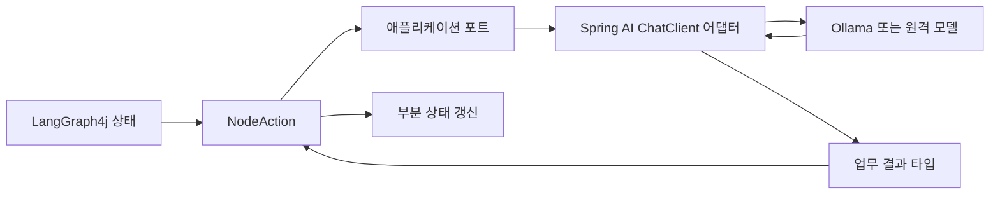
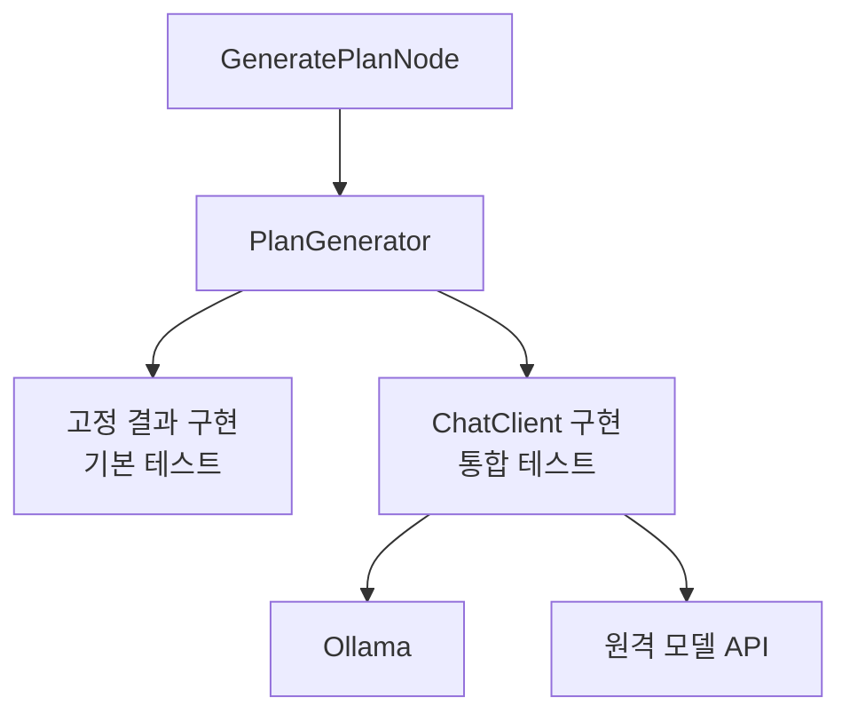
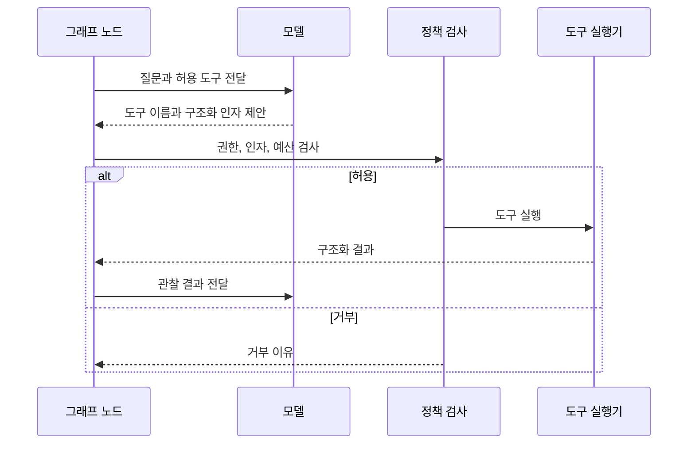

# LangGraph4j와 Spring AI 2 연동 — 모델, 구조화 출력, 도구 호출의 경계

> [langgraph4j 실전](./langgraph4j-in-spring-boot.md)에서 이어진다.
> 이 글은 그래프 구조를 익힌 뒤 실제 LLM을 연결하는 순서를 다룬다.

LangGraph4j와 Spring AI를 같이 쓰면 역할이 겹쳐 보인다.
둘 다 에이전트와 도구 호출을 이야기하기 때문이다.

하지만 실무에서 두 라이브러리를 한 덩어리로 다루면 모델 교체, 테스트, 재시도 정책이 모두 그래프 안으로 새어 들어간다.
내가 잡은 기준은 단순하다.

**LangGraph4j는 실행 상태와 경로를 소유하고, Spring AI는 모델과 도구 호출의 변동성을 감싼다.**

이 글은 그 경계를 직접 코드로 확인하도록 구성했다.
완성 코드를 복사하기보다 개념을 먼저 이해하고, 작은 인터페이스부터 직접 작성하는 흐름을 따른다.

---

## 두 라이브러리의 책임을 먼저 나눈다

LLM 호출은 그래프의 한 노드 안에서 일어난다.
그렇다고 모델이 다음 노드나 전체 상태 구조까지 결정하게 두면 안 된다.



각 층이 소유하는 것은 다음과 같다.

| 층 | 소유하는 것 | 소유하지 않는 것 |
| --- | --- | --- |
| LangGraph4j | 상태, 노드, 분기, 반복, 체크포인트 | 공급자별 응답 객체와 API 키 |
| 애플리케이션 포트 | 모델 입력과 업무 결과의 계약 | `ChatClient` 설정과 공급자 예외 |
| Spring AI | 프롬프트 조립, 모델 호출, 구조화 변환, 도구 연결 | 그래프의 다음 노드와 업무 종료 조건 |
| 모델 공급자 | 토큰 생성과 도구 호출 제안 | 실제 도구 실행 권한과 업무 정책 |

이 구분은 추상화를 위한 추상화가 아니다.
그래프 테스트에서 실제 모델을 떼어내고, 모델 공급자를 바꿔도 체크포인트 상태를 유지하기 위한 최소 경계다.

---

## 모델의 변동성을 포트 뒤에 숨긴다

같은 프롬프트도 모델, 온도, 공급자 상태에 따라 결과가 달라진다.
이 변동성이 라우팅까지 퍼지면 실패가 상태 설계 때문인지 모델 응답 때문인지 구분하기 어렵다.

먼저 모델에 넘길 입력과 돌려받을 결과만 가진 작은 Java 인터페이스를 그린다.
인터페이스는 공급자 SDK 타입을 노출하지 않는다.

```java
interface PlanGenerator {
    PlanResult generate(PlanRequest request);
}
```

이 코드는 구현 정답이 아니라 경계를 확인하기 위한 최소 모양이다.
직접 작성할 때는 다음 질문부터 답한다.

- 모델을 바꿔도 유지되어야 하는 입력은 무엇인가?
- 자유 문자열 대신 어떤 업무 결과 타입을 돌려받아야 하는가?
- 모델 거부, 일시 오류, 잘못된 출력은 같은 실패인가?
- 노드가 알아야 할 오류와 어댑터 안에서 끝낼 오류는 무엇인가?

그다음 고정된 결과를 돌려주는 구현과 항상 실패하는 구현을 만든다.
이 둘만 있으면 모델 없이도 다음 항목을 검증할 수 있다.

- 노드가 올바른 입력을 포트에 전달하는가?
- 결과를 상태 전체가 아니라 부분 갱신으로 반환하는가?
- 실패 종류에 따라 조건부 엣지가 다른 경로를 고르는가?
- 반복 상한에 도달하면 모델을 더 호출하지 않는가?

가짜 구현이 고정해야 하는 것은 자연스러운 문장이 아니다.
그래프가 판단에 사용하는 **의미 있는 결과 타입**이다.

---

## ChatClient는 포트의 구현체가 된다

Spring AI의 `ChatClient`는 프롬프트 작성, advisor 적용, 모델 호출과 응답 변환을 한 흐름으로 묶는다.
그래프 노드가 `ChatClient`를 직접 알게 하기보다 앞에서 만든 포트의 어댑터가 사용하도록 둔다.



이 구조에서는 모델 연결 방식이 바뀌어도 노드와 상태 스키마가 달라지지 않는다.
공급자별 응답 타입을 상태에 넣지 않는 것이 중요하다.
그 타입을 넣는 순간 모델 교체가 과거 체크포인트의 스키마 변경으로 번진다.

### 로컬 모델과 무료 등급 API를 나눈다

처음 연동할 때는 Ollama가 가장 예측 가능하다.
호출마다 원격 비용이 들지 않고 API 키도 필요하지 않기 때문이다.
다만 모델 파일을 자동으로 내려받는 작업을 애플리케이션 시작과 묶으면 배포 시간이 예측하기 어려워진다.

원격 모델의 무료 등급은 품질을 비교하거나 도구 호출 호환성을 확인할 때만 선택한다.
무료 제공량과 데이터 처리 정책은 바뀔 수 있으므로 코드에 공급자 이름이나 한도를 박지 않는다.

다음 값은 환경 설정으로 분리한다.

- 모델 공급자와 모델 이름
- API 기본 주소
- API 키
- 연결 시간과 응답 시간 제한
- 최대 토큰과 호출 예산

회사 코드, 개인정보, 비밀값은 무료 API 실습 데이터로 보내지 않는다.
무료라는 말은 데이터 공개 범위까지 안전하다는 뜻이 아니다.

---

## 구조화 출력은 변환 뒤에도 검증해야 한다

모델이 JSON을 반환했다고 해서 상태 계약을 만족한 것은 아니다.
구조화 출력은 세 단계를 통과해야 한다.

| 단계 | 확인하는 것 | 대표 실패 |
| --- | --- | --- |
| 구문 | JSON이나 대상 형식으로 읽을 수 있는가 | 코드 펜스, 잘린 JSON, 잘못된 자료형 |
| 스키마 | 필수 필드와 자료형이 맞는가 | 누락 필드, 알 수 없는 값, 잘못된 열거형 |
| 업무 의미 | 실제 업무에 쓸 수 있는가 | 빈 단계 목록, 중복 단계, 허용 범위를 벗어난 위험도 |

Spring AI의 구조화 출력 변환은 앞의 두 단계에 도움을 준다.
공식 문서도 이 변환을 완전한 보장보다 최선의 변환으로 설명한다.
마지막 업무 검증은 애플리케이션이 맡아야 한다.

`ChatClient`의 타입 변환 경로와 토큰 스트리밍도 같은 방식으로 사용할 수 있다고 가정하면 안 된다.
스트리밍 중에는 완성된 객체가 아직 없으므로 토큰 수신과 최종 객체 검증을 분리한다.

예를 들어 계획 결과가 정상 JSON이어도 단계 목록이 비어 있으면 그래프는 다음 노드로 가면 안 된다.
이 실패를 단순 파싱 오류와 같은 코드로 표현하면 재시도 프롬프트와 운영 지표가 흐려진다.

상태에는 원문 전체보다 다음 정보를 우선해 남긴다.

- 변환된 업무 결과
- 검증 실패 코드
- 재시도 가능 여부
- 필요하면 원문을 찾을 수 있는 제한된 참조값

모델 원문을 로그와 체크포인트에 무조건 보관하면 개인정보와 프롬프트가 새로운 유출 지점이 된다.

---

## 모델은 도구를 요청하고 애플리케이션이 실행한다

도구 호출에서 모델이 하는 일은 실행 요청을 만드는 것까지다.
실제 실행 여부는 코드가 결정한다.



첫 도구는 파일 수정이나 결제처럼 되돌리기 어려운 기능보다 고정된 카탈로그 조회처럼 읽기 전용으로 잡는 편이 좋다.
도구마다 다음 계약을 먼저 적는다.

- 이름과 설명
- 입력 스키마
- 허용 역할과 데이터 범위
- 읽기 또는 쓰기 여부
- 시간 제한과 결과 크기 제한
- 중복 실행을 막을 멱등 키

### 도구 반복을 어디에 둘지 선택한다

Spring AI 내부에서 도구 호출 반복을 끝낼 수도 있고, LangGraph4j의 명시적인 노드와 엣지로 펼칠 수도 있다.

| 선택 | 적합한 상황 | 주의할 점 |
| --- | --- | --- |
| Spring AI 내부 반복 | 짧고 닫힌 읽기 작업이며 중간 상태를 저장할 필요가 없다 | 반복 횟수와 실패 경로가 그래프 밖에 숨을 수 있다 |
| LangGraph4j 명시적 반복 | 사람 승인, 체크포인트, 도구별 권한, 세밀한 재시도가 필요하다 | 노드와 상태 키가 늘어난다 |

도구 실행이 업무 상태를 바꾸거나 재개 뒤 중복 실행될 수 있다면 그래프에 드러내는 편이 안전하다.
[노드가 재개할 때 처음부터 다시 실행되는 규칙](./langgraph-checkpoint-durable-execution.md)을 먼저 확인해야 멱등성이 필요한 이유가 선명해진다.
모델이 허용 목록에 없는 도구 이름을 만들었을 때는 실행 전에 거부한다.

---

## 토큰 스트림과 상태 전이 스트림을 구분한다

Spring AI 모델이 보내는 토큰과 LangGraph4j가 보내는 상태 변화는 같은 스트림이 아니다.

| 구분 | 단위 | 완료가 뜻하는 것 |
| --- | --- | --- |
| 모델 토큰 스트림 | 생성 중인 텍스트 조각 | 모델 응답 생성이 끝났다 |
| 그래프 상태 스트림 | 노드 출력과 상태 변화 | 한 노드 또는 전체 실행이 끝났다 |

토큰을 화면에 보여준 뒤 노드가 실패할 수 있다.
이때 사용자가 본 문장과 체크포인트에 저장된 상태가 달라진다.
따라서 진행 사건은 최소한 다음처럼 구분한다.

- 실행 시작
- 노드 시작
- 모델 토큰
- 노드 완료
- 승인 대기
- 실패
- 실행 종료

병렬 노드의 사건 순서는 매번 같지 않을 수 있다.
화면에서 안정적으로 정렬하려면 thread 식별자 외에 실행 식별자와 순서 번호가 필요한지 결정해야 한다.
클라이언트가 느리다고 버퍼를 무한히 늘려서도 안 된다.

---

## 직접 따라가는 구현 순서

이제부터는 [LangGraph4j in Action 저장소](https://github.com/jon890/langgraph4j-in-action)를 코드 작업 공간으로 사용한다.
학습 설명의 원문은 이 글이고, 저장소에는 운영 코드와 검증 상태만 남긴다.

### 모델 경계를 먼저 만든다

**개념 확인**

그래프는 모델의 문장을 소유하지 않는다.
그래프가 필요한 것은 다음 경로를 판단할 수 있는 업무 결과다.

**직접 작성**

1. 요청과 결과 타입을 정한다.
2. 작은 모델 포트를 만든다.
3. 고정 성공, 거부, 일시 오류를 돌려주는 구현을 만든다.
4. 노드가 포트만 의존하도록 연결한다.

**일부러 실패시키기**

모델 결과에 다음 노드 이름을 넣어 본다.
왜 제어권이 모델로 새어 나가는지 상태와 엣지 관점에서 설명한다.

### ChatClient 어댑터를 붙인다

**개념 확인**

노드와 모델 공급자 사이에는 애플리케이션 계약이 있다.
`ChatClient`는 그 계약의 구현 세부 사항이다.

**직접 작성**

1. 그래프 밖에서 `ChatClient` 한 번 호출하는 설정을 만든다.
2. 시스템 지침과 사용자 입력의 출처를 분리한다.
3. 모델 포트의 실제 구현이 `ChatClient`를 사용하게 한다.
4. Ollama와 원격 공급자를 설정으로 교체할 수 있게 한다.

**일부러 실패시키기**

실제 모델 빈이 없는 환경에서도 애플리케이션의 기본 테스트가 동작하는지 확인한다.
실패한다면 모델 연결이 그래프의 필수 시작 조건으로 새어 나온 것이다.

### 구조화 결과를 상태 계약으로 바꾼다

**개념 확인**

파싱 성공과 업무 성공은 다르다.
재시도 정책도 두 실패를 구분해야 한다.

**직접 작성**

1. 계획 제목, 단계, 위험과 가정을 가진 작은 결과 타입을 만든다.
2. 반드시 있어야 할 필드와 누락 가능한 필드를 나눈다.
3. 파싱 실패와 업무 검증 실패를 다른 상태로 표현한다.
4. 재시도 노드는 검증 오류를 입력으로 사용한다.

**일부러 실패시키기**

정상 JSON이지만 단계 목록이 빈 응답을 넣는다.
왜 구조화 변환만 통과시키면 안 되는지 확인한다.

### 읽기 전용 도구를 연결한다

**개념 확인**

모델의 도구 선택은 요청이다.
권한 검사를 통과한 실행만 실제 부수 효과가 된다.

**직접 작성**

1. 읽기 전용 도구 하나의 입력 스키마를 만든다.
2. 도구 요청과 실행 결과를 다른 상태 키로 나눈다.
3. 허용하지 않은 도구와 잘못된 인자의 경로를 만든다.
4. 반복 상한과 호출 예산을 둔다.

**일부러 실패시키기**

같은 쓰기 도구 요청을 재개 뒤 다시 전달해 본다.
멱등 키가 없다면 외부 결과가 두 번 생길 수 있음을 설명한다.

### 두 스트림을 하나의 API 사건으로 투영한다

**개념 확인**

토큰은 임시 진행 정보이고, 체크포인트 상태는 재개 가능한 실행 정보다.
둘을 똑같이 영속화할 필요는 없다.

**직접 작성**

1. 사용자 화면에 필요한 사건 종류를 정의한다.
2. 각 사건의 thread, 실행과 순서 식별자를 정한다.
3. 클라이언트 연결 종료가 어디까지 취소를 전파할지 결정한다.
4. 재연결 시 중복 사건 처리 정책을 적는다.

**일부러 실패시키기**

토큰 일부를 보낸 뒤 노드가 실패하도록 만든다.
화면에 보인 출력과 최종 상태를 어떤 문구로 구분할지 결정한다.

---

## 테스트는 경계별로 나눈다

모든 테스트가 실제 모델을 호출하면 느리고 결과가 흔들리며 비용도 생긴다.
검증 범위를 세 층으로 나누는 편이 낫다.

| 범위 | 모델 | 확인하는 것 |
| --- | --- | --- |
| 기본 테스트 | 고정 결과 구현 | 상태 병합, 분기, 반복 상한, 실패 경로 |
| 로컬 통합 | Ollama | 프롬프트와 구조화 변환의 실제 호환성 |
| 원격 통합 | 선택한 API | 공급자별 도구 호출과 품질 차이 |

원격 통합은 API 키가 있을 때만 실행하고 합성 데이터만 사용한다.
모델 품질 평가는 한 번의 문장 비교보다 고정 입력 묶음과 기대 속성으로 관리한다.

---

## 언제 이 구조를 줄여도 되나

한 번 호출하고 끝나는 동기 기능이며 공급자 교체도 계획하지 않는다면 포트와 그래프가 모두 필요하지 않을 수 있다.
평범한 서비스에서 `ChatClient`를 직접 호출하는 편이 더 단순하다.

반대로 다음 조건이 하나라도 있으면 경계를 먼저 두는 편이 낫다.

- 모델 실패에 따라 다른 경로로 가야 한다.
- 도구 호출에 승인이나 권한 검사가 필요하다.
- 중간 상태를 저장하고 재개해야 한다.
- 모델 공급자를 바꾸면서 기존 thread를 유지해야 한다.
- 실제 모델 없이 그래프 전체를 검증해야 한다.

다음 글에서는 이 구조를 운영 환경으로 가져간다.
영속 체크포인트, 하위 그래프, 재시도, 관찰 가능성, SSE와 상태 스키마 변경을 하나의 실행 수명주기로 연결한다.

---

## 참고

- [Spring AI — ChatClient API](https://docs.spring.io/spring-ai/reference/api/chatclient.html)
- [Spring AI — Structured Output Converter](https://docs.spring.io/spring-ai/reference/api/structured-output-converter.html)
- [Spring AI — Tool Calling](https://docs.spring.io/spring-ai/reference/api/tools.html)
- [Spring AI — Ollama Chat](https://docs.spring.io/spring-ai/reference/api/chat/ollama-chat.html)
- [LangGraph4j — Getting Started](https://langgraph4j.github.io/langgraph4j/main/getting-started/)
- [LangGraph4j — Streaming](https://langgraph4j.github.io/langgraph4j/main/core/streaming/)
- [LangGraph4j — Cancellation](https://langgraph4j.github.io/langgraph4j/main/core/cancellation/)
- [LangGraph4j — Agent Executor](https://langgraph4j.github.io/langgraph4j/main/how-tos/agentexecutor/)
