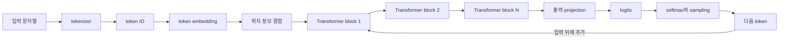
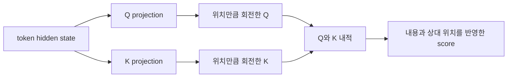
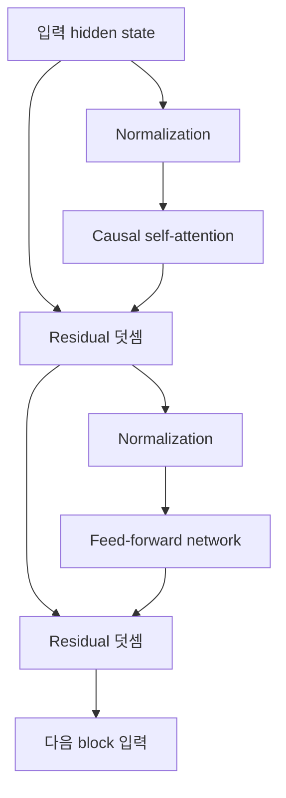
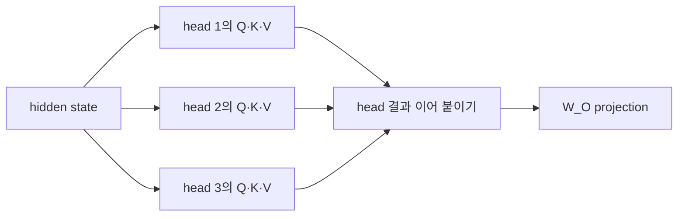
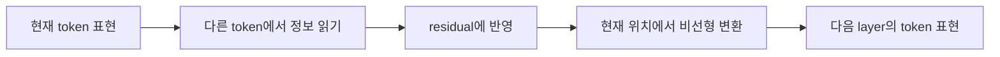
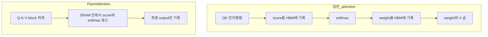
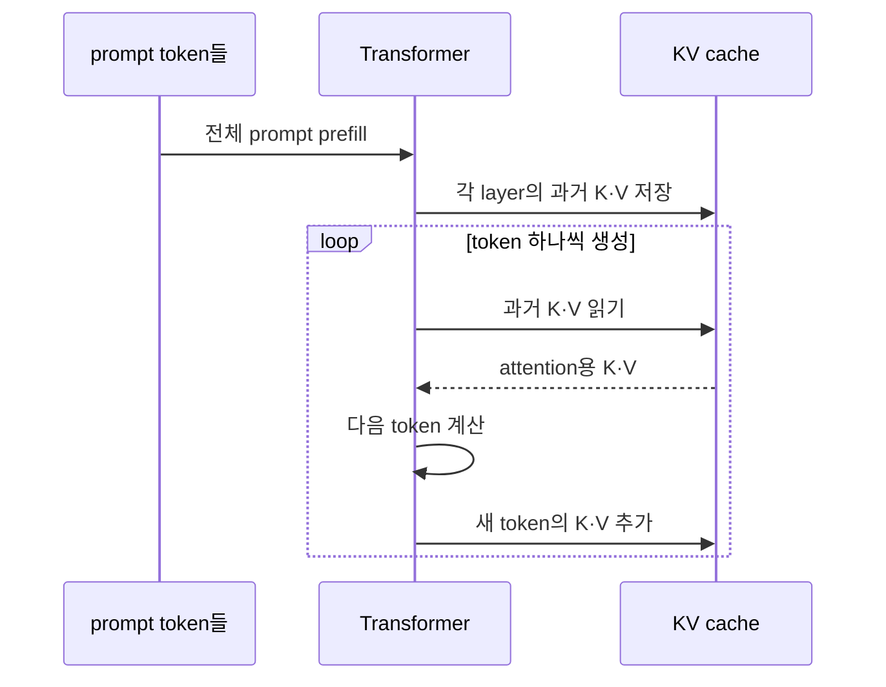
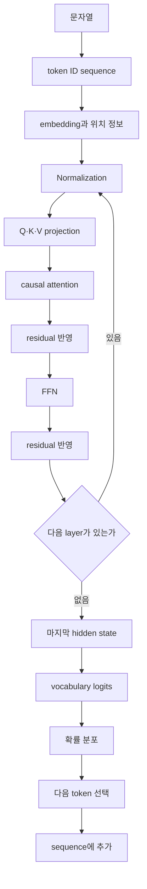

# Transformer는 입력을 어떻게 다음 토큰 확률로 바꾸는가

LLM은 문장을 통째로 이해한 뒤 답을 꺼내는 하나의 거대한 함수처럼 보인다.
실제로는 입력을 작은 **토큰**(token)으로 나누고, 각 토큰을 숫자 벡터로 바꾼 뒤, Transformer 블록을 여러 번 통과시켜 **다음 토큰의 확률 분포**를 계산한다.

이 글의 목표는 그 계산을 생략 없이 따라가는 것이다.
벡터와 행렬부터 시작해 Q·K·V, **causal mask**(인과 마스크), **multi-head attention**(다중 헤드 어텐션), FFN, **residual connection**(잔차 연결), 위치 표현, **logit**(로짓), KV cache까지 연결한다.

수식을 외우는 것이 목표는 아니다.
각 수식이 어떤 정보를 만들고 다음 단계가 그 정보를 왜 필요로 하는지를 이해하는 것이 목표다.

이 글은 다음 질문에 답한다.

- token 하나가 어떻게 수천 차원의 벡터가 되는가.
- Q·K·V는 왜 나누며 attention은 실제로 무엇을 계산하는가.
- attention 외에 FFN, residual connection, normalization은 왜 필요한가.
- 원 논문의 encoder-decoder와 현대 decoder-only LLM은 무엇이 다른가.
- KV cache, GQA, FlashAttention은 모델의 의미와 서빙 비용을 어떻게 바꾸는가.

## 먼저 구분해야 할 네 종류의 값

LLM 설명에서 서로 다른 값이 모두 memory나 representation이라는 말로 뭉뚱그려지곤 한다.
아래 네 가지를 먼저 분리하면 뒤의 구조가 훨씬 선명해진다.

| 구분 | 무엇인가 | 언제 바뀌는가 | 예시 |
| --- | --- | --- | --- |
| 토큰(token) | 문자열을 어휘 집합의 정수 ID로 바꾼 값 | 입력 문장이 바뀔 때 | `314`, `9821` |
| 파라미터(parameter) | 학습으로 얻은 모델의 고정 숫자 | 학습하거나 미세 조정할 때 | 임베딩 테이블, `W_Q`, `W_K` |
| 활성값(activation) | 특정 입력을 계산하며 생긴 중간 숫자 | 요청마다, 계층마다 | 은닉 상태, 어텐션 출력 |
| KV cache | 이전 토큰의 K와 V 활성값을 저장한 추론용 캐시 | 토큰을 생성할 때마다 증가 | 각 계층의 과거 K·V |

모델 파일에 들어 있는 수십억 개의 parameter와 한 요청의 대화 내용은 같은 것이 아니다.
대화 내용은 token으로 들어오고, 계산 도중 activation으로 바뀐다.
KV cache는 그 activation 일부를 다시 계산하지 않도록 잠시 보관한다.

## 전체 흐름부터 본다

현대의 text LLM은 대체로 다음 경로를 거친다.



한 번의 forward pass가 문장 전체를 완성하지는 않는다.
현재 입력 다음에 올 token 하나의 점수를 계산한다.
선택된 token을 입력 뒤에 붙이고 같은 과정을 반복해야 문장이 길어진다.

## 수학을 읽기 위한 최소 어휘

### scalar, vector, 행렬, tensor

**scalar**(스칼라)는 숫자 하나다.
온도 `0.7`이나 확률 `0.42`가 scalar다.

**vector**(벡터)는 순서가 있는 숫자 목록이다.

```text
[0.2, -1.1, 0.7, 0.3]
```

네 숫자로 이뤄졌으므로 4차원 vector라고 부른다.
여기서 차원은 사람이 생각하는 공간 차원이 아니라 숫자 칸의 개수다.

행렬은 vector를 여러 줄 쌓은 표다.
token이 3개이고 token마다 4차원 vector를 가진다면 shape는 `[3, 4]`다.

```text
token 0: [ 0.2, -1.1,  0.7,  0.3]
token 1: [ 0.5,  0.4, -0.2,  0.8]
token 2: [-0.1,  0.6,  0.9, -0.5]
```

**tensor**(텐서)는 행렬보다 축이 더 많아질 수 있는 숫자 묶음의 일반 이름이다.
batch, token, head, dimension 축을 함께 가지면 4차원 tensor가 된다.

### shape는 자료형만큼 중요하다

Transformer 구현을 읽을 때 변수 이름보다 shape를 먼저 보면 좋다.

```text
X: [batch, sequence, d_model]
Q: [batch, heads, sequence, d_head]
attention score: [batch, heads, sequence, sequence]
```

각 축은 다음 질문에 답한다.

- `batch`: 한 번에 몇 입력을 처리하는가.
- `sequence`: 입력마다 token이 몇 개인가.
- `d_model`: token 하나를 숫자 몇 개로 표현하는가.
- `heads`: 서로 다른 attention 관점을 몇 개 병렬로 계산하는가.
- `d_head`: head 하나가 쓰는 vector 크기는 얼마인가.

### dot product는 두 vector의 맞물림을 한 숫자로 줄인다

두 vector의 같은 위치끼리 곱한 뒤 모두 더하면 **dot product**(내적)가 된다.

```text
[1, 2] · [3, 4] = 1×3과 2×4의 합 = 11
```

방향이 비슷한 vector는 큰 양수가 되고, 반대면 음수가 되며, 관련이 적으면 0에 가까워질 수 있다.
attention은 이 성질을 이용해 현재 token이 다른 token과 얼마나 맞는지를 점수로 만든다.

단, 학습된 고차원 vector의 각 칸을 사람이 독립된 의미 하나로 해석할 수 있다는 뜻은 아니다.
의미는 많은 차원과 layer에 분산되어 있다.

## 문자열은 먼저 token이 된다

모델은 문자열을 바로 받지 않는다.
**tokenizer**(토큰 분할기)가 문자열을 vocabulary에 있는 단위로 나누고 각 단위를 정수 ID로 바꾼다.

token은 항상 단어나 글자 하나와 일치하지 않는다.
자주 나오는 문자열은 한 token이 될 수 있고, 드문 단어나 긴 식별자는 여러 token으로 쪼개질 수 있다.
공백이나 구두점도 token 경계에 영향을 준다.

```text
문자열: Transformer가 문맥을 읽는다
token:  [Transformer] [가] [ 문맥] [을] [ 읽] [는다]
ID:     [ ... tokenizer마다 서로 다른 정수 ... ]
```

위 분리는 개념 예시다.
실제 결과는 모델의 tokenizer와 vocabulary에 따라 달라진다.

tokenizer가 중요한 이유는 세 가지다.

- 모델이 보는 sequence length는 글자 수가 아니라 token 수다.
- 같은 문장도 tokenizer에 따라 계산량과 context 점유량이 달라진다.
- 모델의 최종 출력도 token 단위 확률이므로 드문 문자열과 긴 숫자는 생성 난도가 달라질 수 있다.

Llama 3 논문은 128,000개 token vocabulary를 사용하며, tokenizer의 압축률 개선이 같은 학습 compute로 더 많은 글을 읽게 한다고 설명한다.
tokenizer는 단순한 전처리 도구가 아니라 모델의 비용과 표현 단위를 정하는 일부다.

## token ID는 embedding vector가 된다

token ID 자체는 번호표일 뿐이다.
ID `100`이 ID `200`보다 의미상 절반이라는 관계는 없다.

모델은 학습 가능한 **embedding table**에서 ID에 해당하는 행을 찾는다.
vocabulary 크기가 `V`, model dimension이 `d_model`이면 table의 shape는 `[V, d_model]`이다.

```text
token ID 314
    ↓ embedding table의 314번째 행 조회
[0.07, -0.41, 0.18, ...]  # d_model개 숫자
```

초기에는 이 숫자들이 거의 무작위다.
학습 중 다음 token을 더 잘 예측하는 방향으로 embedding을 포함한 모든 parameter가 조금씩 바뀐다.
비슷한 문맥에서 비슷한 역할을 하는 token은 계산에 유용한 관계를 갖도록 자리 잡는다.

embedding은 token의 고정된 사전 뜻만 담지 않는다.
첫 layer에 들어가기 전의 출발 표현일 뿐이다.
같은 token도 주변 문맥을 attention과 FFN으로 반복 처리한 뒤에는 서로 다른 hidden state가 된다.

## 순서를 알려주지 않으면 단어 묶음만 남는다

self-attention 계산만 놓고 보면 token 순서를 자동으로 알 수 없다.
같은 vector 집합의 행을 함께 섞으면 결과도 같은 방식으로 섞일 뿐이다.
그래서 위치 정보를 별도로 넣어야 한다.

원 논문은 sine과 cosine을 여러 주기로 계산한 **sinusoidal positional encoding**을 token embedding에 더했다.
각 위치는 서로 다른 파동 조합을 가지므로 모델이 순서와 상대 거리를 활용할 단서를 얻는다.

현대 LLM에서 흔한 **RoPE**(Rotary Position Embedding)는 위치 벡터를 임베딩에 단순히 더하지 않는다.
Q와 K의 차원을 두 개씩 묶어 작은 2차원 평면으로 보고, 토큰 위치에 비례한 각도로 회전한다.

한 차원 쌍이 사용하는 기본 각도를 `θ`라고 하자.
위치 `m`의 Q는 `mθ`만큼, 위치 `n`의 K는 `nθ`만큼 회전한다.
두 벡터를 내적하면 다음 성질이 생긴다.

```text
회전한 Q(m)와 회전한 K(n)의 내적
= 원래 Q와, (n - m)만큼 상대 회전한 K의 내적
```

두 토큰을 문장 안에서 똑같이 다섯 칸 뒤로 옮겨도 `n - m`은 변하지 않는다.
따라서 어텐션 점수는 절대 위치만 외우기보다 두 토큰 사이의 상대 거리를 사용할 수 있다.
실제 RoPE는 차원 쌍마다 서로 다른 회전 주파수를 사용한다.
어떤 쌍은 가까운 거리 변화에 빠르게 반응하고, 다른 쌍은 더 긴 범위의 위치 차이를 표현한다.

일반적인 RoPE 구현은 Q와 K를 회전하지만 V는 회전하지 않는다.
위치는 `어디서 읽을지`를 정하는 Q·K 점수에 반영하고, 선택한 뒤 전달할 내용인 V는 그대로 두는 구조다.



이 성질만으로 RoPE가 긴 컨텍스트를 무조건 정확하게 만드는 것은 아니다.
지원 길이를 늘리려면 위치 표현뿐 아니라 긴 sequence를 실제로 학습하는 과정과 평가가 필요하다.
Llama 3도 기본 pre-training 뒤에 context 길이를 단계적으로 늘리는 continued pre-training을 별도로 수행했다.

## Transformer block의 두 핵심 연산

decoder-only LLM의 block은 구현마다 조금 다르지만 중심은 두 연산이다.

- self-attention: token 사이에서 정보를 섞는다.
- FFN: 각 token 위치의 표현을 비선형적으로 변환한다.

둘 주변에는 residual connection과 normalization이 있다.



이 구조를 수십 번 또는 백 번 넘게 쌓는다.
Llama 3 논문의 예를 들면 8B 모델은 32개 layer, 405B 모델은 126개 layer를 사용한다.

## Q·K·V는 같은 입력을 세 역할로 투영한 값이다

Q·K·V는 원래 서로 다른 세 종류의 token이 아니다.
같은 hidden state `X`에 서로 다른 학습 parameter를 곱해 만든 세 표현이다.

```text
Q = X × W_Q
K = X × W_K
V = X × W_V
```

역할을 말로 풀면 다음과 같다.

| 값 | 풀어서 말하면 | attention에서 하는 일 |
| --- | --- | --- |
| Q, Query | 현재 위치가 찾고 있는 정보의 표현 | 모든 K와 비교해 score를 만든다 |
| K, Key | 각 위치가 자신을 찾을 때 쓸 단서의 표현 | Q와 얼마나 맞는지 평가받는다 |
| V, Value | 선택됐을 때 전달할 내용의 표현 | attention weight만큼 합쳐진다 |

검색에 비유하면 Q는 검색어, K는 색인용 표현, V는 가져올 본문에 가깝다.
하지만 정확히 일치하는 key 하나를 찾는 database 조회는 아니다.
모든 후보에 연속적인 weight를 주고 V를 섞으며, Q·K·V의 의미도 layer와 head마다 학습으로 달라진다.

왜 K와 V를 나눌까.
찾기 좋은 특징과 전달하기 좋은 내용을 같은 vector 하나에 강제할 필요가 없기 때문이다.
어떤 token은 문법 관계로 쉽게 선택되어야 하지만, 선택된 뒤에는 의미 정보나 위치 정보를 다른 형태로 전달해야 할 수 있다.

## scaled dot-product attention을 한 줄씩 계산한다

원 논문의 핵심 수식은 다음과 같다.

```text
Attention(Q, K, V) = softmax(QKᵀ / √d_k) V
```

짧지만 네 단계가 들어 있다.

### Q와 모든 K를 비교한다

`QKᵀ`는 각 query와 각 key의 dot product를 한꺼번에 계산한다.
sequence에 token이 `n`개 있으면 score 행렬의 shape는 `[n, n]`이다.

```text
행: 정보를 찾는 query 위치
열: 후보 key 위치
값: 두 위치의 맞물림 score
```

한 token이 다른 모든 token을 볼 수 있다는 말은 이 `n × n` 비교에서 나온다.

### 왜 `√d_k`로 나눌까

Q와 K의 차원이 커질수록 dot product의 절댓값도 커지는 경향이 있다.
너무 큰 값이 softmax에 들어가면 확률이 한두 곳에 지나치게 몰리고 gradient가 매우 작아질 수 있다.

원 논문은 Q와 K 성분의 평균이 0이고 분산이 1이라고 가정하면 dot product의 분산이 `d_k`가 된다고 설명한다.
표준편차 규모인 `√d_k`로 나누면 score 크기를 다루기 쉬운 범위로 되돌릴 수 있다.

### causal mask로 미래를 가린다

생성 모델은 현재 위치에서 미래 정답을 보면 안 된다.
그래서 허용하지 않는 score를 softmax 전에 매우 작은 값, 수학적으로는 음의 무한대로 바꾼다.

```text
        key 위치
        0    1    2    3
query 0  O    X    X    X
      1  O    O    X    X
      2  O    O    O    X
      3  O    O    O    O
```

`O`는 볼 수 있고 `X`는 가려진다.
이 삼각형 구조가 **causal attention**(인과적 attention)이다.

학습할 때 정답 문장 전체를 GPU에 올려도 각 위치는 자신의 오른쪽 token을 볼 수 없다.
그러면서 모든 위치의 다음-token 예측을 병렬로 계산할 수 있다.

### softmax로 score를 weight로 바꾼다

softmax는 score를 0과 1 사이 값으로 바꾸며 한 행의 합을 1로 만든다.

```text
score:  [2.0, 1.0, -1.0]
weight: [0.71, 0.26, 0.03]  # 반올림한 예시
```

score 차이를 지수 함수로 벌리기 때문에 높은 score에 더 강하게 집중한다.
그래도 일반적인 attention은 한 후보만 고르는 hard lookup이 아니다.
여러 V를 weight만큼 섞는다.

### weight로 V를 가중합한다

마지막의 `... V`가 실제 정보 전달 단계다.
각 key 위치의 V에 attention weight를 곱한 뒤 모두 더한다.

작은 숫자로 직접 계산해보자.
query 하나와 key 세 개가 있고 `d_k=2`라고 하자.

```text
Q  = [1, 0]
K1 = [1, 0]
K2 = [0, 1]
K3 = [1, 1]
```

dot product는 `[1, 0, 1]`이다.
이를 `√2`로 나누고 softmax를 적용하면 weight는 대략 `[0.40, 0.20, 0.40]`이 된다.

V가 다음과 같다면,

```text
V1 = [10, 0]
V2 = [0, 10]
V3 = [6, 6]
```

출력은 다음 가중합이다.

```text
0.40×V1과 0.20×V2와 0.40×V3의 합 ≈ [6.4, 4.4]
```

attention은 K를 반환하지 않는다.
Q와 K는 어디에서 읽을지 정하고, 실제 출력에는 V가 섞여 들어간다.

## self-attention이라는 이름의 뜻

Q·K·V가 모두 같은 sequence의 hidden state에서 만들어지면 self-attention이다.
자기 자신을 포함한 같은 입력 안의 token끼리 관계를 계산하기 때문이다.

원 논문의 Transformer에는 세 종류가 있었다.

| 종류 | Q의 출처 | K·V의 출처 | 용도 |
| --- | --- | --- | --- |
| encoder self-attention | encoder 이전 layer | 같은 encoder 이전 layer | 입력 전체를 양방향으로 읽는다 |
| decoder masked self-attention | decoder 이전 layer | 같은 decoder 이전 layer | 과거 output만 읽는다 |
| encoder-decoder cross-attention | decoder | encoder output | 번역 원문에서 필요한 부분을 읽는다 |

현대의 순수 text decoder-only LLM은 encoder와 cross-attention을 제거하고 causal self-attention block만 쌓는 경우가 많다.
prompt와 답변을 하나의 긴 token sequence로 보고, 답변 token이 앞쪽 prompt token을 attention으로 읽는다.

## multi-head attention은 여러 투영 공간을 병렬로 둔다

attention을 한 번만 계산하면 여러 관계가 하나의 weighted average에 섞인다.
**multi-head attention**은 Q·K·V projection을 여러 벌 두고 서로 다른 낮은 차원 공간에서 attention을 병렬 계산한다.



각 head의 역할을 사람이 미리 지정하지 않는다.
학습 결과 어떤 head는 가까운 문법 관계에 민감하고, 다른 head는 멀리 있는 반복 구조나 특정 token 패턴에 민감해질 수 있다.

원 논문은 `d_model=512`, head 8개, head dimension 64를 사용했다.
각 head의 결과를 이어 붙이면 다시 512차원이 되고, `W_O`로 한 번 더 projection해 다음 계산에 전달한다.

attention head를 곧바로 인간이 읽을 수 있는 reasoning 단계로 보면 안 된다.
head는 계산 경로의 일부이며, 최종 행동은 여러 head와 FFN, residual stream, 모든 layer가 함께 만든 결과다.

## attention은 token 사이를 섞고 FFN은 각 위치를 변환한다

attention만 강조하면 Transformer의 절반을 놓친다.
각 block에는 **FFN**(Feed-Forward Network)이 있다.

원 논문의 FFN은 각 token 위치에 같은 두 linear transformation을 적용한다.

```text
h = ReLU(xW₁ + b₁)
FFN(x) = hW₂ + b₂
```

입력과 출력은 `d_model=512`였지만 중간 차원 `d_ff`는 2048이었다.
좁은 vector를 넓은 공간으로 펼쳐 비선형 변환한 뒤 다시 원래 크기로 줄인다.

attention과 FFN의 책임을 비교하면 다음과 같다.

| 연산 | token 위치 사이 정보 이동 | 각 위치에 비선형 변환 | 주된 역할 |
| --- | --- | --- | --- |
| self-attention | 한다 | 제한적 | 문맥에서 무엇을 가져올지 정한다 |
| FFN | 하지 않는다 | 한다 | 가져온 정보를 현재 위치에서 새 특징으로 바꾼다 |

현대 모델은 ReLU 대신 **gated activation**(조절형 활성화 함수)을 흔히 쓴다.
Llama 3는 그중 **SwiGLU**를 사용한다.

```text
gate = SiLU(xW_gate)
value = xW_up
SwiGLU(x) = (gate와 value의 원소별 곱)W_down
```

`SiLU(z)`는 `z × sigmoid(z)`다.
`sigmoid`는 큰 음수를 0에 가깝게, 큰 양수를 1에 가깝게 바꾸는 함수다.
따라서 `gate`는 각 중간 특징을 얼마나 통과시킬지 정하고, `value`는 실제로 전달할 후보 특징을 만든다.
두 경로를 원소별로 곱한 뒤 원래 모델 차원으로 줄인다.

ReLU가 음수인지 양수인지에 따라 한 경로를 단순히 자르는 방식이라면, SwiGLU는 학습된 두 경로가 서로를 조절한다.
세부 함수는 달라져도 넓은 중간 공간에서 토큰별 표현을 변환한 뒤 다시 `d_model`로 돌아온다는 큰 구조는 같다.

FFN에 지식이 저장된다고 단순화한 설명도 있지만, 사실을 한 component에만 배정하면 곤란하다.
모델의 동작은 embedding, attention, FFN, normalization과 layer 전체 parameter에 분산된다.

## residual connection은 정보를 지우지 않고 수정하게 한다

sub-layer 출력만 다음으로 넘기면 layer가 깊어질수록 이전 표현을 계속 새 값으로 덮어쓴다.
**residual connection**(잔차 연결)은 sub-layer가 만든 변화량을 기존 값에 더한다.

```text
output = x와 Sublayer(x)의 합
```

이 구조는 두 가지 직관을 준다.

- 필요 없는 layer는 작은 변화만 더하며 이전 정보를 보존할 수 있다.
- gradient가 깊은 layer를 지나 학습될 경로를 확보한다.

여러 layer가 공통 `d_model` 크기를 유지하는 이유도 residual 덧셈과 관련이 있다.
shape가 같아야 두 값을 같은 위치끼리 더할 수 있다.

연구자들은 token별 hidden state가 residual 경로를 따라 흐르고 각 attention과 FFN이 그 값에 결과를 보탠다고 설명하기도 한다.
이 관점은 유용하지만 residual stream의 각 차원이 고정된 인간 개념 하나를 담는다고 받아들이면 안 된다.

## normalization은 숫자 규모를 안정시킨다

layer가 깊어지면 activation 크기가 흔들리고 학습이 불안정해질 수 있다.
normalization은 vector의 통계를 이용해 숫자 규모를 다루기 쉬운 범위로 맞춘다.

원 논문은 하위 계층 계산과 잔차 덧셈 뒤에 LayerNorm을 적용하는 **post-norm** 구조였다.
GPT-2는 정규화를 각 하위 블록 입력 쪽으로 옮긴 **pre-norm** 구조를 사용했다.

차이는 잔차 경로를 따라가는 신호와 gradient가 정규화를 반드시 통과하는지에 있다.
pre-norm에서는 `x`가 잔차 경로로 다음 계층까지 직접 이어지고, 정규화된 값만 하위 계층으로 들어간다.
깊은 모델에서 gradient가 지나갈 비교적 단순한 경로가 생겨 학습 안정성에 유리하다.
다만 pre-norm이 모든 조건에서 항상 더 좋은 최종 품질을 보장하는 것은 아니며, 초기화와 학습률 같은 조건도 함께 영향을 준다.

현대 LLM에서 흔한 RMSNorm은 평균을 빼는 re-centering을 생략하고 root mean square로 크기를 정규화한다.

```text
RMS(x) = sqrt(mean(x²) + ε)
RMSNorm(x) = x / RMS(x) × 학습 가능한 scale
```

`ε`은 0으로 나누거나 아주 작은 값 때문에 수치가 불안정해지는 일을 막는 작은 상수다.
LayerNorm이 평균을 빼고 분산으로 나누는 것과 달리 RMSNorm은 평균을 빼지 않고 벡터의 전체 크기만 맞춘다.

RMSNorm 논문은 LayerNorm의 re-scaling 성질을 보존하면서 계산을 단순화하려는 방법으로 제안했다.
다만 특정 kernel 구현과 hardware에서는 단순한 수식이 항상 더 빠른 실제 처리 시간으로 이어지는 것은 아니다.

## block을 반복하면 문맥화된 hidden state가 만들어진다

첫 embedding은 token ID에 따른 출발점이다.
각 layer에서 다음 과정이 반복된다.



아래쪽 layer는 가까운 형태와 위치 관계를 다루고, 위쪽 layer는 더 복합적인 문맥 정보를 만들 수 있다.
그러나 모든 모델에 똑같이 적용되는 고정된 layer별 업무표가 있는 것은 아니다.

중요한 점은 같은 단어가 문맥에 따라 달라지는 이유다.
같은 token ID는 같은 embedding에서 시작하지만, 주변 token에서 읽어 온 V와 layer별 변환이 달라져 마지막 hidden state는 달라진다.

## 마지막 hidden state는 vocabulary 전체의 logits가 된다

마지막 Transformer layer를 지난 뒤에도 출력은 token 문자열이 아니다.
각 위치마다 `d_model`차원의 hidden state가 있다.

생성 시에는 현재 sequence의 마지막 위치 hidden state를 vocabulary 크기로 projection한다.

```text
hidden state: [d_model]
output weight: [d_model, vocabulary]
logits: [vocabulary]
```

**logit**은 정규화 전 점수다.
확률이 아니므로 음수일 수도 있고 합이 1일 필요도 없다.
softmax를 적용하면 vocabulary의 각 token이 다음에 올 확률 분포가 된다.

```text
token A logit: 8.2  → probability 0.61
token B logit: 7.7  → probability 0.37
token C logit: 4.1  → probability 0.01
...
```

이 분포에서 token 하나를 고른다.
가장 높은 token을 고르는 greedy decoding을 쓸 수도 있고, temperature와 top-k 또는 top-p를 적용해 sampling할 수도 있다.

어떤 방식을 쓰더라도 모델 core가 내놓는 것은 **후보 token별 점수**다.
사실 여부, 출처 존재 여부, 프로그램 실행 성공 여부가 별도 필드로 함께 나오는 구조가 아니다.

이 지점이 [다음 토큰 예측은 왜 환각과 긴 컨텍스트 실패로 이어지는가](./why-llms-hallucinate-and-lose-context.md)의 출발점이다.

## 원 논문의 Transformer와 현대 LLM은 같지 않다

`Attention Is All You Need`는 2017년 기계 번역용 encoder-decoder 모델을 제안한 논문이다.
오늘날 대화형 LLM을 그대로 설명한 설계 문서는 아니다.

원 논문의 base model은 다음 구성이었다.

- encoder layer 6개와 decoder layer 6개
- `d_model=512`
- attention head 8개
- FFN 중간 차원 2048
- sinusoidal positional encoding
- post-norm LayerNorm
- encoder-decoder cross-attention

Transformer 계열은 학습 목표와 mask, component 선택에 따라 세 갈래로 나뉜다.

| 계열 | attention 범위 | 대표적 학습 목표 | 잘 맞는 용도 |
| --- | --- | --- | --- |
| encoder-only | 입력의 왼쪽과 오른쪽을 모두 본다 | 가린 token 복원 | 분류, 추출, embedding |
| decoder-only | 각 위치가 왼쪽 과거만 본다 | 다음 token 예측 | 자유로운 text 생성 |
| encoder-decoder | encoder는 양방향, decoder는 causal | source에서 target 생성 | 번역, 변환, 조건부 생성 |

BERT는 encoder-only Transformer를 사용해 양쪽 문맥으로 가린 token을 예측했다.
GPT 계열과 Llama 계열은 decoder-only 구조로 다음 token을 예측한다.
둘 다 Transformer지만 mask와 학습 목표가 다르므로 사용 방식도 달라진다.

## Llama 3로 보는 원 논문 이후의 구조 변경

여기서는 현대 모델 전체를 나열하지 않고 Llama 3를 한 가지 구체적인 예로 삼는다.
원 논문의 뼈대를 유지하면서 운영 효율과 학습 안정성을 위해 무엇이 달라졌는지 보는 것이 목적이다.

| 축 | 원 Transformer | 현대 Llama 계열의 예 | 바뀐 이유 |
| --- | --- | --- | --- |
| 전체 구조 | encoder-decoder | decoder-only | next-token 생성에 집중 |
| 위치 정보 | sinusoidal 값을 embedding에 더함 | Q·K에 RoPE 적용 | 상대 위치를 attention score에 반영 |
| normalization 위치 | post-norm | pre-norm 계열 | 깊은 모델 학습 안정성 |
| normalization 종류 | LayerNorm | RMSNorm 계열 | 구조 단순화와 학습 특성 |
| FFN activation | ReLU | SwiGLU | model 품질과 compute trade-off |
| attention | MHA | GQA | decode 시 KV cache와 memory bandwidth 절감 |
| kernel | 일반 행렬 연산 | FlashAttention 계열 | 같은 attention을 적은 memory 이동으로 계산 |

이 중 RoPE, GQA, FlashAttention을 모두 attention의 새로운 의미로 묶으면 안 된다.

- RoPE는 위치 정보를 Q·K 비교에 넣는 방식이다.
- GQA는 query head보다 K·V head 수를 줄여 추론 자원을 아낀다.
- FlashAttention은 같은 exact attention 결과를 memory 이동이 적은 순서로 계산한다.

모델이 무엇을 계산하는지와 hardware에서 어떻게 효율적으로 계산하는지를 구분해야 한다.

## 왜 attention 비용은 context 길이의 제곱으로 커질까

token이 `n`개이면 각 query가 최대 `n`개의 key와 비교된다.
따라서 attention score 수는 `n²`에 비례한다.

원 논문은 self-attention layer의 시간 복잡도를 `O(n²d)`로 제시했다.
RNN처럼 token 위치를 순서대로 거쳐야 하는 단계 수는 줄였지만 긴 sequence에서는 모든 위치 쌍 비교가 비싸진다.

예를 들어 token 4096개가 있으면 head 하나의 score는 약 1,678만 개다.
이를 FP16으로 단순히 저장하면 약 32MiB다.
head 32개의 score를 모두 materialize하면 layer 하나에서만 약 1GiB가 된다.

실제 최신 kernel은 이런 중간 행렬을 그대로 모두 저장하지 않도록 최적화한다.
그래도 `n²`개의 관계를 다루는 compute 자체가 긴 context의 중요한 비용이라는 사실은 남는다.

## FlashAttention은 attention을 근사하지 않고 계산 순서를 바꾼다

일반 구현은 `QKᵀ`, softmax 결과, 최종 output을 단계별로 GPU HBM에 쓰고 다시 읽을 수 있다.
GPU 연산이 빨라도 큰 중간 행렬을 memory 사이에서 옮기는 시간이 병목이 된다.

FlashAttention은 Q·K·V를 block으로 나눠 빠른 on-chip SRAM에서 계산하고, online softmax를 이용해 전체 score 행렬을 HBM에 저장하지 않는다.
backward pass에서는 일부 중간값을 저장하는 대신 다시 계산하는 선택도 한다.

**online softmax**(온라인 소프트맥스)는 key 블록을 하나씩 읽으면서도 전체를 한 번에 계산한 것과 같은 결과를 만드는 방법이다.
각 query 행마다 지금까지 본 score의 최댓값 `m`, 지수 합 `l`, V의 가중합을 보관한다.
더 큰 최댓값을 가진 다음 블록이 들어오면 이전 지수 합과 가중합을 새 기준에 맞게 다시 축척한 뒤 새 블록 값을 더한다.
마지막에 가중합을 `l`로 나누면 전체 score 행렬에 softmax를 적용한 결과와 같다.

핵심은 일부 key만 보고 성급하게 확률을 확정하지 않는다는 점이다.
아직 읽지 않은 블록에서 더 큰 score가 나올 수 있으므로, 이전 계산을 새 최댓값 기준으로 보정하면서 진행한다.
이 덕분에 근사가 아니라 같은 수학 결과를 유지하면서 거대한 중간 행렬의 HBM 저장을 피할 수 있다.



FlashAttention 논문의 핵심은 **IO-aware**(memory 입출력 인식) 계산이다.
정확한 attention 수식을 바꾸지 않으면서 HBM 접근을 줄인다.

따라서 FlashAttention을 쓰면 모델이 더 사실적으로 답한다거나 attention 의미가 달라진다고 말할 수 없다.
같은 모델 계산을 더 빠르고 적은 memory로 수행하는 구현 최적화다.

## 생성은 prefill과 decode 두 단계로 나뉜다

LLM 추론을 한 덩어리로 보면 latency와 memory를 이해하기 어렵다.

### prefill

prompt의 모든 token을 한 번에 처리한다.
각 layer에서 prompt token들의 K와 V를 계산해 KV cache에 저장한다.
긴 prompt일수록 병렬 행렬 연산과 attention compute가 커진다.

### decode

새 token을 한 개씩 생성한다.
새 token의 Q·K·V를 계산하고, 그 Q를 KV cache에 저장된 모든 과거 K와 비교한다.
새 K·V는 cache 끝에 추가한다.



prefill은 많은 token을 병렬 처리해 compute 사용률이 높다.
decode는 매 단계 새 query 하나가 긴 KV cache를 읽으므로 memory bandwidth와 요청 batching의 영향을 크게 받는다.

## KV cache는 무엇을 재사용하는가

causal model에서 과거 token의 K와 V는 이후 token을 생성해도 바뀌지 않는다.
미래 token이 과거 hidden state로 거꾸로 들어갈 수 없기 때문이다.

cache가 없다면 token을 하나 생성할 때마다 prompt 처음부터 모든 과거 token의 K와 V를 다시 계산해야 한다.
KV cache는 각 layer에서 이미 계산한 과거 K·V activation을 보관해 이 중복을 없앤다.

저장량은 대략 다음 식으로 계산할 수 있다.

```text
KV cache bytes
= 2 × layer 수 × token 수 × KV head 수 × head dimension × 원소당 byte
```

맨 앞의 2는 K와 V 두 묶음이다.

Llama 3 8B의 논문상 값을 예로 계산해보자.

- layer 32개
- model dimension 4096
- query head 32개
- KV head 8개
- head dimension 128
- FP16 또는 BF16 기준 원소당 2 byte

8192 token을 저장하면 요청 하나의 KV cache가 약 1GiB다.
131,072 token이면 약 16GiB다.
실제 서빙에서는 block padding, allocator, tensor parallel 배치에 따라 추가 차이가 생긴다.

8192 토큰 계산을 값까지 펼치면 다음과 같다.

```text
K와 V 2묶음 × 32계층 × 8192토큰 × 8 KV head × 128차원 × 2 byte
= 1,073,741,824 byte
= 1 GiB
```

131,072는 8192의 16배이므로 같은 조건에서 16GiB다.
모델 가중치나 활성값까지 합친 전체 GPU 사용량이 아니라, 요청 하나의 KV cache만 계산한 값이라는 점도 구분해야 한다.

긴 context가 단지 API의 숫자 하나가 아니라 GPU memory 수용량과 동시 요청 수를 직접 바꾸는 이유다.

## GQA는 K·V head를 공유해 KV cache를 줄인다

일반 multi-head attention은 query head마다 K head와 V head를 하나씩 둔다.
32개 query head면 K와 V도 각각 32개다.

**MQA**(Multi-Query Attention)는 모든 query head가 K·V head 한 쌍을 공유한다.
KV cache는 크게 줄지만 품질이 낮아질 수 있다.

공유가 많아지면 서로 다른 query head가 사용할 수 있는 K·V 표현의 종류도 줄어든다.
즉, 여러 관점으로 `무엇을 찾을지`를 표현하는 Q는 남아 있어도, `어떻게 색인하고 어떤 내용을 전달할지`를 만드는 K·V 경로는 하나로 합쳐진다.
이 제약이 작업과 모델에 따라 품질 손실로 나타날 수 있다.
반드시 나빠진다는 법칙은 아니며, 처음부터 MQA로 학습했는지 기존 모델을 변환했는지에도 영향을 받는다.

**GQA**(Grouped-Query Attention)는 중간 지점이다.
query head 여러 개가 K·V head 하나를 그룹으로 공유한다.

```text
MHA: Q head 32개, KV head 32개
GQA: Q head 32개, KV head 8개
MQA: Q head 32개, KV head 1개
```

GQA 논문은 MQA에 가까운 추론 속도와 MHA에 가까운 품질을 목표로 했다.
Llama 3는 8개 KV head를 사용해 decode 속도를 높이고 KV cache 크기를 줄였다.

앞의 8192-token 예에서 KV head가 32개인 MHA였다면 cache는 약 4GiB다.
KV head 8개인 GQA는 약 1GiB이므로 요청당 cache가 4분의 1이 된다.

## PagedAttention은 KV cache의 할당 문제를 푼다

요청마다 prompt와 output 길이가 다르므로 KV cache는 동적으로 자란다.
큰 연속 memory를 요청별로 미리 잡으면 미사용 공간과 fragmentation이 생기고, 작게 잡으면 늘릴 때 재배치가 필요하다.

PagedAttention은 운영체제의 virtual memory처럼 KV cache를 고정 크기 block으로 나눠 논리적 연속성과 물리 memory 배치를 분리한다.
한 요청의 KV block이 GPU memory에서 서로 떨어져 있어도 block table을 통해 attention이 읽을 수 있게 한다.

PagedAttention 논문은 request당 낭비를 마지막 한 block 안으로 제한하고, prompt prefix나 beam 사이에서 block을 공유할 수 있게 설계했다.
이것도 학습된 모델 구조를 바꾸기보다 서빙 runtime의 memory 관리 방식을 바꾸는 기술이다.

## 구조를 이해할 때 자주 생기는 오해

### attention은 database에서 사실 하나를 조회하는 기능인가

아니다.
attention은 Q와 K의 학습된 유사도로 V를 가중합한다.
정확한 key 일치, 최신 version, 출처 무결성을 보장하지 않는다.

### 모델 parameter에 원문이 그대로 저장되는가

일부 문자열을 암기하고 재현할 수는 있지만 일반적인 지식은 수많은 parameter에 분산된 통계적 관계로 학습된다.
특정 사실을 안정적으로 한 주소에서 읽는 구조가 아니다.

### attention weight를 보면 모델이 생각한 이유를 알 수 있는가

attention weight는 특정 layer와 head에서 V를 섞은 비율을 보여준다.
모델 전체의 인과적 reasoning을 그대로 설명하지 않는다.

### context 창 안에 들어가면 모든 token을 기억하는가

계산 그래프에 들어갈 수 있다는 뜻에 가깝다.
어떤 위치의 근거든 같은 정확도로 찾아 활용한다는 보장은 아니다.

### temperature를 0으로 두면 모델이 정확해지는가

sampling 변동은 줄어든다.
가장 높은 logit의 token 자체가 틀렸다면 같은 오류를 더 일관되게 반복한다.

## 한 token 생성 과정을 다시 연결한다



이 흐름에서 모델이 직접 수행하지 않는 일도 보인다.

- logits가 가리키는 문장이 외부 세계의 사실인지 조회하지 않는다.
- 인용한 URL이 실제로 존재하는지 HTTP 요청을 보내지 않는다.
- 긴 입력의 모든 근거를 사용했는지 별도 검증하지 않는다.
- 답변을 생성한 reasoning이 올바른지 증명하지 않는다.

그런 기능은 retrieval, tool, verifier, 평가 dataset처럼 모델 바깥의 구조로 추가해야 한다.

## 여기까지 이해했는지 확인할 질문

정답을 외우기보다 앞의 계산을 다시 따라가며 답해보면 좋다.

- Q와 K가 잘 맞았을 때 왜 K가 아니라 V가 output에 들어가는가.
- causal mask가 없으면 next-token 학습에서 어떤 정답 유출이 생기는가.
- attention만 있고 FFN이 없다면 token별 표현 변환에서 무엇이 약해지는가.
- context 길이가 두 배가 되면 naive attention score 수는 왜 네 배가 되는가.
- KV cache는 model parameter가 아닌데 왜 요청이 끝나면 버려도 되는가.
- FlashAttention과 GQA 중 어느 쪽이 attention의 계산 순서를 바꾸고, 어느 쪽이 K·V head 구조를 바꾸는가.

다음 글에서는 이 계산 구조에 학습 목표와 자동회귀 생성을 연결한다.
그러면 모델이 유창한 문장을 만드는 능력과 사실을 보장하는 능력이 왜 같지 않은지, 긴 context의 정보가 왜 고르게 사용되지 않는지를 한 흐름으로 볼 수 있다.

## 참고 자료

- Vaswani et al., [Attention Is All You Need](https://arxiv.org/abs/1706.03762)
- Radford et al., [Language Models are Unsupervised Multitask Learners](https://cdn.openai.com/better-language-models/language-models.pdf)
- Devlin et al., [BERT: Pre-training of Deep Bidirectional Transformers for Language Understanding](https://arxiv.org/abs/1810.04805)
- Grattafiori et al., [The Llama 3 Herd of Models](https://arxiv.org/abs/2407.21783)
- Su et al., [RoFormer: Enhanced Transformer with Rotary Position Embedding](https://arxiv.org/abs/2104.09864)
- Zhang and Sennrich, [Root Mean Square Layer Normalization](https://arxiv.org/abs/1910.07467)
- Ainslie et al., [GQA: Training Generalized Multi-Query Transformer Models from Multi-Head Checkpoints](https://arxiv.org/abs/2305.13245)
- Dao et al., [FlashAttention: Fast and Memory-Efficient Exact Attention with IO-Awareness](https://arxiv.org/abs/2205.14135)
- Kwon et al., [Efficient Memory Management for Large Language Model Serving with PagedAttention](https://arxiv.org/abs/2309.06180)
