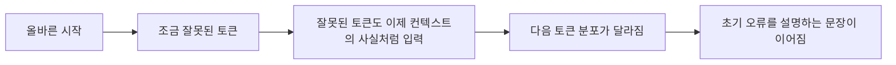
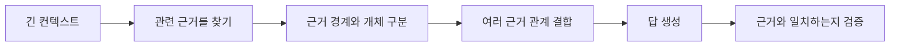
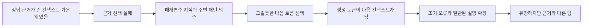
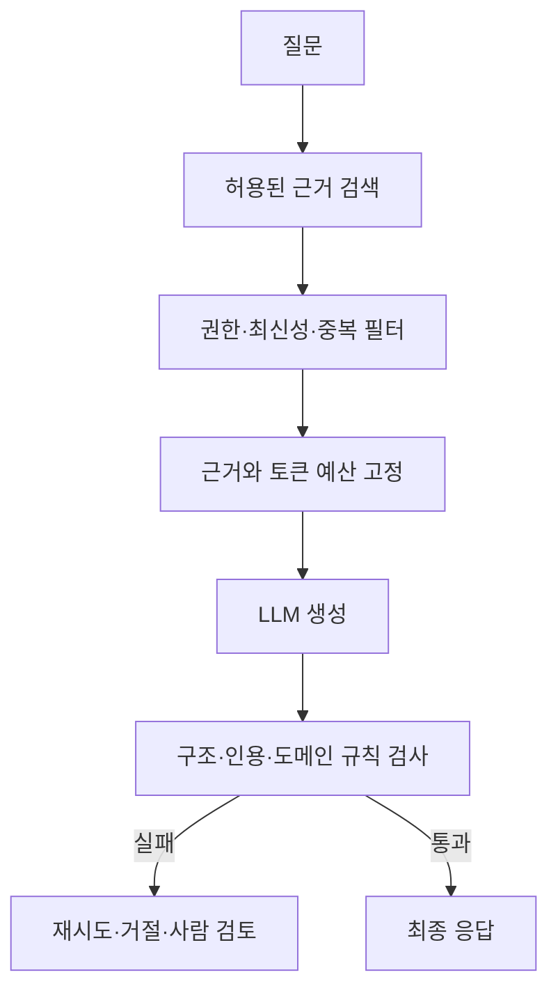

# 다음 토큰 예측은 왜 환각과 긴 컨텍스트 실패로 이어지는가

LLM은 사실을 조회해 문장으로 바꾸는 데이터베이스가 아니다.
현재까지의 **토큰**(token)을 조건으로 다음 토큰의 확률 분포를 만들고, 고른 토큰을 다시 입력에 붙이는 일을 반복한다.

이 단순한 학습 목표에서 놀라운 언어 능력과 추론 능력이 나타난다.
동시에 사실이 아닌데도 자연스러운 답, 자기 오류를 전제로 이어가는 답, 긴 입력 가운데의 근거를 놓치는 답도 나온다.

> 유창함은 학습 목표에 직접 들어 있지만, 진실성과 근거 충실성은 자동으로 보장되는 항목이 아니다.

이 글의 핵심 판단은 다음과 같다.
LLM은 근거 검색, 사실 검증, 문장 생성을 서로 독립된 절차로 실행하지 않는다.
필요한 근거를 제대로 사용하지 못한 순간에도 다음 토큰 계산은 계속되므로, 매개변수 지식과 주변 문장 패턴만으로 유창한 오답을 완성할 수 있다.

이 글은 환각을 모델이 고장 난 특수 상황으로만 보지 않는다.
Transformer의 계산, 다음 토큰 학습, 자동회귀 생성, 긴 컨텍스트 사용을 연결해 **왜 이런 실패가 가능한지 스스로 추론할 수 있는 기준**을 만든다.

Q·K·V와 Transformer 블록 계산이 낯설다면 [Transformer는 입력을 어떻게 다음 토큰 확률로 바꾸는가](./transformer-from-tokens-to-logits.md)를 먼저 읽으면 좋다.

이 글은 2026년 모델의 순위를 비교하는 벤치마크 글이 아니다.
시간이 지나도 남는 계산 구조와 통제 실험을 연결하는 데 집중하고, 최근 모델별 위치 편향 차이는 [Lost in the Middle와 컨텍스트 관리](../agent/lost-in-the-middle-context-management.md)에서 따로 다룬다.

## 먼저 결론의 범위를 제한한다

환각의 원인은 하나로 합의되어 있지 않다.
모든 환각을 attention 하나나 sampling 하나로 설명할 수도 없다.

이 글에서 구분할 근거는 세 단계다.

| 근거 수준 | 의미 | 예시 |
| --- | --- | --- |
| 구조에서 직접 확인 | 모델 계산이 실제로 그렇게 구성됨 | 출력은 어휘 집합의 로짓이며 사실 여부 필드는 없다 |
| 실험에서 관찰 | 통제한 조건에서 성능 차이를 측정함 | 근거 위치에 따라 QA 정확도가 U자 형태로 달라졌다 |
| 구조와 실험에서 도출한 해석 | 설계에 쓸 수 있지만 별도 평가가 필요함 | 중요 근거를 선별하고 외부 검증을 두는 편이 타당하다 |

특히 다음 두 문장은 구분해야 한다.

- 다음 토큰 예측은 진실성을 직접 최적화하지 않는다.
- 다음 토큰 예측을 쓰는 모든 모델이 반드시 같은 방식과 빈도로 환각한다.

첫 문장은 학습 목표에서 확인할 수 있다.
둘째 문장은 성립하지 않는다.
학습 데이터, 모델 구조, 후속 학습, 검색, 도구 사용, 토큰 선택 방식, 질문과 평가 조건에 따라 오류율과 형태가 크게 달라진다.

## 학습 목표부터 생성까지 환각 경로를 따라간다

### 사전 학습은 무엇을 학습하는가

GPT-2 논문은 언어 모델링을 토큰 열의 결합 확률을 조건부 확률의 곱으로 나눠 추정하는 문제로 설명한다.

```text
P(전체 토큰 열)
= P(토큰 1)
× P(토큰 2 | 토큰 1)
× P(토큰 3 | 토큰 1, 토큰 2)
× ...
```

모델이 반복해서 푸는 문제는 다음과 같다.

```text
지금까지 이 토큰들이 나왔다면 다음 토큰은 무엇일 가능성이 높은가?
```

예를 들어 학습 문장에 다음 토큰이 있다고 하자.

```text
입력:  지구는 태양 주위를
정답:  돈다
```

모델은 `돈다`의 확률을 높이고 다른 토큰의 확률을 낮추도록 파라미터를 수정한다.
문장 속 각 위치를 한 칸씩 밀어 입력과 정답으로 만들기 때문에 하나의 긴 문장에서도 많은 학습 사례를 얻는다.

```text
입력 위치: [지구는] [태양] [주위를]
정답 위치: [태양]   [주위를] [돈다]
```

인과 마스크 덕분에 각 위치는 오른쪽 정답을 미리 볼 수 없지만, GPU는 여러 위치의 손실을 병렬로 계산할 수 있다.

### cross-entropy는 정답 토큰의 확률을 높인다

모델이 만든 로짓에 softmax를 적용하면 어휘 집합 전체의 확률 분포가 된다.
정답 토큰의 확률이 낮을수록 큰 벌점을 주는 대표적인 손실 함수가 **cross-entropy**(교차 엔트로피)다.

한 위치의 손실을 단순화하면 다음과 같다.

```text
손실 = -log(정답 토큰에 모델이 준 확률)
```

정답 확률이 `0.9`이면 손실이 작고, `0.001`이면 크다.
**backpropagation**(역전파)은 이 손실이 각 파라미터에 얼마나 영향을 받았는지 **gradient**(기울기)를 계산한다.
**optimizer**(최적화 알고리즘)는 손실이 낮아지는 방향으로 임베딩, 어텐션 투영, FFN 등 수많은 파라미터를 조금씩 바꾼다.

이 과정을 방대한 텍스트에서 반복하면 모델은 다음 관계를 압축해 학습한다.

- 문법과 문장 구조
- 단어와 개념이 함께 등장하는 관계
- 질문 뒤에 답이 이어지는 형식
- 코드와 설명의 규칙성
- 글 속에 반복된 세계 지식과 통념
- 여러 단계 설명과 추론의 형태

다음 토큰을 잘 맞히려면 앞 문맥의 구조와 세상에 대한 많은 통계를 배워야 한다.
그래서 학습 목표는 단순하지만 결과 능력은 단순한 자동완성과 같지 않다.

### 그런데 손실에는 진실 검증 단계가 없다

학습 표본이 `질문, 답변` 형식이라면 답변 토큰을 잘 예측하는 것이 손실을 줄인다.
그 답변이 외부 세계에서 참인지 모델의 순전파 계산이 별도로 검증하지는 않는다.

학습 데이터에 정확한 설명이 많으면 정확한 패턴을 배울 수 있다.
반대로 다음 내용도 함께 학습될 수 있다.

- 널리 퍼진 오개념
- 서로 모순되는 주장
- 오래돼서 현재는 틀린 사실
- 풍자, 허구, 추측
- 근거 없이 단정하는 문체
- 질문을 받으면 모르는 내용도 답하는 대화 패턴

TruthfulQA 연구는 이 문제를 막연한 인상 대신 정해진 평가로 측정했다.
연구진은 건강, 법률, 금융, 정치 등 38개 범주에서 사람이 흔히 잘못 답하는 817개 질문을 만들고 GPT-3, GPT-Neo/J, GPT-2, T5 계열 모델을 평가했다.
당시 가장 좋은 모델도 질문의 58%에서만 진실한 답을 냈고, 사람 평가는 94%였다.
일부 모델 계열에서는 크기가 커질수록 학습 텍스트의 오개념을 더 잘 모방하는 역방향 경향도 나타났다.

이 수치는 2021년 모델과 해당 평가 방식에서 얻은 결과다.
현재 모델의 절대 성능으로 옮겨 적을 수는 없다.
논문이 보여준 범위는 더 제한적이면서도 중요하다.
**학습 분포를 더 정확하게 모방하는 것과 진실성이 자동으로 함께 증가하지 않을 수 있다.**

### 모델은 사실과 문장 가능성을 같은 방식으로 점수화하지 않는다

LLM의 마지막 계층이 직접 내놓는 값은 어휘 집합의 토큰별 로짓이다.
일반적인 decoder-only 모델에는 다음과 같은 별도 출력이 기본으로 붙어 있지 않다.

```text
이 문장은 사실인가: true
근거 문서 ID: document-42
근거가 답을 충분히 지지하는가: true
현재 지식의 기준 시각: 2026-08-25
```

물론 모델이 자연어로 출처나 확신도를 생성할 수는 있다.
그러나 그 텍스트도 같은 다음 토큰 생성 경로에서 나온다.
실제 검증 결과가 아니라 그럴듯한 출처 형식을 이어 쓴 것일 수 있다.

따라서 다음 두 확률은 다르다.

```text
P(이 토큰 열이 자연스럽게 이어질 가능성)
P(이 주장이 외부 세계에서 참일 가능성)
```

학습과 평가를 잘 설계하면 둘의 상관관계를 높일 수 있다.
두 값이 구조적으로 같은 것은 아니다.

### 파라미터 메모리는 정확한 레코드 저장소가 아니다

사전 학습 중 얻은 세계 지식은 모델 파라미터에 **parametric knowledge**(매개변수 지식)로 반영된다.
이 지식은 다음 특징을 가진다.

- 많은 사실과 패턴이 같은 파라미터를 공유한다.
- 비슷한 개체와 문맥의 표현이 서로 영향을 줄 수 있다.
- 학습 데이터의 빈도와 표현 방식이 회상 가능성에 영향을 준다.
- 지식의 출처와 갱신 시각이 레코드의 메타데이터처럼 함께 보존된다고 보장할 수 없다.
- 질문 표현과 주변 컨텍스트에 따라 다른 정보가 활성화될 수 있다.

데이터베이스 레코드처럼 `entityId`로 한 행을 정확히 읽는 구조와 다르다.
모델은 현재 은닉 상태에서 다음 토큰을 잘 만들도록 분산된 파라미터를 통과한다.

이 차이는 개체 혼합 오류를 이해하는 데 도움이 된다.
비슷한 이름, 비슷한 역할, 함께 자주 언급된 속성이 있으면 한 개체의 속성을 다른 개체에 붙인 문장이 확률적으로 자연스러울 수 있다.
어텐션이 입력의 잘못된 부분을 선택하거나 매개변수 지식이 프롬프트의 근거보다 우세해질 때도 근거와 다른 답이 생길 수 있다.

### 환각은 근거 기준과 세계 기준으로 나눌 수 있다

환각 연구에서는 근거와의 관계를 기준으로 두 유형을 구분한다.

| 유형 | 의미 | 예시 |
| --- | --- | --- |
| intrinsic hallucination | 제공한 근거와 모순된다 | 근거에는 2019년인데 요약은 2021년이라고 쓴다 |
| extrinsic hallucination | 근거로 지지하거나 반박할 수 없는 내용을 보탠다 | 근거에 없는 임상 시험 국가를 추가한다 |

extrinsic hallucination이 언제나 세계 기준으로 거짓인 것은 아니다.
근거에는 없지만 우연히 맞는 배경지식일 수도 있다.

그래서 **faithfulness**(근거 충실성)와 **factuality**(사실성)를 분리해야 한다.

- 근거 충실성: 주어진 근거가 출력을 지지하는가.
- 사실성: 외부 세계의 사실과 맞는가.

RAG 답변이 근거와 일치해도 근거 자체가 오래됐으면 사실성은 틀릴 수 있다.
반대로 모델이 근거 밖의 맞는 상식을 보태면 사실성은 맞아도 근거 충실성 평가는 실패할 수 있다.

### 후속 학습은 모델의 대화 행동을 바꾼다

사전 학습 모델은 웹 텍스트의 다음 토큰을 잘 예측하지만 사용자의 지시를 안정적으로 따르는 대화형 모델은 아니다.
현대 모델은 보통 추가 학습을 거친다.

흐름을 줄이면 `대규모 텍스트 사전 학습 → 기본 모델 → SFT → 선호도 최적화 → 대화형 모델` 순서다.

Llama 3 논문은 사전 학습 뒤에 **SFT**(지도 미세 조정)와 DPO를 여러 단계 적용했다고 설명한다.
SFT는 정답 응답 토큰에 cross-entropy 손실을 적용하고, 선호도 최적화는 선호된 답과 거절된 답의 상대적인 가능성을 조정한다.

후속 학습은 다음을 크게 개선할 수 있다.

- 지시 따르기
- 대화 형식
- 거절과 안전 행동
- 도구 호출 형식
- 사용자가 선호하는 설명 방식

그러나 선호되는 답과 참인 답이 항상 같지는 않다.
사람은 빈칸 없이 자신 있게 설명하는 답을 더 유용하다고 느낄 수 있다.
학습 데이터와 평가가 불확실할 때 멈추는 행동을 충분히 보상하지 않으면 모델은 답을 만들어내는 쪽으로 기울 수 있다.

이는 모든 RLHF나 DPO가 환각을 늘린다는 뜻이 아니다.
진실한 답과 답변 보류를 명시적으로 학습하면 줄일 수도 있다.
핵심은 후속 학습도 **무엇을 보상했는가**에 따라 행동이 달라지는 최적화라는 점이다.

### 학습과 생성은 서로 다른 앞부분을 본다

일반적인 다음 토큰 학습은 각 위치에서 실제 정답의 앞부분을 조건으로 다음 토큰을 예측한다.
이를 **teacher forcing**(교사 강요)이라고 부른다.
학습 중에는 모델이 방금 틀린 답이 아니라 데이터에 있는 정답 토큰을 다음 입력으로 강제로 넣는다는 뜻이다.

```text
학습: 정답 토큰 1, 정답 토큰 2, 정답 토큰 3 → 토큰 4 예측
```

실제 생성에서는 모델이 이전 단계에서 고른 토큰을 다음 입력으로 쓴다.

```text
추론: 생성 토큰 1, 생성 토큰 2, 생성 토큰 3 → 토큰 4 예측
```

이 차이는 고전적으로 **exposure bias**(노출 편향)라고 불렸다.
학습에서는 올바른 앞부분을 주로 봤지만 추론에서는 자신의 실수까지 다음 계산의 앞부분으로 받는다.



한 번 이름이나 숫자를 틀리면 이후 모델은 그 잘못된 토큰과 모순되지 않는 문장을 만들 가능성이 커진다.
사람 눈에는 모델이 거짓을 끝까지 합리화하는 것처럼 보일 수 있다.
계산 관점에서는 자신이 방금 만든 앞부분을 조건으로 다음 토큰을 계속 고르는 것이다.

이 설명은 가능한 실패 경로이지 현대 LLM 환각의 단일 원인이라는 증명은 아니다.
모델이 뒤에서 스스로 정정할 때도 있다.
여기서 확실히 말할 수 있는 구조적 사실은 생성한 토큰이 다음 단계의 조건으로 다시 들어간다는 점이다.

### sampling은 불확실성을 한 토큰 선택으로 바꾼다

**sampling**(표본 추출)은 확률 분포에서 실제 후보 하나를 고르는 과정이다.
모델은 다음 토큰 하나가 아니라 확률 분포를 만들고, 디코딩 정책이 그 분포에서 실제 토큰을 고른다.

#### greedy decoding

가장 높은 확률의 토큰을 항상 선택한다.
같은 계산 환경에서는 결과 재현성이 높지만, 국소적으로 가장 높은 선택이 전체 문장의 최선이라는 보장은 없다.

#### temperature

로짓을 **temperature**(온도)로 나눈 뒤 softmax를 적용한다.

- 낮은 온도는 높은 로짓에 더 집중한다.
- 높은 온도는 낮은 후보에도 확률을 더 나눈다.

온도는 창의성과 변동성을 조절하지, 사실 검증기를 추가하지 않는다.

#### top-k와 top-p

top-k는 확률이 높은 후보 k개만 남긴다.
top-p는 누적 확률이 기준에 도달할 때까지 후보를 남긴다.

후보 범위를 줄이면 매우 낮은 확률의 이상한 토큰을 막을 수 있다.
하지만 잘못된 이름이나 숫자가 높은 확률 후보에 있다면 그대로 선택될 수 있다.

환각 조사 논문은 다양성을 늘리는 디코딩이 일부 과제에서 환각과 양의 상관을 보인 연구를 정리한다.
그렇다고 무작위성만 제거하면 환각이 사라지는 것은 아니다.
greedy 방식으로 선택한 최고 로짓도 근거와 다를 수 있다.

### 왜 모델은 모를 때도 무언가를 출력할까

softmax는 어휘 집합에 확률을 나눈다.
모델이 충분한 지식이 없어도 후보 토큰은 존재한다.

불확실한 분포가 다음과 같다고 하자.

```text
후보 A: 0.18
후보 B: 0.16
후보 C: 0.14
나머지: 작은 확률로 넓게 분산
```

이 분포는 확신이 낮다는 신호가 될 수 있다.
그래도 디코더는 토큰 하나를 골라야 한다.
별도의 **abstention**(답변 보류) 정책이나 답변 전 검증이 없으면 생성은 계속된다.

더구나 토큰 하나의 확률이 문장 전체 사실성에 대한 잘 보정된 신뢰도와 같지는 않다.
유창한 상투 문구는 토큰 확률이 높아도 그 안의 고유명사와 사실 관계가 틀릴 수 있다.

따라서 모델에게 `모르면 모른다고 말하라`고 쓰는 것은 도움은 되지만 완전한 보장이 아니다.
모델이 자신의 지식 경계를 정확하게 평가하고 그 판단을 자연어로 충실히 표현해야 하기 때문이다.

### 정확도만 재는 평가는 추측을 보상한다

2025년의 Why Language Models Hallucinate는 `모를 때도 답하는 행동`을 학습과 평가의 보상 구조로 분석했다.
정확한 답에 1점, 오답과 답변 보류에 모두 0점을 주는 평가를 생각해보자.
모르는 질문에서 답변을 보류하면 기대 점수는 0이지만, 추측하면 낮더라도 맞을 확률이 생긴다.
정확도만 최대화하는 참가자에게는 추측이 유리하다.

논문은 사전 학습에서 생기는 오류와 후속 학습 뒤에도 오류가 남는 이유를 구분한다.

- 드물거나 임의적인 사실은 학습 데이터에서 참과 거짓을 구분할 통계적 신호가 약해 사전 학습 오류가 생긴다.
- 후속 학습과 주요 평가가 답변 보류보다 추측에 높은 기대 점수를 주면, 불확실할 때 멈추는 행동이 선택되기 어렵다.

이는 Transformer 구조 하나만으로 모든 환각을 설명하는 주장이 아니다.
오류가 생길 수 있는 통계적 조건과, 그 오류를 솔직한 답변 보류로 바꾸지 못하게 하는 평가 유인을 분리한 설명이다.
결정론적 검증과 함께 답변 보류를 정상 결과로 설계해야 하는 이유도 여기서 나온다.

### 자연스러운 설명은 내부 추론의 실행 기록이 아니다

모델이 답 뒤에 이유를 설명하면 그 추론을 실제 내부 계산의 실행 기록으로 받아들이기 쉽다.
하지만 생성된 설명도 토큰 열이다.

Unfaithful Explanations 연구는 객관식 프롬프트에 편향 단서를 넣었을 때 모델 답이 영향을 받으면서도 생성한 설명에는 그 영향을 밝히지 않는 사례를 보였다.
모델은 선택된 답을 사후에 그럴듯하게 정당화할 수 있었다.

이 결과가 **chain-of-thought**(생각의 사슬)의 효과를 부정하지는 않는다.
중간 단계를 텍스트로 만들면 복잡한 문제 성능이 좋아지고 외부 검증 지점을 만들 수 있다.
다만 생성된 추론을 내부 인과 과정과 동일한 감사 기록으로 간주하면 안 된다.

같은 주의가 어텐션 분포에도 적용된다.
특정 헤드가 어디에 가중치를 줬는지는 계산 일부를 보여주지만 모델 전체가 그 답을 낸 이유를 완전하게 설명하지 않는다.

## 긴 입력에서 근거 활용 실패를 따라간다

### 긴 컨텍스트가 들어갈 수 있다는 것과 활용한다는 것은 다르다

**context window**(컨텍스트 창)가 128K라는 말은 토큰 분할기가 만든 토큰을 최대 그 길이까지 입력 형식으로 받을 수 있다는 뜻이다.
모든 위치의 정보를 같은 정확도로 검색하고 결합한다는 뜻은 아니다.

긴 컨텍스트에서 모델이 해야 할 일은 여러 단계로 나뉜다.



컨텍스트 창은 첫 단계의 입력 가능 범위만 넓힌다.
나머지 단계의 성공을 자동으로 보장하지 않는다.

### 토큰이 많아지면 어텐션에서 무엇이 달라질까

한 어텐션 헤드의 Q는 허용된 모든 K와 점수 경쟁을 한다.
softmax는 그 점수를 한 행의 합이 1인 가중치로 바꾼다.

여기서 흔히 나오는 직관이 있다.

```text
토큰이 두 배면 중요한 토큰의 가중치가 무조건 절반이 된다.
```

이는 정확하지 않다.
중요한 K의 점수가 다른 후보보다 충분히 크면 긴 컨텍스트에서도 높은 가중치를 받을 수 있다.

더 정확한 표현은 다음과 같다.

- 비슷해 보이는 후보와 방해 정보가 늘 수 있다.
- Q가 필요한 근거와 잘 맞는 표현을 만들지 못할 수 있다.
- 위치 표현과 학습 때 경험한 토큰 열의 길이가 영향을 줄 수 있다.
- 한 계층에서 찾은 정보가 이후 계층의 FFN과 어텐션을 거치며 변할 수 있다.
- 근거 하나를 찾는 것과 여러 근거를 정확히 조합하는 것은 다른 난도다.

즉, **모든 관계가 길이에 반비례해 균일하게 희석된다**기보다 근거 선택과 결합의 경쟁이 어려워질 수 있다고 보는 편이 안전하다.

### 인과 구조에서는 뒤의 질문이 앞 문서를 다시 바꾸지 못한다

decoder-only 모델에서 각 토큰은 왼쪽 토큰만 본다.
프롬프트가 다음 순서라면 문서 토큰은 뒤에 오는 질문을 보지 못한 상태로 계층을 통과한다.

```text
[문서 A] [문서 B] [문서 C] ... [질문]
```

질문 토큰은 앞의 모든 문서를 볼 수 있다.
하지만 문서 토큰의 은닉 상태가 질문을 미리 알고 질문에 맞게 양방향으로 다시 문맥화되는 구조는 아니다.

encoder-only 또는 encoder-decoder 구조에서는 입력 encoder가 양방향 어텐션으로 질문과 문서를 함께 처리할 수 있다.
Lost in the Middle 연구는 encoder-decoder 모델이 학습 길이 안에서는 위치 변화에 상대적으로 강한 사례를 관찰했다.
학습 길이를 넘으면 이 모델도 U자 성능 저하가 나타났다.

이 차이가 decoder-only의 긴 컨텍스트 실패를 모두 설명하지는 않는다.
다만 프롬프트 순서와 **query-aware contextualization**(질문을 반영한 문맥화)이 왜 영향을 줄 수 있는지 보여주는 구조적 단서다.

### Lost in the Middle은 무엇을 실제로 측정했나

Liu 연구진은 정답 내용은 그대로 두고 관련 문서의 위치만 바꾸는 통제 실험을 했다.
실험은 성격이 다른 두 과제로 나뉜다.

| 과제 | 입력 구성 | 바꾼 조건 | 평가 방법 |
| --- | --- | --- | --- |
| 여러 문서 질의응답 | NaturalQuestions-Open 2,655개 질문, 문서당 최대 100토큰 | 전체 문서를 10·20·30개로 늘리고 정답 문서 위치를 이동 | 정답 문자열 포함 여부 |
| JSON key-value 검색 | 128비트 UUID 키와 값을 무작위로 생성 | 75·140·300쌍에서 목표 쌍의 위치를 이동, 조건당 500개 예시 | 정확한 값 포함 여부 |

질의응답 입력에는 정답 문서가 정확히 하나 있었고 나머지는 검색기가 가져온 방해 문서였다.
모델은 MPT-30B-Instruct, LongChat-13B 16K, GPT-3.5-Turbo 4K·16K, Claude 1.3 8K·100K 등이었으며, 토큰 선택에는 greedy decoding을 사용했다.
따라서 결과를 읽을 때는 2023년 당시 모델, 프롬프트, 데이터, 평가 방식에서 얻은 관찰이라는 범위를 유지해야 한다.

여러 모델은 다음과 같은 U자 형태를 보였다.

```text
정답 근거 위치:  앞 -------- 가운데 -------- 뒤
성능:            높음          낮음          높음
```

논문이 확인한 핵심은 다음과 같다.

- 관련 정보의 위치만 바꿔도 정확도가 크게 달라질 수 있었다.
- 앞부분 선호와 뒷부분 선호가 함께 나타났다.
- GPT-3.5-Turbo는 여러 문서 질의응답에서 위치에 따라 정확도가 20% 넘게 떨어졌다. 문서 20개와 30개 조건의 최저 성능은 문서를 전혀 주지 않은 56.1%보다도 낮았다.
- 같은 입력이 기본 모델과 확장 컨텍스트 모델 양쪽 길이 안에 들어가면 두 버전의 위치별 성능이 거의 겹쳤다. 최대 입력 길이가 늘었다고 기존 구간 활용 능력까지 자동으로 좋아진 것은 아니었다.
- Claude 1.3 계열은 단순 키-값 검색을 거의 완벽히 했지만, GPT-3.5-Turbo와 MPT 계열 등은 140쌍과 300쌍의 가운데 값을 자주 놓쳤다.
- 질문을 문서 앞과 뒤에 모두 배치한 조건에서 GPT-3.5-Turbo 16K의 300쌍 키-값 검색은 최악 45.6%에서 100%로 올랐다. 반면 여러 문서 질의응답의 전체 위치 경향은 거의 바뀌지 않았다.
- Flan-UL2 encoder-decoder 모델은 학습 길이 안에서 최고와 최저 위치 차이가 1.9%p였지만, 학습 때보다 긴 입력에서는 U자 형태가 나타났다.

여기서 가장 중요한 비교는 `가운데가 약했다`는 한 문장이 아니다.
질문을 앞에도 둔 것만으로 키-값 검색이 45.6%에서 100%로 회복됐지만 여러 문서 질의응답은 회복되지 않았다.
정확한 문자열 하나를 선택하는 병목과, 관련 문서를 찾아 개체 관계를 조합하는 병목이 서로 다르다는 증거다.
따라서 Lost in the Middle을 하나의 `중간 기억 고장`으로 묶기보다 검색·문맥화·근거 결합을 나눠 측정해야 한다.

모든 모델과 모든 길이에서 가운데가 반드시 최악이라는 법칙은 아니다.
기존 [Lost in the Middle와 컨텍스트 관리](../agent/lost-in-the-middle-context-management.md)는 후속 연구까지 포함해 위치 편향이 모델, 과제, 상대적인 컨텍스트 길이에 따라 달라진다는 점을 자세히 다룬다.

### 어텐션 구조만으로 U자 곡선을 증명할 수는 없다

softmax 경쟁과 인과 마스크를 이해하면 긴 컨텍스트가 어려울 가능성은 떠올릴 수 있다.
그러나 원 논문의 U자 곡선을 어텐션 수식 하나에서 바로 유도할 수는 없다.

관찰된 현상에는 여러 요소가 함께 작용할 수 있다.

- 학습 데이터에서 중요한 정보가 놓인 위치의 분포
- 지시와 질문이 흔히 배치되는 위치
- 위치 표현과 학습 길이 밖으로 확장하는 방식
- decoder-only의 한 방향 컨텍스트 처리
- 비슷한 방해 문서 사이의 검색 난도
- 여러 근거를 결합하는 추론 난도
- 후속 학습에서 본 프롬프트 형식

따라서 `어텐션 가중치가 중간에서 작아져서 그렇다`라고 단정하면 증거보다 설명이 앞선다.
정확한 태도는 **위치에 따른 활용 성능 차이는 실험으로 확인됐지만 모든 내부 인과가 완전히 규명된 것은 아니다**라고 말하는 것이다.

### 환각과 Lost in the Middle은 어떻게 만나는가

두 현상은 같은 것이 아니다.

- 환각은 생성 내용이 근거나 세계 사실과 어긋나는 현상이다.
- Lost in the Middle은 긴 입력에서 관련 정보 위치에 따라 활용 성능이 떨어지는 현상이다.

하지만 실제 질의응답에서는 연결될 수 있다.



근거를 못 찾았다고 모델이 자동으로 중단하는 것은 아니다.
파라미터에 학습된 일반 지식과 프롬프트의 다른 토큰으로 계속 확률 분포를 만들 수 있다.
그 결과가 맞을 수도 있지만, 근거가 요구한 개체나 숫자와 섞이면 환각이 된다.

Lost in the Middle 자체는 근거 활용 실패이고 환각과 동일하지 않다.
이 실패가 빈 답이나 답변 보류로 끝나면 근거 누락이지만, 생성기가 매개변수 지식으로 빈칸을 채우고 추측을 선호하도록 학습됐다면 유창한 환각으로 이어진다.
2023년 위치 실험과 2025년 추측 보상 분석을 연결하면 `근거 선택 실패`와 `실패 뒤에도 답하도록 하는 유인`이 서로 다른 두 단계라는 결론이 나온다.

긴 컨텍스트는 더 많은 사실을 제공하면서 동시에 더 많은 방해 후보와 충돌 가능성도 제공한다.
그래서 `더 넣으면 적어도 나빠지지는 않는다`는 단조 증가 가정을 할 수 없다.

## 구조와 실험에서 설계 원칙을 도출한다

앞의 구조와 실험을 운영 판단으로 바꾸면 다음과 같다.

| 확인한 사실 | 피해야 할 결론 | 설계 원칙 | 따로 측정할 값 |
| --- | --- | --- | --- |
| 컨텍스트 창은 입력 가능한 최대 길이다 | 128K면 모든 위치를 같은 정확도로 쓴다 | 앞·중간·뒤에 같은 근거를 배치해 평가한다 | 위치별 정확도, 최고·최저 차이 |
| 검색 성공 뒤에도 근거 선택과 답 생성이 남는다 | 검색 재현율이 높으면 RAG가 정확하다 | 검색과 답변을 별도 단계로 평가한다 | 검색 재현율, 근거 충실성 |
| 온도는 후보 분포의 선택 방식을 바꾼다 | 온도 0이면 답이 참이다 | 재현성과 정확성을 분리한다 | 반복 일치율, 사실 정확도 |
| 큰 모델도 학습 분포를 모방한다 | 크기 증가가 진실성 문제를 끝낸다 | 모델 크기와 별도로 답변 보류·검증을 평가한다 | 오답률, 답변 보류율, 보류 정확도 |
| 자연어 컨텍스트는 위치와 길이의 영향을 받는다 | 승인·금액·버전도 대화에 쓰면 보존된다 | 틀리면 안 되는 상태는 구조화해 저장한다 | 스키마 검사, 상태 전이 검사 |
| 생성자의 긴 기록에는 실패한 가설도 남는다 | 같은 모델에게 전체 기록을 주면 검토가 깊어진다 | 검토자는 요구사항·변경·테스트·위험만 새 컨텍스트에서 받는다 | 결함 발견률, 오탐률 |

마지막 행은 Transformer 수식이 직접 증명한 법칙이 아니라 Lost in the Middle와 자기 평가 편향에서 도출한 설계 가설이다.
같은 변경을 `전체 대화 인계`와 `선별된 새 컨텍스트` 두 조건으로 검토해야 실제 효과를 판단할 수 있다.
구체적인 인수인계 방식은 [Lost in the Middle와 컨텍스트 관리](../agent/lost-in-the-middle-context-management.md)에서 이어진다.

### 모델 바깥에서 결정론을 사용해야 하는 이유

LLM의 확률적 생성을 없애자는 뜻이 아니다.
다음 경계를 모델 밖에서 재현 가능하게 만들자는 뜻이다.
여기서 결정론적이라는 말은 같은 입력과 규칙을 주면 같은 판정을 재현할 수 있다는 뜻이다.



결정적으로 만들 수 있는 항목은 많다.

- 어떤 근거를 읽을 수 있는가.
- 어느 버전과 시각의 데이터를 사용하는가.
- 필수 근거가 최종 컨텍스트에 포함됐는가.
- 출력이 JSON Schema를 지키는가.
- 계산 결과가 허용 범위 안인가.
- 인용 URL과 문서 ID가 실제로 존재하는가.
- 모델이 제안한 코드가 테스트를 통과하는가.

이런 검사는 모델의 창의성을 줄이기 위한 장치가 아니다.
확률적으로 생성해도 되는 영역과 사실이어야 하는 영역의 경계를 정한다.

## 작은 실험으로 직접 검증한다

논문 결과를 그대로 믿는 대신 아래처럼 변수와 판정 기준을 고정해 재현할 수 있다.

| 확인할 가설 | 고정할 조건 | 바꿀 조건 | 기록할 지표 |
| --- | --- | --- | --- |
| 그럴듯한 이름만으로 존재하지 않는 API를 만드는가 | 모델 버전, 시스템 지시, 질문 형식 | 검색 없음, 검색 허용, 인용 검증 필수 | 존재하지 않는 구체 주장 수, 답변 보류율, 유효 인용률 |
| 같은 근거도 위치에 따라 활용률이 달라지는가 | 전체 토큰 수, 질문, 방해 문서, 생성 설정 | 정답을 처음 10%, 가운데, 마지막 10%에 배치 | 위치별 exact match, 최고·최저 차이, 반복 실행 분산 |
| 근거 충실성과 현재 사실성은 다른가 | 과거 버전 문서와 질문 집합 | `문서 내용만 답하기`, `현재 공식 자료로 답하기` | 문서 일치율, 현재 사실 정확도, 두 근거의 혼합 오류율 |

첫 실험에서는 `FosReactiveTransaction 3.2의 @AtomicFlux 사용법`처럼 존재하지 않지만 자연스러운 이름을 여러 개 만든다.
조건마다 최소 20개 질문을 실행하고, 패키지·옵션·릴리스 노트처럼 검증 가능한 세부 주장마다 실제 존재 여부를 표시한다.

위치 실험은 정답 하나만 옮기고 나머지 바이트를 가능한 한 같게 유지해야 한다.
위치마다 서로 다른 키-값 30개 이상을 사용하면 특정 예시를 우연히 맞힌 효과를 줄일 수 있다.
온도 0 조건의 정확도와 표본 추출 조건의 평균·분산을 함께 기록하면 위치 효과와 생성 무작위성을 분리하기 쉽다.

마지막 실험에서는 다음 두 질문을 별도 점수로 채점한다.

```text
이 근거가 말하는 설정값은 무엇인가?
현재 공식 자료의 설정값은 무엇인가?
```

첫 질문은 근거 충실성, 둘째 질문은 최신 사실성을 본다.
한 점수로 합치면 모델이 오래된 근거를 정확히 요약한 경우와 근거를 무시하고 최신값을 말한 경우를 구분할 수 없다.

## 결론: 생성과 검증의 책임을 나눈다

LLM의 기본 출력은 사실 판정이 아니라 다음 토큰 분포다.
Lost in the Middle은 긴 입력의 근거 선택이 위치에 따라 실패할 수 있음을 보여주고, 환각은 그 실패 뒤에도 생성이 계속될 때 나타날 수 있는 결과다.

따라서 `근거 선택 실패 → 매개변수 지식과 주변 패턴 의존 → 그럴듯한 토큰 선택 → 생성한 오류를 다음 입력으로 사용`이라는 경로를 끊어야 한다.
모델은 애매한 텍스트를 해석하고 후보를 만드는 데 사용하되, 근거 범위·최신성·상태·계산·인용·테스트는 재현 가능한 규칙으로 검사한다.
이 책임 분리가 긴 컨텍스트와 더 큰 모델만으로 진실성을 해결하려는 접근보다 검증 가능한 시스템을 만든다.

## 참고 자료

- Vaswani et al., [Attention Is All You Need](https://arxiv.org/abs/1706.03762)
- Radford et al., [Language Models are Unsupervised Multitask Learners](https://cdn.openai.com/better-language-models/language-models.pdf)
- Grattafiori et al., [The Llama 3 Herd of Models](https://arxiv.org/abs/2407.21783)
- Lin et al., [TruthfulQA: Measuring How Models Mimic Human Falsehoods](https://arxiv.org/abs/2109.07958)
- Ji et al., [Survey of Hallucination in Natural Language Generation](https://arxiv.org/abs/2202.03629)
- Liu et al., [Lost in the Middle: How Language Models Use Long Contexts](https://arxiv.org/abs/2307.03172)
- Turpin et al., [Language Models Don't Always Say What They Think](https://arxiv.org/abs/2305.04388)
- Kalai et al., [Why Language Models Hallucinate](https://arxiv.org/abs/2509.04664)
