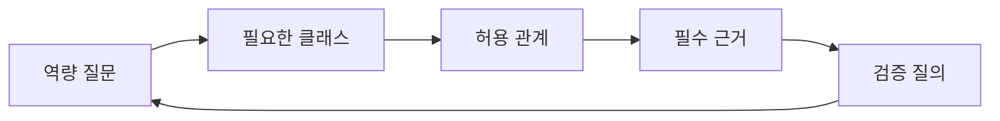
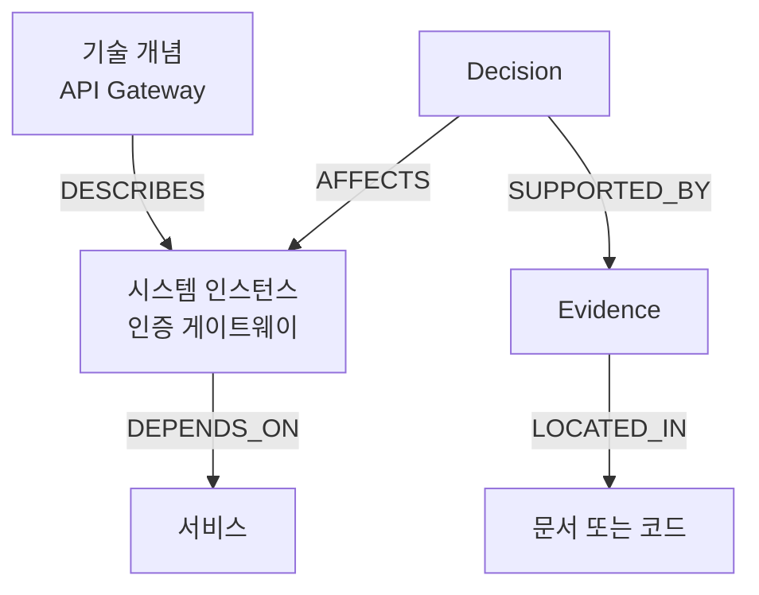
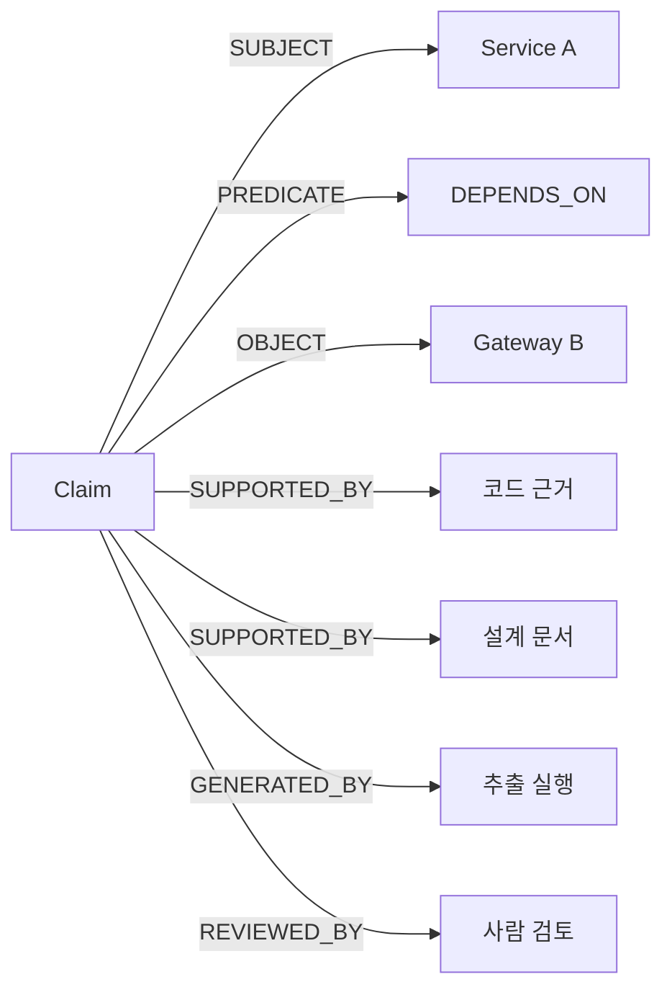
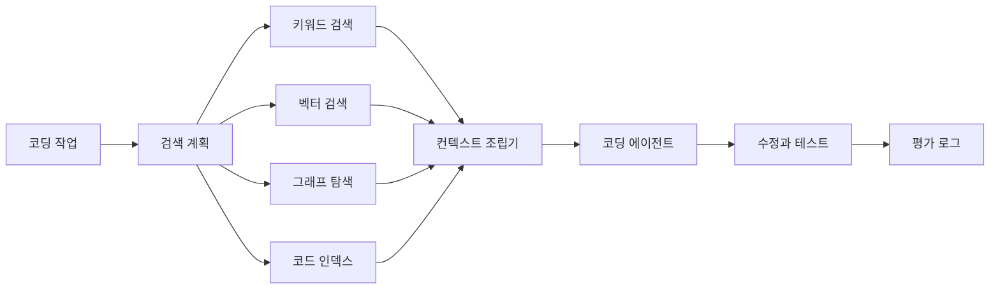

# 온톨로지에서 코딩 에이전트 컨텍스트까지 — 클래스·관계 설계와 그래프 평가

지식그래프를 만들어보면서 가장 어려웠던 건 노드를 저장하는 일이 아니었다.
`API Gateway`, `게이트웨이`, `Gateway API`처럼 비슷해 보이는 표현을 언제 하나로 묶고,
그 사이의 관계를 어떤 의미로 연결할지가 훨씬 어려웠다.

이번에 자료를 깊게 찾아보며 내린 결론은 이렇다.
**온톨로지의 중심은 클래스 계약이고, 지식그래프의 가치는 벡터 RAG와 같은 조건에서 실제 질문으로 비교해야 증명할 수 있다.**

이 글에서는 세 가지 질문을 따라간다.

- 클래스와 인스턴스를 어떻게 나눠야 관계가 무너지지 않는가?
- 비슷한 표현을 언제 같은 개체로 묶고 언제 분리해야 하는가?
- 그래프를 힘들게 구축한 만큼 벡터 RAG보다 나아졌는지 어떻게 측정하는가?

에이전트의 메모리와 권한을 포함한 전체 운영 구조가 먼저 필요하다면
[엔터프라이즈 AI Agent 설계](./agent/enterprise-ai-agent-design.md)를 함께 보면 좋다.

## 그래프 데이터베이스보다 온톨로지가 먼저다

처음에는 노드와 관계가 많아지면 자연스럽게 지식그래프가 좋아질 거라고 생각하기 쉽다.
하지만 그래프 데이터베이스는 데이터를 저장하고 탐색하는 기술이지,
무엇을 같은 것으로 볼지 결정해주지는 않는다.

온톨로지는 도메인에서 사용하는 의미의 계약이다.

- 어떤 종류의 대상이 존재하는가?
- 각 대상은 무엇으로 식별하는가?
- 어떤 관계를 허용하는가?
- 관계의 방향은 무엇인가?
- 어떤 주장은 반드시 근거를 가져야 하는가?
- 변경되거나 폐기된 개념은 어떻게 추적하는가?

W3C의 OWL 2 입문서는 온톨로지를 클래스, 속성, 개체와 이들 사이의 공리로 설명한다.

### OWL 2는 무엇인가

OWL은 **웹 온톨로지 언어**(Web Ontology Language)의 약자다.
OWL 2는 어떤 도메인의 개념과 관계를 컴퓨터가 논리적으로 해석하고
새로운 사실을 추론할 수 있도록 의미를 명시하는 W3C 표준 언어다.

이름에 Web이 들어가지만 웹 화면을 만드는 기술은 아니다.
서로 다른 시스템이 같은 개념을 같은 의미로 교환하고,
명시된 규칙에서 추가 사실을 계산하는 지식 표현 언어에 가깝다.

OWL 2를 이해할 때는 다섯 가지를 먼저 보면 된다.

| 구성 요소 | 의미 | 코딩 지식그래프 예시 |
| --- | --- | --- |
| 클래스 | 같은 성격을 가진 개체의 집합 | `Component`, `APIGateway` |
| 개체 | 현실의 구체적인 대상 | `auth-gateway` |
| 객체 속성 | 개체와 개체 사이의 관계 | `dependsOn`, `ownedBy` |
| 데이터 속성 | 개체와 문자열·숫자 같은 값의 관계 | `version`, `createdAt` |
| 공리 | 온톨로지 안에서 참이라고 선언한 의미 규칙 | 모든 `APIGateway`는 `Component`다 |

여기서 **공리**(axiom)가 OWL 2의 핵심이다.
공리는 단순한 설명 문장이 아니라 추론기가 새로운 사실을 도출할 때 사용하는 논리 규칙이다.

다음은 OWL의 Manchester 문법을 단순화한 예다.

```text
Class: Component

Class: APIGateway
  SubClassOf: Component

Class: AuthenticationGateway
  SubClassOf: APIGateway

Individual: auth-gateway
  Types: AuthenticationGateway
```

직접 적은 사실은 `auth-gateway`가 `AuthenticationGateway`라는 것뿐이다.
하지만 추론기는 클래스 계층을 따라 다음 사실도 도출할 수 있다.

- `auth-gateway`는 `APIGateway`다.
- `auth-gateway`는 `Component`다.
- 모든 `AuthenticationGateway`는 `Component`다.

RDF가 `auth-gateway dependsOn auth-service` 같은 사실을 주어·관계·목적어 형태로 표현한다면,
OWL 2는 클래스 계층, 동등성, 배타성, 속성의 특성처럼
그 사실들을 해석할 규칙을 더한다.

### OWL 2는 데이터 검증 언어가 아니다

OWL 2를 처음 접할 때 가장 헷갈리기 쉬운 부분이다.

일반적인 데이터베이스나 Zod 검증에서는 필드가 없으면 오류라고 판단할 수 있다.
반면 OWL 2는 **열린 세계 가정**(open-world assumption)을 따른다.
그래프에 어떤 사실이 없다고 해서 그 사실이 거짓이라고 결론 내리지 않고,
아직 알려지지 않았을 가능성을 남긴다.

예를 들어 `auth-gateway`에 소유 팀이 기록되지 않았다고 해보자.

- Zod나 SHACL은 `owner`가 필수라는 조건을 두고 누락을 오류로 판정할 수 있다.
- OWL 2는 소유 팀 정보가 없다는 이유만으로 소유 팀이 존재하지 않는다고 판단하지 않는다.

속성의 도메인과 범위도 입력 검증 규칙과 다르게 작동한다.
OWL 2에서 `dependsOn`의 시작과 끝을 `Component`로 선언한 뒤
`A dependsOn B`라는 사실이 들어오면,
추론기는 A와 B를 `Component`라고 추론할 수 있다.
잘못된 입력을 곧바로 거부하는 타입 검사와는 방향이 다르다.

역할을 구분하면 다음과 같다.

| 도구 | 답하려는 질문 |
| --- | --- |
| OWL 2 | 현재 사실과 의미 규칙에서 무엇을 논리적으로 추론할 수 있는가? |
| SHACL | RDF 데이터가 필요한 형태와 제약을 만족하는가? |
| Zod·JSON Schema | 애플리케이션 입력이 요구한 필드와 타입을 만족하는가? |
| Neo4j 제약 | 그래프 키와 속성의 유일성·존재 조건을 만족하는가? |

따라서 OWL 2와 SHACL은 경쟁 기술이라기보다 역할이 다르다.
OWL 2로 의미와 추론 규칙을 표현하고,
SHACL이나 애플리케이션 스키마로 실제 적재 데이터를 검증할 수 있다.

### 왜 OWL 2에도 여러 프로파일이 있는가

논리 표현력이 강해질수록 추론 비용도 커질 수 있다.
OWL 2는 필요한 문제에 맞춰 표현력 일부를 제한한 세 가지 프로파일을 정의한다.

| 프로파일 | 적합한 문제 |
| --- | --- |
| OWL 2 EL | 클래스와 속성이 매우 많은 대규모 온톨로지에서 계층 추론이 중요할 때 |
| OWL 2 QL | 인스턴스가 많고 관계형 데이터베이스 위에서 질의 응답이 중요할 때 |
| OWL 2 RL | 규칙 엔진 방식으로 확장 가능한 추론을 구현할 때 |

프로파일은 더 좋은 버전을 고르는 문제가 아니다.
필요한 추론과 데이터 규모에 맞춰 표현력과 계산 비용을 교환하는 선택지다.

### 이 프로젝트에 OWL 2가 바로 필요한가

현재와 같은 Neo4j 속성 그래프가 있다고 해서
OWL 2로 전면 이주해야 하는 것은 아니다.

다음 요구가 생기면 OWL 2 도입을 검토할 가치가 있다.

- 여러 시스템이 클래스와 관계의 의미를 표준 형식으로 공유해야 한다.
- 클래스 계층과 속성 규칙에서 새로운 사실을 자동 추론해야 한다.
- 서로 모순되는 클래스 정의를 논리적으로 검사해야 한다.
- 외부 온톨로지와 식별자·정의를 연결해야 한다.

반대로 클래스 수가 작고,
필요한 관계 탐색이 Cypher로 충분하며,
애플리케이션 코드에서 제약을 명확히 관리할 수 있다면
TypeScript, Zod, Neo4j 제약으로 시작하는 편이 단순하다.

내가 이 글에서 OWL 2를 언급한 이유도 라이브러리 도입을 권하기 위해서가 아니다.
클래스, 관계, 인스턴스, 공리, 추론을 분리해서 생각하는 설계 규율을 가져오기 위해서다.

내가 중요하게 본 구분은 다음과 같다.

| 구분 | 역할 | 예시 |
| --- | --- | --- |
| 클래스 | 어떤 종류의 대상인지 정의한다 | `Service`, `Component`, `Decision` |
| 인스턴스 | 현실에 존재하는 구체적인 대상을 나타낸다 | `주문 API`, `인증 게이트웨이` |
| 관계 유형 | 두 대상 사이에 허용되는 의미를 정의한다 | `DEPENDS_ON`, `AFFECTS` |
| 주장 | 특정 관계가 실제로 성립한다고 말한다 | 주문 API가 인증 게이트웨이에 의존한다 |
| 근거 | 그 주장을 뒷받침한다 | 설계 문서, 코드 위치, 업무 댓글 |

클래스가 불명확하면 같은 `Concept` 안에 기술, 제품, 코드 심볼, 일반 명사가 섞인다.
그 상태에서 관계를 추가할수록 그래프는 풍부해지는 게 아니라 모호해진다.

## 클래스는 명사가 아니라 질문에서 나온다

문서에서 명사를 모두 뽑아 클래스로 만들면 온톨로지가 빠르게 비대해진다.
Stanford의 Ontology Development 101은 먼저 도메인, 사용 목적, 사용자,
그리고 온톨로지가 답해야 할 질문을 정하라고 권한다.

이때 사용하는 질문을 **역량 질문**(competency question)이라고 부른다.

코딩 에이전트를 위한 지식그래프라면 다음과 같은 질문이 출발점이 될 수 있다.

- 이 서비스가 의존하는 컴포넌트는 무엇인가?
- 이 API 제거를 결정한 업무와 근거는 어디에 있는가?
- 이 심볼을 수정하면 어떤 서비스와 테스트가 영향을 받는가?
- 현재도 유효한 결정과 이미 대체된 결정은 무엇인가?
- 이 관계는 어느 문서와 코드에서 추출됐는가?

질문을 적고 나면 필요한 클래스가 보인다.



예를 들어 변경 영향 질문을 답하려면 `Service`와 `CodeSymbol`만으로는 부족하다.
변경을 설명하는 `Decision`, 근거가 되는 `Document`,
시간에 따라 유효성이 달라지는 `Claim`이 필요할 수 있다.

반대로 어떤 클래스도 질문, 제약, 행동에 연결되지 않는다면
정식 온톨로지에 넣기보다 후보 상태로 두는 편이 낫다.

## 코딩 에이전트를 위한 최소 클래스 모델

처음부터 모든 개발 지식을 모델링할 필요는 없다.
나는 다음 네 묶음부터 시작하는 편이 현실적이라고 봤다.

### 시스템 자산

- `System`
- `Service`
- `Component`
- `API`
- `DataStore`
- `CodeSymbol`

### 작업과 기록

- `WorkItem`
- `Document`
- `Comment`
- `Commit`
- `PullRequest`

### 지식과 판단

- `Decision`
- `Claim`
- `Evidence`
- `Incident`

### 행위 주체

- `Person`
- `Team`
- `Agent`

이 구성에서 일반 기술어는 곧바로 시스템 자산으로 취급하지 않는다.
`API Gateway`라는 기술 개념과 조직이 운영하는 구체적인 게이트웨이 인스턴스는 다르다.



이 구분이 없으면 기술 문서에서 나온 일반 개념과 실제 운영 대상을 같은 노드로 합치게 된다.
그러면 에이전트가 변경 영향이나 소유권을 찾을 때 엉뚱한 경로를 따라간다.

## `API Gateway`와 `게이트웨이`는 같은가

표현이 비슷하다는 사실과 같은 개체라는 사실은 다르다.

다음 표현을 생각해보자.

- `API Gateway`
- `api-gateway`
- `게이트웨이`
- `인증 게이트웨이`
- `Gateway API`

앞의 두 표현은 표기 차이일 가능성이 높다.
`게이트웨이`는 문맥에 따라 API Gateway, 네트워크 게이트웨이,
결제 게이트웨이를 모두 가리킬 수 있다.
`Gateway API`는 Kubernetes의 별도 API 표준을 의미할 수도 있으므로
문자열 토큰이 같다는 이유로 합치면 안 된다.

나는 이 문제를 문자열 정규화가 아니라 **개체 동일성 판정** 문제로 보는 편이 맞다고 생각한다.

### 표현과 개체를 분리한다

원문에서 발견한 표현은 먼저 `Mention`으로 취급한다.
검증을 통과한 뒤에만 정식 개체에 연결한다.

```text
원문 표현
  → 동일성 후보 생성
  → 문맥과 관계 비교
  → 동일 / 관련 / 상하위 / 모호 / 별개 판정
  → 정식 개체 또는 검토 대기열 연결
```

같은 개체로 병합하려면 다음 근거를 조합한다.

- 동일한 외부 식별자가 있는가?
- 정의와 사용 범위가 같은가?
- 같은 소유자와 시스템 경계를 가리키는가?
- 주변 관계가 일치하는가?
- 공식 문서가 동의어나 개명이라고 명시하는가?
- 서로 바꿔 써도 역량 질문의 의미가 달라지지 않는가?

### 후보 생성과 최종 판정을 분리한다

후보를 넓게 찾는 단계에서는 여러 방법을 함께 쓸 수 있다.

- 대소문자, 구분자, 조사 등을 제거한 문자열 정규화
- 관리되는 별칭 사전
- 임베딩 유사도
- 주변 문장과 문서의 유사도
- 연결된 서비스, 팀, 코드 심볼 같은 그래프 이웃

그러나 후보가 나왔다고 바로 병합하면 안 된다.
최종 판정에서는 다음 상태를 구분해야 한다.

| 판정 | 예시 | 처리 |
| --- | --- | --- |
| 동일 | `API Gateway`, `api-gateway` | 정식 이름 하나와 별칭으로 관리한다 |
| 상위·하위 | `Gateway`, `API Gateway` | 클래스 또는 `IS_A` 관계를 검토한다 |
| 관련 | `API Gateway`, `Ingress Controller` | 목적에 맞는 관계로 연결한다 |
| 모호 | `게이트웨이` | 문맥이 충분해질 때까지 후보로 둔다 |
| 별개 | `API Gateway`, `Gateway API` | 다른 식별자를 유지한다 |

> 임베딩은 같은 후보를 찾는 데 유용하지만, 같은 개체임을 증명하지는 않는다.
> 병합은 검색 문제가 아니라 의미와 식별자의 변경이기 때문이다.

### 별칭도 변경 이력을 가진다

별칭 사전은 단순한 문자열 배열로 끝내기 쉽다.
하지만 운영하다 보면 누가 왜 같은 표현으로 승인했는지,
언제부터 유효했는지, 잘못된 병합을 어떻게 되돌릴지가 필요해진다.

최소한 다음 정보는 남기는 편이 좋다.

```yaml
alias: 게이트웨이
canonicalEntityId: component:auth-gateway
status: candidate
scope: authentication-domain
evidence:
  - source: architecture-document
approvedBy: null
validFrom: null
replacedBy: null
```

출처와 범위가 없는 별칭은 전역 규칙으로 승격하지 않는다.
한 팀에서 `게이트웨이`가 인증 게이트웨이를 뜻한다고 해서
다른 저장소에서도 같은 의미라는 보장은 없기 때문이다.

## 관계는 간선보다 주장에 가깝다

`DEPENDS_ON`, `AFFECTS`, `CAUSED_BY` 같은 관계는 문서에서 그대로 주어지지 않는 경우가 많다.
LLM이나 규칙이 여러 문장을 해석해 만든 결과일 수 있다.

이런 관계를 확정 사실처럼 저장하면 다음 문제가 생긴다.

- 잘못된 관계를 누가 만들었는지 알 수 없다.
- 원문이 바뀌어도 오래된 관계가 남는다.
- 서로 충돌하는 문서를 함께 표현하기 어렵다.
- 에이전트가 추론과 구조적 사실을 구분하지 못한다.

작성자, 담당자, 댓글 소속, 명시적 링크처럼 원천에서 직접 얻는 관계는
구조적 사실로 저장해도 된다.
반면 해석이 들어간 관계는 `Claim`으로 승격하는 편이 안전하다.



모든 간선을 `Claim` 노드로 바꿀 필요는 없다.
충돌 가능성, 시간 변화, 검토 필요성이 큰 관계부터 적용하면 된다.

## 그래프가 벡터 RAG보다 좋은지 어떻게 증명할까

지식그래프를 만들었다는 사실만으로 검색 품질이 좋아졌다고 말할 수는 없다.
그래프는 구축과 유지 비용이 크므로,
같은 데이터와 같은 질문에서 벡터 RAG보다 어떤 가치를 더했는지 측정해야 한다.

비교 대상은 최소 세 가지가 필요하다.

- 벡터 검색만 사용하는 RAG
- 지식그래프 경로만 사용하는 검색
- 벡터 검색과 지식그래프를 결합한 혼합 검색

내 예상으로는 한 방식이 모든 질문에서 이기지는 않는다.
표현이 다양한 단일 문서 검색은 벡터 검색이 유리할 수 있고,
의존 관계나 결정 이력처럼 여러 단계를 따라가야 하는 질문은 그래프가 유리할 가능성이 크다.
중요한 것은 이 예상을 실제 질문으로 검증하는 것이다.

### 질문을 유형별로 나눈다

평가 질문을 섞어서 평균 하나만 내면 왜 좋아졌는지 알 수 없다.

| 질문 유형 | 예시 | 예상되는 강점 |
| --- | --- | --- |
| 의미 검색 | 게이트웨이 장애 대응 문서는 어디에 있는가? | 벡터 RAG |
| 별칭 해소 | `게이트웨이`가 가리키는 실제 컴포넌트는 무엇인가? | 혼합 검색 |
| 다단계 관계 | API 제거 결정과 영향을 받는 서비스를 찾아라 | 지식그래프 |
| 시간 변화 | 현재 유효한 결정과 대체된 결정을 구분하라 | 지식그래프 |
| 전역 요약 | 여러 프로젝트의 공통 장애 원인을 요약하라 | GraphRAG 또는 혼합 검색 |
| 코드 작업 | 이 심볼 변경에 필요한 파일과 근거를 찾아라 | 코드 인덱스와 혼합 검색 |

### 검색과 답변을 따로 평가한다

최종 답변 점수만 보면 검색 실패와 생성 실패를 구분하기 어렵다.
평가를 네 층으로 나누는 편이 좋다.

#### 개체 해소

- 정식 개체 연결 정확도
- 잘못 병합한 비율
- 놓친 별칭 비율
- 클러스터 정밀도와 재현율

별칭 병합에서는 재현율보다 정밀도를 먼저 지키는 편이 안전하다.
놓친 별칭은 검색 후보를 늘려 보완할 수 있지만,
잘못 합친 개체는 이후의 모든 관계와 답변을 오염시킨다.

#### 근거 검색

- 필수 근거 `Recall@K`
- 검색 결과 `Precision@K`
- 최초 정답 순위의 역수인 MRR
- 근거의 출처와 원문 위치가 맞는 비율

#### 답변 품질

- 질문에 대한 정답률
- 인용이 실제 문장을 뒷받침하는 비율
- 근거 없이 추가한 주장 비율
- 답변 불가능한 질문을 올바르게 거절하는 비율

#### 에이전트 작업

- 실제 작업 성공률
- 잘못 수정한 파일 수
- 사용한 입력 토큰과 도구 호출 수
- 응답 시간과 비용
- 같은 작업을 반복했을 때의 결과 안정성

### 비교 조건을 고정한다

그래프 쪽에 더 많은 원문과 토큰을 주면 공정한 비교가 아니다.
다음 조건을 같게 맞춘다.

- 같은 원천 문서와 시점
- 같은 평가 질문과 정답 근거
- 같은 생성 모델과 설정
- 같은 최대 입력 토큰
- 같은 최종 답변 형식
- 같은 권한 필터

그리고 각 방식을 여러 번 반복한다.
LLM이 한 번 맞힌 결과는 안정성을 증명하지 못한다.

### 승리 조건을 미리 적는다

그래프를 도입한 뒤 유리한 지표만 고르면 결론을 믿기 어렵다.
실험 전에 성공 기준을 고정한다.

예를 들어 다음처럼 정의할 수 있다.

```text
다단계 관계 질문:
  필수 근거 Recall@5가 벡터 RAG보다 높아야 한다.
  잘못된 관계 경로 비율은 기준 이하이어야 한다.

별칭 질문:
  잘못 병합한 개체 비율을 증가시키지 않으면서
  정식 개체 연결 성공률을 높여야 한다.

코딩 작업:
  작업 성공률을 높이되
  입력 토큰과 잘못 수정한 파일 수를 함께 줄여야 한다.
```

그래프가 의미 검색에서 벡터 RAG보다 낮아도 실패라고 볼 필요는 없다.
벡터 검색이 잘하는 일은 벡터 검색에 맡기고,
그래프가 필요한 질문에서 이기는 혼합 구조가 더 현실적이다.

## 코딩 에이전트에는 그래프 전체가 아니라 근거 묶음을 준다

지식그래프를 만들고 나면 전체 그래프를 에이전트 프롬프트에 넣고 싶어진다.
하지만 컨텍스트 창이 크다고 검색 문제가 사라지는 것은 아니다.
Lost in the Middle 연구는 긴 입력에서 관련 정보의 위치에 따라
모델의 활용 성능이 달라질 수 있음을 보여줬다.

에이전트에는 현재 작업에 필요한 작은 근거 묶음만 전달해야 한다.



지속 규칙은 `AGENTS.md` 같은 파일에 둔다.
세션을 넘어 보존할 관찰은 메모리 계층에 둔다.
변경 가능한 업무·문서·코드 사실은 검색 시점에 다시 가져온다.

이 차이는 [OpenClaw는 context와 memory를 어떻게 관리하나](./openclaw-context-memory.md)에서
제품 사례를 중심으로 더 자세히 다뤘다.

### 읽기 전용 컨텍스트 제공자부터 만든다

첫 버전에서 그래프를 수정하는 도구까지 만들 필요는 없다.
에이전트가 근거를 찾고 확장할 수 있는 읽기 도구만으로 충분하다.

```text
searchEntities(query, filters)
getEntity(id)
expandRelations(id, relationTypes, depth)
getEvidence(claimId)
getDecisionTrace(entityId, timeRange)
getChangeImpact(ontologyElementId)
```

응답은 최종 자연어 답변보다 구조화된 근거여야 한다.

```json
{
  "id": "component:auth-gateway",
  "kind": "entity",
  "canonicalName": "인증 게이트웨이",
  "aliases": ["API Gateway", "게이트웨이"],
  "status": "active",
  "relationPath": ["service:order", "DEPENDS_ON", "component:auth-gateway"],
  "citations": [
    {
      "uri": "repo://architecture/gateway.md",
      "locator": "인증 흐름"
    }
  ],
  "tokenEstimate": 180
}
```

MCP는 이런 자원과 도구를 에이전트에 노출하는 표준 경계로 사용할 수 있다.
다만 MCP 서버를 만들었다고 검색 품질이 자동으로 좋아지는 것은 아니다.
검색 순위, 별칭 판정, 권한, 최신성, 중복 제거, 토큰 예산은 제공자 내부의 책임이다.

프로젝트 지침을 어떤 형태로 전달할지는
[AGENTS.md 포맷](./agents-md-format.md)도 함께 참고할 수 있다.

## 작은 실험으로 시작한다

처음부터 완성된 조직 지식그래프를 만들려고 하면
모델링과 데이터 정제에 시간을 쓰다가 실제 가치를 확인하지 못할 수 있다.

나는 다음 순서로 실험해보려 한다.

### 역량 질문과 클래스 계약을 고정한다

- 실제 코딩 작업과 기술 질문을 모은다.
- 질문마다 필요한 클래스, 관계, 근거를 연결한다.
- 클래스마다 포함 예와 제외 예를 작성한다.
- 어떤 질문에도 쓰이지 않는 클래스는 후보로 내린다.

### 별칭 골든셋을 만든다

- 동일한 표현 쌍
- 상위·하위 표현 쌍
- 관련 있지만 다른 표현 쌍
- 문자열은 비슷하지만 다른 표현 쌍
- 문맥 없이는 판정할 수 없는 표현 쌍

`API Gateway`와 `Gateway API` 같은 어려운 반례를 반드시 포함한다.

### 세 검색 방식을 비교한다

- 벡터 RAG
- 그래프 검색
- 혼합 검색

질문 유형별 근거 회수율, 정답률, 인용 정확도, 토큰,
도구 호출 수를 같은 조건에서 비교한다.

### 읽기 전용 제공자를 붙인다

MCP 서버, 로컬 CLI, REST API 중 하나만 선택한다.
에이전트가 전체 그래프를 받지 않고도 개체, 관계, 원문 근거를
단계적으로 확장할 수 있는지 확인한다.

## 언제 지식그래프를 만들지 말아야 할까

다음 조건에서는 벡터 RAG와 메타데이터 필터만으로 충분할 수 있다.

- 질문이 대부분 한 문서 안에서 끝난다.
- 개체 동일성과 관계 경로가 답에 중요하지 않다.
- 원천 데이터가 자주 바뀌지만 변경 이력을 관리할 여력이 없다.
- 클래스와 관계의 소유자를 정할 수 없다.
- 평가 질문과 정답 근거를 만들 수 없다.

반대로 다음 요구가 반복되면 그래프의 가치가 커진다.

- 여러 문서와 시스템을 잇는 질문
- 별칭과 개체 동일성 해소
- 의존성, 소유권, 인과, 시간 관계 탐색
- 결정과 근거의 추적
- 변경 영향 분석
- 사람과 에이전트가 같은 의미 계약을 공유해야 하는 상황

그래프의 장점은 정보를 많이 담는 데 있지 않다.
**어떤 경로로 답에 도달했고, 그 관계를 왜 믿을 수 있는지 설명하는 데 있다.**

## 남은 판단

이번 조사를 통해 클래스가 먼저라는 생각은 더 분명해졌다.
클래스는 보기 좋은 분류표가 아니라,
어떤 데이터를 인스턴스로 받아들이고 어떤 관계를 허용할지 결정하는 실행 계약이다.

동시에 온톨로지를 잘 만들었다는 것과 실제 검색이 좋아졌다는 것은 다른 문제다.
클래스와 관계는 역량 질문으로 검증하고,
검색과 에이전트 성능은 벡터 RAG·그래프·혼합 검색을 같은 조건에서 비교해야 한다.

앞으로 가장 먼저 해볼 일은 거대한 온톨로지를 만드는 것이 아니다.
`API Gateway` 주변의 작은 클래스와 별칭 골든셋을 만들고,
몇 개의 다단계 질문에서 그래프가 실제로 더 나은 근거를 찾아오는지 측정하는 일이다.

## 참고 링크

- [Ontology Development 101](https://protege.stanford.edu/publications/ontology_development/ontology101-noy-mcguinness.html)
- [W3C OWL 2 Primer](https://www.w3.org/TR/owl2-primer/)
- [W3C OWL 2 Profiles](https://www.w3.org/TR/owl2-profiles/)
- [W3C SHACL](https://www.w3.org/TR/shacl/)
- [W3C PROV-O](https://www.w3.org/TR/prov-o/)
- [OBO Foundry Term Stability](https://obofoundry.org/principles/fp-019-term-stability.html)
- [Ontology Evolution: A Survey](https://doi.org/10.1017/S0269888913000349)
- [Retrieval-Augmented Generation](https://arxiv.org/abs/2005.11401)
- [From Local to Global: A Graph RAG Approach](https://arxiv.org/abs/2404.16130)
- [Microsoft GraphRAG Overview](https://microsoft.github.io/graphrag/index/overview/)
- [Lost in the Middle](https://arxiv.org/abs/2307.03172)
- [RepoCoder](https://arxiv.org/abs/2303.12570)
- [Aider Repository Map](https://aider.chat/docs/repomap.html)
- [Model Context Protocol Architecture](https://modelcontextprotocol.io/docs/learn/architecture)
- [Sourcegraph Cody Context](https://sourcegraph.com/docs/cody/core-concepts/context)
- [Continue Custom Context Providers](https://docs.continue.dev/customize/custom-providers)
- [LinkedIn Knowledge Graph](https://www.linkedin.com/blog/engineering/knowledge/building-the-linkedin-knowledge-graph)
- [Airbnb Knowledge Graph](https://medium.com/airbnb-engineering/contextualizing-airbnb-by-building-knowledge-graph-b7077e268d5a)
