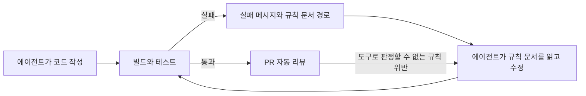

# AI 코딩 에이전트의 코드 컨벤션은 규칙 문서와 결정적 검사로 지킨다

Claude Code나 Codex에 코드를 맡기면 컨벤션을 프롬프트에 적어 두고 싶어진다.
"메서드 안에서 단계마다 빈 줄을 넣어라", "생성자는 롬복으로 줄여라" 같은 문장을 지침 파일에 한 줄씩 더하는 방식이다.
이 글은 그 방식 대신 규칙을 문서 하나에 한 개씩 적고, 도구로 판정할 수 있는 규칙은 빌드와 테스트에서 실패하게 만드는 방식을 정리한다.
프롬프트로 전한 규칙과 AI 리뷰는 같은 코드를 두고도 실행할 때마다 판정이 달라질 수 있다.
빌드와 테스트는 결정적 검사(deterministic check, 같은 코드에는 항상 같은 판정을 내리는 검사)라 판정이 늘 같다.

소재는 Spring Boot 멀티모듈 백엔드 저장소 하나에서 실제로 한 작업이다.
뒤쪽 절에서는 그 저장소가 쓰는 ArchUnit을 기초부터 정리한다.

적용 환경은 다음과 같다.

| 항목 | 버전 |
| --- | --- |
| Java | 25 |
| Spring Boot | 4.1 |
| ArchUnit | 1.4.1 |
| Lombok | 1.18.46 |

코드 인용은 실제 테스트 코드에서 가져왔고, 회사 패키지 이름은 `com.example.app`으로 바꿨다.

## 에이전트가 만든 코드에서 반복된 문제

GPT 계열 모델로 짠 코드를 모듈 네 개에서 점검했다(2026-09-29).
기능은 대부분 동작했지만 읽기 어려운 모양이 반복됐다.

| 문제 | 점검 결과 |
| --- | --- |
| 메서드 안에서 빈 줄 없이 20줄 넘게 이어지는 코드 | 한 모듈에만 33개 |
| 40줄을 넘는 메서드 | 모듈마다 10개 안팎 |
| 필드 대입만 하는 생성자를 손으로 쓴 빈 | 한 모듈에서 21개 |

`@Autowired`를 붙인 생성자와 같은 헬퍼 메서드를 여러 클래스에 복사한 코드도 함께 나왔다.

하나씩 보면 사소하다.
문제는 에이전트가 기존 코드를 보고 다음 코드를 쓴다는 점이다.
손으로 쓴 생성자가 있는 클래스 옆에 새 클래스를 만들면 같은 모양의 생성자가 또 생긴다.
실제로 한 도구 클래스가 생성자와 로거를 손으로 썼고, 비슷한 역할의 다른 도구 클래스가 그 모양을 그대로 따라 썼다.

## 프롬프트에 적는 규칙이 약한 이유

지침 파일에 규칙을 더하는 방식은 처음에는 잘 먹힌다.
규칙이 수십 줄로 늘어나면 에이전트는 그중 일부를 지키지 않는다.
어느 줄을 놓칠지 미리 알 수 없고, 놓쳤다는 사실도 리뷰에서 사람이 발견해야 드러난다.

반대로 빌드가 실패하면 에이전트는 그 메시지를 무시하고 작업을 끝낼 수 없다.
이 저장소의 에이전트 지침은 완료를 선언하기 전에 해당 모듈의 검증 스크립트를 통과시키라고 요구한다.
검증이 실패하면 에이전트는 실패 메시지를 읽고 코드를 고친 뒤 다시 돌린다.
실패 메시지에 규칙 문서의 경로가 들어 있으면 에이전트가 그 문서를 열어 왜 막혔는지까지 읽는다.

이 판단은 측정한 결과가 아니라 사용하면서 얻은 경험에서 나온 추론이다.
프롬프트 규칙이 몇 줄부터 무시되는지 같은 수치는 재지 않았다.



도구로 판정할 수 있는 규칙은 빌드가 막고, 도구로 판정할 수 없는 규칙만 리뷰가 본다.
두 경로 모두 같은 규칙 문서를 가리킨다는 점이 핵심이다.

## 규칙을 위키처럼 관리한다

규칙은 `docs/code-rules/` 아래에 문서 하나당 규칙 하나로 둔다.
목록은 `INDEX.md` 한 파일이 가지고, 에이전트와 사람 모두 이 목록부터 읽는다.

```text
docs/code-rules/
├── INDEX.md    규칙 목록, 문서 형식, 규칙을 늘리는 절차
└── rule-1.md   롬복 사용 범위
```

### 규칙으로 삼는 기준

`INDEX.md`는 규칙이 코드의 상태를 말해야 한다고 정한다.
지금 코드를 보고 어겼는지 판단할 수 있어야 규칙이다.

| 문장 | 규칙 여부 |
| --- | --- |
| 엔티티에 `@Setter`를 붙이지 않는다 | 규칙이다. 코드를 보면 안다 |
| 지우기 전에 호출처를 확인한다 | 규칙이 아니다. 확인했는지는 코드에 남지 않는다 |

겪은 문제만 규칙으로 올리고, 검사 방법을 적을 수 없는 문장은 규칙으로 만들지 않는다.

### 규칙 문서의 구조

규칙 문서는 모두 같은 절을 가진다.

| 절 | 담는 것 |
| --- | --- |
| 제목 | 단정형 한 문장. 제목만 읽어도 무엇을 해야 하는지 안다 |
| 예외 | 규칙이 적용되지 않는 경우 |
| 왜 | 어겼을 때 무엇이 깨지는지 두세 줄 |
| 어겼는지 보는 법 | 실행할 명령과 검사 코드 위치 |
| 리뷰가 보는 것 | 도구로 판정할 수 없어 자동 리뷰가 판단할 것 |
| 실제 사례 | 이 저장소의 코드와 커밋 해시 |

첫 규칙의 제목은 다음과 같다.

> 롬복은 `@Data`, `@Setter`, `@Value`(`lombok.Value`), `@SneakyThrows` 와 엔티티의 `@EqualsAndHashCode`, `@ToString` 을 쓰지 않는다

본문은 금지 목록만 두지 않고 쓰는 쪽도 표로 적는다.
생성자 주입만 하는 빈은 `@RequiredArgsConstructor`, 클래스 이름 로거는 `@Slf4j`, JPA 엔티티는 `@Getter`와 `@NoArgsConstructor(access = AccessLevel.PROTECTED)`를 쓴다.
DTO와 불변 값은 record로 만든다.

예외 절에는 스프링의 `@Value`(설정값 주입)가 이 규칙과 무관하다는 점을 적었다.
이 한 줄이 없으면 리뷰어와 에이전트가 두 `@Value`를 같은 것으로 보고 설정 주입까지 막으려 한다.

### 에이전트와 리뷰가 같은 목록을 읽게 한다

규칙 문서를 만들어도 아무도 열지 않으면 소용이 없다.
그래서 세 곳에서 같은 목록을 가리킨다.

| 읽는 쪽 | 연결 방법 |
| --- | --- |
| 코딩 에이전트 | `AGENTS.md`에 "코드를 쓰거나 리뷰하기 전에 `docs/code-rules/INDEX.md`의 규칙 목록을 본다"는 한 줄 |
| PR 자동 리뷰 | CI에서 Claude Code를 비대화형으로 실행하고, 리뷰 프롬프트가 `INDEX.md`를 읽게 한다 |
| 빌드 | ArchUnit 테스트의 실패 메시지에 규칙 문서 경로를 넣는다 |

이 저장소는 `CLAUDE.md`를 `AGENTS.md`의 심볼릭 링크로 둔다.
Claude Code는 `CLAUDE.md`를, Codex는 `AGENTS.md`를 읽으므로 파일 하나로 두 에이전트가 같은 지침을 받는다.

리뷰 프롬프트의 해당 부분에서 두 줄을 옮긴다.

```text
### 코드 규칙 (docs/code-rules)
docs/code-rules/INDEX.md 의 규칙 목록을 먼저 읽고, diff 에 해당하는 규칙 문서만 열어 본다.
규칙 문서의 「예외」 에 해당하면 지적하지 않는다.
```

두 줄 사이에는 테스트(`CodeRulesTest`)가 막는 규칙은 다시 보지 말고 규칙 문서의 「리뷰가 보는 것」 만 판단하라는 문장이 있다.

리뷰가 테스트와 같은 것을 다시 보지 않도록 역할을 나눈 것이 요점이다.
에이전트에게 모든 규칙 본문을 매번 읽히지 않고, 목록만 읽힌 다음 해당하는 문서만 열게 한다.
[Claude Code 메모리: CLAUDE.md와 .claude/rules를 규칙으로 쓰는 법](../harness/claude-code-memory-rules.md)에서 정리한 것처럼 링크만 걸어 둔 문서는 잘 읽히지 않는다.
그래서 목록 한 파일은 지침에서 직접 가리키고, 실패 메시지에도 경로를 넣는다.

## 결정적 검사는 세 층으로 나눈다

규칙마다 검사할 수 있는 도구가 다르다.
하나의 도구로 모든 규칙을 막으려 하지 않고 층을 나눴다.

| 층 | 보는 것 | 도구 | 동작 | 상태 |
| --- | --- | --- | --- | --- |
| 형식 | 들여쓰기, 줄바꿈, import 순서 | Spotless와 Eclipse 포매터 | 코드를 고친다 | 도입 예정 |
| 밀도 | 메서드 길이, 인자 수, 중첩 깊이, 멤버 사이 빈 줄 | Checkstyle | 검사만 한다 | 도입 예정 |
| 설계 | 금지 메서드, 패키지 순환, 트랜잭션 경계 | ArchUnit | 테스트로 실패시킨다 | 적용됨 |

### 형식: Spotless는 코드를 고친다

Spotless는 Gradle 플러그인이다.
`spotlessCheck`는 형식이 어긋난 파일을 찾아 빌드를 실패시키고, `spotlessApply`는 그 파일을 직접 고친다.
Java 포매터로 `eclipse()`를 고르면 `configFile(...)`로 Eclipse 포매터 설정 파일을 줄 수 있다.
팀이 쓰던 IntelliJ 코드 스타일을 Eclipse 포매터 설정으로 옮겨 쓰는 것이 계획이다.

포매터를 고르기 전에 palantir-java-format을 저장소 복사본에 적용해 봤다.
들여쓰기와 줄바꿈은 정리됐지만 메서드 안에 빈 줄을 넣어 주지는 않았다.
포매터는 이미 있는 빈 줄을 유지하거나 줄일 수는 있어도, 어디서 단계가 바뀌는지는 알지 못한다.

그래서 빈 줄 없이 붙은 메서드 문제는 포매터가 해결하지 못한다.
이 문제는 메서드 길이 제한과 리뷰가 맡는다.
메서드가 짧으면 빈 줄로 단계를 나눌 필요 자체가 줄어든다.

### 밀도: Checkstyle은 검사만 한다

Checkstyle은 코드를 고치지 않고 위반을 보고만 한다.
그래서 에이전트가 실패 메시지를 읽고 메서드를 나누는 작업을 직접 해야 한다.
길이를 줄이는 방법은 여러 가지라 도구가 고쳐 줄 수 없는 영역이다.

쓰려는 검사는 다음과 같다.

| 검사 | 보는 것 | 공식 문서의 기본값 |
| --- | --- | --- |
| `MethodLength` | 메서드와 생성자의 줄 수 | 150줄 |
| `ParameterNumber` | 메서드 인자 수 | 7개 |
| `NestedIfDepth` | if-else 중첩 깊이 | 1 |
| `EmptyLineSeparator` | 필드, 메서드 같은 멤버 뒤의 빈 줄 | 멤버 사이 빈 줄 요구, 여러 줄 빈 줄은 허용 |

`EmptyLineSeparator`는 멤버 사이의 빈 줄을 보는 검사다.
메서드 안에 빈 줄을 요구하지는 않는다.
메서드 안의 빈 줄은 결국 사람이나 자동 리뷰가 봐야 한다.

기본값 150줄은 이 저장소 기준으로 너무 느슨하다.
점검에서 40줄을 넘는 메서드가 모듈마다 10개 안팎이었으므로, 기준값을 정할 때 이 분포를 함께 본다.

### 설계: ArchUnit은 테스트로 막는다

형식과 밀도는 한 파일 안에서 판단할 수 있다.
"public setter를 두지 않는다", "기능 패키지끼리 순환하지 않는다"는 클래스 사이의 관계를 봐야 판단할 수 있다.
이 층은 ArchUnit이 맡고, 이 저장소에는 이미 테스트 세 개가 있다.
다음 절에서 ArchUnit 자체를 정리하고, 그 뒤에 세 테스트를 사례로 본다.

## ArchUnit 기초

이 절은 ArchUnit 공식 사용자 가이드를 기준으로 썼다.
2026-09-29에 확인한 가이드는 1.5.1 버전이고, 저장소가 쓰는 버전은 1.4.1이다.
두 버전의 차이를 전부 비교하지는 않았다.
이 절의 API는 저장소 테스트가 1.4.1로 컴파일되고 통과하는 것으로 확인했고, 설치 아티팩트가 다른 점만 따로 적는다.

### ArchUnit이 하는 일

ArchUnit은 컴파일된 `.class` 파일을 읽어 클래스, 메서드, 필드와 그 사이의 의존 관계를 객체로 만든다.
그 객체에 대해 "이 패키지는 저 패키지에 의존하지 않는다" 같은 규칙을 검사하고, 결과를 JUnit 테스트의 성공과 실패로 돌려준다.

Java 개발자에게 익숙한 말로 옮기면 아키텍처 규칙을 위한 AssertJ에 가깝다.
대상이 값이 아니라 코드 구조라는 점만 다르다.

소스 코드가 아니라 바이트코드를 읽는다는 점이 중요하다.
컴파일 뒤 사라지는 정보는 ArchUnit이 볼 수 없다.
뒤의 "자주 틀리는 부분"에서 이 성질 때문에 생긴 문제를 다룬다.

### 설치

Gradle에 테스트 의존성 하나를 더한다.

```kotlin
dependencies {
    testImplementation("com.tngtech.archunit:archunit-junit5:1.4.1")
}
```

`archunit-junit5`는 규칙을 쓰는 API와 JUnit Platform에서 도는 테스트 엔진을 함께 가져온다.
1.5.1 가이드는 JUnit 6용 `archunit-junit6` 아티팩트를 기본으로 보여 주고, JUnit 5용은 주석으로 남겨 뒀다.

### `@AnalyzeClasses`와 `@ArchTest`

JUnit 지원을 쓰면 가져올 클래스를 `@AnalyzeClasses`로 선언하고, 규칙을 `@ArchTest` 필드로 둔다.

```java
@AnalyzeClasses(packages = "com.example.app", importOptions = ImportOption.DoNotIncludeTests.class)
class CodeRulesTest {

    @ArchTest
    static final ArchRule no_public_setters = noMethods()
            .that().arePublic().and().haveNameMatching("set[A-Z].*")
            .should().beDeclaredInClassesThat().resideInAPackage("com.example.app..")
            .because("상태는 이름 있는 메서드로만 바꾼다 (docs/code-rules/rule-1.md)");
}
```

가이드에 따르면 JUnit 지원은 지정한 클래스를 가져오거나 이미 가져온 것을 재사용해 `@ArchTest`가 붙은 규칙을 모두 평가한다.
`ImportOption.DoNotIncludeTests`는 테스트 클래스를 검사 대상에서 뺀다.

`@ArchTest` 없이 일반 JUnit 테스트로 써도 된다.
`ClassFileImporter`로 클래스를 가져와 규칙의 `check(...)`에 넘기는 방식이다.

```java
@Test
void functionalPackagesAreFreeOfCycles() {
    slices().matching("com.example.app.(*)..")
            .should().beFreeOfCycles()
            .check(new ClassFileImporter()
                    .withImportOption(new ImportOption.DoNotIncludeTests())
                    .importPackages("com.example.app"));
}
```

두 방식의 차이는 가져온 클래스를 재사용하는지에 있다.
`ClassFileImporter`를 테스트마다 부르면 그때마다 클래스 파일을 다시 읽는다.
규칙이 많고 대상 패키지가 크면 `@AnalyzeClasses` 쪽이 테스트 시간을 덜 쓸 것으로 본다. 직접 측정하지는 않았다.

### 규칙 문법: `that`과 `should`

규칙은 `ArchRuleDefinition`의 정적 메서드로 시작한다.

| 시작 | 뜻 |
| --- | --- |
| `classes()` | 조건에 맞는 클래스는 모두 이래야 한다 |
| `noClasses()` | 조건에 맞는 클래스는 하나도 이러면 안 된다 |
| `methods()`, `noMethods()` | 같은 뜻을 메서드에 적용한다 |
| `fields()`, `noFields()` | 같은 뜻을 필드에 적용한다 |

그 뒤는 세 부분으로 읽는다.

- `that()` 뒤에는 검사할 대상을 고르는 조건이 온다. SQL의 `WHERE`에 가깝다.
- `should()` 뒤에는 그 대상이 만족해야 할 조건이 온다. 테스트의 단언에 해당한다.
- `because(...)`는 실패 메시지에 붙을 이유다. 규칙 문서 경로를 여기에 넣는다.

`and()`와 `or()`로 조건을 잇는다.

```java
noClasses().that().resideInAPackage("..service..")
        .should().dependOnClassesThat().resideInAPackage("..controller..");
```

패키지 표기에서 `..`은 임의 깊이의 패키지를 뜻한다.
`"..service.."`는 이름에 `service` 패키지가 들어간 모든 패키지와 그 하위 패키지를 가리킨다.

### 계층 규칙: `layeredArchitecture`

컨트롤러, 서비스, 영속성 계층의 호출 방향처럼 계층 구조가 있으면 규칙을 하나씩 쓰지 않고 계층을 선언한다.
가이드의 예시는 다음과 같다.

```java
layeredArchitecture()
    .consideringAllDependencies()
    .layer("Controller").definedBy("..controller..")
    .layer("Service").definedBy("..service..")
    .layer("Persistence").definedBy("..persistence..")

    .whereLayer("Controller").mayNotBeAccessedByAnyLayer()
    .whereLayer("Service").mayOnlyBeAccessedByLayers("Controller")
    .whereLayer("Persistence").mayOnlyBeAccessedByLayers("Service");
```

계층을 패키지로 정의하고, 어느 계층이 어느 계층을 호출해도 되는지 적는다.
Hexagonal 구조에 적용하는 예시는 [Hexagonal / Clean Architecture를 Spring 백엔드에 적용하기](../../architecture/patterns/hexagonal-clean-architecture-spring.md)에 있다.

### 순환 규칙: `slices().beFreeOfCycles()`

`slices()`는 클래스를 패키지 이름으로 묶는다.
`matching("com.example.app.(*)..")`에서 괄호로 잡은 부분이 묶음의 이름이 된다.
`com.example.app.order.domain`과 `com.example.app.order.api`는 모두 `order` 묶음에 들어간다.

`beFreeOfCycles()`는 묶음 사이에 `order → payment → order` 같은 순환 의존이 없어야 한다는 조건이다.
기능 패키지 사이의 순환은 나중에 모듈을 떼어 내거나 한 기능만 바꿀 때 비용이 된다.

### 사용자 조건: `DescribedPredicate`

기본 제공 조건으로 표현할 수 없는 대상은 `DescribedPredicate`로 직접 만든다.
생성자에 넘기는 문자열이 실패 메시지에 들어가는 설명이 된다.

```java
private static final DescribedPredicate<JavaClass> USES_NEO4J_CLIENT =
        new DescribedPredicate<>("Neo4jClient에 의존하는 클래스") {
            @Override
            public boolean test(JavaClass type) {
                return type.getDirectDependenciesFromSelf().stream()
                           .anyMatch(dependency -> dependency.getTargetClass().isEquivalentTo(Neo4jClient.class));
            }
        };
```

`getDirectDependenciesFromSelf()`는 이 클래스가 직접 의존하는 대상을 돌려준다.
필드 타입, 메서드 호출, 메서드 인자 타입처럼 바이트코드에 남는 의존이 들어간다.
만든 조건은 `noClasses().that(USES_NEO4J_CLIENT)`처럼 `that(...)`에 넣는다.

### 빈 대상: `allowEmptyShould`

ArchUnit은 기본적으로 `should()`에 넘어간 대상이 비어 있으면 규칙을 실패시킨다.
가이드는 그 이유를 패키지 이름 변경으로 설명한다.
`classes().that().resideInAPackage("com.myapp.old")` 규칙이 있는데 `old` 패키지 이름을 바꾸면, 이 규칙은 아무 클래스도 검사하지 않으면서 계속 통과한다.

금지 규칙에서는 이 기본값이 불편하다.
public setter를 금지하는 규칙은 setter가 하나도 없는 상태가 정상인데, 그러면 대상이 비어 규칙이 실패한다.
그래서 규칙마다 `.allowEmptyShould(true)`를 붙이거나, `archunit.properties`에 `archRule.failOnEmptyShould=false`를 둬 전체에 적용한다.

전체 설정보다 규칙마다 붙이는 쪽이 낫다.
패키지 이름을 바꿔 검사 대상이 사라지는 사고를 다른 규칙에서는 계속 잡을 수 있기 때문이다.

### 기존 위반 동결: `FreezingArchRule`

오래된 코드에 규칙을 새로 걸면 위반이 수백 개씩 나온다.
한 번에 고칠 수 없으니 지금 있는 위반은 기록해 두고 새 위반만 막는다.

```java
ArchRule rule = FreezingArchRule.freeze(classes().should()./* 규칙 */);
```

가이드에 따른 동작은 다음과 같다.

- 첫 실행에서 모든 위반을 `ViolationStore`에 기록한다. 기본 저장소는 텍스트 파일이라 버전 관리에 올릴 수 있다.
- 다음 실행부터는 새 위반만 보고한다.
- 기록된 위반을 고치면 저장소에 기록된 위반도 자동으로 줄인다. 고친 위반이 되살아나는 회귀를 막기 위해서다.
- 기본값은 줄 번호를 무시한다. 위반 코드가 다른 줄로 옮겨 가도 기존 위반으로 본다.

저장소 파일을 새로 만드는 설정 `freeze.store.default.allowStoreCreation`의 기본값은 `false`다.
처음 한 번은 이 값을 `true`로 켜서 만들고, CI에서는 끈 채로 둔다.
그래야 CI가 저장소 파일을 잘못 새로 만들어 모든 위반을 기존 위반으로 받아들이는 일이 없다.

## 저장소의 ArchUnit 사례

이 저장소의 ArchUnit 테스트 세 개를 규칙 문서와 함께 본다.

### public setter와 엔티티 메서드 금지

규칙 1은 롬복의 `@Setter`, `@Data`와 엔티티의 `@EqualsAndHashCode`, `@ToString`을 금지한다.
그런데 ArchUnit으로 이 애노테이션을 직접 찾을 수 없다.
롬복 애노테이션은 모두 `@Retention(RetentionPolicy.SOURCE)`라 컴파일러가 클래스 파일에 남기지 않는다.
Lombok 1.18.46 jar를 `javap -v`로 열어 `Setter`, `Data`, `SneakyThrows`, `Value`, `EqualsAndHashCode`, `ToString` 모두 `SOURCE`인 것을 확인했다.

그래서 애노테이션 대신 롬복이 만든 결과를 검사한다.

```java
@ArchTest
static final ArchRule no_public_setters = noMethods()
        .that().arePublic().and().haveNameMatching("set[A-Z].*")
        .should().beDeclaredInClassesThat().resideInAPackage("com.example.app..")
        .allowEmptyShould(true)
        .because("상태는 이름 있는 메서드로만 바꾼다 (docs/code-rules/rule-1.md)");

@ArchTest
static final ArchRule entities_do_not_declare_equals_hash_code_to_string = noMethods()
        .that().haveName("equals").or().haveName("hashCode").or().haveName("toString")
        .should().beDeclaredInClassesThat().areAnnotatedWith("jakarta.persistence.Entity")
        .allowEmptyShould(true)
        .because("지연 로딩 연관과 영속성 식별이 섞인다 (docs/code-rules/rule-1.md)");
```

이렇게 검사하면 손으로 쓴 setter와 엔티티의 `equals`도 함께 걸린다.
규칙 문서는 이것을 의도한 결과로 적었다.
손으로 쓴 `equals`, `toString`도 지연 로딩 연관을 건드리는 문제가 같기 때문이다.

반대로 롬복 `@Value`와 `@SneakyThrows`는 이 방식으로도 잡지 못한다.
규칙 문서의 "리뷰가 보는 것" 절이 이 두 가지를 자동 리뷰에 넘긴다.

### 기능 패키지 순환 금지

센서 데이터를 다루는 모듈에서 기능 패키지 사이에 순환이 생겼다.
상수 하나를 다른 패키지로 옮겨 순환을 끊고, 다시 생기지 않도록 테스트를 두었다.
앞의 `slices().matching(...).should().beFreeOfCycles()` 예시가 그 테스트다.

순환은 리뷰에서 발견하기 어렵다.
diff에 보이는 것은 import 한 줄이고, 그 한 줄이 반대 방향 의존과 맞물려 순환이 된다는 사실은 diff 밖에 있다.
이런 규칙이 결정적 검사에 잘 맞는다.

### Neo4j 클래스의 기본 트랜잭션 금지

이 저장소의 한 모듈은 Postgres와 Neo4j를 함께 쓴다.
트랜잭션 관리자가 둘인데, 이름 없이 `@Transactional`을 붙이면 기본 관리자인 JPA 쪽이 잡힌다.
그러면 Neo4j에 쓰는 코드가 트랜잭션 없이 쿼리마다 커밋된다.

그래서 Neo4j 쪽 관리자를 지정한 메타 애노테이션 `@Neo4jTransactional`을 만들고, `Neo4jClient`를 쓰는 클래스에는 기본 `@Transactional`을 금지했다.

```java
@Target({ElementType.METHOD, ElementType.TYPE})
@Retention(RetentionPolicy.RUNTIME)
@Transactional("neo4jTransactionManager")
public @interface Neo4jTransactional {
}
```

처음 만든 테스트는 메서드만 봤다.

```java
noMethods().that().areDeclaredInClassesThat(USES_NEO4J_CLIENT)
           .should().beAnnotatedWith(Transactional.class)
           .check(productionClasses());
```

PR 자동 리뷰가 이 테스트의 빈틈을 지적했다.
클래스에 `@Transactional`을 붙이면 모든 메서드가 기본 관리자로 묶이는데, 이 테스트는 메서드에 직접 붙은 애노테이션만 보므로 통과한다는 내용이었다.
같은 조건으로 클래스를 보는 규칙을 하나 더 두었다.

```java
// 클래스에 붙인 @Transactional 도 모든 메서드를 기본(JPA) 관리자로 묶는다.
noClasses().that(USES_NEO4J_CLIENT)
           .should().beAnnotatedWith(Transactional.class)
           .check(productionClasses());
```

## 자주 틀리는 부분

앞의 사례에서 나온 실수를 ArchUnit 일반의 주의점으로 정리한다.

### SOURCE 보존 애노테이션은 보이지 않는다

`@Retention(RetentionPolicy.SOURCE)` 애노테이션은 클래스 파일에 없다.
ArchUnit은 클래스 파일을 읽으므로 `areAnnotatedWith(Setter.class)` 같은 규칙은 위반이 있어도 통과한다.
롬복이 대표적이다.
애노테이션 대신 그 애노테이션이 만든 메서드나 필드를 검사한다.

애노테이션뿐 아니라 컴파일 과정에서 바뀌는 코드도 같다.
규칙 1 문서에는 `@SneakyThrows`를 의존 관계로 잡으려던 검사가 위반을 넣어도 통과해 뺐다는 기록이 있다.
컴파일 뒤 롬복 호출이 바이트코드에서 지워졌기 때문이다(2026-09-28 확인).

### 메서드 규칙은 클래스 애노테이션을 보지 않는다

`noMethods().should().beAnnotatedWith(X.class)`는 메서드에 직접 붙은 `X`만 본다.
Spring의 `@Transactional`처럼 클래스에 붙여 모든 메서드에 적용되는 애노테이션은 따로 `noClasses()` 규칙이 필요하다.
Spring은 클래스에 붙은 애노테이션을 메서드에도 적용하지만, ArchUnit의 메서드 규칙은 메서드 자신에게 붙은 애노테이션만 본다.

### `areAnnotatedWith`와 `areMetaAnnotatedWith`는 다르다

메타 애노테이션은 다른 애노테이션에 붙은 애노테이션이다.
`@Neo4jTransactional` 위의 `@Transactional`이 그렇다.

| 메서드 | 매치하는 것 |
| --- | --- |
| `areAnnotatedWith(X.class)`, `beAnnotatedWith(X.class)` | `X`가 직접 붙은 대상 |
| `areMetaAnnotatedWith(X.class)`, `beMetaAnnotatedWith(X.class)` | `X`가 직접 붙었거나, `X`가 붙은 애노테이션이 붙은 대상 |

ArchUnit 1.4.1 소스의 `ClassesThat` Javadoc은 `areMetaAnnotatedWith`가 직접 붙은 대상도 매치한다고 적는다.

트랜잭션 규칙에서는 이 차이가 의도대로 쓰였다.
`beAnnotatedWith(Transactional.class)`는 직접 붙은 기본 `@Transactional`만 막고, `@Neo4jTransactional`은 통과시킨다.
실제로 `Neo4jClient`를 필드로 가진 서비스 메서드에 `@Neo4jTransactional`이 붙어 있는 상태에서 이 테스트가 CI에서 통과했다.
여기서 `beMetaAnnotatedWith`를 썼다면 허용하려던 `@Neo4jTransactional`까지 막혔을 것이다.

반대로 `@Service`처럼 `@Component`를 메타 애노테이션으로 가진 스프링 빈을 모두 고르려면 `areMetaAnnotatedWith(Component.class)`를 써야 한다.
어느 쪽을 쓸지는 허용할 애노테이션과 막을 애노테이션을 먼저 적어 보고 정한다.

### 빈 대상 설정이 검사를 무력화한다

`allowEmptyShould(true)`를 붙인 규칙은 대상 패키지 이름이 바뀌어도 통과한다.
금지 규칙에 필요한 설정이지만, 그만큼 검사가 실제로 도는지는 다른 방법으로 확인해야 한다.

## 검사를 만들면 일부러 어겨 본다

앞의 실수는 모두 같은 특징이 있다.
검사 코드가 있고 테스트가 통과하는데, 위반이 들어와도 통과한다.
테스트가 통과한다는 사실만으로는 규칙이 지켜지는지, 검사가 아무것도 보지 않는지 구분할 수 없다.

그래서 규칙 목록 문서에 다음 원칙을 적었다.

> 검사를 고치면 일부러 위반을 만들어 잡히는지 확인한다.

방법은 단순하다.

1. 검사 대상 클래스에 위반을 하나 넣는다. 엔티티에 `@Setter`를 붙이는 식이다.
2. 테스트를 돌려 실패하는지, 실패 메시지에 규칙 문서 경로가 나오는지 본다.
3. 위반을 되돌린다.

`@SneakyThrows` 검사는 이 절차에서 위반을 넣어도 통과했고, 그래서 테스트에서 빼고 리뷰로 넘겼다.
통과하지 않는 검사를 남겨 두면 에이전트와 사람 모두 그 규칙이 지켜지고 있다고 믿게 된다.

## 기존 위반은 동결하고 새 위반만 막는다

밀도 규칙을 지금 걸면 기존 메서드가 한꺼번에 실패한다.
에이전트에게 "빌드를 통과시켜라"고 하면 관계없는 파일 수십 개를 고치는 PR이 나온다.
리뷰하기 어렵고, 동작을 바꾸지 않았는지 확인하는 비용도 크다.

그래서 도구마다 기존 위반을 목록으로 남기고 새 위반만 실패시키는 방식을 쓸 계획이다.
아직 도입하지 않았다.

| 도구 | 기존 위반 목록 | 새 위반 |
| --- | --- | --- |
| ArchUnit | `FreezingArchRule`의 `ViolationStore` 파일 | 테스트 실패 |
| Checkstyle | suppression 파일(`SuppressionFilter`)에 파일과 검사 이름을 적는다 | 빌드 실패 |
| Spotless | `ratchetFrom`으로 기준 브랜치 이후 바뀐 파일만 검사한다 | `spotlessCheck` 실패 |

목록은 줄어들기만 해야 한다.
기존 코드를 고칠 일이 생겼을 때 그 파일을 목록에서 빼고 함께 정리한다.
`FreezingArchRule`은 고친 위반을 자동으로 목록에서 지우지만, Checkstyle suppression 파일은 사람이 직접 지워야 한다.

## 정리

에이전트가 컨벤션을 지키게 하는 방법을 세 가지로 나눴다.

- 규칙은 문서 하나에 하나씩 두고, 목록 한 파일을 에이전트 지침과 자동 리뷰가 함께 가리킨다.
- 도구로 판정할 수 있는 규칙은 형식, 밀도, 설계 세 층으로 나눠 빌드와 테스트에서 실패시킨다.
- 도구로 판정할 수 없는 규칙만 규칙 문서의 "리뷰가 보는 것" 절에 적어 리뷰에 넘긴다.

지금 이 저장소에서 실제로 도는 것은 ArchUnit 테스트 세 개와 규칙 문서, 자동 리뷰다.
Spotless와 Checkstyle, 기존 위반 동결은 도입 전이다.
도입하고 나면 빈 줄 없이 붙은 메서드와 40줄 넘는 메서드 수가 어떻게 바뀌는지 다시 점검할 계획이다.

에이전트 지침 파일의 형식은 [agents.md](../harness/agents-md-format.md)에, 에이전트 주변 구조를 코드 규칙으로 옮기는 흐름은 [하네스 엔지니어링 — 오래 실행되는 AI 에이전트를 위한 설계](../harness/harness-engineering.md)에 정리했다.

## 참고 자료

- [ArchUnit User Guide](https://www.archunit.org/userguide/html/000_Index.html) — 2026-09-29 확인, 1.5.1 기준
- [ArchUnit `ClassesThat` 소스 (v1.4.1)](https://github.com/TNG/ArchUnit/blob/v1.4.1/archunit/src/main/java/com/tngtech/archunit/lang/syntax/elements/ClassesThat.java)
- [Spotless Gradle 플러그인](https://github.com/diffplug/spotless/tree/main/plugin-gradle)
- [Checkstyle MethodLength](https://checkstyle.org/checks/sizes/methodlength.html)
- [Checkstyle ParameterNumber](https://checkstyle.org/checks/sizes/parameternumber.html)
- [Checkstyle NestedIfDepth](https://checkstyle.org/checks/coding/nestedifdepth.html)
- [Checkstyle EmptyLineSeparator](https://checkstyle.org/checks/whitespace/emptylineseparator.html)
- [Checkstyle SuppressionFilter](https://checkstyle.org/filters/suppressionfilter.html)
