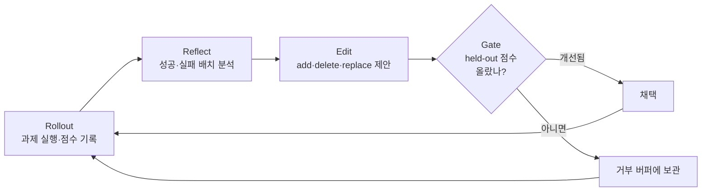

# 스킬 문서를 신경망처럼 학습시킨다 — Microsoft SkillOpt 분석

나는 Claude Code 위에서 30개가 넘는 개인 스킬(skill)을 운영한다.
블로그 글 작성, 이력서 갱신, 주간보고, 사내 결재 자동화 같은 반복 워크플로우를 각각 `SKILL.md` 한 장으로 정의해두고 쓴다.
이 스킬들은 시간이 지나면서 점점 커진다.
한 번 실수하면 "이런 함정이 있더라"를 문서에 적어두고, 다음에 같은 실수를 피하는 식이다.

그런데 이 개선 방식에는 두 가지 약점이 있다.

- 문서가 **커지기만 한다** — 항목을 추가하지 삭제하지는 않는다.
- 그 편집이 **정말 개선인지 검증하는 단계가 없다** — 추가한 규칙이 오히려 다른 케이스를 망칠 수도 있다.

Microsoft가 공개한 **SkillOpt**는 정확히 이 문제를 정조준한다.
"스킬 문서를 신경망 가중치처럼 학습시킨다"는 도발적인 발상인데, 공부해보니 내 스킬 운영 방식에 그대로 빌려올 규율이 들어 있었다.
이 글은 SkillOpt가 무엇이고, 어떤 전제 위에서 동작하며, 채점이 어려운 개인 워크플로우에는 어디까지 적용할 수 있는지 정리한 학습 노트다.

## SkillOpt가 푸는 문제

에이전트 스킬은 보통 세 가지 방식으로 만들어진다.

- 사람이 손으로 작성한다.
- LLM이 한 번 생성하고 끝낸다.
- 에이전트가 스스로 고쳐쓰는데, 통제 장치가 없다.

세 방식 모두 공통점이 있다.
**규율 있는 옵티마이저(optimizer)처럼 동작하지 않는다.**
개선이 일어나도 그게 진짜 개선인지 믿을 근거가 없고, 문서는 점점 비대해진다.

SkillOpt의 핵심 통찰은 이 지점에 있다.
가중치 학습이 재현 가능한 이유는 epoch, mini-batch, learning rate, validation 같은 **규율** 때문이다.
그렇다면 스킬 문서라는 텍스트에도 같은 규율을 입히면 되지 않겠는가.

> 모델 가중치는 건드리지 않는다. 학습되는 것은 오직 스킬 문서 한 장이다.

모델은 얼어붙은(frozen) 상태로 두고, **별도의 옵티마이저 모델**이 스킬 문서를 고친다.
타깃 모델은 그대로, 스킬 문서만 학습 대상이 된다.

## 학습 루프 — 가중치 학습을 텍스트로 옮기다

SkillOpt의 학습 루프는 머신러닝 학습 사이클을 거의 그대로 베껴왔다.



각 단계를 풀면 이렇다.

- **Rollout** — 타깃 모델이 과제를 실행하고, 그 결과를 채점해 궤적(trajectory)과 점수를 기록한다.
- **Reflect** — 옵티마이저 모델이 성공 배치와 실패 배치를 따로 분석한다.
- **Edit** — 분석을 바탕으로 스킬 문서에 add / delete / replace 편집안을 제안하고 순위를 매긴다.
- **Gate** — 후보 편집은 **따로 떼어둔 검증셋**(held-out) 점수가 엄격히 올라갈 때만 채택된다.

여기서 가장 중요한 단어가 **Gate**다.
편집을 제안하는 것은 쉽다. 그 편집이 진짜 개선인지 가르는 관문이 학습의 신뢰성을 만든다.

## 학습을 안정시키는 네 장치

루프 자체보다 이 루프를 떠받치는 안정화 장치가 SkillOpt의 진짜 알맹이다.
가중치 학습에서 발산을 막는 기법들을 텍스트 편집으로 번역했다.

| 장치 | 역할 | 가중치 학습 대응 |
|---|---|---|
| 편집 예산 제한 | 한 번에 가하는 add/delete/replace 양을 묶어둠 | learning rate |
| Validation gate | held-out 점수가 엄격히 오를 때만 채택 | early stopping |
| 거부 편집 버퍼 | 탈락한 편집을 기억해 같은 실수 반복 방지 | momentum·history |
| epoch 단위 meta 업데이트 | 천천히 누적 반영 | slow weights |

특히 **편집 예산 제한**을 SkillOpt는 "텍스트 learning rate"라고 부른다.
한 번에 문서를 통째로 갈아엎으면 파괴적 재작성(destructive rewrite)이 일어난다.
편집량을 제한하면 문서가 가소성(plasticity)을 유지하면서도 안정적으로 수렴한다.
learning rate가 너무 크면 학습이 발산하는 것과 똑같은 원리다.

## 성능과 산출물

논문급 실험 규모로 검증했다.

- 7개 타깃 모델 × 6개 벤치마크 × 3개 실행 환경 = 52개 조합
- 실행 환경은 직접 채팅, Codex CLI, 그리고 **Claude Code CLI** 세 가지
- 52개 조합 전부에서 best 또는 동률 1위
- 무(無)스킬 대비 정확도 +19 ~ +25점

벤치마크는 SearchQA, Sheet, Office, DocVQA, LiveMath, ALFWorld로 구성됐다.
검색 기반 질의응답, 스프레드시트 자동화, 문서 분석, 수학 풀이, 가정 내 과제 계획 같은 **정답을 채점할 수 있는** 영역들이다.

산출물은 단 하나다.
**`best_skill.md`** — 보통 300 ~ 2,000 토큰의 컴팩트한 스킬 문서다.
추론 시점에 추가 모델 호출 0회로 타깃 모델에 그대로 붙여 쓴다.
학습할 때만 옵티마이저 모델이 비용을 쓰고, 배포된 산출물은 가벼운 텍스트 한 장이라는 점이 깔끔하다.

## SkillOpt-Sleep — 코딩 에이전트의 야간 정리

본체보다 내 워크플로우에 훨씬 가까운 건 **SkillOpt-Sleep**이다.
코딩 에이전트를 위한 야간 정리(nightly consolidation) 사이클이다.

흐름은 이렇다.

- 지난 세션 기록을 수집한다.
- 반복되는 과제 패턴을 채굴한다.
- API 예산 안에서 오프라인으로 재실행한다.
- reflect → 제한된 편집 → **실제 held-out 과제로 GATE** 순서로 정리한다.
- 통과한 편집안을 검토용으로 staging 한다.
- 사람이 채택 여부를 결정한다.

결정적으로 **Claude Code 플러그인을 공식 제공한다**.

```bash
/plugin marketplace add ./plugins/claude-code
/sleep
```

내가 매일 쌓는 세션 기록을 밤사이 훑어서, 반복 패턴을 찾고, 게이트를 통과한 편집안만 골라 올려준다.
나는 아침에 보고 채택 여부만 정한다.
gbrain-evals의 `skillopt-v1` 벤치마크 테스트에서는 결함 있는 스킬이 held-out 평가 기준 0.00에서 1.00으로 올랐다(Claude·Codex 양쪽, 4개 시드 전부).

## 내 스킬 운영 방식과 겹치는 지점

공부하면서 흥미로웠던 건, 내가 이미 SkillOpt의 문제의식을 절반쯤 손으로 구현해두고 있었다는 점이다.

| 내가 이미 하는 것 | SkillOpt가 더하는 것 |
|---|---|
| 스킬 사용 후 회고 → `SKILL.md` 직접 수정 | 회고를 자동화 + 편집을 게이트로 검증 |
| 같은 피드백 2회 반복 시 공통 함정 문서로 승격 | 거부 편집 버퍼로 자동 누적·회피 |
| 스킬에 함정 사례를 계속 추가 | 편집 예산 제한으로 문서 비대화 방지 |

SkillOpt 문서가 콕 집어 비판하는 **통제되지 않은 self-revision으로 진화하는 스킬** — 그게 정확히 지금 내 스킬 개선 방식이다.
이 누적식 개선은 [Claude Code를 5주 더 쓴 결과](./claude-code-usage-reflection-2.md)에서 정리한 "스킬·CLAUDE.md를 키워가는 방식"과 같은 흐름이다.
회고가 누적될수록 문서는 커지기만 하고, 그 편집이 정말 개선인지 검증하는 단계가 없다.
SkillOpt는 바로 그 비대화와 무검증에 두 개의 브레이크를 단다.
편집 예산 제한으로 문서가 무한정 커지는 것을 막고, 검증 게이트로 회귀를 막는다.

## 결정적 걸림돌 — 채점할 수 있어야 한다

여기서 현실의 벽을 만난다.
SkillOpt를 실제로 돌리려면 **채점 함수**(reward)와 **held-out 검증셋**이 반드시 있어야 한다.
과제마다 세 가지를 구현해야 한다.

- `dataloader.py` — 과제 인스턴스를 로드한다.
- `rollout.py` — 스킬을 과제에 대고 실행한다.
- `initial.md` — 시드 스킬 문서.

그리고 rollout 결과를 채점하는 reward 함수가 있어야 학습 신호가 생긴다.
이 reward와 held-out 검증셋은 [LLM 평가 프레임워크](./llm-evaluation-framework.md)에서 다룬 골든셋·회귀 테스트와 같은 인프라를 요구한다.
바로 이 지점에서 내 스킬 대부분이 탈락한다.

| 스킬 유형 | 자동 채점 가능? | 이유 |
|---|---|---|
| 브라우저 결재 자동화 | 불가 | 부수효과·승인 흐름이라 정답이 없음 |
| 대화형·사람 개입 워크플로우 | 불가 | "좋은 답글"의 정답 데이터가 없음 |
| 외부 시스템 연동 CLI | 불가 | 실행할 때마다 시스템 상태가 변함 |
| 규칙 기반 산출물 | 일부 가능 | lint·스타일 위반 수를 점수로 환산 가능 |

내 스킬의 8할은 "점수"라는 개념 자체가 성립하지 않는다.
사람이 미리보기를 보고 confirm 하는 흐름이 핵심인 워크플로우는, 자동 채점 루프와 근본적으로 맞물리지 않는다.
SkillOpt가 벤치마크로 고른 영역(검색·수학·스프레드시트)이 전부 **정답이 명확한 과제**라는 점이 이 한계를 역으로 보여준다.

## 그래도 적용할 수 있는 곳

채점 가능성이 보이는 스킬이 몇 개 있다. 여기가 진짜 기회다.

### 문서 감사형 스킬 — lint 결과가 곧 reward

문서 건전성을 검사하는 스킬은 이미 객관적 신호를 가진다.
broken link 0건, orphan 문서 0건, 취소선 오발동 0건 — 전부 자동으로 측정된다.
이 측정값을 reward로 삼으면 "감사 규칙 문서"를 SkillOpt로 학습시켜 놓치는 위반 패턴을 줄이는 실험이 가능하다.

### 스타일 규칙 기반 글쓰기 스킬 — 체크리스트를 점수로

마크다운 가독성 규칙, 한국어 스타일 규칙은 거의 채점표 형태다.
한 문장 한 줄(semantic line break) 위반 수, 콤마 3개 이상 나열 수, 명사형 종결 수 같은 위반 항목을 세면 그대로 rollout 채점이 된다.
위반 수가 낮을수록 높은 점수를 주는 reward 함수를 짜면 학습 신호가 만들어진다.

### 가장 현실적인 진입로 — SkillOpt-Sleep만 얹기

전체 학습 루프를 구축하는 대신, Claude Code 플러그인 `/sleep`만 설치하는 길이 있다.

- 내 세션 기록에서 반복 패턴을 채굴한다.
- 게이트를 통과한 편집 제안만 staging 한다.
- 나는 채택 여부만 결정한다.

이건 내 기존 수동 회고 루프를 자동화하는 것이고, 채점 부담이 본체보다 훨씬 가볍다.

## 지금 보면 — 도구가 아니라 규율로 받아들이기

공부를 마치고 든 생각은, SkillOpt를 "설치할 도구"로만 보면 핵심을 놓친다는 것이다.

당장 큰 이점은 도구 설치가 아니라 **규율의 차용**에 있다.
내 회고 루프는 편집을 추가만 하고 검증은 하지 않았다.
여기에 SkillOpt의 두 가지 발상을 의식적으로 끼워넣을 수 있다.

- **이 편집이 직전 버전 대비 정말 개선인가** — 검증 게이트를 한 단계 추가한다.
- **문서가 커지기만 하는가** — 편집 예산을 정해 비대화를 막는다.

내 공통 함정 문서 승격 규칙은 이미 거부 편집 버퍼와 같은 발상이니, 그건 잘 가고 있던 셈이다.

현실적인 순서는 이렇게 잡았다.

- **지금** — 철학만 차용한다. 회고로 스킬을 고칠 때 "이게 직전보다 나은가"를 의식적으로 묻는다.
- **가볍게** — `/sleep` 플러그인을 저위험 저장소에서 한 번 돌려보고 제안 품질을 본다.
- **여력이 생기면** — 문서 감사형 스킬을 첫 본체 학습 대상으로 삼는다. 채점 신호(lint 결과)가 이미 있어서 학습 환경 구축 비용이 가장 낮다.

스킬을 가중치처럼 학습시킨다는 비유가 모든 워크플로우에 통하지는 않는다.
하지만 "텍스트 편집에도 learning rate와 validation이 필요하다"는 감각은, 정답이 없는 개인 워크플로우에도 그대로 쓸 수 있는 자산이었다.

## 참고 링크

- [microsoft/SkillOpt (GitHub)](https://github.com/microsoft/SkillOpt)
- [SkillOpt README](https://github.com/microsoft/SkillOpt/blob/main/README.md)
- [SkillOpt 프로젝트 페이지](https://microsoft.github.io/SkillOpt/)
