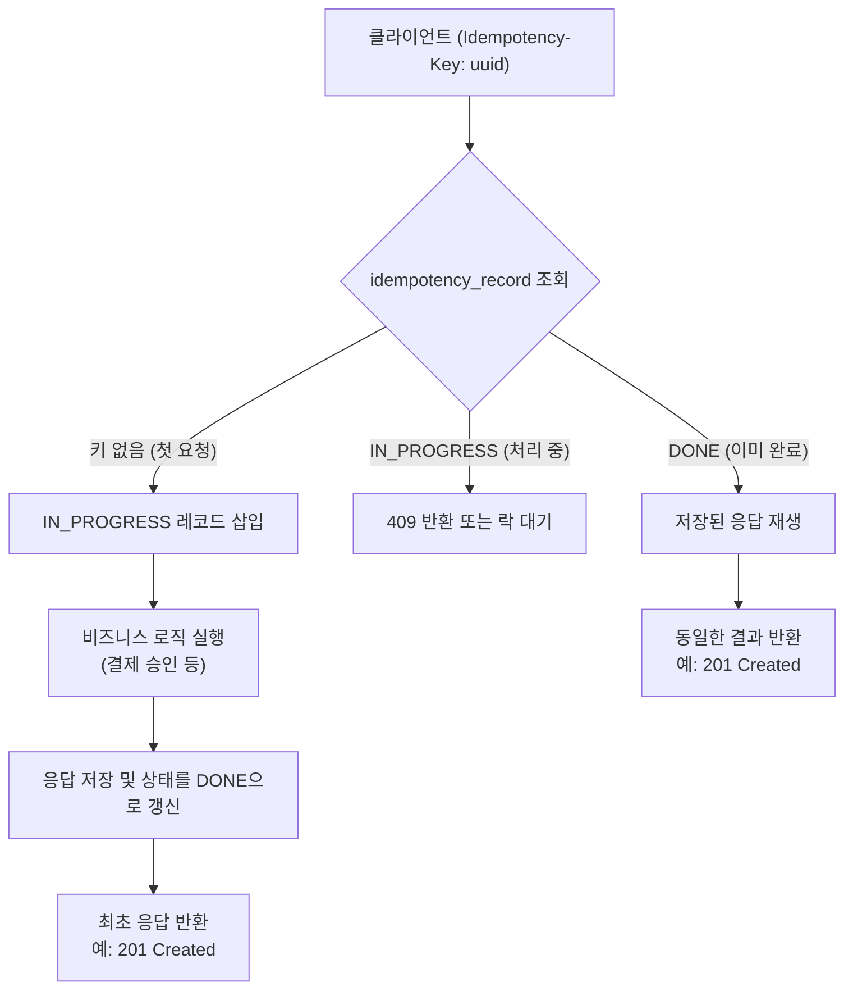
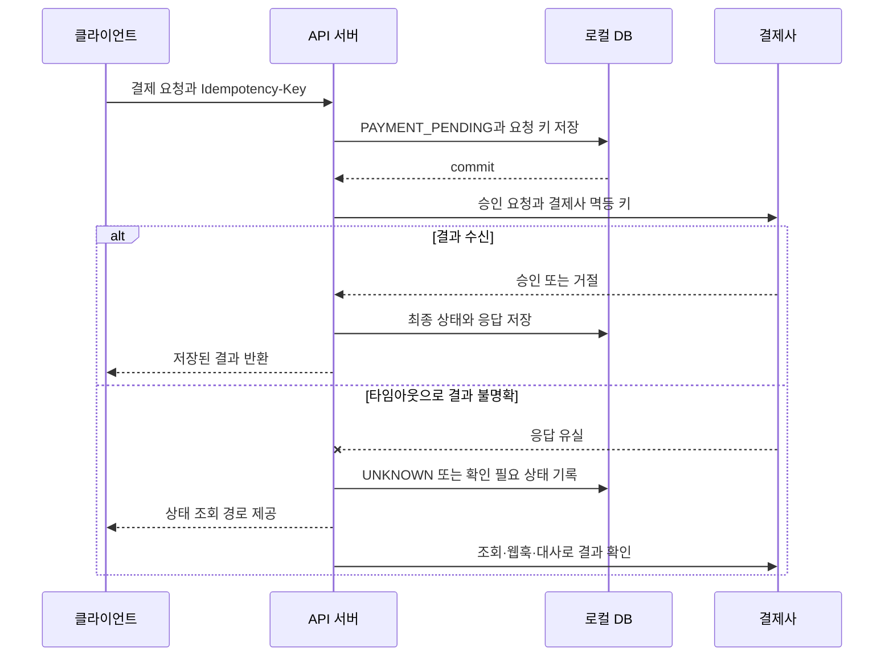
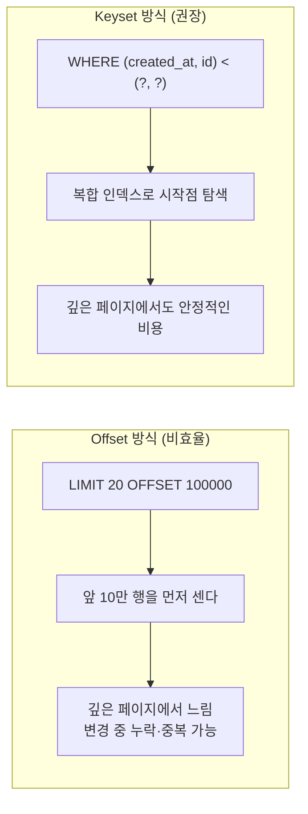

# 시니어 백엔드를 위한 API 설계 실전 스터디 팩

## 왜 지금 이 주제를 다시 파야 하는가

API 설계는 "잘 돌아가는 코드"와 "오래 운영할 수 있는 시스템"을 가르는 경계선이다.
시니어 백엔드 개발자는 엔드포인트만 만드는 것이 아니라, 시간이 지나도 변경 비용이 작은 계약을 남겨야 한다.

특히 주문, 결제, 쿠폰, 알림이 연결되는 커머스 도메인에서는 API 계약 하나가 다음 문제로 이어질 수 있다.

- 네트워크 재시도로 인한 중복 결제
- 외부 파트너 변경에 따른 롤백
- 오래된 모바일 앱과의 호환성 단절
- 상태 코드와 오류 계약 불일치로 인한 잘못된 재시도

면접에서 "이 API를 설계해 주세요"라는 문제가 나오는 이유도 같다.
면접관은 엔드포인트 목록보다 요구사항에서 운영 정책까지 이어지는 **일관된 설계 판단**을 확인하고 싶어 한다.


이 문서는 이 판단 흐름을 커머스 백엔드 사례로 설명한다.
각 주제의 구현과 장애 대응은 연결된 심화 문서에서 더 자세히 다룬다.

## REST의 핵심 의미

### 자원 중심 URI

자원 중심 HTTP API에서는 URI를 명사 중심으로 설계하고, 일반적인 동작은 HTTP 메서드로 표현하는 편이 좋다.
`POST /createOrder`처럼 동작 이름을 경로에 직접 넣으면 자원보다 명령을 중심으로 모델링한 RPC 스타일에 가깝다.

다만 REST가 동사형 URI를 문법적으로 금지하는 것은 아니다.
도메인의 중요한 행위가 독립된 상태와 수명주기를 가지면 하위 자원으로 모델링할 수 있다.
그렇지 않으면 명시적인 명령 엔드포인트가 더 정직할 때도 있다.

나쁜 예:

```http
POST /api/createOrder
POST /api/cancelOrder?orderId=123
GET  /api/getOrderList?userId=7
```

개선:

```http
POST   /v1/orders
POST   /v1/orders/{orderId}/cancellations
GET    /v1/users/{userId}/orders
```

포인트:

- `cancelOrder`가 아니라 "주문 취소"라는 **하위 자원**(`cancellations`)으로 모델링했다.
  취소는 상태 전이 그 자체가 기록 대상이기 때문이다.
- 컬렉션(`/orders`)과 아이템(`/orders/{id}`)을 명확히 구분한다.
- 쿼리 파라미터는 주로 필터, 페이지네이션, 정렬처럼 자원의 표현 범위를 조절하는 데 쓴다.
- 계층 안에서 자원을 식별하는 값은 일반적으로 경로에 넣는다.

### 메서드 의미: 안전성(Safe)과 멱등성(Idempotent)

| 메서드 | 안전함 | 멱등함 | 주 사용처 |
| --- | --- | --- | --- |
| GET | O | O | 조회 |
| HEAD | O | O | 존재/메타 확인 |
| PUT | X | O | 전체 교체, 식별자 클라이언트가 알 때 |
| DELETE | X | O | 삭제 |
| PATCH | X | 조건부 | 부분 수정 |
| POST | X | X (기본) | 생성, 트리거, 비정형 동작 |

여기서 자주 헷갈리는 두 지점:

- **안전성과 멱등성은 다르다.**
  안전함은 클라이언트가 요청한 의미가 서버 상태 변경을 요구하지 않는다는 뜻이다.
  멱등함은 같은 요청을 여러 번 적용했을 때 의도한 서버 상태 효과가 한 번 적용한 것과 같다는 뜻이다.
  따라서 DELETE는 안전하지 않지만 멱등할 수 있다.
- **PATCH의 멱등성은 패치 문서의 의미에 달려 있다.**
  `{"stock": {"op": "increment", "value": 1}}`처럼 현재 값에 델타를 적용하면 호출 횟수에 따라 결과가 달라진다.
  반대로 특정 필드를 목표 값으로 교체하는 패치는 멱등하게 설계할 수 있다.

### 상태 코드 설계

상태 코드는 클라이언트, 프록시, 관측 도구가 응답의 의미를 해석하는 공통 언어다.
다음 분류를 출발점으로 삼되, 도메인 조건과 재시도 정책까지 함께 정의해야 한다.

- 2xx: 성공
  - 200 OK — 일반 성공
  - 201 Created — 하나 이상의 자원을 생성했다.
    생성된 주 자원은 `Location` 헤더 또는 요청 대상 URI로 식별한다.
  - 202 Accepted — 요청을 접수했지만 처리가 끝나지 않았다.
    가능하면 작업 상태를 조회할 URI와 재시도 간격을 함께 제공한다.
  - 204 No Content — 성공하지만 본문이 없음(DELETE)
- 4xx: 클라이언트 잘못
  - 400 Bad Request — 스키마/파라미터 자체가 깨짐
  - 401 Unauthorized — 인증 안 됨(토큰 없음/만료)
  - 403 Forbidden — 인증은 됐는데 권한 없음
  - 404 Not Found — 자원 없음
  - 409 Conflict — 상태 충돌(이미 취소된 주문 재취소)
  - 422 Unprocessable Content — 문법은 이해했지만 지시를 처리할 수 없음
  - 429 Too Many Requests — 정해진 요청 한도를 초과함.
    서버는 `Retry-After`로 재시도 시점을 안내할 수 있다.
- 5xx: 서버 잘못
  - 500 — 처리되지 않은 예외
  - 502/503/504 — 업스트림/가용성/타임아웃

"재고 부족" 같은 도메인 실패에 하나의 정답만 있는 것은 아니다.

- 요청 내용 자체를 처리할 수 없다는 의미를 강조하면 422가 자연스럽다.
- 현재 자원 상태와의 충돌을 강조하면 409를 선택할 수 있다.
- API가 모든 입력·도메인 검증 실패를 400으로 통일했다면 그 계약을 일관되게 유지할 수도 있다.

중요한 것은 상태 코드만으로 세부 원인을 표현하려 하지 않는 것이다.
상태 코드는 HTTP 의미를 전달하고, 안정적인 도메인 오류 코드는 재시도와 사용자 안내를 결정한다.

## 멱등 키: POST를 어떻게 안전하게 만들 것인가

POST 메서드는 본래 멱등성을 보장하지 않는다.
하지만 결제, 주문, 쿠폰 발급처럼 두 번 실행되면 큰 피해가 생기는 동작은 애플리케이션 수준에서 멱등하게 만들어야 한다.

중복 요청은 다음과 같은 정상적인 상황에서도 발생한다.

- 네트워크 오류 후 자동 재시도
- 서버는 처리했지만 응답이 유실된 타임아웃
- 모바일 앱에서 사용자가 버튼을 여러 번 누름

### `Idempotency-Key` 헤더

클라이언트가 요청마다 UUID를 만들어 헤더에 실어 보낸다.

```http
POST /v1/payments
Idempotency-Key: 2f3d6b1e-0c2a-4a34-9f6f-7c4d9e01c5ad
Content-Type: application/json

{"orderId":"O-10293","amount":28900,"currency":"KRW","method":"card_token_xxx"}
```

서버는 키의 범위를 먼저 정의해야 한다.
일반적으로 테넌트나 호출 주체, HTTP 메서드, 정규화한 경로, 멱등 키를 함께 사용한다.
키만 전역으로 비교하면 서로 다른 사용자의 요청이 충돌할 수 있다.

첫 요청이 실행을 시작하면 요청 해시와 결과를 저장한다.
같은 범위와 키로 들어온 재요청에는 저장된 HTTP 상태 코드, 필요한 헤더, 본문을 같은 계약으로 재생한다.
첫 요청이 아직 처리 중이면 즉시 충돌 응답을 주거나 제한된 시간 동안 완료를 기다릴 수 있다.

어느 정책을 고르든 다음 상황을 구분해야 한다.

| 상황 | 권장 처리 |
| --- | --- |
| 같은 키와 같은 요청 | 저장된 결과 재생 |
| 같은 키와 다른 요청 본문 | 키 오용 오류 반환 |
| 같은 키의 요청이 처리 중 | 충돌 응답 또는 제한된 대기 |
| 실행 시작 전 검증 실패 | 결과 저장 여부를 계약으로 명시 |
| 실행 결과가 불명확함 | 상태 조회와 대사 절차 제공 |



테이블 예시(MySQL 8 기준):

```sql
CREATE TABLE idempotency_record (
    id              BIGINT PRIMARY KEY AUTO_INCREMENT,
    principal_id    VARCHAR(80)  NOT NULL,
    http_method     VARCHAR(10)  NOT NULL,
    idem_key        VARCHAR(80)  NOT NULL,
    route           VARCHAR(120) NOT NULL,
    request_hash    CHAR(64)     NOT NULL,
    response_status SMALLINT     NULL,
    response_headers JSON        NULL,
    response_body   JSON         NULL,
    state           ENUM('IN_PROGRESS','DONE') NOT NULL,
    created_at      DATETIME(3)  NOT NULL DEFAULT CURRENT_TIMESTAMP(3),
    completed_at    DATETIME(3)  NULL,
    UNIQUE KEY uq_idem (principal_id, http_method, route, idem_key)
) ENGINE=InnoDB;
```

중요한 세부 사항은 다음과 같다.

- `request_hash`를 저장해 같은 키로 다른 본문이 오면 키 오용으로 거절한다.
  그렇지 않으면 클라이언트 버그를 서버가 조용히 덮어쓰게 된다.
  해시는 JSON 공백이나 객체 키 순서가 아니라 실제 요청 의미를 비교하도록 정규화한 본문과 중요한 요청 속성에서 계산한다.
- 응답을 그대로 재생한다면 상태 코드뿐 아니라 재생할 헤더의 범위도 저장해야 한다.
  시간에 따라 달라지는 헤더나 보안상 재생하면 안 되는 헤더는 명시적으로 제외한다.
- 보존 기간을 정한다.
  너무 짧으면 늦은 재시도가 중복 실행되고, 너무 길면 저장 비용과 개인정보 보존 범위가 커진다.
  결제사 재시도 기간과 분쟁 처리 시간을 근거로 정해야 한다.

### 외부 결제 호출과 로컬 트랜잭션을 분리한다

로컬 데이터베이스 트랜잭션과 외부 결제사 호출을 하나의 원자적 트랜잭션으로 묶을 수는 없다.
따라서 "외부 호출까지 한 트랜잭션으로 처리한다"가 아니라 불확실한 결과를 복구할 수 있는 상태 전이를 설계해야 한다.



외부 결제사가 멱등 키를 지원하면 내부 결제 식별자와 안정적으로 연결한다.
지원하지 않는다면 중복 승인을 막을 수 있는 결제사 고유 주문 번호가 필요하다.
승인 조회 API와 대사 절차도 더 중요해진다.
결제사 응답은 받았지만 로컬 최종 상태 저장에 실패한 경우도 결과가 불명확한 상태로 다룬다.
이 경우 조회나 대사로 복구한다.

자세한 결제 상태 전이와 재시도 전략은
[결제 멱등성과 트랜잭션 재시도](./payment-idempotency-transaction-basics.md)에서 다룬다.

### Outbox가 보장하는 경계를 정확히 이해한다

Outbox는 로컬 업무 상태와 "발행할 이벤트"를 같은 데이터베이스 트랜잭션에 기록한다.
따라서 업무 상태만 커밋되고 이벤트 기록이 사라지는 이중 쓰기 간극을 줄인다.

하지만 브로커 발행과 소비자 처리는 보통 **최소 한 번 전달**이므로 중복될 수 있다.
디스패처 재시도와 소비자 멱등성이 함께 있어야 하며, 외부 시스템에서 일어난 부작용까지 자동으로 원자화하지는 않는다.

- [분산 트랜잭션과 Outbox 패턴](./distributed-transaction-outbox-pattern.md)
- [Outbox와 Inbox 패턴](./outbox-inbox-pattern.md)

## 페이지네이션: 데이터 접근 패턴에 맞게 고른다

### 세 가지 방식

- **오프셋 페이지네이션**: `?page=10&size=20` → `LIMIT 20 OFFSET 200`
  - 장점: 직관적이며 임의 페이지로 이동하기 쉽다.
  - 단점: 오프셋이 커질수록 앞 행을 건너뛰는 비용이 커진다.
    순회 도중 데이터가 삽입되거나 삭제되면 같은 행을 다시 보거나 일부 행을 건너뛸 수 있다.
- **커서 페이지네이션**: 서버가 불투명한 `next_cursor` 토큰을 준다.
  - 장점: 클라이언트가 정렬 키와 내부 구현을 알 필요가 없다.
    서버는 API 모양을 유지하면서 커서 내부 형식을 진화시킬 수 있다.
  - 단점: 임의 페이지 이동이 어렵고, 이전 페이지 이동을 지원하려면 별도 커서가 필요하다.
- **키셋 페이지네이션**: 마지막으로 본 정렬 키를 다음 조회 조건으로 사용한다.
  - 예: `WHERE (created_at, id) < (?, ?)`
    이후 `ORDER BY created_at DESC, id DESC LIMIT 20`을 적용한다.
  - 장점: 적절한 복합 인덱스가 있으면 깊은 페이지에서도 탐색 비용이 안정적이다.
    정렬 키보다 앞에 새 데이터가 추가되어도 이미 본 구간이 밀리지 않는다.
  - 단점: 임의 페이지 이동이 어렵다.
    정렬 키가 바뀌거나 행이 삭제되면 순회 결과에 변화가 생길 수 있으므로 안정적인 고유 정렬이 필요하다.

커서는 API 계약의 표현 방식이고 키셋은 데이터 조회 방식이다.
공개 API는 키셋의 마지막 정렬 값을 그대로 노출하기보다 불투명한 커서로 감싸는 경우가 많다.



### 실전 예 (MySQL 8)

나쁜 쿼리:

```sql
SELECT id, order_no, total_price
FROM orders
WHERE user_id = 42
ORDER BY created_at DESC
LIMIT 20 OFFSET 100000;
```

개선 (keyset):

```sql
SELECT id, order_no, total_price, created_at
FROM orders
WHERE user_id = 42
  AND (created_at, id) < (?, ?)
ORDER BY created_at DESC, id DESC
LIMIT 20;
```

행 값 비교를 사용하기 어려운 데이터베이스나 쿼리 작성기에서는 같은 조건을 다음처럼 풀어쓸 수 있다.

```sql
AND (
    created_at < :cursor_created_at
    OR (created_at = :cursor_created_at AND id < :cursor_id)
)
```

필요한 인덱스: `INDEX idx_orders_user_created (user_id, created_at DESC, id DESC)`.

응답 스키마:

```json
{
  "items": [ ... ],
  "page_info": {
    "next_cursor": "eyJjcmVhdGVkX2F0IjoiMjAyNi0wNC0xOFQwNDozMDoxMloiLCJpZCI6MTIzNDV9",
    "has_next": true
  }
}
```

커서는 클라이언트가 내부를 해석하지 않는 불투명한 값으로 계약한다.
Base64는 바이너리나 JSON을 전달하기 쉽게 인코딩할 뿐, 내용을 숨기거나 변조를 막지 않는다.

- 민감 정보는 커서에 넣지 않는다.
- 커서 구조를 바꿀 가능성이 있다면 내부 버전을 포함한다.
- 클라이언트 변조를 탐지해야 하면 HMAC 같은 서명을 사용한다.
- 서명은 무결성을 제공하지만 내용을 암호화하지는 않는다.

## 버전 관리 전략과 폐기

### URI, 전용 헤더, 콘텐츠 협상

- **URI 버전**: `/v1/orders`, `/v2/orders`
  - 라우팅과 관측이 단순하고, 로그만으로 버전별 트래픽을 구분하기 쉽다.
  - 자원 식별자에 버전이 포함된다는 트레이드오프가 있다.
- **전용 헤더**: `API-Version: 2026-01-15`
  - URI를 유지하면서 클라이언트별 기본 버전과 점진 이관을 운영하기 좋다.
  - 캐시 키, 게이트웨이 라우팅, 브라우저 테스트 도구에서 헤더를 빠뜨리지 않도록 해야 한다.
- **Accept 헤더를 이용한 콘텐츠 협상**: `Accept: application/vnd.example.order.v2+json`
  - 표현 형식의 버전이라는 의미는 분명하다.
  - 클라이언트 구현과 캐시 설정이 복잡해질 수 있다.

선택 기준:

- 외부 공개 API와 다수 파트너: URI 버전과 충분한 폐기 유예 기간을 우선 검토한다.
- 내부 마이크로서비스: 날짜/헤더 기반이 유연. 서비스 메시/게이트웨이에서 라우팅 가능.
- 모바일 앱처럼 강제 업데이트가 어려운 클라이언트: URI가 안전.

유예 기간은 무조건 6개월이나 12개월로 정하는 값이 아니다.
클라이언트 배포 통제권, 계약, 지원 창구, 실제 버전별 트래픽을 근거로 정책을 정한다.

### 폐기 계획

버전을 올리는 것보다 **내리는 것**이 진짜 설계다.

1. `Deprecation` 헤더로 폐기 상태와 적용 시점을 알린다.
2. `Sunset` 헤더와 문서에 실제 종료 시점을 알린다.
3. 마이그레이션 가이드와 대체 엔드포인트를 제공한다.
4. 버전별 호출자와 트래픽을 추적하고 영향받는 파트너에게 연락한다.
5. 계약상 허용될 때 종료 전 일시 중단 훈련을 실시한다.
6. 종료 후에는 410 Gone 같은 명시적 응답이나 합의한 종료 정책을 적용한다.

예를 들어 2026년 8월 1일에 폐기를 공지하고 14개월 뒤 종료한다면 다음처럼 표현할 수 있다.

```http
Deprecation: @1785542400
Sunset: Fri, 01 Oct 2027 00:00:00 GMT
Link: </docs/migrations/v2>; rel="deprecation"; type="text/html"
```

버전별 응답 매핑과 모바일 호환성, RFC 헤더 문법은
[API 버저닝과 하위 호환성](./api-versioning-backward-compatibility.md)에서 자세히 다룬다.

## 오류 계약: 오류는 문서다

오류 응답이 자유 형식이면 클라이언트마다 파싱 로직이 달라진다.
결국 `200 OK` 본문에 오류 필드를 넣거나 사람이 읽는 메시지를 프로그램이 파싱하는 문제가 생긴다.

RFC 9457의 **Problem Details**(문제 세부 정보)를 출발점으로 삼는다.
도메인 오류 코드와 필드 오류는 확장 멤버로 추가할 수 있다.

```json
{
  "type": "https://errors.example.com/orders/stock-insufficient",
  "title": "Stock insufficient",
  "status": 422,
  "code": "ORDER_STOCK_INSUFFICIENT",
  "detail": "Requested 3 but only 1 available.",
  "instance": "/v1/orders",
  "trace_id": "b7c9...e3",
  "errors": [
    {"field": "items[0].quantity", "code": "QUANTITY_EXCEEDS_STOCK", "max": 1}
  ]
}
```

원칙:

- **HTTP status**는 전송·의미 계층이고 **`code`**는 도메인 계층이다.
  둘을 분리하면 같은 422에서도 재고 부족과 쿠폰 만료를 구분할 수 있다.
- `trace_id`는 분산 트레이스 ID와 동일하게 두어 고객 문의 1회로 원인을 찾을 수 있게 한다.
- 메시지는 사람용(`title`, `detail`)과 기계용(`code`)을 섞지 않는다.
- 보안 관련 에러(401/403)는 원인을 과하게 노출하지 않는다.
  "비밀번호가 틀렸습니다"와 "아이디가 없습니다"를 구분하면 계정 열거 공격에 취약해진다.

## 스키마 진화: 하위 호환성과 상위 호환성

한 번 공개한 API는 "살아 있는 DB 스키마"로 취급해야 한다.

대체로 안전하지만 클라이언트 구현을 확인해야 하는 변경:

- 선택 요청 필드 추가
- 응답 필드 추가
- enum 값 추가

응답 필드 추가도 엄격한 역직렬화 클라이언트에는 실패할 수 있다.
enum 값 추가는 알 수 없는 값을 처리하지 못하는 모바일 앱이나 생성 코드에서 특히 위험하다.
따라서 호환성 분류는 명세만 보지 말고 실제 소비자 동작과 계약 테스트로 검증해야 한다.

깨지는 변경:

- 필드 제거
- 필드 타입 변경
- required 필드 추가
- enum 값 제거 또는 의미 변경
- 응답 에러 스키마 재배치

실전 규칙:

- **관대한 독자**: 클라이언트는 모르는 응답 필드를 무시하고 알 수 없는 enum 값을 안전하게 처리한다.
- **요청의 확장 가능성**: 서버가 알 수 없는 요청 필드를 거절할지 무시할지는 보안과 호환성 요구에 따라 계약한다.
  무조건 엄격하게 거절하면 새로운 클라이언트가 보낸 선택 필드 때문에 오래된 서버가 실패할 수 있다.
- **의미 보존**: 응답 필드를 추가하더라도 기존 필드의 의미를 바꾸지 않는다.
  `price`의 의미를 바꾸는 대신 `price_with_tax` 같은 새 필드를 추가한다.
- **점진적 제거**:
  1. 새 필드 사용을 중단한다.
  2. 소비자 사용량을 관측한다.
  3. 폐기 상태와 종료 일정을 공지한다.
  4. 계약 테스트와 실제 트래픽에서 사용자가 없음을 확인한 뒤 제거한다.

자세한 호환성 함정과 검증 방법은
[API 버저닝과 하위 호환성](./api-versioning-backward-compatibility.md)에서 다룬다.

## REST vs gRPC vs GraphQL — 어떻게 고르나

| 축 | REST와 JSON | gRPC | GraphQL |
| --- | --- | --- | --- |
| 주 사용처 | 공개 API, 웹, 모바일 | 내부 서비스 간, 저지연 | 프론트 주도 조합형 조회 |
| 스키마 | OpenAPI(옵션) | Proto(강제) | SDL(강제) |
| 성능 | JSON 파싱 비용 | HTTP/2와 Protobuf | 쿼리 모양에 따라 달라짐 |
| 캐싱 | HTTP 캐시 활용 가능 | 제한적 | GET과 영속 쿼리 등 별도 전략 필요 |
| 학습 비용 | 낮음 | 보통 | 높음(N+1, 권한 경계) |

선택 기준을 한 문장으로 쓰면:

- **외부로 공개**하고 다양한 클라이언트가 붙는다 → REST와 JSON. OpenAPI로 계약 공개.
- **내부 마이크로서비스**가 강한 스키마와 성능을 원한다 → gRPC.
  브라우저에서 직접 호출하려면 gRPC-Web이나 게이트웨이가 필요하다.
- **화면별 데이터 조합이 자주 바뀐다** → GraphQL을 검토한다.
  필드 단위 권한, N+1 조회, 쿼리 비용 제한, 캐시 전략을 함께 설계해야 한다.

## BFF(Backend For Frontend)는 언제 쓰는가

BFF는 **프론트별 전용 백엔드**를 둬서, 공용 내부 API를 그 프론트의 화면 형태로 조합·가공한다.

쓸 만할 때:

- 웹/iOS/Android가 요구 데이터 모양이 서로 다르다.
- 공용 API를 바꿀 때마다 3개 앱이 영향을 받는다.
- 모바일은 왕복 비용이 크니 한 번에 조합된 응답을 줘야 한다.

피해야 할 때:

- 클라이언트가 하나뿐인데 BFF를 만들면 **그냥 레이어 하나 늘어난 것**.
- BFF가 도메인 로직을 들고 가면 마이크로서비스 경계가 무너진다. BFF는 "조합·표현"에 머물러야 한다.

## 인증·인가, 요청 한도, 문서화

인증과 인가는 서로 다른 질문에 답한다.

- **인증**: 호출자가 누구인지 확인한다.
- **인가**: 확인된 호출자가 이 자원에 이 동작을 수행할 수 있는지 판단한다.

JWT는 토큰의 한 형식이고 OAuth 2.0은 권한 위임을 위한 프레임워크다.
사용자 인증까지 표준화하려면 OpenID Connect 같은 인증 계층을 함께 검토한다.
Bearer 토큰을 사용한다면 표준 `Authorization: Bearer ...` 헤더를 사용하고 자체 인증 헤더는 피한다.

인가는 스코프와 자원 소유권 검사를 분리한다.
예를 들어 `orders:read` 스코프가 있어도 해당 주문이 호출자의 소유인지, 접근 가능한 조직에 속하는지 다시 확인해야 한다.

자세한 인증·인가 경계는 다음 문서에서 다룬다.

- [인증과 권한 부여](../security/security-auth.md)
- [Spring Security OAuth 2.0과 JWT](../security/spring-security-oauth2-jwt.md)

### 요청 한도 응답

한도를 초과하면 429 Too Many Requests를 사용하고, 재시도 시점을 안내할 수 있으면 `Retry-After`를 제공한다.
`RateLimit-Limit`, `RateLimit-Remaining`, `RateLimit-Reset`은
여러 서비스가 사용해 온 관례지만 확정된 RFC 필드로 간주하면 안 된다.
2026년 5월의 IETF 작업 초안은 이 세 필드 대신 다음 두 필드를 제안한다.

- `RateLimit-Policy`: 할당량과 시간 창 같은 정책
- `RateLimit`: 현재 사용할 수 있는 할당량과 유효 시간

이 문법 역시 작업 초안이므로 배포 시점의 최신 문서와 도구 지원을 다시 확인해야 한다.

```http
HTTP/1.1 429 Too Many Requests
Retry-After: 42
RateLimit-Policy: "default";q=1000;w=60
RateLimit: "default";r=0;t=42
```

현재 초안에서 `w`와 `t`는 초 단위의 상대 시간이다.
기존 `RateLimit-Reset` 관례를 유지한다면 남은 초인지 절대 시각인지 명시한다.
클라이언트가 추측하게 두지 말고 문서와 계약 테스트로 고정한다.

### OpenAPI를 계약의 단일 소스로 운영한다

OpenAPI는 코드 우선과 설계 우선 방식 모두 사용할 수 있다.
중요한 것은 어느 산출물이 공식 계약인지 정하고, 다른 산출물이 이를 자동 검증하도록 만드는 것이다.

2026년 7월 기준 최신 명세 계열에는 OpenAPI 3.2가 포함된다.
사용 중인 생성기와 검증기의 지원 범위를 확인해 프로젝트 적용 버전을 선택해야 한다.
명세 버전이 최신이라는 이유만으로 도구 호환성을 확인하지 않고 올리면 계약 검증이 오히려 약해질 수 있다.

## 커머스 도메인 실전 예: 나쁜 설계 vs 개선 설계

### 주문 생성

나쁜 예:

```http
POST /api/order/new
Body: {"user":7,"products":[{"pid":1,"qty":2}],"pay":"card","coupon":"X"}
Response 200 OK
{"success": true, "orderId": 10293, "errorMsg": null}
```

문제:

- 동사형 URI와 `success` 플래그가 HTTP 의미를 가린다.
- 주문 생성, 쿠폰 적용, 결제 시작 중 어디까지 원자적으로 성공하는지 알 수 없다.
- 일부만 성공했을 때 반환 상태와 복구 방법이 없다.
- 새 주문을 생성했지만 일반 성공인 200만 반환해 생성 결과를 식별하기 어렵다.

주문 생성 요청에 쿠폰과 결제 수단을 함께 받는 것 자체가 항상 잘못은 아니다.
하나의 사용자 명령을 오케스트레이션하는 API라면 허용할 수 있지만, 내부 상태 전이와 부분 실패 계약을 분명히 해야 한다.

개선:

```http
POST /v1/orders
Idempotency-Key: <uuid>
Authorization: Bearer <token>
{
  "items": [{"sku": "SKU-001", "quantity": 2}],
  "shipping_address_id": "addr_123",
  "coupon_code": "SPRING10",
  "payment_method_id": "pm_456"
}

201 Created
Location: /v1/orders/O-10293
{
  "order_id": "O-10293",
  "status": "PENDING_PAYMENT",
  "total_price": 28900,
  "currency": "KRW",
  "payment": {"status": "REQUIRES_ACTION", "next_action_url": "..."}
}
```

### 결제 승인

```http
POST /v1/orders/{orderId}/payments
Idempotency-Key: <uuid>
```

- 비동기 접수라면 202 Accepted와 `GET /v1/payments/{paymentId}` 같은 상태 조회 경로를 제공한다.
- 결제 거절은 API가 선택한 HTTP 상태와 `code=PAYMENT_DECLINED` 같은 안정적인 도메인 코드를 함께 반환한다.
- 결제사 원문에는 민감 정보가 포함될 수 있으므로 그대로 노출하지 않고 안전한 사용자 메시지와 내부 진단 정보를 분리한다.

### 쿠폰 사용

쿠폰 사용은 "쿠폰 자원의 상태 전이"다.

```http
POST /v1/users/me/coupons/{couponId}/redemptions
```

- 이미 사용한 쿠폰: 409와 `code=COUPON_ALREADY_USED`
- 만료된 쿠폰: 422와 `code=COUPON_EXPIRED`
- 최소 주문 금액 미충족: 422와 `code=COUPON_MIN_AMOUNT_NOT_MET`

### 알림 목록

```http
GET /v1/users/me/notifications?limit=20&cursor=<opaque>
```

- keyset 기반, `cursor=`가 없으면 최신부터.
- 읽음 처리: `POST /v1/users/me/notifications/{id}/reads` (상태 전이를 하위 자원으로).

## 로컬 실습 환경

### 준비물

- JDK 21 이상과 현재 지원 중인 Spring Boot 버전 또는 다른 백엔드 스택
- MySQL 8
- `httpie` 또는 `curl`
- `k6`(부하 테스트)
- Redocly CLI(OpenAPI 검사와 문서 렌더링)

### MySQL 8 스키마(주문과 멱등 키)

```sql
CREATE TABLE orders (
    id              BIGINT PRIMARY KEY AUTO_INCREMENT,
    order_no        CHAR(12)    NOT NULL UNIQUE,
    user_id         BIGINT      NOT NULL,
    status          VARCHAR(32) NOT NULL,
    total_price     INT         NOT NULL,
    currency        CHAR(3)     NOT NULL,
    created_at      DATETIME(3) NOT NULL DEFAULT CURRENT_TIMESTAMP(3),
    KEY idx_user_created (user_id, created_at DESC, id DESC)
) ENGINE=InnoDB;
```

### keyset 페이지네이션 실습

```sql
-- 1페이지
SELECT id, order_no, total_price, created_at
FROM orders
WHERE user_id = 42
ORDER BY created_at DESC, id DESC
LIMIT 20;

-- 다음 페이지 (커서에서 꺼낸 값)
SELECT id, order_no, total_price, created_at
FROM orders
WHERE user_id = 42
  AND (created_at, id) < ('2026-04-18 04:30:12.000', 12345)
ORDER BY created_at DESC, id DESC
LIMIT 20;
```

### 멱등성 실습 (curl)

```bash
KEY=$(uuidgen)
for i in 1 2 3; do
  curl -s -o /dev/null -w "%{http_code}\n" \
    -X POST http://localhost:8080/v1/payments \
    -H "Authorization: Bearer dev" \
    -H "Idempotency-Key: $KEY" \
    -H "Content-Type: application/json" \
    -d '{"orderId":"O-10293","amount":28900,"currency":"KRW"}'
done
# 최초 응답을 그대로 재생하는 계약의 기대 출력: 201, 201, 201
```

상태 코드만 확인해서는 멱등성을 검증할 수 없다.
다음 항목을 함께 확인한다.

- 세 요청이 동일한 결제 식별자와 응답 본문을 반환하는가
- 내부 결제 요청과 결제사 승인 기록이 각각 한 건인가
- 같은 키에 다른 본문을 보내면 키 오용으로 거절하는가
- 첫 요청 처리 중 동일 키가 들어왔을 때 정의한 동시성 정책대로 동작하는가
- 결제사 응답 유실 후 조회나 대사로 최종 상태를 복구하는가

### OpenAPI 계약 검증

```yaml
paths:
  /v1/orders:
    post:
      operationId: createOrder
      parameters:
        - in: header
          name: Idempotency-Key
          required: true
          schema: { type: string, format: uuid }
      requestBody: { ... }
      responses:
        "201": { $ref: "#/components/responses/Order" }
        "409": { $ref: "#/components/responses/Problem" }
        "422": { $ref: "#/components/responses/Problem" }
```

`redocly lint openapi.yaml` 같은 명령으로 구조와 팀 규칙을 검사한다.
문서 렌더링은 `redocly build-docs openapi.yaml`로 확인할 수 있다.

지속적 통합 환경에서는 다음 불일치를 막는다.

- 구현에는 있지만 OpenAPI에는 없는 응답
- OpenAPI에는 있지만 구현이 반환하지 않는 필수 필드
- 오류 코드와 상태 코드 조합의 변경
- 호환성 검토 없이 추가된 필수 요청 필드

## 흔한 실수 패턴

- 200 OK에 `success:false`를 실어 오류를 감춘다.
  프로토콜 수준의 실패율과 경보가 실제 장애를 놓치게 된다.
- POST에 멱등 키가 없어 재시도 때 결제나 쿠폰 발급이 중복된다.
- 데이터 규모와 탐색 패턴을 확인하지 않고 깊은 오프셋 조회를 사용한다.
- 오류 메시지에 계정 존재 여부, 내부 스키마, 결제사 원문을 노출한다.
- 한 API 안에서 snake_case와 camelCase를 섞는다.
- 내부 API라는 이유로 소비자와 변경 정책을 기록하지 않는다.
- PATCH를 델타 증가 명령으로 정의해 놓고 멱등하다고 가정한다.
- 한 계약에서 지역 시각, UTC 문자열, epoch 밀리초를 목적 없이 중복 제공한다.
  하나의 표준 표현을 기본으로 정하고, 호환성 요구가 있을 때만 다른 표현을 추가한다.

## 면접 답변 구조: "이 API를 설계해 주세요"

시니어 백엔드 면접에서 열린 문제를 받으면 다음 순서로 설계를 설명할 수 있다.
시간은 예시이며 질문의 초점에 따라 조절한다.

1. 문제 재정의(30초): "요구사항을 제가 이렇게 이해했습니다 — 대상 클라이언트, 규모, SLA, 외부 공개 여부."
2. 자원 모델링(1분): 명사 나열. "주문, 결제, 쿠폰, 사용자, 알림. 주문 취소는 별도 하위 자원으로 두겠습니다."
3. 엔드포인트 초안(1분): 메서드, URI, 상태 코드를 화이트보드에 적는다.
4. 멱등성/일관성(1\~2분): "주문 생성과 결제 승인은 Idempotency-Key를 필수로 두고, 이유는 ...".
5. 데이터 볼륨/페이지네이션(1분): "목록은 keyset, 이유는 트래픽과 삽입 패턴 때문입니다."
6. 오류 계약(1분): Problem Details와 도메인 코드를 분리한다.
7. 버전·배포·문서(1분): 버전 식별 방법, OpenAPI 계약, 소비자 이관과 종료 정책을 설명한다.
8. 비기능 요구사항(1\~2분): 인증·인가, 요청 한도, 로그·트레이스·메트릭, 보안을 설명한다.
9. 트레이드오프 정리(30초): "여기선 REST를 골랐습니다. gRPC가 좋았을 조건은 X이고, 그땐 Y를 바꿀 겁니다."

중요한 것은 하나의 답을 정답처럼 주장하는 것이 아니라 선택 기준을 설명하는 태도다.
예를 들어 "재고 부족은 400 아닌가요?"라는 질문에는 다음 내용을 답할 수 있다.

- 이 API가 422를 선택한 의미
- 409나 400을 선택할 수 있는 조건
- 상태 코드와 별도로 도메인 오류 코드를 유지하는 이유
- 클라이언트가 어떤 정보로 재시도를 결정하는지

## 체크리스트 (실무/면접 공용)

- [ ] URI가 자원 중심이며 명령 엔드포인트를 사용했다면 그 이유가 있다.
- [ ] 메서드의 안전성과 멱등성 의미가 맞다.
- [ ] 201 응답에서 생성된 자원을 식별할 수 있다.
- [ ] 202 응답에서 처리 상태를 확인할 방법이 있다.
- [ ] 상태 코드와 도메인 `code`가 분리돼 있다.
- [ ] 중복 실행 비용이 큰 POST에는 멱등 정책이 있다.
- [ ] 멱등 키 범위, 요청 해시, 보존 기간, 동시 요청 정책이 있다.
- [ ] 외부 호출의 결과 유실을 복구할 상태 조회와 대사 절차가 있다.
- [ ] Outbox 소비자가 중복 이벤트를 처리할 수 있다.
- [ ] 목록 API가 데이터 규모와 이동 요구에 맞는 페이지네이션을 사용한다.
- [ ] 키셋 조회의 정렬 조건과 복합 인덱스 순서가 일치한다.
- [ ] 모든 요청과 응답 스키마가 OpenAPI에 정의되고 지속적 통합 환경에서 검사된다.
- [ ] 버전 식별 방법과 종료 절차가 팀 정책으로 문서화돼 있다.
- [ ] 에러 응답에 `trace_id`가 실려 있다.
- [ ] 인가 검사는 스코프와 소유권을 둘 다 한다.
- [ ] 요청 한도 응답의 필드와 시간 단위가 계약에 정의돼 있다.
- [ ] 깨지는 변경과 조건부로 안전한 변경을 소비자 계약 테스트로 구분한다.
- [ ] 면접에서는 다음 판단 순서를 말로 설명할 수 있다.
  - 문제와 제약
  - 자원과 엔드포인트
  - 멱등성과 일관성
  - 페이지네이션과 오류 계약
  - 버전과 비기능 요구사항
  - 선택한 대안의 트레이드오프

## 관련 문서와 공식 참고자료

### 저장소 심화 문서

- [API 버저닝과 하위 호환성](./api-versioning-backward-compatibility.md)
- [결제 멱등성과 트랜잭션 재시도](./payment-idempotency-transaction-basics.md)
- [분산 트랜잭션과 Outbox 패턴](./distributed-transaction-outbox-pattern.md)
- [Outbox와 Inbox 패턴](./outbox-inbox-pattern.md)
- [주문·결제 도메인 모델링](./ecommerce-order-payment-domain-modeling.md)
- [인증과 권한 부여](../security/security-auth.md)
- [Spring Security OAuth 2.0과 JWT](../security/spring-security-oauth2-jwt.md)

### 공식 참고자료

- [RFC 9110: HTTP Semantics](https://www.rfc-editor.org/rfc/rfc9110)
- [RFC 9457: Problem Details for HTTP APIs](https://www.rfc-editor.org/rfc/rfc9457)
- [RFC 6585: Additional HTTP Status Codes](https://www.rfc-editor.org/rfc/rfc6585)
- [IETF RateLimit Header Fields 초안](https://datatracker.ietf.org/doc/draft-ietf-httpapi-ratelimit-headers/)
- [OpenAPI Specification](https://spec.openapis.org/oas/)
- [OpenAPI Specification 3.2.0](https://spec.openapis.org/oas/v3.2.0.html)
- [Spring Boot 시스템 요구사항](https://docs.spring.io/spring-boot/system-requirements.html)
- [Redocly CLI 이전 안내](https://redocly.com/docs/cli/guides/migrate-from-redoc-cli)
