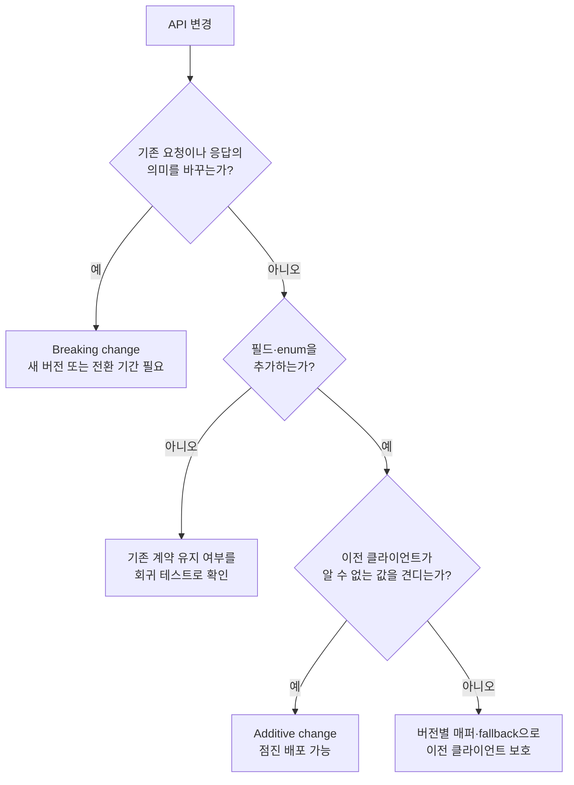
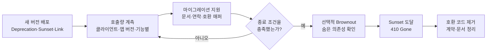
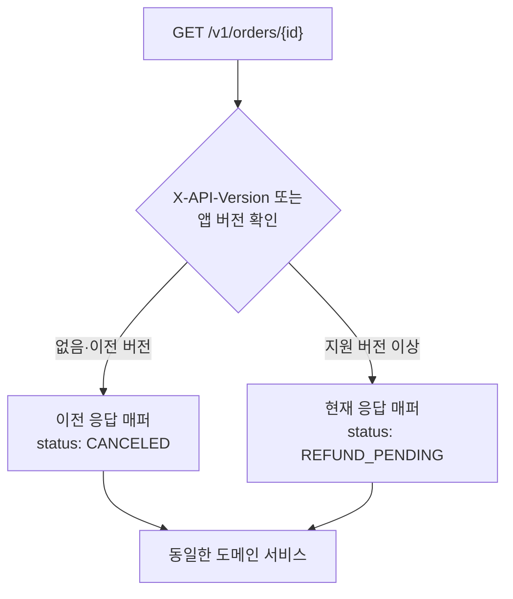
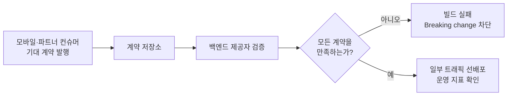
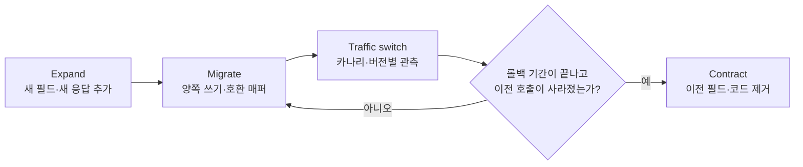

# API 버저닝과 하위 호환성: 모바일·외부 컨슈머까지 안전하게 진화시키기

## 왜 이 주제가 중요한가

API는 한 번 외부에 공개되는 순간부터 "내가 마음대로 못 바꾸는 코드"가 된다. 내부 라이브러리라면 콜러를 한꺼번에 리팩터링하면 되지만, 모바일 앱·파트너사·외부 통합처럼 **내가 배포 시점을 통제할 수 없는 컨슈머**가 한 명이라도 있으면 이야기가 달라진다. 사용자는 앱 스토어 업데이트를 미루고, 파트너사는 분기 단위로 릴리즈를 묶고, B2B 고객은 1년 전 클라이언트를 그대로 쓰고 있다.

시니어 백엔드 인터뷰에서 API versioning이 자주 나오는 이유는 단순히 "URL에 v1을 붙이느냐 헤더에 붙이느냐"를 묻기 위함이 아니다. 면접관은 다음을 본다.

- API를 **계약**(contract) 으로 다루고 있는가
- breaking change와 non-breaking change를 구분할 수 있는가
- 새 버전을 도입할 때 **이전 버전을 어떻게 살려두고 어떻게 죽일지**까지 설계하는가
- 모바일/외부 컨슈머처럼 **업그레이드를 강제할 수 없는 환경**을 고려하는가
- 비즈니스 영향(매출, SLA, 고객 신뢰)과 기술 부채를 균형 있게 판단하는가

코드 한 줄을 잘못 바꾸면 수십만 대의 휴대폰에서 결제가 막히는 영역이다. 그래서 versioning은 인프라보다 먼저 합의되어야 하는 제품 계약 영역에 가깝다.

## 핵심 개념: 호환성을 방향별로 나눈다

호환성은 누가 먼저 바뀌는지에 따라 나눠 생각해야 한다.

| 방향 | 질문 | API에서 자주 보는 사례 |
|---|---|---|
| **하위 호환성**(backward compatibility) | 새 서버가 이전 클라이언트의 요청과 기대를 계속 만족하는가 | 서버를 배포해도 6개월 전 모바일 앱이 동작한다 |
| **상위 호환성**(forward compatibility) | 이전 구성요소가 미래에 추가된 정보를 안전하게 무시하거나 대체할 수 있는가 | 옛 클라이언트가 새 응답 필드나 알 수 없는 enum을 만나도 종료되지 않는다 |

상위 호환성은 요청과 응답을 분리해 확인한다.

- 이전 클라이언트가 새 서버의 응답을 견딜 수 있는가
- 이전 서버가 미래 클라이언트의 추가 요청 필드를 무시할 수 있는가

모바일 API에서는 하위 호환성이 특히 중요하다.
서버는 즉시 배포할 수 있지만, 클라이언트 업데이트 시점은 통제하기 어렵기 때문이다.

### Breaking change의 분류

변경 방향까지 포함하면 다음처럼 분류할 수 있다.

| 변경 | 기본 판정 | 이유와 예외 |
|---|---|---|
| 응답 필드 삭제·이름 변경·타입 변경 | Breaking | 이전 클라이언트의 역직렬화나 화면 로직이 깨진다 |
| 응답 필드 의미 변경 | Breaking | 타입이 같아도 계약은 달라진다 |
| 항상 존재하던 응답 필드를 nullable로 변경 | Breaking | 이전 클라이언트가 null을 처리하지 못할 수 있다 |
| nullable 응답 필드에 값을 채우기 시작 | 대체로 안전 | null과 값의 의미가 기존 계약과 일치해야 한다 |
| 필수 요청 필드 추가 | Breaking | 이전 클라이언트는 새 필드를 보낼 수 없다 |
| 선택 요청 필드 추가 | 대체로 안전 | 누락 시 기본 동작이 기존과 같아야 한다 |
| 응답 필드 추가 | 조건부 안전 | 클라이언트가 알 수 없는 필드를 무시해야 한다 |
| enum 값 추가 | 조건부 안전 | 클라이언트가 알 수 없는 값을 안전하게 대체해야 한다 |
| HTTP 상태 코드·오류 구조 변경 | Breaking | 클라이언트 분기와 재시도 정책이 달라진다 |
| 새 엔드포인트 추가 | 안전 | 기존 호출의 동작을 바꾸지 않는다 |

다음 변경도 API 계약 관점에서는 깨지는 변경이다.

- 인증·인가 정책 강화
- 페이지네이션 기본값이나 방식 변경
- 정렬 기본값 변경
- 동기 결과를 비동기 작업 접수로 변경
- 단위나 통화처럼 필드의 해석 기준 변경



판정 기준은 단순하다.
기존 호출자가 같은 의미의 결과를 받고, 새 정보를 이해하지 못해도 안전하게 동작해야 한다.

## 버저닝 전략 비교

버전 표기 위치에는 정답이 없다.
컨슈머 통제 가능성, 캐시·`API Gateway` 구성, 과거 계약 유지 비용을 함께 비교한다.

| 전략 | 장점 | 비용 | 잘 맞는 환경 |
|---|---|---|---|
| URI `/v1/orders` | 라우팅·로그·캐시 분리가 명확하다 | 버전별 경로와 DTO가 늘어난다 | 모바일·외부 파트너의 메이저 변경 |
| 미디어 타입 `Accept: application/vnd.example.v2+json` | 리소스 URI를 유지한다 | 호출·캐시·관측 도구가 헤더를 이해해야 한다 | 콘텐츠 표현을 엄격히 협상하는 API |
| 전용 헤더 `X-API-Version` | 날짜나 세부 버전으로 정밀하게 분기한다 | 표준 콘텐츠 협상은 아니며 문서·캐시 설정이 필요하다 | 계정·클라이언트별 동작 고정 |
| 쿼리 `?version=2` | 눈에 보이고 시험하기 쉽다 | 기본 버전과 캐시 정책이 모호해지기 쉽다 | 제한적인 내부 도구 |
| 버전 없는 점진 진화 | 호출자가 단순하다 | 과거 호환 어댑터가 누적된다 | 컨슈머를 통제하거나 호환 규율이 강한 환경 |

### URI versioning (`/v1/orders`)

가장 흔하고 가장 직관적이다. 라우팅·로그·캐시·gateway 룰을 버전별로 그대로 쪼갤 수 있어 운영이 단순하다. 단점은 REST 원칙상 "같은 리소스에 다른 URI"가 생긴다는 점, 그리고 마이너 변경에도 v2를 찍으면 버전 인플레이션이 생긴다는 점이다. 실무에서는 가장 무난한 default다.

### Spring MVC에서의 버전 매핑

Spring Framework 7부터는 `@RequestMapping(version = "...")`로 API 버전을 직접 매핑할 수 있다.
버전은 MVC 설정의 `ApiVersionResolver`가 헤더, 쿼리 매개변수, 미디어 타입 매개변수, URL 경로 중 하나에서 해석한다.

같은 경로에 대해 버전별 처리기를 겹쳐 둘 수 있어, URI 접두어보다 라우팅 중복이 적다.

먼저 버전을 어디서 읽을지 설정한다.

```java
@Configuration
public class WebConfiguration implements WebMvcConfigurer {

    @Override
    public void configureApiVersioning(ApiVersionConfigurer configurer) {
        configurer.useRequestHeader("X-API-Version");
    }
}
```

그다음 처리기마다 지원 버전을 선언한다.

```java
@RestController
@RequestMapping("/api/orders/{id}")
public class OrderController {

    private final OrderService orderService;

    public OrderController(OrderService orderService) {
        this.orderService = orderService;
    }

    @RequestMapping(method = RequestMethod.GET, version = "1.2")
    public OrderResponseV1 v1(@PathVariable Long id) {
        return OrderResponseV1.from(orderService.findById(id));
    }

    @RequestMapping(method = RequestMethod.GET, version = "1.3+")
    public OrderResponseV2 v2(@PathVariable Long id) {
        return OrderResponseV2.from(orderService.findById(id));
    }
}
```

`1.3+`는 1.3 이상의 지원 버전에 대한 기준선 매핑이다.
지원하지 않는 버전은 기본 설정에서 400 응답으로 거절된다.

이 방식은 Spring Framework 7 이상에서 사용할 수 있다.
뒤의 실습은 Spring Boot 3.x 기준으로도 따라갈 수 있도록 URI 버전 분리 방식으로 작성한다.

Spring Framework 7 이전 버전이거나 외부 공개 API처럼 문서와 운영 단순성이 더 중요하면 `/v1`, `/v2` 경로 접두어를 쓰는 편이 여전히 무난하다.

### Query parameter versioning (`?version=2`)

캐싱 측면에서 URI 방식과 비슷하지만 "기본값 없는 호출"이 들어왔을 때 어떻게 처리할지가 모호해진다. 보통 권장하지 않는다.

### 버전 없는 점진 진화

버전을 URI에 드러내지 않고 항상 하위 호환성을 유지하는 전략도 있다.
다만 Stripe는 단순한 무버전 API가 아니다.
계정의 기본 API 버전을 유지하면서 요청별 `Stripe-Version` 헤더로 다른 버전을 시험하거나 재정의한다.
현재 버전 문자열은 날짜와 릴리스 이름을 함께 사용한다.

이 모델은 외부 통합의 예측 가능성을 높이지만 비싸다.
과거 버전별 어댑터가 누적되고, 필드가 현재 형태가 된 이유를 이해하려면 변경 이력을 함께 읽어야 한다.

### 인터뷰용 결론

내부 서비스나 단일 클라이언트라면 버전을 노출하지 않고 점진적으로 진화시킬 수 있다.
외부 파트너나 모바일 앱이 컨슈머라면 다음 조합이 운영하기 쉽다.

- 메이저 변경은 URI 버전으로 분리한다.
- 같은 메이저 버전 안의 세부 동작은 필요한 경우 날짜 기반 헤더로 고정한다.
- 이전 클라이언트는 호환 매퍼로 보호한다.
- 폐기 정책과 호출량 측정을 버전 도입 시점부터 준비한다.

## 실전 백엔드 적용

### Spring Boot에서 URI versioning

가장 단순한 형태는 컨트롤러 수준에서 분리하는 것이다.

```java
@RestController
@RequestMapping("/api/v1/orders")
public class OrderControllerV1 {
    @GetMapping("/{id}")
    public OrderResponseV1 get(@PathVariable Long id) {
        Order order = orderService.findById(id);
        return OrderResponseV1.from(order);
    }
}

@RestController
@RequestMapping("/api/v2/orders")
public class OrderControllerV2 {
    @GetMapping("/{id}")
    public OrderResponseV2 get(@PathVariable Long id) {
        Order order = orderService.findById(id);
        return OrderResponseV2.from(order);
    }
}
```

핵심은 **도메인 모델은 하나로 유지하고 응답 DTO만 버전별로 분리**한다는 점이다. 도메인까지 버전을 만들기 시작하면 비즈니스 로직이 두 갈래로 갈라져서 유지보수가 무너진다.

요청 쪽도 마찬가지다. v2에서 새 필드가 들어오면 v1 매퍼는 그 필드를 default로 채우고, 도메인 서비스 입장에서는 "v1 호출인지 v2 호출인지" 자체를 모르도록 만든다.

### `Accept` 미디어 타입으로 버전을 구분할 때

Spring Boot 3.x에서도 같은 URI를 유지하면서 콘텐츠 협상으로 표현 버전을 나눌 수 있다.
`Accept` 헤더 값에 따라 서로 다른 `produces` 조건이 선택된다.

```java
@GetMapping(value = "/api/orders/{id}",
            produces = "application/vnd.company.order.v1+json")
public OrderResponseV1 getV1(@PathVariable Long id) { ... }

@GetMapping(value = "/api/orders/{id}",
            produces = "application/vnd.company.order.v2+json")
public OrderResponseV2 getV2(@PathVariable Long id) { ... }
```

이 방식은 `Accept` 헤더를 콘텐츠 협상 조건으로 사용한 미디어 타입 버저닝이다.
Spring Framework 7의 `ApiVersionResolver` 기반 버전 매핑과는 별개의 선택지다.

`API Gateway`와 캐시가 `Accept` 헤더를 캐시 키에 포함하지 않으면 다른 버전의 응답이 섞일 수 있다.
응답의 `Vary: Accept`와 중간 캐시 설정을 함께 확인해야 한다.

### 응답 진화 — 잘못된 예 vs 개선된 예

#### 나쁜 예: 필드 의미를 조용히 바꿈

```jsonc
// v1 (출시 시점)
{ "status": "PAID" }   // 가능한 값: PAID, FAILED, PENDING

// 어느 날 결제 보류 상태가 추가됨
{ "status": "ON_HOLD" } // 클라이언트가 모르는 값 → switch default에서 NPE 또는 UI 깨짐
```

여기서 가장 흔한 사고 패턴은 "enum 한 줄 추가했을 뿐"이라며 backward compatible로 분류하는 것이다. 새 enum 값은 항상 클라이언트 입장에서 깨질 수 있는 변경으로 봐야 한다.

#### 개선된 예: 필드 추가 + 옛 의미 보존

```jsonc
// v1 호출에는 PAID/FAILED/PENDING 외 값을 절대 보내지 않음
{ "status": "PENDING", "statusReason": "ON_HOLD" }

// v2부터는 status에 ON_HOLD를 직접 보낼 수 있다고 명시
```

옛 클라이언트는 ON_HOLD 상태일 때 "처리 중"으로 표시되어 다소 부정확하지만, 적어도 화면이 깨지지 않는다. v2 클라이언트만 정확한 상태를 본다. 이런 식으로 "정확성을 약간 희생하고 안전성을 확보"하는 패턴은 외부 API에서 자주 쓴다.

#### 나쁜 예: 페이지네이션 응답 구조 변경

```jsonc
// 기존
{ "items": [...], "total": 1234 }

// 변경
{ "data": { "items": [...], "page": { "size": 20, "next": "abc" } } }
```

이건 명백한 breaking change다. v2 endpoint를 새로 파거나 응답에 두 형식을 동시 포함시키는 transition window가 필요하다.

#### 개선된 예: 새 필드 병행 노출

```jsonc
{
  "items": [...],
  "total": 1234,
  "pageInfo": { "size": 20, "next": "abc" }   // 신규 필드, 옛 클라이언트는 무시
}
```

이후 cursor 기반으로 완전히 옮기고 싶다면 별도 endpoint(`/v2/orders`)를 따고 옛 endpoint는 deprecation 절차로 들어간다.

### 점진 전환 사례: 결제 응답을 중첩 구조로 바꾼다

필드를 새 객체 안으로 옮기는 변경은 단순한 구조 정리가 아니다.
이전 클라이언트가 읽던 필드를 제거하므로 깨지는 변경이다.

다음처럼 한 번에 바꾸면 이전 앱의 주문 상세 화면이 빈 값이 될 수 있다.

```jsonc
// 변경 전
{
  "orderId": "ORD-2026-0001",
  "amount": 18900,
  "status": "PAID"
}

// 잘못된 일괄 변경
{
  "orderId": "ORD-2026-0001",
  "payment": {
    "totalAmount": 18900,
    "state": "PAID"
  }
}
```

전환 기간에는 이전 필드와 새 구조를 함께 제공한다.

```json
{
  "orderId": "ORD-2026-0001",
  "amount": 18900,
  "status": "PAID",
  "payment": {
    "totalAmount": 18900,
    "state": "PAID"
  }
}
```

이행 순서는 다음과 같다.

1. 서버가 이전 필드와 새 구조를 같은 원천 데이터에서 함께 만든다.
2. 새 클라이언트가 `payment`를 읽도록 전환한다.
3. 클라이언트 버전별 호출과 기능 사용량을 측정한다.
4. 이전 필드 사용이 종료 조건에 도달하면 폐기 일정을 알린다.
5. 지원 기간과 롤백 기간이 모두 끝난 뒤 이전 필드를 제거한다.

두 표현을 장기간 각각 계산하면 값이 어긋날 수 있다.
하나의 도메인 값에서 두 응답 표현을 만드는 호환 매퍼를 두고, 두 값이 같은지 회귀 테스트로 고정한다.

## 폐기를 수명주기로 다루기

새 버전을 만드는 것보다 이전 버전을 안전하게 종료하는 일이 더 어렵다.
공지, 계측, 전환, 종료 조건을 버전 도입 시점에 함께 설계한다.

### 알리는 단계

- RFC 9745의 `Deprecation` 헤더로 폐기 적용 시점을 알린다.
- RFC 8594의 `Sunset` 헤더로 응답 제공을 종료할 시점을 알린다.
- `Link` 헤더로 마이그레이션 문서와 후속 버전을 연결한다.

예시는 다음과 같다.

  ```
  Deprecation: @1790812800
  Sunset: Thu, 31 Dec 2026 23:59:59 GMT
  Link: </docs/migration-v2>; rel="deprecation"
  Link: </api/v2/orders>; rel="successor-version"
  ```

`Deprecation` 값은 boolean이 아니라 Structured Field Date 형식의 Unix timestamp다.
헤더만으로 통지가 끝나지는 않는다.
변경 문서, 변경 이력, 파트너 연락 채널에서도 같은 일정을 전달한다.
Spring Framework 7의 `StandardApiVersionDeprecationHandler`는 이 헤더들을 응답 단계에서 붙여 줄 수 있으므로,
개별 `Filter`에서 바디를 쓴 뒤 후처리하는 방식보다 안전하다.

### 측정하는 단계

- v1 엔드포인트별 호출량을 수집한다.
- `client_id`, API key, 앱 버전, 플랫폼별 분포를 구분한다.
- 오류율과 핵심 기능 사용량도 함께 본다.
- "30일 연속 핵심 호출 0건"처럼 종료 조건을 미리 정의한다.

### 강제하는 단계

- 잔존 호출자에게 직접 전환을 요청한다.
- 필요하면 제한된 시간 동안 **Brownout**(계획된 일시 중단)을 수행해 숨은 의존성을 찾는다.
- 종료 날짜 이후에는 폐기된 엔드포인트에 `410 Gone`을 반환한다.
- 모바일 앱 최소 버전 차단에는 서비스가 정의한 4xx 응답과 기계 판독 가능한 오류 코드를 사용한다.

`426 Upgrade Required`는 HTTP 프로토콜 전환을 위한 상태 코드다.
일반적인 앱 버전 업데이트 요구에 그대로 사용하면 HTTP 의미와 어긋난다.



## 모바일·매장 단말의 하위 호환성

모바일 앱, 키오스크, POS는 백엔드와 배포 주기가 다르다.

- 앱스토어 심사와 사용자의 업데이트 선택 때문에 즉시 전환하기 어렵다.
- 지원이 끝난 OS에서는 최신 앱을 설치하지 못할 수 있다.
- 매장 단말은 점주 승인이나 현장 일정 때문에 업데이트가 늦어질 수 있다.
- 결제 SDK처럼 외부 구성요소와 함께 올려야 하는 경우가 있다.

따라서 서버는 여러 세대의 클라이언트가 동시에 호출한다는 전제로 설계한다.

### Tolerant Reader를 클라이언트 계약에 포함한다

**Tolerant Reader**(관대한 읽기)는 자신이 모르는 정보를 무시하고 아는 정보만 처리하는 원칙이다.

클라이언트와 다음 계약을 합의한다.

- 알 수 없는 JSON 필드를 무시한다.
- 알 수 없는 enum은 `UNKNOWN` 같은 안전한 값으로 대체한다.
- 선택 필드가 없을 때의 기본 동작을 명시한다.
- `null`, `0`, 빈 문자열, 빈 배열의 의미를 구분한다.

이 계약이 없으면 응답 필드와 enum 추가도 안전하지 않다.

모바일 팀과는 라이브러리 이름만 합의하지 말고 실제 설정과 테스트 결과를 확인한다.

| 클라이언트 환경 | 확인할 내용 |
|---|---|
| iOS `Codable` | 추가 JSON 키와 알 수 없는 enum 값을 각각 넣어 `JSONDecoder`와 사용자 정의 `Decodable` 구현의 동작을 검증한다 |
| Android Moshi·Gson | Moshi의 `failOnUnknown()` 사용 여부와 enum 어댑터, Gson의 사용자 정의 타입 어댑터를 확인한다 |
| Kotlin Serialization | 새 JSON 키를 허용하려면 `Json { ignoreUnknownKeys = true }`를 설정하고, 알 수 없는 enum은 별도 대체 전략으로 처리한다 |

추가 필드 허용과 알 수 없는 enum 허용은 서로 다른 문제다.
파서가 새 키를 무시해도 enum 역직렬화는 실패할 수 있으므로 두 시나리오를 별도 계약 테스트로 고정한다.

### 응답 필드를 추가한다

새 필드는 기존 의미를 바꾸지 않고 추가한다.
예를 들어 포인트 정보를 넣을 때는 `null`과 `0`을 구분한다.

```json
{
  "orderId": "ORD-2026-0001",
  "amount": 18900,
  "currency": "KRW",
  "loyaltyPoint": null
}
```

- `null`: 적립 대상이 아니거나 아직 계산되지 않았다.
- `0`: 적립 대상이지만 결과가 0점이다.

### 요청 필드를 추가한다

이전 클라이언트는 새 필드를 보낼 수 없다.
따라서 새 요청 필드는 선택 사항으로 시작하고, 누락 시 기존 동작과 같은 기본값을 사용한다.

```json
{
  "menuId": "MENU-001",
  "quantity": 2,
  "couponCode": "WELCOME"
}
```

`couponCode`가 없을 때 주문이 실패한다면 선택 필드가 아니라 사실상의 필수 필드다.

### enum을 확장한다

새 enum은 이전 클라이언트에서 역직렬화 실패나 처리 분기 누락을 일으킬 수 있다.

예를 들어 `REFUND_PENDING`을 새로 추가할 때는 다음을 함께 정의한다.

- 새 클라이언트는 `REFUND_PENDING`을 직접 처리한다.
- 이전 클라이언트에는 계약상 가장 가까운 `CANCELED` 또는 `PROCESSING`으로 매핑한다.
- 정확한 신규 상태가 필요한 기능은 지원 버전 이상의 클라이언트에만 노출한다.
- 클라이언트는 알 수 없는 미래 값을 `UNKNOWN`으로 처리한다.

OpenAPI의 `enum` 목록으로 생성한 클라이언트는 값을 닫힌 집합으로 구현하기 쉽다.
설명에 미래 값 추가 가능성과 대체 동작을 명시하고, 실제 생성 코드가 알 수 없는 값을 어떻게 처리하는지 확인한다.

### 메이저 URI와 세부 동작 헤더를 결합한다

메이저 계약은 URI로 분리하고, 같은 메이저 안의 세부 동작은 필요할 때 날짜 기반 헤더로 고정할 수 있다.



헤더가 없을 때 최신 동작을 추측해서 적용하지 않는다.
가장 보수적인 이전 계약으로 폴백하거나, 명시적으로 정의한 기본 버전을 사용한다.

다음 예제는 버전 문자열 비교를 컨트롤러에서 직접 하지 않고 값 객체에 맡긴다.
날짜 형식이면 단순 문자열 비교도 가능하지만, 형식 검증과 기본 버전 정책을 한곳에 두는 편이 안전하다.

```java
public record ApiVersion(LocalDate value) {
    private static final LocalDate LEGACY = LocalDate.of(2025, 1, 1);

    public static ApiVersion parseOrLegacy(String raw) {
        return raw == null || raw.isBlank()
            ? new ApiVersion(LEGACY)
            : new ApiVersion(LocalDate.parse(raw));
    }

    public boolean isAtLeast(LocalDate required) {
        return !value.isBefore(required);
    }
}
```

```java
@GetMapping("/v1/orders/{id}")
public OrderResponse get(
    @PathVariable String id,
    @RequestHeader(value = "X-API-Version", required = false) String rawVersion
) {
    Order order = orderService.findById(id);
    ApiVersion version = ApiVersion.parseOrLegacy(rawVersion);
    boolean supportsRefundPending =
        version.isAtLeast(LocalDate.of(2026, 4, 1));

    return supportsRefundPending
        ? OrderResponse.current(order)
        : OrderResponse.legacy(order);
}
```

유효하지 않은 날짜를 조용히 이전 버전으로 취급할지, 서비스가 정의한 4xx 오류로 거절할지는 API 계약에 명시한다.
헤더 누락과 잘못된 헤더는 원인이 다르므로 관측 지표에서도 분리한다.

### 업데이트 유도와 기능 차단을 분리한다

- **권고 업데이트**: 새 기능이나 개선 사항을 안내하지만 기존 핵심 기능은 유지한다.
- **필수 업데이트**: 보안·결제 안전처럼 계속 허용할 수 없는 근거가 있을 때만 사용한다.
- **Kill switch**(비상 차단 장치): 위험한 기능을 서버에서 즉시 숨기거나 비활성화한다.
- **응답 단순화**: 이전 앱에는 진입할 수 없는 기능의 데이터를 노출하지 않는다.

필수 업데이트가 필요하면 `CLIENT_VERSION_UNSUPPORTED` 같은 서비스 오류 코드를 응답 본문에 제공한다.
HTTP 상태 코드는 인증 정책, 엔드포인트 존속 여부, 재시도 가능성에 맞춰 선택한다.

### `API Gateway`의 책임

`API Gateway`가 다음 공통 기능을 맡으면 애플리케이션의 버전 분기 코드가 단순해진다.

- URI와 헤더에 따른 라우팅
- 클라이언트 버전과 플랫폼 헤더 검증
- 폐기 헤더 부착
- 버전별 호출량과 오류율 라벨링
- 일부 트래픽에 먼저 배포한 뒤 검증하기 위한 트래픽 분배

다만 응답 DTO의 의미 변환은 도메인 맥락을 아는 애플리케이션의 호환 매퍼가 담당하는 편이 안전하다.

## 스키마 진화: JSON, Protobuf, Avro

직렬화 형식마다 안전한 변경 규칙이 다르다.

| 형식 | 안전한 진화의 핵심 | 주의할 점 |
|---|---|---|
| JSON | 알 수 없는 필드를 무시하고 새 필드를 선택 사항으로 추가한다 | 파서 설정, enum, null 의미에 따라 추가도 깨질 수 있다 |
| Protobuf / gRPC | 기존 필드 번호를 재사용하지 않고 삭제한 번호와 이름을 `reserved`로 남긴다 | wire 호환성과 애플리케이션 의미 호환성은 별개다 |
| Avro | writer와 reader 스키마의 호환 모드를 검사한다 | 기본값과 필드 추가·삭제 방향에 따라 backward/forward 판정이 달라진다 |

어떤 형식을 사용하든 필드 삭제와 의미 변경은 가장 보수적으로 다룬다.
스키마 검사가 통과해도 비즈니스 의미가 달라지면 계약은 깨질 수 있다.

### Jackson에서 unknown enum 처리

enum 추가는 서버만 바꾸면 끝나지 않는다.
클라이언트 역직렬화가 새 값을 모르면 예외가 나기 쉽기 때문이다.

Jackson에서는 다음 두 가지를 같이 써야 안전하다.

- `@JsonEnumDefaultValue`로 fallback enum 값을 하나 지정한다.
- `DeserializationFeature.READ_UNKNOWN_ENUM_VALUES_USING_DEFAULT_VALUE`를 켠다.

```java
public enum OrderStatus {
    CREATED,
    PAID,
    CANCELED,

    @JsonEnumDefaultValue
    UNKNOWN
}
```

```java
ObjectMapper mapper = JsonMapper.builder()
    .enable(DeserializationFeature.READ_UNKNOWN_ENUM_VALUES_USING_DEFAULT_VALUE)
    .build();
```

`READ_UNKNOWN_ENUM_VALUES_AS_NULL`도 있지만, `null` 분기를 잊기 쉽고 상태 집계도 흐려진다.
명시적인 `UNKNOWN` 값이 있으면 UI 폴백, 로그 집계, 장애 분석이 더 단순해진다.

## 호환성 회귀를 자동으로 막는다

문서와 코드 리뷰만으로 모든 컨슈머의 기대를 기억하기는 어렵다.
정적 스키마 비교와 동작 계약 검증을 계층별로 사용한다.

| 검증 | 잡는 문제 | 놓치기 쉬운 문제 |
|---|---|---|
| OpenAPI 스키마 비교 | 필드 삭제, 타입 변경, 필수 여부 변경 | enum fallback과 조건별 응답 의미 |
| 직렬화 단위 테스트 | 이전 응답 필드와 JSON 형태 | 실제 컨슈머의 전체 상호작용 |
| Consumer-Driven Contract | 컨슈머별 요청·응답·상태 계약 | 등록되지 않은 컨슈머 |
| 일부 트래픽 선배포 관측 | 실제 오류율·지연·앱 크래시 | 노출되지 않은 장기 휴면 클라이언트 |

### Consumer-Driven Contract

**Consumer-Driven Contract**(컨슈머 주도 계약, CDC)는 컨슈머가 기대하는 상호작용을 계약으로 발행하고 제공자가 이를 검증하는 방식이다.



Pact 같은 도구를 사용하면 특정 상태에서 어떤 요청과 응답을 기대하는지 코드로 고정할 수 있다.
OpenAPI 비교와 경쟁하는 방식이 아니라, 스키마만으로 표현하기 어려운 동작 계약을 보완한다.

### Pact provider 검증의 최소 구조

컨슈머 계약을 붙였다면 제공자 쪽 검증도 최소 구조로 고정해 둔다.
JUnit 5 기준 핵심 요소는 다음과 같다.

- `@Provider`
- `@PactBroker` 또는 `@PactFolder`
- `@TestTemplate`과 `@ExtendWith(PactVerificationInvocationContextProvider.class)`
- `PactVerificationContext#verifyInteraction()`
- `@State`를 사용한 제공자 상태 준비

```java
@SpringBootTest(webEnvironment = SpringBootTest.WebEnvironment.RANDOM_PORT)
@Provider("orders-service")
@PactFolder("pacts")
class OrderProviderContractTest {

    @LocalServerPort
    int port;

    @Autowired
    OrderRepository orderRepository;

    @BeforeEach
    void setTarget(PactVerificationContext context) {
        context.setTarget(new HttpTestTarget("localhost", port, "/"));
    }

    @TestTemplate
    @ExtendWith(PactVerificationInvocationContextProvider.class)
    void verifyContract(PactVerificationContext context) {
        context.verifyInteraction();
    }

    @State("결제 완료 주문이 존재한다")
    void paidOrderExists() {
        orderRepository.save(Order.paid("ORD-2026-0001", 18_900));
    }
}
```

Pact Broker를 쓰는 경우에는 `@PactFolder` 대신 `@PactBroker`를 붙이면 된다.
Broker 주소와 인증 정보는 환경 변수나 CI 비밀 값으로 주입한다.
핵심은 상태를 준비하고, 검증 대상을 지정하고, 각 상호작용을 검증하는 구조를 고정하는 것이다.
모든 컨슈머가 계약을 발행한다고 가정하지 말고, 등록되지 않은 파트너는 운영 호출량과 오류율로 보완한다.

## 롤백 가능한 전환을 만든다

버저닝은 이전 버전으로 돌아갈 수 있어야 안전하다.

- `API Gateway` 라우팅을 v1과 v2 사이에서 되돌릴 수 있게 한다.
- 응답 스키마 변경과 데이터베이스 파괴적 변경을 같은 배포에 묶지 않는다.
- 데이터베이스는 expand → migrate → contract 순서로 변경한다.
- 새 필드를 추가한 뒤 양쪽 쓰기·읽기를 검증하고, 이전 필드는 마지막에 제거한다.
- 일부 트래픽에 먼저 배포한 뒤 오류율, p95 지연, 앱 크래시율을 함께 본다.



## 로컬 실습 환경

다음 스택이면 실습이 충분하다.

- JDK 17 이상
- Spring Boot 3.x
- Docker: MySQL이나 Redis가 필요한 실습에서만 사용한다.
- HTTPie 또는 `curl`

`build.gradle` 핵심 의존성:

```gradle
dependencies {
    implementation 'org.springframework.boot:spring-boot-starter-web'
    implementation 'org.springframework.boot:spring-boot-starter-validation'
    testImplementation 'org.springframework.boot:spring-boot-starter-test'
}
```

## 핵심 구현 예제

다음은 v1과 v2를 동시에 노출하고, v1에 폐기 헤더를 붙이는 핵심 구성이다.
예제에 생략한 도메인 모델과 저장소를 프로젝트 환경에 맞게 연결하면 된다.

```java
// OrderResponseV1.java
public record OrderResponseV1(Long id, String status, long amount) {
    public static OrderResponseV1 from(Order o) {
        // ON_HOLD를 PENDING으로 매핑 (v1 클라이언트 보호)
        String mapped = switch (o.getStatus()) {
            case ON_HOLD -> "PENDING";
            default -> o.getStatus().name();
        };
        return new OrderResponseV1(o.getId(), mapped, o.getAmount());
    }
}

// OrderResponseV2.java
public record OrderResponseV2(Long id, String status, String statusReason, long amount, String currency) {
    public static OrderResponseV2 from(Order o) {
        return new OrderResponseV2(
            o.getId(),
            o.getStatus().name(),
            o.getStatusReason(),
            o.getAmount(),
            o.getCurrency()
        );
    }
}
```

```java
// OrderController.java
@RestController
public class OrderController {
    private final OrderService service;

    public OrderController(OrderService service) { this.service = service; }

    @GetMapping("/api/v1/orders/{id}")
    public ResponseEntity<OrderResponseV1> v1(@PathVariable Long id) {
        Order o = service.findById(id);
        return ResponseEntity.ok()
            .header("Deprecation", "@1790812800")
            .header("Sunset", "Thu, 31 Dec 2026 23:59:59 GMT")
            .header("Link", "</docs/migration-v2>; rel=\"deprecation\"")
            .header("Link", "</api/v2/orders/" + id + ">; rel=\"successor-version\"")
            .body(OrderResponseV1.from(o));
    }

    @GetMapping("/api/v2/orders/{id}")
    public OrderResponseV2 v2(@PathVariable Long id) {
        return OrderResponseV2.from(service.findById(id));
    }
}
```

여러 컨트롤러에 같은 폐기 헤더를 붙여야 한다면 필터로 모을 수 있다.
응답이 이미 커밋된 뒤에는 헤더를 바꿀 수 없으므로 `doFilter`를 호출하기 전에 설정한다.

```java
@Component
public class DeprecationFilter extends OncePerRequestFilter {

    @Override
    protected void doFilterInternal(
        HttpServletRequest request,
        HttpServletResponse response,
        FilterChain chain
    ) throws ServletException, IOException {
        if (request.getRequestURI().startsWith("/api/v1/orders")) {
            response.setHeader("Deprecation", "@1790812800");
            response.setHeader("Sunset", "Thu, 31 Dec 2026 23:59:59 GMT");
            response.addHeader(
                "Link",
                "</docs/migration-v2>; rel=\"deprecation\""
            );
        }

        chain.doFilter(request, response);
    }
}
```

경로 문자열이 여러 곳에 흩어지면 유지보수가 어려워진다.
실제 서비스에서는 폐기 대상 경로와 날짜를 설정 객체로 모으고, 적용 범위를 필터 테스트로 검증한다.

### 이전 응답 계약을 회귀 테스트로 고정한다

다음 테스트는 v1의 핵심 필드와 폐기 헤더가 사라지는 회귀를 막는다.

```java
@Test
void v1ResponseKeepsLegacyContract() throws Exception {
    given(orderService.findById(1L))
        .willReturn(Order.paid(1L, 18_900, "KRW"));

    mvc.perform(get("/api/v1/orders/1"))
        .andExpect(status().isOk())
        .andExpect(header().string("Deprecation", "@1790812800"))
        .andExpect(header().string(
            "Sunset",
            "Thu, 31 Dec 2026 23:59:59 GMT"
        ))
        .andExpect(jsonPath("$.id").value(1))
        .andExpect(jsonPath("$.amount").value(18_900))
        .andExpect(jsonPath("$.status").value("PAID"));
}
```

필드 존재만 검사하면 의미 변경을 놓친다.
대표 도메인 상태별로 v1 매핑 결과를 고정하고, 오류 응답과 헤더 분기도 별도 테스트한다.

다음처럼 호출한다.

```shell
http :8080/api/v1/orders/1
http :8080/api/v2/orders/1
```

v1 응답에서 `Deprecation`, `Sunset`, `Link` 헤더를 확인한다.
폐기 대상 호출량을 메트릭으로 수집하면 실제 종료 여부를 판단할 근거가 생긴다.

응용 실습으로 다음을 권장한다.

1. v1 응답에 새 선택 필드를 추가한다. v1 통합 테스트가 어떻게 반응하는지 확인한다.
2. enum에 새 값을 추가하고 v1 매퍼만으로 안전하게 막아 본다.
3. `X-App-Version` 헤더를 받아 특정 버전 이하면 v1 응답으로 라우팅한다.

## 흔히 깨지는 패턴 모음

- 필드를 제거하면 클라이언트의 null 처리 누락으로 화면 전체가 종료될 수 있다.
- enum 값 추가도 `switch` 기본 분기가 예외를 던지는 클라이언트를 깨뜨릴 수 있다.
- `null`을 `0`으로, 빈 배열을 `null`로 바꾸면 통계와 화면의 의미가 달라진다.
- 페이지네이션 기본 크기를 바꾸면 사용자 경험과 서버 부하가 함께 변한다.
- 인증 정책을 조용히 강화하면 외부 통합이 사전 경고 없이 실패한다.
- 새 버전을 만들고 이전 버전을 빠르게 종료하면 분기·반기 단위로 움직이는 파트너가 따라오지 못한다.
- 응답 스키마 변경과 데이터베이스 컬럼 제거를 한 배포에 묶으면 애플리케이션만 롤백할 수 없다.

## 인터뷰 답변 프레이밍

질문이 "API 버저닝을 어떻게 운영했나요?"처럼 들어오면 다음 네 단계로 답할 수 있다.

1. **컨슈머부터 분류한다**: 배포를 통제할 수 있는 내부 서비스와 모바일·외부 파트너를 구분한다.
2. **깨지는 변경의 기준을 정의한다**: 필드 삭제, 타입·의미 변경, 필수 요청 필드 추가를 예로 든다.
3. **폐기 절차를 설명한다**: `Deprecation`, `Sunset`, 호출량 측정, 선택적 Brownout, 최종 `410 Gone`을 연결한다.
4. **모바일 특수성을 설명한다**: 앱 버전별 응답 매핑, 권고·필수 업데이트, 비상 차단 장치를 구분한다.

가능하면 실제로 겪었던 작은 실패와 이후의 개선을 함께 말한다.
예를 들어 필드 의미 변경을 안전한 변경으로 잘못 분류해 이전 앱이 깨졌고, 이후 의미 변경은 새 필드나 새 버전으로 분리했다고 설명할 수 있다.

추가로 자주 따라붙는 후속 질문도 미리 준비해 두면 좋다.

- "v1을 어떻게 종료했나요?"에는 계측, 잔존 호출자 연락, 선택적 Brownout, `410 Gone` 순서로 답한다.
- "URI에 버전을 노출하지 않는 방식은 고려했나요?"에는 과거 버전 어댑터의 유지 비용과 외부 통합의 안정성을 비교해 답한다.
- "데이터베이스는 어떻게 함께 바꿨나요?"에는 컬럼 추가, 양쪽 쓰기, 이전 컬럼 제거의 점진 전환으로 답한다.

## 체크리스트

- [ ] 요청과 응답 방향을 나눠 하위 호환성을 판단했는가
- [ ] 필드 삭제·타입·의미·필수 여부 변경을 깨지는 변경으로 분류했는가
- [ ] 새 enum과 응답 필드를 이전 클라이언트가 견딜 수 있는가
- [ ] v1과 v2가 같은 도메인 모델을 공유하고 DTO와 매퍼만 분리하는가
- [ ] 헤더 누락, 잘못된 버전, 지원 버전의 동작을 각각 정의했는가
- [ ] `Deprecation` 값이 Structured Field Date 문법을 따르는가
- [ ] `Sunset` 날짜와 마이그레이션 문서 `Link`가 제공되는가
- [ ] 구버전 호출량을 클라이언트, 앱 버전, 플랫폼, 기능별로 측정하는가
- [ ] Jackson의 알 수 없는 enum 대체 값과 역직렬화 설정을 함께 적용했는가
- [ ] OpenAPI 비교, 직렬화 회귀 테스트, CDC의 역할을 구분했는가
- [ ] 응답과 데이터베이스 변경을 점진 전환하고 롤백할 수 있는가
- [ ] Brownout의 필요성, 영향 범위, 종료 조건을 사전에 합의했는가
- [ ] 외부 파트너에게 헤더 외의 채널로도 폐기 일정을 알렸는가

## 함께 읽을 문서

- [무중단 마이그레이션](./zero-downtime-migration.md)
  데이터베이스와 애플리케이션을 롤백 가능하게 전환하는 방법을 다룬다.

## 공식 참고 자료

- [RFC 9745: The Deprecation HTTP Response Header Field](https://www.rfc-editor.org/rfc/rfc9745.html)
- [RFC 8594: The Sunset HTTP Header Field](https://www.rfc-editor.org/rfc/rfc8594.html)
- [RFC 9110: HTTP Semantics](https://www.rfc-editor.org/rfc/rfc9110.html)
- [Spring Framework: API Versioning](https://docs.spring.io/spring-framework/reference/web/webmvc/mvc-config/api-version.html)
- [Jackson: `JsonEnumDefaultValue`](https://javadoc.io/static/com.fasterxml.jackson.core/jackson-annotations/2.18.5/com/fasterxml/jackson/annotation/JsonEnumDefaultValue.html)
- [Pact JVM: JUnit 5 Provider](https://docs.pact.io/implementation_guides/jvm/provider/junit5)
- [Kotlin Serialization: JSON configuration](https://kotlinlang.org/docs/serialization-json-configuration.html)
- [Moshi: adapter convenience methods](https://github.com/square/moshi#adapter-convenience-methods)
- [Stripe API versioning](https://docs.stripe.com/api/versioning)
