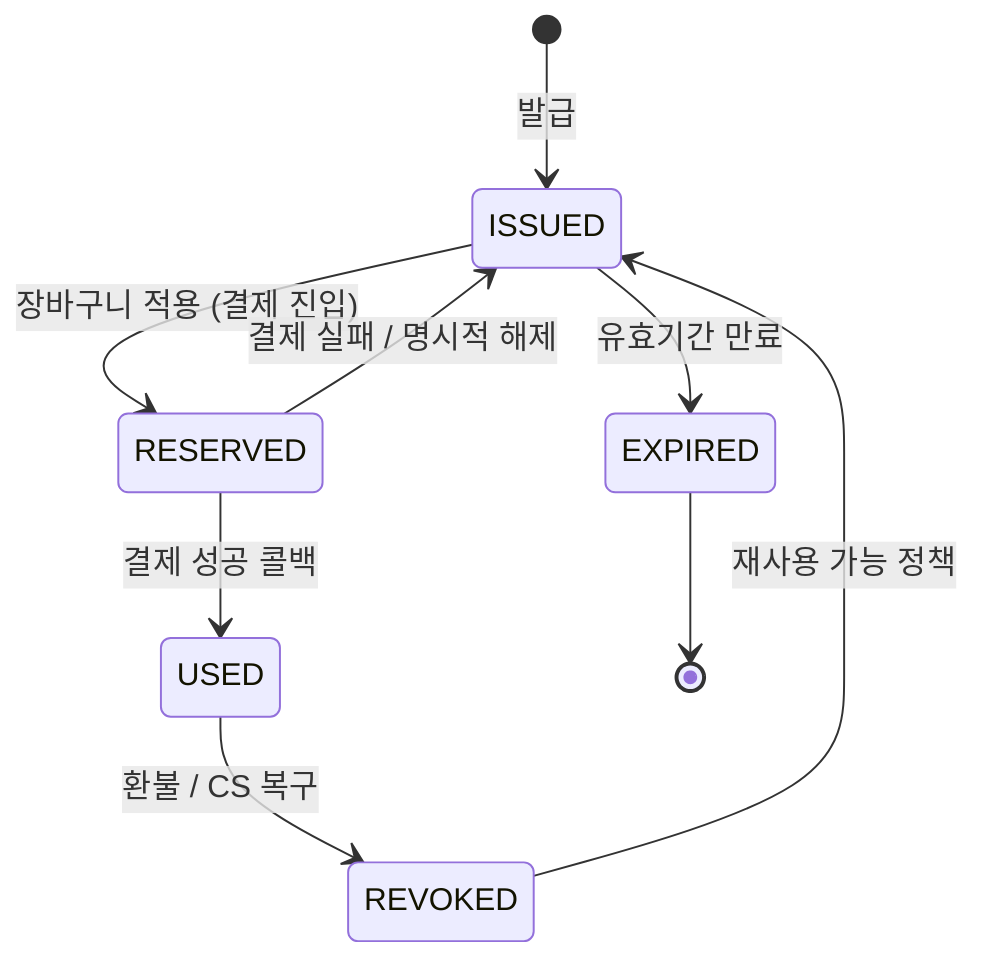
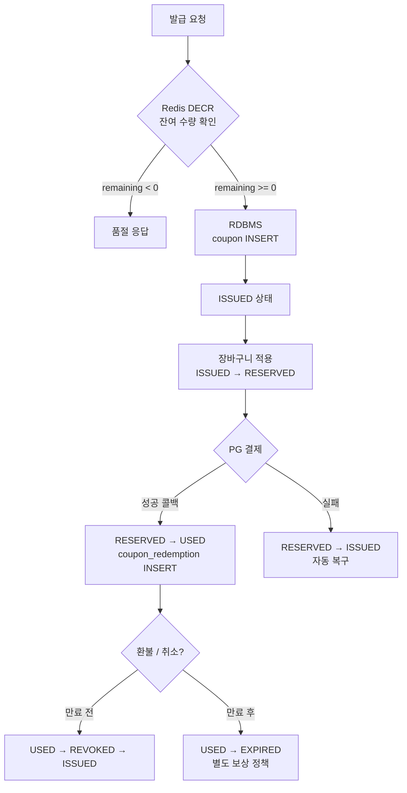

# [초안] 쿠폰/프로모션 동시성과 정합성 기본기 — 선착순·중복 사용 방지·발급/사용/복구

## 왜 이 주제가 중요한가

쿠폰과 프로모션은 F&B 커머스에서 매출을 만드는 동시에 정합성 이슈가 가장 자주 터지는 영역이다. "1만 개 한정 50% 할인 쿠폰"이라는 한 줄 기획은 백엔드 입장에서 보면 동시성, 멱등성, 락 전략, 캐시 일관성, 보상 트랜잭션이 한꺼번에 등장하는 종합 문제다. 매장 오픈 이벤트, 앱 푸시 후 1분, 신메뉴 런칭 같은 짧고 강한 트래픽 스파이크에서 한 번이라도 초과 발급이 일어나면 회계·CS·마케팅 모두 영향을 받는다.

쿠폰 도메인은 "동시성 문제를 실제로 다뤄봤는가"가 빠르게 드러나는 주제다. JPA, MySQL, Redis, 분산락, 이벤트 메시징이 한 번에 묶이고, 설계 수준에 따라 깊이 차이가 매우 크게 갈린다. 매장/배달/앱 채널이 섞인 외식 커머스에서는 한 쿠폰이 여러 채널을 통해 동시에 사용 시도되는 시나리오가 빈번하므로, 기본기 자체가 정합성의 핵심이 된다.

이 글은 선착순 발급의 race condition, 중복 사용 방지, 발급/사용/복구의 상태 모델, RDBMS와 Redis의 역할 분담, optimistic/pessimistic lock과 분산락의 선택 기준, 그리고 이벤트 오픈 피크 트래픽 대응과 CS 복구까지를 한 번에 정리한다.

## 핵심 개념 정리

### 쿠폰 도메인의 세 가지 객체

쿠폰 도메인을 설계할 때는 세 종류의 객체를 분리해서 생각한다.

- **CouponPolicy** — 캠페인 정의. 총 발급 수량, 시작/종료 시간, 할인 규칙, 사용 가능 매장, 중복 사용 가능 여부를 가진다.
- **Coupon**(CouponIssue) — 사용자가 실제로 보유한 쿠폰. `policyId`, `userId`, `code`, `status`, `issuedAt`, `usedAt`, `expiredAt` 같은 필드를 가진다.
- **CouponRedemption** — 한 번의 사용 이벤트. `couponId`, `orderId`, `usedAt`, `revokedAt`을 가진다. 한 쿠폰이 여러 번 사용 가능하다면(스탬프형) 이 객체가 N개가 된다.

이 셋을 합쳐 한 테이블로 만들면 처음에는 편하지만, 사용/취소/복구 흐름이 들어오는 순간 상태 컬럼 하나로는 표현이 부족해진다. 쿠폰 테이블을 설계할 때 이 세 객체를 분리하는 것이 좋은 출발점이다.

### 정합성 깨지는 두 축

쿠폰에서 정합성이 깨지는 경우는 크게 두 가지다.

1. **초과 발급** — 1만 개 한정인데 10,003개가 발급된다. 발급 카운트의 race condition이다.
2. **중복 사용** — 한 번만 써야 하는 쿠폰이 동시 두 주문에서 사용 처리된다. 사용 상태 전이의 race condition이다.

대부분의 쿠폰 사고는 이 둘 중 하나다. "결제 실패했는데 쿠폰만 사용 처리됨" 같은 케이스는 보상 트랜잭션 설계 영역이고, 이건 별도로 다룬다.

## 선착순 발급에서 일어나는 race condition

가장 단순한 구현은 다음과 같다.

```java
@Transactional
public Coupon issue(Long policyId, Long userId) {
    CouponPolicy policy = policyRepository.findById(policyId).orElseThrow();
    long issued = couponRepository.countByPolicyId(policyId);
    if (issued >= policy.getTotalQuantity()) {
        throw new CouponSoldOutException();
    }
    return couponRepository.save(new Coupon(policyId, userId));
}
```

이 코드는 단일 스레드 환경에서는 잘 동작하지만, 동시 요청 1,000개가 들어오면 거의 확실히 초과 발급이 발생한다. `count` 시점과 `save` 시점 사이에 다른 트랜잭션이 끼어들 수 있기 때문이다. `REPEATABLE READ` 격리 수준이라도 phantom write 자체를 막아주지는 않는다(InnoDB의 gap lock은 `SELECT ... FOR UPDATE`나 잠금성 쿼리에만 붙는다).

해결 전략은 네 가지다.

### 전략 1. 정책 row에 비관적 락 걸기

```java
@Lock(LockModeType.PESSIMISTIC_WRITE)
@Query("select p from CouponPolicy p where p.id = :id")
Optional<CouponPolicy> findByIdForUpdate(@Param("id") Long id);
```

```java
@Transactional
public Coupon issue(Long policyId, Long userId) {
    CouponPolicy policy = policyRepository.findByIdForUpdate(policyId).orElseThrow();
    if (policy.getIssuedCount() >= policy.getTotalQuantity()) {
        throw new CouponSoldOutException();
    }
    policy.increaseIssuedCount();
    return couponRepository.save(new Coupon(policyId, userId));
}
```

장점은 명확함과 단순함. 단점은 모든 발급 요청이 한 row의 락을 직렬화하면서 통과한다는 것이다. 1초에 5천 건이 들어오면 락 대기 큐가 길어지면서 커넥션 풀이 고갈되고, 다른 일반 트래픽까지 같이 죽는다. 캠페인이 작거나 트래픽이 비교적 낮은 매장 단위 쿠폰이면 충분히 쓸 수 있다.

### 전략 2. UPDATE ... WHERE 카운트 조건

원자적 update 한 방으로 끝낸다.

```sql
UPDATE coupon_policy
   SET issued_count = issued_count + 1
 WHERE id = :id
   AND issued_count < total_quantity;
```

```java
int updated = jdbcTemplate.update(SQL, policyId);
if (updated == 0) {
    throw new CouponSoldOutException();
}
```

`UPDATE`는 자동으로 row lock을 잡고 조건을 검증한다. update가 0건이면 매진. 락 보유 시간이 매우 짧기 때문에 전략 1보다 훨씬 견딘다. 단, 여전히 단일 row contention이라 초당 수천 건을 노린다면 한계가 온다.

### 전략 3. Redis 카운터로 입구 막기

뜨거운 카운터를 Redis로 옮긴다. 이벤트 시작 시점에 `SET coupon:policy:1:remaining 10000`을 미리 박아두고, 발급 요청은 `DECR`로 차감한다.

```java
public boolean tryReserve(Long policyId) {
    Long remaining = redisTemplate.opsForValue().decrement("coupon:policy:" + policyId + ":remaining");
    if (remaining == null || remaining < 0) {
        redisTemplate.opsForValue().increment("coupon:policy:" + policyId + ":remaining");
        return false;
    }
    return true;
}
```

`DECR`는 단일 키에 대해 원자적이다. 따라서 카운터 race는 사라진다. 차감에 성공한 요청만 RDBMS 발급으로 넘어간다. 이때 RDBMS 발급은 카운터를 다시 검증하지 않고, "이미 입장권을 받은 사람"으로 간주하고 row만 만든다.

위험 포인트가 두 개 있다.

- **부분 실패 시 누수** — Redis `DECR`는 성공했는데 RDBMS insert가 실패하면 발급 수량이 영구적으로 1 줄어든다. 보상 `INCR` 또는 outbox/배치 보정이 필요하다.
- **Redis 다운 시 무결성** — Redis 단독 의존이라면 장애 시 발급이 멈춘다. 정책상 "장애 시 발급 중단"이 허용되는지 합의해야 한다.

이벤트 오픈 피크가 짧고 강한 외식 커머스라면 전략 3이 사실상 표준이다.

### 전략 4. 사전 발급 + 청구

극단적 트래픽이라면 캠페인 시작 전 미리 N개의 빈 쿠폰 row를 만들어두고, 사용자는 그 중 하나를 "내 것으로 클레임"하는 방식으로 바꿀 수 있다. 클레임은 `UPDATE coupon SET user_id = :uid WHERE id = ? AND user_id IS NULL`. 이건 락 contention이 단일 정책 row가 아니라 N개의 쿠폰 row로 분산되기 때문에 매우 잘 견딘다. 단, 운영이 복잡해진다.

## 중복 사용 방지

중복 사용은 두 가지 형태로 들어온다.

1. 같은 쿠폰을 두 주문에서 동시에 사용 시도 (동시성 문제)
2. 사용자가 결제 실패 후 재시도하는 동안 결제 PG 콜백이 늦게 들어와 두 번 처리됨 (멱등성 문제)

### Unique key + 상태 전이

가장 견고한 1차 방어선은 DB unique key다.

```sql
CREATE TABLE coupon_redemption (
  id            BIGINT PRIMARY KEY AUTO_INCREMENT,
  coupon_id     BIGINT NOT NULL,
  order_id      VARCHAR(64) NOT NULL,
  used_at       DATETIME(6) NOT NULL,
  revoked_at    DATETIME(6) NULL,
  UNIQUE KEY uk_coupon_active (coupon_id, revoked_at)
);
```

`revoked_at`이 NULL인 동안에는 한 쿠폰에 대해 활성 redemption이 단 하나만 존재할 수 있다. revoke되면 NULL이 아니게 되어 새 사용이 가능해진다. MySQL의 unique index는 NULL을 중복으로 보지 않기 때문에 이 기법이 동작한다.

상태 전이는 `Coupon.status`로 표현한다.



상태 변경은 항상 조건부 update로 한다.

```sql
UPDATE coupon
   SET status = 'USED', used_at = NOW(6), order_id = :orderId
 WHERE id = :couponId
   AND status = 'ISSUED'
   AND user_id = :userId
   AND expired_at > NOW(6);
```

update가 0건이면 이미 사용됐거나 만료됐거나 다른 사람의 쿠폰이다. 이건 optimistic lock의 일종이다. JPA `@Version`을 쓸 수도 있지만, 실무에서는 위처럼 도메인 조건이 함께 들어가는 명시적 update가 더 안전하다고 본다.

### Optimistic vs Pessimistic vs 분산락

이 셋을 비교하는 기준은 단순히 "성능"이 아니라 "충돌 빈도"와 "락 범위"다.

- **Optimistic lock** — 충돌이 드물 때. 실패하면 재시도하거나 사용자에게 즉시 에러. 쿠폰 사용은 충돌이 드문 편이라 보통 여기로 충분하다.
- **Pessimistic lock** — 충돌이 잦고, 재시도 비용이 클 때. 한 row를 두고 여러 트랜잭션이 자주 다투는 상황. 쿠폰에서는 정책 카운터에 잠깐 쓸 수는 있다.
- **분산락**(Redis Redlock, ZooKeeper, DB advisory lock) — DB row 단위가 아닌 비즈니스 단위 락. 예: "한 사용자가 동시에 두 주문을 만들지 못하게" 같은 cross-row 락. 사용량 제한, 큐 직렬화에 쓴다. 단일 row 정합성에 분산락을 거는 것은 over-engineering인 경우가 많다.

분산락은 만능이 아니다. Redlock은 노드 fail-over 시점에 안전성 논쟁이 있고(Martin Kleppmann의 비판이 유명하다), TTL 만료와 작업 종료 사이의 race도 있다. "분산락을 걸었으니 안전하다"가 아니라 "분산락 + DB unique key + 상태 전이 update"가 함께 있어야 안전하다.

## Redis와 RDBMS의 역할 분담

쿠폰 시스템에서 Redis와 RDBMS는 다음처럼 나누는 게 일반적이다.

| 책임 | RDBMS | Redis |
|---|---|---|
| 발급 권한 카운터 | 보조 (배치 보정) | 주 (이벤트 피크) |
| 사용자 보유 쿠폰 목록 | 주 | 캐시 |
| 사용 상태 전이 | 주 (트랜잭션 + unique key) | 보조 (속도 캐시) |
| 멱등키 | 보조 | 주 (`SETNX`, TTL) |
| 분산락 | DB advisory lock 가능 | 주 (`SET NX EX`) |
| 환불 시 복구 카운터 | 주 (소스 오브 트루스) | 보조 |

핵심 원칙: **돈이 걸린 정합성은 RDBMS가, 트래픽 흡수는 Redis가**. Redis만으로 모든 걸 처리하려 하면 장애 한 번에 회계가 어긋난다. 반대로 RDBMS만 쓰면 이벤트 피크에 못 견딘다. 경계를 분명히 두는 게 시니어다운 답변이다.

## 발급/사용/복구의 전체 흐름

한 쿠폰의 라이프사이클을 트랜잭션 경계와 함께 그려본다.



1. **발급** — Redis `DECR`로 입장권 확인 → RDBMS `INSERT coupon`. 두 단계가 같은 트랜잭션이 아니므로 outbox 또는 보정 배치를 둔다.
2. **장바구니 적용**(예약) — `Coupon.status = ISSUED → RESERVED`. 다른 주문에 같은 쿠폰이 들어가지 못하게 짧게 잠근다.
3. **결제 시도** — PG 호출. PG는 외부 시스템이므로 트랜잭션에 묶지 않는다.
4. **결제 성공 콜백** — `RESERVED → USED`. `coupon_redemption` row 생성. 같은 `paymentId`로 두 번 호출되어도 멱등하게 처리한다.
5. **결제 실패** — `RESERVED → ISSUED`. 자동 복구.
6. **환불/취소** — `USED → REVOKED → ISSUED` 또는 `USED → EXPIRED`. 정책에 따라 다르다.

이 중 가장 자주 사고가 나는 지점은 **3과 4 사이의 PG 콜백 늦음**이다. 사용자가 "결제 실패했다"고 보고 다시 시도하는 동안 PG가 늦게 콜백을 보내면 쿠폰이 두 번 사용 처리될 수 있다. 멱등키(`Idempotency-Key` 헤더 또는 `paymentId`)로 차단한다.

## bad vs improved 예제

### bad: 트랜잭션 안에서 외부 호출

```java
@Transactional
public OrderResult pay(Long couponId, OrderRequest req) {
    Coupon coupon = couponRepository.findById(couponId).orElseThrow();
    coupon.markUsed();
    PgResponse pg = pgClient.charge(req);
    if (!pg.isSuccess()) {
        throw new PaymentFailedException();
    }
    return new OrderResult(pg);
}
```

문제:
- PG 호출이 트랜잭션 안에 들어가 있어 락 보유 시간이 PG 응답 시간만큼 길어진다. 정확히 피크에 죽는다.
- PG 타임아웃이 5초인데 트랜잭션 30초인 경우, 결과적으로 결제가 성공했는데 트랜잭션이 죽어 쿠폰만 롤백되는 케이스가 발생한다.
- 멱등키가 없어 같은 요청 두 번에 두 번 charge된다.

### improved: 트랜잭션 분리 + 멱등키

```java
public OrderResult pay(Long couponId, OrderRequest req) {
    String idemKey = req.getIdempotencyKey();
    if (!idempotencyStore.tryClaim(idemKey)) {
        return idempotencyStore.getResult(idemKey);
    }

    reserveCoupon(couponId, req.getOrderId());

    PgResponse pg;
    try {
        pg = pgClient.charge(req);
    } catch (Exception e) {
        releaseCoupon(couponId, req.getOrderId());
        throw e;
    }

    if (pg.isSuccess()) {
        confirmCoupon(couponId, req.getOrderId(), pg.getPaymentId());
    } else {
        releaseCoupon(couponId, req.getOrderId());
    }

    OrderResult result = new OrderResult(pg);
    idempotencyStore.saveResult(idemKey, result);
    return result;
}

@Transactional
void reserveCoupon(Long couponId, String orderId) {
    int updated = couponJdbc.updateStatus(couponId, "ISSUED", "RESERVED", orderId);
    if (updated == 0) throw new CouponNotUsableException();
}
```

핵심 변화:
- 외부 호출과 DB 트랜잭션을 분리한다. DB 트랜잭션은 짧게 유지한다.
- `RESERVED` 상태를 둬서 쿠폰을 임시로 잠그되, 카운터 락은 잡지 않는다.
- 멱등키로 재호출을 흡수한다.
- 실패 시 명시적 release.

## 로컬 실습 환경

MySQL 8과 Redis를 docker compose로 띄운다.

```yaml
services:
  mysql:
    image: mysql:8.0
    environment:
      MYSQL_ROOT_PASSWORD: root
      MYSQL_DATABASE: coupon
    ports: ["3307:3306"]
    command: --transaction-isolation=READ-COMMITTED
  redis:
    image: redis:7-alpine
    ports: ["6379:6379"]
```

스키마.

```sql
CREATE TABLE coupon_policy (
  id              BIGINT PRIMARY KEY AUTO_INCREMENT,
  name            VARCHAR(100) NOT NULL,
  total_quantity  INT NOT NULL,
  issued_count    INT NOT NULL DEFAULT 0,
  starts_at       DATETIME(6) NOT NULL,
  ends_at         DATETIME(6) NOT NULL
);

CREATE TABLE coupon (
  id          BIGINT PRIMARY KEY AUTO_INCREMENT,
  policy_id   BIGINT NOT NULL,
  user_id     BIGINT NOT NULL,
  status      VARCHAR(20) NOT NULL,
  order_id    VARCHAR(64) NULL,
  issued_at   DATETIME(6) NOT NULL,
  used_at     DATETIME(6) NULL,
  expired_at  DATETIME(6) NOT NULL,
  UNIQUE KEY uk_user_policy (user_id, policy_id),
  KEY ix_policy_status (policy_id, status)
);

CREATE TABLE coupon_redemption (
  id          BIGINT PRIMARY KEY AUTO_INCREMENT,
  coupon_id   BIGINT NOT NULL,
  order_id    VARCHAR(64) NOT NULL,
  used_at     DATETIME(6) NOT NULL,
  revoked_at  DATETIME(6) NULL,
  UNIQUE KEY uk_coupon_active (coupon_id, revoked_at)
);
```

`uk_user_policy`가 1인 1쿠폰을 보장한다. 사용자가 동시에 두 번 발급 시도해도 두 번째는 unique 위반으로 떨어진다. DB가 끝까지 책임지는 안전망이 된다.

## 실행 가능한 실습 시나리오

### 실습 1. 락 없는 발급 vs 원자 update

`k6` 또는 `vegeta`로 1,000 RPS를 30초간 쏜다. 첫 번째 구현은 카운트 후 insert, 두 번째 구현은 `UPDATE coupon_policy SET issued_count = issued_count + 1 WHERE id = ? AND issued_count < total_quantity`.

```bash
k6 run --vus 200 --duration 30s issue.js
```

`SELECT COUNT(*) FROM coupon WHERE policy_id = 1` 결과를 비교해서 첫 번째에서는 초과 발급이 일어나는지 확인한다. 100개 정원에 110\~130개가 박히는 걸 보면 race condition을 눈으로 본 셈이다.

### 실습 2. Redis DECR 카운터

```java
RedisAtomicLong counter = new RedisAtomicLong("coupon:policy:1:remaining", connectionFactory, 100L);
long remaining = counter.decrementAndGet();
if (remaining < 0) { counter.incrementAndGet(); throw new SoldOutException(); }
```

같은 부하로 돌렸을 때 발급 수가 정확히 100인지 확인한다. 추가로 RDBMS insert를 일부러 50% 확률로 실패시켜서 누수가 일어나는지를 관찰하고, 보정 로직을 붙여본다.

### 실습 3. 동시 사용 차단

한 쿠폰을 두 주문에서 동시에 사용 처리하는 두 스레드 테스트.

```java
ExecutorService es = Executors.newFixedThreadPool(2);
CountDownLatch latch = new CountDownLatch(1);
Future<Boolean> a = es.submit(() -> { latch.await(); return service.use(couponId, "ORD-A"); });
Future<Boolean> b = es.submit(() -> { latch.await(); return service.use(couponId, "ORD-B"); });
latch.countDown();
```

조건부 update 구현이라면 정확히 한 쪽만 true가 나와야 한다. 단순 read-then-write 구현이면 둘 다 true가 나오는 케이스를 재현할 수 있다.

### 실습 4. 멱등키 흡수

같은 `Idempotency-Key`로 두 번 결제 요청을 보내고, PG 호출은 한 번만 일어나는지 로그로 확인한다. Redis `SET key value NX EX 600` 패턴을 쓰면 직관적이다.

## 자주 빠지는 실수 패턴

- **read-then-write를 한 트랜잭션에 넣으면 안전하다고 착각** — `REPEATABLE READ`라도 락 없이는 동시 insert를 막지 못한다.
- **`@Transactional`만 붙이면 동시성이 해결된다고 생각** — 트랜잭션 격리는 동시성 제어의 일부일 뿐, race condition을 다 막아주지 않는다.
- **Redis만으로 정합성 책임지기** — 장애 한 번에 회계가 어긋난다.
- **분산락의 TTL을 작업 시간보다 짧게 잡기** — TTL 만료 후 다른 노드가 락을 잡고 동시에 둘이 작업한다.
- **PG 호출을 트랜잭션 안에서 하기** — 외부 IO 대기 동안 락이 잡혀 있어 피크에 죽는다.
- **`coupon.status = USED`만 보고 사용 가능 여부 판단** — 만료, 정책 종료, 매장 제한도 같이 봐야 한다. 조건부 update에 모두 포함시킨다.
- **revoke를 단순 status 변경으로** — `coupon_redemption` 이력이 사라지면 사후 분석이 불가능해진다. 이력 보존이 기본이다.

## 이벤트 오픈 피크 트래픽 대응

피크 트래픽 대응은 단일 기법이 아니라 입구–카운터–DB–후속처리의 4단 방어다.

- **입구**(API Gateway/WAF) — 사용자당 RPS 제한, 봇 차단. 발급 시도 자체를 줄인다.
- **카운터**(Redis) — `DECR` 단일 키로 정원 검증. 매진되면 즉시 차단.
- **DB**(RDBMS) — Redis를 통과한 요청만 받고, unique key로 1인 1쿠폰을 보장한다. insert는 빠르게.
- **후속 처리**(Kafka/outbox) — 분석, 알림, 회계 정합성 검증은 비동기로 뺀다. 실시간 경로에서 제거한다.

추가 기법.
- **대기열 패턴** — 정원이 매우 작고 트래픽이 매우 큰 경우, 사용자에게 대기열 토큰을 발급하고 순서대로만 발급 호출을 들여보낸다.
- **사전 발급 + 클레임** — 트래픽 분산.
- **셀프 서킷 브레이커** — 정합성 검증 배치가 이상치를 감지하면 발급 자체를 중단.

## CS 복구 시나리오

CS에서 가장 많이 들어오는 요청 세 가지에 대한 표준 복구.

1. **결제 실패했는데 쿠폰이 사용 처리됨** — `coupon_redemption.revoked_at`을 채우고, `coupon.status`를 `ISSUED`로 되돌린다. `coupon_policy.issued_count`는 건드리지 않는다(이미 발급된 쿠폰이므로). 운영 도구는 항상 이력을 남긴다.
2. **환불 후 쿠폰 복구** — 정책에 따라 다르다. 1회용이면 `EXPIRED`. 재사용 가능 정책이면 `ISSUED`로 되돌리고 `expired_at`은 그대로 둔다.
3. **잘못 발급됨, 회수 필요** — `coupon.status`를 `REVOKED`로. 단, 이미 사용된 쿠폰을 회수하려면 회계와 합의가 필요하다.

CS 복구 도구는 반드시 권한 체크와 감사 로그를 강제한다. 운영자가 임의로 쿠폰을 발급/회수할 수 있게 두면 정합성 검증 자체가 무의미해진다.

## 설계 의사결정 정리

자주 부딪히는 상황과 설계 골격.

- **선착순 쿠폰 발급, 어떻게 설계하는가?**
  → 트래픽 규모를 먼저 본다. 초당 수백이면 RDBMS `UPDATE ... WHERE issued_count < total` 한 방. 초당 수천 이상이면 Redis `DECR` + RDBMS insert + 보정 배치. 이유는 단일 row contention과 락 보유 시간이다. unique key로 1인 1쿠폰은 DB가 보장한다.

- **쿠폰이 두 번 사용되는 사고, 원인 분석은?**
  → 세 군데를 본다. (1) 사용 처리 SQL이 조건부 update인지, (2) `coupon_redemption`에 unique 인덱스가 있는지, (3) 결제 콜백 멱등 처리가 있는지. 보통 셋 중 둘 이상이 빠져 있다.

- **Redis 분산락만으로 충분한가?**
  → 충분하지 않다. Redlock의 안전성 논쟁, TTL 만료 race, 노드 fail-over 시점 문제가 있다. 분산락은 처리 직렬화 용도로 쓰고, 정합성 자체는 DB unique key와 조건부 update로 책임진다. "락은 빠르게, 정합성은 DB로"가 원칙이다.

- **이벤트 피크에 DB 커넥션 풀이 다 죽었다, 어떻게 푸는가?**
  → 트랜잭션 안에서 외부 호출이 있는지 본다. 락 보유 시간을 줄이는 게 첫 번째. Redis 카운터로 입구를 막는 게 두 번째. 후속 처리를 비동기로 빼는 게 세 번째.

- **발급 수량이 회계와 안 맞는다.**
  → Redis와 RDBMS 사이의 보정 배치를 의심한다. Redis `DECR`는 성공했는데 RDBMS insert가 실패한 경로가 있는지, outbox가 멱등하게 동작하는지 확인. 소스 오브 트루스는 RDBMS여야 한다.

구체 숫자(초당 RPS, 락 보유 ms, 커넥션 풀 사이즈)를 함께 잡아두면 트래픽 구간별 선택 기준이 명확해진다. "이 정도 트래픽에서는 이게, 그 이상에서는 저게"의 구간 감각이 설계 판단의 핵심이다.

## 학습 체크리스트

- [ ] 선착순 발급에서 일어나는 race condition을 코드 두 줄로 설명할 수 있다.
- [ ] `UPDATE ... WHERE` 원자 update와 비관적 락의 trade-off를 비교할 수 있다.
- [ ] Redis `DECR` 패턴의 부분 실패 시나리오와 보정 전략을 설명할 수 있다.
- [ ] `coupon`, `coupon_redemption`, `coupon_policy`의 책임 분리를 그림 없이 설명할 수 있다.
- [ ] unique key + 조건부 update가 왜 분산락보다 정합성에 강한지 답할 수 있다.
- [ ] PG 외부 호출을 트랜잭션 밖으로 빼야 하는 이유를 락 보유 시간 관점에서 설명할 수 있다.
- [ ] 멱등키 패턴(`SETNX + TTL`)을 코드로 작성할 수 있다.
- [ ] CS 복구에서 `revoke`가 단순 status 변경이 아니라 이력 보존을 동반해야 하는 이유를 말할 수 있다.
- [ ] 이벤트 피크 4단 방어(입구–카운터–DB–후속)를 자기 말로 설명할 수 있다.
- [ ] Redlock의 한계와 그럼에도 분산락을 쓰는 이유를 설명할 수 있다.

## 2026-05-19 보강 — 선착순 이벤트와 CS 복구

쿠폰/프로모션 설계는 “빠른 발급”보다 “초과 발급과 중복 사용을 어떻게 끝까지 막는가”가 더 중요하다. Redis counter만으로 성공을 확정하면 장애 복구 시 RDBMS와 불일치가 생기기 쉽고, RDBMS 락만으로 처리하면 이벤트 오픈 피크에 병목이 된다.

추천 설계는 다음처럼 역할을 나눈다.

- Redis는 선착순 대기열, rate limit, 임시 카운터처럼 트래픽 흡수 계층으로 쓴다.
- RDBMS는 최종 발급/사용 사실의 source of truth로 두고 unique constraint를 둔다.
- 중복 발급 방지는 `policy_id + member_id` unique key로, 초과 발급 방지는 policy 잔여 수량 조건부 update로 막는다.
- 중복 사용 방지는 `coupon_id` 상태 전이와 `coupon_id + order_id` redemption unique key를 함께 사용한다.
- 결제 실패 후 쿠폰 복구는 주문/결제 상태와 분리된 보상 이벤트로 처리하고, 수동 CS 복구 감사로그를 남긴다.
- 분산락은 “짧은 임계구역 보호”에만 사용하고, 락 유실을 대비해 DB 제약을 마지막 방어선으로 둔다.

한 줄 요약은 “Redis로 빠르게 줄 세우되, 최종 정합성은 RDBMS 제약과 상태 전이가 보장하게 설계한다. 장애 시에는 발급/사용/복구 이벤트를 감사로그로 남겨 CS가 어떤 주문에서 쿠폰이 묶였는지 추적할 수 있게 한다”이다.
