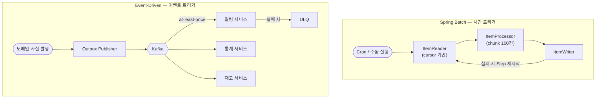

# [초안] Spring Batch vs Event-Driven — 같은 비동기처럼 보이지만 전혀 다른 두 패러다임

> 관련 문서: [Outbox / Inbox Pattern 심화](./outbox-inbox-pattern.md), [분산 트랜잭션과 Outbox 패턴](./distributed-transaction-outbox-pattern.md). 본 문서는 두 처리 패러다임의 선택 기준과 trade-off에 집중하고, 위 두 문서는 이벤트 발행의 정합성 메커니즘에 집중한다.

## 왜 중요한가

백엔드를 4\~5년차 이상 다루다 보면 어느 시점에서 "이건 동기로 처리하기 어렵다"는 결론에 도달한다. 사용자가 결제 버튼을 누르면 결제 승인은 동기적으로 끝나야 하지만, 알림 발송, 통계 집계, 추천 모델 재학습, 검색 색인 갱신, CRM 동기화는 모두 비동기로 빠진다. 이때 두 가지 길이 갈린다.

하나는 데이터를 모아 **일정 시점에 한 번에 처리**하는 길**(batch)**이다. 또 하나는 발생하는 변화를 **그 즉시 메시지로 흘려보내고 소비자들이 각자 받아 처리**하는 길**(event-driven)**이다. 표면적으로는 둘 다 "비동기"라는 이름으로 묶여 동등하게 비교되지만, 실전에서 두 길은 운영 방식, 장애 처리, 데이터 정합성, 모니터링 지표, 심지어 채용 면접에서 받는 질문의 형태까지 완전히 다르다.

면접관이 "왜 이건 Kafka 안 쓰고 Spring Batch로 했어요?"라고 묻거나 그 반대로 "왜 배치 안 돌리고 이벤트로 처리하셨어요?"라고 물었을 때, "그게 더 적합해서"라는 답은 통하지 않는다. 시니어 면접에서 보고 싶은 건 **두 패러다임의 본질적 차이**(latency, throughput, ordering, replay, 운영 비용)를 자기 언어로 정리해 둔 사람이다. 이 문서는 그 정리를 목표로 한다.

---

## 두 패러다임의 본질적 차이

### 트리거와 시간 관점

- **Spring Batch는 시간이 트리거다.** Cron이든 사용자 호출이든, "지금 이 순간부터 어디까지의 데이터를 처리하라"는 윈도우가 명시적으로 정해진다.
- **Event-Driven은 이벤트가 트리거다.** 어떤 도메인 사실이 일어났다는 정보가 broker로 흘러가는 순간이 처리 시작점이다.

이 차이가 거의 모든 후속 결정에 영향을 준다. Spring Batch에서 "마지막으로 처리한 ID 이후"라는 cursor가 진실의 원천이라면, Event-Driven에서는 broker offset이 진실의 원천이다.

### 처리 단위 관점

- **Batch는 chunk**(예 100건, 500건) 단위로 처리한다. chunk 안에서 ItemReader → ItemProcessor → ItemWriter가 묶여 동작하고 chunk 단위로 트랜잭션이 끊긴다.
- **Event-Driven은 message** 단위로 처리한다. 한 메시지가 하나의 비즈니스 사실에 대응한다.

### 정합성 관점

- **Batch는 최종 일관성을 일정 주기로 회복**시키는 데 강하다. 새벽 3시 정산 배치가 그 예다.
- **Event-Driven은 최종 일관성을 사건 발생 직후 회복**시키는 데 강하다. 주문 직후 재고가 깎이는 흐름이 그 예다.

이 두 관점이 **상호 배타적이지 않다**는 점이 중요하다. 실제 서비스에서는 둘이 거의 항상 같이 쓰인다. 다만 어느 쪽이 그 도메인의 1차 처리 통로인지를 명확히 해야 한다.

---

## Spring Batch 핵심 개념 — Step 단위 실패 격리

Spring Batch는 단순한 "스케줄러 + 루프"가 아니다. 핵심은 **재시작 가능성**(restartability)과 **Step 단위 실패 격리**다.

```java
@Configuration
@EnableBatchProcessing
public class IndexConfluenceJobConfig {

    @Bean
    public Job indexConfluenceJob(JobRepository jobRepository,
                                  Step fetchPagesStep,
                                  Step parseAdfStep,
                                  Step embeddingStep,
                                  Step indexStep,
                                  Step deleteSyncStep) {
        return new JobBuilder("indexConfluenceJob", jobRepository)
            .start(fetchPagesStep)
            .next(parseAdfStep)
            .next(embeddingStep)
            .next(indexStep)
            .next(deleteSyncStep)
            .build();
    }
}
```

이 코드의 가치는 다섯 Step 중 **embeddingStep이 OpenAI rate limit으로 실패해도, fetchPagesStep과 parseAdfStep의 결과는 보존**된다는 점이다. 재시작하면 실패한 embeddingStep부터 시작한다. 만약 이 전체를 거대한 단일 메서드로 짰다면 임베딩 한 번 실패에 처음부터 다시 돌려야 한다.

### Chunk-Oriented Processing

```java
@Bean
public Step embeddingStep(JobRepository jobRepository,
                          PlatformTransactionManager txm,
                          ItemReader<Document> reader,
                          ItemProcessor<Document, EmbeddedDocument> processor,
                          ItemWriter<EmbeddedDocument> writer) {
    return new StepBuilder("embeddingStep", jobRepository)
        .<Document, EmbeddedDocument>chunk(100, txm)
        .reader(reader)
        .processor(processor)
        .writer(writer)
        .faultTolerant()
        .retryLimit(3)
        .retry(TransientApiException.class)
        .skipLimit(50)
        .skip(InvalidDocumentException.class)
        .build();
}
```

여기서 알아둘 점:

- `chunk(100)`: 100건씩 모아 한 트랜잭션으로 커밋. chunk 도중 실패하면 그 chunk만 롤백.
- **retry**: 일시적 예외**(rate limit, network blip)**는 같은 메시지로 재시도.
- **skip**: 데이터 자체가 잘못된 경우 그 한 건만 건너뛰고 다음 chunk 진행.

### AsyncItemProcessor와 I/O 병렬화

배치는 단일 스레드 직렬 처리가 기본이라 I/O 바운드 작업에 약하다. `AsyncItemProcessor`로 chunk 내부를 병렬화하면 임베딩 API처럼 청크당 수십 초 걸리는 외부 호출을 동시 실행할 수 있다.

```java
@Bean
public AsyncItemProcessor<Document, EmbeddedDocument> asyncProcessor(
        ItemProcessor<Document, EmbeddedDocument> delegate,
        TaskExecutor taskExecutor) {
    AsyncItemProcessor<Document, EmbeddedDocument> async = new AsyncItemProcessor<>();
    async.setDelegate(delegate);
    async.setTaskExecutor(taskExecutor);
    return async;
}
```

병렬화는 공짜가 아니다. 외부 API의 rate limit을 깰 수 있고, 메모리 사용량이 늘어난다. 그래서 chunk size와 thread pool size를 함께 튜닝해야 한다.

---

## Event-Driven 핵심 개념 — Topic, Partition, Consumer Group

Event-Driven에서는 broker(Kafka, RabbitMQ, SQS)가 핵심 인프라다.

```java
@Component
@RequiredArgsConstructor
public class OrderEventPublisher {

    private final ApplicationEventPublisher events;
    private final OrderRepository orderRepository;

    @Transactional
    public Order placeOrder(OrderCommand cmd) {
        Order order = orderRepository.save(Order.from(cmd));
        events.publishEvent(new OrderPlaced(order.getId()));
        return order;
    }
}
```

```java
@Component
public class OrderPlacedKafkaBridge {

    private final KafkaTemplate<String, OrderPlaced> kafka;

    @TransactionalEventListener(phase = TransactionPhase.AFTER_COMMIT)
    public void onCommitted(OrderPlaced event) {
        kafka.send("order.placed.v1", String.valueOf(event.orderId()), event);
    }
}
```

이 두 조각이 합쳐져 "주문이 커밋된 직후" Kafka로 메시지가 흘러간다. 이 메시지를 알림 서비스, 재고 서비스, 통계 서비스가 각자 자기 속도로 소비한다.

### Partition Key 선택이 ordering을 결정한다

같은 `orderId`를 partition key로 쓰면 같은 주문에 대한 이벤트는 같은 파티션에 쌓이고, 한 컨슈머 인스턴스가 순서대로 받는다. partition key를 잘못 고르면 후속 이벤트가 선행 이벤트보다 먼저 처리되는 사고가 생긴다.

### Consumer Group과 수평 확장

같은 topic을 여러 인스턴스가 분할 소비하면 throughput이 늘어난다. 하지만 partition 수가 consumer 수의 상한이다. partition을 16개로 잡으면 컨슈머 인스턴스를 17개로 늘려도 한 인스턴스는 놀게 된다.

### Replay와 Offset

Kafka의 강점은 메시지를 일정 기간 보존한다는 점이다. consumer group을 새로 만들어 from-beginning으로 다시 소비하면 과거 이벤트를 그대로 재생할 수 있다. 신규 소비 서비스가 합류했을 때 backfill을 이 메커니즘으로 한다. RabbitMQ에는 이런 자연스러운 replay가 없으므로 Outbox 테이블이나 별도 archive에서 다시 발행해야 한다.

---

## 선택 기준 — 무엇을 보고 고르는가

| 관점 | Batch가 유리 | Event-Driven이 유리 |
|---|---|---|
| latency | 분\~시 단위 허용 | 초 단위 이하 요구 |
| 데이터 규모 | 한 번에 수십만\~수억 건 | 건당 처리, 분산 누적 |
| 처리 윈도우 | 시간 윈도우가 명확 | "발생 시점부터 즉시" |
| 외부 시스템 동기화 | 정산, 리포트, 색인 재구축 | 알림, CDC, 상태 전이 후속 |
| 실패 처리 | Step 재시작, skip | DLQ, retry topic |
| ordering 요구 | 보통 약함 (집계) | partition 단위로 강함 |
| 운영 인프라 | scheduler, monitoring job | broker, consumer lag |
| 비용 모델 | CPU/메모리 burst | 메시지 보존 비용 |

기억해야 할 단일 룰: **"지금 일어난 사건에 대한 즉각 반응"이 가치라면 event-driven, "어떤 시점까지의 누적 결과"가 가치라면 batch.**



---

## 실패 처리 — 가장 큰 차이가 여기서 나온다

### Batch의 실패 처리 모델

Step 1\~5 중 Step 3에서 실패했다면, JobRepository에 그 Step의 ExecutionContext가 남는다. 다시 실행할 때 Step 3부터 같은 cursor 위치에서 재개한다. 이게 가능하려면 ItemReader가 `ItemStream`을 구현해 read 위치를 저장해야 한다.

```java
public class ConfluenceCursorReader extends AbstractItemCountingItemStreamItemReader<Page> {

    private String nextCursor;

    @Override
    public void open(ExecutionContext ctx) {
        this.nextCursor = ctx.getString("nextCursor", null);
    }

    @Override
    public void update(ExecutionContext ctx) {
        if (nextCursor != null) ctx.putString("nextCursor", nextCursor);
    }

    @Override
    protected Page doRead() {
        PageBatch batch = client.fetchAfter(nextCursor);
        nextCursor = batch.nextCursor();
        return batch.next();
    }
}
```

핵심은 "어디까지 읽었는가"를 외부에 위임할 수 있다는 점이다. Spring Batch는 이걸 자동으로 직렬화해 DB에 넣는다.

### Event-Driven의 실패 처리 모델

같은 실패가 event 흐름에서는 DLQ**(Dead Letter Queue)**로 빠진다.

```java
@KafkaListener(topics = "order.placed.v1", containerFactory = "retryFactory")
public void onOrderPlaced(OrderPlaced event, Acknowledgment ack) {
    try {
        notificationService.notify(event);
        ack.acknowledge();
    } catch (TransientException e) {
        throw e;
    } catch (PoisonMessageException e) {
        dlqTemplate.send("order.placed.v1.dlq", event);
        ack.acknowledge();
    }
}
```

여기서 가장 자주 틀리는 부분은 **재시도와 영구 실패의 구분**이다. Transient는 같은 메시지로 다시 시도해야 하지만, PoisonMessage**(스키마 깨짐, 비즈니스 규칙 위반)**는 같은 흐름에서 무한 재시도하면 컨슈머 전체가 멈춘다. DLQ 분리는 옵션이 아니라 필수다.

### Batch와 달리 Event-Driven은 "skip"이 명시적이지 않다

Spring Batch의 `skipLimit(50)`은 "잘못된 건이 50개 이하라면 진행"이라는 명시적 정책이다. Event-Driven에서 같은 의미를 구현하려면 DLQ + 모니터링 + 알림 임계치를 별도로 설계해야 한다. 이게 운영 부담의 한 축이다.

---

## Bad vs Improved — 흔한 잘못된 선택

### Bad 1. "이벤트가 많으니까 일단 다 Kafka로 흘리자"

신규 서비스 설계 초기에 자주 보이는 함정이다. 하루 1\~2회만 필요한 정산 집계까지 Kafka 메시지로 흘리면 broker 운영 비용은 늘고 consumer 코드는 복잡해진다. 명백히 batch가 맞는 시나리오를 굳이 event-driven으로 끌고 갈 이유가 없다.

### Improved 1. "사건 반응은 event, 시간 윈도우 집계는 batch"

같은 주문 도메인이라도:

- 주문 완료 → 알림/재고/통계 (event)
- 일 단위 매출 정산 → batch
- 휴면 회원 처리 → batch
- 결제 실패 후속 (PG 재조회) → event 또는 short-cycle scheduler

### Bad 2. "batch 한 번이 너무 무거우니 그냥 더 자주 돌리자"

5분 주기 batch로 만들면 사실상 micro-batching이 된다. 그 정도 latency가 필요하면 처음부터 event-driven 흐름이 적절하다. 5분 주기로 변경 데이터를 polling 하는 batch는 broker가 해줄 일을 DB에 떠넘기는 anti-pattern이 되기 쉽다.

### Improved 2. CDC**(Change Data Capture)**로 polling을 대체

Debezium 같은 도구로 binlog 변경을 Kafka로 흘리면 polling batch의 부담이 broker로 옮겨간다. Outbox 패턴의 Transaction Log Tailing 변형이 이 사고방식이다.

### Bad 3. 이벤트로 강한 ordering을 요구하기

같은 사용자에 대해 이벤트 A → B → C가 반드시 이 순서로 처리되어야 하는데 partition key를 user-agnostic하게 잡으면 깨진다. ordering이 핵심이라면 partition key 설계부터 들어가거나, batch로 정렬된 데이터를 처리하는 길이 더 안전하다.

---

## 하이브리드 패턴 — 실전에서는 거의 같이 쓴다

### 패턴 1. Event-Driven이 1차, Batch가 정합성 백업

이벤트로 즉시 동기화하되, 새벽 batch가 "지난 24시간 동안 누락된 동기화가 있는지" 비교해 보정하는 흐름이다. 알림 도착률, 검색 색인 동기화율 등에 자주 쓴다.

### 패턴 2. Batch가 끝나면서 이벤트를 발행

대용량 색인 재구축**(reindex)** batch가 끝나면 `IndexRebuildCompleted` 이벤트를 발행해 그걸 듣는 다른 컴포넌트들이 캐시 무효화, 별칭 스왑, 알림을 수행하는 흐름이다. Spring Batch의 `JobExecutionListener.afterJob`에서 이벤트를 발행한다.

```java
@Component
@RequiredArgsConstructor
public class IndexJobCompletionPublisher implements JobExecutionListener {

    private final ApplicationEventPublisher events;

    @Override
    public void afterJob(JobExecution jobExecution) {
        if (jobExecution.getStatus() == BatchStatus.COMPLETED) {
            events.publishEvent(new IndexRebuildCompleted(
                jobExecution.getJobInstance().getJobName(),
                jobExecution.getEndTime()
            ));
        }
    }
}
```

### 패턴 3. Outbox + Batch 폴백

이벤트 발행은 Outbox 테이블로 안전화하고, 별도 batch가 "오래된 published=false 행이 있는지" 점검해 알림을 띄운다. 이벤트 시스템의 빈틈을 batch가 메우는 구조다.

---

## 로컬 실습 환경 — 둘 다 짚어보기

```bash
docker run -d --name mysql-batch \
  -e MYSQL_ROOT_PASSWORD=root \
  -e MYSQL_DATABASE=batch \
  -p 3306:3306 \
  mysql:8.4
```

```bash
docker run -d --name kafka-local \
  -e KAFKA_ENABLE_KRAFT=yes \
  -e KAFKA_CFG_PROCESS_ROLES=broker,controller \
  -e KAFKA_CFG_NODE_ID=1 \
  -e KAFKA_CFG_LISTENERS=PLAINTEXT://:9092,CONTROLLER://:9093 \
  -e KAFKA_CFG_ADVERTISED_LISTENERS=PLAINTEXT://localhost:9092 \
  -e KAFKA_CFG_CONTROLLER_QUORUM_VOTERS=1@localhost:9093 \
  -e KAFKA_CFG_CONTROLLER_LISTENER_NAMES=CONTROLLER \
  -p 9092:9092 bitnami/kafka:3.7
```

Spring Batch 쪽은 `spring-boot-starter-batch` + `BatchAutoConfiguration` + `JobLauncherApplicationRunner`로 가장 빠르게 띄울 수 있다. Event-Driven 쪽은 `spring-kafka` + `KafkaTemplate` + `@KafkaListener`로 publisher와 consumer를 같은 모듈 안에 두고 실습하면 된다.

실습 시나리오 추천:

- batch — 1만 건 더미 데이터를 reader가 읽어 processor가 임베딩 흉내**(Thread.sleep 100ms)**를 내고 writer가 OpenSearch에 쓴다. chunk size를 10/100/1000으로 바꿔가며 throughput을 비교.
- event — `order.placed.v1` topic에 producer가 초당 100건 발행하고 consumer 두 개**(notification, statistics)**가 각자 처리. consumer 하나를 강제 죽였다가 부활시켜 lag을 확인.

---

## 면접 답변 프레임 — 1분 안에 갈 길

### Q. "왜 이 작업은 Spring Batch로 하셨어요?"

답변 골격:

- 처리 단위가 시간 윈도우 기반이었고**(예 일 단위 색인 재구축)**, 단건 latency보다 chunk 단위 throughput과 재시작 가능성이 핵심이었다.
- Step 분리로 임베딩 단계 실패가 수집 단계 결과를 무효화하지 않게 했다.
- AsyncItemProcessor로 I/O 병렬화를 챙겼지만 외부 API rate limit에 맞춰 chunk size와 thread pool을 같이 튜닝했다.
- Kafka로 흘렸을 때 얻을 수 있는 이득**(즉시성)**보다 broker 운영 비용과 메시지 단위 처리의 복잡도가 컸기 때문에 batch가 더 적합했다.

### Q. "이 흐름은 왜 event-driven으로 가셨어요?"

답변 골격:

- 발생 즉시 후속 처리가 필요했고**(주문 직후 알림, 통계, 추천 갱신)** 소비자가 여러 개라 fan-out이 필요했다.
- DB 커밋과 이벤트 발행의 정합성은 Outbox 패턴 또는 `@TransactionalEventListener(AFTER_COMMIT)`로 분리했다.
- partition key로 ordering 단위를 명시했고, DLQ를 분리해 poison message가 컨슈머 전체를 막지 않게 했다.
- batch로 동등하게 만들려면 polling 주기를 짧게 가져가야 했고 그건 broker 한 번 띄우는 것보다 비효율적이었다.

### Q. "둘 다 쓰셨다면 경계를 어떻게 그렸어요?"

답변 골격:

- 사건 반응성이 가치인 흐름은 event, 시간 윈도우 집계가 가치인 흐름은 batch로 분리했다.
- 누락 정합성은 새벽 batch가 event 흐름을 보정하는 형태로 이중화했다.
- batch 결과가 다른 시스템에 영향을 줘야 할 때는 batch 종료 시 단일 이벤트를 발행해 다운스트림이 반응하도록 연결했다.

---

## 체크리스트 — 면접 직전에 한 번 더

- [ ] "이건 왜 batch인가 / 왜 event인가"를 한 문장으로 말할 수 있다.
- [ ] Spring Batch에서 chunk, retry, skip, restart의 의미를 구분해 설명할 수 있다.
- [ ] Kafka partition key가 ordering에 미치는 영향을 설명할 수 있다.
- [ ] Outbox + AFTER_COMMIT 조합이 왜 dual write 문제를 푸는지 설명할 수 있다.
- [ ] DLQ를 분리하지 않으면 어떤 운영 사고가 나는지 한 번 이상 그려본 적이 있다.
- [ ] hybrid 패턴**(batch가 이벤트를 발행 / 이벤트 흐름을 batch가 보정)**의 실제 예를 댈 수 있다.
- [ ] 두 패러다임 모두에서 "이 지표가 무너지면 알람이 떠야 한다"는 핵심 신호를 댈 수 있다 — batch 쪽이라면 job duration, item 처리량, skip 비율 / event 쪽이라면 consumer lag, DLQ rate, retry rate.
