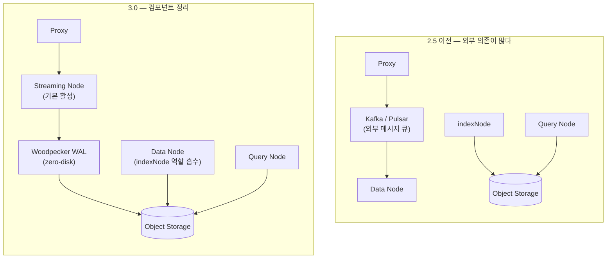

# Milvus 3.0 은 무엇을 바꾸나 — 벡터 DB 에서 "벡터 레이크하우스"로

Milvus 3.0 이 2026년 5월 9일에 **3.0-beta** 로 공개됐다.
아직 정식 출시(GA)가 아니라 베타라는 점을 먼저 못박아 둔다 — 2.6.x 가 여전히 프로덕션 버전이고, 3.0 은 미리 보는 단계다.
그래서 이 글은 "지금 올려라"가 아니라 **3.0 이 어떤 방향으로 가려 하는지, 그게 어떤 가치인지**를 정리한 스터디 노트다.

한 문장으로 줄이면 이렇다.
2.x 가 "벡터 검색 엔진"을 다듬는 흐름이었다면, 3.0 은 **운영 컴포넌트를 더 줄이고, 데이터 레이크와 한 몸이 되려는** 흐름이다.

> 이 글은 [Milvus 아키텍처와 동작](./milvus-architecture-and-performance.md)에서 정리한 2.6 구조를 전제로 한다.
> storage-compute 분리, segment(growing/sealed), WAL 개념이 아직 낯설면 그 글을 먼저 읽는 게 좋다.

## 큰 그림 — 세 갈래의 변화

3.0 의 변경점은 많지만, 묶어 보면 세 갈래다.

- **운영 단순화** — Streaming Node 가 기본이 되고, 별도 컴포넌트(indexNode)가 사라지고, 메시지 큐를 자체 WAL 로 대체한다.
- **데이터 레이크 통합** — 데이터를 복사해 넣지 않고, 원본이 있는 자리(S3 등)를 그대로 참조해 검색한다.
- **스키마·검색 표현력** — NULL 벡터, 온라인 필드 추가, 서버 측 집계·정렬처럼 "관계형 DB 에선 당연한데 벡터 DB 엔 없던" 것들을 채운다.

하나씩 본다.

## 운영 단순화 — 컴포넌트가 줄어든다

2.x 를 처음 보면 컴포넌트 수에 질린다. 코디네이터 여러 종류에 워커 노드, 거기에 Kafka/Pulsar 같은 외부 메시지 큐까지 얹혀 있었다.
3.0 은 이 구조를 정리한다.

| 항목 | 2.5 이전 | 3.0 |
| --- | --- | --- |
| Streaming Node | 없음 (또는 2.5 실험적·기본 비활성) | 기본 활성화 |
| indexNode | 별도 컴포넌트 | 제거 (역할 흡수) |
| WAL 메시지 큐 | Kafka / Pulsar 외부 의존 | Woodpecker 권장 (zero-disk) |

Streaming Node 는 실시간으로 들어오는 데이터를 WAL 에 쓰고 아직 영속화되지 않은 최신 데이터의 검색을 맡는 컴포넌트다.
2.5 에서 실험적으로 들어왔다가 3.0 에서 기본값이 됐다.
스트림 처리(Streaming Node)와 배치 처리(Query Node, Data Node)를 분리해 둔 덕에 실시간 입력과 대량 검색이 서로 간섭하지 않는다.

Woodpecker 는 Kafka/Pulsar 를 대체하는 Milvus 자체 WAL 이다.
별도 큐 서버나 전용 디스크 없이 오브젝트 스토리지에 직접 쓰는 **zero-disk** 방식이라, 운영자가 따로 관리할 인프라가 줄어든다.
2.6 에서 도입돼 3.0 에서 권장 방식이 됐다.
다만 [아키텍처 글](./milvus-architecture-and-performance.md)에서도 적었듯 상업적 사용 라이선스 이슈가 거론된 적이 있어, 환경에 따라 Kafka 를 그대로 쓰는 선택지도 남겨 둔다.

이게 왜 가치인가.
전용 벡터 DB 를 꺼리는 가장 큰 이유가 "운영할 컴포넌트가 너무 많다"였는데, 3.0 은 정확히 그 부담을 깎는다.

## 데이터 레이크 통합 — 복사하지 않고 참조한다

3.0 에서 가장 성격이 다른 변화가 **External Collection** 이다.
지금까지 벡터 DB 를 쓰려면 원본 데이터를 임베딩해서 DB 안으로 **복사해 넣어야** 했다.
External Collection 은 그 복사를 없앤다 — 데이터는 원래 있던 자리(레이크의 파일)에 두고, Milvus 는 스키마·인덱스·쿼리 실행만 관리한다.

여기에 Storage V3(S3 호환 오브젝트 스토리지 위의 manifest 기반 컬럼 저장 엔진)와 Snapshot(특정 시점의 읽기 전용 뷰)이 더해진다.
Spark 가 Milvus 컬렉션을 Snapshot 으로 직접 읽을 수도 있다.

직설적으로 말하면, Milvus 가 별도 섬으로 떨어진 검색 엔진이 아니라 **레이크하우스의 한 부품**이 되려는 방향이다.
이미 데이터 레이크(S3 + Spark 등)를 운영하는 조직이라면, 데이터를 이중으로 적재하지 않아도 되는 게 실질적인 이득이다.

## 스키마·검색 표현력 — 관계형 DB 에 가까워진다

벡터 DB 를 쓰다 보면 "이런 기본적인 것도 안 되나" 싶은 순간이 온다.
3.0 은 그 빈칸들을 메운다.

- **Nullable 벡터 필드** — 여섯 가지 벡터 타입 모두 NULL 을 허용하고, 검색은 NULL 벡터를 자동으로 건너뛴다. 기존 컬렉션에 벡터 필드를 **재빌드 없이 온라인으로 추가**할 수도 있다.
- **Entity 단위 TTL** — 스키마에 `TIMESTAMPTZ` 필드를 두고 TTL 필드로 지정하면, 만료된 항목을 Milvus 가 알아서 회수한다. 로그·세션처럼 수명이 있는 데이터에 유용하다.
- **서버 측 집계·정렬** — `count`, `sum`, `avg`, `min`, `max` 같은 SQL 식 집계와 필드별 오름/내림차순 정렬을 서버에서 처리한다. 예전엔 클라이언트로 다 끌어와 직접 계산해야 했다.
- **커스텀 사전·동의어** — FileResource 라는 장치로 토크나이저 사전, 동의어 목록, 불용어, 복합어 분해 규칙을 등록해 BM25·analyzer·Text Match 에 반영한다. 한국어처럼 사전 품질이 검색 품질을 좌우하는 언어에서 특히 중요하다.
- **EmbList + DiskANN** — 한 항목에 가변 길이의 벡터 리스트를 두고 디스크 기반으로 색인한다. 문서 하나를 여러 청크 벡터로 표현하는 RAG 패턴과 잘 맞는다.

## 우리 규모에선 어떤 게 실제로 와닿나

[기존 글](./milvus-architecture-and-performance.md)에서 정리한 결론은 "수천만 벡터·저부하 규모에선 속도가 아니라 기능이 전용 DB 를 쓰는 이유"였다.
3.0 을 이 관점으로 거르면, 화려한 것보다 다음 둘이 실질적이다.

- **운영 컴포넌트 감소** — Streaming Node 기본화와 Woodpecker zero-disk WAL 은 작은 클러스터를 운영하는 입장에서 관리 포인트를 줄여 준다.
- **커스텀 사전**(FileResource) — 한국어 하이브리드 검색의 품질을 사전으로 다듬을 수 있다는 건, 도메인 용어가 많은 서비스에 직접적인 이득이다.

반대로 External Collection·Storage V3 같은 레이크하우스 통합은 이미 대규모 데이터 레이크를 굴리는 조직에서 빛나는 기능이라, 소규모에선 당장 체감이 덜하다.

## 정리 — 지금 올릴 건 아니지만 방향은 분명하다

3.0 은 beta 라 프로덕션에 바로 올릴 단계는 아니다.
하지만 방향은 또렷하다 — **운영을 더 줄이고, 데이터 레이크와 합치고, 스키마·검색을 관계형 DB 수준으로 끌어올린다.**
"전용 벡터 DB 는 운영이 부담스럽다"와 "데이터를 또 복사해야 한다"는 두 가지 거부감을 정면으로 겨냥한 셈이다.

다음엔 Streaming Node 가 기본이 된 3.0 구조에서 데이터 입력·검색 흐름이 2.6 과 어떻게 달라지는지, External Collection 으로 S3 의 데이터를 실제로 zero-copy 검색하는 흐름을 직접 띄워 확인해 볼 생각이다.

## 참고 링크

- [Milvus Release Notes](https://milvus.io/docs/release_notes.md) — 3.0-beta(2026.05.09) 기능 목록
- [Milvus Roadmap](https://milvus.io/docs/roadmap.md) — 3.0 방향과 Vector Lake 계획
- [Use Woodpecker](https://milvus.io/docs/use-woodpecker.md) — zero-disk WAL
- [We Replaced Kafka/Pulsar with a Woodpecker for Milvus](https://milvus.io/blog/we-replaced-kafka-pulsar-with-a-woodpecker-for-milvus.md)
- [Milvus Architecture Overview](https://milvus.io/docs/architecture_overview.md)
