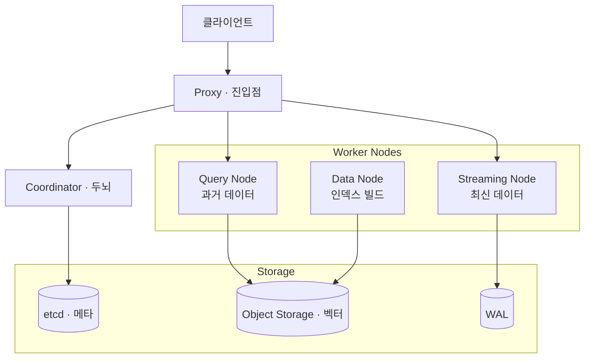
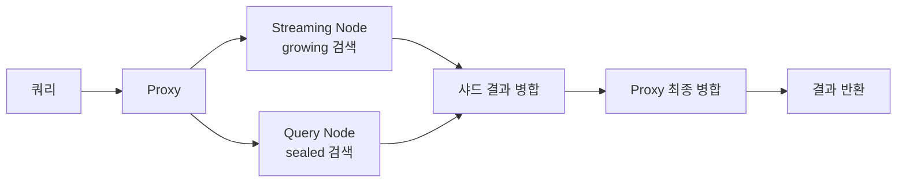
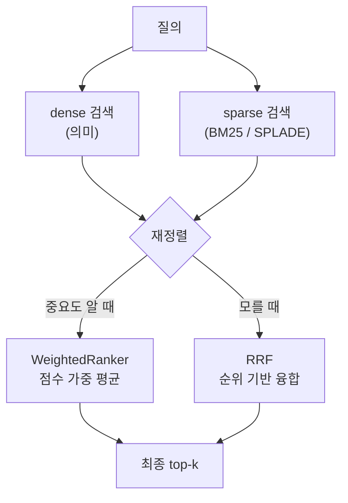

# Milvus 벡터 데이터베이스 입문 — 아키텍처와 동작, 그리고 실무 규모에서의 성능

RAG 시스템을 OpenSearch 의 k-NN 으로 운영해 오다가, 전용 벡터 데이터베이스인 Milvus 를 본격적으로 들여다볼 일이 생겼다.
막상 공부해 보니 일반적인 DB 와 구조가 꽤 달랐다. 컴포넌트가 예닐곱 개로 쪼개져 있고, "storage 와 compute 를 분리했다"는 말이 핵심이라는데 처음엔 그게 왜 중요한지 잘 와닿지 않았다.
이 글은 Milvus 가 무엇이고, 어떤 구조로 어떻게 동작하며, 우리가 다루는 정도의 규모(수천만 벡터)에서 어느 정도 리소스가 필요한지를 공부하며 정리한 기록이다.

직접 로컬에 Milvus 2.6 과 OpenSearch 를 같이 띄우고 같은 데이터로 비교해 본 결과도 군데군데 섞었다.

---

## 벡터 DB 와 Milvus 는 왜 필요한가

검색에는 크게 두 가지 방식이 있다.

- **dense 검색** — 의미로 찾기. 문장을 임베딩 모델로 1024차원 같은 실수 벡터로 압축한 뒤, 벡터 간 거리로 "뜻이 비슷한" 문서를 찾는다. "자동차"로 검색해도 "차량"이 걸린다. 모든 차원에 값이 빽빽이 차 있어서 dense, 곧 밀집이다.
- **sparse 검색** — 키워드로 찾기. BM25 같은 통계 기반으로 단어 출현을 본다. 어휘 사전 크기만큼 차원이 크지만 등장한 단어만 값이 있고 나머지는 0이라 sparse, 곧 희소다. 정확한 단어·고유명사·코드값에 강하다.

RAG 에서는 이 둘을 합친 **하이브리드 검색**이 사실상 표준이다. 의미로도 찾고 키워드로도 찾은 뒤 점수를 합친다.

벡터 DB 는 dense 벡터의 최근접 이웃(ANN) 검색을 빠르게 하기 위한 전용 저장소다.
물론 OpenSearch·PostgreSQL(pgvector) 같은 범용 엔진에도 벡터 기능이 붙어 있다. 그럼에도 Milvus 같은 전용 DB 를 보는 이유는 성능이라기보다 **기능의 폭**이다 — 학습형 sparse(SPLADE), multi-vector, GPU 인덱스, DiskANN 같은 것들이 처음부터 1급 기능으로 들어가 있다.

---

## 아키텍처 — storage 와 compute 를 분리한다

Milvus 의 가장 큰 특징은 **저장(storage)과 연산(compute)을 완전히 분리**한 구조다.
데이터는 오브젝트 스토리지(S3/MinIO)에 두고, 검색·색인을 담당하는 노드들은 상태를 거의 갖지 않는다.
그래서 "검색이 느리면 검색 노드만 늘리고, 색인이 밀리면 색인 노드만 늘리는" 식으로 컴포넌트별 독립 확장이 된다. 이게 분리 구조의 실익이다.

전체는 네 계층으로 나뉜다.

| 계층 | 역할 |
| --- | --- |
| Access Layer (Proxy) | 클라이언트 요청의 진입점. 무상태 프록시들이 요청을 검증·라우팅하고 결과를 모아 돌려준다. |
| Coordinator | 클러스터의 두뇌. 스키마(DDL) 관리, 타임스탬프 발급(TSO), 작업 스케줄링, 일관성 보장. |
| Worker Nodes | 코디네이터 지시를 따르는 실행기. Streaming / Query / Data 세 종류. |
| Storage | 영속성 담당. 메타 저장소(etcd) + 오브젝트 스토리지(S3) + WAL. |

worker 노드 세 종류의 분업이 핵심이다.

- **Streaming Node** — 실시간으로 들어오는 데이터를 받아 WAL 에 쓰고, 아직 영속화되지 않은 최신 데이터(growing segment)에 대한 검색을 담당한다. 2.5 에서 실험적으로 도입됐고(기본 비활성), 3.0 에서 기본 활성화되며 역할이 또렷해진다.
- **Query Node** — 이미 오브젝트 스토리지에 저장된 과거 데이터(sealed segment)를 메모리에 올려 검색한다.
- **Data Node** — 컴팩션·인덱스 빌드 같은 오프라인 처리를 한다.

저장층은 셋으로 나뉜다.

- **메타 저장소** — etcd. 컬렉션 스키마, 토폴로지, 소비 체크포인트 같은 핵심 메타데이터를 담는다. 강한 일관성이 필요해 etcd 를 쓴다.
- **오브젝트 스토리지** — S3/MinIO. 실제 벡터 데이터, 인덱스 파일, 로그 스냅샷.
- **WAL** — Write-Ahead Log, 데이터 내구성의 토대. 예전엔 Kafka/Pulsar 같은 메시지 큐가 필요했는데, 2.6 의 Woodpecker 는 별도 디스크 없이 오브젝트 스토리지에 직접 기록하는 zero-disk 모드를 지원한다.

> 참고로 Woodpecker 는 상업적 사용 라이선스 이슈가 거론되기도 해서, 환경에 따라 Kafka 를 메시지 큐로 쓰기도 한다.

### 잠깐 — etcd · WAL · 오브젝트 스토리지가 뭔가

처음 보면 생소한 기반 기술들이라 짧게 짚고 간다.

- **etcd** — 분산 환경에서 쓰는 key-value 저장소다. 여러 노드가 동시에 읽어도 항상 같은 값을 보장한다(강한 일관성, Raft 합의). 쿠버네티스도 클러스터 상태를 etcd 에 저장한다. Milvus 는 "어떤 컬렉션이 있고 어디에 배치됐는지" 같은, 작지만 절대 틀리면 안 되는 메타데이터를 여기 둔다.
- **WAL** — Write-Ahead Log. 변경을 실제 데이터에 적용하기 전에 로그로 먼저 적어두는 기법이다. 갑자기 죽어도 로그를 다시 재생하면 복구되니, 데이터 유실을 막는 안전장치다. 거의 모든 DB 의 내구성이 이 위에 선다. Milvus 는 들어온 데이터를 WAL 에 먼저 커밋한 뒤 천천히 정리한다.
- **오브젝트 스토리지** — S3, MinIO 같은 대용량 파일 저장소다. 파일을 통째로 넣고 꺼낸다. AWS S3 가 대표격이고, MinIO 는 사내에 직접 띄울 수 있는 S3 호환 구현이다. 싸고 거의 무한히 확장돼서, Milvus 는 벡터·인덱스 같은 큰 데이터를 여기에 영구 저장한다.
- **메시지 큐** — Kafka, Pulsar, Woodpecker. 데이터를 순서대로 흘려보내는 통로다. 쓰기 요청이 한꺼번에 몰려도 큐에 쌓아두고 차례로 처리해 안정성을 높인다. Woodpecker 는 Milvus 가 자체 도입한 경량 방식으로, 별도 큐 서버 없이 오브젝트 스토리지에 바로 쓴다.

정리하면, etcd 가 메타데이터를, 오브젝트 스토리지가 실제 데이터를, WAL 과 메시지 큐가 안전한 전달을 맡아 Milvus 저장층을 떠받친다.

### 배포 모드 — Lite / Standalone / Distributed

이 복잡한 구조가 부담스럽다면 다행히 규모별 배포 모드가 있다.

- **Milvus Lite** — 파이썬 라이브러리로 임포트해서 쓰는 임베디드 모드. 노트북·프로토타이핑·엣지용.
- **Standalone** — 단일 Docker(또는 컴포넌트 묶음)로 띄우는 모드. 수천만 벡터 정도까지 충분하다.
- **Distributed** — 위 컴포넌트들을 Kubernetes 에 펼쳐 수십억 벡터까지 확장하는 모드.

같은 API 로 노트북 실험부터 분산 운영까지 이어진다는 게 장점이다.

---

## 동작 방식 — 데이터가 들어와서 검색되기까지

### 데이터 인입

1. Proxy 가 쓰기 요청을 샤드별로 쪼갠다. 각 가상 채널(vchannel)이 물리 채널(pchannel)에 매핑돼 Streaming Node 로 간다.
2. Streaming Node 가 각 데이터에 타임스탬프(TSO)를 붙여 전체 순서를 정하고, **WAL 에 먼저 안전하게 커밋**한다.
3. WAL 엔트리는 비동기로 잘려 **segment** 가 된다.

여기서 segment 두 종류를 이해하면 동작이 한눈에 들어온다.

| 구분 | Growing segment | Sealed segment |
| --- | --- | --- |
| 상태 | 아직 오브젝트 스토리지에 영속화 안 됨 | 전부 영속화됨, 불변(immutable) |
| 위치 | Streaming Node 메모리 | 오브젝트 스토리지 |
| 검색 담당 | Streaming Node | Query Node |

Streaming Node 가 해당 segment 의 WAL 을 다 기록하면 **flush** 가 일어나 growing 이 sealed 로 바뀌고, 읽기에 최적화된 상태가 된다.

### 인덱스 빌드

Data Node 가 오브젝트 스토리지에서 로그 스냅샷을 읽어 메모리에 올리고, 인덱스를 만들어 다시 직렬화해 저장한다. 이때 SIMD(AVX2/AVX512) 가속을 쓴다.

### 검색 흐름

검색은 "최신 데이터와 과거 데이터를 동시에 뒤져서 합치는" 구조다.

1. Proxy 가 요청을 관련 샤드의 Streaming Node 들에 뿌린다.
2. Streaming Node 는 자기 growing 데이터를, Query Node 는 sealed segment 를 **동시에** 검색한다.
3. 각 샤드 결과를 모아 한 샤드 결과로 합치고, Proxy 가 전체 샤드 결과를 다시 병합해 돌려준다.

데이터가 sealed 로 바뀌면 Coordinator 가 그 부담을 Query Node 들에 고르게 재분배(handoff)해 메모리·CPU 를 최적화한다.

---

## 인덱스 종류와 선택 기준

Milvus 가 범용 엔진과 벌어지는 지점이 인덱스의 폭이다.

| 인덱스 | 성격 | 언제 |
| --- | --- | --- |
| FLAT | 무손실 전수 검색 | 정확도 100%, 소규모 |
| IVF 계열 | 클러스터로 나눠 후보만 탐색 | 속도·정확도 균형 |
| HNSW | 그래프 기반, 고QPS·고recall | 인메모리 기본 선택지 |
| DiskANN | 그래프를 디스크에 두고 일부만 메모리 | RAM 초과하는 대용량 |
| GPU 계열(CAGRA 등) | GPU 가속 빌드·검색 | 초대규모·고처리량 |

핵심 트레이드오프는 **메모리 대 디스크**, 그리고 **recall 대 QPS** 다.
HNSW 는 빠르고 정확하지만 벡터를 메모리에 올려야 한다. 데이터가 RAM 을 넘어서면 DiskANN 으로 디스크에 두되 PQ 코드만 메모리에 남기는 식으로 비용을 낮춘다. 다만 DiskANN 도 PQ 코드는 데이터 크기에 대략 비례해서 메모리가 "사라지는" 건 아니고 "줄어드는" 것이다.

### DiskANN — 디스크에 두고 일부만 메모리

DiskANN 은 Vamana 라는 그래프 인덱스를 디스크에 두고, 압축한 PQ 코드만 메모리에 올리는 하이브리드 방식이다.
검색할 때는 메모리의 PQ 코드로 후보를 빠르게 좁힌 뒤, 디스크에서 정확한 벡터를 읽어 재계산한다.

언제 고르나 — **벡터 데이터가 RAM 을 넘어서는데 recall 은 높게 유지하고 싶을 때**다.
디스크를 거치므로 지연이 100ms 수준까지 늘 수 있는데, 이 정도를 감수할 수 있는 검색이면 메모리 비용을 크게 아낄 수 있다.
반대로 데이터가 메모리에 다 들어가고 낮은 지연이 중요하면 굳이 DiskANN 으로 갈 이유가 없다 — 그땐 HNSW 가 낫다.

### GPU 인덱스(CAGRA) — 대량 배치에서 압도적

CAGRA 는 GPU 에 최적화된 그래프 인덱스다.
메모리를 원본 벡터의 약 1.8배까지 쓰는 대신, 검색·빌드 처리량이 크다.
특히 **대량 배치 검색에서 CPU 인덱스보다 처리량이 최대 100배까지** 벌어질 수 있다.

다만 GPU 가 항상 답은 아니다.

- 검색 배치가 작으면 GPU 가 충분히 활용되지 못해 이점이 줄어든다.
- 추론용(inference-grade) GPU 로도 충분해서, 비싼 학습용 GPU 까지 갈 필요는 없는 경우가 많다.
- 결국 **고처리량·초대규모**가 아니면 CPU 인덱스(HNSW)로 충분하다.

정리하면 인덱스 선택은 "데이터가 메모리에 들어가나, recall 과 지연 중 무엇을 양보하나, 배치가 큰가"로 갈린다.
대부분의 중소 규모는 HNSW 가 기본값이고, DiskANN·GPU 는 각각 메모리 한계와 초대규모 처리량이라는 분명한 이유가 있을 때 꺼낸다.

---

## 한국어 하이브리드 검색

한국어는 띄어쓰기만으로 단어가 갈리지 않아서 형태소 분석이 필요하다. OpenSearch 에서는 보통 nori 를 쓴다.
Milvus 도 2.5 에서 BM25 기반 full-text search 가 들어왔고, 2.6 에서 다국어가 강화되면서 **lindera 토크나이저 + ko-dic** 으로 한국어 형태소 분석을 지원한다. ko-dic 은 MeCab 기반 한국어 사전이다.

설정은 nori 와 거의 1:1 로 대응한다.

| OpenSearch | Milvus |
| --- | --- |
| nori_tokenizer | lindera + dict_kind ko-dic |
| nori_part_of_speech 필터 | korean_stop_tags 필터 |

직접 로컬에서 같은 한국어 문장을 양쪽에 넣어 토큰을 비교해 봤다.

- nori: `서울 / 맛있 / 음식 / 먹`
- lindera(ko-dic, 품사 필터 적용): `서울 / 맛있 / 음식 / 먹`

조사·어미를 걸러내면 의미 토큰이 사실상 같았다. 오히려 복합명사는 lindera 쪽이 더 자연스러웠다 — nori 가 "데이터베이스"를 "데이터/베이스"로 쪼개는 반면 lindera 는 통째로 유지했다.

dense 는 같은 임베딩 모델(bge-m3, 1024차원)을 양쪽에 넣었더니, OpenSearch 와 Milvus 의 top-10 결과가 약 95% 겹쳤다. 같은 임베딩이면 의미 검색 결과는 사실상 동등하다는 뜻이다.

---

## sparse 검색 — BM25 와 학습형 SPLADE

벡터 검색이라고 하면 보통 dense(밀집 벡터)를 떠올리지만, 키워드 기반의 sparse(희소 벡터)도 한 축이다.
sparse 는 단어별 가중치를 담은 고차원·대부분 0인 벡터라, inverted index 나 WAND 같은 키워드 검색 자료구조로 빠르게 처리된다.

sparse 에는 성격이 다른 두 갈래가 있다.

- **BM25** — 통계 기반이다. 단어 빈도에 문서 길이 정규화와 빈도 포화를 더해 점수를 매긴다. 학습이 필요 없고 결과를 해석하기 쉽지만, 질의어와 문서가 **같은 단어**를 써야 매칭된다(어휘 불일치에 약하다).
- **학습형 sparse**(SPLADE) — 신경망이 단어 가중치를 학습한다. 핵심은 **term expansion** 이다. 입력 단어에 의미적으로 관련된 단어까지 가중치를 부여해, "노트북"으로 검색해도 "랩탑"이 들어간 문서를 잡아낸다. sparse 의 효율·해석가능성은 유지하면서 BM25 의 어휘 불일치 약점을 메운다.

Milvus 에서 BM25 는 `BM25BuiltInFunction` 으로 서버가 직접 처리한다.
클라이언트가 코퍼스를 넘기거나 사전 학습을 시킬 필요 없이, 토큰화·sparse 인코딩·통계 갱신을 Milvus 서버 쪽에서 자동으로 한다.
SPLADE 같은 학습형 sparse 는 별도 모델로 임베딩을 만들어 sparse 필드에 넣는 방식으로 함께 쓸 수 있다.

정리하면, 정확한 용어 매칭이 중요하면 BM25, 표현이 다양해 어휘 불일치가 잦으면 학습형 sparse 가 유리하다.
실무에선 둘 중 하나가 아니라 dense 와 함께 묶어 쓰는 게 보통이다 — 그게 다음의 multi-vector 다.

## multi-vector 와 하이브리드 재정렬

한 문서를 벡터 하나로만 표현해야 할 이유는 없다.
제목 dense, 본문 dense, 키워드 sparse 처럼 **한 항목에 여러 벡터 필드**를 두고 각각 검색한 뒤 결과를 합치는 게 multi-vector 하이브리드 검색이다.

문제는 "여러 검색 결과를 어떻게 하나로 합치나"다. Milvus 는 두 가지 재정렬(rerank) 방식을 제공한다.

| 방식 | 합치는 기준 | 언제 |
| --- | --- | --- |
| WeightedRanker | 경로별 점수의 가중 평균 (가중치 0~1) | 각 벡터 필드의 상대적 중요도를 내가 알 때 |
| RRF | 점수가 아니라 **순위**로 융합 | 어느 쪽이 더 중요한지 분명하지 않을 때 |

WeightedRanker 는 "제목이 본문보다 2배 중요하다"처럼 중요도를 알 때 점수에 가중치를 줘 평균낸다.
다만 dense 점수(코사인 유사도)와 sparse 점수(BM25)는 스케일이 달라서, 가중치를 직접 맞추기가 까다롭다.

RRF(Reciprocal Rank Fusion)는 이 스케일 문제를 피한다.
각 검색 결과에서 **몇 등인지**(순위)만 보고 그 역수를 더해 합치므로, 점수 단위가 달라도 공정하게 섞인다.
평활 파라미터 `k` 는 기본값 60, 권장 범위는 10~100 이다 — `k` 가 작을수록 상위 순위의 영향이 커진다.

어느 쪽이 더 중요한지 사전 지식이 없으면 RRF 가 안전한 기본값이고, 필드별 중요도가 명확하면 WeightedRanker 로 가중치를 주는 게 낫다.

---

## 우리 정도 규모에서의 성능과 리소스

공부하면서 가장 궁금했던 건 "그래서 우리 규모에 이게 과한가?"였다.

기준을 잡아보면 수천만 벡터 규모(약 1,600만 청크, 1024차원)에 검색 트래픽은 초당 1건도 안 되는 저부하다.
raw 벡터 데이터만 보면 1,600만 × 1024차원 × 4바이트(float32) ≈ **약 68GB** 다. HNSW 그래프 오버헤드를 더해도 단일~소수 노드가 감당하는 규모다.

여기서 배운 게 두 가지다.

- **이 정도 규모는 분산까지 갈 필요가 없다.** Standalone 또는 작은 클러스터로 충분하다. "수십억 벡터 확장"은 Milvus 의 강점이지만, 그 강점이 필요해서 전용 DB 를 쓰는 건 아니다.
- **저부하에서 검색 지연은 검색 엔진이 아니라 주변 파이프라인이 좌우한다.** 실제로 RAG 검색 한 번에 수 초가 걸려도, 그 시간의 대부분은 쿼리 임베딩 생성과 재정렬(rerank)이지 벡터 검색 자체가 아니다. 그래서 "벡터 DB 를 바꾸면 빨라진다"는 기대는 대체로 빗나간다.

정리하면 이 규모에서 Milvus 를 고려하는 이유는 속도가 아니라 **기능**이다 — 하이브리드, sparse, 멀티테넌시, 멀티링궐 같은 것들. 성능은 OpenSearch 든 Milvus 든 이 규모에선 충분하다.

---

## 공부하고 나서

처음엔 컴포넌트가 너무 많아서 과하다고 느꼈는데, "storage-compute 분리 + segment(growing/sealed) + WAL" 세 개념을 잡으니 나머지가 그 위에 얹히는 구조로 읽혔다.
정작 실무 판단에서 중요한 건, 우리 규모에선 분산이나 GPU 같은 화려한 기능보다 한국어 하이브리드가 제대로 되는지, 멀티테넌시를 어떻게 설계하는지가 더 실질적이라는 점이었다.

다음엔 멀티테넌시를 collection/partition 으로 어떻게 나누는지, 그리고 위에서 정리한 sparse·dense 하이브리드를 실제 우리 한국어 데이터에 적용해 BM25 와 SPLADE 의 검색 품질 차이를 직접 측정해 볼 생각이다.

---

## 용어 한눈에

본문에 나온 생소한 용어를 모았다.

아키텍처·동작

- **TSO** — Timestamp Oracle. 모든 작업에 전역 순서를 매기는 중앙 시계다. 분산 환경에서 "누가 먼저 일어난 일인지"를 정한다.
- **vchannel / pchannel** — 가상 채널과 물리 채널. 데이터를 샤드 단위로 흘려보내는 논리·물리 통로다.
- **샤드** — shard. 데이터를 나눠 담는 조각이다. 나눠야 여러 노드가 병렬로 처리할 수 있다.
- **flush** — 메모리에 쌓인 growing segment 를 오브젝트 스토리지로 내려 sealed 로 굳히는 동작이다.
- **컴팩션** — compaction. 잘게 쌓인 작은 segment 들을 합쳐 검색 효율을 높이는 정리 작업이다.
- **handoff** — sealed 된 데이터를 Query Node 들에 고르게 재분배하는 것이다.
- **DDL** — Data Definition Language. 컬렉션 생성·삭제 같은 스키마 정의 명령이다.
- **Raft 합의** — 여러 노드가 같은 값에 합의하도록 만드는 분산 합의 알고리즘이다. 리더 노드를 하나 뽑아 모든 변경을 리더가 받고, 과반수 노드에 복제되면 확정한다. 그래서 일부 노드가 죽어도 데이터가 갈라지지 않고 일관성이 유지된다. etcd 가 이 방식으로 메타데이터의 강한 일관성을 보장한다.

인덱스·성능

- **SIMD** — AVX2/AVX512 같은 CPU 병렬 연산 명령이다. 여러 숫자를 한 번에 계산해 벡터 연산을 가속한다.
- **PQ** — Product Quantization. 벡터를 잘게 쪼개 코드로 압축하는 양자화 기법이다. 메모리를 크게 아낀다.
- **IVF** — 벡터를 여러 클러스터로 나눈 뒤 쿼리와 가까운 클러스터만 탐색하는 인덱스다.
- **DiskANN** — 그래프 인덱스를 디스크에 두고 일부만 메모리에 올려 대용량을 처리하는 방식이다.
- **CAGRA** — GPU 에 최적화된 그래프 인덱스다.
- **QPS** — Queries Per Second. 초당 처리하는 쿼리 수로, 부하를 나타내는 지표다.
- **recall** — 전수 비교로 찾은 진짜 정답 중 근사 검색이 회수한 비율이다. 검색 정확도 척도.

RAG 검색

- **BM25** — 단어 빈도 기반의 전통적인 키워드 검색 점수 방식이다. sparse 검색의 대표격.
- **SPLADE** — 신경망으로 만든 학습형 sparse 다. 단순 빈도를 넘어 의미까지 반영한 키워드 검색.
- **multi-vector** — 한 문서에 여러 벡터(제목·본문 등)를 두고 함께 검색·재정렬하는 기능이다.
- **RRF** — Reciprocal Rank Fusion. 여러 검색 결과의 순위를 합쳐 하나로 융합하는 방식이다.
- **dense / sparse** — dense 는 의미를 담은 밀집 벡터, sparse 는 단어 출현 기반의 희소 벡터다.

---

## 참고 링크

- [Milvus Architecture Overview](https://milvus.io/docs/architecture_overview.md)
- [Milvus Data Processing](https://milvus.io/docs/data_processing.md)
- [Milvus Main Components](https://milvus.io/docs/main_components.md)
- [Full-Text Search (BM25)](https://milvus.io/docs/full-text-search.md)
- [Lindera Tokenizer](https://milvus.io/docs/lindera-tokenizer.md)
- [Index Explained](https://milvus.io/docs/index-explained.md)
