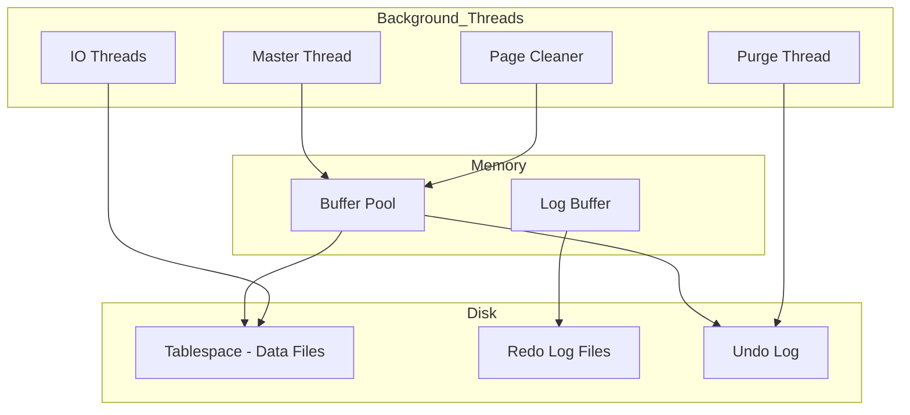
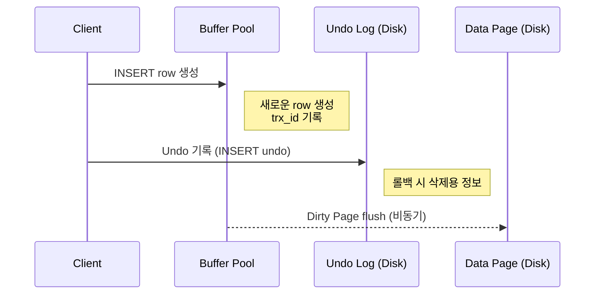
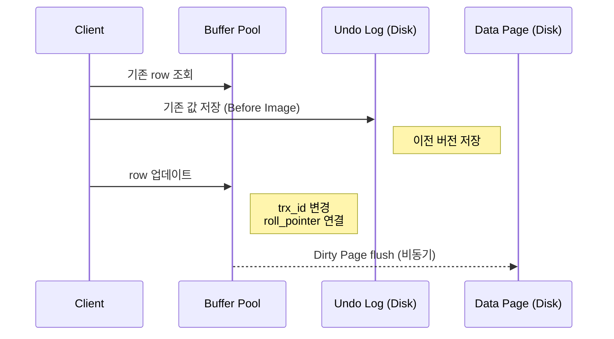

# InnoDB 스토리지 엔진 아키텍처 (공부 중..)

InnoDB의 개략적인 구조는 다음과 같다.

각 부분에 관한 자세한 설명은 InnoDB 스토리지 엔진의 주요 특징들과 함께 하나씩 살펴보자.

---

## 1. 프라이머리 키에 의한 클러스터링

InnoDB의 모든 테이블은 기본적으로 프라이머리 키를 기준으로 클러스터링되어 저장된다.

> 클러스터링된다는 단어의 의미?  
> 테이블의 실제 데이터(Row)가 프라이머리 키의 순서에 따라 물리적으로 정렬되어 PK 인덱스의 리프 노드(Leaf Node)에 함께 묶여(Clustered) 저장된다는 뜻이다.  
> 즉, 인덱스 자체가 곧 데이터 테이블이다.

모든 세컨더리 인덱스는 레코드의 주소 대신 프라이머리 키의 값을 논리적인 주소로 사용한다.

> 일반적인 보조 인덱스(Secondary Index)는 책의 맨 뒤 '찾아보기(색인)'와 같다.  
> 인덱스와 실제 데이터가 분리되어 있으며, 인덱스는 데이터가 있는 곳의 '주소값'만을 가르킨다.

프라이머리 키가 클러스터링 인덱스이기 때문에 프라이머리 키를 이용한 레인지 스캔은 상당히 빨리 처리될 수 있다.
결과적으로 쿼리의 실행 계획에서 프라이머리 키는 기본적으로 다른 보조 인덱스에 비해 비중이 높게 설정된다.

> 보조 인덱스로 검색할 경우 탐색 과정이 두 번 발생한다.  
> 1차로 보조 인덱스에서 PK 값을 찾고, 2차로 그 PK 값을 이용해 클러스터링 인덱스(PK 인덱스)를 다시 탐색해야만 실제 데이터를 가져올 수 있다.

클러스터 키에 대한 내용은 뒤에서 더 상세히 다루도록 하겠다.

---

## 2. 외래 키 지원

외래 키에 대한 지원은 InnoDB 스토리지 엔진 레벨에서 지원하는 기능이다.
MyISAM이나 MEMORY 테이블에서는 사용할 수 없다.

InnoDB에서 외래 키는 부모 테이블과 자식 테이블 모두 해당 컬럼에 인덱스 생성이 필요하다.
변경 시에는 반드시 부모 테이블이나 자식 테이블에 데이터가 있는지 체크하는 작업이 필요하므로 잠금이 여러 테이블로 전파된다.
그로 인해 데드락이 발생할 때가 많으므로 개발할 때도 외래 키의 존재에 주의하는 것이 좋다.

---

## 3. MVCC (Multi Version Concurrency Control)

일반적으로 레코드 레벨의 트랜잭션을 지원하는 DBMS가 제공하는 기능이다.
MVCC의 가장 큰 목적은 잠금을 사용하지 않는 일관된 **읽기**를 제공하는 데 있다.
InnoDB는 언두 로그를 이용해 이 기능을 구현한다.

> 멀티 버전이란?  
> 하나의 레코드에 대해 여러 개의 버전이 동시에 관리되는 것

이해를 위해 격리 수준이 `READ_COMMITTED`인 MySQL 서버에서 InnoDB 스토리지 엔진을 사용하는 테이블의 데이터 변경을 어떻게 처리하는지 그림으로 살펴보자.

### INSERT 흐름 (Undo + Buffer Pool)

- **롤백 시 데이터를 삭제해야 하기 때문에** INSERT도 Undo Log를 남긴다

### UPDATE 흐름

- 핵심 포인트
  - Undo Log에 **이전 값** 저장
  - 데이터는 덮어씀
  - 대신 연결 정보를 남김 `roll_pointer` -> Undo Log를 가르킴
  - 오래된 트랜잭션은 **Undo Log를 따라가서 읽는다**

UPDATE 문이 실행되면 커밋 실행 여부와 관계없이 InnoDB의 버퍼 풀은 새로운 값으로 업데이트 된다.
그리고 디스크의 데이터 파일에는 체크포인트나 InnoDB의 Write 스레드에 의해 새로운 값으로 업데이트 될 수 있다.
(InnoDB가 ACID를 보장하기 때문에 일반적으로 InnoDB의 버퍼 풀과 데이터 파일은 동일한 상태라고 가정해도 괜찮다.)

아직 COMMIT이나 ROLLBACK 되지 않은 상태에서 다른 사용자가 조회하면 어떻게 될까?
이 질문의 답은 격리 수준에 따라 다르다.

- 격리 수준이 `READ_UNCOMMITTED`인 경우
  - InnoDB 버퍼 풀이 현재 가지고 있는 변경된 데이터를 읽어서 반환한다.
- 격리 수준이 `READ_COMMITTED`, `REPEATABLE)_READ`, `SERIALIZABLE` 인 경우
  - 변경되기 이전의 내용을 보관하고 있는 언두 영역의 데이터를 반환한다.

위 과정을 DBMS에서는 MVCC라고 표현한다.
즉, 하나의 레코드에 대해 2개의 버전이 유지되고, 필요에 따라 어느 데이터가 보여지는지 여러 가지 상황에 따라 달라지는 구조다.

이제 UPDATE 완료 후 COMMIT을 실행하면 InnoDB는 더 이상의 변경 작업 없이 지금의 상태를 영구적인 데이터로 저장한다.
하지만 ROLLBACK을 실행하면 InnoDB는 언두 영역에 있는 백업된 데이터를 InnoDB 버퍼 풀로 다시 복구하고, 언두 영역의 내용을 삭제한다.

커밋이 된다고 언두 영역의 백업 데이터가 항상 바로 삭제되는 것은 아니다. 언두 영역의 데이터를 필요로 하는 트랜잭션이 더는 없을 때 삭제된다.

---

## 4. 잠금 없는 일관된 읽기 (Non Locking Consistent Read)

InnoDB 스토리지 엔진은 MVCC를 이용해 잠금을 걸지 않고 읽기 작업을 수행한다.
격리 수준이 `SERIALIZABLE`이 아닌 경우, SELECT 작업은 다른 트랜잭션의 변경 작업과 관계없이 항상 잠금을 대기하지 않고 바로 실행된다.
특정 사용자가 레코드를 변경하고 아직 커밋하지 않았더라도 이 변경 트랜잭션이 다른 사용자의 SELECT를 방해하지 않는다.
이를 잠금 없는 일관된 읽기라고 말한다.

> 참고
>
> 대부분의 현대 RDB는 MVCC를 사용한다. 다만 구현 방식은 DB마다 꽤 다르다.  
> MySQL : Undo Log 기반, `roll_pointer`로 이전 버전 추적  
> PostgreSQL: Heap Tuple 자체에 버전 저장. MySQL과 완전 다름  
> Oracle : Undo Segment 사용, MySQL과 유사한 구조  
> SQL Server : TempDB 기반 version store  

오랜 시간 동안 활성 상태인 트랜잭션으로 인해 MySQL 서버가 느려지거나 문제가 발생할 때가 가끔 있다.
이러한 일관된 읽기를 위해 언두 로그를 삭제하지 못하고 계속 유지해야 하기 때문에 가끔 발생한다.
따라서 트랜잭션은 가능한 짧게 설정하고, 빠르게 롤백이나 커밋을 통해 트랜잭션을 완료하는 것이 좋다.

---

## 5. 자동 데드락 감지

InnoDB 스토리지 엔진은 내부적으로 잠금이 교착 상태에 빠지지 않았는지 체크하기 위해 잠금 대기 목록을 그래프 (Wait-for List) 형태로 관리한다.
InnoDB 스토리지 엔진은 데드락 감지 스레드를 가지고 있어서 주기적으로 잠금 대기 그래프를 검사해 교착 상태에 빠진 트랜잭션들을 찾아서 그 중 하나를 강제종료한다.

이 때 어느 트랜잭션을 먼저 강제 종료할 것인지를 판단하는 기준은 트랜잭션의 언두 로그 양이다.
트랜잭션이 언두 레코드를 적게 가졌다는 이야기는 롤백을 해도 언두 처리를 해야 할 내용이 적다는 것이다.
따라서 트랜잭션 강제 롤백으로 인한 MySQL 서버의 부하도 덜 유발하기 때문이다.

참고로 InnoDB 스토리지 엔진은 상위 레이어인 MySQL 엔진에서 관리되는 테이블 잠금 명령으로 잠긴 테이블은 기본적으로 볼 수 없다.
`innodb_table_locks` 시스템 변수를 활성화하면 테이블 레벨의 잠금까지 감지할 수 있게 되므로, 특별한이유가 없다면 활성화 하는 것이 좋다.

동시 처리 스레드가 매우 많아지거나 각 트랜잭션이 가진 잠금의 개수가 많아지면 데드락 감지 스레드가 느려진다.
이런 문제점을 해결하기 위해서 MySQL 서버는 `innodb_deadlock_detect` 시스템 변수를 제공하여 `OFF`로 변경할 경우 데드락 감지 스레드를 사용하지 않을 수 있다.

데드락 감지 스레드가 작동하지 않으면 데드락 상황이 발생했을 때 무한정 대기할 수 있다.
`innodb_lock_wait_timeout` 시스템 변수를 활성화하면 이런 데드락 상황에서 일정 시간이 지나면 자동으로 요청이 실패하고 에러메시지를 반환하게 할 수 있다.
초 단위로 설정할 수 있으며, 잠금을 설정한 시간동안 획득하지 못하면 쿼리는 실패하고 에러를 반환한다.

---

## 6. 자동화된 장애 복구

InnoDB는 손실이나 장애로부터 데이터를 보호하기 위한 여러 가지 메커니즘이 탑재돼 있다.
MySQL 서버가 시작될 때 완료되지 못한 트랜잭션이나 디스크에 일부만 기록된 (Partial write) 데이터 페이지 등에 복구 작업이 자동으로 진행된다.

하지만 MySQL 서버와 무관하게 디스크나 서버 하드웨어 이슈로 InnoDB 스토리지 엔진이 자동으로 복구를 못 하는 경우도 발생할 수 있다.
이 단계에서 자동으로 복구될 수 없는 손상이 있다면 자동 복구를 멈추고 MySQL 서버는 종료돼 버린다.

이때는 MySQL 서버의 설정 파일에 `innodb_force_recovery` 시스템 변수를 설정해서 MySQL 서버를 시작해야 한다.
이 설정값은 MySQL 서버가 시작될 때 InnoDB 스토리지 엔진이 데이터 파일이나 로그 파일의 손상 여부 검사 과정을 선벽적으로 진행할 수 있게 한다.

- InnoDB의 로그 파일이 손상됐다면 6으로 설정하자.
- InnoDB 테이블의 데이터 파일이 손상됐다면 1로 설정하자.
- 어떤 부분이 문제인지 알 수 없다면 1~6까지 변경하면서 MySQL을 재시작 해 본다.
  - 1로 해보고 안된다면, 2로 해보고, ..., 값이 커질수록 그만큼 심각한 상황이어서 데이터 손실 가능성이 커지고 복구 가능성은 적어진다.
