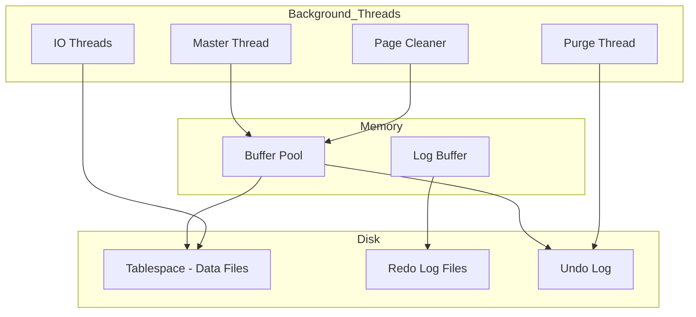
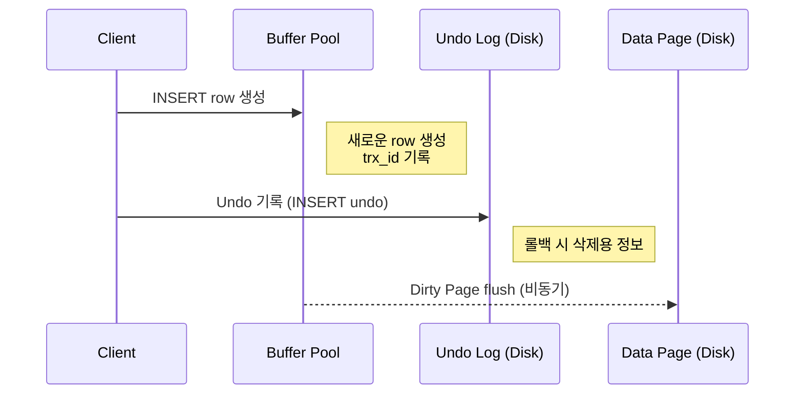
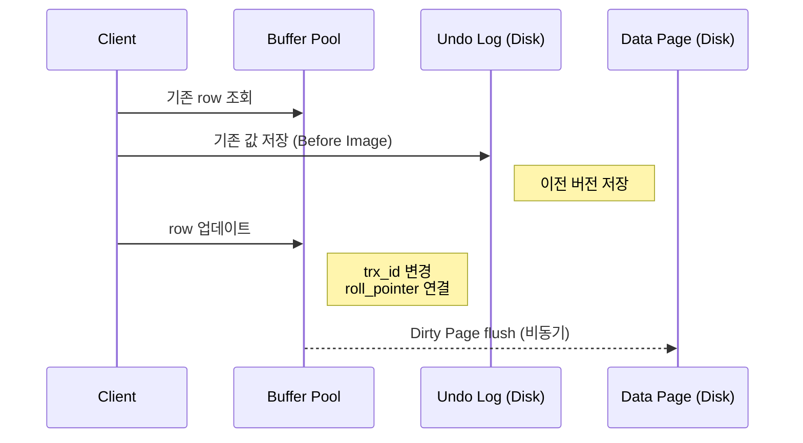
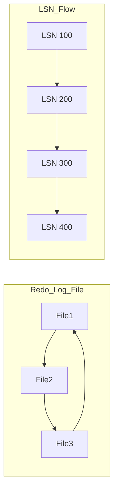
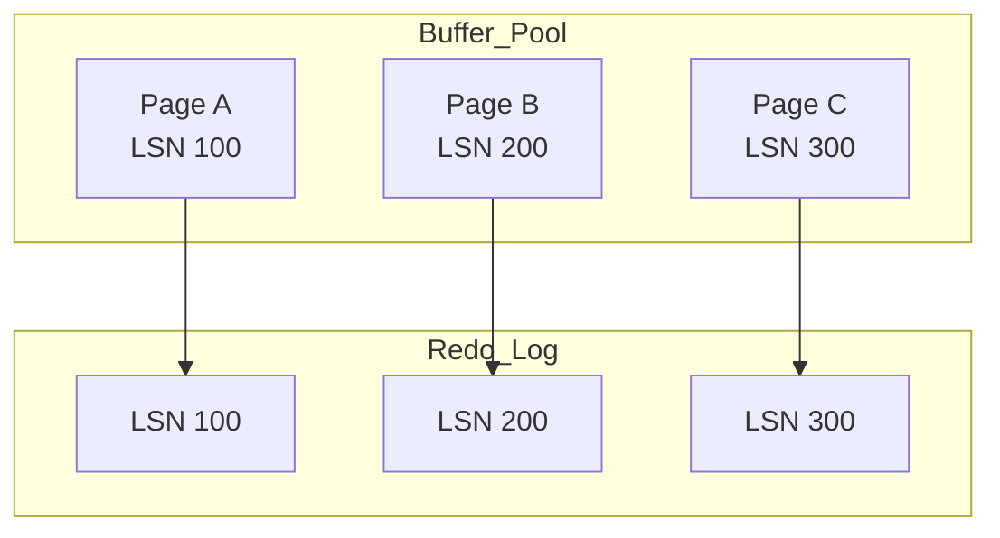
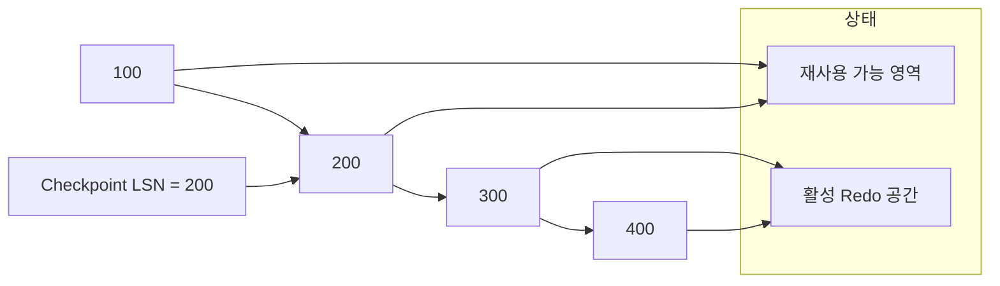
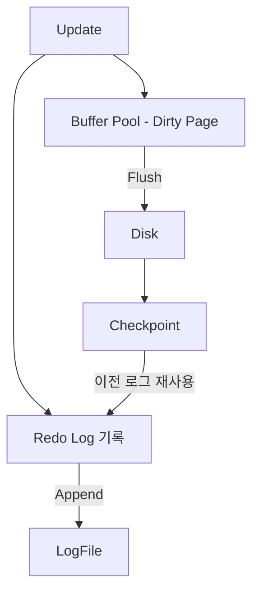

# InnoDB 스토리지 엔진 아키텍처 (공부 중..)

InnoDB의 개략적인 구조는 다음과 같다.



각 부분에 관한 자세한 설명은 InnoDB 스토리지 엔진의 주요 특징들과 함께 하나씩 살펴보자.

---

## 1. 프라이머리 키에 의한 클러스터링

InnoDB의 모든 테이블은 기본적으로 프라이머리 키를 기준으로 클러스터링되어 저장된다.

> 클러스터링된다는 단어의 의미? </br>
> 테이블의 실제 데이터(Row)가 프라이머리 키의 순서에 따라 물리적으로 정렬되어 PK 인덱스의 리프 노드(Leaf Node)에 함께 묶여(Clustered) 저장된다는 뜻이다. </br>
> 즉, 인덱스 자체가 곧 데이터 테이블이다.

모든 세컨더리 인덱스는 레코드의 주소 대신 프라이머리 키의 값을 논리적인 주소로 사용한다.

> 일반적인 보조 인덱스(Secondary Index)는 책의 맨 뒤 '찾아보기(색인)'와 같다. </br>
> 인덱스와 실제 데이터가 분리되어 있으며, 인덱스는 데이터가 있는 곳의 '주소값'만을 가르킨다.

프라이머리 키가 클러스터링 인덱스이기 때문에 프라이머리 키를 이용한 레인지 스캔은 상당히 빨리 처리될 수 있다.
결과적으로 쿼리의 실행 계획에서 프라이머리 키는 기본적으로 다른 보조 인덱스에 비해 비중이 높게 설정된다.

> 보조 인덱스로 검색할 경우 탐색 과정이 두 번 발생한다. </br>
> 1차로 보조 인덱스에서 PK 값을 찾고, 2차로 그 PK 값을 이용해 클러스터링 인덱스(PK 인덱스)를 다시 탐색해야만 실제 데이터를 가져올 수 있다.

클러스터 키에 대한 내용은 뒤에서 더 상세히 다루도록 하겠다.

---

## 2. 외래 키 지원

외래 키에 대한 지원은 InnoDB 스토리지 엔진 레벨에서 지원하는 기능이다.
MyISAM이나 MEMORY 테이블에서는 사용할 수 없다.

InnoDB에서 외래 키는 부모 테이블과 자식 테이블 모두 해당 컬럼에 인덱스 생성이 필요하다.
변경 시에는 반드시 부모 테이블이나 자식 테이블에 데이터가 있는지 체크하는 작업이 필요하므로 잠금이 여러 테이블로 전파된다.
그로 인해 데드락이 발생할 때가 많으므로 개발할 때도 외래 키의 존재에 주의하는 것이 좋다.

---

## 3. MVCC (Multi Version Concurrency Control)

일반적으로 레코드 레벨의 트랜잭션을 지원하는 DBMS가 제공하는 기능이다.
MVCC의 가장 큰 목적은 잠금을 사용하지 않는 일관된 **읽기**를 제공하는 데 있다.
InnoDB는 언두 로그를 이용해 이 기능을 구현한다.

> 멀티 버전이란? </br>
> 하나의 레코드에 대해 여러 개의 버전이 동시에 관리되는 것

이해를 위해 격리 수준이 `READ_COMMITTED`인 MySQL 서버에서 InnoDB 스토리지 엔진을 사용하는 테이블의 데이터 변경을 어떻게 처리하는지 그림으로 살펴보자.

### INSERT 흐름 (Undo + Buffer Pool)



- **롤백 시 데이터를 삭제해야 하기 때문에** INSERT도 Undo Log를 남긴다

### UPDATE 흐름



- 핵심 포인트
  - Undo Log에 **이전 값** 저장
  - 데이터는 덮어씀
  - 대신 연결 정보를 남김 `roll_pointer` -> Undo Log를 가르킴
  - 오래된 트랜잭션은 **Undo Log를 따라가서 읽는다**

UPDATE 문이 실행되면 커밋 실행 여부와 관계없이 InnoDB의 버퍼 풀은 새로운 값으로 업데이트 된다.
그리고 디스크의 데이터 파일에는 체크포인트나 InnoDB의 Write 스레드에 의해 새로운 값으로 업데이트 될 수 있다.
(InnoDB가 ACID를 보장하기 때문에 일반적으로 InnoDB의 버퍼 풀과 데이터 파일은 동일한 상태라고 가정해도 괜찮다.)

아직 COMMIT이나 ROLLBACK 되지 않은 상태에서 다른 사용자가 조회하면 어떻게 될까?
이 질문의 답은 격리 수준에 따라 다르다.

- 격리 수준이 `READ_UNCOMMITTED`인 경우
  - InnoDB 버퍼 풀이 현재 가지고 있는 변경된 데이터를 읽어서 반환한다.
- 격리 수준이 `READ_COMMITTED`, `REPEATABLE)_READ`, `SERIALIZABLE` 인 경우
  - 변경되기 이전의 내용을 보관하고 있는 언두 영역의 데이터를 반환한다.

위 과정을 DBMS에서는 MVCC라고 표현한다.
즉, 하나의 레코드에 대해 2개의 버전이 유지되고, 필요에 따라 어느 데이터가 보여지는지 여러 가지 상황에 따라 달라지는 구조다.

이제 UPDATE 완료 후 COMMIT을 실행하면 InnoDB는 더 이상의 변경 작업 없이 지금의 상태를 영구적인 데이터로 저장한다.
하지만 ROLLBACK을 실행하면 InnoDB는 언두 영역에 있는 백업된 데이터를 InnoDB 버퍼 풀로 다시 복구하고, 언두 영역의 내용을 삭제한다.

커밋이 된다고 언두 영역의 백업 데이터가 항상 바로 삭제되는 것은 아니다. 언두 영역의 데이터를 필요로 하는 트랜잭션이 더는 없을 때 삭제된다.

---

## 4. 잠금 없는 일관된 읽기 (Non Locking Consistent Read)

InnoDB 스토리지 엔진은 MVCC를 이용해 잠금을 걸지 않고 읽기 작업을 수행한다.
격리 수준이 `SERIALIZABLE`이 아닌 경우, SELECT 작업은 다른 트랜잭션의 변경 작업과 관계없이 항상 잠금을 대기하지 않고 바로 실행된다.
특정 사용자가 레코드를 변경하고 아직 커밋하지 않았더라도 이 변경 트랜잭션이 다른 사용자의 SELECT를 방해하지 않는다.
이를 잠금 없는 일관된 읽기라고 말한다.

> 참고
>
> 대부분의 현대 RDB는 MVCC를 사용한다. 다만 구현 방식은 DB마다 꽤 다르다. </br>
> MySQL : Undo Log 기반, `roll_pointer`로 이전 버전 추적 </br>
> PostgreSQL: Heap Tuple 자체에 버전 저장. MySQL과 완전 다름 </br>
> Oracle : Undo Segment 사용, MySQL과 유사한 구조 </br>
> SQL Server : TempDB 기반 version store </br>

오랜 시간 동안 활성 상태인 트랜잭션으로 인해 MySQL 서버가 느려지거나 문제가 발생할 때가 가끔 있다.
이러한 일관된 읽기를 위해 언두 로그를 삭제하지 못하고 계속 유지해야 하기 때문에 가끔 발생한다.
따라서 트랜잭션은 가능한 짧게 설정하고, 빠르게 롤백이나 커밋을 통해 트랜잭션을 완료하는 것이 좋다.

---

## 5. 자동 데드락 감지

InnoDB 스토리지 엔진은 내부적으로 잠금이 교착 상태에 빠지지 않았는지 체크하기 위해 잠금 대기 목록을 그래프 (Wait-for List) 형태로 관리한다.
InnoDB 스토리지 엔진은 데드락 감지 스레드를 가지고 있어서 주기적으로 잠금 대기 그래프를 검사해 교착 상태에 빠진 트랜잭션들을 찾아서 그 중 하나를 강제종료한다.

이 때 어느 트랜잭션을 먼저 강제 종료할 것인지를 판단하는 기준은 트랜잭션의 언두 로그 양이다.
트랜잭션이 언두 레코드를 적게 가졌다는 이야기는 롤백을 해도 언두 처리를 해야 할 내용이 적다는 것이다.
따라서 트랜잭션 강제 롤백으로 인한 MySQL 서버의 부하도 덜 유발하기 때문이다.

참고로 InnoDB 스토리지 엔진은 상위 레이어인 MySQL 엔진에서 관리되는 테이블 잠금 명령으로 잠긴 테이블은 기본적으로 볼 수 없다.
`innodb_table_locks` 시스템 변수를 활성화하면 테이블 레벨의 잠금까지 감지할 수 있게 되므로, 특별한이유가 없다면 활성화 하는 것이 좋다.

동시 처리 스레드가 매우 많아지거나 각 트랜잭션이 가진 잠금의 개수가 많아지면 데드락 감지 스레드가 느려진다.
이런 문제점을 해결하기 위해서 MySQL 서버는 `innodb_deadlock_detect` 시스템 변수를 제공하여 `OFF`로 변경할 경우 데드락 감지 스레드를 사용하지 않을 수 있다.

데드락 감지 스레드가 작동하지 않으면 데드락 상황이 발생했을 때 무한정 대기할 수 있다.
`innodb_lock_wait_timeout` 시스템 변수를 활성화하면 이런 데드락 상황에서 일정 시간이 지나면 자동으로 요청이 실패하고 에러메시지를 반환하게 할 수 있다.
초 단위로 설정할 수 있으며, 잠금을 설정한 시간동안 획득하지 못하면 쿼리는 실패하고 에러를 반환한다.

---

## 6. 자동화된 장애 복구

InnoDB는 손실이나 장애로부터 데이터를 보호하기 위한 여러 가지 메커니즘이 탑재돼 있다.
MySQL 서버가 시작될 때 완료되지 못한 트랜잭션이나 디스크에 일부만 기록된 (Partial write) 데이터 페이지 등에 복구 작업이 자동으로 진행된다.

하지만 MySQL 서버와 무관하게 디스크나 서버 하드웨어 이슈로 InnoDB 스토리지 엔진이 자동으로 복구를 못 하는 경우도 발생할 수 있다.
이 단계에서 자동으로 복구될 수 없는 손상이 있다면 자동 복구를 멈추고 MySQL 서버는 종료돼 버린다.

이때는 MySQL 서버의 설정 파일에 `innodb_force_recovery` 시스템 변수를 설정해서 MySQL 서버를 시작해야 한다.
이 설정값은 MySQL 서버가 시작될 때 InnoDB 스토리지 엔진이 데이터 파일이나 로그 파일의 손상 여부 검사 과정을 선벽적으로 진행할 수 있게 한다.

- InnoDB의 로그 파일이 손상됐다면 6으로 설정하자.
- InnoDB 테이블의 데이터 파일이 손상됐다면 1로 설정하자.
- 어떤 부분이 문제인지 알 수 없다면 1~6까지 변경하면서 MySQL을 재시작 해 본다.
  - 1로 해보고 안된다면, 2로 해보고, ..., 값이 커질수록 그만큼 심각한 상황이어서 데이터 손실 가능성이 커지고 복구 가능성은 적어진다.

---

## 7. InnoDB 버퍼 풀

InnoDB 스토리지 엔진에서 가장 핵심적인 부분으로, 디스크의 데이터 파일이나 인덱스 정보를 메모리에 캐시해 두는 공간.
쓰기 작업을 지연시켜 일괄 작업으로 처리할 수 있게 해주는 버퍼 역할도 같이 한다.

일반적인 애플리케이션에서는 INSERT, UPDATE, DELETE 처럼 데이터를 변경하는 쿼리는 데이터 파일의 이곳저곳에 위치한 레코드를 변경하기 떄문에 랜덤 디스크 IO를 발생시킨다.
버퍼 풀이 데이터를 모아서 처리하면 랜덤 디스크 IO 횟수를 줄일 수 있다.

### 7-1. 버퍼 풀의 크기 설정

운영체제와 클라이언트 스레드가 사용할 메모리도 충분히 고려해서 설정해야 한다.
MySQL 5.7 버전부터는 InnoDB 버퍼 풀의 크기를 동적으로 조절할 수 있게 개선됐다.
그래서 가능하면 InnoDB 버퍼 풀의 크기를 적절히 작은 값으로 설정해서 상황을 봐 가면서 증가시키는 방법이 최적이다.

처음으로 MySQL 서버를 준비한다면, 이렇게 해보자.

- 운영체제 공간이 8GB 미만이라면, 50%미만으로 버퍼 풀로 설정하자.
  - 나머지 메모리 공간은 MySQL 서버와 운영체제, 그리고 다른 프로그램이 사용할 수 있는 공간으로 확보해주는 것이 좋다.
- 8GB 이상이라면, 전체 메모리에서 50%에서 조금씩 늘려가며 최적점을 찾는다.

InnoDB 버퍼 풀은 `innodb_buffer_pool_size` 시스템 변수로 크기를 설정할 수 있으며, 동적으로 버퍼 풀의 크기를 확장할 수 있다.
하지만 버퍼 풀의 크기 변경은 크리티컬한 변경이므로 가능하면 MySQL 서버가 한가한 시점을 골라서 진행하는 것이 좋다.

InnoDB 버퍼 풀은 내부적으로 128MB 청크 단위로 쪼개어 관리되는데, 이는 버퍼 풀의 크기를 줄이거나 늘리기 위한 단위 크기로 사용된다.

InnoDB 버퍼 풀은 전통적으로 버퍼 풀 전체를 관리하는 잠금(세마포어)으로 인해 내부 잠금 경합을 많이 유발해왔는데, 이런 경합을 줄이기 위해 버퍼 풀을 여러 개로 쪼개어 관리할 수 있게 개선됐다.
`innodb_buffer_pool_instances` 시스템 변수를 이용해 버퍼 풀을 여러 개로 분리해서 관리할 수 있다. 각 버퍼 풀을 버퍼 풀 인스턴스라고 표현한다.
기본적으로 버퍼 풀 인스턴스의 개수는 8개로 초기화되지만 전체 버퍼 풀을 위한 메모리 크기가 1GB 미만이라면 버퍼 풀 인스턴스는 1개만 생성된다.
메모리가 크다면 버퍼 풀 인스턴스당 5GB 정도가 되게 인스턴스 개수를 설정하는 것이 좋다.

### 7-2. 버퍼 풀의 구조

InnoDB 스토리지 엔진은 버퍼 풀이라는 거대한 메모리 공간을 페이지 크기(`innodb_page_size` = 기본 16KB)의 조각으로 쪼개어 데이터를 필요로 할 때 해당 데이터 페이지를 읽어서 각 조각에 저장한다.
페이지 크기 조각을 관리하기 위해 InnoDB 엔진은 크게 LRU(Least Recently Used) 리스트와 플러시(Flush) 리스트, 그리고 프리(Free) 리스트라는 3개의 자료 구조를 관리한다.

- **프리 리스트**:
  - 실제 사용자 데이터로 채워지지 않은 비어 있는 페이지들의 목록
  - 사용자의 쿼리가 새롭게 디스크의 데이터 페이지를 읽어와야 하는 경우 사용된다.
- **LRU 리스트**:
  - 엄밀하게 LRU와 MRU(Most Recently Used) 리스트가 결합된 형태이다.
  - New Page 영역은 LRU, Old PAge 영역은 MRU 정도로 이해하면 된다.

  ```mermaid
  flowchart LR
    New[New Page] --> Mid[Mid Point]
    Mid --> Old[Old Page]
  ```

> 왜 이렇게 복잡하게 했냐?
>
> Full Table Scan 시, 기존 캐시가 날라갈 수 있음 </br>
> InnoDB의 해결책은 Full scan -> Old 영역에서만 머물다 제거, Hot 데이터 -> Young 유지 </br>
> **InnoDB는 LRU를 사용하지만 MRU 영역(young)과 LRU 영역(old)를 나눠 midpoint insertion으로 캐시 오염을 방지한다.**

InnoDB 스토리지 엔진에서 데이터를 찾는 과정은 대략 다음과 같다.

- **1. 필요한 레코드가 저장된 데이터 페이지가 버퍼 풀에 있는지 검사**
  - InnoDB 어댑티브 해시 인덱스를 이용해 페이지를 검색
  - 해당 테이블의 인덱스(B-Tree)를 이용해 버퍼 풀에서 페이지를 검색
  - 버퍼 풀에 이미 데이터 페이지가 있다면 해당 페이지의 포인터를 MRU 방향으로 승급
- **2. 디스크에서 필요한 데이터 페이지를 버퍼 풀에 적재하고, 적재된 페이지에 대한 포인터를 LRU 헤더 부분에 추가**
- **3. 버퍼 풀의 LRU 헤더 부분에 적재된 페이지가 실제로 읽히면 MRU 헤더 부분으로 이동**
  - Read Ahead와 같이 대량 읽기의 경우 디스크의 데이터 페이지가 버퍼 풀로 적재는 되지만, 실제 쿼리에서 사용되지는 않을 수 있음, 이런 경우에는 MRU로 이동되지 않음
- **4. 버퍼 풀에 상주하는 데이터 페이지는 사용자 쿼리가 얼마나 최근에 접근했었는지에 따라 나이(Age)가 부여된다.**
  - 버퍼 풀에 상주하는 동안 쿼리에서 오랫동안 사용되지 않으면 데이터 페이지에 부여된 나이가 오래되고(Aging), 결국 해당 데이터는 버퍼 풀에서 제거된다.
  - 버퍼 풀의 데이터 페이지가 쿼리에 의해 사용되면 나이가 초기화되어 다시 젊어지고 MRU의 헤더ㄹ 부분으로 옮겨진다
- **5. 필요한 데이터가 자주 접근됐담녀 해당 페이지의 인덱스 키를 어댑티브 해시 인덱스에 추가**

플러시 리스트는 디스크로 동기화되지 않은 데이터를 가진 데이터 페이지(Dirty Page)의 변경 시점 기준의 페이지 목록을 관리한다.
데이터 변경이 가해진 페이지는 플러시 리스트에 관리되고 특정 시점이 되면 디스크로 기록해야 한다.

데이터가 변경되면 InnoDB는 변경 내용을 리두 로그에 기록하고 버퍼 풀의 데이터 페이지에도 변경 내용을 반영한다.
그래서 리두 로그의 각 엔트리는 데이터 페이지와 연결된다.
하지만 리두 로그가 디스크로 기록됐다고 해서 데이터 페이지가 디스크로 기록됐다는 것을 항상 보장하지는 않는다.

InnoDB 스토리지 엔진은 체크포인트를 발생시켜 디스크의 리두 로그와 데이터 페이지의 상태를 동기화하게 된다.
체크포인트는 MySQL 서버가 시작될 때 InnoDB 스토리지 엔진이 리두 로그의 어느 부분부터 복구를 실행해야 할지 판단하는 기준점을 만드는 역할을 한다.

#### 버퍼 풀과 리두 로그

InnoDB 버퍼 풀은 데이터베이스 서버의 성능 향상을 위해 데이터 캐시와 쓰기 버퍼링이라는 두 가지 용도가 있다.
버퍼 풀의 메모리 공간만 늘리는 것은 데이터 캐시 기능만 향상시키는 것이다.

InnoDB 버퍼 풀의 쓰기 버퍼링 기능까지 향상시키려면 InnoDB 버퍼 풀과 리두 로그와의 관계를 이해해야 한다.

InnoDB의 버퍼 풀은 디스크에서 읽은 상태로 변경되지 않 은 클린 페이지(Clean Page)와 함께 INSERT, UPDATE, DELETE 명령으로 변경된 데이터를 가진 더티 페이지(Dirty Page)도 가지고 있다.
더티 페이지는 디스크와 버퍼 풀의 데이터 상태가 다르기 때문에 언젠가는 디스크로 기록돼야 한다.

InnoDB 스토리지 엔진에서 리두 로그는 1개 이상의 고정 크기 파일을 연결해서 순환 고리처럼 사용한다.
데이터 변경이 계속 발생하면 리두 로그 파일에 기록됐던 로그 엔트리는 어느 순간 다시 새로운 로그 엔트리로 덮어 쓰인다.
그래서 InnoDB 스토리지 엔진은 전체 리두 로그 파일에서 재사용 가능한 공간과 당장 재사용 불가능한 공간을 구분해서 관리해야 한다.

리두 로그 파일의 공간은 계속 순환되어 재사용되지만 매번 기록될 때마다 로그 포지션은 계속 증가한다.
이를 LSN(Log Sequence Number)이라고 한다.

- Redo Log + LSN



- Buffer Pool + Dirty Page + Redo 관계
  - 각 Dirty Page는 특정 LSN 과 연결됨



InnoDB 스토리지 엔진은 주기적으로 체크포인트 이벤트를 발생시켜 리두 로그와 버퍼 풀의 더티 페이지를 디스크로 동기화하는데,
이렇게 발생한 체크포인트 중 가장 최근 체크포인트 지점의 LSN이 활성 리두 공간의 시작점이 된다.
가장 최근 체크포인트의 LSN과 마지막 리두 로그 엔트리의 LSN 차이를 체크포인트 에이지(Checkpoint Age)라고 한다.
즉 체크포인트 에이지는 활성 리두 공간의 크기를 말한다.

- Checkpoint + Active Redo 공간



InnoDB 버퍼 풀의 더티 페이지는 특정 리두 로그 엔트리와 관계를 가지고, 체크포인트가 발생하면 체크포인트 LSN보다 작은 리두 로그 엔트와 관련된 더티 페이지는 모두 디스크로 동기화돼야 한다.



- Checkpoint Age = 아직 디스크 반영 안 된 작업량
  - 커지면:
    - Dirty Page 많음
    - Redo Log 많이 쌓임 => 위험하다!
  - 한계 도달하면:
    - Redo 공간 부족 -> Flush 강제 -> 성능 감소

- Buffer Pool만 크면
  - Dirty Page 많이 쌓임
  - Flush 늦어짐
- Redo Log 작으면
  - Checkpoint 빨리 와야 함
  - Flush 압박 증가

리두 로그 파일의 크기를 적절히 선택하기 어렵다면, 버퍼 풀의 크기가 100GB 이하의 MySQL 서버에서는 리두 로그 파일의 전체 크기를 대략 5~10GB 정도로 설정하고 필요할 때마다 조금씩 늘려가면서 최적값을 선택하는 것이 좋다.

#### 버퍼 풀 플러시
