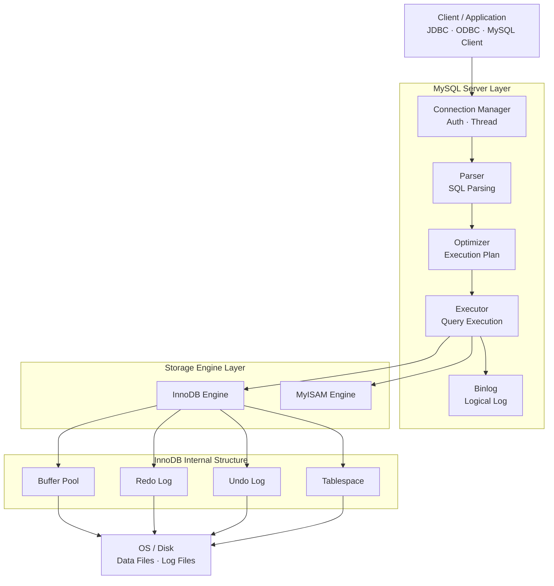
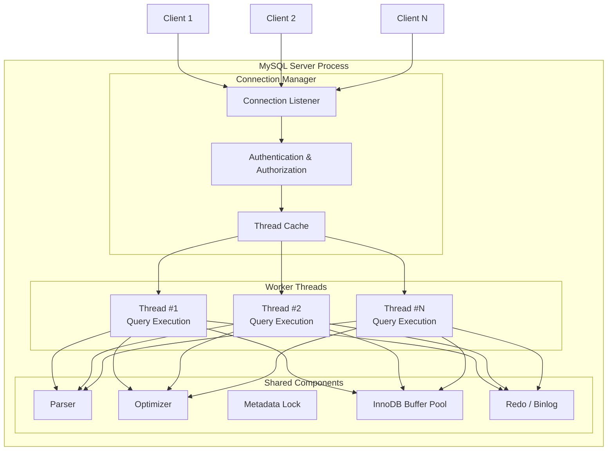
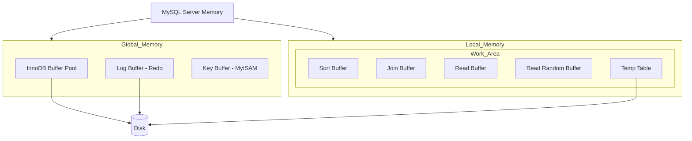
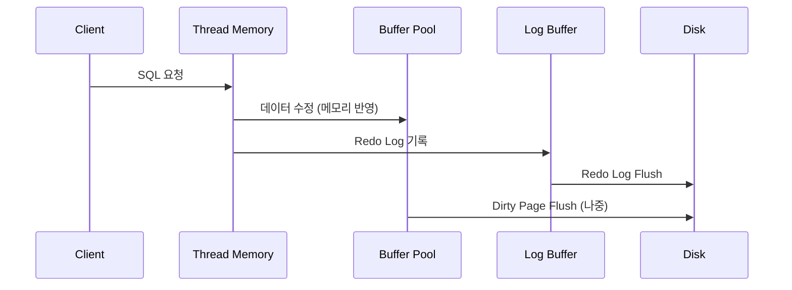
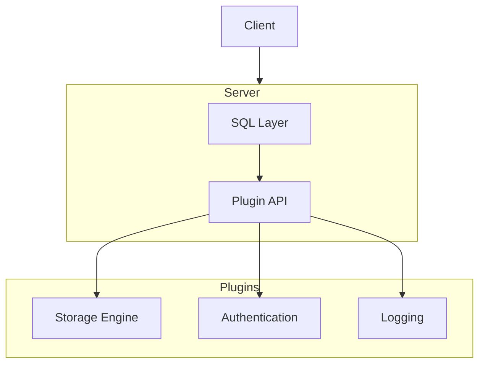
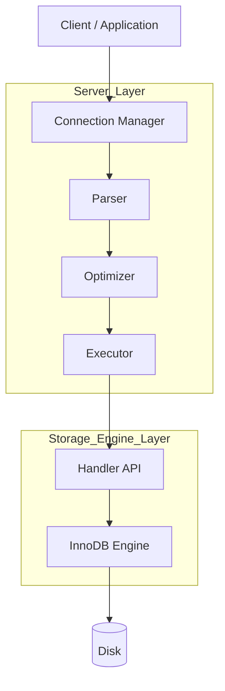
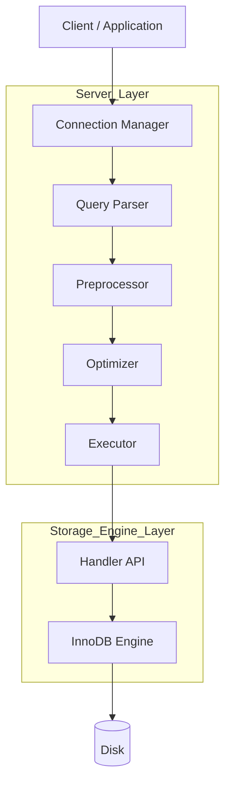

# MySQL 아키텍처 (작성 중..)

- MySQL 서버는 머리 역할을 담당하는 MySQL 엔진과, 손발 역할을 담당하는 스토리지 엔진으로 구분할 수 있다.
- 스토리지 엔진은 핸들러 API를 만족하면 누구든지 스토리지 엔진을 구현해서 MySQL 서버에 추가해 사용할 수 있다.
- 이번 장에서는 InnoDB 스토리지 엔진과 MyISAM 스토리지 엔진을 구분해서 살펴보자.

## 1 MySQL 엔진 아키텍처

- MySQL 서버는 다른 DBMS에 비해 구조가 상당히 독특하다.
- 아래 구조도를 보면서 설명을 이어나가보자.

### 1-1. MySQL 전체 아키텍처 구조도



#### (1) MySQL 엔진

- 클라이언트로부터의 접속 및 쿼리 요청을 처리하는 커넥션 핸들러와 SQL 파서 및 전처리기, 쿼리의 최적화된 실행을 위한 옵티마이저가 중심을 이룬다.

#### (2) 스토리지 엔진

- 실제 데이터를 디스크 스토리지에 저장하거나 디스크 스토리지로부터 데이터를 읽어오는 부분을 담당한다.
- 스토리지 엔진은 여러 개를 동시에 사용할 수 있다.
  - 다음과 같이 테이블이 사용할 스토리지 엔진을 지정하면 이후 해당 테이블의 모든 읽기 작업이나 변경 작업은 정의된 스토리지 엔진이 처리한다

  ```sql
  CREATE TABLE test_table (fd1 INT, fd2 INT) ENGINE=InnoDB;
  ```

#### (3) 핸들러 API

- MySQL 엔진의 쿼리 실행기에서 데이터를 쓰거나 읽어야 할 때는 각 스토리지 엔진에 쓰기 또는 읽기를 요청하는데, 이러한 요청을 핸들러(Handler) 요청이라고 한다. 여기에서 사용되는 API를 핸들러 API라고 부른다.
- 핸들러 API를 통해 얼마나 많은 데이터(레코드) 작업이 있었는지는 `SHOW GLOBAL STATUS LIKE 'Handler%';` 명령어로 확인해볼 수 있다.
  - 현재 Spring Batch 메타데이터만 관리하는 DB에 요청해본결과

  ```markdown
  | Variable_name              | Value     |
  | -------------------------- | --------- |
  | Handler_commit             | 52788536  |
  | Handler_delete             | 1279      |
  | Handler_discover           | 0         |
  | Handler_external_lock      | 47244223  |
  | Handler_mrr_init           | 0         |
  | Handler_prepare            | 42530716  |
  | Handler_read_first         | 2641564   |
  | Handler_read_key           | 23349322  |
  | Handler_read_last          | 5         |
  | Handler_read_next          | 7360721   |
  | Handler_read_prev          | 2503      |
  | Handler_read_rnd           | 855       |
  | Handler_read_rnd_next      | 388011957 |
  | Handler_rollback           | 418       |
  | Handler_savepoint          | 0         |
  | Handler_savepoint_rollback | 0         |
  | Handler_update             | 10972053  |
  | Handler_write              | 191353285 |
  ```

---

### 1-2. MySQL 스레딩 구조

- MySQL 서버는 스레드 기반으로 동작한다.
- 크게 포그라운드(Foreground) 스레드와 백그라운드(Background) 스레드로 구분할 수 있다.
- Thread per Connection으로 동작한다. (커넥션당 포그라운드 스레드 1개)
  - 일부 배포버전이나 엔터프라이즈 버전은 Thread Pool을 사용한다.
  - (내 생각) 보통 Application에서 커넥션 풀을 사용하므로 크게 문제되지는 않을 것 같아 보임



#### (1) 포그라운드 스레드 (클라이언트 스레드)

- 각 클라이언트 사용자가 요청하는 쿼리 문장을 처리한다.
- 클라이언트 사용자가 작업을 마치고 커넥션을 종료하면 해당 커넥션을 담당하던 스레드는 다시 스레드 캐시(Thread Cache)로 돌아간다.
- 이떄 스레드 캐시에 유지할 수 있는 최대 스레드 개수는 `thread_cache_size` 시스템 변수로 설정한다.
- (내 생각) Thread Pool과 Thread Cache가 다른건 뭐지?
  - Thread Cache - 종료된 스레드를 버리지 않고 보관했다가 재사용 - 스레드를 덜 만들 뿐, 많이 쓰는 건 그대로다.

    ```text
    Connection 종료
    → Thread 종료 ❌
    → Thread Cache에 보관
    새 Connection
    → Thread 생성 ❌
    → Cache에서 재사용
    ```

  - Thread Pool
    - 커넥션 수와 스레드 수를 분리
    - 요청을 큐잉해서 제한된 스레드로 처리
    - 애초에 스레드를 많이 못 쓰게 막는다.

    ```text
    Connection 1,000개
    ↓
    Request Queue
    ↓
    Worker Thread 32개
    ```

    > 정리, Thread Cache는 Thread-per-Connection 모델을 유지한 채 <br/ >
    > 스레드 생성 비용을 줄이는 기능이다. <br/ >
    > Thread Pool은 커넥션과 스레드를 분리해서 <br/ >
    > 서버의 동시성을 제어하는 아키텍처적인 변화이다.

- 데이터를 MySQL의 버퍼나 캐시로부터 가져오며, 버퍼나 캐시에 없는 경우에는 직접 디스크의 데이터나 인덱스 파일로부터 데이터를 읽어와서 작업을 처리한다.
- InnoDB에서 쓰기 작업은 데이터 버퍼나 캐시까지만 포그라운드 스레드가 처리하고, 버퍼로부터 디스크까지 기록하는 작업은 백그라운드 스레드가 처리한다.

#### (2) 백그라운드 스레드

InnoDB는 다음과 같은 여러 가지 작업이 백그라운드 스레드로 처리된다.

- 인서트 버퍼 (Insert Buffer)를 병합하는 스레드
- **로그를 디스크로 기록하는 스레드**
- **InnoDB 버퍼 풀의 데이터를 디스크에 기록하는 스레드**
- 데이터를 버퍼로 읽어오는 스레드
- 잠금이나 데드락을 모니터링하는 스레드

가장 중요한 것은 로그 스레드와 버퍼의 데이터를 디스크로 내려쓰는 작업을 처리하는 쓰기 스레드

MySQL 5.5 버전부터 데이터 쓰기 스레드와 읽기 스레드의 개수를 2개 이상 지정할 수 있게 됨 (`innodb_write_io_threads`, `innodb_read_io_threads` 시스템 변수로 설정할 수 있음)

데이터를 읽는 작업은 주로 클라이언트 스레드에서 처리되기 때문에 읽기 스레드는 많이 설정할 필요는 없다.
쓰기 스레드는 아주 많은 작업을 백그라운드로 처리하기 때문에 일반적인 내장 디스크를 사용할 때는 2~4 정도, DAS나 SAN 같은 스토리지를 사용할 때는 디스크를 최적으로 사용할 수 있을 만큼 충분히 설정하는 것이 좋음

상용 DBMS에는 대부분 쓰기 작업을 버퍼링해서 일괄 처리하는 기능이 탑재되어 있으며, InnoDB 또한 이러한 방식으로 처리한다.
INSERT, UPDATE, DELETE 쿼리로 데이터가 변경되는 경우 데이터가 디스크의 데이터 파일로 완전히 저장될 때까지 기다리지 않아도 된다.

---

### 1-3. 메모리 할당 및 사용 구조



MySQL에서 사용되는 메모리 공간은 크게 글로벌 메모리 영역과 로컬 메모리 영역으로 구분할 수 있다.
글로벌 메모리 영역의 메모리 공간은 MySQL 서버가 시작되면서 운영체제로부터 할당된다.

#### (1) 글로벌 메모리 영역

일반적으로 하나의 메모리 공간만 할당된다. 필요에 따라 2개 이상의 메모리 공간을 할당받을 수도 있지만, 생성된 글로벌 영역이 N개라 하더라도 모든 스레드에 의해 공유된다.

대표적인 글로벌 메모리 영역은 다음과 같다

- 테이블 캐시
- InnoDB 버퍼 풀
- InnoDB 어댑티브 해시 인덱스
- InnoDB 리두 로그 버퍼

#### (2) 로컬 메모리 영역 (세션 메모리 영역)

클라이언트 스레드가 쿼리를 처리하는 데 사용하는 메모리 영역이다.
클라이언트 커넥션이 많아지면 메모리가 급증하여 OOM의 원인이 되기도한다.

한 가지 중요한 특징은 각 쿼리의 용도별로 필요할 때만 공간이 할당되고 필요하지 않은 경우에는 MySQL이 메모리 공간을 할당조차도 하지 않을 수 있다.

커넥션이 열려 있는 동안 할당된 상태로 남아있는 공간도 있고 (커넥션 버퍼나 결과 버퍼)
그렇지 않고 쿼리를 실행하는 순간에만 할당했다가 다시 해제하는 공간 (소트 버퍼나 조인 버퍼)도 있다.

대표적인 로컬 메모리 영역은 다음과 같다

- 정렬 버퍼 (Sort Buffer)
- 조인 버퍼
- 바이너리 로그 캐시
- 네트워크 버퍼

#### (3) 메모리 구조 흐름



간단히 얘기하면 Buffer Pool 중심의 캐시 구조이고, 트랜잭션 안정성은 Log Buffer(Redo Log)로 보장한다.

---

### 1-4. 플러그인 스토리지 엔진 모델

MySQL의 독특한 구조 중 대표적인 것이 바로 플러그인 모델이다.
MySQL Server 위에 다양한 기능이 플러그인 형태로 붙는다.



플러그인으로 사용할 수 있는 것은 스토리지 엔진 뿐만 아니라, 전문 검색을 위한 검색어 파서도 플러그인 형태로 개발해서 사용할 수 있다.
사용자의 인증을 위한 Native Authentication과 Caching SHA-2 Authentication 모두 플러그인으로 구현되어 제공된다.

MySQL은 이미 기본적으로 많은 스토리지 엔진을 제공하고 있지만, 부가적인 기능을 더 제공하는 스토리지 엔진이 필요하는 경우에는 직접 개발하여 플러그인으로 사용하는 것도 가능하다.

MySQL에서 쿼리가 실행되는 과정을 보자. 거의 대부분이 MySQL 엔진 (서버)에서 처리되고, 마지막 **데이터 읽기/쓰기** 작업만 스토리지 엔진에 의해 처리된다.
만약 사용자가 새로운 용도의 스토리지 엔진을 만든다 하더라도, 이 영역만 구현하면 된다는 의미이다.



그리고 MySQL을 사용하다 보면 **핸들러(Handler)**라는 단어를 자주 접하게 될 것이다.
핸들러라는 단어는 MySQL 서버의 소스코드로 부터 넘어온 표현인데, 어떤 기능을 호출하기 위해 사용하는 역할을 하는 객체를 핸들러(또는 핸들러 객체)라고 표현한다. MySQL 서버에서 MySQL 엔진이 스토리지 엔진을 조정하기 위해 핸들러라는 것을 사용한다라고 이해하면 된다.

위 내용을 완전히 이해하지 못해도 괜찮다, 다만 MySQL 엔진이 스토리지 엔진에게 데이터를 읽어오거나 저장하도록 명령하려면 반드시 핸들러를 통해야 한다는 점만 기억하자.

MySQL에서 MyISAM이나 InnoDB와 같이 다른 스토리지 엔진을 사용하는 테이블에 대해 쿼리를 실행하더라도 MySQL의 처리 내용은 대부분 동일하며, 단순히 **데이터 읽기/쓰기** 영역의 처리 차이만 있을 뿐이다.
실질적인 GROUP BY나 ORDER BY 등 복잡한 처리는 스토리지 엔진 영역이 아니라 MySQL 엔진의 처리 영역인 `쿼리 실행기`에서 처리된다.

이제 설치된 MySQL 서버(mysqld)에서 지원되는 스토리지 엔진이 어떤 것이 있는지 확인해보자

```sql
SHOW ENGINES;
```

| Engine             | Support | Comment                                                          | Transactions | XA   | Savepoints |
| ------------------ | ------- | ---------------------------------------------------------------- | ------------ | ---- | ---------- |
| ndbcluster         | NO      | Clustered, fault-tolerant tables                                 | null         | null | null       |
| MEMORY             | YES     | Hash based, stored in memory, useful for temporary tables        | NO           | NO   | NO         |
| InnoDB             | DEFAULT | Supports transactions, row-level locking, and foreign keys       | YES          | YES  | YES        |
| PERFORMANCE_SCHEMA | YES     | Performance Schema                                               | NO           | NO   | NO         |
| MyISAM             | YES     | MyISAM storage engine                                            | NO           | NO   | NO         |
| FEDERATED          | NO      | Federated MySQL storage engine                                   | null         | null | null       |
| ndbinfo            | NO      | MySQL Cluster system information storage engine                  | null         | null | null       |
| MRG_MYISAM         | YES     | Collection of identical MyISAM tables                            | NO           | NO   | NO         |
| BLACKHOLE          | YES     | /dev/null storage engine \(anything you write to it disappears\) | NO           | NO   | NO         |
| CSV                | YES     | CSV storage engine                                               | NO           | NO   | NO         |

Support 컬럼에 표시될 수 있는 값은 4가지다

- **YES**: MySQL 서버(mysqld)에 해당 스토리지 엔진이 포함되어 있고, 사용 가능으로 활성화된 상태
- **DEFAULT**: `YES`와 동일한 상태이지만 필수 스토리지 엔진임을 의미함 (이 스토리지 엔진이 없으면 MySQL이 시작되지 않을 수도 있음)
- **NO**: 현재 MySQL 서버에 포함되지 않았음
- **DISABLED**: 현재 MySQL 서버에는 포함되었지만 파라미터에 의해 비활성화된 상태

MySQL 서버에 포함되지 않은 스토리지 엔진을 사용하려면 MySQL 서버를 다시 빌드(컴파일)해야 한다.
플러그인 형태로 빌드된 스토리지 엔진 라이브러리가 있다면 다운로드해서 끼워 넣기만 하면 사용할 수 있다.

아래 명령어로 스토리지 엔진뿐 아니라 인증 및 전문 검색용 파서와 같은 플러그인도 (설치돼 있다면) 확인할 수 있다.

```sql
SHOW PLUGINS;
```

| Name                             | Status   | Type               | Library | License |
| -------------------------------- | :------- | :----------------- | :------ | :------ |
| binlog                           | ACTIVE   | STORAGE ENGINE     | null    | GPL     |
| sha256_password                  | ACTIVE   | AUTHENTICATION     | null    | GPL     |
| caching_sha2_password            | ACTIVE   | AUTHENTICATION     | null    | GPL     |
| sha2_cache_cleaner               | ACTIVE   | AUDIT              | null    | GPL     |
| daemon_keyring_proxy_plugin      | ACTIVE   | DAEMON             | null    | GPL     |
| CSV                              | ACTIVE   | STORAGE ENGINE     | null    | GPL     |
| MEMORY                           | ACTIVE   | STORAGE ENGINE     | null    | GPL     |
| InnoDB                           | ACTIVE   | STORAGE ENGINE     | null    | GPL     |
| INNODB_TRX                       | ACTIVE   | INFORMATION SCHEMA | null    | GPL     |
| INNODB_CMP                       | ACTIVE   | INFORMATION SCHEMA | null    | GPL     |
| INNODB_CMP_RESET                 | ACTIVE   | INFORMATION SCHEMA | null    | GPL     |
| INNODB_CMPMEM                    | ACTIVE   | INFORMATION SCHEMA | null    | GPL     |
| INNODB_CMPMEM_RESET              | ACTIVE   | INFORMATION SCHEMA | null    | GPL     |
| INNODB_CMP_PER_INDEX             | ACTIVE   | INFORMATION SCHEMA | null    | GPL     |
| INNODB_CMP_PER_INDEX_RESET       | ACTIVE   | INFORMATION SCHEMA | null    | GPL     |
| INNODB_BUFFER_PAGE               | ACTIVE   | INFORMATION SCHEMA | null    | GPL     |
| INNODB_BUFFER_PAGE_LRU           | ACTIVE   | INFORMATION SCHEMA | null    | GPL     |
| INNODB_BUFFER_POOL_STATS         | ACTIVE   | INFORMATION SCHEMA | null    | GPL     |
| INNODB_TEMP_TABLE_INFO           | ACTIVE   | INFORMATION SCHEMA | null    | GPL     |
| INNODB_METRICS                   | ACTIVE   | INFORMATION SCHEMA | null    | GPL     |
| INNODB_FT_DEFAULT_STOPWORD       | ACTIVE   | INFORMATION SCHEMA | null    | GPL     |
| INNODB_FT_DELETED                | ACTIVE   | INFORMATION SCHEMA | null    | GPL     |
| INNODB_FT_BEING_DELETED          | ACTIVE   | INFORMATION SCHEMA | null    | GPL     |
| INNODB_FT_CONFIG                 | ACTIVE   | INFORMATION SCHEMA | null    | GPL     |
| INNODB_FT_INDEX_CACHE            | ACTIVE   | INFORMATION SCHEMA | null    | GPL     |
| INNODB_FT_INDEX_TABLE            | ACTIVE   | INFORMATION SCHEMA | null    | GPL     |
| INNODB_TABLES                    | ACTIVE   | INFORMATION SCHEMA | null    | GPL     |
| INNODB_TABLESTATS                | ACTIVE   | INFORMATION SCHEMA | null    | GPL     |
| INNODB_INDEXES                   | ACTIVE   | INFORMATION SCHEMA | null    | GPL     |
| INNODB_TABLESPACES               | ACTIVE   | INFORMATION SCHEMA | null    | GPL     |
| INNODB_COLUMNS                   | ACTIVE   | INFORMATION SCHEMA | null    | GPL     |
| INNODB_VIRTUAL                   | ACTIVE   | INFORMATION SCHEMA | null    | GPL     |
| INNODB_CACHED_INDEXES            | ACTIVE   | INFORMATION SCHEMA | null    | GPL     |
| INNODB_SESSION_TEMP_TABLESPACES  | ACTIVE   | INFORMATION SCHEMA | null    | GPL     |
| MyISAM                           | ACTIVE   | STORAGE ENGINE     | null    | GPL     |
| MRG_MYISAM                       | ACTIVE   | STORAGE ENGINE     | null    | GPL     |
| PERFORMANCE_SCHEMA               | ACTIVE   | STORAGE ENGINE     | null    | GPL     |
| TempTable                        | ACTIVE   | STORAGE ENGINE     | null    | GPL     |
| ARCHIVE                          | ACTIVE   | STORAGE ENGINE     | null    | GPL     |
| BLACKHOLE                        | ACTIVE   | STORAGE ENGINE     | null    | GPL     |
| FEDERATED                        | DISABLED | STORAGE ENGINE     | null    | GPL     |
| ndbcluster                       | DISABLED | STORAGE ENGINE     | null    | GPL     |
| ndbinfo                          | DISABLED | STORAGE ENGINE     | null    | GPL     |
| ndb_transid_mysql_connection_map | DISABLED | INFORMATION SCHEMA | null    | GPL     |
| ngram                            | ACTIVE   | FTPARSER           | null    | GPL     |
| mysqlx_cache_cleaner             | ACTIVE   | AUDIT              | null    | GPL     |
| mysqlx                           | ACTIVE   | DAEMON             | null    | GPL     |
| mysql_native_password            | DISABLED | AUTHENTICATION     | null    | GPL     |

---

### 1-5. 컴포넌트

MySQL 8.0 부터는 기존의 플러그인 아키텍처를 대체하기 위해 컴포넌트 아키텍처가 지원된다.
플러그인은 다음과 같은 몇 가지 단점이 있는데, 컴포넌트는 이러한 단점들을 보완해서 구현했다.

- 플러그인은 오직 MySQL 서버와 인터페이스 할 수 있고, 플러그인끼리는 통신할 수 없음
- 플러그인은 MySQL 서버의 변수나 함수를 직접 호출하기 때문에 안전하지 않음
- 플러그인은 상호 의존 관계를 설정할 수 없어서 초기화가 어려움

MySQL 5.7 버전까지는 비밀번호 검증 기능이 플러그인 형태로 제공됐지만 MySQL 8.0의 비밀번호 검증 기능은 컴포넌트로 개선됐다.
컴포넌트의 간단한 사용법을 비밀번호 검증 기능 컴포넌트를 통해 살펴보자

```bash
// validate_password 컴포넌트 설치
mysql> INSTALL COMPONENT 'file://component_validate_password';

// 설치된 컴포넌트 확인
mysql> SELECT * FROM mysql.component;
```

### 1-6. 쿼리 실행 구조



위 그림은 쿼리를 실행하는 관점에서 MySQL의 구조를 간략하게 그림으로 표현한 것이며, 다음과 같이 기능별로 나눠볼 수 있다.

#### (1) 쿼리 파서

쿼리 파서는 사용자 요청으로 들어온 쿼리 문장을 토큰(MySQL이 인식할 수 있는 최소 단위의 어휘)로 분해해 트리 형태의 구조로 만들어 내는 작업을 의미한다. 쿼리 문장의 기본 문법 오류는 이 과정에서 발견된다.

#### (2) 전처리기

파서 트리를 기반으로 쿼리 문장에 구조적인 문제점이 있는지 확인한다. 테이블 이름이나 컬럼 이름, 또는 내장 함수와 같은 개체를 매핑해 해당 객체의 존재 여부와 객체의 접근 권한 등을 확인하는 과정을 수행한다.

#### (3) 옵티마이저

위에서 처리된 쿼리 트리를 **저렴한 비용으로 가장 빠르게 처리할지(실행 계획)**를 결정하는 역할을 담당한다.
옵티마이저의 역할은 중요하고 영향 범위가 아주 넓으며, 어떻게 하면 옵티마이저가 더 나은 선택을 할 수 있게 유도하는가를 계속하여 설명하려고 한다.

#### (4) 실행 엔진

쉽게 이해할 수 있도록, 예를 들어, 옵티마이저가 `GROUP BY`를 처리하기 위해 임시 테이블을 사용하기로 결정했다고 해보자.

- **1. 실행 엔진이 핸들러에게 임시 테이블을 만들라고 요청**
- **2. 다시 실행 엔진은 WHERE 절에 일치하는 레코드를 읽어오라고 핸들러에게 요청**
- **3. 읽어온 레코드들을 1번에서 준비한 임시 테이블로 저장하라고 다시 핸들러에게 요청**
- **4. 데이터가 준비된 임시 테이블에서 필요한 방식으로 데이터를 읽어 오라고 핸들러에게 다시 요청**
- **5. 최종적으로 실행 엔진은 결과를 사용자나 다른 모듈로 넘김**

즉, 실행 엔진은 만들어진 계획대로 각 헨들러에게 요청해서 받은 결과를 또 다른 핸들러 요청의 입력으로 연결하는 역할을 수행한다.

#### (5) 핸들러 (스토리지 엔진)

MySQL 서버의 가장 밑단에서 실행 엔진의 요청에 따라 데이터를 디스크로 저장하고 디스크로부터 읽어오는 역할을 담당한다.

### 1-7. 복제

MySQL 서버에서 복제는 매우 중요한 역할을 담당하고, 많은 발전을 거듭해왔다. 이 내용은 별도의 장에서 다루기로 한다.

### 1-8. 쿼리 캐시

MySQL 서버에서 쿼리 캐시는 빠른 응답을 필요로 하는 웹 애플리케이션에서 중요한 역할을 담당했다.
쿼리 캐시는 SQL의 실행 결과를 메모리에 캐시하고, 동일 SQL 쿼리가 실행되면 테이블을 읽지 않고 즉시 결과를 반환하는 기능이다.
하지만 테이블의 데이터가 변경되면 캐시에 저장된 결과 중에서 변경된 테이블과 관련된 것들은 모두 삭제(Invalidate)해야 했다.
이는 심각한 동시 처리 성능 저하를 유발하고, MySQL 서버가 발전하면서 동시 처리 성능 저하와 많은 버그의 원인이 되기도 했다.

MySQL 8.0으로 올라오면서 쿼리 캐시는 MySQL 서버 기능에서 완전히 제거됐다.

### 1-9. 스레드 풀

MySQL 서버 엔터프라이즈 에디션은 스레드 풀 기능을 제공하지만 커뮤니티 에디션은 제공하지 않는다.
여기서는 Percona Server에서 제공하는 스레드 풀 기능을 살펴보고자 한다.

Percona Server의 스레드 풀은 플러그인 형태로 작동하게 구현되어 있다.
커뮤니티 에디션에서 스레드 풀 기능을 사용하고자 한다면,
동일 버전의 Percona Server에서 스레드 풀 플러그인 라이브러리(thread_pool.so)를 `INSTALL PLUGIN` 명령어를 사용해 설치하면 된다.

스레드 풀은 사용자의 요청을 처리하는 스레드의 개수를 줄여서 동시 처리되는 요청이 많다 하더라도
MySQL 서버의 CPU가 제한된 개수의 스레드 처리에만 집중할 수 있게 해서 서버의 자원 소모를 줄이는 것이 목적이다.

사용한다고 반드시 성능이 빨라지는 것은 아니다.
동시에 실행 중인 스레드들을 CPU가 최대한 잘 처리해낼 수 있는 수준으로 줄여서 빨리 처리하게 하는 기능이기 때문에
스케줄링 과정에서 CPU를 제대로 확보하지 못하는 경우에는 쿼리 처리가 더 느려지는 사례가 발생할 수도 있다는 점을 유의하자.

제한된 수의 스레드만으로 CPU가 처리하도록 적절히 유도한다면 CPU의 프로세서 친화도(Processor Affinity)를 높이고
운영체제 입장에서는 불필요한 컨텍스트 스위치(Context Switch)를 줄여서 오버헤드를 낮출 수 있다.

스레드 개수는 일반적으로 CPU 코어의 개수와 맞추는 것이 CPU 프로세서 친화도를 높이는 데 좋다.
자세한 내용은 Percona Server의 스레드 풀을 참조하자.

### 1-10. 트랜잭션 지원 메타데이터

데이터베이스 서버에서 테이블의 구조 정보와 스토어드 프로그램 등의 정보를 데이터 딕셔너리 또는 메타데이터라고 한다.
MySQL 서버는 5.7 버전까지 테이블의 구조를 FRM 파일에 저장하고 일부 스토더으 프로그램 또한 파일 기반으로 관리했다.

하지만 이러한 파일 기반의 메타데이터는 생성 및 변경 작업이 트랜잭션을 지원하지 않기 때문에 테이블의 생성 또는 변경 도중에
MySQL 서버가 비정상적으로 종료되면 일관되지 않는 상태로 남는 문제가 있었다.

MySQL 8.0 버전부터는 이러한 문제점을 해결하기 위해 테이블의 구조 정보나 스토어드 프로그램의 코드 관련 정보를
모두 InnoDB의 테이블에 저장하도록 개선됐다.

시스템 테이블(MySQL 서버가 작동하는 데 기본적으로 필요한 테이블)과 데이터 딕셔너리 정보를 모두 모아서 `mysql` DB에 저장하고 있다.
`mysql` DB는 `mysql.ibd`라는 이름의 테이블 스페이스에 저장된다.

> 실제 mysql DB에서 테이블의 목록을 살펴보면 테이블은 보이지 않는다. </br>
> 데이터 딕셔너리 테이블의 데이터를 사용자가 임의로 수정하지 못하게 사용자의 화면에 보여주지만 않을 뿐 실제로 데이터는 존재한다. </br>
> 대신 MySQL 서버는 데이터 딕셔너리 저보를 information_schema DB의 TABLES와 COLUMNS 등과 같은 뷰를 통해 조회할 수 있게 하고 있다.

MySQL 8.0 버전부터 데이터 딕셔너리와 시스템 테이블이 모두 트랜잭션 기반의 InnoDB 스토리지 엔진에 저장되도록 개선되면서 이제 스키마 변경 작업 중간에 MySQL 서버가 비정상적으로 종료되더라도 스키마 변경이 완전한 성공 또는 완전한 실패로 정리된다.
