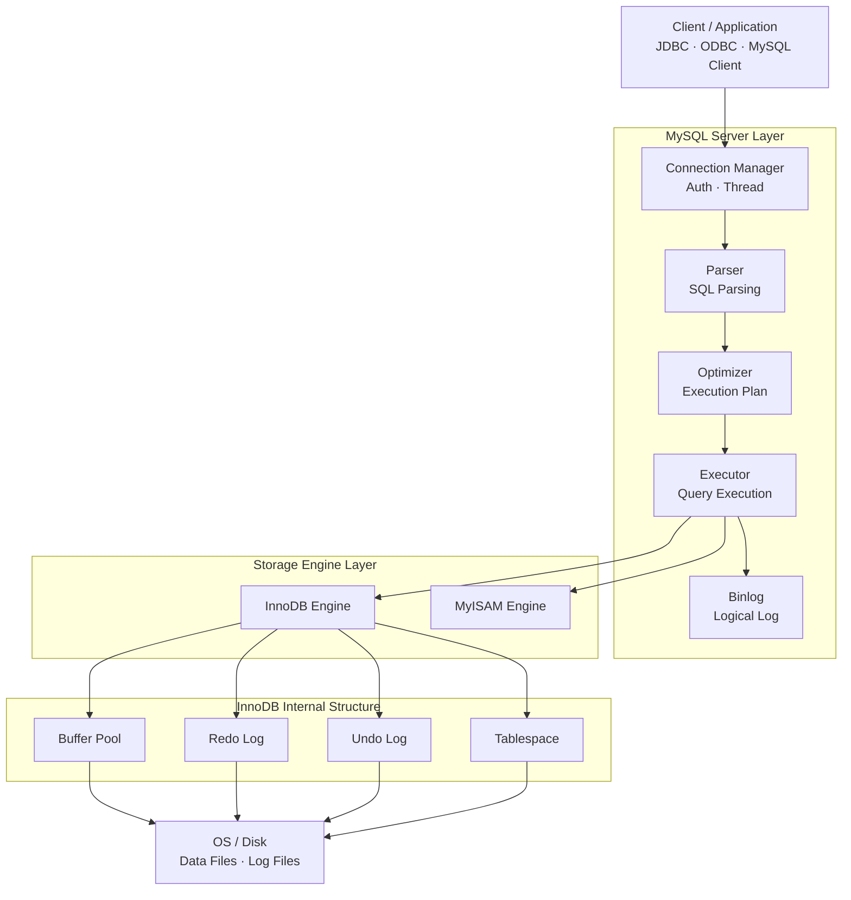
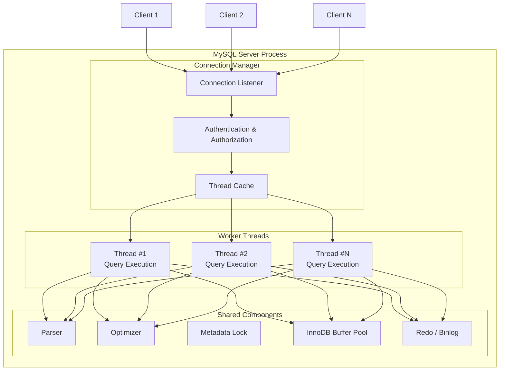

# 4장 아키텍처 (공부 중..)

- MySQL 서버는 머리 역할을 담당하는 MySQL 엔진과, 손발 역할을 담당하는 스토레이지 엔진으로 구분할 수 있다.
- 스토리지 엔진은 핸들러 API를 만족하면 누구든지 스토리지 엔진을 구현해서 MySQL 서버에 추가해 사용할 수 있다.
- 이번 장에서는 InnoDB 스토리지 엔진과 MyISAM 스토리지 엔진을 구분해서 살펴보자.

## 4.1 MySQL 엔진 아키텍처

- MySQL 서버는 다른 DBMS에 비해 구조가 상당히 독특하다.
- MySQL 서버는 크게 MySQL 엔진과 스토리지 엔진으로 구분할 수 있다.
- 아래 구조도를 보면서 설명을 이어나가보자.

### 1. MySQL 전체 아키텍처 구조도



#### (1) MySQL 엔진

- 클라이언트로부터의 접속 및 쿼리 요청을 처리하는 커넥션 핸들러와 SQL 파서 및 전처리기, 쿼리의 최적화된 실행을 위한 옵티마이저가 중심을 이룬다.

#### (2) 스토리지 엔진

- 실제 데이터를 디스크 스토리지에 저장하거나 디스크 스토리지로부터 데이터를 읽어오는 부분을 담당한다.
- 스토리지 엔진은 여러 개를 동시에 사용할 수 있다.
  - 다음과 같이 테이블이 사용할 스토리지 엔진을 지정하면 이후 해당 테이블의 모든 읽기 작업이나 변경 작업은 정의된 스토리지 엔진이 처리한다
  ```sql
  CREATE TABLE test_table (fd1 INT, fd2 INT) ENGINE=InnoDB;
  ```

#### (3) 핸들러 API

- MySQL 엔진의 쿼리 실행기에서 데이터를 쓰거나 읽어야 할 때는 각 스토리지 엔진에 쓰기 또는 읽기를 요청하는데, 이러한 요청을 핸들러(Handler) 요청이라고 한다. 여기에서 사용되는 API를 핸들러 API라고 부른다.
- 핸들러 API를 통해 얼마나 많은 데이터(레코드) 작업이 있었는지는 `SHOW GLOBAL STATUS LIKE 'Handler%';` 명령어로 확인해볼 수 있다.
  - 현재 Spring Batch 메타데이터만 관리하는 DB에 요청해본결과
  ```markdown
  | Variable_name              | Value     |
  | -------------------------- | --------- |
  | Handler_commit             | 52788536  |
  | Handler_delete             | 1279      |
  | Handler_discover           | 0         |
  | Handler_external_lock      | 47244223  |
  | Handler_mrr_init           | 0         |
  | Handler_prepare            | 42530716  |
  | Handler_read_first         | 2641564   |
  | Handler_read_key           | 23349322  |
  | Handler_read_last          | 5         |
  | Handler_read_next          | 7360721   |
  | Handler_read_prev          | 2503      |
  | Handler_read_rnd           | 855       |
  | Handler_read_rnd_next      | 388011957 |
  | Handler_rollback           | 418       |
  | Handler_savepoint          | 0         |
  | Handler_savepoint_rollback | 0         |
  | Handler_update             | 10972053  |
  | Handler_write              | 191353285 |
  ```

### 2. MySQL 스레딩 구조

- MySQL 서버는 스레드 기반으로 동작한다.
- 크게 포그라운드(Foreground) 스레드와 백그라운드(Background) 스레드로 구분할 수 있다.
- Thread per Connection으로 동작한다. (커넥션당 포그라운드 스레드 1개)
  - 일부 배포버전이나 엔터프라이즈 버전은 Thread Pool을 사용한다.
  - (내 생각) 보통 Application에서 커넥션 풀을 사용하므로 크게 문제되지는 않을 것 같아 보임



#### 포그라운드 스레드 (클라이언트 스레드)

- 각 클라이언트 사용자가 요청하는 쿼리 문장을 처리한다.
- 클라이언트 사용자가 작업을 마치고 커넥션을 종료하면 해당 커넥션을 담당하던 스레드는 다시 스레드 캐시(Thread Cache)로 돌아간다.
- 이떄 스레드 캐시에 유지할 수 있는 최대 스레드 개수는 `thread_cache_size` 시스템 변수로 설정한다.
- (내 생각) Thread Pool과 Thread Cache가 다른건 뭐지?

  - Thread Cache - 종료된 스레드를 버리지 않고 보관했다가 재사용 - 스레드를 덜 만들 뿐, 많이 쓰는 건 그대로다.

    ```text
    Connection 종료
    → Thread 종료 ❌
    → Thread Cache에 보관
    새 Connection
    → Thread 생성 ❌
    → Cache에서 재사용
    ```

  - Thread Pool
    - 커넥션 수와 스레드 수를 분리
    - 요청을 큐잉해서 제한된 스레드로 처리
    - 애초에 스레드를 많이 못 쓰게 막는다.
    ```text
    Connection 1,000개
    ↓
    Request Queue
    ↓
    Worker Thread 32개
    ```
    > 정리, Thread Cache는 Thread-per-Connection 모델을 유지한 채 <br>
    > 스레드 생성 비용을 줄이는 기능이다. <br>
    > Thread Pool은 커넥션과 스레드를 분리해서 <br>
    > 서버의 동시성을 제어하는 아키텍처적인 변화이다.
