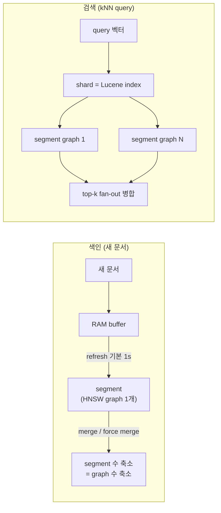
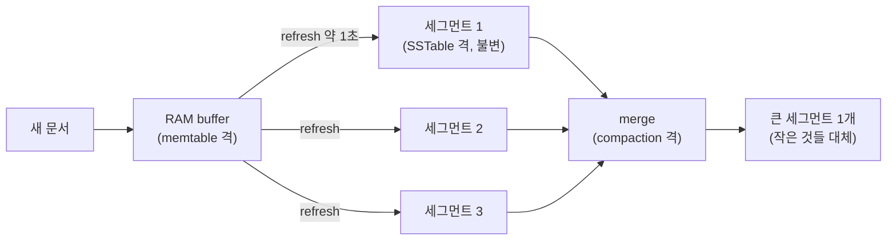

# Lucene 세그먼트 구조와 그 위에서 kNN이 동작하는 방식

> [벡터 검색 알고리즘 입문](../../AI/RAG/vector-search-algorithms.md)과 [HNSW 심화](../../AI/RAG/hnsw-deep-dive.md)에서 HNSW 그래프 자체는 다뤘다.
> 이 글은 그 그래프가 **범용 검색엔진(OpenSearch) 안에 어떻게 얹히는가** — Lucene 세그먼트 구조 위에서 kNN이 도는 방식이다.

OpenSearch를 벡터 DB로 쓸 때 성능이 왜 그렇게 나오는지는 엔진을 열어봐도 안 보인다.
답은 그 밑의 **Lucene 세그먼트 구조**에 있다.
한 줄로 요약하면 이렇다 — **벡터 인덱스는 세그먼트에 종속된다. 세그먼트마다 HNSW 그래프가 하나씩 불변으로 만들어지고, kNN 쿼리는 샤드 안 모든 세그먼트 그래프로 fan-out 해서 각 top-k를 병합한다.**
이 한 문장이 "세그먼트가 많으면 느리다", "force merge로 빨라진다", "OpenSearch 벡터 검색 QPS 천장" 을 전부 설명한다.

## 먼저 가져갈 결론

- Lucene 인덱스는 **불변 세그먼트의 모음**이다. 문서를 넣으면 새 세그먼트가 생기고, 지우면 기존 세그먼트에 삭제 표시만 남는다.
- **벡터 인덱스(HNSW 그래프)는 세그먼트마다 1개씩** 만들어진다. 샤드에 세그먼트가 N개면 그래프도 N개다.
- kNN 쿼리는 **샤드 안 모든 세그먼트 그래프를 각각 탐색**해 세그먼트별 top-k를 뽑고, 그걸 병합해 전역 top-k를 낸다. 그래서 세그먼트가 많을수록 느려진다.
- **force merge**는 세그먼트를 소수(보통 1개)로 강제 병합하는 작업이다. 그래프가 1개로 줄어 검색이 빨라져, 읽기 전용 벡터 인덱스에 공식 권장된다.
- 이 구조가 우리 벤치에서 본 **OpenSearch QPS 특성**의 근본 원리다 — 단일 샤드 + force merge로 그래프 1개를 만든 뒤 측정했고, 그 위에서 쿼리 병렬성이 병목을 만든다.

## 한눈에 — 색인과 검색의 흐름

새 문서는 segment 로 굳으며 그 segment 전용 HNSW graph 를 하나 얻고, 검색은 shard 안 모든 segment graph 로 fan-out 해 병합한다.
아래에서 이 두 흐름을 뜯어본다.

## 왜 이런 구조인가 — RDB page 모델과 다른 이유

MySQL 같은 RDB에 익숙하면 세그먼트가 처음엔 낯설다. RDB는 **B-tree + page** 구조다. 데이터가 고정 크기 page(보통 4~16KB)에 담기고, row 하나를 고치면 그 page를 찾아가 **그 자리에서 덮어쓴다**(in-place update). B-tree 인덱스도 정렬된 값 하나가 바뀌면 트리 노드 몇 개만 국소적으로 갱신하면 끝난다.

Lucene이 다루는 자료구조는 이 방식이 훨씬 비싸다.

- inverted index(단어 → 그 단어가 있는 문서 id 목록)는 문서 하나를 고치면, 그 문서에 있던 단어 수십~수백 개 각각의 posting list를 다 손봐야 한다.
- HNSW 그래프(벡터 → 이웃 벡터로 이어지는 링크)는 벡터 하나를 빼려면 그 벡터와 연결된 이웃들의 링크를 다시 이어야 한다. B-tree처럼 국소 수정이 안 된다.

그래서 Lucene은 "제자리에서 고쳐 쓰기"를 아예 포기하고 다른 전략을 택했다. **LSM-tree**(Log-Structured Merge-tree)다.

핵심 아이디어는 단순하다 — **쓰기는 항상 새 파일에 append만 한다. 기존 파일은 절대 손대지 않는다. 대신 나중에 여러 파일을 병합해 정리한다.** RocksDB나 Cassandra가 쓰는 **SSTable**(Sorted String Table)이 이 전략의 구체적인 구현이다.

- 변경분은 먼저 메모리 버퍼(memtable)에 모인다.
- 버퍼가 일정량 차면 정렬된 상태로 디스크에 **불변 파일** 하나로 쓴다 — 이게 SSTable이다.
- 삭제는 그 자리에서 지우지 않고 tombstone 표시만 새 파일에 남긴다.
- 시간이 지나면 이 불변 파일이 수십~수백 개로 늘어나고, 조회가 느려지기 전에 백그라운드 **compaction**이 여러 파일을 하나로 다시 써서 정리한다.

Lucene 세그먼트는 이 패턴을 그대로 따른다.

| LSM-tree / SSTable 용어 | Lucene(OpenSearch) 용어 |
| --- | --- |
| memtable(메모리 버퍼) | RAM buffer |
| memtable → SSTable flush | refresh(기본 1초) → 세그먼트 생성 |
| SSTable(불변 파일) | 세그먼트(불변) |
| tombstone(삭제 표시) | 삭제 문서 tombstone |
| compaction | merge / force merge |

그래서 RDB page 비유는 오히려 헷갈린다. page는 고정 크기이고 in-place update가 정상 동작이지만, 세그먼트는 크기가 가변이고(TieredMergePolicy 상한이 기본 5GB) 절대 수정되지 않는다. 세그먼트당 문서 개수가 고정값이 아닌 이유도 여기서 나온다 — memtable flush 시점과 compaction 정책이 SSTable 크기를 정하듯, refresh 시점과 merge 정책(문서 개수가 아니라 세그먼트 크기 기준)이 세그먼트 크기를 정한다.

이 비유가 왜 중요하냐면, force merge를 이해하는 열쇠이기 때문이다. **force merge는 수동으로 트리거하는 compaction이다.** 흩어진 세그먼트(=SSTable)를 강제로 합쳐 개수를 줄이는 것이고, 벡터 검색에서는 세그먼트마다 따로 있던 HNSW 그래프까지 하나로 합쳐지는 효과로 이어진다(아래 2부).

## 1부. Lucene 세그먼트 구조

### inverted index — 세그먼트의 알맹이

Lucene은 문서를 넣을 때 텍스트를 term으로 분석해 "term → 그 term을 가진 문서 목록(posting list)" 매핑을 만든다.
이게 inverted index다 — 문서에서 단어를 찾는 게 아니라, 단어에서 문서를 역방향으로 찾는다.
그리고 Lucene 인덱스는 이 inverted index를 통째로 하나 두는 게 아니라, **작은 inverted index 여러 개의 모음**이다. 그 하나하나가 세그먼트다.

### 세그먼트는 불변이다

세그먼트는 한번 쓰이면 고쳐지지 않는다(immutable).

- 문서 추가 — 기존 세그먼트를 건드리지 않고 **새 세그먼트**에 쓴다.
- 문서 수정·삭제 — 원래 세그먼트 안에서 **삭제됨(tombstone)으로 표시만** 한다. 실제로 지우지 않는다.

불변이라 얻는 게 크다.
락 없이 여러 스레드가 동시에 읽을 수 있고, OS 페이지 캐시에 안전하게 올라가 한번 캐시되면 무효화될 일이 없다.
벡터 검색에서 이 불변성이 그대로 그래프에 이어진다(2부).

### refresh — 새 세그먼트가 태어나는 순간

들어온 문서는 먼저 RAM 버퍼에 쌓인다. 이 상태에서는 아직 검색되지 않는다.
**refresh** 시점에 버퍼를 flush 해서 OS 페이지 캐시에 새 세그먼트를 만들고, 그때부터 그 문서가 검색된다.
`refresh_interval` 기본값이 1초라, 문서를 넣고 약 1초 뒤 검색된다 — 이것이 준실시간(near-real-time) 검색의 정체다.
간격을 늘리거나 끄면 작은 세그먼트가 덜 생겨 색인 처리량이 오른다. 대량 적재 때 refresh를 끄는 게 표준 튜닝인 이유다.

### merge — 작은 세그먼트를 큰 것으로

refresh가 계속 작은 세그먼트를 찍어내므로, 백그라운드에서 이들을 큰 세그먼트로 합친다.
Lucene 기본 정책은 TieredMergePolicy로, 크기가 비슷하거나 삭제 표시 비율이 높은 세그먼트를 골라 합친다.
병합은 선택된 세그먼트를 읽어 삭제 문서를 빼고 남은 문서만 새 큰 세그먼트로 다시 쓴 뒤, 원본 작은 세그먼트를 지운다.
이때 비로소 tombstone이 실제로 회수된다. 세그먼트 수가 줄어 검색이 열어볼 대상이 적어진다.

### force merge — 세그먼트를 강제로 줄이기

`_forcemerge`는 병합을 수동으로 강제해 세그먼트 수를 목표치(`max_num_segments`, 흔히 1)까지 줄인다.
세그먼트가 적을수록 읽기가 빨라지므로, **더 이상 쓰기가 없는 읽기 전용 인덱스**에 주로 쓴다.

여기서 헷갈리기 쉬운 지점이 하나 있다. 앞의 merge와 force merge는 같은 병합 로직을 쓰지만 **트리거되는 방식이 다르다.**

- **merge**는 자동이다. 세그먼트가 쌓이면 TieredMergePolicy가 백그라운드에서 알아서 판단해 돈다.
- **force merge**는 절대 저절로 일어나지 않는다. `_forcemerge` API를 누군가 명시적으로 호출해야만 실행된다. 주기적으로 돌리고 싶으면 OpenSearch의 ISM(Index State Management) 정책에 넣거나 외부 스케줄러로 직접 호출해야 한다.

주의할 점이 있다.

- 1개로 합치는 동안 샤드 저장 공간이 일시적으로 약 2배가 된다.
- 계속 쓰기가 있는 인덱스에 돌리면, 합쳐 만든 큰 세그먼트가 다시 병합 대상이 되며 비용만 든다. 그래서 read-only일 때만 권장된다.

> **실측 — 실제 운영 인덱스에서 확인**
> 사내 대형 인덱스(문서 약 수백만 건, primary shard 10여 개)를 조회해보면 shard당 세그먼트가 8~14개, 그중 가장 큰 세그먼트가 정확히 5GB 안팎이다. TieredMergePolicy 기본 상한(5GB)이 실측으로도 그대로 확인된다. 구성도 전형적이다 — shard당 수십만 문서짜리 거대 세그먼트 하나(과거 merge 결과)에, 최근 유입된 문서 100개 미만짜리 작은 세그먼트 여러 개가 붙어 있다.

### shard와 segment — 계층 관계

정리하면 계층은 이렇다 — **인덱스 = 샤드 여러 개, 샤드 1개 = Lucene 인덱스 1개 = 세그먼트 여러 개.**
쿼리는 인덱스의 모든 샤드로 뿌려지고(coordinating 노드가 취합), 각 샤드 안에서는 그 샤드의 모든 세그먼트를 훑어 부분 결과를 모은 뒤 병합한다.
이 "샤드로 fan-out, 세그먼트로 다시 fan-out" 구조가 벡터 검색에서 그대로 성능을 좌우한다.

## 2부. kNN 플러그인이 세그먼트 위에서 도는 방식

### 세그먼트마다 그래프 1개

핵심 사실이다. 벡터 인덱스(HNSW 그래프)는 세그먼트마다 별도로 만들어진다.
OpenSearch 공식 문서는 native 인덱스가 "knn_vector 필드 × 세그먼트 조합마다 1개" 생긴다고 적는다.
Elastic도 "세그먼트마다 HNSW 그래프를 탐색한다"고 명시한다.

즉 한 샤드에 세그먼트가 N개면 그 샤드의 HNSW 그래프도 N개다.
세그먼트가 불변이니 그래프도 세그먼트에 묶여 불변이고, 새 데이터는 새 세그먼트의 새 그래프로 들어간다.

### 쿼리는 전 세그먼트로 fan-out 후 병합

하나의 kNN 쿼리는 각 세그먼트의 그래프를 각각 탐색해 세그먼트별 top-k를 구한 뒤, 이들을 병합해 전역 top-k를 만든다.
그래서 세그먼트가 많으면 느려진다. 이유가 두 가지다.

- **탐색 횟수 증가** — HNSW 탐색 비용은 벡터 수에 로그로 는다. 같은 벡터를 여러 작은 그래프로 쪼개면, 벡터 100개짜리 그래프 5개를 탐색하는 게 벡터 500개짜리 그래프 1개보다 총비용이 크다.
- **낭비 증가** — 벡터가 세그먼트별로 의미 있게 나뉜 게 아니라서, 각 그래프에서 전역 top-k에 들지도 못할 이웃까지 탐색하는 낭비가 생긴다.

### force merge가 벡터 검색을 빠르게 하는 이유

세그먼트를 1개로 force merge 하면 HNSW 그래프도 1개가 된다. fan-out이 사라져 검색이 빨라진다.
OpenSearch 공식 문서가 이걸 직접 권장한다 — "샤드당 세그먼트 1개가 검색 지연 관점에서 최적"이라고.

단 조건이 붙는다. "초기 대량 적재 1회 → 이후 검색 전용" 워크로드에만 권장된다.
force merge 시 벡터 자료구조가 다시 만들어지지만(rebuild), 그 뒤로는 그래프가 1개로 안정돼 fan-out이 없어지기 때문이다.
운영 함정도 하나 있다 — 병합을 돌리면 기존 그래프가 native 메모리에서 내려가고 새 그래프가 올라온다. `warmup`으로 미리 올려둔 그래프도 병합으로 무효화되니, warmup 대상 인덱스에는 병합을 돌리지 않는다.

### 엔진 — faiss / nmslib / lucene

세 엔진 모두 "세그먼트마다 그래프 1개" 구조는 공유한다. 차이는 그래프를 누가 만들고 어디에 두느냐다.

- **faiss** — 현재 기본 엔진. 대규모에 권장. native 라이브러리가 세그먼트별 인덱스 파일을 만들고 PQ(양자화)·on-disk 모드를 지원한다.
- **nmslib** — 원조 엔진. OpenSearch 2.19에서 deprecated, 3.0부터 신규 인덱스 생성 차단.
- **lucene** — Lucene 코덱이 세그먼트당 벡터·그래프 파일을 만든다. 인덱스 크기가 가장 작고 필터링에 유리하나, 초기 버전 기준 아주 높은 recall은 약했다.

핵심 대비 — faiss/nmslib는 native 라이브러리가 별도 세그먼트 파일을 만들고, lucene 엔진은 Lucene 벡터 저장에 직접 통합된다.

### 그래프는 JVM 힙 밖에 산다

HNSW 그래프가 어디에 상주하는지도 엔진에 따라 갈린다.

- **faiss / nmslib** — 그래프 전체를 **native 메모리**(off-heap)에 로드한다. 로딩량은 `knn.memory.circuit_breaker.limit`(기본 노드 메모리의 50%)로 제한된다. 한 머신에 담을 벡터 수는 off-heap 용량의 함수다. 세그먼트 파일이 처음 검색될 때 올라오며 `warmup`으로 미리 올릴 수 있다.
- **lucene** — 그래프를 통째로 native로 올리지 않고, 코덱 파일을 OS 페이지 캐시를 통해 읽어 힙 밖에서 쓴다.

어느 쪽이든 원칙은 같다 — 그래프는 JVM 힙이 아니라 힙 밖에 둔다(힙은 다른 검색·집계용). 이 얘기는 [OpenSearch를 벡터 DB로 굴리며 알게 된 것](./running-opensearch-as-vector-db.md)에서 실측으로 다뤘다.

### 쿼리 병렬성 — 엔진·버전에 따라 갈린다

한 kNN 쿼리가 세그먼트를 병렬로 탐색하는지, 순차로 하는지는 엔진·버전에 따라 다르므로 단정하면 안 된다.

- **Lucene / Elasticsearch** — 처음엔 세그먼트를 한 번에 하나씩 순차 탐색했으나, Lucene 9.7 계열부터 "스레드풀에 여유가 있으면 세그먼트당 최대 스레드 1개"로 병렬화해 지연을 절반으로 줄였다.
- **OpenSearch** — 세그먼트당 스레드 자동 병렬이 Elasticsearch만큼 기본화돼 있지 않다(별도로 켜는 concurrent segment search 기능이 있다). 정확한 기본값·설정명은 대상 버전 문서로 확인하는 게 안전하다.

병렬이 되든 안 되든 force merge로 세그먼트를 줄이는 최적화는 여전히 유효하다 — 그래프 수와 병합 낭비 자체가 줄기 때문이다.

## 우리 벤치와 연결 — OpenSearch QPS 특성의 근본

앞선 대규모 벤치에서 OpenSearch의 QPS가 다른 전용 벡터 DB보다 낮게 나온 게 이 구조로 설명된다.

- 벤치는 **단일 샤드 + force merge**로 세그먼트를 1개(그래프 1개)로 만든 뒤 측정했다. 이건 최적 조건이다 — fan-out을 없앤 상태.
- 그런데도 QPS 천장이 낮았던 건, 그래프가 1개면 그 그래프를 탐색하는 데 쿼리당 스레드가 사실상 1개로 묶여, 동시성을 올려도 단일 그래프 탐색이 병목이 되기 때문이다.
- 샤드를 늘리면 그래프가 샤드 수만큼 늘어 쿼리가 샤드 병렬로 퍼지지만, 이번엔 fan-out 병합 비용과 recall 관리가 따라온다.

즉 OpenSearch 벡터 검색 튜닝은 "세그먼트를 줄여 그래프를 모으기"와 "샤드를 늘려 병렬을 얻기" 사이의 절충이다.
이 절충 구조 자체가 범용 검색엔진에 벡터를 얹었을 때의 본질적 특성이고, 전용 벡터 DB(Milvus 등)와 갈리는 지점이다([OpenSearch vs Milvus](../milvus/opensearch-vs-milvus.md)).

## 정리 — 체크리스트

OpenSearch를 벡터 DB로 운영·튜닝할 때 이 구조에서 나오는 판단 기준이다.

- 읽기 전용 벡터 인덱스면 **대량 적재 → force merge(세그먼트 1개) → warmup** 순으로 안정화한다.
- 계속 쓰기가 있으면 force merge를 돌리지 않는다(그래프 재생성·지연 변동 비용).
- 대량 적재 중에는 `refresh_interval`을 늘리거나 꺼서 작은 세그먼트 난립을 막는다.
- 벡터가 커지면 메모리는 힙이 아니라 native(off-heap)를 본다 — `circuit_breaker.limit`과 실제 벡터 크기를 같이 본다.
- QPS가 안 오르면 샤드 수(그래프 수)와 동시성, 쿼리당 스레드 모델을 함께 본다. 세그먼트 1개는 지연에는 최적이지만 단일 그래프가 병목이 될 수 있다.

## 참고 링크

- [Force merge API (OpenSearch)](https://docs.opensearch.org/latest/api-reference/index-apis/force-merge/)
- [k-NN Performance tuning (OpenSearch)](https://docs.opensearch.org/2.18/search-plugins/knn/performance-tuning/)
- [Methods and engines (OpenSearch)](https://docs.opensearch.org/latest/mappings/supported-field-types/knn-methods-engines/)
- [Multi-graph vector search (Elastic)](https://www.elastic.co/search-labs/blog/multi-graph-vector-search)
- [Vector search improvements in Elasticsearch & Lucene (Elastic)](https://www.elastic.co/search-labs/blog/vector-search-improvements)
- [Choose the k-NN algorithm for billion-scale (AWS)](https://aws.amazon.com/blogs/big-data/choose-the-k-nn-algorithm-for-your-billion-scale-use-case-with-opensearch/)
