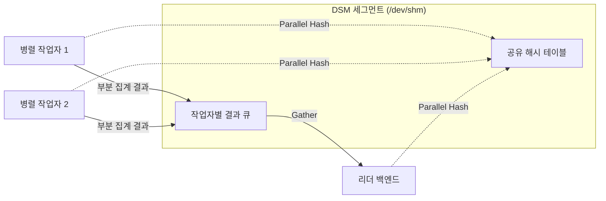

# Docker의 PostgreSQL 병렬 쿼리가 디스크가 남아도 No space left on device로 실패하는 이유

Docker 컨테이너에서 돌리는 PostgreSQL이 무거운 집계 쿼리에서 `No space left on device`로 실패하는데 디스크는 넉넉하게 남아 있다면, 부족한 것은 디스크가 아니라 컨테이너의 `/dev/shm`이다.
PostgreSQL의 병렬 쿼리는 작업자 프로세스끼리 데이터를 주고받을 때 동적 공유 메모리를 쓰고, Linux에서는 이 메모리를 `/dev/shm` tmpfs에 만든다.
Docker는 컨테이너의 `/dev/shm`을 기본 64MB로 잡기 때문에 병렬 해시 조인 몇 개만 겹쳐도 이 공간이 가득 찬다.

이 글은 실제로 겪은 사례를 출발점으로 병렬 쿼리의 구조, 공유 메모리와 `/dev/shm`의 관계, 확인 명령과 대안을 정리한다.

## 적용 버전과 근거의 구분

| 대상 | 버전 |
| --- | --- |
| PostgreSQL | 17 (`postgres:17-alpine` 이미지) |
| Docker | Docker Engine과 Docker Compose (Compose Specification의 `shm_size`) |
| 운영체제 | Linux. macOS와 Windows의 PostgreSQL은 기본 공유 메모리 구현이 다르다 |

본문에서는 근거의 종류를 다음처럼 구분한다.

- **출처**: PostgreSQL 17 공식 문서, PostgreSQL 소스 코드(`REL_17_STABLE`), Docker와 Kubernetes 공식 문서, Linux 커널 문서에서 확인한 사실이다.
- **확인**: 사례 환경에서 명령을 실행해 직접 확인한 결과다.
- **추론**: 위 두 가지를 근거로 추정한 내용이다. 문장에 추론이라고 밝힌다.

## 사례

### 증상

2코어, RAM 3.9GB인 VM 한 대에 `postgres:17-alpine` 컨테이너를 띄워 쓰고 있었다.
최근 7일치 측정 데이터 약 567만 행을 가구와 사용자별로 묶는 집계 쿼리와 가구별 기준선(평균과 분포)을 계산하는 쿼리가 다음 오류로 실패했다.

```text
ERROR:  could not resize shared memory segment "/PostgreSQL.xxxx" to 2097152 bytes: No space left on device
```

호스트 디스크는 73GB가 남아 있었다.

### 환경

| 항목 | 값 |
| --- | --- |
| VM | 2코어, RAM 3.9GB |
| 큰 테이블 1 | 약 670만 행, 8GB. JSONB 문서를 포함한 넓은 행 |
| 큰 테이블 2 | 약 1500만 행, 7.4GB |
| `/dev/shm` | 64MB. Docker 기본값 |
| `shared_buffers` | 128MB. 기본값 |
| `work_mem` | 4MB. 기본값 |
| `max_parallel_workers_per_gather` | 2. 기본값 |

실행 계획에는 `Gather`, `Parallel Seq Scan`, `Parallel Hash` 같은 병렬 노드가 있었다.

### 조치와 결과

Compose 파일에 `shm_size: 512m`을 추가하고 데이터 볼륨을 유지한 채 컨테이너를 다시 만들었다.
컨테이너 안에서 `df -h /dev/shm`이 512M로 바뀐 것을 확인했고, 같은 쿼리에서 오류가 다시 나지 않았다(확인).

오류는 사라졌지만 일부 조회는 여전히 100초 이상 걸렸다.
이 부분은 아래 「오류를 없앤 뒤에도 느린 이유」에서 따로 다룬다.

## PostgreSQL 병렬 쿼리의 구조

### 리더와 작업자

PostgreSQL은 연결 하나를 백엔드 프로세스 하나가 처리한다.
병렬 쿼리에서는 이 백엔드가 **리더**(leader)가 되고, 실행 중에 `Gather` 노드에 도달하면 계획된 수만큼 **병렬 작업자**(parallel worker) 프로세스를 띄워 달라고 요청한다(출처: How Parallel Query Works).

- 작업자는 `Gather` 아래의 병렬 부분을 실행한다.
- 리더도 병렬 부분을 함께 실행하지만, 작업자가 만든 행을 모두 읽어 들이는 일이 추가로 있다.
- 작업자가 내보내는 행이 많으면 리더는 그 행을 받는 데 대부분의 시간을 쓴다.
- 작업자를 띄울 여유가 없으면 계획보다 적은 작업자로, 또는 작업자 없이 실행된다.

작업자 수는 세 설정이 함께 제한한다(출처: runtime-config-resource).

| 설정 | 기본값 | 범위 |
| --- | --- | --- |
| `max_parallel_workers_per_gather` | 2 | `Gather` 노드 하나가 띄우는 작업자 수. 0이면 병렬 쿼리를 끈다 |
| `max_parallel_workers` | 8 | 클러스터 전체의 병렬 작업자 수 |
| `max_worker_processes` | 8 | 클러스터 전체의 백그라운드 프로세스 수 |

Java 백엔드에 빗대면 리더는 `ForkJoinPool`에 작업을 나눠 맡기고 결과를 모으는 호출 스레드에 가깝다.
다른 점은 작업자가 스레드가 아니라 별도 프로세스라는 것이다.
프로세스는 힙을 공유하지 않으므로 서로 데이터를 넘기려면 운영체제의 공유 메모리가 필요하다.

### 병렬 노드가 하는 일

| 노드 | 하는 일 (출처: Parallel Plans) |
| --- | --- |
| `Parallel Seq Scan` | 테이블 블록을 범위로 나눠 참여 프로세스가 나눠 읽는다 |
| `Partial Aggregate` / `Finalize Aggregate` | 각 프로세스가 부분 집계를 만들고, 리더가 `Gather`로 받아 최종 집계한다 |
| `Parallel Hash` | 참여 프로세스가 해시 테이블 하나를 나눠 만든다. 병렬이 아닌 해시 조인은 프로세스마다 같은 해시 테이블을 따로 만든다 |
| `Gather` / `Gather Merge` | 작업자의 결과 행을 리더로 모은다. `Gather Merge`는 정렬 순서를 유지한다 |



## 동적 공유 메모리와 /dev/shm

### 병렬 쿼리마다 DSM 세그먼트를 만든다

PostgreSQL 소스의 `README.parallel`에 따르면 병렬 작업을 시작하는 백엔드는 먼저 그 작업 동안 유지되는 **동적 공유 메모리**(dynamic shared memory, DSM) 세그먼트를 만든다(출처).
이 세그먼트에는 작업자의 오류 메시지를 리더로 보내는 큐, 리더의 상태를 직렬화한 값, 실행기가 추가로 필요한 자료구조가 들어간다.

실행기가 추가로 넣는 것 중 크기에 영향을 주는 것은 두 가지다(출처: PostgreSQL 소스).

- **결과 행 큐**: `execParallel.c`는 작업자마다 `PARALLEL_TUPLE_QUEUE_SIZE`(65536바이트) 크기의 큐를 DSM 안에 잡는다. 작업자 2개면 128KB 정도라 작다.
- **Parallel Hash의 공유 해시 테이블**: `nodeHash.c`는 병렬 해시의 배치 구조를 DSA(DSM 위에 만든 할당 영역)에서 할당한다. 해시 테이블 크기는 아래에서 다룬다.

DSA는 필요할 때마다 DSM 세그먼트를 추가로 만들어 늘어난다.
`dsa.c` 기준으로 첫 세그먼트는 1MB이고, 같은 크기를 두 번 만든 뒤 다음 세그먼트 크기를 두 배로 키운다(출처).
사례의 오류 메시지에 나온 `2097152 bytes`(2MB)는 이렇게 늘어나는 세그먼트 하나를 만들려던 요청이다.
요청 크기 자체는 작으므로, 이미 다른 세그먼트가 `/dev/shm`을 거의 채운 상태에서 마지막 2MB가 들어갈 자리가 없었다고 보는 것이 맞다(추론).

### Linux 기본값 posix는 /dev/shm을 쓴다

DSM을 어디에 만들지는 `dynamic_shared_memory_type`이 정한다(출처: runtime-config-resource).

| 값 | 방식 |
| --- | --- |
| `posix` | `shm_open`으로 POSIX 공유 메모리를 만든다. `/dev/shm`이나 tmpfs를 지원하는 Linux의 기본값이다 |
| `sysv` | System V 공유 메모리를 쓴다 |
| `windows` | Windows 공유 메모리를 쓴다 |
| `mmap` | 데이터 디렉터리의 파일을 메모리에 매핑해 공유 메모리를 흉내 낸다 |

이 설정은 서버를 시작할 때만 바꿀 수 있다.

Linux에서 `shm_open`이 만든 객체는 `/dev/shm` 아래의 tmpfs 파일이다.
세그먼트 이름이 `/PostgreSQL.xxxx` 형태인 것도 이 때문이다.

### 디스크가 남아도 No space left on device인 이유

tmpfs는 파일을 디스크가 아니라 커널의 메모리 캐시에 둔다(출처: Linux tmpfs 문서).
tmpfs 마운트마다 크기 상한이 있고, 파일 합계가 이 상한을 넘으면 쓰기가 `ENOSPC`로 실패한다.
`ENOSPC`의 오류 문자열이 `No space left on device`라서 디스크 부족처럼 보일 뿐이다.

PostgreSQL은 이 상황을 일부러 일찍 드러낸다.
`dsm_impl.c`의 주석에 따르면 Linux에서 세그먼트 크기를 `ftruncate`로만 늘리면 파일에 구멍이 생기고, 나중에 그 구멍을 실제로 쓰는 순간 tmpfs에 공간이 없으면 프로세스가 `SIGBUS`로 죽는다(출처).
그래서 `posix_fallocate`로 페이지를 미리 할당해 공간이 없으면 그 자리에서 `ENOSPC`로 실패하게 한다.
사례의 `could not resize shared memory segment ... No space left on device`가 바로 이 경로에서 나온 오류다.

이 동작 덕분에 서버 프로세스가 죽는 대신 해당 쿼리 하나만 오류로 끝난다.

### Docker의 /dev/shm은 기본 64MB다

Docker Engine API 문서는 `HostConfig.ShmSize`를 「`/dev/shm`의 바이트 크기이며, 생략하면 64MB를 쓴다」고 설명한다(출처).
`docker run --shm-size`와 Compose의 `shm_size`가 이 값을 정한다.
값은 컨테이너를 만들 때 정해지므로 바꾸려면 컨테이너를 다시 만들어야 한다.

PostgreSQL 공식 Docker 이미지의 Docker Hub 설명도 Compose 예시에 `shm_size: 128mb`를 넣어 두었다(출처).
기본 64MB를 그대로 두면 부족할 수 있다는 뜻으로 읽힌다(추론).

### /dev/shm 크기는 상한이지 미리 잡는 메모리가 아니다

tmpfs는 담긴 파일 크기에 맞춰 늘고 준다(출처: Linux tmpfs 문서).
`shm_size: 512m`으로 설정해도 컨테이너를 띄우자마자 512MB를 쓰지 않는다.
병렬 쿼리가 세그먼트를 만들 때 그만큼 메모리를 쓰고, 쿼리가 끝나 세그먼트를 지우면 돌려준다.

다만 쓰는 동안에는 실제 RAM이다.
cgroup v2의 `memory.stat`은 tmpfs와 공유 메모리 세그먼트를 `shmem` 항목으로 계산하므로, 컨테이너에 메모리 제한이 있으면 `/dev/shm` 사용량도 그 제한에 포함된다(출처: Linux cgroup v2 문서).
`/dev/shm`을 크게 잡은 상태에서 병렬 쿼리가 몰리면 디스크 오류 대신 메모리 부족이나 OOM으로 문제가 옮겨 갈 수 있다(추론).

## 필요한 크기 어림하기

### Parallel Hash가 쓸 수 있는 메모리

해시 연산의 메모리 한도는 `work_mem × hash_mem_multiplier`다(출처: runtime-config-resource).
`hash_mem_multiplier` 기본값은 2.0이라 `work_mem` 4MB에서 해시 테이블 하나는 8MB까지 쓴다.

`nodeHash.c`의 `ExecChooseHashTableSize`는 Parallel Hash에서 이 한도에 `(병렬 작업자 수 + 1)`을 곱한다(출처).
주석은 「모든 작업자의 hash_mem을 합쳐 써서 배치로 나누지 않으려 한다」고 설명한다.
기본 설정에서 Parallel Hash 노드 하나의 한도는 다음과 같다.

```text
work_mem 4MB × hash_mem_multiplier 2.0 × (작업자 2 + 리더 1) = 24MB
```

### 동시에 겹치는 양

`/dev/shm` 사용량은 다음 곱으로 어림한다(추론).

```text
동시에 도는 병렬 쿼리 수
  × 쿼리 하나의 Parallel Hash 노드 수
  × Parallel Hash 노드 하나의 한도 (work_mem × hash_mem_multiplier × (작업자 수 + 1))
+ 쿼리마다 결과 행 큐와 상태 (작업자당 64KB 남짓)
```

사례에 대입하면 Parallel Hash 노드가 둘인 쿼리 하나가 48MB 정도를 쓸 수 있다.
같은 쿼리가 두 개 겹치거나 화면이 집계 쿼리 여러 개를 함께 호출하면 64MB를 넘는다(추론).
DSA가 세그먼트를 두 배씩 키우므로 실제 사용량은 한도보다 조금 더 커질 수 있다.

이 값은 정확한 상한이 아니라 어림값이다.
데이터 분포가 한쪽으로 쏠리면 해시 테이블이 한도를 넘을 수 있으므로 여유를 두고 잡는다.

### RAM 여유와 함께 정한다

`/dev/shm` 크기는 RAM 안에서 다른 용도와 나눠 쓴다.

| 용도 | 사례 환경 |
| --- | --- |
| `shared_buffers` | 128MB |
| 연결마다 정렬과 해시에 쓰는 `work_mem` | 연결 수와 노드 수에 비례 |
| `/dev/shm` 안의 DSM | 병렬 쿼리를 실행하는 동안만 사용 |
| 운영체제 페이지 캐시 | 남는 메모리 전부. PostgreSQL 데이터 읽기 속도를 좌우한다 |

사례에서 512MB를 고른 것은 위 어림값(동시 2~3개 쿼리)에 여유를 두고, 3.9GB RAM 중 페이지 캐시에 쓸 몫을 크게 줄이지 않는 선이기 때문이다.
`/dev/shm`이 512MB까지 차는 순간에는 그만큼 페이지 캐시가 줄어든다.

## 확인 명령

### 컨테이너의 /dev/shm 크기와 사용량

```bash
docker exec <컨테이너> df -h /dev/shm
```

`Size`가 64M이면 Docker 기본값이다.
병렬 쿼리를 실행하는 동안 같은 명령을 다시 실행하면 `Used`가 늘어나는 것을 볼 수 있다.

```bash
docker exec <컨테이너> ls -l /dev/shm
```

`PostgreSQL.<숫자>` 파일이 DSM 세그먼트다.

### 컨테이너를 만들 때 정한 값

```bash
docker inspect -f '{{.HostConfig.ShmSize}}' <컨테이너>
```

바이트 단위로 나온다. `67108864`가 64MB다.

### PostgreSQL 설정

```sql
SHOW dynamic_shared_memory_type;
SHOW max_parallel_workers_per_gather;
SHOW work_mem;
SHOW hash_mem_multiplier;
SHOW min_dynamic_shared_memory;
```

### 실행 계획의 병렬 노드

```sql
EXPLAIN (ANALYZE, BUFFERS)
SELECT ... ;
```

실행 계획에서 다음을 본다.

- `Gather` 또는 `Gather Merge`가 있으면 병렬 실행 계획이다.
- `Workers Planned`와 `Workers Launched`가 다르면 작업자를 계획만큼 띄우지 못한 것이다.
- `Parallel Hash`가 몇 개인지 세면 위 어림 계산의 노드 수가 된다.
- `Parallel Hash` 아래의 `Batches`가 1보다 크면 해시 테이블이 한도를 넘어 디스크 임시 파일로 나눠 처리한 것이다.

`EXPLAIN ANALYZE`는 쿼리를 실제로 실행하므로 오류가 나는 쿼리는 `EXPLAIN`만으로 계획을 먼저 본다.

## 대안 비교

| 대안 | 속도 | 메모리 | 배포 영향 |
| --- | --- | --- | --- |
| `shm_size` 늘리기 | 병렬 실행을 유지한다 | 쓰는 동안 RAM을 그만큼 쓴다 | 컨테이너를 다시 만들어야 한다. 볼륨은 유지된다 |
| `max_parallel_workers_per_gather = 0` | 큰 스캔과 집계가 느려질 수 있다 | DSM을 쓰지 않는다 | 설정 다시 읽기나 세션 단위로 바로 적용된다 |
| `min_dynamic_shared_memory` | 병렬 실행을 유지한다 | 서버 시작 때 미리 잡아 두고 계속 쓴다 | 서버 재시작이 필요하다 |
| `dynamic_shared_memory_type = mmap` | 디스크 쓰기가 늘 수 있다 | `/dev/shm` 대신 데이터 디렉터리를 쓴다 | 서버 재시작이 필요하다. 공식 문서가 권장하지 않는다 |
| Kubernetes `emptyDir` `medium: Memory` | 병렬 실행을 유지한다 | Pod 메모리 제한에 포함된다 | Pod 사양을 바꿔 다시 배포한다 |

### shm_size 늘리기

가장 직접적인 방법이다.

```yaml
services:
  db:
    image: postgres:17-alpine
    shm_size: 512m
    volumes:
      - pgdata:/var/lib/postgresql/data

volumes:
  pgdata:
```

```bash
docker compose up -d --force-recreate db
docker exec <컨테이너> df -h /dev/shm
```

이름 있는 볼륨에 데이터가 있으면 컨테이너를 다시 만들어도 데이터는 남는다.
다시 만드는 동안 연결이 끊기므로 운영 중이라면 점검 시간에 한다.

`docker run`으로 띄운다면 `--shm-size=512m`을 준다.

### 병렬 쿼리 끄기

`max_parallel_workers_per_gather = 0`이면 `Gather`를 만들지 않으므로 DSM도 쓰지 않는다(출처: runtime-config-resource).
`/dev/shm`을 바꿀 수 없는 환경에서 오류를 바로 멈추는 방법이다.

```sql
-- 문제 쿼리를 실행하는 세션에서만
SET max_parallel_workers_per_gather = 0;
```

대가는 속도다.
큰 테이블을 순차 스캔하는 집계는 프로세스 하나가 모든 블록을 읽게 된다.
다만 사례처럼 2코어 VM이면 리더와 작업자 2개가 코어 2개를 나눠 쓰므로 병렬로 얻는 이득이 원래 크지 않다(추론).
코어 수가 적은 환경에서는 병렬을 끄거나 작업자 수를 1로 줄여 측정해 볼 만하다.

### min_dynamic_shared_memory로 미리 잡아 두기

`min_dynamic_shared_memory`는 서버 시작 때 병렬 쿼리용 메모리를 미리 할당한다(출처: runtime-config-resource).
이 영역이 부족하거나 동시 쿼리가 다 쓰면 그때부터 `dynamic_shared_memory_type` 방식으로 운영체제에서 추가 공간을 받는다.
미리 잡는 영역은 `shared_buffers`와 같은 주 공유 메모리에 포함된다.
주 공유 메모리의 구현은 `shared_memory_type`이 정하고, Linux 기본값 `mmap`은 `/dev/shm`이 아니라 익명 공유 메모리를 쓴다(출처: runtime-config-resource).

정리하면 `/dev/shm` 크기를 바꾸지 못할 때 병렬 쿼리용 공간을 따로 확보하는 방법이다.
대신 쓰지 않을 때도 그 메모리를 계속 차지한다.

### dynamic_shared_memory_type 바꾸기

`mmap`은 데이터 디렉터리의 `pg_dynshmem` 아래에 파일을 만들어 공유 메모리처럼 쓴다(출처: runtime-config-resource).
`/dev/shm` 크기와 무관해지지만 공식 문서는 운영체제가 바뀐 페이지를 디스크에 반복해서 쓸 수 있어 I/O 부하가 늘어나므로 일반적으로 권장하지 않는다.
문서가 쓸 만하다고 꼽는 경우는 디버깅할 때, `pg_dynshmem`이 RAM 디스크에 있을 때, 다른 공유 메모리 방식을 쓸 수 없을 때다.

`sysv`는 System V 공유 메모리를 써서 `/dev/shm` 마운트 크기의 영향을 받지 않는다.
대신 커널의 System V IPC 한도(`kernel.shmmax`, `kernel.shmall`)를 받는다(추론).
`shm_size`를 바꿀 수 있다면 굳이 구현을 바꿀 이유는 적다.

### Kubernetes

Kubernetes Pod의 컨테이너도 따로 정하지 않으면 컨테이너 런타임 기본값에 따라 `/dev/shm`이 64MB로 잡히는 경우가 많다(추론).
`emptyDir`에 `medium: Memory`를 주면 tmpfs가 마운트되고, 이를 `/dev/shm`에 붙이면 크기를 키울 수 있다.

```yaml
spec:
  containers:
    - name: postgres
      image: postgres:17-alpine
      volumeMounts:
        - name: dshm
          mountPath: /dev/shm
  volumes:
    - name: dshm
      emptyDir:
        medium: Memory
        sizeLimit: 512Mi
```

Kubernetes 문서는 tmpfs에 쓴 파일이 쓴 컨테이너의 메모리 제한에 포함된다고 밝힌다(출처).
`resources.limits.memory`를 정할 때 `/dev/shm`에 쓸 몫을 더해야 OOMKilled를 피한다.

## 오류를 없앤 뒤에도 느린 이유

`shm_size`는 병렬 쿼리가 실패하지 않게 할 뿐 쿼리를 빠르게 하지는 않는다.
사례에서 일부 조회가 여전히 100초 이상 걸린 이유는 다음과 같다(추론).

- **데이터가 메모리에 들어가지 않는다.** 두 테이블을 합치면 15GB가 넘는데 RAM은 3.9GB다. `shared_buffers` 128MB와 페이지 캐시로는 대부분 다시 디스크에서 읽는다.
- **행이 넓다.** JSONB 문서를 포함한 행이라 집계에 필요한 열이 몇 개뿐이어도 블록을 통째로 읽는다.
- **코어가 2개다.** 병렬 작업자를 늘려도 CPU가 함께 늘지 않는다.

다음 단계는 두 갈래다.

1. 메모리 설정을 환경에 맞춘다. `shared_buffers`, `effective_cache_size`, `work_mem`을 RAM 크기에 맞춰 조정하고 `EXPLAIN (ANALYZE, BUFFERS)`의 `shared read`와 `Batches`로 효과를 측정한다.
2. 매번 원본을 스캔하지 않는다. 가구와 일자별 집계 결과를 미리 쌓아 두는 테이블을 만들어 조회는 그 테이블을 읽게 한다.

`shared_buffers`를 키울 때는 `shm_size`를 함께 키울 필요가 없다.
주 공유 메모리는 `shared_memory_type` 기본값 `mmap`에 따라 `/dev/shm`이 아닌 익명 공유 메모리에 만들어지기 때문이다.
다만 둘 다 같은 RAM을 쓰므로 합계가 컨테이너 메모리 제한과 페이지 캐시 몫을 넘지 않게 정한다.

## 정리

| 질문 | 답 |
| --- | --- |
| 디스크가 남는데 왜 `No space left on device`인가 | 병렬 쿼리의 DSM이 tmpfs인 `/dev/shm`에 만들어지고, 그 tmpfs가 가득 찼기 때문이다 |
| 왜 Docker에서 자주 나는가 | Docker가 컨테이너 `/dev/shm`을 기본 64MB로 잡기 때문이다 |
| 얼마나 늘리나 | 동시 병렬 쿼리 수, Parallel Hash 노드 수, 노드당 한도를 곱한 값에 여유를 두되 RAM 여유 안에서 정한다 |
| 늘리면 메모리를 미리 잡나 | 아니다. 쓰는 동안만 RAM을 쓰지만 그동안은 메모리 제한에 포함된다 |
| 늘리면 빨라지나 | 아니다. 실패를 막을 뿐이고 속도는 메모리 설정과 데이터 구조가 정한다 |

## 참고 자료

- [PostgreSQL 17: Resource Consumption](https://www.postgresql.org/docs/17/runtime-config-resource.html) — `dynamic_shared_memory_type`, `min_dynamic_shared_memory`, `work_mem`, `hash_mem_multiplier`, 병렬 작업자 설정
- [PostgreSQL 17: How Parallel Query Works](https://www.postgresql.org/docs/17/how-parallel-query-works.html)
- [PostgreSQL 17: Parallel Plans](https://www.postgresql.org/docs/17/parallel-plans.html)
- [PostgreSQL 소스: README.parallel](https://github.com/postgres/postgres/blob/REL_17_STABLE/src/backend/access/transam/README.parallel)
- [PostgreSQL 소스: dsm_impl.c](https://github.com/postgres/postgres/blob/REL_17_STABLE/src/backend/storage/ipc/dsm_impl.c) — `posix_fallocate`로 `ENOSPC`를 일찍 드러내는 이유
- [PostgreSQL 소스: nodeHash.c](https://github.com/postgres/postgres/blob/REL_17_STABLE/src/backend/executor/nodeHash.c) — Parallel Hash의 메모리 한도
- [Docker Engine API](https://docs.docker.com/reference/api/engine/) — `HostConfig.ShmSize` 기본 64MB
- [Compose Specification: shm_size](https://docs.docker.com/reference/compose-file/services/#shm_size)
- [Docker Hub: postgres](https://hub.docker.com/_/postgres)
- [Linux: Tmpfs](https://docs.kernel.org/filesystems/tmpfs.html)
- [Linux: Control Group v2](https://docs.kernel.org/admin-guide/cgroup-v2.html) — `memory.stat`의 `shmem`
- [Kubernetes: Volumes, emptyDir](https://kubernetes.io/docs/concepts/storage/volumes/#emptydir)

## 관련 문서

- [Kubernetes GPU 노드에서 /run tmpfs가 꽉 차서 Pod가 안 뜰 때](../../mlops/gpu-node-run-tmpfs-full.md)

같은 `No space left on device`가 tmpfs 포화에서 나온 다른 사례다.
