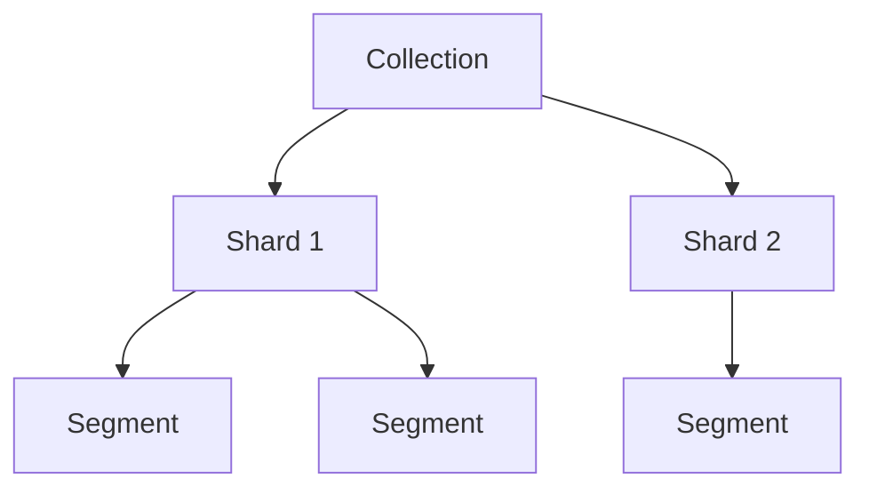

# Qdrant 벡터 데이터베이스 입문 — "컴포넌트가 단순하다"는 게 정확히 뭔가

[벡터 DB 어떻게 고를까](../vectordb-comparison.md)에서 "가장 가볍게 운영하고 싶다 → Qdrant. 컴포넌트가 단순하다"라고만 짧게 썼었다. 정확히 뭐가 단순한지, Milvus 대비 무엇이 빠지는지 근거 없이는 판단할 수 없다는 피드백을 받고 다시 파봤다.

결론부터 말하면, Qdrant는 Milvus 가 별도 프로세스로 떼어낸 역할들을 전부 하나의 Rust 바이너리 안으로 흡수했다. "단순하다"는 컴포넌트 개수의 차이다.

## 단일 바이너리 — Milvus 의 역할을 어떻게 흡수했나

Milvus 는 [storage 와 compute 를 분리](../milvus/milvus-architecture-and-performance.md#아키텍처--storage-와-compute-를-분리한다)하면서 메타데이터·메시지 큐·오브젝트 스토리지를 각각 별도 시스템에 맡겼다. Qdrant 는 이 세 가지를 전부 자기 프로세스 안에서 처리한다.

| 역할 | Milvus | Qdrant |
| --- | --- | --- |
| 메타데이터 합의 | 별도 etcd 클러스터 | 내장 Raft |
| 메시지 큐 | 별도 Pulsar/Kafka | 로컬 디스크 WAL |
| 오브젝트 스토리지 | 별도 MinIO/S3 | 로컬 디스크 (mmap 직접 저장) |
| 노드 역할 분리 | Proxy·Query Node·Data Node·Index Node 등 4~5종 | 없음 — 한 바이너리가 전 역할 수행 |
| 저장 엔진 | 외부 라이브러리 조합 | 자체 구현(Gridstore, 아래 설명) |

그래서 실행이 정말로 한 줄이다.

```bash
docker run -p 6333:6333 -p 6334:6334 \
  -v "$(pwd)/qdrant_storage:/qdrant/storage:z" \
  qdrant/qdrant
```

Milvus 는 이 한 줄에 대응하는 게 없다 — Standalone 모드로 줄여도 etcd·MinIO 컨테이너가 내부적으로 같이 뜬다.

## 저장 구조 — collection → shard → segment

Qdrant 의 저장 단위는 3계층이다.



segment 가 실제 데이터 단위다 — 벡터·payload(메타데이터)·인덱스·ID 매퍼를 독립적으로 가진다. 하나의 shard 안에 segment 를 여러 개 두는 이유는 두 가지다.

- **병렬 최적화** — segment 별로 병렬 검색이 가능하다.
- **무중단 인덱스 재구성** — 큰 segment 하나를 재구축하는 대신 작은 단위로 나눠 순차적으로 최적화한다.

저장 엔진 자체는 v1.17 에서 RocksDB 를 완전히 걷어내고 자체 개발한 **Gridstore** 로 교체했다([Qdrant Blog — Gridstore](https://qdrant.tech/articles/gridstore-key-value-storage/)). Milvus 가 외부 C++ 라이브러리(Knowhere 등)를 조합하는 방식과 달리, Qdrant 는 저장 엔진까지 자체 Rust 구현으로 통일했다 — 이것도 "컴포넌트가 단순하다"의 한 축이다.

## HNSW 구현 — payload 필터와 결합된 그래프

Qdrant 의 HNSW 도 외부 라이브러리(hnswlib, FAISS 등) 없이 자체 Rust 구현이다. 특이한 점은 **filterable HNSW** 방식이다 — payload(메타데이터) 인덱스로 필터링 가능한 노드끼리 추가 간선을 더 붙여, "메타데이터 필터 + 벡터 검색"을 동시에 걸었을 때 그래프 탐색이 필터 조건에 안 걸리는 노드로 자꾸 새는 것을 줄인다([Qdrant Docs — Indexing](https://qdrant.tech/documentation/concepts/indexing/)).

[벡터 DB 어떻게 고를까](../vectordb-comparison.md)의 메타데이터 필터링 비교에서 Qdrant 가 "표현력 최강"으로 표시된 이유가 여기 있다 — 필터를 인덱스 구조 자체에 반영하는 제품이 흔치 않다.

## 온디스크(mmap) — quantization 과 함께 쓸 때

mmap 기반 온디스크 저장 원리는 [벡터 DB 어떻게 고를까 — mmap 설명](../vectordb-comparison.md)에서 이미 다뤘다 — OS 페이지 캐시에 로딩을 위임하는 방식이다. quantization(스칼라/제품/바이너리)과 함께 쓰면, 압축된 코드는 따로 관리하고 원본 정밀도 벡터는 디스크에 둔다. 검색은 압축 코드로 빠르게 후보를 추린 뒤 필요한 경우에만 원본 벡터를 디스크에서 읽어 재계산하는 방식이다.

`on_disk_payload` 옵션은 payload(메타데이터 값) 를 RAM 에 올릴지 디스크에서 직접 읽을지를 결정하는데, 이미 인덱싱된 필드 값은 이 옵션과 무관하게 RAM 에 남는다 — 필터링 성능을 지키기 위한 설계다.

## 분산·복제 — Raft 는 메타데이터에만, resharding 은 예외

클러스터를 구성하면 Raft 합의로 컬렉션 스키마 같은 메타데이터를 관리한다. 포인트(벡터) 읽기/쓰기 자체는 합의 계층을 거치지 않는다 — 그래서 데이터 경로에 Raft 오버헤드가 끼지 않는다. 데이터 복제는 shard 복제로 별도 처리한다.

**여기서 "단순하다"는 주장에 예외가 하나 있다.** 오픈소스 self-host 버전은 `shard_number`를 생성 후 바꿀 수 없고, 리밸런싱도 수동 API 호출로 해야 한다. 무중단 Resharding(v1.13)과 자동 리밸런싱은 **Qdrant Cloud 전용**이라고 공식 문서가 명시한다([distributed_deployment](https://qdrant.tech/documentation/distributed_deployment/), [cluster-scaling](https://qdrant.tech/documentation/cloud/cluster-scaling/)). self-host 로 Qdrant 를 고른다면, 나중에 샤드 수를 늘릴 가능성까지 미리 감안해 초기 `shard_number` 를 정해야 한다.

## 설치·운영 — 실제로 얼마나 가벼운가

단일 노드는 위에서 본 것처럼 Docker 한 줄이다. 메모리는 다음 공식으로 추정한다([Capacity Planning](https://qdrant.tech/documentation/capacity-planning/)).

```
필요 메모리 ≈ 벡터 수 × 차원 × 4byte × 1.5
```

1.5 배수는 HNSW 그래프·인덱스 오버헤드를 감안한 여유분이다. [벡터 DB 어떻게 고를까 — 왜 메모리를 이렇게 많이 쓰는가](../vectordb-comparison.md)에서 다룬 것과 같은 이유(row 자체가 크고, 그래프 탐색이 무작위 접근)로 이 여유분이 필요하다.

클러스터 구성 시 최소 노드 수·로드밸런서 요구사항은 공식 문서에서 명확한 수치를 확인하지 못했다 — **확인 필요**로 남겨둔다.

## 정리

- "컴포넌트가 단순하다"는 정확히는 **etcd·메시지 큐·오브젝트 스토리지·노드 역할 분리 4가지가 전부 하나의 바이너리 안에 흡수됐다**는 뜻이다.
- 저장 엔진(Gridstore)·HNSW 구현 모두 외부 라이브러리 의존 없이 자체 Rust 코드다 — 이것도 운영 표면을 줄이는 요인이다.
- 단, self-host 오픈소스는 리밸런싱·리샤딩이 수동이고 샤드 수가 고정이다. "완전한 자동 확장"은 Qdrant Cloud 전용 기능이다 — 단순함과 완전한 운영 자동화는 다른 이야기다.

## 참고 링크

- [Qdrant GitHub](https://github.com/qdrant/qdrant)
- [Qdrant Docs — Distributed Deployment](https://qdrant.tech/documentation/distributed_deployment/)
- [Qdrant Docs — Indexing](https://qdrant.tech/documentation/concepts/indexing/)
- [Qdrant Docs — Storage](https://qdrant.tech/documentation/concepts/storage/)
- [Qdrant Docs — Capacity Planning](https://qdrant.tech/documentation/capacity-planning/)
- [Qdrant Blog — Gridstore](https://qdrant.tech/articles/gridstore-key-value-storage/)
- [Qdrant Cloud — Cluster Scaling](https://qdrant.tech/documentation/cloud/cluster-scaling/)
