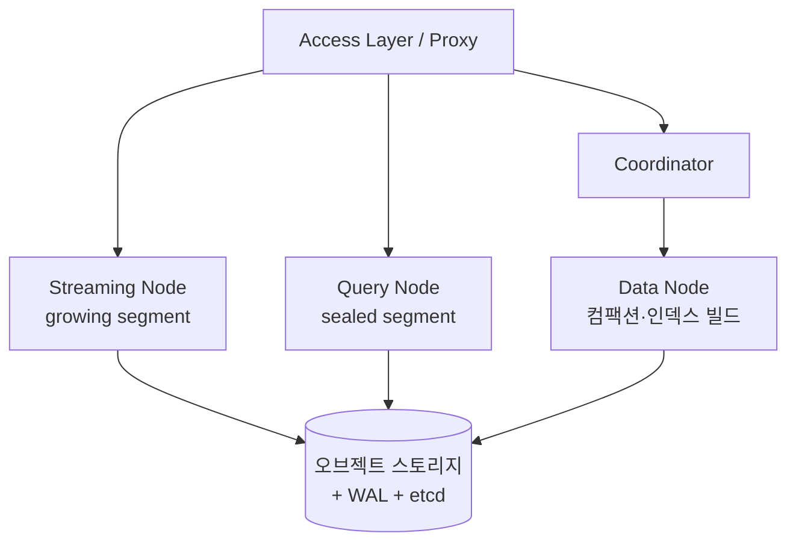

# 벡터 DB 5종은 안이 어떻게 다른가 — 아키텍처 심층 비교

벡터 DB 후보들을 비교하다 보면 표면 기능은 다 비슷해 보인다.
다섯 제품 모두 HNSW 로 ANN 검색을 제공하고, 다 메타데이터 필터링을 한다.
그런데 막상 운영에 올리면 메모리가 터지는 지점, 노드를 늘리는 방식, 인덱스를 굳히는 시점이 제품마다 전혀 다르다.
그 차이가 어디서 오는지 궁금해서 OpenSearch · Milvus · Qdrant · Vespa · pgvector 다섯 제품의 내부 구조를 같은 축으로 뜯어봤다.

한 줄 결론은 이렇다.
같은 ANN 검색을 제공해도 내부 구조 — 저장과 연산을 분리하는가, 노드를 역할별로 쪼개는가, 인덱스 선택지가 얼마나 넓은가 — 가 운영·확장·기능의 한계를 미리 정해 버린다.
구조가 곧 trade-off다.

이 글은 "안이 왜 그렇게 다른가"만 깊게 판다.
"규모·하이브리드·운영 조건에 따라 무엇을 고를까" 하는 선택 기준은 짝꿍 글인 [벡터 DB 어떻게 고를까 — OpenSearch · Milvus · Qdrant · Vespa 비교](./vectordb-comparison.md)에 정리해 뒀다.
여기서는 그 선택을 가르는 구조적 이유에 집중한다.

이 글에서 가져갈 것:

- 다섯 제품이 출발점부터 어떻게 갈렸는지
- 저장-연산 분리가 왜 확장 자유도를 가르는지
- HNSW 라는 공통분모 위에서 인덱스 선택지가 어디까지 벌어지는지
- 필터링·하이브리드 같은 검색 기능이 구조와 어떻게 묶여 있는지

> 성능 수치는 단정하지 않는다 — 자체 벤치마크가 아직 진행 중이라, 여기서는 구조에서 나오는 경향만 다룬다.

---

## 출발점이 넷으로 갈린다

먼저 짚을 것은, 이 다섯이 애초에 같은 종류의 물건이 아니라는 점이다.
"벡터 DB" 라는 한 단어로 묶지만 설계 출발점이 네 갈래로 다르고, 이 출발점이 이후 모든 구조 차이의 뿌리다.

| 출발점 | 제품 | 뿌리 |
| --- | --- | --- |
| 범용 검색엔진 + 벡터 플러그인 | OpenSearch | Apache Lucene 위에 k-NN 플러그인 |
| 벡터 전용 설계 | Milvus, Qdrant | 처음부터 벡터를 위해 만든 DB |
| RDB 내장 확장 | pgvector | PostgreSQL 확장(extension) |
| 범용 서빙·검색 엔진 | Vespa | 텐서·벡터를 1급 자료형으로 내장 |

출발점이 다르면 "벡터를 어디에 어떻게 두느냐" 가 다르다.

- OpenSearch 의 벡터는 별도 저장 엔진이 아니라 Lucene segment 안에 얹혀 있다.
  그래서 segment 관리(refresh·merge)라는 Lucene 의 운영 부담을 벡터도 그대로 물려받는다.
- pgvector 의 벡터는 그냥 테이블의 한 컬럼이다.
  `CREATE EXTENSION vector;` 한 줄로 켜고, 일반 컬럼처럼 정의하며, SQL `WHERE` 와 `ORDER BY` 로 검색한다.
  PostgreSQL 의 트랜잭션·JOIN·운영 체계를 그대로 쓰는 대신, PostgreSQL 의 한계(단일 쓰기 노드)도 그대로 물려받는다.
- Vespa 의 벡터는 텐서의 한 특수 경우다.
  스칼라·벡터·행렬을 임의 차원으로 일반화한 텐서 자료형이 1급이고, 768차원 임베딩은 `tensor<float>(x[768])` 로 표현된다.
- Milvus·Qdrant 만 "벡터가 주인공" 인 설계라, 벡터를 위한 저장·인덱싱·노드 구조를 처음부터 짤 수 있었다.

같은 ANN 검색을 제공해도, 한쪽은 검색엔진의 segment 규칙을 따르고 다른 쪽은 RDB 의 트랜잭션 규칙을 따른다.
이 차이가 아래 모든 축으로 번진다.

---

## 저장과 연산을 분리하는가

내부 구조에서 가장 크게 갈리는 축이 저장(storage)과 연산(compute)의 분리 여부다.
이걸 완전히 분리한 건 다섯 중 Milvus 하나뿐이고, 나머지는 정도가 다른 결합 구조다.

### Milvus — 4계층으로 완전 분리

Milvus 는 컴포넌트를 4계층으로 쪼개 저장과 연산을 떼어 놨다.

| 계층 | 역할 |
| --- | --- |
| Access Layer (Proxy) | 무상태 진입점. 요청 검증·라우팅, 결과 병합 |
| Coordinator | 스키마 관리, 타임스탬프 발급, 스케줄링, 일관성 |
| Worker Nodes | 실행기 — Streaming / Query / Data 세 종류 |
| Storage | etcd(메타) + 오브젝트 스토리지(벡터·인덱스) + WAL |

핵심은 Worker 노드를 다시 셋으로 나눈 분업이다.

- **Streaming Node**: 실시간으로 들어온 데이터를 WAL 에 쓰고, 아직 영속화 안 된 최신 데이터(growing segment)를 검색한다.
- **Query Node**: 오브젝트 스토리지에 영속화된 과거 데이터(sealed segment)를 메모리에 올려 검색한다.
- **Data Node**: 컴팩션·인덱스 빌드 같은 무거운 오프라인 처리를 맡는다.

벡터 데이터 본체는 오브젝트 스토리지에 있고, 연산 노드는 그걸 필요할 때 메모리로 끌어다 쓴다.
그래서 "검색 트래픽이 늘면 Query Node 만, 적재가 몰리면 Streaming Node 만, 인덱스 빌드가 밀리면 Data Node 만" 늘릴 수 있다.
저장과 연산이 한 몸이면 불가능한 독립 확장이다.

segment 가 growing(가변, Streaming Node 메모리)과 sealed(불변, 오브젝트 스토리지) 두 상태로 도는 것도 이 분리 덕분이다.
`flush` 로 growing 이 sealed 로 굳고, 검색은 둘을 동시에 뒤져 병합한다.
내구성은 WAL 이 책임지는데, 예전엔 Kafka/Pulsar 메시지 큐가 필요했지만 2.6 의 Woodpecker 는 별도 디스크 없이 오브젝트 스토리지에 직접 쓰는 모드를 지원한다.

이 분리의 대가가 운영 복잡도다.
etcd · 메시지 큐 · 오브젝트 스토리지 · 여러 종류의 노드를 모두 띄우고 관리해야 한다.
자유도를 얻는 대신 손이 많이 가는 구조다.

### 나머지 넷 — 정도가 다른 결합

다른 넷은 저장과 연산이 붙어 있되 결합의 강도가 다르다.

- **OpenSearch**: 분리 없음.
  shard 하나가 곧 완전한 Lucene index 하나이고(1:1), shard 마다 독립된 Lucene 프로세스가 CPU·메모리를 점유한다.
  벡터 인덱스(native memory)가 곧 노드 메모리라, 규모가 커지면 노드 메모리에 직접 압박이 온다.
- **Qdrant**: 부분적.
  노드 종류를 쪼개지 않고 한 바이너리가 저장·인덱싱·검색을 모두 한다.
  메시지 큐·오브젝트 스토리지 의존이 없어 운영이 가볍지만, 연산·저장 자원을 Milvus 처럼 따로 늘리긴 어렵다.
- **Vespa**: 부분적이되 stateless/stateful 로 갈라 놨다.
  무상태 Container cluster(쿼리 진입·결과 병합)와 상태를 가진 Content cluster(저장·복제·매칭·랭킹)가 분리돼 각자 독립 확장한다.
  완전한 저장-연산 분리는 아니지만, 역할별 확장은 가능한 절충이다.
- **pgvector**: 분리 없음.
  PostgreSQL 인스턴스 한 대 안에서 모두 돈다.
  벡터 쿼리가 OLTP 트랜잭션과 CPU·메모리·I/O 를 공유해, 벡터 부하가 급증하면 일반 트랜잭션 응답까지 느려질 수 있다.

이 한 축만으로도 확장 자유도가 결정된다.
저장-연산이 한 몸인 OpenSearch·pgvector 는 결국 노드 한 대를 키우는 수직 확장에 무게가 실리고, 분리된 Milvus 는 병목이 생긴 컴포넌트만 골라 늘린다.

---

## segment 를 굳히는 방식이 다르다

세 제품(OpenSearch·Milvus·Qdrant)은 공통적으로 "가변 영역에 새 데이터를 받고, 백그라운드 작업이 그걸 불변 인덱스로 굳힌다" 는 패턴을 쓴다.
이름과 메커니즘은 제각각이다.

| 제품 | 가변 → 불변 | 굳히는 주체 | 내구성 |
| --- | --- | --- | --- |
| OpenSearch | in-memory 버퍼 → segment | refresh·flush·merge | translog (WAL) |
| Milvus | growing segment → sealed segment | flush·컴팩션(Data Node) | WAL |
| Qdrant | appendable segment → non-appendable segment | optimizer | WAL |

OpenSearch 의 단계가 가장 잘게 나뉜다.

- **refresh**: in-memory 버퍼를 검색 가능한 segment 로 굳힌다(기본 1초마다). 단 `fsync` 는 안 해 내구성은 아직 없다.
- **flush**: Lucene commit 으로 segment 를 디스크에 `fsync` 하고 translog 를 비운다. 여기서 영속화된다.
- **merge**: segment 는 불변이라 작은 게 계속 쌓이는데, merge 가 작은 것들을 큰 segment 로 합친다.

여기서 벡터 운영의 함정이 나온다.
OpenSearch 는 (knn_vector 필드 × Lucene segment) 쌍마다 HNSW 그래프를 따로 만든다.
그래서 segment 가 많을수록 검색 때 뒤질 그래프가 늘어 지연이 커지고, **merge 때마다 벡터 그래프가 통째로 재구축된다.**
대량 적재 후 검색만 할 워크로드라면 `force merge` 로 segment 를 하나로 합쳐 그래프를 한 번만 만들기를 권하는 이유다.

Qdrant 의 optimizer 는 같은 일을 세 갈래로 나눠서 한다.

- **Merge optimizer**: segment 수가 너무 많으면 작은 것들을 합친다(목표 수는 기본적으로 CPU 코어 수).
- **Vacuum optimizer**: 삭제 비율이 높은(기본 20% 초과) segment 를 정리한다.
- **Indexing optimizer**: segment 가 일정 크기(기본 약 20000KB)를 넘으면 HNSW 인덱스를 빌드하고, 그 아래면 인덱스 없이 full-scan 으로 처리한다.

같은 "작은 조각을 큰 조각으로 합친다" 는 문제를, OpenSearch 는 Lucene 의 merge policy 로, Milvus 는 Data Node 의 컴팩션으로, Qdrant 는 optimizer 로 푼다.
구조는 닮았지만 Qdrant·Milvus 는 처음부터 벡터를 염두에 두고 짠 반면, OpenSearch 는 텍스트 segment 규칙에 벡터를 얹은 형태라 그래프 재구축 같은 비용이 따라붙는다.

pgvector·Vespa 는 이 segment 모델을 쓰지 않는다.
pgvector 는 PostgreSQL 테이블·인덱스를 그대로 쓰고, Vespa 는 proton 엔진이 문서를 Ready/Not Ready/Removed sub-database 로 관리한다.

---

## 인덱스를 어디까지 주는가

검색 인덱스는 다섯 제품의 공통분모이자, 동시에 가장 폭이 벌어지는 축이다.
공통분모는 명확하다 — **다섯 모두 HNSW 를 지원한다.**
그래서 HNSW 만 쓸 거라면 인덱스는 선택 기준이 못 된다.
차이는 HNSW 말고 또 무엇을 주느냐, 그리고 그걸로 메모리와 recall 을 어떻게 절충하느냐다.

| 인덱스·기법 | OpenSearch | Milvus | Qdrant | Vespa | pgvector |
| --- | --- | --- | --- | --- | --- |
| HNSW | 지원 | 지원 | 지원 | 지원 | 지원 |
| IVF 계열 | 지원(faiss) | 지원 | 약함 | 일부 | IVFFlat |
| DiskANN(전용 온디스크) | 없음 | 지원 | 없음(mmap 은 됨) | 없음 | 없음 |
| GPU 인덱스 | 없음 | 지원(CAGRA) | 없음 | 없음 | 없음 |
| 양자화 | 지원 | 지원 | 강함(~40x) | 지원 | halfvec·binary |

HNSW 파라미터 자체는 제품을 가로질러 거의 같다 — `m`(노드당 이웃 수, 보통 기본 16), `ef_construction`(빌드 시 후보 수), `ef_search`(검색 시 후보 큐).
recall 을 올리려면 이 값들을 키우고, 그만큼 메모리·빌드 시간·검색 지연을 내준다.
이 절충은 어디서나 똑같다.

벌어지는 건 "메모리에 다 못 올릴 때 어떻게 하느냐" 다.

### 메모리 대 디스크 — 접근법이 갈린다

- **Milvus 의 DiskANN**: Vamana 그래프를 디스크에 두고 PQ(곱 양자화) 코드만 메모리에 유지한다.
  그래프 본체를 디스크로 내리는 정공법이다.
  다만 PQ 코드는 데이터 크기에 대략 비례하므로, 메모리가 "줄어드는" 것이지 "사라지는" 게 아니라는 점은 짚어 둘 만하다.
- **OpenSearch 의 on_disk**(2.17): 접근이 다르다.
  그래프 전체를 디스크로 내리는 게 아니라, binary quantization 으로 압축한 벡터를 메모리에 두고(기본 32x 압축) 원본 full-precision 벡터는 디스크에 둔다.
  압축본으로 후보를 넓게 뽑고, 그 후보만 디스크의 원본으로 다시 정렬(rescore)하는 2단계다.
  "그래프를 내린다" 가 아니라 "양자화로 메모리를 줄인다" 는 쪽이다.
- **Qdrant 의 mmap**: 벡터 파일에 가상 주소 공간을 매핑해 OS 페이지 캐시에 맡긴다.
  RAM 이 충분하면 in-memory 에 가까운 성능을 내면서 메모리를 유연하게 쓴다.
  `memmap_threshold` 를 넘는 segment 는 자동으로 mmap 으로 전환하고, HNSW 그래프 자체도 `on_disk` 로 둘 수 있다.
  DiskANN 같은 전용 디스크 그래프는 아니다.
- **pgvector**: 별도 온디스크 인덱스 개념 없이 PostgreSQL 의 공유 버퍼(버퍼풀)에 의존한다.
  인덱스가 공유 버퍼를 넘으면 p99 지연이 급격히 늘어난다.

### 양자화 — 메모리를 깎는 공통 도구

양자화는 다섯 모두 어느 정도 제공하지만 폭이 다르다.
Qdrant 가 가장 적극적이라 스칼라·곱·이진 세 방식을 다 주고 최대 약 40x 압축을 노린다.

| 방식 | 원리 | 압축 | 정확도 |
| --- | --- | --- | --- |
| Scalar(int8) | float32 성분을 uint8 로 | 4x | 손실 작음(보통 1% 미만) |
| Product(PQ) | 벡터를 chunk 로 쪼개 centroid 로 양자화 | 최대 64x | 손실 큼 |
| Binary | 성분을 1~2비트로 버킷화 | 최대 32x | 튜닝·재정렬 필요 |

pgvector 도 0.7 이후 `halfvec`(2바이트 float, 약 2x)과 binary quantization(약 16x)을 SQL 레벨에서 제공한다.
공통 패턴은 "압축본으로 후보를 넓게 뽑고 원본으로 재정렬(rescore)해 정확도를 회복" 하는 것이다 — OpenSearch on_disk, Qdrant binary, pgvector binary 가 모두 같은 골격을 쓴다.

여기서 Milvus 가 혼자 더 가진 것은 **GPU 인덱스**(CAGRA)다.
대규모 인덱스 빌드·고QPS 검색을 GPU 로 가속하는 선택지인데, 다른 넷에는 self-host 기준으로 없다.
인덱스 폭만 보면 Milvus 가 가장 넓고(DiskANN + GPU + 양자화), Qdrant 가 양자화 효율로 좁고 깊게 가며, pgvector 는 HNSW·IVFFlat 두 가지로 가장 좁다.

---

## 검색 기능은 구조와 묶여 있다

검색 기능의 차이도 결국 구조에서 나온다.
대표적인 게 필터링과 하이브리드다.

### 필터링 — HNSW 에 필터를 얹는 문제

순수 HNSW 그래프에 필터를 그대로 얹으면 문제가 생긴다.
필터를 통과한 노드만 남으면 그래프가 군데군데 끊겨, 탐색이 중간에 막히고 recall 이 무너진다.
이 문제를 제품마다 다르게 푼다.

- **Qdrant 의 filterable HNSW**: 인덱싱된 payload 값을 기준으로 그래프에 간선을 추가로 붙인다.
  같은 필터 조건을 만족하는 노드끼리도 연결을 보장해, 필터를 켠 상태에서도 그래프 탐색이 끊기지 않는다.
  그래서 payload 인덱스는 데이터 적재 전에 먼저 만들기를 권한다 — optimizer 가 처음부터 filter-aware 간선을 그래프에 넣도록.
  이 구현 + 재귀 중첩 필터 표현력이 Qdrant pre-filtering 강점의 핵심이다.
- **OpenSearch**(lucene 엔진): 전체 문서 수·필터 통과 문서 수·k 를 보고 정확 검색(pre-filtering)과 근사 검색을 자동으로 고른다.
- **Vespa**: pre-filtering(그래프 탐색 전 필터)과 post-filtering(근사 이웃을 뽑고 나서 필터)을 `approximate-threshold` 등으로 전환한다.
- **pgvector**: 필터가 곧 SQL `WHERE` 절이라 표현력은 가장 자연스럽다(임의 조건 조합·JOIN).
  대신 필터가 인덱스 후보를 다 걸러내면 recall 이 떨어지는데, 0.8 의 반복적 인덱스 스캔이 더 넓은 범위를 자동 재탐색해 이를 완화한다.

필터링이 "기능 있다/없다" 가 아니라 **그래프 구조를 어떻게 손대느냐의 문제**라는 게 핵심이다.
표현력만 보면 pgvector(SQL WHERE)와 Qdrant(재귀 중첩 필터)가 가장 강하고, 안정성은 워크로드의 필터 선택도에 따라 제품마다 차수 단위로 출렁이므로 자체 측정이 필요하다.

### 하이브리드와 sparse — 어디까지 1급으로 다루는가

BM25(키워드) 점수와 벡터 유사도는 척도가 달라(BM25 는 0부터 무한, 유사도는 0부터 1) 그냥 더할 수 없다.
정규화하거나 순위로 합쳐야 하는데, 이걸 얼마나 1급으로 내장했는지가 갈린다.

- **Vespa**: native 로 BM25 와 `nearestNeighbor`(벡터 ANN)를 한 YQL 쿼리에서 결합한다.
  BM25 가 플러그인이 아니라 내장 rank feature 다.
  거기에 다단계 랭킹(first-phase → second-phase → global-phase)으로 비용 대비 품질을 단계별로 조절하고, ONNX·GBDT 같은 학습된 모델까지 랭킹 식에 직접 넣는다.
  ML 랭킹 표현력은 다섯 중 가장 깊다.
- **Milvus**: 학습형 sparse(SPLADE)를 dense 와 동등하게 1급(Inner Product)으로 취급한다.
  컬렉션당 최대 10개 벡터 필드를 두고 `hybrid_search()` + WeightedRanker/RRFRanker 로 융합한다.
  단 내장 reranking 은 Weighted/RRF 두 가지뿐이라, 진짜 custom reranker 모델은 별도 구현이다.
- **OpenSearch**: 하이브리드는 되지만(2.10 GA) 검색 파이프라인의 후처리기로 점수를 정규화(min_max·l2)한 뒤 결합(arithmetic/geometric/harmonic mean)하거나, RRF(2.19)로 순위를 합치는 방식이다.
  학습형 sparse(SPLADE)는 없다.
- **Qdrant**: sparse vector 자체는 있지만 학습형 sparse 융합은 Milvus 만큼은 아니다.
- **pgvector**: 가장 약하다.
  자체에 BM25 가 없다 — PostgreSQL 기본 전문 검색(`tsvector`)은 BM25 점수를 안 내고 이진 매칭만 한다.
  진짜 BM25 는 ParadeDB `pg_search` 같은 별도 확장이 필요하다.
  `sparsevec` 타입은 있어 SPLADE 임베딩을 저장은 하지만, BM25 가중치 자동 계산은 없어 응용 레이어에서 미리 계산해 넣어야 한다.

multi-vector(제목·본문·요약 등 여러 임베딩을 한 번에)도 Milvus·Vespa·Qdrant 는 되지만 OpenSearch·pgvector 는 없다.

### 한국어 형태소

한국어 RAG 라면 형태소 분석이 갈린다.

- **OpenSearch**: `nori_tokenizer` + `nori_part_of_speech`(Lucene Nori, mecab-ko-dic 기반)로 검증돼 있다.
- **Milvus**: Lindera tokenizer + `ko-dic` 으로 nori 구조를 거의 1:1 재현한다.
- **pgvector**: PostgreSQL 기본 `tsvector` 에 한국어 형태소 분석기가 없다.
  textsearch_ko·PGroonga 같은 확장을 따로 설치해야 하는데, 관리형 RDS 에서 설치 가능 여부부터 확인해야 한다.
  단독으로는 한국어 BM25 하이브리드가 어렵다.

---

## 확장과 운영 — 구조가 한계를 정한다

분산 확장 방식도 구조에서 곧장 나온다.

- **Milvus**: 컴포넌트별 독립 확장(앞서 본 4계층).
- **Qdrant**: 동적 샤딩·자동 리밸런싱.
  메타데이터 일관성은 Raft 합의로, 벡터 데이터 복제는 shard 복제로 분리해 처리한다.
- **Vespa**: CRUSH 변형 기반 ideal state 분배.
  bucket 단위로 자동 split/join 해 수동 샤딩이 필요 없고, 노드를 더하면 기존 노드 간 이동을 최소화하며 새 노드로만 remap 한다.
- **OpenSearch**: shard 기반 수평 확장(billion-scale 가능).
  단 저장-연산이 한 몸이라 native memory 가 곧 노드 메모리다.
- **pgvector**: 여기서 가장 분명한 한계가 나온다.
  **단일 노드 쓰기만 지원한다.**
  읽기 복제는 되지만 쓰기는 단일 프라이머리에 묶이고, Citus 로 벡터 공간을 샤딩하면 모든 샤드를 쿼리해야 해 recall 이 떨어지고 오히려 느려질 수 있다.
  실질적인 확장 경로는 노드 한 대를 키우는 수직 확장이다.

운영 난이도도 구조와 비례한다.

| 제품 | 운영 난이도 | 이유 |
| --- | --- | --- |
| pgvector | 낮음 | PostgreSQL 그대로. 관리 대상이 안 늘어남 |
| Qdrant | 낮음 | 단일 바이너리. 메시지 큐·오브젝트 스토리지 의존 없음 |
| OpenSearch | 중 | 익숙한 ELK 계열. 단 벡터 segment 관리 부담 |
| Vespa | 높음 | 세 클러스터(container·content·config) 동시 관리 |
| Milvus | 높음 | etcd·메시지 큐·스토리지·다중 노드 |

여기서 분리의 역설이 보인다.
저장-연산을 가장 잘 분리한 Milvus 가 확장 자유도는 가장 높지만 운영은 가장 무겁다.
가장 단순한 pgvector·Qdrant 는 운영이 가볍지만 확장 자유도(특히 pgvector 의 쓰기 확장)는 좁다.
자유도와 단순성은 같은 축의 양 끝이다.

> 다만 Milvus 가 관리형 상품으로 제공되면 etcd·메시지 큐·노드 배치 같은 운영 부담의 상당 부분을 상품 측이 흡수한다 — self-host 의 무게를 그대로 관리형 평가에 적용하면 안 된다.

---

## 구조가 곧 trade-off다

다섯을 같은 축으로 뜯어보고 남은 결론은 처음 가설 그대로다.
같은 ANN 검색을 제공해도 내부 구조가 운영·확장·기능의 한계를 미리 정해 버린다.

- 저장-연산을 분리한 Milvus 는 확장 자유도와 기능 폭(DiskANN·GPU·sparse·multi-vector)을 얻는 대신 운영을 내준다.
- 결합 구조의 OpenSearch 는 익숙함을 얻는 대신 segment·native memory 라는 검색엔진의 운영 규칙을 벡터에 그대로 떠안는다.
- RDB 에 얹은 pgvector 는 SQL 필터링·트랜잭션·운영 단순성을 얻는 대신 단일 노드 쓰기·네이티브 BM25 부재라는 PostgreSQL 의 한계를 물려받는다.
- 단일 바이너리 Qdrant 는 운영 단순성과 필터링 표현력을 얻고, 서빙 엔진 Vespa 는 ML 랭킹 표현력의 상한을 보여주는 대신 가파른 학습 곡선을 요구한다.

구조를 알면 기능 표를 외우지 않아도 한계가 예측된다 — 저장-연산이 한 몸이면 자원 확장은 결국 노드 키우기로 수렴하고, RDB 내장이면 RDB 의 확장 한계를 그대로 따른다.

판단 기준 셋으로 정리한다.

1. **자원을 따로 늘려야 하나** — 검색·적재·인덱스 빌드 부하가 따로 논다면 저장-연산 분리(Milvus)가 답이고, 한 덩어리로 움직이면 결합 구조로 충분하다.
2. **기능이 구조에 묶여 있나** — 학습형 sparse·multi-vector·GPU·DiskANN 이 필요하면 그걸 1급으로 내장한 제품(주로 Milvus·Vespa)이라야 한다. 표면 기능 표가 아니라 구조에 박혀 있는지를 본다.
3. **기존 인프라를 물려받을까** — 이미 PostgreSQL 을 운영 중이고 SQL 필터링·트랜잭션이 핵심이면 pgvector 가 한계까지는 가장 싸게 먹힌다. 단 그 한계(단일 쓰기·BM25 부재)를 미리 받아들여야 한다.

규모·하이브리드·운영 조건별로 무엇을 고를지는 [벡터 DB 어떻게 고를까](./vectordb-comparison.md)에서 이어 본다.

---

## 참고 링크

각 제품 공식 문서 — 위 내부 구조 서술의 근거다.

- **OpenSearch**
  - [Approximate k-NN](https://docs.opensearch.org/latest/vector-search/vector-search-techniques/approximate-knn/) — knn_vector × segment 쌍마다 native library index
  - [k-NN index & engines](https://docs.opensearch.org/2.15/search-plugins/knn/knn-index/) — lucene/faiss/nmslib 엔진
  - [Disk-based vector search (2.17)](https://docs.opensearch.org/2.17/search-plugins/knn/disk-based-vector-search/) — on_disk·압축·2단계 rescore
  - [Choose the k-NN algorithm for billion-scale (AWS)](https://aws.amazon.com/blogs/big-data/choose-the-k-nn-algorithm-for-your-billion-scale-use-case-with-opensearch/) — HNSW/IVF/IVFPQ 메모리·샤딩
- **Milvus**
  - [Milvus 인덱스 docs](https://milvus.io/docs/index-explained.md)
  - [DiskANN](https://milvus.io/docs/diskann.md) — Vamana 그래프·PQ 코드
  - [sparse vector](https://milvus.io/docs/sparse_vector.md) — 학습형 sparse 1급 취급
  - [Milvus 2.4 릴리스](https://milvus.io/blog/milvus-2-4-nvidia-cagra-gpu-index-multivector-search-sparse-vector-support.md) — GPU(CAGRA)·multi-vector
- **Qdrant**
  - [Storage](https://qdrant.tech/documentation/concepts/storage/) — collection/segment 구조·mmap·WAL
  - [Indexing](https://qdrant.tech/documentation/concepts/indexing/) — HNSW 파라미터·filterable HNSW
  - [Optimizer](https://qdrant.tech/documentation/concepts/optimizer/) — merge·vacuum·indexing optimizer
  - [Quantization](https://qdrant.tech/documentation/guides/quantization/) — scalar·product·binary
  - [Distributed Deployment](https://qdrant.tech/documentation/guides/distributed_deployment/) — 샤딩·Raft
- **Vespa**
  - [Overview](https://docs.vespa.ai/en/overview.html) — container·content·config 클러스터
  - [Proton](https://docs.vespa.ai/en/proton.html) — attribute·index·document store, sub-database
  - [Approximate nearest neighbor and HNSW](https://docs.vespa.ai/en/querying/approximate-nn-hnsw.html) — HNSW·필터 전략
  - [Phased ranking](https://docs.vespa.ai/en/ranking/phased-ranking.html) — first/second/global-phase
  - [Elasticity](https://docs.vespa.ai/en/elasticity.html) — CRUSH 분배·bucket·group
- **pgvector**
  - [pgvector GitHub](https://github.com/pgvector/pgvector) — README, CHANGELOG
  - [pgvector 0.7.0 릴리즈](https://www.postgresql.org/about/news/pgvector-070-released-2852/) — halfvec·sparsevec·binary quantization
  - [Scalar and binary quantization for pgvector (Jonathan Katz)](https://jkatz05.com/post/postgres/pgvector-scalar-binary-quantization/)
  - [pgvector Limitations (ParadeDB)](https://www.paradedb.com/learn/postgresql/pgvector-limitations)
