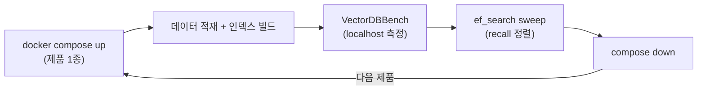

# 벡터 DB 5종을 실제로 벤치마크했다 — 같은 recall에서 QPS는 얼마나 갈리나

> [벡터 DB 5종 아키텍처 심층 비교](./vectordb-architecture-deep-dive.md)를 먼저 읽으면 좋다.
> 그 글이 "구조가 어떻게 다른가"라면, 이 글은 "그 구조가 실제 숫자로 어떻게 나오나"다.

벡터 DB 도입을 검토하면서 OpenSearch, Milvus, Qdrant, Vespa, pgvector 다섯을 같은 조건으로 직접 벤치마크했다.
표만 던지는 벤치는 오해를 부르기 쉬워서, 이 글은 **어떤 데이터로, 어떤 질의로, recall을 어떻게 쟀는지**부터 남긴다.
숫자보다 방법이 먼저다 — 방법을 모르면 숫자를 잘못 읽는다.

## 먼저 가져갈 결론

- **같은 recall(0.95)로 맞추면 Milvus가 OpenSearch의 약 10배 QPS**를 낸다. 단 이건 recall을 정렬한 뒤의 이야기다.
- **recall을 정렬하지 않은 QPS 비교는 무의미하다.** recall과 QPS는 같은 trade-off 곡선 위의 두 점이라, 동작점이 다르면 표의 QPS를 그대로 우열로 읽으면 안 된다.
- **시간의 99%는 적재가 아니라 HNSW 인덱스 빌드다.** 10M이면 load(적재+인덱스)가 제품에 따라 2~4시간이다.
- **대규모 벤치의 "질의"는 텍스트가 아니라 벡터다.** recall은 검색 품질이 아니라 "빠른 ANN이 느린 완전탐색을 얼마나 재현하나"를 잰다.

## 무엇을, 어떤 데이터로 쟀나

두 종류의 데이터셋을 썼다.

- **표준셋 — Cohere Wikipedia 임베딩** (768차원, cosine). 규모는 100만과 1000만. 외부 벤치와 비교 가능하고 제품 간 공정 비교의 기준이 된다.
- **사내 실데이터** (1024차원, bge-m3). 사내 문서를 실제로 임베딩한 것으로, 정제하지 않은 진짜 워크로드다. 표준셋 결론이 우리 데이터에서도 유지되는지 교차 확인용이다.

측정은 한 인스턴스(32 vCPU / 128GB)에서 제품별로 순차로 올렸다 내린다.

측정기(VectorDBBench)는 같은 머신에서 `localhost`로 붙였다 — 네트워크 왕복 지연을 QPS와 p99에서 빼기 위해서다.
Vespa만 VectorDBBench가 지원하지 않아 별도 러너를 직접 작성해 쟀다.

## 질의와 recall은 어떻게 측정하나

여기가 가장 오해하기 쉬운 지점이다. **대규모 벤치의 질의는 자연어 텍스트가 아니라 질의 벡터다.**
Cohere 데이터셋은 Wikipedia 문서를 768차원으로 임베딩한 것이라, 질의도 임베딩 벡터로 주어진다.

- **질의 집합** — 벡터 1,000개(각 768차원). 예를 들어 query id 0의 벡터는 `[-0.0597, -0.2368, 0.2499, 0.3593, 0.2643, ...]`(768개 중 앞 5개)처럼 생겼다.
- **정답**(ground truth) — 각 질의 벡터에 대해 brute-force(전수 비교)로 미리 구해 둔 진짜 최근접 top-k의 id다. query 0의 정답 이웃 top-10은 `[9004060, 4870944, 3147147, 8024994, ...]` 식이다.
- **recall@k** — ANN이 돌려준 top-k와 정답 top-k의 교집합 비율이다. `recall@100 = |ANN_top100 ∩ 정답_top100| / 100`을 1,000 질의에 대해 평균한다.

즉 recall은 "빠른 근사 탐색(ANN)이 정확하지만 느린 완전탐색 결과를 얼마나 재현하는가"를 잰다.
텍스트 검색 품질이 아니다.

텍스트로 검색 품질을 재려면 질의가 실제 문장이어야 한다.
그건 별도로 KorQuAD(한국어 QA 데이터셋)로 쟀는데, 거기서는 질의가 "바그너는 괴테의 파우스트를 읽고 무엇을 쓰고자 했는가?" 같은 실제 질문이고, recall은 "정답 문단이 top-10에 들어오는가"로 잰다.
그건 [형태소 분석기 비교 글](./nori-vs-lindera-korean-tokenizer.md)과 이어지는 다른 축의 실험이다.

## 공정 비교의 두 함정

### recall을 맞추지 않은 QPS는 비교가 아니다

HNSW의 `ef_search`를 올리면 더 많은 후보를 탐색해 recall이 오르지만 그만큼 QPS는 떨어진다.
recall과 QPS는 맞바꾸는 관계라, 제품마다 동작점(recall)이 다르면 QPS를 나란히 놓아도 공정하지 않다.
그래서 `ef_search`를 50/100/200/500으로 sweep해 각 제품을 같은 recall(0.95)에 맞춘 뒤 QPS를 비교해야 한다.

### 필터 선택도는 숨은 변수다

필터가 데이터의 99%를 걸러내면 쿼리 속도가 차수 단위로 출렁이고 recall이 불안정해진다.
이 거동은 제품마다 다르게 나타나서, 필터링 전용 ANN 벤치마크 논문(ACORN, Filtered-DiskANN)이 따로 있을 정도다.
이번 라운드는 무필터 검색만 쟀고, 필터링은 별도 설계가 필요하다.

## 1M 실측 결과

5종 모두 HNSW `m=16`, `ef_construction=200`으로 통일했다(공정 비교). 엔진만 다르다 — OpenSearch는 faiss, Milvus는 Knowhere(faiss 기반), 나머지는 자체 구현이다.

| 제품 | recall@100 | 적재 | 인덱스 빌드 | 최대 QPS | serial p99 |
| --- | --- | --- | --- | --- | --- |
| Qdrant | 0.9885 | 359s | 251s | 451 | 16.8ms |
| pgvector | 0.9224 | 162s | 546s | 3,585 | 14.9ms |
| Milvus | 0.8835 | 517s | 374s | 4,269 | 7.6ms |
| OpenSearch | 0.8819 | 1,266s | 935s | 383 | 27.2ms |
| Vespa | 0.9342 | 2,628s(feed) | feed 중 | 601 | 236ms† |

† Vespa의 지연·QPS는 러너의 결과 summary 직렬화 오버헤드가 섞인 값이라 recall만 직접 비교한다.

가장 눈에 띄는 건 recall이 거의 같은데 성능이 갈리는 한 쌍이다.
Milvus(0.8835)와 OpenSearch(0.8819)는 recall이 사실상 동일한데 최대 QPS가 4,269 대 383으로 약 11배 벌어진다.
recall이 같으므로 이건 동작점 차이가 아니라 실제 성능 격차다.

## recall을 0.95로 맞추면

동작점이 제각각인 위 표를 recall 0.95로 정렬해 다시 봤다.

| 순위 | 제품 | recall 0.95에서 최대 QPS(보간) |
| --- | --- | --- |
| 1 | Milvus | 약 3,380 |
| 2 | pgvector | 약 2,510 |
| 3 | Qdrant | 약 664 |
| 4 | Vespa | 약 596 (저평가 — summary 오버헤드) |
| 5 | OpenSearch | 약 324 (저평가 — 단일 샤드·force merge) |

- Milvus와 pgvector가 recall을 맞춘 뒤에도 처리량을 압도한다. recall 0.95에서 Milvus는 OpenSearch의 약 10배다.
- Qdrant는 고recall 특화다 — `ef_search`를 크게 주면 recall 0.997까지 가지만 QPS가 급락한다.
- OpenSearch는 `ef_search`를 올려도 QPS가 약 340에 고정되고 recall만 오른다. 병목이 그래프 탐색이 아니라 병렬성이라서다(단일 샤드 + 세그먼트 1개면 쿼리 하나가 사실상 스레드 하나). 샤드를 늘리면 개선 여지가 있으니 "OpenSearch가 느리다"가 아니라 "이 설정에서 이 수치"로 읽어야 한다.

## 사내 데이터로도 쟀다

표준셋 하나로 결론을 내면 위험하니, 사내 실데이터(한국어 1024차원)로도 4종을 쟀다.

| 제품 | 사내 recall | 사내 QPS |
| --- | --- | --- |
| Milvus | 0.9321 | 4,571 |
| pgvector | 0.9432 | 4,438 |
| Qdrant | 0.9712 | 654 |
| OpenSearch | 0.9318 | 274 |

상대 순위가 표준셋과 일관됐다 — 제품 선택 결론이 표준셋 하나에만 기댄 게 아님을 확인했다.
사내 recall이 표준보다 대체로 높았는데, 구조화되고 반복되는 실데이터가 벡터 공간에서 뭉쳐 ANN이 쉬워지는 특성으로 추정한다.

## 10M으로 키워도 순위는 유지된다

1M으로 순위를 정했다면, 10M은 그 결론이 10배 규모에서 무너지지 않는지 확인하는 라운드다.
10M은 재색인이 제품당 수 시간이라 ef sweep(recall 정렬)이 비현실적이어서 단일 동작점만 쟀다.
그래서 아래 QPS는 recall이 제품마다 달라 나란히 우열로 읽으면 안 되고, "recall이 유지되나 + 순위 경향이 유지되나"로 읽는다.

| 제품 | recall@100 | 최대 QPS | load |
| --- | --- | --- | --- |
| Milvus | 0.8984 | 2,698 | 8,501s |
| pgvector | 0.8958 | 2,872 | 13,604s |
| Qdrant | 0.9770 | 203 | 9,436s |
| Vespa | 0.9051 | 599 | 27,854s |
| OpenSearch | 미측정 | 미측정 | — |

- recall이 규모에서 유지된다 — Milvus 0.8835→0.8984, Qdrant 0.9885→0.977, Vespa 0.9342→0.9051로 1M 대비 큰 저하가 없다.
- 순위 경향도 그대로다 — Milvus·pgvector가 고처리량, Qdrant·Vespa가 고recall·저QPS 쪽. 공정 순위 기준은 여전히 1M의 recall 0.95 정렬이다.
- OpenSearch 10M은 VectorDBBench 하니스와 10M에서 충돌해 미측정으로 남겼다(force merge 폴링의 `.tasks` 404, force merge를 끄면 검색 단계 IndexError). OpenSearch 특성은 1M·사내 결과로 이미 충분히 드러났다.

## 왜 적재가 몇 시간씩 걸리나

벤치를 돌리면 "적재"라 부르는 단계가 몇 시간씩 걸린다. 그런데 시간의 대부분은 적재가 아니라 인덱스 빌드다.

- **HNSW 그래프 빌드가 주범이다.** 벡터 하나를 넣을 때마다 그래프에서 이웃을 탐색(거리 계산 수백~수천 번)해 연결한다. N개면 대략 O(N log N)이고, 10M이면 이 거리 계산이 수십억 번이다.
- pgvector 10M을 예로 들면 load 13,604초 중 순수 insert는 1,868초뿐이고 나머지 11,735초가 인덱스 빌드다.
- 그래서 "인덱스 빌드 시간"도 어엿한 벤치 지표다. 임베딩 모델을 바꾸면 벡터 공간이 바뀌어 전체를 재색인해야 하므로, 이 시간이 곧 운영 비용이 된다.

## 한계

- 표준셋(영어 위키 768차원)은 사내 워크로드(한국어 1024차원)를 그대로 대변하지 않는다. 그래서 사내 데이터를 따로 얹었다.
- 무필터 검색만 쟀다. 멀티테넌시처럼 강한 필터가 걸리는 실사용은 별도 필터링 벤치가 필요하다.
- Vespa의 QPS·지연은 러너 오버헤드로 저평가되어 recall만 직접 비교했다.
- 문서 청킹·임베딩 전처리 품질은 이 벤치가 재지 못한다. recall 측정과는 별개 축이다.

## 참고 링크

- [VectorDBBench (Zilliz)](https://github.com/zilliztech/VectorDBBench)
- [Cohere/wikipedia 임베딩 데이터셋](https://huggingface.co/datasets/Cohere/wikipedia-22-12)
- [ACORN — 필터링 ANN 논문](https://arxiv.org/html/2403.04871v1)
