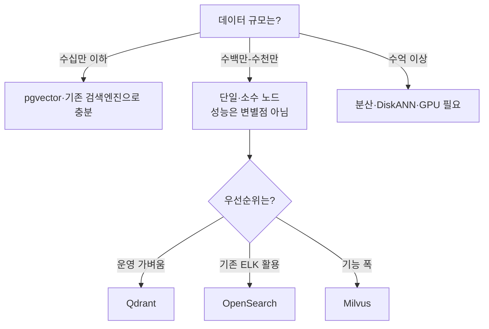

# 벡터 DB 어떻게 고를까 — OpenSearch · Milvus · Qdrant · Vespa 비교

RAG 를 만들면 임베딩한 벡터를 어딘가에 저장하고 검색해야 한다.
처음엔 쓰던 검색엔진(OpenSearch)에 벡터 기능을 얹어 시작했는데, 전용 벡터 DB 로 옮길지 고민이 생기면서 후보들을 제대로 비교해 봤다.
결론부터 말하면, 규모가 크지 않으면 뭘 골라도 성능은 충분하고 선택을 가르는 건 성능이 아니라 기능과 운영이라는 것이었다.

이 글은 OpenSearch · Milvus · Qdrant · Vespa 네 제품을 같은 축으로 비교하고, 데이터 규모·차원·하이브리드 필요 여부에 따라 무엇을 고르면 되는지 정리한 기록이다.

---

## 네 제품은 출발점부터 다르다

| 제품 | 성격 |
| --- | --- |
| OpenSearch | 범용 검색·분석 엔진에 k-NN(벡터) 플러그인을 얹은 형태 |
| Milvus | 처음부터 벡터를 위해 만든 전용 분산 DB |
| Qdrant | 전용 벡터 DB. Rust 로 작성, 가볍고 빠름 |
| Vespa | 대규모 서빙·검색 엔진. 텐서·벡터를 1급으로 내장 |

"전용이라 무조건 낫다"는 건 마케팅 수사다. 범용 엔진도 벡터 검색을 충분히 하고, billion-scale 도 가능하다. 전용 DB 의 진짜 차이는 **기능의 폭**(학습형 sparse, multi-vector, GPU 인덱스, DiskANN)이다.

---

## 비교 축

### 인덱스

거의 모든 제품이 HNSW(그래프 기반, 인메모리 고성능)를 기본으로 지원한다. 그래서 HNSW 만 쓸 거면 인덱스는 선택 기준이 못 된다. 차이는 그 외 선택지다.

| | OpenSearch | Milvus | Qdrant | Vespa |
| --- | --- | --- | --- | --- |
| HNSW | ◎ | ◎ | ◎ | ◎ |
| IVF 계열 | ◎ | ◎ | △ | ○ |
| DiskANN(온디스크) | △ | ◎ | ○(mmap) | ○ |
| GPU 인덱스 | ✗ | ◎ | ✗ | ✗ |
| 양자화 | ○ | ○ | ◎ | ○ |

### 검색 기능 (RAG 의 핵심)

| | OpenSearch | Milvus | Qdrant | Vespa |
| --- | --- | --- | --- | --- |
| dense ANN | ◎ | ◎ | ◎ | ◎ |
| 하이브리드(BM25+벡터) | ◎ | ◎ | ○ | ◎ |
| 학습형 sparse(SPLADE) | ✗ | ◎ | △ | ○ |
| multi-vector | ✗ | ◎ | ○ | ◎ |
| 메타데이터 필터링 | ◎ | ◎ | ◎(표현력 최강) | ◎ |

### 운영·생태계

| | OpenSearch | Milvus | Qdrant | Vespa |
| --- | --- | --- | --- | --- |
| 설치·운영 난이도 | 중 | 높음(컴포넌트 다수) | 낮음 | 높음 |
| 분산 확장 | ◎ | ◎ | ◎ | ◎ |
| 멀티테넌시 | 인덱스 단위 | collection/partition | collection/shard | 스키마 |
| 생태계·커뮤니티 | 큼 | 큼 | 중 | 중 |

---

## 조건별 선택 가이드

비교표보다 실무에서 중요한 건 "내 조건이면 뭘 고르나"다.

### 데이터 개수로 먼저 거른다

- **수십만 이하** — 굳이 전용 DB 가 필요 없다. pgvector(PostgreSQL)나 쓰던 검색엔진으로 충분하다.
- **수백만에서 수천만** — 단일이나 소수 노드로 충분한 구간. HNSW 를 메모리에 올려 빠르게 검색된다. 이 구간이면 무엇을 골라도 성능은 충분하니, 운영 편의나 기능으로 고른다.
- **수억 이상** — 이제 진짜 확장성이 변수다. 분산(Milvus distributed), 온디스크(DiskANN), GPU 가 의미를 갖는다.

### 벡터 차원은 메모리로 환산한다

차원 자체가 제품 선택을 가르진 않는다. 다만 메모리 사용량이 **벡터 수 × 차원 × 4byte** 로 정해진다는 점은 기억해야 한다(float32 기준).
예를 들어 1,600만 벡터에 1024차원이면 raw 약 68GB. HNSW 그래프 오버헤드를 더해도 단일 장비 메모리에 들어가는 규모다. 차원이 크거나(예: 1536) 벡터가 많아 메모리를 넘기면 그때 양자화나 DiskANN 을 검토한다.

### 하이브리드·한국어가 필요한가

- 키워드 + 벡터 정도의 하이브리드는 네 제품 모두 된다.
- **학습형 sparse(SPLADE) 까지** 원하면 Milvus 가 앞선다.
- 한국어는 형태소 분석이 필수다. OpenSearch 는 nori, Milvus 는 lindera + ko-dic 으로 지원한다. 둘 다 조사·어미를 걸러내면 결과가 거의 같다(복합명사는 lindera 가 덜 쪼개는 편).

### 운영 부담으로 마무리

- **가장 가볍게** 운영하고 싶다 → Qdrant. 컴포넌트가 단순하다.
- **이미 ELK/OpenSearch 를 쓰고 있다** → OpenSearch 유지가 합리적. 새 시스템 학습 비용이 없다.
- **기능 폭·미래 확장** 이 우선이다 → Milvus. 대신 self-host 운영은 무겁다(etcd·메시지 큐·오브젝트 스토리지·여러 노드).
- Vespa 는 강력하지만 학습 곡선이 가팔라서, 대규모 서빙·복잡한 ML 랭킹이 필요한 게 아니면 과한 선택이 되기 쉽다.

---

## 마케팅 주장은 직접 검증해야 한다

비교하면서 가장 크게 배운 건, 벤더 블로그의 우위 주장 상당수가 교차 검증하면 흔들린다는 점이다.

- "범용 DB 는 백만 규모 벡터에서 무조건 느려진다" → 사실 아님. OpenSearch 도 billion-scale 가이드가 있다.
- "X 가 거의 모든 벤치마크에서 최고 RPS" → 대개 자사 벤치마크다.
- 특히 **필터링 성능은 필터 선택도(전체 중 몇 %가 통과하나)에 따라 차수 단위로 출렁인다.** 그래서 메타데이터 필터가 많은 RAG 라면 제품별 우열을 일반론으로 믿지 말고 자기 워크로드로 직접 벤치마크해야 한다.

---

## 정리

- 데이터가 수천만 이하면 **성능은 변별점이 아니다.** 뭘 골라도 충분하다.
- 그래서 선택 기준은 **기능(하이브리드·sparse·multi-vector)과 운영 부담**으로 옮겨간다.
- 빠르게 정리하면: 가볍게 = Qdrant, 쓰던 거 유지 = OpenSearch, 기능·확장 = Milvus, 대규모 서빙·ML 랭킹 = Vespa.
- 그리고 무엇을 고르든 **필터링 성능만큼은 자기 데이터로 직접 재본다.**

벡터 DB 의 동작 원리(segment, 하이브리드)가 궁금하면 [Milvus 아키텍처 글](./milvus/milvus-architecture-and-performance.md)에, HNSW 같은 검색 알고리즘은 [벡터 검색 알고리즘 — kNN에서 HNSW까지](../AI/RAG/vector-search-algorithms.md)에 더 정리해 두었다.

---

## 참고 링크

- [Milvus Index Explained](https://milvus.io/docs/index-explained.md)
- [Milvus vs OpenSearch (Zilliz)](https://zilliz.com/comparison/milvus-vs-opensearch)
- [Qdrant Benchmarks](https://qdrant.tech/benchmarks/)
- [Choosing a Vector Database for ANN Search at Reddit](https://milvus.io/blog/choosing-a-vector-database-for-ann-search-at-reddit.md)
- [The Data Quarry — Vector DB comparison](https://thedataquarry.com/blog/vector-db-1/)
