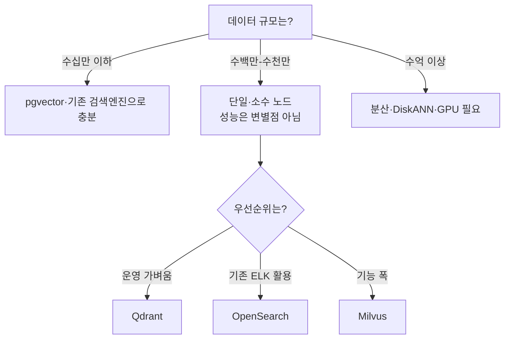

# 벡터 DB 어떻게 고를까 — OpenSearch · Milvus · Qdrant · Vespa · pgvector 비교

RAG 를 만들면 임베딩한 벡터를 어딘가에 저장하고 검색해야 한다.
처음엔 쓰던 검색엔진(OpenSearch)에 벡터 기능을 얹어 시작했는데, 전용 벡터 DB 로 옮길지 고민이 생기면서 후보들을 제대로 비교해 봤다.
결론부터 말하면, 규모가 크지 않으면 뭘 골라도 성능은 충분하고 선택을 가르는 건 성능이 아니라 기능과 운영이라는 것이었다.

이 글은 OpenSearch · Milvus · Qdrant · Vespa · pgvector 다섯 제품을 같은 축으로 비교하고, 데이터 규모·차원·하이브리드 필요 여부에 따라 무엇을 고르면 되는지 정리한 기록이다.

"성능은 충분하다"는 인덱스 알고리즘(HNSW) 얘기고, 메모리 얘기는 다르다. 아래 표에도 온디스크 인덱싱·양자화가 계속 등장하는데, 그게 왜 부가 기능이 아니라 비용을 가르는 핵심 선택지인지부터 짚고 시작한다.

## 왜 벡터 DB는 메모리를 이렇게 많이 쓰는가

메모리 사용량은 **벡터 수 × 차원 × 4byte** 로 정해진다(float32 기준). 1,600만 벡터에 1024차원이면 raw 약 68GB다. 그런데 이건 그래프 구조를 뺀 순수 벡터 크기일 뿐이고, 실제 필요 메모리는 이보다 크다.

**RDB 감각으로 이 규모를 보면 안 된다.** RDB는 row 하나가 수백 byte에 불과하고, B-Tree 인덱스는 자주 쓰는 페이지만 캐시해도 충분하다 — 콜드 데이터를 디스크에서 읽어도 순차 접근이라 지연이 크지 않다. 반면 벡터는 row 자체가 크다(1024차원 float32 하나가 이미 4KB). 게다가 HNSW 그래프 탐색은 링크를 따라 이리저리 점프하는 **무작위 접근**이라, B-Tree처럼 "일부만 캐시"하는 전략이 잘 안 통한다 — 낮은 지연을 유지하려면 거의 다 메모리에 있어야 한다. 그래서 "레코드 수천만 건"이라는 같은 숫자가 RDB에서는 가벼운 사이징이지만 벡터 DB에서는 128GB, 256GB급 인스턴스나 다중 노드 샤딩을 요구하는 무거운 사이징이 된다. Pinecone·Milvus·Weaviate 같은 서비스의 수천만~수억 벡터 배포 가이드가 대용량 메모리 노드 여러 대로 샤딩하는 걸 기본값으로 두는 이유도 여기에 있다.

OpenSearch 공식 HNSW 메모리 공식은 `1.1 × (4 × 차원 + 8 × M) × 벡터수`다(M은 기본 16). 위 조건을 대입하면 약 72GB — raw 보다 이미 커진다. 여기에 circuit breaker(기본값: `(전체 메모리 − JVM heap) × 50%` 만 k-NN에 허용)와 레플리카(있으면 필요 메모리가 그대로 배수)까지 고려하면, "raw 68GB 니까 128GB 인스턴스 하나면 충분하다"는 계산은 틀리기 쉽다. 128GB 인스턴스에 JVM heap 32GB를 배정했다면 k-NN이 실제 쓸 수 있는 메모리는 `(128−32) × 0.5 = 48GB`뿐이라, 레플리카 없이도 이미 모자란다.
그래서 이 규모부터는 단일 장비를 키우기보다 **샤딩으로 벡터를 여러 노드에 나누는 게** 현실적인 선택이 된다. 차원이 크거나(예: 1536) 노드당 감당할 벡터 수를 넘기면 그때 양자화나 DiskANN(온디스크)을 검토한다. 아래 비교표의 "온디스크 인덱싱"·"양자화" 행이 바로 이 문제에 대한 제품별 답이다.

*OpenSearch 공식 문서 기준([k-NN memory estimation](https://docs.opensearch.org/latest/search-plugins/knn/knn-index/), [circuit breaker settings](https://docs.opensearch.org/latest/search-plugins/knn/settings/)). 다른 제품(Milvus·Qdrant·Vespa)의 메모리 공식은 이 글에서 별도로 검증하지 않았다 — 확인 필요.*

---

## 다섯 제품은 출발점부터 다르다

| 제품 | 성격 |
| --- | --- |
| OpenSearch | 범용 검색·분석 엔진에 k-NN(벡터) 플러그인을 얹은 형태 |
| Milvus | 처음부터 벡터를 위해 만든 전용 분산 DB |
| Qdrant | 전용 벡터 DB. Rust 로 작성, 가볍고 빠름 |
| Vespa | 대규모 서빙·검색 엔진. 텐서·벡터를 1급으로 내장 |
| pgvector | PostgreSQL 확장(extension). 벡터가 그냥 테이블의 한 컬럼 |

"전용이라 무조건 낫다"는 건 마케팅 수사다. 범용 엔진도 벡터 검색을 충분히 하고, billion-scale 도 가능하다. 전용 DB 의 진짜 차이는 **기능의 폭**(학습형 sparse, multi-vector, GPU 인덱스, DiskANN)이다.

pgvector 는 이 넷과 출발점 자체가 다르다 — 별도 DB 가 아니라 "이미 쓰던 PostgreSQL 에 벡터 컬럼 하나 추가하는" 접근이다. `CREATE EXTENSION vector;` 한 줄로 끝나고, 3대 클라우드(AWS Aurora/RDS, GCP Cloud SQL/AlloyDB, Azure)가 매니지드로 지원한다([pgvector Installation](https://github.com/pgvector/pgvector#installation)). 뒤에 나올 표에서 "미지원"이 많은 이유도 여기 있다 — 전용 벡터 DB 의 고급 기능 대부분을 처음부터 포기하고 단순함을 택한 제품이다.

---

## 비교 축

### 인덱스

거의 모든 제품이 HNSW(그래프 기반, 인메모리 고성능)를 기본으로 지원한다. 그래서 HNSW 만 쓸 거면 인덱스는 선택 기준이 못 된다. 차이는 그 외 선택지다.

> **범례**: ◎ 완전 지원(공식 기능) · ○ 지원(대체 수단 또는 제약 있음) · △ 부분/실험적 지원 · ✗ 미지원

| | OpenSearch | Milvus | Qdrant | Vespa | pgvector |
| --- | --- | --- | --- | --- | --- |
| HNSW | ◎ | ◎ | ◎ | ◎ | ◎ |
| IVF 계열 | ◎ | ◎ | ✗(quantization·full-scan으로 대체) | ○ | ◎(IVFFlat) |
| 온디스크 인덱싱 | ○(quantization 기반 `on_disk`, DiskANN은 아님) | ◎(Knowhere DiskANN) | ○(mmap) | ○(확인 필요) | ✗(core) / ◎(pgvectorscale 확장의 StreamingDiskANN) |
| GPU 인덱스 | ✗ | ◎ | ✗ | ✗ | ✗ |
| 양자화 | ○ | ○ | ◎ | ○ | ○(halfvec·binary, v0.7.0~) |

Qdrant는 IVF를 지원하지 않는다 — 공식 문서가 명시하는 밀집 벡터 인덱스는 HNSW 하나뿐이다([Qdrant Indexing](https://qdrant.tech/documentation/concepts/indexing/)). OpenSearch는 Microsoft의 DiskANN 알고리즘 자체를 채택하지 않았고, binary/scalar quantization 기반 `on_disk` 모드(GA)로 유사한 메모리 절감 효과를 낸다([Disk-based vector search](https://docs.opensearch.org/latest/vector-search/optimizing-storage/disk-based-vector-search/)).

Qdrant의 `mmap`은 Milvus의 DiskANN(Vamana 그래프를 SSD 접근에 최적화해 설계)과는 접근 자체가 다르다. Qdrant는 벡터 파일과 HNSW 그래프를 OS의 가상 주소 공간에 매핑해 두고, 실제 로딩은 OS 페이지 캐시에 맡긴다 — 자주 쓰는 페이지는 캐시에 남아 인메모리와 비슷한 속도를 내지만, 캐시에 없는 페이지는 그때 디스크를 읽는다. 별도 자료구조를 새로 설계한 게 아니라 **OS가 이미 하는 일(페이지 캐싱)을 벡터 저장소에 그대로 위임한 것**이라 구현은 단순하지만, HNSW 그래프 탐색처럼 접근 패턴이 무작위(random access)에 가까우면 캐시 미스가 잦아져 순수 온디스크 전용 구조(DiskANN)보다 지연이 더 크게 튈 수 있다([Qdrant Storage](https://qdrant.tech/documentation/concepts/storage/)).

pgvector 는 **core 확장과 pgvectorscale(Timescale 이 별도로 만든 확장)을 구분해야 한다.** HNSW·IVFFlat·halfvec·binary quantization 은 core 기능이지만, DiskANN(StreamingDiskANN)은 pgvectorscale 을 따로 설치해야 나온다([pgvectorscale StreamingDiskANN](https://github.com/timescale/pgvectorscale#streamingdiskann)). "pgvector 를 쓴다"고 해서 DiskANN 까지 자동으로 따라오지 않는다.

### 검색 기능 (RAG 의 핵심)

| | OpenSearch | Milvus | Qdrant | Vespa | pgvector |
| --- | --- | --- | --- | --- | --- |
| dense ANN | ◎ | ◎ | ◎ | ◎ | ◎ |
| 하이브리드(BM25+벡터) | ◎ | ◎ | ○ | ◎ | ○(SQL로 직접 조합, `ts_rank_cd`는 BM25 아님) |
| 학습형 sparse(SPLADE) | ✗ | ◎ | △ | ○ | ○(`sparsevec` 타입만 제공, SPLADE 전용 통합은 없음) |
| multi-vector | ✗ | ◎ | ○ | ◎ | ✗ |
| 메타데이터 필터링 | ◎ | ◎ | ◎(표현력 최강) | ◎ | ◎(SQL WHERE·JOIN 그대로) |

### 운영·생태계

| | OpenSearch | Milvus | Qdrant | Vespa | pgvector |
| --- | --- | --- | --- | --- | --- |
| 설치·운영 난이도 | 중 | 높음(컴포넌트 다수) | 낮음 | 높음 | 낮음(`CREATE EXTENSION` 한 줄) |
| 분산 확장 | ◎ | ◎ | ○(OSS는 수동 리밸런싱, 자동은 Cloud 전용) | ◎ | ✗(core는 단일 노드, Citus는 범용 샤딩이라 벡터 전용 통합 아님) |
| 멀티테넌시 | 인덱스 단위 | collection/partition | collection/shard | 스키마 | 확인 필요(권장 패턴 공식 문서 미명시) |
| 생태계·커뮤니티 | 큼 | 큼 | 중 | 중 | 큼(GitHub 22,000+ star, 3대 클라우드 매니지드) |

네 제품 다 "샤드 단위로 HNSW를 독립 구축하고 결과를 병합한다"는 기본 골격은 같지만, 리밸런싱 성숙도는 다르다.

- **Vespa**는 버킷(bucket) 단위 해시 기반 재분배가 완전 자동이고, 2005년경 Yahoo 대규모 서빙부터 약 20년간 검증됐다([Vespa buckets](https://docs.vespa.ai/en/content/buckets.html), [elasticity](https://docs.vespa.ai/en/content/elasticity.html)).
- **OpenSearch**는 노드 추가·리밸런싱은 자동이지만, 프라이머리 샤드 수는 생성 후 변경이 어려워(Split API도 배수 제약) 사전 용량 설계 의존도가 높다([bp-sharding](https://docs.aws.amazon.com/opensearch-service/latest/developerguide/bp-sharding.html)).
- **Milvus**는 워커 노드가 무상태라 컨테이너만 늘리면 자동 스케일 아웃되지만, etcd·Pulsar/Kafka·MinIO 3중 외부 의존성을 각각 따로 확장해야 한다([Scale Dependencies](https://milvus.io/docs/scale-dependencies.md)).
- **Qdrant는 배포 형태에 따라 등급이 갈린다.** 오픈소스 self-host는 리밸런싱이 수동 API 호출이고 `shard_number`도 생성 후 변경이 안 된다. 자동 리밸런싱과 무중단 Resharding(v1.13)은 **Qdrant Cloud 전용**이라 공식 문서가 명시한다([distributed_deployment](https://qdrant.tech/documentation/distributed_deployment/), [cluster-scaling](https://qdrant.tech/documentation/cloud/cluster-scaling/)). 그래서 "가장 가볍게 운영하고 싶다 → Qdrant"를 고를 때도, self-host라면 나중에 샤드를 늘리는 결정을 미리 해둬야 한다.

---

## 조건별 선택 가이드

비교표보다 실무에서 중요한 건 "내 조건이면 뭘 고르나"다.

### 데이터 개수로 먼저 거른다

- **수십만 이하** — 굳이 전용 DB 가 필요 없다. pgvector(PostgreSQL)나 쓰던 검색엔진으로 충분하다.
- **수백만에서 수천만** — 단일이나 소수 노드로 충분한 구간. HNSW 를 메모리에 올려 빠르게 검색된다. 이 구간이면 무엇을 골라도 성능은 충분하니, 운영 편의나 기능으로 고른다.
- **수억 이상** — 이제 진짜 확장성이 변수다. 분산(Milvus distributed), 온디스크(DiskANN), GPU 가 의미를 갖는다.

```mermaid
flowchart TD
    A[데이터 규모는?] -->|수십만 이하| B[pgvector·기존 검색엔진으로 충분]
    A -->|수백만-수천만| C[단일·소수 노드<br/>성능은 변별점 아님]
    A -->|수억 이상| D[분산·DiskANN·GPU 필요]
    C --> E{우선순위는?}
    E -->|운영 가벼움| F[Qdrant]
    E -->|기존 ELK 활용| G[OpenSearch]
    E -->|기능 폭| H[Milvus]
```

### 하이브리드·한국어가 필요한가

- 키워드 + 벡터 정도의 하이브리드는 다섯 제품 모두 된다(pgvector 는 네이티브 기능이 아니라 전문검색과 벡터 검색을 SQL로 직접 조합).
- **학습형 sparse(SPLADE) 까지** 원하면 Milvus 가 앞선다.
- 한국어는 형태소 분석이 필수다. OpenSearch 는 nori, Milvus 는 lindera + ko-dic 으로 지원한다. 둘 다 조사·어미를 걸러내면 결과가 거의 같다(복합명사는 lindera 가 덜 쪼개는 편).

### 운영 부담으로 마무리

- **가장 가볍게** 운영하고 싶다 → Qdrant. [컴포넌트가 단순하다](./qdrant/qdrant-architecture-and-performance.md) — Milvus 가 별도로 두는 etcd·메시지 큐·오브젝트 스토리지·노드 역할 분리를 전부 단일 바이너리 안에 흡수했다.
- **이미 ELK/OpenSearch 를 쓰고 있다** → OpenSearch 유지가 합리적. 새 시스템 학습 비용이 없다.
- **기능 폭·미래 확장** 이 우선이다 → Milvus. 대신 self-host 운영은 무겁다(etcd·메시지 큐·오브젝트 스토리지·여러 노드).
- [Vespa 는 강력하지만 학습 곡선이 가파르다](./vespa/vespa-architecture-and-performance.md) — 서버 사이드에서 ONNX 모델까지 인라인 실행하는 유일한 엔진인 대신, 인덱싱 파이프라인·랭킹 표현식·클러스터 배치 XML 3가지를 새로 배워야 한다. 대규모 서빙·복잡한 ML 랭킹이 필요한 게 아니면 과한 선택이 되기 쉽다.
- **이미 PostgreSQL 을 쓰고 있고 규모가 크지 않다** → pgvector. 별도 DB 를 안 늘려도 된다는 게 가장 큰 장점이다. 대신 multi-vector·GPU 인덱스는 없고, 분산 확장은 core 만으로는 안 된다(Citus 는 범용 샤딩이라 벡터 전용 검증이 약하다) — 이 셀들이 필요해지는 순간 전용 벡터 DB 로 옮길 준비를 해야 한다.

---

## 마케팅 주장은 직접 검증해야 한다

비교하면서 가장 크게 배운 건, 벤더 블로그의 우위 주장 상당수가 교차 검증하면 흔들린다는 점이다.

- "범용 DB 는 백만 규모 벡터에서 무조건 느려진다" → 사실 아님. OpenSearch 도 billion-scale 가이드가 있다.
- "X 가 거의 모든 벤치마크에서 최고 RPS" → 대개 자사 벤치마크다.
- 특히 **필터링 성능은 필터 선택도(전체 중 몇 %가 통과하나)에 따라 차수 단위로 출렁인다.** 그래서 메타데이터 필터가 많은 RAG 라면 제품별 우열을 일반론으로 믿지 말고 자기 워크로드로 직접 벤치마크해야 한다.

---

## 정리

- 데이터가 수천만 이하면 **성능은 변별점이 아니다.** 뭘 골라도 충분하다.
- 그래서 선택 기준은 **기능(하이브리드·sparse·multi-vector)과 운영 부담**으로 옮겨간다.
- 빠르게 정리하면: 가볍게 = Qdrant, 쓰던 거 유지 = OpenSearch, 기능·확장 = Milvus, 대규모 서빙·ML 랭킹 = Vespa, PostgreSQL 이미 씀 = pgvector.
- 그리고 무엇을 고르든 **필터링 성능만큼은 자기 데이터로 직접 재본다.**

이 글은 "뭘 고를까"에 초점을 맞춘 표면 비교다. 왜 제품마다 메모리·분산·인덱싱 방식이 이렇게 다른지 내부 구조까지 파고들고 싶다면 [벡터 DB 5종, 아키텍처는 어떻게 다른가](./vectordb-architecture-deep-dive.md)를 다음으로 읽으면 된다. Milvus 개별 아키텍처는 [Milvus 아키텍처 글](./milvus/milvus-architecture-and-performance.md)에, HNSW 같은 검색 알고리즘 자체는 [벡터 검색 알고리즘 — kNN에서 HNSW까지](../AI/RAG/vector-search-algorithms.md)에 더 정리해 두었다.

---

## 참고 링크

**함께 읽기**

- [OpenSearch vs Milvus 심화 비교](./milvus/opensearch-vs-milvus.md)
- [벡터 DB 아키텍처 심층 비교](./vectordb-architecture-deep-dive.md)

**외부 자료**

- [Milvus Index Explained](https://milvus.io/docs/index-explained.md)
- [Milvus vs OpenSearch (Zilliz)](https://zilliz.com/comparison/milvus-vs-opensearch)
- [Qdrant Benchmarks](https://qdrant.tech/benchmarks/)
- [Choosing a Vector Database for ANN Search at Reddit](https://milvus.io/blog/choosing-a-vector-database-for-ann-search-at-reddit.md)
- [The Data Quarry — Vector DB comparison](https://thedataquarry.com/blog/vector-db-1/)
- [pgvector GitHub](https://github.com/pgvector/pgvector)
- [pgvectorscale GitHub — StreamingDiskANN](https://github.com/timescale/pgvectorscale)
