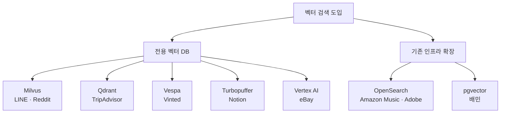

# 벡터 DB를 실제로 도입한 사례 — 빅테크 프로덕션

벡터 DB를 공부하다 보면 "실제 큰 서비스가 전용 벡터 DB를 운영에 올린 사례"가 궁금하다.
ANN 라이브러리(FAISS·Annoy)나 임베딩 모델이 아니라, **벡터 DB 제품을 프로덕션에 도입한** 사례를 회사 엔지니어링 블로그(1차 출처) 중심으로 모았다.

## 한눈에

| 회사 | 도입 | 규모 | use case |
| --- | --- | --- | --- |
| LINE VOOM | Milvus | — | 실시간 추천 |
| Reddit | Milvus | 3.4억 벡터 | 게시물 검색·추천 |
| TripAdvisor | Qdrant | 10억+ 벡터 | 멀티모달 검색 |
| eBay | Vertex AI Vector Search | 리스팅 19억+ | 광고 추천 |
| Vinted | Vespa | — | 추천 retrieval(FAISS 대체) |
| Notion | Turbopuffer | 100억+ 벡터 | RAG Q&A |
| Amazon Music | OpenSearch | 10.5억 벡터 | 음악 추천 |
| Adobe Acrobat | OpenSearch | 수억 사용자 | RAG 인용·출처 |
| 우아한형제들(배민) | pgvector(RDS) | — | 위치 기반 추천 |

---

## 전용 벡터 DB 도입

### LINE VOOM — Milvus

LINE 의 숏폼 피드 VOOM 은 실시간 추천에 Milvus 를 도입했다. 오프라인 배치(최대 하루 지연)에서 온라인 즉시 유사도 검색으로 바꿔, 당일 게시물의 당일 노출이 크게 늘었다. Qdrant 와 비교해(2,406 req/s vs 326 req/s, 인덱스 10종 vs 1종, storage-compute 분리) Milvus 를 골랐고, 2년 넘게 프로덕션 운영 중이다.

### Reddit — Milvus

Reddit 은 11개 후보를 검토하고 Qdrant 와 Milvus 를 정량 평가했다(3.4억 벡터·384차원). 순수 성능은 Qdrant 가 앞섰지만, **복제 확장성·운영성·조직 역량(Go)** 을 이유로 Milvus 를 택했다. 성능 1등이 곧 선택은 아니라는 대표 사례다.

### TripAdvisor — Qdrant

리뷰와 이미지를 합친 10억+ 멀티모달 벡터(업체 1,100만)를 Qdrant 로 서빙한다. LINE·Reddit 과 달리 Qdrant 를 택했다 — 정답이 하나가 아님을 보여준다.

### eBay — Google Vertex AI Vector Search

eBay 의 광고 추천(Recs) 팀이 딥러닝 시맨틱 임베딩 검색에 Google Cloud 의 관리형 Vertex AI Vector Search 를 도입했다. 카탈로그 19억+ 리스팅, 초당 수천 TPS, p95 읽기 지연 4ms 미만(벤더 케이스 스터디 수치).

### Vinted — Vespa

유럽 최대 중고 패션 마켓 Vinted 는 개인화 홈 추천 retrieval 에 Vespa 를 도입하며 기존 FAISS 를 대체했다. FAISS 가 실시간 업데이트와 메타데이터 pre-filtering 을 못 해, 필터링이 후처리로 밀리는 문제를 풀기 위해서다. (전사 제거가 아니라 추천 retrieval 워크로드 한정 교체)

### Notion — Turbopuffer

Notion 은 2023년 출시한 AI Q&A(워크스페이스 RAG)의 벡터 워크로드를 object-storage-first 벡터 DB 인 Turbopuffer 로 옮겼다(100억+ 벡터). 전용 pod → 서버리스 → Turbopuffer 로 단계 전환하며 비용을 크게 줄였다(자체 보고).

---

## OpenSearch — 기존 검색엔진에 벡터를 얹은 사례

앞서 "OpenSearch 도입 사례가 잘 안 보인다"고 했지만, **대규모 named 사례가 분명히 있다.** 다만 전용 벡터 DB 처럼 "새로 도입"이 아니라 기존 검색 인프라를 확장한 형태다.

- **Amazon Music** — OpenSearch 에서 **10.5억 벡터**를 관리하고 피크 약 **7,100 vector QPS** 로 음악 추천을 구동한다. 약 1억 곡을 임베딩해 다지역 실시간 추천. (AWS 공식 블로그의 구체 운영 지표라 마케팅 과장 우려 낮음)
- **Adobe Acrobat AI Assistant** — OpenSearch 를 RAG 인용·출처(attribution) 기능의 벡터 DB 로 쓴다. PDF 문서 RAG, 수억 사용자 규모.

우리 사내 RAG 도 OpenSearch 기반이라, 이 둘이 가장 직접적인 대규모 프로덕션 근거다.

> 참고: Uber 도 OpenSearch 로 15억+ 아이템(약 400차원) 벡터 검색을 다뤘는데, 자체 블로그가 이를 "2024년 프로토타입"으로 명시한다. 대규모 사례지만 "프로덕션 도입"으로 분류하긴 이르다.

---

## 국내 — 우아한형제들(배민)의 pgvector

배민 추천 프로덕트팀은 실시간 위치 기반 가게 추천에 벡터 검색을 도입하며, 2단계 평가(1차: Milvus·Redis·MongoDB·OpenSearch / 2차: MongoDB·OpenSearch·pgvector) 끝에 **Amazon RDS for PostgreSQL 의 pgvector** 를 택했다.

핵심은 **"배달 가능한 가게"라는 강한 pre-filtering 요구**였다. 위치로 후보를 강하게 걸러야 해서 순수 ANN 의 이점이 줄었고, 이미 운영하던 RDS 에 여유가 있어 pgvector 가 합리적이었다. Pinecone 같은 상용 관리형 대신 기존 인프라와 OSS 를 우선한 것이다.

> 이건 우리 멀티테넌시 고민과도 통한다 — 필터링이 강하면 "순수 벡터 성능"보다 "필터 + 기존 스택 적합성"이 선택을 가른다.

---

## 벡터 DB vs 라이브러리 — 구분이 필요하다

같은 "벡터 검색"이라도 **전용 DB 제품 도입**과 **라이브러리 자체 서빙**은 다르다. 다음은 후자라 위 목록에서 뺐다.

- **당근마켓** — FAISS 를 gRPC 로 감싼 자체 서빙(faiss-server). 전용 벡터 DB 제품이 아니라 라이브러리 래핑이다.
- **Spotify** — Voyager(자체 개발 in-process ANN 라이브러리). 역시 DB 제품이 아니다.
- 카카오 n2, 네이버 ColBERT 서빙도 같은 결(라이브러리·자체 구축)이라 제외했다.

---

## 정리 — 패턴

- **전용 벡터 DB**(Milvus·Qdrant·Vespa·Turbopuffer·Vertex AI)는 벡터를 위해 새로 도입하는 길이다.
- **기존 인프라 확장**(OpenSearch·pgvector)은 이미 쓰던 검색엔진·RDB 에 벡터를 얹는 길이다. Amazon Music·Adobe·배민이 그 예다.
- **선택 기준은 성능만이 아니다.** Reddit(운영·조직 역량으로 Milvus), 배민(강한 필터링 + 기존 RDS 로 pgvector)처럼, 규모·필터링·기존 스택·비용·팀 역량이 함께 작용한다.
- 공통 use case 는 **검색·추천·RAG** 이고, 메타데이터 필터링을 거의 항상 동반한다.

벡터 DB 자체를 더 보려면 [Milvus 아키텍처](./milvus/milvus-architecture-and-performance.md)와 [벡터 DB 선택 가이드](./vectordb-comparison.md)를 참고.

---

## 참고 링크

- [LINE VOOM 대규모 벡터 DB (Milvus)](https://techblog.lycorp.co.jp/ko/large-scale-vector-db-for-real-time-recommendation-in-line-voom)
- [Reddit — Choosing a vector database for ANN search (Milvus)](https://milvus.io/blog/choosing-a-vector-database-for-ann-search-at-reddit.md)
- [eBay uses Vertex AI Vector Search](https://cloud.google.com/blog/products/ai-machine-learning/ebay-uses-vertex-ai-vector-search-for-recommendations)
- [Vinted — Adopting Vespa for recommendation retrieval](https://vinted.engineering/2023/10/09/adopting-vespa-for-recommendation-retrieval/)
- [Notion — Two years of vector search](https://www.notion.com/blog/two-years-of-vector-search-at-notion)
- [Amazon Music — billion-scale k-NN with OpenSearch](https://aws.amazon.com/blogs/big-data/choose-the-k-nn-algorithm-for-your-billion-scale-use-case-with-opensearch/)
- [Adobe — AWS OpenSearch 고객 사례](https://aws.amazon.com/opensearch-service/customers/)
- [우아한형제들 — 벡터 검색 도입기 (pgvector)](https://techblog.woowahan.com/21027/)
