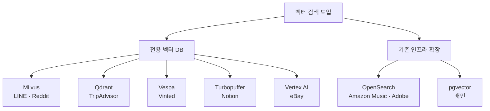

# 벡터 DB를 실제로 도입한 사례 — 빅테크 프로덕션

벡터 DB를 공부하다 보면 "실제 큰 서비스가 전용 벡터 DB를 운영에 올린 사례"가 궁금하다.
ANN 라이브러리(FAISS·Annoy)나 임베딩 모델이 아니라, **벡터 DB 제품을 프로덕션에 도입한** 사례를 회사 엔지니어링 블로그(1차 출처) 중심으로 모았다.

## 한눈에

| 회사 | 도입 | 규모 | use case |
| --- | --- | --- | --- |
| LINE VOOM | Milvus | — | 실시간 추천 |
| Reddit | Milvus | 3.4억 벡터 | 게시물 검색·추천 |
| TripAdvisor | Qdrant | 10억+ 벡터 | 멀티모달 검색 |
| eBay | Vertex AI Vector Search | 리스팅 19억+ | 광고 추천 |
| Vinted | Vespa | — | 추천 retrieval(FAISS 대체) |
| Notion | Turbopuffer | 100억+ 벡터 | RAG Q&A |
| Amazon Music | OpenSearch | 10.5억 벡터 | 음악 추천 |
| Adobe Acrobat | OpenSearch | 수억 사용자 | RAG 인용·출처 |
| 우아한형제들(배민) | pgvector(RDS) | — | 위치 기반 추천 |

```mermaid
flowchart TD
    A[벡터 검색 도입] --> B[전용 벡터 DB]
    A --> C[기존 인프라 확장]
    B --> M[Milvus<br/>LINE · Reddit]
    B --> Q[Qdrant<br/>TripAdvisor]
    B --> V[Vespa<br/>Vinted]
    B --> T[Turbopuffer<br/>Notion]
    B --> X[Vertex AI<br/>eBay]
    C --> O[OpenSearch<br/>Amazon Music · Adobe]
    C --> P[pgvector<br/>배민]
```

---

## 전용 벡터 DB 도입

### LINE VOOM — Milvus

LINE 의 숏폼 피드 VOOM 은 실시간 추천에 Milvus 를 도입했다. 오프라인 배치(최대 하루 지연)에서 온라인 즉시 유사도 검색으로 바꿔, 당일 게시물의 당일 노출이 크게 늘었다. Qdrant 와 비교해(2,406 req/s vs 326 req/s, 인덱스 10종 vs 1종, storage-compute 분리) Milvus 를 골랐고, 2년 넘게 프로덕션 운영 중이다.

### Reddit — Milvus

Reddit 의 벡터 검색은 원래 Vertex AI Vector Search·Solr ANN·FAISS 사이드카로 파편화돼 있었다. 이걸 하나로 통합하려고 11개 후보를 가중치 점수로 정성 평가한 뒤, Qdrant 와 Milvus 두 개로 좁혀 약 3.4억 벡터(384차원)를 K6 로 정량 벤치마크했다(Qdrant v1.12, Milvus v2.4, 둘 다 HNSW·M=16·efConstruction=100).

노드 구성부터 철학이 달랐다 — Qdrant 는 동종(homogeneous) 노드로, Milvus 는 쿼리·인덱싱·수집·프록시를 분리한 이종(heterogeneous) 노드로 실험했다. 레플리케이션 팩터(RF) 1과 2를 각각 비교한 결과가 결정적이었다. RF=1·필터 없음 조건에서는 정성 점수(Qdrant 292 vs Milvus 281)와 지연시간(P99) 모두 Qdrant 가 앞섰다. 그런데 RF=2·초당 400 쿼리 이상으로 부하를 올리자 Milvus 는 안정적으로 버텼고 Qdrant 는 요청을 완료하지 못하는 실패가 발생했다.

최종 선택은 Milvus 였다 — 이유는 **확장성**과 **Golang 기반이라는 조직 적합성**(Rust 인 Qdrant 보다 팀이 기여하기 쉬움)이었다. Reddit 은 원문에서 "많은 테스트에서 Qdrant 의 원시 지연시간이 더 나았다"는 점을 스스로 인정한다 — 성능 1등이 최종 선택으로 이어지지 않은 대표 사례다. 시간 제약으로 Vespa·Weaviate 는 정량 테스트에서 제외됐다.

### TripAdvisor — Qdrant

11M+ 업체·10억+ 리뷰 규모의 리뷰·이미지 멀티모달 벡터를 Qdrant 로 서빙한다([Qdrant 공식 케이스 스터디](https://qdrant.tech/blog/case-study-tripadvisor/), [TripAdvisor 기술 블로그](https://medium.com/tripadvisor/evolving-tripadvisor-search-building-a-semantic-search-engine-for-travel-recommendations-830f464318b7)). Elasticsearch·Milvus·Weaviate·Pinecone 과 비교했는데, 원문이 밝힌 선택 기준은 **고성능 벡터 검색**과 **Geospatial Vector Search 지원** 두 가지뿐이다 — Reddit 처럼 정량 벤치마크 방법론을 공개하지는 않았다.

생성형 AI 트립 플래너 도입 후 관련 사용자의 매출이 2~3배 늘었고, 현재 지연시간은 약 200ms 수준이다(도입 전후 비교 수치는 아니다). LINE·Reddit 이 Milvus 를 택한 것과 달리 TripAdvisor 는 Qdrant 를 택했다 — 벡터 DB 선택에 정답이 하나가 아님을 보여준다. 인덱스 종류·샤딩 구성·recall/QPS 수치는 원문에 공개돼 있지 않다.

> 웹 검색 스니펫 중 "40초 → 6.5초로 단축"이라는 수치가 떠도는데, 앞서 언급한 1차 출처 두 곳 어디에도 없는 수치라 인용하지 않는다.

### eBay — Google Vertex AI Vector Search

eBay 의 광고 추천(Recs) 팀이 딥러닝 시맨틱 임베딩 검색에 Google Cloud 의 관리형 Vertex AI Vector Search 를 도입했다. 카탈로그 19억+ 리스팅, 초당 수천 TPS, p95 읽기 지연 4ms 미만(벤더 케이스 스터디 수치).

### Vinted — Vespa

유럽 최대 중고 패션 마켓 Vinted 는 개인화 홈 추천 retrieval 에 Vespa 를 도입하며 기존 FAISS 를 대체했다(전사 제거가 아니라 추천 retrieval 워크로드 한정 교체). 기존 FAISS 는 stateless K8s 위에서 read-only 인덱스를 주기적으로 재구축하는 방식이었는데, 메타데이터 사전 필터링(pre-filtering)을 못 했다 — 점수가 높은 아이템이라도 필터를 통과하지 못하면 추천 자체가 나가지 못하는 문제가 있었다.

2022년 여름 Vespa 와 Elasticsearch(HNSW, 둘 다 동일 알고리즘) 를 비교했다. 약 100만 문서(필드 12개 + 256차원 float32)를 GCP n1-standard-64(64 vCPU/236GB) 단일 인스턴스에서 ES 8.2.2 vs Vespa 8.17.19 로 테스트했다. 결과는 인덱싱 처리량 3.8배, CPU 포화 전 도달 가능 RPS 8배, P99 지연 Vespa 26ms vs ES 110ms(4.23배 차이)였다.

프로덕션에서는 content cluster 를 3개 그룹으로 나누고 서버당 56 코어를 배정해 전체 복제 구성으로 운영한다. 근사 검색(`approximate:true`)의 프로덕션 P99 지연은 약 50ms인데, 정확 검색(exact search)으로 전환하면 약 70ms(+40%)로 늘어난다 — recall 60-70% 수준인 근사 검색의 만족도 향상이 이 리소스 증가분을 정당화하지 못해 근사 검색을 그대로 유지했다. 도입 초기 가장 큰 장애물은 기술 자체가 아니라 팀의 Vespa 경험 부재였다.

### Notion — Turbopuffer

Notion 은 2023년 11월 AI Q&A(워크스페이스 RAG)를 출시하자마자 규모 문제에 부딪혔다.
스토리지·컴퓨트가 결합된 전용 pod 클러스터로 시작했는데, 출시 한 달 만에 초기 인덱스가 용량 한계에 다가섰고 초기 온보딩 속도로는 하루 수백 개 워크스페이스밖에 못 받아 대기열이 쌓였다.
벡터 DB 공급사가 uptime 기준으로 과금해 과다 프로비저닝 비용도 커졌다.

전환은 한 번이 아니라 세 단계로 진행됐다.
먼저 스토리지·컴퓨트를 분리한 서버리스 인덱스로 옮겨 최대 사용량 대비 비용을 50% 줄였다.
이어 2024년 말부터 2025년 1월까지 object-storage 기반 벡터 DB 인 Turbopuffer 로 전체 코퍼스(수십억 개 객체)를 완전히 재인덱싱하며 이전했다.
Turbopuffer 는 네임스페이스 하나를 독립 인덱스로 취급해, 기존의 세대(generation) 기반 라우팅·샤딩 로직을 없앨 수 있었다는 점이 선택 이유로 꼽혔다.
마이그레이션과 동시에 임베딩 모델도 상위 모델로 교체했다.

2025년 7월에는 텍스트·메타데이터 변경분만 감지해 다시 임베딩하는 Page State 시스템(스팬마다 64비트 xxHash 두 종류를 추적, DynamoDB 캐싱)을 도입해 임베딩 대상 데이터량을 70% 줄였고, 임베딩 파이프라인도 Spark(EMR) 에서 Ray(Anyscale) 로 옮겨 CPU 전처리와 GPU 임베딩을 같은 노드에서 파이프라이닝했다.

결과는 다음과 같다(Notion 자체 보고).

| 지표 | 결과 |
| --- | --- |
| 일일 온보딩 처리량 | 600배 증가 |
| 활성 워크스페이스 | 15배 증가 |
| 벡터 DB 용량 | 8배 확장 |
| 검색 엔진(Turbopuffer) 비용 | 60% 절감 |
| AWS EMR 컴퓨트 비용 | 35% 절감 |
| p50 쿼리 지연시간 | 70-100ms → 50-70ms |
| 임베딩 대상 데이터량 | 70% 감소(Page State) |

원문은 recall·precision 같은 검색 품질 지표는 공개하지 않았고, Turbopuffer 자체의 제약이나 벤치마크 방법론(경쟁 후보·측정 지표)도 구체적으로 밝히지 않았다.
Ray 마이그레이션도 "진행 중"이라고만 밝혀 임베딩 인프라 비용 절감분은 확정 수치가 아니다.

---

## OpenSearch — 기존 검색엔진에 벡터를 얹은 사례

앞서 "OpenSearch 도입 사례가 잘 안 보인다"고 했지만, **대규모 named 사례가 분명히 있다.** 다만 전용 벡터 DB 처럼 "새로 도입"이 아니라 기존 검색 인프라를 확장한 형태다.

- **Amazon Music** — OpenSearch 에서 **10.5억 벡터**를 관리하고 피크 약 **7,100 vector QPS** 로 음악 추천을 구동한다. 약 1억 곡을 임베딩해 다지역 실시간 추천. (AWS 공식 블로그의 구체 운영 지표라 마케팅 과장 우려 낮음)
- **Adobe Acrobat AI Assistant** — OpenSearch 를 RAG 인용·출처(attribution) 기능의 벡터 DB 로 쓴다. PDF 문서 RAG, 수억 사용자 규모.

우리 사내 RAG 도 OpenSearch 기반이라, 이 둘이 가장 직접적인 대규모 프로덕션 근거다.

> 참고: Uber 도 OpenSearch 로 15억+ 아이템(약 400차원) 벡터 검색을 다뤘는데, 자체 블로그가 이를 "2024년 프로토타입"으로 명시한다. 대규모 사례지만 "프로덕션 도입"으로 분류하긴 이르다.

---

## 국내 — 우아한형제들(배민)의 pgvector

배민 추천 프로덕트팀은 배달 가능 가게 2,000개 이상 지역에서 실시간으로 최소 1,000개 추천을 생성해야 하는 요구를 안고 있었다. 검토 계기는 2023년 10월 Amazon RDS for PostgreSQL 이 pgvector 0.5.0(HNSW 지원)을 발표한 것이었다.

평가는 2단계로 진행됐다. 1차(2023.6)는 Milvus·Redis Stack·Atlas MongoDB·OpenSearch 를 정성 검증했고, 2차(2023.10)는 Atlas MongoDB·OpenSearch·RDS(pgvector) 세 개로 좁혀 Locust 로 부하 테스트했다(데이터셋은 배민스토어 상품 임베딩, 정확한 벡터 개수는 원문에 없음). 비교 대상이던 Milvus 구성은 IVF_FLAT 인덱스(`nlist=128`, `nprobe=10`)였고, pgvector 는 거리 연산자(`<->` L2, `<#>` 내적, `<=>` 코사인)로 여러 벡터 쿼리를 `UNION ALL` 로 묶어 한 번에 실행했다.

부하 테스트 결과 RDS(pgvector)가 처리량(RPS)이 가장 높고 실패가 없었다. Atlas MongoDB 는 CPU 가 100%에 도달하면서 처리량이 정체됐고, OpenSearch 는 부하가 늘자 500 에러가 발생했다(정확한 ms/RPS 수치는 원문이 스크린샷 이미지로만 제공해 텍스트로는 옮기지 못한다). **Amazon RDS for PostgreSQL 의 pgvector** 를 최종 선택한 배경은 이 결과에, 이미 운영하던 RDS 인프라를 그대로 쓸 수 있다는 점이 더해진 것이다 — Pinecone 같은 상용 관리형 대신 기존 인프라와 OSS 를 우선했다.

핵심 한계는 "배달 가능한 가게"라는 강한 pre-filtering 요구였다. HNSW·IVFFlat 은 정적으로 구축된 인덱스라 배달 가능 여부 같은 런타임 필터를 반영하지 못하고, 후보가 좁게 필터링되면 ANN 대신 Exact-KNN(전체 스캔)으로 회귀해버렸다. 원문은 이를 풀 후속 과제로 필터링을 고려한 ANN(HQANN)을 언급했지만, 2025년 1월 기준 아직 구현되지 않았다.

> 이건 우리 멀티테넌시 고민과도 통한다 — 필터링이 강하면 "순수 벡터 성능"보다 "필터 + 기존 스택 적합성"이 선택을 가른다.

---

## 벡터 DB vs 라이브러리 — 구분이 필요하다

같은 "벡터 검색"이라도 **전용 DB 제품 도입**과 **라이브러리 자체 서빙**은 다르다. 다음은 후자라 위 목록에서 뺐다.

- **당근마켓** — FAISS 를 gRPC 로 감싼 자체 서빙(faiss-server). 전용 벡터 DB 제품이 아니라 라이브러리 래핑이다.
- **Spotify** — Voyager(자체 개발 in-process ANN 라이브러리). 역시 DB 제품이 아니다.
- 카카오 n2, 네이버 ColBERT 서빙도 같은 결(라이브러리·자체 구축)이라 제외했다.

---

## 정리 — 패턴

- **전용 벡터 DB**(Milvus·Qdrant·Vespa·Turbopuffer·Vertex AI)는 벡터를 위해 새로 도입하는 길이다.
- **기존 인프라 확장**(OpenSearch·pgvector)은 이미 쓰던 검색엔진·RDB 에 벡터를 얹는 길이다. Amazon Music·Adobe·배민이 그 예다.
- **선택 기준은 성능만이 아니다.** Reddit(운영·조직 역량으로 Milvus), 배민(강한 필터링 + 기존 RDS 로 pgvector)처럼, 규모·필터링·기존 스택·비용·팀 역량이 함께 작용한다.
- 공통 use case 는 **검색·추천·RAG** 이고, 메타데이터 필터링을 거의 항상 동반한다.

벡터 DB 자체를 더 보려면 [Milvus 아키텍처](./milvus/milvus-architecture-and-performance.md)와 [벡터 DB 선택 가이드](./vectordb-comparison.md)를 참고.

---

## 참고 링크

- [LINE VOOM 대규모 벡터 DB (Milvus)](https://techblog.lycorp.co.jp/ko/large-scale-vector-db-for-real-time-recommendation-in-line-voom)
- [Reddit — Choosing a vector database for ANN search (Milvus)](https://milvus.io/blog/choosing-a-vector-database-for-ann-search-at-reddit.md)
- [eBay uses Vertex AI Vector Search](https://cloud.google.com/blog/products/ai-machine-learning/ebay-uses-vertex-ai-vector-search-for-recommendations)
- [Vinted — Adopting Vespa for recommendation retrieval](https://vinted.engineering/2023/10/09/adopting-vespa-for-recommendation-retrieval/)
- [Notion — Two years of vector search](https://www.notion.com/blog/two-years-of-vector-search-at-notion)
- [Amazon Music — billion-scale k-NN with OpenSearch](https://aws.amazon.com/blogs/big-data/choose-the-k-nn-algorithm-for-your-billion-scale-use-case-with-opensearch/)
- [Adobe — AWS OpenSearch 고객 사례](https://aws.amazon.com/opensearch-service/customers/)
- [우아한형제들 — 벡터 검색 도입기 (pgvector)](https://techblog.woowahan.com/21027/)
